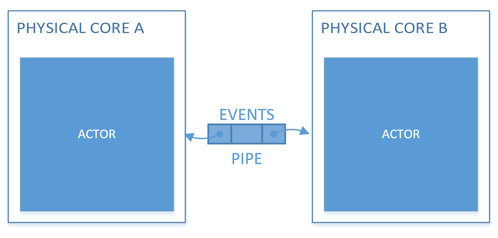

<p align="center"></p>

# C++ Actor Framework

[](https://en.wikipedia.org/wiki/C%2B%2B17)
[](https://github.com/isndev/qb/tree/master)
[](https://github.com/isndev/qb/tree/develop)
[](https://isndev.github.io/qb/)

**qb** provides technology solutions and services dedicated to high performance real-time complex processing, enabling low and predictable latency, perfect scalability and high throughput. 
It's a complete development framework for multicore processing that has been specifically designed for low latency and low footprint on multicore processors. 

**qb** is a thin-layer multicore-optimized runtime that enable users to build their own business-driven, jitter-free, low-latency, and elastic Reactive software based on the Actor model.

* #### Requirements
  - C++17 compiler, (g++ >= 7, clang >= 4, msvc >= 19.11)
  - (Recommended) cmake
  - (Recommended) Disable the HyperThreading to optimize your Physical Cores Cache
* #### Pros
  - Opensource
  - Cross-platform (Linux|Windows)
  - Easy to use
  - CPU cache friendly
  - Very fast and low-latency
  - Reusable code from a project to another
  - Forget everything about multi-threading concurrency issues
* #### Coins
  - Strong CPU usage
  - ...
  
# Actor Model
#### Introduction
Our CPUs are not getting any faster. What’s happening is that we now have multiple cores on them. If we want to take advantage of all this hardware we have available now, we need a way to run our code concurrently. Decades of untraceable bugs and developers’ depression have shown that threads are not the way to go.

#### Definition
The Actor model is a concurrent model of computation that treats "actors" as the universal primitives of concurrent computation.  
- The Actor sends event messages to be received by another Actor, which is then treated by an Event handler.
- The Event handler can execute a local function, create more actors, and send events to other Actors. In **qb** programming semantics, Actors shall be mono-threaded and non-blocking.
- The Event communication between Actors is done with an unidirectional communication channel called a Pipe. Hence, the Actor programming model is completely asynchronous and event-driven. 

<p align="center"></p>

#### qb + Actor Model
A program developed with **qb** is consisting of multiple Actors handling one or multiple Events, attached to PhysicalCores linked together with several Pipes.  
Once designed, the programming is broken down into coding mono-threaded and sequential Event handlers.  
Hence, the Actor model which is scalable and parallel by nature.  

**qb** runtime will handle all the rest and bridge the gap between parallel programming and hardware multicore complexity.

# Getting Started !
#### Example ping-pong project

- First, you'll have to create the project directory and cd into it
```bash
$> mkdir pingpong && cd pingpong
```
- Then clone the **qb** framework by doing:
```bash
$> git clone git@github.com:isndev/qb.git
```
- Next, create CMakeLists.txt file and paste the content below
```cmake
# CMakeLists.txt file
cmake_minimum_required(VERSION 3.10)
project(pingpong)

# qb minimum requirements
set(CMAKE_CXX_STANDARD 17)
set(CMAKE_CXX_STANDARD_REQUIRED ON)
set(QB_PATH "${CMAKE_CURRENT_SOURCE_DIR}/qb")

# Add qb framework
add_subdirectory(${QB_PATH})

# Define your project source
set(SOURCE main.cpp)

add_executable(pingpong ${SOURCE})
# Link target with qb-core library
target_link_libraries(pingpong qb-core)
```
- Create MyEvent.h file and define the event custom data
```cpp
// MyEvent.h 
#include <vector>
#include <qb/event.h>
#ifndef MYEVENT_H_
# define MYEVENT_H_
// Event example
struct MyEvent
 : public qb::Event // /!\ should inherit from qb event
{
    int data; // trivial data
    std::vector<int> container; // dynamic data
    // /!\ an event must never store an address of it own data
    // /!\ ex : int *ptr = &data;
    // /!\ avoid using std::string, instead use :
    // /!\ - fixed cstring
    // /!\ - pointer of std::string
    // /!\ - or compile with old ABI '-D_GLIBCXX_USE_CXX11_ABI=0'
};
#endif
```
- Create PinPongActor.h file and paste the code below
```cpp
// PingPongActor.h file
#include <qb/actor.h>
#include "MyEvent.h"
#ifndef PINGPONGACTOR_H_
# define PINGPONGACTOR_H_

class PingPongActor
        : public qb::Actor // /!\ should inherit from qb actor
{
    const qb::ActorId _id_pong; // Pong ActorId
public:
    PingPongActor(const qb::ActorId id_pong = {})
      : _id_pong(id_pong) {}
      
    // /!\ never call any qb::Actor functions in constructor
    // /!\ use onInit function 
    // /!\ the engine will call this function before adding PingPongActor
    bool onInit() override final {
        registerEvent<MyEvent>(*this);            // will listen MyEvent
        if (_id_pong) {                           // is Ping Actor
           auto &event = push<MyEvent>(_id_pong); // push MyEvent to Pong Actor and keep a reference to the event
           event.data = 1337;                     // set trivial data
           event.container.push_back(7331);       // set dynamic data
        }
        return true;                              // init ok
    }
    // will call this function when PingPongActor receives MyEvent 
    void on(MyEvent &event) {
        // print some data
        qb::io::cout() << "Actor id(" << id() << ") received MyEvent" << std::endl;
        if (!_id_pong)   // is Pong Actor
           reply(event); // reply the event to the Ping Actor           
        kill();          // Ping or Pong will die after receiving MyEvent
    }
};

#endif
```
- Then finally create the main.cpp
```cpp
// main.cpp file
#include <qb/main.h>
#include "PingPongActor.h"

int main (int argc, char *argv[]) {
    // (optional) initialize the qb logger
    qb::io::log::init(argv[0]); // filename
    
    // configure the Core 
    // Note : I will use only the core 0 and 1
    qb::Main main({0, 1});
    
    // Build Pong Actor to core 0 and retrieve its unique identifier
    auto id_pong = main.addActor<PingPongActor>(0); // default constructed
    // Build Ping Actor to core 1 with Pong id as parameter
    main.addActor<PingPongActor>(1, id_pong); // constructed with parameters

    main.start();  // start the engine asynchronously
    main.join();   // wait for the running engine
    // if all my actors had been destroyed then it will release the wait
    return 0;
}
```
Let's compile the project !
```sh
$> cmake -DCMAKE_BUILD_TYPE=Release -B[Build Directory Path] -H[CMakeList.txt Path]
$> cd [Build Directory Path] && make
```
Run it
```sh
$> ./pingpong
```
it should print
```
Actor id(XXXXXX) received MyEvent
Actor id(XXXXXX) received MyEvent
```
Done !

You want to do more, refer to the wiki

### [Wiki](https://github.com/isndev/qb/wiki)
*  [Build]() - Build options
*  [Initialization]() - Core initialization
*  [Actor API]() - All about qb::Actor
*  [Event API]() - Sending/Receiving events
*  [Logger]() - Fast Multithreaded builtin logger
*  [Documentation](https://isndev.github.io/qb/) - Full documentation

### Todos
  - [ ] Make Wiki Documentation (0%)
  - [ ] Add VirtualCore throughtput policy to manage the cpu usage (0%)

License
----

Apache Version 2.0

**isndev** Free Software, Hell Yeah!
