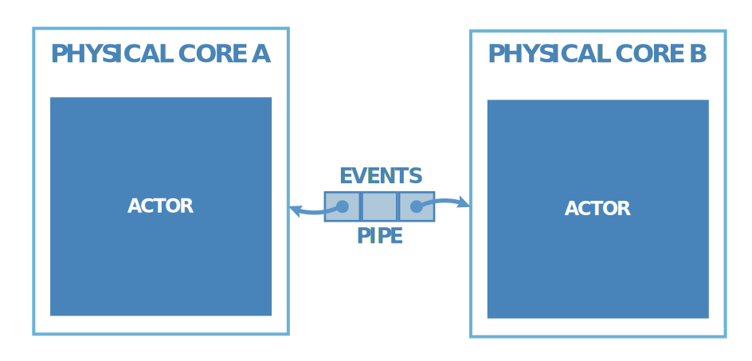

<p align="center"></p>

# C++ Actor Framework

[](https://en.wikipedia.org/wiki/C%2B%2B17)
[](https://www.codacy.com/app/isndev/qb?utm_source=github.com&amp;utm_medium=referral&amp;utm_content=isndev/qb&amp;utm_campaign=Badge_Grade)
[](https://travis-ci.org/isndev/qb)
[](https://codecov.io/gh/isndev/qb)
[](https://isndev.github.io/qb/)

**qb** provides technology solutions and services dedicated to high performance real-time complex processing, enabling low and predictable latency, perfect scalability and high throughput. It's a complete development framework for multicore processing that has been specifically designed for low latency and low footprint on multicore processors.

The **qb** framework is a thin-layer multicore-optimized runtime that enable users to build their own business-driven, jitter-free, low-latency, and elastic Reactive software based on the Actor model.

## Why you need it
  - *It's* Easy to use, **modular** and **painless**, forget everything about multi-threading concurrency issues
  - *It's* Very fast and low-latency
  - *It's* CPU cache friendly
  - *It's* Cross-platform (Linux|Windows|macOS*)
  - *It's* Opensource
  
<sub>*Limited thread **affinity** because of **osx** scheduler</sub>
## Requirements
  - C++17 compiler, (g++ >= 7, clang >= 4, msvc >= 19.11, Xcode >= 10.2)
  - (Recommended) cmake
  - (Recommended) Disable the HyperThreading to optimize your Physical Cores Cache

## Build Status
|              |  |  |  | Coverage |
|:------------:|:-----:|:-------:|:--------:|:--------:|
|    master    | [](https://travis-ci.org/isndev/qb) | [](https://ci.appveyor.com/project/isndev/qb/branch/master) | [](https://travis-ci.org/isndev/qb) |  |

## Current development
#### qb Version 2
- *It's* globally faster
- *It's* introducing new event **QOS** (quality of service) strategies
- *It's* adding a new way to manage **inputs/outputs** and **external** communications
- *It's* working on **arm** architectures
- *It's* adding more **samples** and tutorials
- *It's* releasing official benchmarks
- *and more...*

#### qb Visual Monitoring Tools
- **Monitor**, **analyze** and **debug** your software with **qb Visual Monitoring Tools**

#### qb UAML* Tool
- **Design** and **generate** your software architecture with **qb UAML Tool**

<sub>*Unified Actor Modeling Language</sub>

# The Actor Model

In order to fuly take advantage of cpu cores power, we needed a way to run our code concurrently. Decades of untraceable bugs and developers depressions have shown that **threads were not the perfect solution**.

In **qb** programming semantics, the **Actor model** is an universal primitive of concurrent computation.

Actors are:
- Mono-threaded
- Non-blocking
- Completely asynchronous
- Event-driven

Actors roles:
- The Actor A sends event messages to Actor B, which is then treated by an **Event handler**.
- The Event communication between Actors is done with an **unidirectional communication** channel called a **Pipe**.
- The Event handler can:
    - **Execute** a local function
    - **Create** Actors
    - **Send** events to other Actors

<p align="center"></p>

#### qb + Actor Model
By design, developing with **qb** is about having multiple **actors** handling one/multiple **events** that are attached to **cores** and communicate through **pipes**.

Once designed, the Actor model is scalable and parallel by default as the program is divided into **mono-threaded** and sequential event handlers.

**qb** runtime handles all the rest and bridge the gap between parallel programming and hardware multicore complexity.

# Getting Started !
#### Start from existing **qb** sample project
To **generate** a new ***boilerplate*** **qb** project, you can use the [qb-new-project.sh](https://github.com/isndev/qb/blob/master/script/qb-new-project.sh) script using cURL:

```sh
curl -o- https://raw.githubusercontent.com/isndev/qb/master/script/qb-new-project.sh | bash /dev/stdin [Project Name]
```

or Wget:

```sh
wget -qO- https://raw.githubusercontent.com/isndev/qb/master/script/qb-new-project.sh | bash /dev/stdin [Project Name]
```

<sub>The script creates a new boilerplate project copied from [qb-sample-project](https://github.com/isndev/qb-sample-project) repository to a new **git** bare repository into `[Project Name]` directory.</sub>

Let's compile the project !

```sh
$> cd [Project Name]
$> cmake -DCMAKE_BUILD_TYPE=Release -B[Build Directory Path] -H[CMakeList.txt Path]
$> cd [Build Directory Path] && make
```

<sub>**Note:** you can add otions to cmake command, `-DQB_BUILD_TEST=ON` to build tests and `-DQB_BUILD_BENCHMARK=ON` to build benchmarks.</sub>
 
#### Start from scratch
<sub>Example ping-pong project</sub>

- Clone **qb** framework and cd:
```bash
$> mkdir pingpong && cd pingpong && git clone git@github.com:isndev/qb.git
```
- Then create CMakeLists.txt file and paste the content below
<details close>
<summary>View code</summary>

```cmake
# CMakeLists.txt file
cmake_minimum_required(VERSION 3.10)
project(pingpong)

# qb minimum requirements
set(CMAKE_CXX_STANDARD 17)
set(CMAKE_CXX_STANDARD_REQUIRED ON)
set(QB_PATH "${CMAKE_CURRENT_SOURCE_DIR}/qb")

# Add qb framework
add_subdirectory(${QB_PATH})

# Define your project source
set(SOURCE main.cpp)

add_executable(pingpong ${SOURCE})
# Link target with qb-core library
target_link_libraries(pingpong qb-core)
```
</details>


- Define your first event with its custom data <br>
  MyEvent.h :
<details close>
<summary>View code</summary>

```cpp
// MyEvent.h
#include <vector>
#include <qb/event.h>
#ifndef MYEVENT_H_
# define MYEVENT_H_
// Event example
struct MyEvent
 : public qb::Event // /!\ should inherit from qb event
{
    int data; // trivial data
    std::vector<int> container; // dynamic data
    // /!\ an event must never store an address of it own data
    // /!\ ex : int *ptr = &data;
    // /!\ avoid using std::string, instead use :
    // /!\ - fixed cstring
    // /!\ - pointer of std::string
    // /!\ - or compile with old ABI '-D_GLIBCXX_USE_CXX11_ABI=0'
};
#endif
```
</details>

- Let's define the PingActor <br>
  PingActor will send MyEvent to PongActor, receive the response and kill himself <br>
  PingActor.h :
<details close>
<summary>View code</summary>

```cpp
// PingActor.h file
#include <qb/actor.h>
#include "MyEvent.h"
#ifndef PINGACTOR_H_
# define PINGACTOR_H_

class PingActor
        : public qb::Actor // /!\ should inherit from qb actor
{
    const qb::ActorId _id_pong; // Pong ActorId
public:
    PingActor() = delete; // PingActor requires PongActor Actorid
    // /!\ never call any qb::Actor functions in constructor
    // /!\ use onInit function
    explicit PingActor(const qb::ActorId id_pong)
      : _id_pong(id_pong) {}

    // /!\ the engine will call this function before adding PingPongActor
    bool onInit() override final {
        registerEvent<MyEvent>(*this);         // will listen MyEvent
        auto &event = push<MyEvent>(_id_pong); // push MyEvent to PongActor and keep a reference to the event
        event.data = 1337;                     // set trivial data
        event.container.push_back(7331);       // set dynamic data

        // debug print
        qb::io::cout() << "PingActor id(" << id() << ") has sent MyEvent" << std::endl;
        return true;                           // init ok
    }
    // will call this function when PingActor receives MyEvent
    void on(MyEvent &event) {
        // debug print
        qb::io::cout() << "PingActor id(" << id() << ") received MyEvent" << std::endl;
        kill(); // then notify engine to kill PingActor
    }
};

#endif
```
</details>

- Let's define the PongActor <br>
  PongActor will just listen on MyEvent, reply the event and kill himself <br>
  PongActor.h :
<details close>
<summary>View code</summary>

```cpp
// PongActor.h file
#include <qb/actor.h>
#include "MyEvent.h"
#ifndef PONGACTOR_H_
# define PONGACTOR_H_

class PongActor
        : public qb::Actor // /!\ should inherit from qb actor
{
public:
    // /!\ never call any qb::Actor functions in constructor
    // /!\ use onInit function
    PongActor() = default;

    // /!\ the engine will call this function before adding PongActor
    bool onInit() override final {
        registerEvent<MyEvent>(*this);         // will just listen MyEvent

        return true;                           // init ok
    }
    // will call this function when PongActor receives MyEvent
    void on(MyEvent &event) {
        // debug print
        qb::io::cout() << "PongActor id(" << id() << ") received MyEvent" << std::endl;
        reply(event); // reply the event to SourceActor
        // debug print
        qb::io::cout() << "PongActor id(" << id() << ") has replied MyEvent" << std::endl;
        kill(); // then notify engine to kill PongActor
    }
};

#endif
```
</details>

- Then finally create the main.cpp
<details close>
<summary>View code</summary>

```cpp
// main.cpp file
#include <qb/main.h>
#include "PingActor.h"
#include "PongActor.h"

int main (int argc, char *argv[]) {
    // (optional) initialize the qb logger
    qb::io::log::init(argv[0]); // filename

    // configure the Engine
    // Note : I will use only the core 0 and 1
    qb::Main main({0, 1});

    // Build Pong Actor to core 0 and retrieve its unique identifier
    auto id_pong = main.addActor<PongActor>(0); // default constructed
    // Build Ping Actor to core 1 with Pong ActorId as parameter
    main.addActor<PingActor>(1, id_pong); // constructed with parameters

    main.start();  // start the engine asynchronously
    main.join();   // wait for the running engine
    // if all my actors had been destroyed then it will release the wait
    return 0;
}
```
</details>

Let's compile the project !
```sh
$> cmake -DCMAKE_BUILD_TYPE=Release -B[Build Directory Path] -H[CMakeList.txt Path]
$> cd [Build Directory Path] && make
```
Run it
```sh
$> ./pingpong
```
it should print
```
PingActor id(XXXXXX) has sent MyEvent
PongActor id(XXXXXX) received MyEvent
PongActor id(XXXXXX) has replied MyEvent
PingActor id(XXXXXX) received MyEvent
```
Done !

You want to do more, refer to the full [Documentation](https://isndev.github.io/qb/)

License
----


**[isndev.com](https://isndev.com)** Free Software, Hell Yeah!
