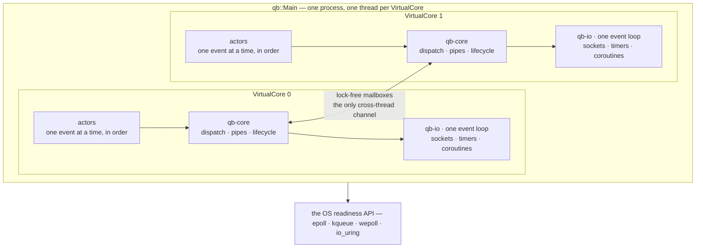
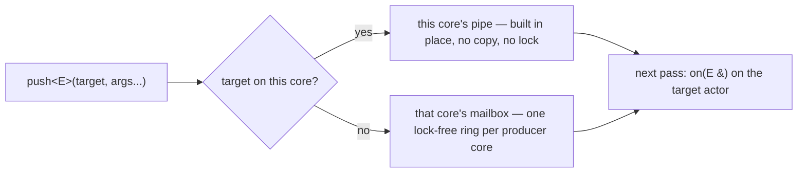
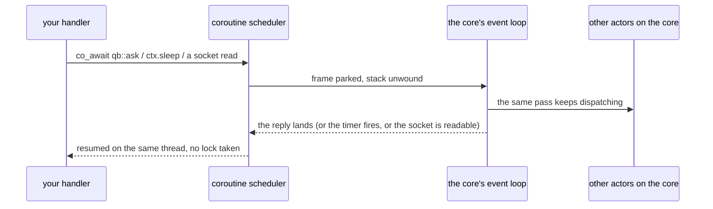
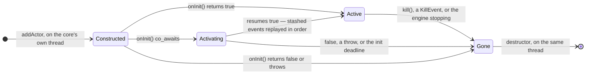

<!-- Verified-against: qb 3.2.1 (C++20 default, C++23 supported) -->

# qb Actor Framework

<p align="center"></p>

qb is a C++20 framework for concurrent and distributed systems, built on the actor model. It pairs
share-nothing actors with a non-blocking I/O runtime and native C++20 coroutines, so application code
says *what* happens on each message while the runtime owns scheduling, multicore placement and I/O.
It is also measured: against CAF and SObjectizer on the Savina suite, qb is the fastest of the three
in every cell on each of four hosts, and at or under a raw-thread floor in most two-core cells. The
numbers are [below](#measured); the protocol, the raw documents and the losses are public, in
[qb-vs-others](https://github.com/isndev/qb-vs-others).

[](https://github.com/isndev/qb/actions/workflows/cmake.yml)
[](https://github.com/isndev/qb/releases/latest)
[](https://en.cppreference.com/w/cpp/20)
[](https://cmake.org/)
[](#platforms-and-toolchains)
[](#platforms-and-toolchains)
[](./LICENSE)

**Contents** — [Hello, actor](#hello-actor) · [The model in four pictures](#the-model-in-four-pictures) ·
[Ask, and await the answer](#ask-another-actor-and-await-the-answer) · [Everyday idioms](#everyday-idioms) ·
[Why qb](#why-qb) · [Measured](#measured) · [Install](#install) · [Platforms](#platforms-and-toolchains) ·
[What is in the box](#what-is-in-the-box) · [Build options](#build-options) · [Documentation](#documentation)

## Hello, actor

```cpp
#include <qb/main.h>
#include <qb/actor.h>
#include <qb/io.h>

struct Greeting : qb::Event {
    qb::string<64> text;
    explicit Greeting(const char *t) : text(t) {}
};

class Greeter : public qb::Actor {
public:
    qb::io::async::task<bool> onInit() final {
        registerEvent<Greeting>(*this);      // subscribe
        push<Greeting>(id(), "hello");       // send to self, in order
        co_return true;                      // the actor is live
    }
    void on(const Greeting &e) {
        qb::io::cout() << e.text << '\n';
        kill();                              // done
    }
};

int main() {
    qb::Main engine;
    engine.addActor<Greeter>(0);             // core 0
    engine.start();
    engine.join();                           // until every actor has stopped
    return engine.hasError() ? 1 : 0;
}
```

No mutex, no condition variable, no shared queue: an actor owns its state and is reached only by
messages, which the engine delivers in order and processes one at a time.

The one oddity is deliberate. The payload is `qb::string<64>`, not `std::string`, because an event is
moved by raw `memcpy` — the bytes are copied to a new address and the source is abandoned without a
destructor — so no member may point into its own storage. A short `std::string` on libstdc++ does
(its inline buffer), and is therefore illegal as a by-value payload; [`qb::string<N>`](./readme/0_foundations/containers.md),
plain data, `std::unique_ptr`, `std::shared_ptr` and `std::vector` are all fine. C++20 has no
`is_trivially_relocatable`, so there is no compile-time check —
[Inter-actor messaging](./readme/4_qb_core/messaging.md) has the mechanism and its debug-only guard.

## The model in four pictures

**One process, one thread per core.** A `qb::VirtualCore` is a worker thread that owns its actors
and drives exactly one event loop. The loop polls sockets, fires timers, resumes coroutines and
dispatches your handlers, in the same pass and on the same thread. The only cross-thread channel is
the mailbox, one lock-free ring per producer core; nothing else in the runtime is shared.


```mermaid
flowchart TB
    subgraph proc["qb::Main — one process, one thread per VirtualCore"]
        direction LR
        subgraph c0["VirtualCore 0"]
            direction TB
            a0["actors<br/>one event at a time, in order"] --> s0["qb-core<br/>dispatch · pipes · lifecycle"] --> l0["qb-io · one event loop<br/>sockets · timers · coroutines"]
        end
        subgraph c1["VirtualCore 1"]
            direction TB
            a1["actors<br/>one event at a time, in order"] --> s1["qb-core<br/>dispatch · pipes · lifecycle"] --> l1["qb-io · one event loop<br/>sockets · timers · coroutines"]
        end
        s0 <-- "lock-free mailboxes<br/>the only cross-thread channel" --> s1
    end
    proc --> os["the OS readiness API — epoll · kqueue · wepoll · io_uring"]
```

**Where an event goes.** A `qb::ActorId` is `{ServiceId, CoreId}` in 32 bits, and the core half *is*
the routing decision: a send resolves the destination core and appends bytes to a buffer dedicated to
it. Nothing looks an actor up across a thread boundary, and the actor state path carries no lock, no
atomic and no fence. `push` is ordered per sender and receiver; `send` is unordered and reserved for
one-off notices.


```mermaid
flowchart LR
    P["push&lt;E&gt;(target, args...)"] --> R{"target on this core?"}
    R -- "yes" --> L["this core's pipe — built in place, no copy, no lock"]
    R -- "no" --> M["that core's mailbox — one lock-free ring per producer core"]
    L --> D["next pass: on(E &amp;) on the target actor"]
    M --> D
```

**What `co_await` gives back.** A coroutine suspends by *returning*: the stack unwinds to the
scheduler and the loop, every other actor and session on the core gets its turn, and the frame resumes
on the same thread when its reply, timer or socket is ready. Sequential-looking code compiles to a
state machine, not a thread.


```mermaid
sequenceDiagram
    participant H as your handler
    participant S as coroutine scheduler
    participant L as the core's event loop
    participant O as other actors on the core
    H->>S: co_await qb::ask / ctx.sleep / a socket read
    S->>L: frame parked, stack unwound
    L->>O: the same pass keeps dispatching
    L-->>S: the reply lands (or the timer fires, or the socket is readable)
    S-->>H: resumed on the same thread, no lock taken
```

**An actor's life.** `addActor` reserves an id and returns; the actor is constructed on its core's
thread, and `onInit()` runs once. If that coroutine suspends, the actor is *Activating*: unicast events
for it are stashed and replayed in order when it activates, broadcasts and kills still reach it, and an
init that returns `false`, throws or outlives its deadline (5 s by default) removes the actor before it
processes a message — reported by `Main::hasError()`, never thrown. `kill()`, or a `KillEvent` from
anyone, ends it: the handler calls already queued for it are skipped, its coroutine scope is cancelled,
and the destructor runs on the same thread. `Main::join()` returns when every actor has stopped.


```mermaid
stateDiagram-v2
    direction LR
    [*] --> Constructed: addActor, on the core's own thread
    Constructed --> Active: onInit() returns true
    Constructed --> Activating: onInit() co_awaits
    Activating --> Active: resumes true — stashed events replayed in order
    Activating --> Gone: false, a throw, or the init deadline
    Constructed --> Gone: onInit() returns false or throws
    Active --> Gone: kill(), a KillEvent, or the engine stopping
    Gone --> [*]: destructor, on the same thread
```

The long form of each picture: [threading model](./readme/2_core_concepts/threading_model.md),
[messaging](./readme/4_qb_core/messaging.md), [coroutines](./readme/3_qb_io/coroutines.md),
[the actor](./readme/4_qb_core/actor.md).

## Ask another actor, and await the answer

Request/reply is a free function and a `co_await`. The awaitable lives in the caller's frame: no
coroutine frame is allocated for the ask, the timeout is a deadline in the core's own clock, and the
reply comes back through the ordinary handler.

```cpp
#include <qb/main.h>
#include <qb/actor.h>
#include <qb/core/patterns.h>

using namespace std::chrono_literals;

// A request names its reply type: a Quote is answered with an int.
struct Quote : qb::Request<int> {
    int symbol{0};
    explicit Quote(int s) : symbol(s) {}
};

// The responder: an ordinary handler that answers in place.
class Market : public qb::Actor {
public:
    qb::io::async::task<bool> onInit() override {
        registerEvent<Quote>(*this);
        co_return true;
    }
    void on(Quote &q) {
        qb::answer(*this, q, [](Quote const &r) { return r.symbol * 100; });
    }
};

// The requester: asks from a coroutine, awaits the answer, then stops both actors.
class Trader : public qb::Actor {
    qb::ActorId _market;

public:
    explicit Trader(qb::ActorId market) : _market(market) {}

    qb::io::async::task<bool> onInit() override {
        registerEvent<Quote>(*this);                    // the reply arrives as a Quote
        spawn([market = _market](qb::ScopedCoroContext ctx) -> qb::io::async::task<void> {
            auto reply = co_await qb::ask<Quote>(ctx, market, 500ms, 42);
            qb::io::cout() << "quote " << reply.response << '\n';
            ctx.push_to<qb::KillEvent>(market);          // the two of us are done
            ctx.push<qb::KillEvent>();
        });
        co_return true;
    }
    void on(Quote &q) { resolve_ask(q); }               // hands the reply to the waiting co_await
};

int main() {
    qb::Main engine;
    auto market = engine.addActor<Market>(0);
    engine.addActor<Trader>(1, market);                 // core 1: the reply crosses a thread
    engine.start();
    engine.join();
    return engine.hasError() ? 1 : 0;
}
```

The lambda captures the id by value and never `this`: the actor may be destroyed while the coroutine
is suspended, and the context is the only legal way back to it. `qb::ask` throws `timeout_error` if
the deadline passes and `cancelled_error` if the actor is killed while waiting; a reply that lands
after the timeout reaches `on(Quote &)` as an ordinary, unsolicited event, which is what `resolve_ask`
returning `false` means. Streams (`qb::ask_stream`), scatter-gather (`qb::ask_all`, `qb::ask_any`),
discovery (`qb::require<T>`) and deadlines shared across a chain (`qb::ask_by`) are in the
[pattern library](./readme/4_qb_core/patterns_library.md).

## Everyday idioms

Three things every service needs, in the shape the runtime wants them. Each excerpt is taken from a
program that compiles and runs against this release.

**A delay, an interval.** A wait that touches the actor is a coroutine sleep bound to the actor's
cancellation scope — never a blocking call, never a loop-owned timer that holds `this`:

```cpp
class Ticker : public qb::Actor {
    int _ticks{0};

    void arm(std::chrono::milliseconds every) {
        spawn([every](qb::ScopedCoroContext ctx) -> qb::io::async::task<void> {
            co_await ctx.sleep(every);              // a real timer; cancelled if the actor is killed
            ctx.push<Tick>();                       // back on the actor, in on(Tick const &)
        });
    }

public:
    qb::io::async::task<bool> onInit() override {
        registerEvent<Tick>(*this);
        arm(10ms);
        co_return true;
    }
    void on(Tick const &) {
        qb::io::cout() << "tick " << ++_ticks << '\n';
        if (_ticks < 3) arm(10ms);                  // re-arm: a delay becomes an interval
    }
};
```

**Work on every pass.** `qb::ICallback` is the every-turn hook, not a timer: `on(qb::LoopEvent const &)`
runs each time the core's loop turns, microseconds apart, and the whole core waits on it.

```cpp
class Sampler : public qb::Actor, public qb::ICallback {
    int _passes{0};

public:
    qb::io::async::task<bool> onInit() override {
        registerCallback(*this);                    // on(LoopEvent) runs every turn of the core's loop
        co_return true;
    }
    void on(qb::LoopEvent const &) override {       // fast and non-blocking: the whole core waits on it
        if (++_passes == 1000) { qb::io::cout() << "1000 passes\n"; unregisterCallback(); }
    }
};
```

**Find actors, address everyone.** Ids travel through constructors, discovery is a `co_await`, and a
broadcast reaches every actor on every core:

```cpp
auto found = co_await qb::require<Ticker>(context(), 200ms);   // every live Ticker, on any core
broadcast<Stop>();                                             // to every actor on every core
```

A `qb::ServiceActor<Tag>` is the one-per-core form of an actor reached by type rather than by id:
`getService<T>()` finds it on the same core, and `getServiceId<Tag>(core)` computes its id for any
core with no lookup at all. Every idiom above is a running program in
[qb-examples](https://github.com/isndev/qb-examples), tier `01-actors`.

## Why qb

- **One address, one decision.** Routing is a 32-bit compare, and the state path is lock-free by
  construction, not by discipline: `_alive` is a plain `bool` on purpose
  ([threading model](./readme/2_core_concepts/threading_model.md)).
- **One loop, two jobs.** I/O is not a subsystem an actor talks to; it is the same crank that
  dispatches events. A server actor is a mixin over its own loop, and a database client held by an
  actor needs no pump ([network actors](./readme/5_core_io_integration/network_actors.md)).
- **Coroutines that give the core back.** The 2-core park cell of the ping-pong benchmark went from
  26.24 µs to 153 ns per round trip when the park moved inside the loop and the wake stopped being a
  lost signal — a throughput property, measured, not a style
  ([`run_sync` belongs only where the thread is yours to block](./readme/5_core_io_integration/async_in_actors.md#the-two-call-chains)).
- **The type system catches the time bugs.** `qb::duration` is `std::chrono::nanoseconds`, so
  `setLatency(500)` does not compile; `qb::mono_time` and `qb::wall_time` are distinct types, so a
  monotonic deadline can never be compared to wall-clock time
  ([the time vocabulary](./readme/0_foundations/time.md)).

### What it costs

Four things, honestly. None of them produces a compile error, which is exactly why the documentation
exists:

| Cost | Where it is documented |
|---|---|
| An event is `memcpy`-relocated and its source destructor never runs, so a payload must be trivially **relocatable**, not merely copyable — and C++20 has no trait for that. | [messaging.md](./readme/4_qb_core/messaging.md) |
| The reference `push` returns lives until your **handler returns** — across further pushes, since the pipe is segmented and never moves an event — but not across a `co_await` and never in a member. | [buffers.md](./readme/0_foundations/buffers.md) |
| Blocking the calling thread inside a handler freezes every actor on that core, with no diagnostic. | [async_in_actors.md](./readme/5_core_io_integration/async_in_actors.md) |
| The runtime allocates in proportion to the square of the core count and never shrinks — about 4.5 MiB at rest on 8 cores, 20–21 MiB once every pipe has carried an event, 1.26 GiB in that state on 64. | [buffers.md](./readme/0_foundations/buffers.md) |

## Measured

The comparison lives in its own public repository, [qb-vs-others](https://github.com/isndev/qb-vs-others):
qb, [CAF](https://github.com/actor-framework/actor-framework) 1.1.0 and
[SObjectizer](https://github.com/stiffstream/sobjectizer) 5.8.5.1 on the
[Savina](https://github.com/shamsimam/savina) shapes, every framework built from source in one
project under one set of flags, every worker pinned through its own public API, every cell verified
by the harness — a framework that loses one message in a million produces no timing at all — and a
raw `std::thread` + SPSC-ring **floor** that is not a framework and is never ranked as one.

One core, spin, nanoseconds per unit — qb, the second-fastest framework, the floor (WSL2 Debian 13
g++ 14.2 and Windows 11 MSVC 19.51 on one i9-12900K, pinned, 9 repetitions + 2 warm-up, one quiet
session per host, 2026-09-13):

| shape (unit) | g++-14: qb · second · floor | MSVC 19.51: qb · second · floor |
|---|---|---|
| ping-pong (round trip) | **22** · SObjectizer 139 · 2 | **30** · SObjectizer 182 · 2 |
| counting (message) | **7** · SObjectizer 105 · 3 | **10** · SObjectizer 139 · 3 |
| thread-ring (hop) | **17** · SObjectizer 70 · 3 | **18** · SObjectizer 91 · 9 |
| fork-join (message) | **8** · SObjectizer 103 · 3 | **11** · SObjectizer 139 · 5 |
| big (round trip) | **18** · SObjectizer 133 · 7 | **17** · SObjectizer 183 · 11 |

Two cores, the cells that decide a ranking, measured as a census of twelve interleaved launches
(median of the launch medians; the floor's SPSC ring pays one cache line per message where qb's
producer publishes a batch):

| cell | qb | CAF | floor |
|---|---|---|---|
| ping-pong 2c, g++-14 | **155.9** | 279.6 | 182.9 |
| thread-ring 2c, g++-14 | **75.4** | 140.3 | 103.1 |
| ping-pong 2c, MSVC | **186.8** | 475.8 | 180.8 |
| thread-ring 2c, MSVC | **105.1** | 235.4 | 112.4 |
| ping-pong 2c, Apple M4 Pro (unpinned) | **196.4** | 386.6 | 237.7 |
| ping-pong 2c, arm64 Linux guest | **172.0** | 297.4 | 207.1 |

Across all eight shapes and four hosts qb is the fastest framework in every cell; the geometric mean
of qb over the best rival is 0.13 on the x86-64 hosts, 0.105 on macOS and 0.139 on the arm64 guest.
CAF's two-core cells run on one thread and still lose to a two-thread one by 1.8–2.5×.

**Where qb loses, named.** Not against a framework, and not against its previous release, but
against the floor in two kinds of cell and against itself between compilers: the one-core cells
whose floor is a bare function call (qb pays 7–22 ns per unit for the mailbox, the pipe and the
dispatch, 2.4–2.7× a floor of a few nanoseconds); `fib`, an actor created and destroyed per unit, and
`bank-transaction`, an `ask` round trip per transfer, at 3–4× their floors even after the actor arena
and the frame-free ask of 3.2; and MSVC against g++ on the same source, +28 % at one core, half of
which clang-cl recovers.

**Everything else is in the benchmark repository, and it is public.** Read the protocol first,
[FAIRNESS.md](https://github.com/isndev/qb-vs-others/blob/main/FAIRNESS.md) — the checksum every
cell must reproduce, the pinning, the one-build rule, what the numbers cannot tell you. Then every
table, regenerated from the JSON it summarises ([REPORT.md](https://github.com/isndev/qb-vs-others/blob/main/REPORT.md));
the configuration sweeps, the findings qb took from the field and where it still loses
([docs/TUNING.md](https://github.com/isndev/qb-vs-others/blob/main/docs/TUNING.md)); what each
framework offers, cited to its source ([docs/FEATURES.md](https://github.com/isndev/qb-vs-others/blob/main/docs/FEATURES.md));
the right of reply, under which a correct, idiomatic, faster implementation replaces ours and the
tables are regenerated even when that makes qb lose ([docs/CHALLENGE.md](https://github.com/isndev/qb-vs-others/blob/main/docs/CHALLENGE.md));
and each host's session, controls and censuses under `results/<host>/`. qb's own micro-benchmarks,
45 Google Benchmark binaries under `QB_BUILD_BENCHMARKS` (62 with the three modules'), are described in
[benchmarks.md](./readme/7_reference/benchmarks.md).

## Install

**FetchContent**, no submodules:

```cmake
include(FetchContent)
FetchContent_Declare(qb GIT_REPOSITORY https://github.com/isndev/qb.git
                        GIT_TAG main)        # main is the released line; pin a vX.Y.Z tag in production
FetchContent_MakeAvailable(qb)
target_link_libraries(my_app PRIVATE qb::core qb::io)
```

**A source tree you already have**, or **an installed copy**:

```cmake
add_subdirectory(qb)                          # embed
target_link_libraries(my_app PRIVATE qb::core qb::io)

find_package(qb CONFIG REQUIRED)              # or consume a prefix built with QB_INSTALL=ON
target_link_libraries(my_app PRIVATE qb::core qb::io)
```

**A whole project**, from the [`qb-sample-project`](https://github.com/isndev/qb-sample-project)
template — fetch the script, read it, run it; it creates nothing outside the directory it names:

```bash
curl -fsSL https://raw.githubusercontent.com/isndev/qb/main/script/qb-new-project.sh -o qb-new-project.sh
bash qb-new-project.sh MyProject && cd MyProject
cmake -DCMAKE_BUILD_TYPE=Release -B build && cmake --build build --parallel && ctest --test-dir build
```

The generated project fetches qb and the modules at the release the script ships with and carries a
ctest suite and a CI workflow; `qb-new-module.sh` does the same for a module. Both are bash (WSL or
Git Bash on Windows). [INSTALL.md](./INSTALL.md) has the toolchain notes, the installed-prefix
contract and the scaffolding details.

**Build qb itself**:

```bash
git clone --recursive https://github.com/isndev/qb.git && cd qb
cmake -DCMAKE_BUILD_TYPE=Release -B build && cmake --build build --parallel
ctest --test-dir build --output-on-failure
```

## Platforms and toolchains

| OS | Architectures | Compilers | Standard library | Event loop backend | Verified by |
|---|---|---|---|---|---|
| Linux | x86-64, arm64 | GCC 14, Clang 19 and 22 | libstdc++ | epoll (default); io_uring at parity, opt-in; a parked core wakes under a millisecond on Linux ≥ 5.11 | CI on every push (x86-64, `epoll` and `iouring`); arm64 on the development superproject's self-hosted runner, every push there |
| macOS | Apple Silicon, x86-64 | Apple Clang | libc++ | kqueue | CI, every push |
| Windows | x86-64 | MSVC 19.5x, clang-cl | MSVC STL | wepoll over IOCP | the maintainer's gate before each release (`dev/agent/verify-windows.ps1`); the hosted CI job is disabled on purpose, and [INSTALL.md](./INSTALL.md#supported-toolchains) says why |

Clang older than 22 folds a by-value coroutine parameter into the caller's `byval` slot at the wrong
alignment (LLVM issue 159571); qb's own patterns carry the shield, and the Clang 19 lane exists to
prove it. Thread pinning is best-effort: `setAffinity` asks the OS and a refusal only warns, and on
Apple Silicon nothing is pinned — branch on `qb::CPU::ThreadPinningSupported()`, never on the call
returning ([the engine](./readme/4_qb_core/engine.md)).

## What is in the box

- **`qb-io`** — the runtime, with no reference to actors: one event loop per thread
  (`qb::io::async::listener`); TCP, UDP, TLS, QUIC and file transports; protocol framing (text, JSON,
  handshake, or your own `AProtocol`); C++20 coroutines (`task<T>`, `spawn`, awaitable I/O and
  timers, `async_generator`, `channel<T>`); timers and file watchers; and the utilities — `qb::crypto`
  (hashing, AEAD, key derivation, asymmetric), `qb::jwt`, `qb::gzip` and `qb::deflate`, `qb::json`
  (nlohmann), `qb::io::uri`, UUIDs, lock-free SPSC and MPSC rings, `qb::string<N>`. It stands on its
  own in any event-driven C++20 program ([features](./readme/3_qb_io/features.md),
  [utilities](./readme/3_qb_io/utilities.md)).
- **`qb-core`** — the actor engine on top of it: lightweight actors, a typed event system with ordered
  delivery, multicore scheduling, lock-free inter-core messaging, service actors, and the pattern
  library (`ask`, `ask_stream`, `ask_all`, `ask_any`, `require`, `ping`).
- **[qbm-http](https://github.com/isndev/qbm-http)**, **[qbm-pgsql](https://github.com/isndev/qbm-pgsql)**,
  **[qbm-redis](https://github.com/isndev/qbm-redis)** — HTTP/1.1, HTTP/2, HTTP/3 and WebSocket;
  PostgreSQL; Redis. Each is something an actor *composes*, not a client it calls: `qb::http::Server<>`
  is a mixin, a `qb::pg::tcp::database` held by an actor needs no pump, because the core's loop pass
  already carries its bytes. None speaks its wire protocol through a third-party client.
- **[qev](https://github.com/isndev/qev)** — the event loop, a maintained libev fork (kqueue,
  epoll with `epoll_pwait2`, io_uring, a real epoll on Windows through wepoll), published on its own
  under libev's API and held byte-identical with the copy qb embeds.
- **[qb-examples](https://github.com/isndev/qb-examples)** — about a hundred runnable programs in
  seven tiers (99 on Linux, 97 on Windows), each with a checked header block and an expected output,
  run as part of the release gate.

```cmake
qb_load_modules("${CMAKE_CURRENT_SOURCE_DIR}/qbm")   # the modules live under qbm/<name>
target_link_libraries(my_app PRIVATE qbm::http)
```

**Scope, stated plainly.** Actors live in one process; other processes are reached through the
transports and the modules, and there is no transparent remoting, no persistent mailbox and no
supervision tree — a parent holds a child through `addRefActor` and reads its handle only once it is
`ready()`. Inside the process, delivery is in order per sender and receiver with `push`, unordered
and cheaper for a lone notice with `send`, and an event wider than the mailbox ring is a compile
error: bulk data travels behind a pointer, not by value.

## Build options

| Option | Default | Purpose |
|---|---|---|
| `QB_WITH_SSL` | `ON` | SSL/TLS and crypto (OpenSSL); auto-disabled if OpenSSL is absent |
| `QB_WITH_COMPRESSION` | `ON` | Compression (zlib) |
| `QB_WITH_QUIC` | `AUTO` | QUIC/HTTP3 via ngtcp2, on when found |
| `QB_WITH_LOGGING` | `ON` | Logging support |
| `QB_BUILD_TESTS` | `ON` | Build the test suite |
| `QB_BUILD_BENCHMARKS` | `OFF` | Build the benchmarks (Google Benchmark) |
| `QB_ENABLE_NATIVE_ARCH` | `OFF` | `-march=native`; only for host-local builds |

The gates are real `#ifdef` boundaries in the installed headers and propagate `PUBLIC` to your
target, so what your code can reach matches what was compiled; a build whose OpenSSL or zlib was not
found no longer compiles as if it had been. Requirements: a C++20 compiler (C++23 with
`-DQB_CXX_STANDARD=23`), CMake 3.24; the loop, stduuid, nanolog and the ska flat-hash-map are bundled;
GoogleTest and Benchmark are fetched on demand; **nlohmann/json is a real dependency** — `qb::json`
*is* `nlohmann::json`, a system copy ≥ 3.11 is used when found and a pinned tag fetched otherwise,
and an installable build needs the system copy. The complete list is
[CMake options](./readme/7_reference/cmake_options.md).

## Documentation

- **[The book](./readme/README.md)**, in reading order: [Foundations](./readme/0_foundations/),
  [Introduction](./readme/1_introduction/), [Core concepts](./readme/2_core_concepts/),
  [qb-io](./readme/3_qb_io/), [qb-core](./readme/4_qb_core/),
  [Integration](./readme/5_core_io_integration/), [Guides](./readme/6_guides/),
  [Reference](./readme/7_reference/).
- **Two pages worth opening first:** [Core invariants](./readme/7_reference/core_invariants.md) —
  the contract you owe the runtime and the one it owes you, each cited to what enforces it — and
  [Asynchronous work inside an actor](./readme/5_core_io_integration/async_in_actors.md), the
  `co_await` and `run_sync` call chains side by side against the loop pass.
- **Learn by example:** [qb-examples](https://github.com/isndev/qb-examples), from
  [`01-actors`](https://github.com/isndev/qb-examples/tree/main/01-actors) to
  [`07-applications`](https://github.com/isndev/qb-examples/tree/main/07-applications). Start with
  [`01-hello-actor.cpp`](https://github.com/isndev/qb-examples/blob/main/01-actors/01-hello-actor.cpp),
  then [`06-doing-things-later.cpp`](https://github.com/isndev/qb-examples/blob/main/01-actors/06-doing-things-later.cpp)
  and the [auction house](https://github.com/isndev/qb-examples/tree/main/07-applications/02-auction-house),
  a whole application on the modules.
- **For coding agents:** [`llms.txt`](./llms.txt) (the index and the five rules that decide whether
  generated qb code is correct) and [`llms-full.txt`](./llms-full.txt) (the mental model and the
  deterministic API reference, ~34k tokens), generated from `llm/` and checked in CI. Over MCP with
  nothing to host: `{ "mcpServers": { "qb": { "url": "https://gitmcp.io/isndev/qb" } } }`.
- **Policies:** [INSTALL](./INSTALL.md) · [VERSIONING](./VERSIONING.md) · [CHANGELOG](./CHANGELOG.md)
  · [SECURITY](./SECURITY.md) · [SUPPORT](./SUPPORT.md) · [CONTRIBUTING](./CONTRIBUTING.md)

## Versioning and compatibility

Semantic versioning on the public API. `main` is exactly the last release and `develop` the next
one; the version has one source of truth, `QB_FRAMEWORK_VERSION` in
[`cmake/qbConfig.cmake`](./cmake/qbConfig.cmake), from which every other version string is derived.
The three modules and the examples ship in lockstep with qb; qev versions on its own. A link-time
fingerprint refuses to combine a library and a consumer built with different feature gates
([VERSIONING.md](./VERSIONING.md)).

## License

Apache License, Version 2.0 — [LICENSE](./LICENSE). qb builds on
[libev](http://software.schmorp.de/pkg/libev.html), [stduuid](https://github.com/mariusbancila/stduuid),
[nlohmann/json](https://github.com/nlohmann/json), [OpenSSL](https://www.openssl.org/),
[Argon2](https://github.com/P-H-C/phc-winner-argon2), [zlib](https://zlib.net/), and the ska
flat-hash-map and nanolog designs; every bundled component and its license is inventoried in
[THIRD-PARTY-NOTICES](./THIRD-PARTY-NOTICES), installed alongside the library.
