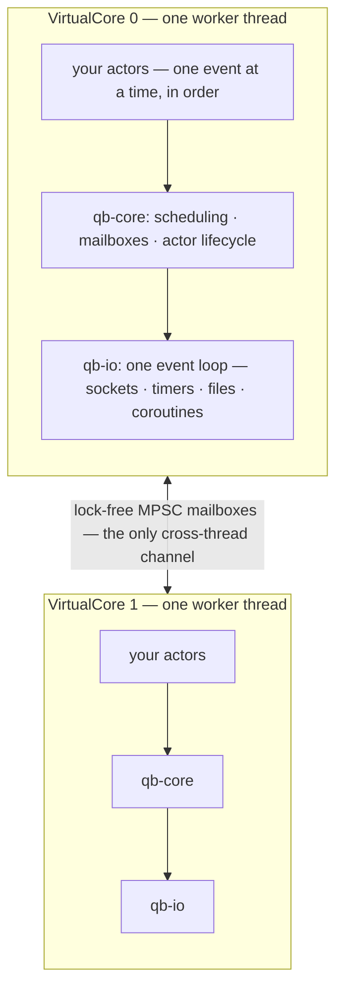

<!-- Verified-against: qb 3.0.0 (C++20 default, C++23 supported) -->

# qb Actor Framework (QBAF)

<p align="center"></p>

qb — the qb Actor Framework, **QBAF** — is a C++20-first framework with optional C++23 support for building concurrent
and distributed systems on the actor model. It pairs
share-nothing actors with a non-blocking asynchronous I/O engine and native C++20 coroutines, so
application code expresses *what* should happen on each message while the runtime handles scheduling,
multicore distribution, and non-blocking I/O.

[](https://en.cppreference.com/w/cpp/20)
[](https://cmake.org/)
[](#platform-support)
[](#platform-support)
[](./LICENSE)

## Your first actor

```cpp
#include <qb/main.h>
#include <qb/actor.h>
#include <qb/io.h>

struct GreetingEvent : qb::Event {
    qb::string<64> message;
    explicit GreetingEvent(const char *msg) : message(msg) {}
};

class GreeterActor : public qb::Actor {
public:
    qb::io::async::task<bool> onInit() final {
        registerEvent<GreetingEvent>(*this);   // subscribe
        push<GreetingEvent>(id(), "Hello");     // send to self
        co_return true;                         // actor is ready
    }

    void on(const GreetingEvent &event) {
        qb::io::cout() << "Received: " << event.message << '\n';
        kill();                                 // work done; terminate this actor
    }
};

int main() {
    qb::Main engine;
    engine.addActor<GreeterActor>(0);           // run on core 0
    engine.start();                             // start the engine
    engine.join();                              // block until all actors stop
    return 0;
}
```

No mutexes, condition variables, or shared queues: actors own their state and communicate only by
messages, which the engine delivers in order and processes one at a time per actor.

The one oddity is deliberate. The payload is `qb::string<64>`, not `std::string`, because an event is
moved by raw `memcpy` — the bytes are copied to a new address and the source is abandoned without
running a destructor there — so no member may hold a pointer into its own storage. That is *not* a
cross-core-only rule: a pipe that grows or compacts relocates same-core events too. A short
`std::string` on libstdc++ addresses its own inline buffer and is therefore illegal as a by-value
payload, while [`qb::string<N>`](./readme/0_foundations/containers.md), plain data, `std::unique_ptr`,
`std::shared_ptr` and `std::vector` are all fine. C++20 has no `is_trivially_relocatable`, so there is
no compile-time check and there cannot be one —
[Inter-actor messaging](./readme/4_qb_core/messaging.md) has the mechanism, the debug-only guard, and
the two things that guard cannot see.

## I/O is not bolted on

The same actor model, now serving TCP. Nothing here starts a thread, registers a reactor, or takes a
lock — the socket joins the event loop the actor is already running on:

```cpp
#include <qb/actor.h>
#include <qb/io/async.h>
#include <qb/io/protocol/text.h>
#include <qb/main.h>

class EchoServer;

struct Session : qb::io::use<Session>::tcp::client<EchoServer> {
    using Protocol = qb::protocol::text::command<Session>;   // frames on '\n'
    explicit Session(EchoServer &server) : client(server) {}

    void on(Protocol::message &&msg) {
        *this << msg.text << '\n';                            // echo the line back
    }
};

class EchoServer : public qb::Actor,
                   public qb::io::use<EchoServer>::tcp::server<Session> {
public:
    qb::io::async::task<bool> onInit() override {
        if (transport().listen({"tcp://0.0.0.0:9000"}) != 0)
            co_return false;                                  // port taken: init fails
        start();                                              // arm the accept watcher
        co_return true;
    }
};

int main() {
    qb::Main engine;
    engine.addActor<EchoServer>(0);
    engine.start();
    engine.join();
    return 0;
}
```

`onInit()` is a coroutine, so a server can connect to a database, prepare statements and *then*
compile its routes before the engine considers it live; while it is suspended the actor is
**Activating** and the engine holds its inbound events rather than delivering them to a half-built
object. [Building network actors](./readme/5_core_io_integration/network_actors.md) is the page for
this shape.

## Why this rather than something else

**One address, one decision.** A `qb::ActorId` is `{ServiceId, CoreId}` packed into 32 bits, and the
core half is not metadata — it *is* the routing decision. Every send resolves the destination core,
then appends raw bytes to a buffer dedicated to that core. Nothing looks an actor up by identity
across a thread boundary. Because actors are thread-affine, the actor state path carries no lock, no
atomic and no fence; `_alive` is a plain `bool` on purpose. You place actors on specific cores and
messages move between cores over lock-free queues — see
[the threading model](./readme/2_core_concepts/threading_model.md). Each actor owns its state and
processes its mailbox sequentially, so whole classes of data race and deadlock cannot occur by
construction.

**One loop, two jobs.** A `qb::VirtualCore` is a worker thread, and it drives exactly one
`qb::io::async::listener` event loop. That loop is what polls sockets, fires timers, watches files
and resumes coroutines — and it is also what dispatches your `on(Event&)` handlers, in the same pass,
in the same single-threaded context. Asynchronous I/O is not a subsystem an actor talks to; it is the
same crank. Network, timer and filesystem work is initiated without blocking, so a core stays busy
doing useful work instead of waiting on a syscall.

**Safety by isolation, not by synchronisation.** `listener::current` is `thread_local`. There is no
work-stealing, no lock and no atomic in the reactor, and the one legal cross-thread channel in the
whole framework is the actor mailbox. What that buys is a message path with no synchronisation on it
and a mental model small enough to hold: *one thread owns everything it can see; to reach anything
else, send a message.*

**Coroutines that give the core back.** `co_await` suspends by *returning*: the stack unwinds to the
scheduler, to the loop, to the `VirtualCore`, and every other actor and session on that core gets its
turn while your coroutine is parked. Sequential-looking async flows compile to state machines, not
threads. That is a throughput property, not a style preference — and it is the reason [`run_sync`
belongs only where the calling thread is yours to
block](./readme/5_core_io_integration/async_in_actors.md#the-two-call-chains).

**Generic on purpose.** The same primitives carry a matching engine and a plain web service; the
framework offers no opinion about which you are building, and everything needed to build a complete
project is in the tree. The API is explicit modern C++20/23 throughout — CRTP mixins rather than
virtual hierarchies, RAII lifetimes, and a `std::chrono` time vocabulary.

### What it costs

Four things, honestly. None of them produces a compile error, which is exactly why the documentation
exists:

| Cost | Where it is documented |
|---|---|
| An event is `memcpy`-relocated and its source destructor never runs, so a payload must be trivially **relocatable**, not merely copyable — and C++20 has no trait for that. The debug guard that catches it sits on the cross-core hop only. | [messaging.md](./readme/4_qb_core/messaging.md) |
| The reference `push` returns dies at the **next** push to the same destination core, not at end of scope — and in-place compaction makes that invisible to every sanitizer. | [messaging.md](./readme/4_qb_core/messaging.md) |
| Blocking the calling thread inside a handler freezes every actor on that core, with no diagnostic. | [async_in_actors.md](./readme/5_core_io_integration/async_in_actors.md) |
| The runtime allocates in proportion to the square of the core count and never shrinks — 22.5 MiB at rest on 8 cores. | [buffers.md](./readme/0_foundations/buffers.md) |

### What the type system does catch

`qb::duration` is `std::chrono::nanoseconds`, so `setLatency(500)` is a compile error rather than 500
of something. `qb::mono_time` and `qb::wall_time` are distinct types, so subtracting one from the
other does not compile — which kills the whole "the timeout fired early because NTP stepped the
clock" family at build time. See [the time vocabulary](./readme/0_foundations/time.md).

## Architecture

The framework ships as two libraries that compose:

- **`qb-core`** — the actor engine: lightweight actors, a type-safe event system with ordered delivery,
  multicore scheduling with CPU affinity, and lock-free inter-core message passing.
- **`qb-io`** — the asynchronous runtime: an event loop over a vendored libev fork, non-blocking
  TCP/UDP/SSL/QUIC transports, an extensible protocol layer, C++20 coroutines, timers, filesystem
  watching, and utilities (time, crypto, compression, containers).

`qb-io` does not depend on `qb-core`: the loop, transports, protocols and coroutine scheduler have no
reference to actors, so the runtime can be used on its own in any event-driven C++20 project.
Higher-level protocols — HTTP/1.1, HTTP/2 and HTTP/3, WebSocket, PostgreSQL, Redis — are optional
[qbm modules](#module-ecosystem) built on this foundation.


```mermaid
flowchart TB
    subgraph VC0["VirtualCore 0 — one worker thread"]
        direction TB
        A0["your actors — one event at a time, in order"]
        C0["qb-core: scheduling · mailboxes · actor lifecycle"]
        I0["qb-io: one event loop — sockets · timers · files · coroutines"]
        A0 --> C0 --> I0
    end
    subgraph VC1["VirtualCore 1 — one worker thread"]
        direction TB
        A1["your actors"]
        C1["qb-core"]
        I1["qb-io"]
        A1 --> C1 --> I1
    end
    VC0 <-- "lock-free MPSC mailboxes — the only cross-thread channel" --> VC1
```

CPU affinity is available but opt-in and best-effort: `Main::core(i).setAffinity(...)` *asks* the OS,
a failure logs a warning rather than failing init, and on Apple Silicon the Mach policy it uses is
not implemented, so nothing is pinned. Branch on `qb::CPU::ThreadPinningSupported()` rather than on
the call returning — [The engine](./readme/4_qb_core/engine.md) has the per-platform detail.

Concepts are introduced in [Core concepts](./readme/2_core_concepts/); the machinery both libraries
are built out of is in [Foundations](./readme/0_foundations/), the engine internals in
[qb-core](./readme/4_qb_core/), and the runtime in [qb-io](./readme/3_qb_io/).

## Quick start

### Generate a project

The `qb-new-project.sh` helper scaffolds a project from the
[`qb-sample-project`](https://github.com/isndev/qb-sample-project) template:

```bash
curl -fsSL https://raw.githubusercontent.com/isndev/qb/main/script/qb-new-project.sh | bash /dev/stdin MyProject
cd MyProject
cmake -DCMAKE_BUILD_TYPE=Release -B build
cmake --build build --parallel
```

The generated project builds to `./build/bin/MyProject` and ships a ctest suite (targets named
`MyProject-test-<tier>-<name>`) plus a GitHub Actions workflow. There are no submodules to
initialize: the generated `CMakeLists.txt` fetches qb and the qbm modules with CMake's `FetchContent`
at the first configure. To build against a qb checkout you already have, configure with
`-DFETCHCONTENT_SOURCE_DIR_QB=/path/to/qb`.

How the script chooses which qb and which template revision to render — and the two overrides that
change that choice — is in [Scaffolding](#scaffolding), below.

### Or add qb to a build you already have

```cmake
# Embed the source tree
add_subdirectory(qb)
target_link_libraries(my_app PRIVATE qb::core qb::io)

# …or consume an installed copy
find_package(qb CONFIG REQUIRED)   # provides qb::core and qb::io
```

### Or build qb itself

```bash
git clone --recursive https://github.com/isndev/qb.git
cd qb
cmake -DCMAKE_BUILD_TYPE=Release -B build
cmake --build build --parallel
ctest --test-dir build --output-on-failure
```

## Module ecosystem

Optional modules add application protocols on top of qb. Each is a separate repository, added as a
submodule and discovered by CMake:

| Module                                           | Provides                                                                                                                                  |
|--------------------------------------------------|-------------------------------------------------------------------------------------------------------------------------------------------|
| [qbm-http](https://github.com/isndev/qbm-http)   | HTTP/1.1, routing, middleware; plus HTTP/2, WebSocket (RFC 6455), and JWT authentication on SSL-enabled builds, and HTTP/3 on QUIC builds |
| [qbm-pgsql](https://github.com/isndev/qbm-pgsql) | Asynchronous PostgreSQL client with prepared statements and transactions                                                                  |
| [qbm-redis](https://github.com/isndev/qbm-redis) | Asynchronous Redis client covering the full command surface                                                                               |

```bash
git submodule add https://github.com/isndev/qbm-http qbm/http
```

```cmake
qb_load_modules("${CMAKE_CURRENT_SOURCE_DIR}/qbm")
target_link_libraries(my_app PRIVATE qbm::http)
```

A module is **something an actor composes, not a client library it calls.** `qb::http::Server<>` is a
mixin: the actor brings the thread, the mailbox and the lifecycle, and the module brings the acceptor
and the session table. A `qb::pg::tcp::database` or a `qb::redis::tcp::client` held by an actor needs
no pump and no drain — the `VirtualCore`'s loop pass already carries its bytes both ways, because it
is the same loop. Each module's book opens with that page.

None of the three speaks its wire protocol through a third-party client: qbm-pgsql implements the
PostgreSQL v3 frontend/backend protocol (no `libpq`), qbm-redis its own RESP2/RESP3 parser (no
`hiredis`), and qbm-http parses HTTP/1.1 with a vendored, symbol-renamed llhttp. All of them do their
I/O through qb-io.

## Building

### Requirements

- A C++20 compiler by default. C++23 is supported with `-DQB_CXX_STANDARD=23` for validating newer
  standard-library paths.
- CMake **3.24** or newer.
- **Bundled, nothing to install:** the event loop (a modernized libev fork that itself carries a
  patched wepoll), stduuid, nanolog and the ska flat-hash-map. GoogleTest and Google Benchmark are
  fetched automatically when tests or benchmarks are enabled.
- **nlohmann/json is a real dependency, not a vendored copy.** `qb::json` *is* `nlohmann::json`, so
  the type crosses qb's public API. The default (`QB_USE_SYSTEM_NLOHMANN=AUTO`) uses a system
  `nlohmann_json` ≥ 3.11 when `find_package` finds one and otherwise fetches a pinned tag. One
  consequence is worth knowing before you package anything: **an installable build needs the system
  copy** — a fetched one is in no export set, so `QB_INSTALL=ON` without it is a deliberate
  configure-time error that names the ways out. A plain build or test run does not care.
- OpenSSL, zlib, ngtcp2 and Argon2 are optional and drive the feature gates below.

### Common options

| Option                  | Default | Purpose                                                                               |
|-------------------------|---------|---------------------------------------------------------------------------------------|
| `QB_WITH_SSL`           | `ON`    | SSL/TLS and crypto (OpenSSL); auto-disabled if OpenSSL is absent                      |
| `QB_WITH_COMPRESSION`   | `ON`    | Compression (zlib)                                                                    |
| `QB_WITH_QUIC`          | `AUTO`  | QUIC/HTTP3 via ngtcp2: `AUTO` enables it when found                                   |
| `QB_WITH_LOGGING`       | `ON`    | Logging support                                                                       |
| `QB_BUILD_TESTS`        | `ON`    | Build the test suite                                                                  |
| `QB_BUILD_BENCHMARKS`   | `OFF`   | Build benchmarks (Google Benchmark)                                                   |
| `QB_ENABLE_NATIVE_ARCH` | `OFF`   | Tune codegen for the build host (`-march=native`); turn **on** only for host-local builds |

Those gates are real `#ifdef` boundaries in the installed headers and they propagate `PUBLIC` to your
target, so what your code can reach matches what was compiled. The complete option list is in
[CMake options](./readme/7_reference/cmake_options.md); installation details are in
[INSTALL.md](./INSTALL.md).

## Scaffolding

`qb-new-project.sh` renders the template under the name you passed: `MyProject` is substituted into
the CMake project and target names, the C++ namespaces, the include guards and the directory names,
so nothing has to be renamed by hand. That is also why the name is validated up front — it must match
`[A-Za-z][A-Za-z0-9_-]*`, and anything else exits 2 rather than failing at the first compile error.
The result is a fresh git repository with a single initial commit and no remote, not a copy of the
template's history. The script creates nothing outside `MyProject/`, refuses to run if that name is
taken, aborts on the first failed step, and removes what it made if it does not finish — worth
knowing, because the invocation above pipes it into `bash` in whatever directory you happen to be
standing in. It reports the file count, the template ref and the qb ref it wrote into the tree, and
why it chose each.

> **Which qb the generated project builds against is decided by the script, not stored in the
> template.** It used to be a submodule gitlink committed in the template, a pinned dependency that
> could only drift, and it drifted two majors. Nothing stores it now: each script carries the version
> of the qb it ships with, asserted equal to `QB_FRAMEWORK_VERSION` in
> [`cmake/qbConfig.cmake`](./cmake/qbConfig.cmake) by
> [`scripts/check-scaffold-consistency.sh`](./scripts/check-scaffold-consistency.sh), and writes the
> matching ref into the generated tree — so the URL the one-liner is fetched from selects the
> pairing. The template content resolves against the same version: an explicit `QB_TEMPLATE_REF`
> wins, then a `v<version>` tag on the template, then, only when qb `v<version>` is known *not* to
> exist, the template's `develop` branch, and finally the template's default branch, which is
> reported as a fallback. The script always prints which ref it used and why. Both templates now
> carry CI of their own that renders with this same script and builds, tests and runs the result on
> Linux and macOS.
>
> One honest caveat, and since 2026-08-11 it applies to only one of the two refs. Both templates are
> now tagged `v3.0.0`, so the template ref matches that tag on the first rung and the script reports
> `matches qb 3.0.0` — it does not reach the `develop` rung at all. qb itself has no `v3.0.0` yet, so
> the qb ref written into the generated tree is still `develop`, and the script says so when it runs.
> The generated tree therefore follows a moving branch **for qb** rather than a pinned release; to pin
> it, set `QB_GIT_REF` in the generated `CMakeLists.txt` to a released tag. Two overrides exist for the other direction:
> `QB_TEMPLATE_DIR=<path>` renders from a local template checkout (for template authors), and
> `QB_REF=<ref>` overrides the qb ref written into the generated tree.

> **Both scaffolding scripts are bash** (`#!/usr/bin/env bash`, `set -euo pipefail`) and shell out
> to `git` only. They do **not** run in `cmd.exe` or PowerShell. On Windows, run them from **WSL**
> or **Git Bash**. Nothing else in qb's build requires a shell — MSVC builds work normally once the
> project exists; this constraint applies only to the two generators.
>
> Both are fetched **from a branch**, so the URL selects the version: `.../qb/main/script/...` is
> the default branch — which carries a pre-release 3.0.0 until `v3.0.0` is tagged — and
> `.../qb/<tag>/script/...` pins one release. `curl | bash` also means the code
> runs unreviewed in the directory you are standing in — `curl -fsSL <url> -o scaffold.sh`, read it,
> then `bash scaffold.sh MyProject` does the same thing and lets you look first.

### Scaffold your own module

`qb-new-module.sh` is the module-side counterpart of `qb-new-project.sh`. It scaffolds a qbm module
from the [`qb-sample-module`](https://github.com/isndev/qb-sample-module) template:

```bash
curl -fsSL https://raw.githubusercontent.com/isndev/qb/main/script/qb-new-module.sh | bash /dev/stdin mymodule
```

Run it from your project's `qbm/` directory; the result is picked up by the
`qb_load_modules("${CMAKE_CURRENT_SOURCE_DIR}/qbm")` call above and exposed as `qbm::mymodule`. The
same guards apply as for `qb-new-project.sh`: it creates nothing outside `mymodule/`, refuses to
overwrite it, aborts on the first failed step, cleans up after itself, and — being bash — needs WSL
or Git Bash on Windows.

The generated module ships its public headers under `src/qbm/mymodule/`, a tiered `tests/` suite
registered with `qb_register_module_test()`, and a superbuild root that builds and runs those tests
with no further setup:

```bash
cmake -S .github/ci/superbuild -B build
cmake --build build --parallel --target qbm-mymodule-tests
ctest --test-dir build -L module:qbm-mymodule
```

> **Why a superbuild root rather than `cmake -S . -B build`?** A qbm module cannot be configured
> standalone: it calls `qb_register_module()` and `qb_add_test()`, development-time helpers an
> installed qb does not ship. `.github/ci/superbuild/CMakeLists.txt` is the same answer `qbm-http`,
> `qbm-pgsql` and `qbm-redis` give — a minimal root that adds a qb *source* tree first and the module
> second — in the same shape, with one deliberate difference: theirs require both trees to be passed
> in, because their CI always passes them, while the generated one defaults its own paths and fetches
> qb, so it works with no arguments on a machine that has no qb checkout.
>
> The module name is not merely a directory name, which is why it is stricter than a project's:
> `mymodule` becomes the `qbm-mymodule` target, the `qbm::mymodule` namespace and the
> `src/qbm/mymodule/` directory that `qb_register_module()` requires, so it must be a lowercase
> identifier (`[a-z][a-z0-9_]*`) and anything else exits 2 rather than failing at the first compile
> error. The qb the module builds against is chosen by the script at scaffold time exactly as it is
> for a project: the template ref resolves from the qb version the script ships with, and while
> 3.0.0 is untagged the qb ref follows `develop`, which the script reports on every run.

## Platform support

Continuous integration builds and tests every change on:

| OS                         | Compilers   | Standard library | CI                    |
|----------------------------|-------------|------------------|-----------------------|
| Linux (`ubuntu-latest`)    | GCC, Clang  | libstdc++        | enabled               |
| macOS (`macos-latest`)     | Apple Clang | libc++           | enabled               |
| Windows (`windows-latest`) | MSVC        | MSVC STL         | **currently disabled** |

> **Windows/MSVC is supported source, but is not exercised by CI right now.** The hosted-runner
> job is commented out in `.github/workflows/cmake.yml` (it took ~70 minutes and its tests timed
> out under that load, reporting runner noise rather than defects); the maintainer validates the
> full MSVC solution out of band before each release. Treat a Windows build as verified by you,
> not by this project's CI. See [INSTALL.md](INSTALL.md#supported-toolchains).

Supported architectures: x86_64 and ARM64 (including Apple Silicon).

## Documentation

- **[Documentation home](./readme/README.md)** — the full guide, organized for progressive learning:
    - [0. Foundations](./readme/0_foundations/) — the layer beneath the event loop: the time vocabulary, the allocator pipe, containers, encoding, the lock-free primitives, the ABI machinery. Optional before adopting; required before contributing
    - [1. Introduction](./readme/1_introduction/) — what qb is, its philosophy, and when to use it
    - [2. Core concepts](./readme/2_core_concepts/) — actors, events, async I/O, concurrency, threading model
    - [3. qb-io](./readme/3_qb_io/) — the asynchronous runtime, transports, protocols, coroutines, and [what has no coroutine form](./readme/3_qb_io/gaps.md)
    - [4. qb-core](./readme/4_qb_core/) — the actor engine and messaging
    - [5. Integration](./readme/5_core_io_integration/) — actors and async I/O together, with worked examples
    - [6. Guides](./readme/6_guides/) — getting started, patterns, performance, error handling, migration
    - [7. Reference](./readme/7_reference/) — API overview, build, invariants, benchmarks, FAQ, glossary
- **Two pages worth opening first**, whatever you are building:
  [Core invariants](./readme/7_reference/core_invariants.md), which states the contract you owe the
  runtime and the one it owes you, each cited to what enforces it — and says so where nothing does;
  and [Asynchronous work inside an actor](./readme/5_core_io_integration/async_in_actors.md), which
  puts the `co_await` and `run_sync` call chains side by side against the loop pass.
- **Project policies:** [INSTALL](./INSTALL.md) · [VERSIONING](./VERSIONING.md) ·
  [CHANGELOG](./CHANGELOG.md) · [SECURITY](./SECURITY.md) · [SUPPORT](./SUPPORT.md) ·
  [CONTRIBUTING](./CONTRIBUTING.md)

## For AI assistants

This repository publishes machine-readable documentation following the
[llms.txt](https://llmstxt.org/) convention, so a coding agent can read qb without
guessing:

- **[`llms.txt`](./llms.txt)** — the index: a one-paragraph summary, the five rules that decide whether generated qb code is correct, and a link
  list of every document in this repository.
- **[`llms-full.txt`](./llms-full.txt)** — ~34k tokens: `llm/qb.llm.md` (the mental model, invariants and footguns) and `llm/qb.llm.api.md` (a deterministic public-API reference, every signature verified against the headers under `src/`), concatenated into one fetch.

Both files are generated by `scripts/gen-llms-txt.py` from `llm/` and checked in CI
(`scripts/doc-lint.sh` section 1d), so they cannot drift from the documentation they index.

**Use it over MCP, with nothing to host and nothing to install.**
[GitMCP](https://gitmcp.io) exposes any public GitHub repository as an MCP endpoint and reads
`llms.txt` first (its documented order is `llms.txt`, then an AI-optimised documentation
build, then `README.md`):

```json
{ "mcpServers": { "qb": { "url": "https://gitmcp.io/isndev/qb" } } }
```

Claude Desktop and other clients without native remote-MCP support wrap the same URL:
`"command": "npx", "args": ["mcp-remote", "https://gitmcp.io/isndev/qb"]`.

**Cursor `@Docs`** — add
`https://raw.githubusercontent.com/isndev/qb/main/llms-full.txt`.

## License

Licensed under the Apache License, Version 2.0. See [LICENSE](./LICENSE).

## Acknowledgments

qb builds on several open-source projects: [libev](http://software.schmorp.de/pkg/libev.html) (the event loop, bundled
as a modernized fork), [stduuid](https://github.com/mariusbancila/stduuid) (UUIDs), [nlohmann/json](https://github.com/nlohmann/json)
(JSON), [OpenSSL](https://www.openssl.org/) and [Argon2](https://github.com/P-H-C/phc-winner-argon2)
(TLS and password hashing), [zlib](https://zlib.net/) (compression), and the ska flat-hash-map and nanolog
designs. Their authors have our thanks. Every bundled component and its license is inventoried in
[THIRD-PARTY-NOTICES](./THIRD-PARTY-NOTICES), which is installed alongside the library.
