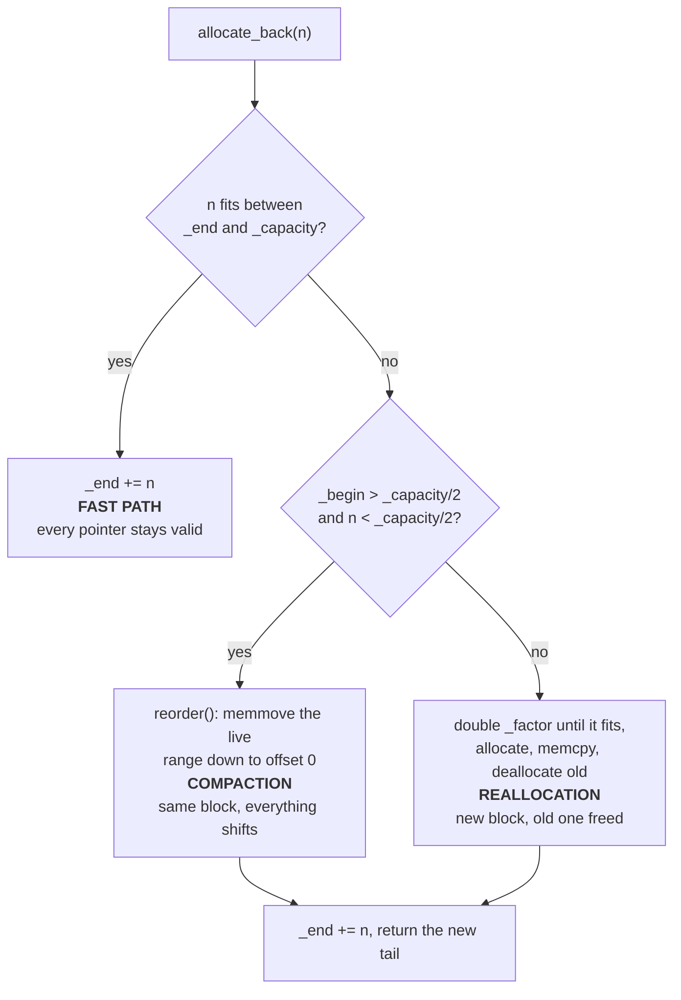

# The pipe: qb's one buffer

> **Audience:** Contributor · **Status:** stable · **Verified-against:** qb 3.1.0 (C++20 default, C++23 supported) — ef7d3ea7

`qb::allocator::pipe<T>` is a single growable allocation with three cursors on it. It backs every actor mailbox and every I/O stream in the framework, and the rules people trip over — why a `push` reference dies at the next push, why draining a socket is O(1) per turn, why qb's memory never comes back — are all consequences of those cursors rather than separate policies.

**Prerequisites:** none — **See also:** [Foundations overview](./README.md) · [Inter-actor messaging](../4_qb_core/messaging.md) · [Transports](../3_qb_io/transports.md) · [Core invariants](../7_reference/core_invariants.md)

## The model

A pipe owns **one** contiguous block of `T` and three indices into it. Nothing else. There is no node, no chunk list, no free list.

```
        _data
          |
          v
          +----------------+=================+----------------+
          |    retired     |      live       |     spare      |
          +----------------+=================+----------------+
          0             _begin             _end           _capacity

          size()     == _end - _begin          the readable elements
          begin()    == _data + _begin         where a reader starts
          end()      == _data + _end           one past the last live element
          capacity() == _capacity              the whole block
```
<!-- src: qb/src/qb/system/allocator/pipe.h:62-67 -->

`_begin` and `_end` are plain `std::size_t`. Advancing one is a single integer add; nothing is moved, nothing is destroyed, no allocator is consulted. That is the entire performance story, and also the entire hazard story.

A fourth member, `_flag_front`, records *which end* the last allocation came from, so a later `free()` retracts from the right side (`qb/src/qb/system/allocator/pipe.h:64`, `:339-345`). A fifth, `_factor`, is the growth counter. A default-constructed pipe allocates `_SIZE = 4096` **elements** up front — 4 KiB for a `pipe<char>`, 256 KiB for a `pipe<EventBucket>` (`qb/src/qb/system/allocator/pipe.h:59`, `:75-81`).

### The four operations

| Operation | Does | Cost |
|---|---|---|
| `allocate_back(n)` | reserve `n` elements at `_end` | O(1) on the fast path; see below for the other two branches |
| `allocate(n)` | reserve `n` at `_begin` if there is room there, otherwise fall through to `allocate_back` | O(1) on the front branch |
| `free_front(n)` | `_begin += n` — retire consumed elements | O(1), always, unconditionally |
| `free_back(n)` | `_end -= n` — give back an unused reservation | O(1), always |

<!-- src: qb/src/qb/system/allocator/pipe.h:269-282, :355-392, :433-442 -->

`free_front` and `free_back` are `noexcept` and do not check anything. They do not destroy elements, they do not zero memory, and they do not return storage to the allocator. Two composites round the set out: `reset(pos)` sets `_begin` to `pos`, or resets both cursors to zero when `pos == _end` (`qb/src/qb/system/allocator/pipe.h:292-300`); `reset()` zeroes both cursors and clears `_flag_front` (`:307-312`). `reorder()` `memmove`s the live range down to offset 0 (`:520-528`).

## What `allocate_back` actually does

This is the function everything else reads off, and it has three branches:


<!-- src: qb/src/qb/system/allocator/pipe.h:355-392 -->

The fast path is the common case and it invalidates nothing. The other two both invalidate every pointer, reference and index into the buffer — and they are not equally dangerous.

**Reallocation is the safe failure.** The old block is handed back to `std::allocator`. A stale pointer into it points at freed memory, which ASan, Valgrind and a hardened allocator all catch on the first dereference.

**Compaction is the dangerous one.** `reorder()` `memmove`s within the *same live allocation* (`qb/src/qb/system/allocator/pipe.h:525`). A stale pointer still addresses valid, mapped, in-use memory — it now simply refers to *a different element*. No allocator debugger can see that, because nothing invalid has happened at the allocator level. This is the mechanism behind the framework's sharpest rule: the reference `Actor::push()` returns dies at the very next event queued to the same destination core, not at end of scope (`src/qb/core/Actor.h:866-875`). Reallocation would be loud; compaction is silent, and compaction is what a busy pipe does far more often.

Growth is geometric: `_factor` doubles until the request fits, and the new capacity is `_factor * 4096` elements (`qb/src/qb/system/allocator/pipe.h:369-375`). Two guards throw `std::bad_alloc` rather than wrapping — one when `_factor` would exceed `1 << (sizeof(size_t) * 4)` (`:371-372`), one when the arithmetic would still not fit (`:377-378`). Both are reachable only through a size that no legitimate caller produces, and they are the pipe's only `throw`.

### `allocate()`, the front branch, and why `send` is unordered

`allocate(n)` tries the *front* first:

```cpp
inline auto
allocate(std::size_t const size) {
    if (_begin >= size + 1 && (_begin - size - 1) < _end) {
        _begin -= size;
        _flag_front = true;
        return _data + _begin;
    }
    _flag_front = false;
    return allocate_back(size);
}
```
<!-- src: qb/src/qb/system/allocator/pipe.h:433-442 -->

The retired region in front of `_begin` is memory the pipe already owns and nobody is reading. Carving an object out of it costs one subtraction, and — crucially — the resulting element is **outside** the `[_begin_old, _end)` range a reader will walk. Pair that with `free(n)`, which consults `_flag_front` and retracts from whichever end the allocation came from (`qb/src/qb/system/allocator/pipe.h:339-345`), and you have an allocation that can be made and then *unmade* without disturbing anything queued.

That pair is exactly what `VirtualCore::send` uses:

```cpp
auto *const raw = pipe.allocate(BUCKET_SIZE);
// ... construct the event in place, fill its header ...
if (dest._core_id != _index && try_send(data))
    pipe.free(data.bucket_size);
```
<!-- src: qb/src/qb/core/VirtualCore.h:822-829 -->

Read that as a narrative and the whole `push` / `send` contract falls out:

- `push` calls `allocate_back` (`src/qb/core/VirtualCore.h:855`). The event joins the FIFO stream at the tail and is delivered in the next flush, **in order** with everything already queued to that core.
- `send` calls `allocate`, attempts an immediate cross-core delivery, and on success **retracts the allocation**. The event never enters the stream at all, so it can arrive *before* events queued earlier by `push` — that is the unordered contract, stated as a mechanism rather than a rule.
- If the immediate attempt fails, or the destination is this same core, the retraction does not happen and the event stays in the pipe to be flushed normally.
- The retraction is a cursor move, not a destructor call. Nothing runs `~T()` on that storage. That is why the same call site `static_assert`s that a `QoS < 2` event is trivially destructible (`src/qb/core/VirtualCore.h:802-804`): a non-trivial destructor would simply never run.

Two typed conveniences wrap the raw allocators for callers that do not need this control: `allocate_back<U>(args...)` and `allocate<U>(args...)` compute the bucket count for `U`, reserve it and placement-new in one step (`qb/src/qb/system/allocator/pipe.h:402-407`, `:452-457`); `allocate_size<U>(extra, args...)` reserves the object plus a trailing run of elements (`:418-423`). The event path deliberately does *not* use them — it allocates raw, prepares the whole bucket range to a deterministic value, and only then placement-news, because the cross-core relocation guard scans every byte of that range (`src/qb/core/VirtualCore.h:852-856`).

## `pipe<T>::swap` — one cache line, and why it is asserted

The derived `pipe<T>` template adds cache-line alignment and a `swap` that exchanges the two objects by byte-swapping a single `CacheLine`:

```cpp
static_assert(sizeof(pipe) <= sizeof(CacheLine),
              "pipe<T>::swap byte-swaps a single CacheLine; the pipe "
              "object must fit within one cache line");
std::swap(*reinterpret_cast<CacheLine *>(this), *reinterpret_cast<CacheLine *>(&rhs));
```
<!-- src: qb/src/qb/system/allocator/pipe.h:574-576 -->

That assertion is not decorative and the margin is not generous. Measured on this checkout: `sizeof(CacheLine)` is 64 and `sizeof(qb::allocator::pipe<EventBucket>)` is **exactly 64** — six members (`_begin`, `_end`, `_flag_front`, `_capacity`, `_factor`, `_data`) occupy 48 bytes and `alignas(64)` rounds the object up. Two more `std::size_t` members would still fit; three would not, and without the assertion the swap would exchange only the first cache line, leaving `_data` half-exchanged — a double free on one side and a leak on the other.

It has one consumer, and it explains why it exists. `VirtualCore::__receive__` swaps the same-core pipe out before draining it:

```cpp
_mono_pipe->swap(_mono_pipe_swap);
__receive_events__(std::span<EventBucket>{_mono_pipe->begin(), _mono_pipe->size()});
_mono_pipe->reset();
```
<!-- src: qb/src/qb/core/VirtualCore.cpp:220-222 -->

Handlers dispatched from that drain will themselves `push` to actors on this core. Those pushes land in the *other* pipe, which is now the live one, so the range being iterated cannot grow or move underneath the loop. A 64-byte swap buys reentrancy safety for the price of two cache-line writes.

Note the asymmetry: `swap` is on the primary `pipe<T>` template only. `pipe<char>` is an explicit specialisation that derives straight from `base_pipe<char>`, so it has no `swap` and is not cache-line aligned — measured, `sizeof(qb::allocator::pipe<char>)` is 48 with alignment 8 (`qb/src/qb/system/allocator/pipe.h:559-560`, `:633-634`).

## `pipe<char>` and the framework's serialisation extension point

`pipe<char>` is where bytes live, and it is the one place qb asks the rest of the tree to extend it. The generic `put(const U&)` falls back to `std::to_string` (`qb/src/qb/system/allocator/pipe.h:662-666`), and everything that wants a real wire form declares an explicit specialisation:

```cpp
namespace qb::allocator {
template <>
pipe<char> &pipe<char>::put<json>(const json &c);
}
```
<!-- src: qb/src/qb/json.h:285-287 -->

That single hook is how qb's own JSON — and, in the modules, every HTTP request, response, chunk, multipart body and WebSocket frame — gets written into an output buffer: each is an explicit `pipe<char>::put<T>` specialisation declared next to its own type. Declaring one is what makes `out() << my_type` work anywhere in the framework, because `operator<<` on `pipe<char>` is defined as `put` (`qb/src/qb/system/allocator/pipe.h:760-764`).

Six specialisations ship in qb itself, declared at the bottom of the header for `char`, `unsigned char`, `const char *`, `std::string`, `std::string_view` and `pipe<char>` (`qb/src/qb/system/allocator/pipe.h:813-829`). Two more overloads carry a `static_assert` that is worth reading before you use them: `put(std::vector<T>)` and `put(std::array<T, N>)` copy `size()` **bytes**, not `size() * sizeof(T)`, so they refuse to compile for a multi-byte element type rather than silently truncating (`qb/src/qb/system/allocator/pipe.h:706-709`, `:725-728`).

```cpp
#include <qb/system/allocator/pipe.h>

qb::allocator::pipe<char> p;
p.put("HEADERPAYLOAD", 13);       // raw bytes + length
p.free_front(6);                  // retire "HEADER"
p.view();                         // "PAYLOAD" — a std::string_view over the live range
p.reorder();                      // compact; view() is still "PAYLOAD", size() still 7
```
<!-- src: qb/tests/io/unit/core/pipe-allocator.cpp:162-171 -->

`view()` and `str()` are `pipe<char>`-only, returning a `std::string_view` over the live range and a copy of it respectively (`qb/src/qb/system/allocator/pipe.h:802-809`). The view borrows: any subsequent `put` that compacts or grows the buffer leaves it dangling.

## The two consumers

### Events

`qb::VirtualPipe` is `allocator::pipe<EventBucket>` (`src/qb/core/Event.h:689`), and every `VirtualCore` owns one per destination core plus one for itself (`src/qb/core/VirtualCore.cpp:103-105`). An event is measured in cache-line-sized buckets rather than bytes — 64 B by default, and [an ABI axis](./abi_and_build_fingerprint.md) — which is what keeps `bucket_size` inside the 16-bit event header. Full narrative on [Inter-actor messaging](../4_qb_core/messaging.md).

### Streams

Every `qb-io` stream holds two `pipe<char>`s — `input_buffer_type` and `output_buffer_type` are both `qb::allocator::pipe<char>` (`src/qb/io/stream.h:58`, `:240`) — and the cursor operations map one-to-one onto what a socket does to them:

| Stream event | Pipe call |
|---|---|
| a read is about to happen | `allocate_back(read_size)` reserves the landing zone (`src/qb/io/stream.h:167`) |
| the read returned fewer bytes than reserved | `free_back(unused)` retracts the tail (`src/qb/io/stream.h:169`) |
| the protocol consumed one framed message | `free_front(size)` retires it (`src/qb/io/stream.h:184`) |
| a write drained part of the output buffer | `free_front(written)` advances past it (`src/qb/io/stream.h:326`) |
| a write drained all of it | `reset()` — both cursors to zero (`src/qb/io/stream.h:328`) |

The partial-write case is where the cursor model pays for itself, and the alternative was measured rather than reasoned about. `free_front` is O(1), and `begin()`/`size()` stay correct at the new offset, so the next `write()` resumes exactly where the socket stopped. Compacting on every partial write instead would `memmove` every byte still pending on **every** turn, making one large payload quadratic: a 64 MB body flushed 64 KiB at a time moves 32 GB and burns 728 ms of loop time — all of it stolen from the actors sharing that core (`src/qb/io/stream.h:315-323`).

What the retired prefix costs is bounded and self-correcting, which is the other half of the same comment: the next `publish()` calls `allocate_back`, which compacts once `_begin` has passed half the capacity and grows otherwise — and it only grows when the *live* bytes already fill half the block. A stream that is continuously published into while it drains settles at about 4× the bytes in flight, and settles there; it does not creep.

One more place shows the third cursor operation. On end-of-file the stream compacts explicitly rather than waiting for `allocate_back` to decide: empty buffer → `reset()`, non-empty → `reorder()` (`src/qb/io/stream.h:194-197`).

## Memory: it grows, and it does not come back

Nothing in `base_pipe` ever shrinks the block. `free_front`, `free_back`, `reset`, `clear` and `reorder` all move cursors; the only `deallocate` calls are in the destructor, the move assignment, and the growth path replacing the block with a larger one (`qb/src/qb/system/allocator/pipe.h:173-176`, `:152-153`, `:383-384`). A pipe that once held a 100 MB payload holds a 100 MB allocation until it dies.

That is a deliberate trade — a steady-state server pays no allocator traffic at all — but combined with the eager construction it means the engine commits a predictable, and quadratic, amount of memory before a single event exists. Measured on this checkout with an instrumented `operator new`:

| Structure | Count | Each | Note |
|---|---|---|---|
| `pipe<EventBucket>` | `N × (N + 1)` | 262 144 B | one per destination core per core, plus one same-core pipe per core |
| mailbox producer slot | `N × N` | 65 728 B | one SPSC ring per sender, per destination mailbox |
| per-core receive buffer | `N` | 65 536 B | one `_event_buffer` per core — a `std::array<EventBucket, 1024>` behind a `unique_ptr` (`src/qb/core/VirtualCore.h:267`) |

| Cores | Pipes | Mailboxes | Buffers | Total at rest |
|---|---|---|---|---|
| 1 | 0.50 MiB | 0.06 MiB | 0.06 MiB | ~0.6 MiB |
| 4 | 5.00 MiB | 1.00 MiB | 0.25 MiB | ~6.3 MiB |
| 8 | 18.00 MiB | 4.01 MiB | 0.50 MiB | ~22.5 MiB |
| 16 | 68.00 MiB | 16.05 MiB | 1.00 MiB | ~85 MiB |

The per-structure figures are measured; the totals are that arithmetic. The shape is what matters: **doubling the core count roughly quadruples the resting footprint**, because every core keeps a private outbound pipe to every other core and every mailbox keeps a private inbound ring from every other core. That is the price of a message path with no lock and no shared cursor on it, and it is worth knowing before you configure a 64-core engine on a container with a memory limit.

## Pitfalls

- **A pointer into a pipe is valid until the next allocation on that pipe, and not one instruction longer.** Compaction (`reorder`) is the case no tool catches, because the memory stays live and merely means something else (`qb/src/qb/system/allocator/pipe.h:520-528`). This is the whole reason [`Actor::push`'s returned reference](../7_reference/core_invariants.md#sending-push-vs-send) has the rule it has.
- **`free_front` / `free_back` run no destructors.** They are cursor arithmetic (`qb/src/qb/system/allocator/pipe.h:269-282`). A pipe holding non-trivially-destructible objects leaks every one of them unless the owner destroys them itself. For events that owner is the router, which disposes each one after routing — so the rule bites only where nothing routes them: the `qos == 0` drop on backpressure, which is why an `EventQOS0` payload must be trivially destructible.
- **`reserve(n)` is not `std::vector::reserve`.** It calls `allocate_back(n)` and then `free_back(n)`, so it can trigger a growth *or a compaction* — and therefore invalidate outstanding pointers — before handing the space back (`qb/src/qb/system/allocator/pipe.h:543-547`).
- **`resize(n)` shrinking does not destroy anything either.** It moves `_end` down (`qb/src/qb/system/allocator/pipe.h:256-262`).
- **`str()` copies, `view()` borrows.** A `std::string_view` from `view()` is invalidated by the next `put` exactly like any other pointer into the buffer (`qb/src/qb/system/allocator/pipe.h:802-809`).
- **`put(std::vector<T>)` and `put(std::array<T, N>)` are byte-counted.** They will not compile for a multi-byte `T`; the `static_assert` tells you to cast and pass `size() * sizeof(T)` yourself (`qb/src/qb/system/allocator/pipe.h:706-709`).
- **Don't add members to `pipe<T>` without checking the swap assertion.** It has 16 bytes of slack on a 64-byte cache line, and a build with `-DKNOWN_L1_CACHE_LINE_SIZE=128` moves the ceiling — see [ABI and the build fingerprint](./abi_and_build_fingerprint.md).
- **The buffer is a data structure, not a thread-safety boundary.** A pipe carries no atomic and no lock. Its safety comes entirely from being touched by exactly one thread; the one cross-thread hop in the framework is the [mailbox ring](./concurrency_primitives.md), which is a different type.

## See also

- [Foundations overview](./README.md) — the rest of the layer below the event loop.
- [Inter-actor messaging](../4_qb_core/messaging.md) — `push` versus `send` as an API contract; this page is the mechanism underneath it.
- [Transports](../3_qb_io/transports.md) — the streams that own the two `pipe<char>` buffers.
- [Concurrency primitives](./concurrency_primitives.md) — the mailbox ring the flush drains into.
- [Core invariants](../7_reference/core_invariants.md) — the reference-invalidation and relocation contracts stated as invariants.
- [ABI and the build fingerprint](./abi_and_build_fingerprint.md) — where the 64-byte bucket comes from.
