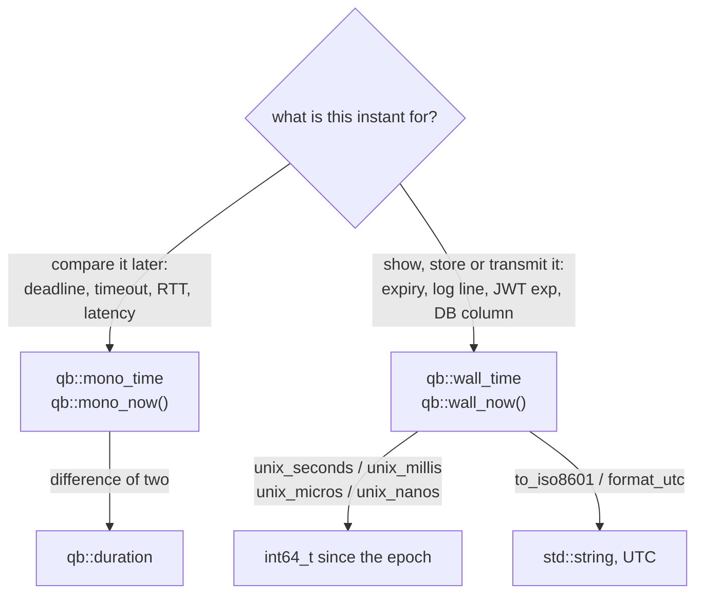

# The time vocabulary

> **Audience:** Adopter · **Status:** stable · **Verified-against:** qb 3.0.0 (C++20 default, C++23 supported) — ef7d3ea7

One span type and two instant types, defined once in `qb/system/time.h` and used by every timeout, deadline, TTL and expiry in qb and its modules — plus the civil calendar types, the UTC codecs, and the single place where the vocabulary is allowed to degrade to a raw `double`.

**Prerequisites:** none — **See also:** [Foundations overview](./README.md) · [Async I/O system](../3_qb_io/async_system.md) · [Encoding and conversion](./encoding.md) · [Concurrency primitives](./concurrency_primitives.md)

## Three types, and what the third one buys you

```cpp
namespace qb {
using duration  = std::chrono::nanoseconds;                    // a span
using mono_time = std::chrono::steady_clock::time_point;       // a monotonic instant
using wall_time = std::chrono::system_clock::time_point;       // a wall-clock instant
}
```
<!-- src: qb/src/qb/system/time.h:90-96 -->

| Type | Is | Use for |
|---|---|---|
| `qb::duration` | `std::chrono::nanoseconds` — signed, 64-bit, nanosecond resolution | every timeout, delay, TTL, interval, latency and RTT value in a public signature |
| `qb::mono_time` | `std::chrono::steady_clock::time_point` | deadlines, timers, the loop's "now", measured elapsed time |
| `qb::wall_time` | `std::chrono::system_clock::time_point` | dates, expiry, JWT `exp`/`nbf`, TLS validity, logs, wire formats |

Two free functions read the clocks: `qb::mono_now()` (`qb/src/qb/system/time.h:99-102`) and `qb::wall_now()` (`qb/src/qb/system/time.h:105-108`). Nothing else in qb calls `steady_clock::now()` or `system_clock::now()` directly.

The interesting part is not the aliasing. It is that **there are two instant types instead of one**, and that the span is an integral chrono duration rather than a number of anything. Both choices exist to turn a class of runtime bug into a compile error, and both are worth seeing rather than being told about.

### `qb::duration` rejects a bare integer

A parameter typed `qb::duration` — `qb::CoreInitializer::setLatency(qb::duration latency = qb::duration::zero())` is the canonical one (`src/qb/core/Main.h:284`) — accepts any `std::chrono` literal whose period is finer than or equal to a nanosecond, implicitly:

```cpp
#include <qb/system/time.h>
using namespace qb::time_literals;          // 30s, 100ms, 5us, ... (see below)

static void take(qb::duration) {}

take(500ms);                     // OK
take(std::chrono::seconds(30));  // OK
take(qb::duration{500});         // OK — explicit, and it means 500 nanoseconds
```

and it refuses a naked number, because `std::chrono::duration`'s converting constructor from an arbitrary `Rep` is `explicit`:

```cpp
take(500);   // error: no known conversion from 'int' to 'qb::duration'
             //        (aka 'duration<long long, ratio<1, 1000000000>>')
```

That single diagnostic is the whole point: `500` is meaningless until somebody says *of what*, and the seconds-versus-milliseconds confusion it invites is the most common timeout bug there is. The type refuses to guess.

### `qb::duration` also rejects a fractional literal

Less obvious, and worth knowing before it surprises you: `1.5s` is a `std::chrono::duration<long double>`, and converting a floating-point representation to an integral one is not implicit either.

```cpp
take(1.5s);  // error: no known conversion from 'duration<long double, ratio<1, 1>>'
             //        to 'duration<long long, ratio<1, 1000000000>>'
take(1500ms);            // the spelling that works
take(std::chrono::duration_cast<qb::duration>(1.5s));   // or say the truncation out loud
```

This applies wherever a parameter is spelled `qb::duration`. It does **not** apply to the handful of APIs that take a *template* `std::chrono::duration<Rep, Period>` and cast internally — `qb::io::async::callback(func, timeout)` is one (`src/qb/io/async/io.h:373-375`), so `callback(f, 1.5s)` compiles and means 1 500 000 000 ns. Both shapes reject `500`.

### `mono_time` and `wall_time` do not mix

```cpp
auto d = qb::mono_now() - qb::wall_now();
// error: invalid operands to binary expression
//        ('mono_time' (aka 'time_point<steady_clock, ...>')
//         and 'wall_time' (aka 'time_point<system_clock>'))
```

`std::chrono::time_point` carries its clock in the type, and subtraction is only defined between two points on the *same* clock. Because qb hands out two named aliases rather than one `TimePoint`, "I measured a deadline against the wall clock" is a compile error rather than a bug that appears the next time NTP steps the clock backwards and a timeout fires early — or, worse, twenty minutes late.

The rule that follows is a two-word decision, and it is the only one you have to remember: **elapsed time is monotonic, calendar time is wall.** A deadline you will compare against later is a `mono_time`. A moment you will *print, store, or send* is a `wall_time`.



## Writing the literals

The chrono literal operators are re-exported from an inline namespace inside `qb`, so a call site needs no second `using`:

```cpp
inline namespace time_literals {
using namespace std::chrono_literals;
}
```
<!-- src: qb/src/qb/system/time.h:112-114 -->

Because it is an *inline* namespace, `using namespace qb;` is enough, and `qb::time_literals` also works if you prefer to name it. A translation unit that brings in neither gets `no matching literal operator for call to 'operator""ms'` — the suffixes are not global.

## Crossing the boundary: instants as integers and text

A `wall_time` is the only instant that means anything outside this process, so the extraction and construction helpers are all on that side. There is deliberately no `mono_time`-to-integer helper: a steady-clock epoch is unspecified and comparing one across processes or reboots is meaningless.

```cpp
namespace qb {

// wall instant -> integer count since the Unix epoch
std::int64_t unix_seconds(wall_time) noexcept;
std::int64_t unix_millis (wall_time) noexcept;
std::int64_t unix_micros (wall_time) noexcept;
std::int64_t unix_nanos  (wall_time) noexcept;

// integer count since the Unix epoch -> wall instant
wall_time wall_from_unix_seconds(std::int64_t) noexcept;
wall_time wall_from_unix_millis (std::int64_t) noexcept;
wall_time wall_from_unix_nanos  (std::int64_t) noexcept;

}
```
<!-- src: qb/src/qb/system/time.h:121-160 -->

All four extractors are a `duration_cast`, so they **truncate toward zero** rather than rounding, and all seven are `noexcept`.

For text, qb formats and parses in **UTC only**, with no time-zone database dependency:

```cpp
std::string              format_utc(wall_time, std::string_view strftime_fmt);
std::string              to_iso8601(wall_time);                        // "YYYY-MM-DDTHH:MM:SSZ"
std::optional<wall_time> parse_utc(std::string_view, std::string_view fmt) noexcept;
std::optional<wall_time> from_iso8601(std::string_view) noexcept;      // the inverse of to_iso8601
```
<!-- src: qb/src/qb/system/time.h:305-348 -->

`format_utc` returns an **empty string** on failure (`qb/src/qb/system/time.h:305-315`); the two parsers return `std::nullopt` on any malformed input (`qb/src/qb/system/time.h:326-342`). Neither throws.

Two properties of the round trip are easy to assume wrongly, and both are pinned by the unit test:

- `to_iso8601` emits whole seconds, and `from_iso8601` **rejects a fractional-seconds instant**: `"2023-01-15T12:30:45.123Z"` is `std::nullopt`, `"2023-01-15T12:30:45Z"` parses (`qb/tests/core/unit/system/time.cpp:213-215`). Sub-second precision belongs to the time-of-day path below, not to the instant path.
- The parser is `std::get_time`-based, so it **normalises** a 60th second (`12:30:60Z` becomes `12:31:00Z`) while rejecting `:61` and a 60th minute (`qb/tests/core/unit/system/time.cpp:222-228`).

### Why qb computes the calendar itself

`format_utc`, `parse_utc` and every civil type below go through two helpers that replace the C library outright:

```cpp
bool        safe_gmtime(std::time_t, std::tm &out) noexcept;   // UTC breakdown
std::time_t safe_timegm(const std::tm &in) noexcept;           // its exact inverse
bool        safe_localtime(std::time_t, std::tm &out) noexcept;
```
<!-- src: qb/src/qb/system/time.h:245-297 -->

Three reasons, all of them things that bite:

1. **`std::gmtime` and `std::localtime` return a pointer into a process-wide static `std::tm`.** Two threads formatting a timestamp at the same time race on it. Every helper here takes a caller-owned `std::tm`, so the race cannot be written.
2. **`gmtime_s` / `_mkgmtime` reject a negative `time_t` on Windows.** Every instant before 1970-01-01 therefore diverges between platforms — POSIX `gmtime_r` accepts it, Windows does not. `safe_gmtime` and `safe_timegm` are pure integer arithmetic — Howard Hinnant's `days_from_civil` / `civil_from_days` (`qb/src/qb/system/time.h:178-209`) — exact for *all* `time_t` and identical on every platform. `qb::date::from_wall_time(qb::wall_from_unix_seconds(-1)).to_string()` is `"1969-12-31"` everywhere (`qb/tests/core/unit/system/time.cpp:464`).
3. **`safe_timegm` has no `-1` sentinel.** `timegm` returns `-1` on error, which is also a perfectly good instant (1969-12-31T23:59:59Z). The integer path cannot fail that way; the only failure `safe_gmtime` reports is a year that would overflow the `int tm_year` field (`qb/src/qb/system/time.h:270-271`).

`safe_localtime` deliberately keeps the C library, because local time genuinely needs the platform time-zone database (`qb/src/qb/system/time.h:290-297`).

## Civil types: a label is not an instant

A `wall_time` is a point on the UTC timeline. A date on a form, a shop's opening time, or a PostgreSQL `INTERVAL` is not — it is a *civil label* with no inherent instant. "2024-03-15" is a different day depending on where you stand, and "3 months" is a different number of seconds depending on when you start counting. Folding either into a `wall_time` or a `qb::duration` loses information silently, so qb gives them their own types.

| Type | Holds | Is not |
|---|---|---|
| `qb::date` | whole days since the Unix epoch, as `std::chrono::sys_days` | a `wall_time` — it has no time and no zone |
| `qb::time_of_day` | microseconds since midnight, normally in `[0, 24h)` | a `qb::duration` — it is a position in a day, not a span |
| `qb::time_of_day_tz` | a `time_of_day` plus a fixed UTC offset in seconds **east** | a zone — an offset is not a time zone with DST rules |
| `qb::calendar_interval` | months, days and sub-day microseconds, kept **separate** | a `qb::duration` — see below |

<!-- src: qb/src/qb/system/time.h:481-674 -->

```cpp
#include <qb/system/time.h>

auto d = qb::date::from_ymd(2024, 3, 15);
d.to_string();                                  // "2024-03-15"
qb::date::parse("2024-03-15").value() == d;     // true
qb::date::parse("not-a-date").has_value();      // false
qb::date::from_ymd(2024, 3, 16) - d;            // std::chrono::days{1}

auto t = qb::time_of_day::from_hms(14, 30, 45, 123456);
t.to_string();                                  // "14:30:45.123456"
qb::time_of_day::from_hms(0, 0, 0).to_string(); // "00:00:00"

qb::time_of_day_tz::from_hms_offset(14, 30, 45, 0,  7200).to_string();  // "14:30:45+02:00"
qb::time_of_day_tz::from_hms_offset( 8,  0,  0, 0, -18000).to_string(); // "08:00:00-05:00"
```
<!-- src: qb/tests/core/unit/system/time.cpp:442-482 -->

`date` and `time_of_day` are `constexpr`-constructible, carry a defaulted `operator<=>`, and `date` supports `+= std::chrono::days`, `-= std::chrono::days` and date subtraction yielding `std::chrono::days` (`qb/src/qb/system/time.h:544-562`). `date::from_wall_time` floors toward negative infinity, so a pre-epoch instant lands on the day that contains it rather than the one after (`qb/src/qb/system/time.h:500-507`).

### `calendar_interval` keeps its units apart on purpose

A month is not a fixed number of days and a day is not a fixed number of hours. `calendar_interval` therefore stores `months`, `days` and `micros` as three independent fields and never collapses them:

```cpp
struct calendar_interval {
    std::int32_t              months{};
    std::int32_t              days{};
    std::chrono::microseconds micros{};
};
```
<!-- src: qb/src/qb/system/time.h:633-642 -->

`to_micros()` exists for when you *do* need a single number, and it is honest about what it costs: it applies the conventional fold PostgreSQL's `EXTRACT(EPOCH)` uses — a day is 24 h, a whole year (12 months) is 365.25 days, a residual month is 30 days — and is lossy by construction (`qb/src/qb/system/time.h:644-656`).

```cpp
using us = std::chrono::microseconds;
qb::calendar_interval(12, 0, us{0}).to_micros().count();   // 31557600000000  — 365.25 days
qb::calendar_interval( 1, 0, us{0}).to_micros().count();   //  2592000000000  — 30 days
qb::calendar_interval( 0, 1, us{0}).to_micros().count();   //    86400000000  — 24 hours

qb::calendar_interval(1, 0, us{0}) != qb::calendar_interval(0, 30, us{0});   // true
qb::calendar_interval(1, 2, us{11045000000LL}).to_string();  // "1 mon 2 days 03:04:05"
```
<!-- src: qb/tests/core/unit/system/time.cpp:505-512 -->

That inequality on the last-but-one line is the whole design in one assertion: one month and thirty days fold to the same number of microseconds and are still not the same interval.

### The component codecs underneath

Wire formats need the components rather than the value types, so the same arithmetic is exposed directly. `qbm-pgsql`'s `DATE` / `TIME` / `TIMETZ` codecs build on these rather than re-deriving the calendar:

| Function | Direction |
|---|---|
| `format_date(days_since_epoch)` / `parse_date(sv)` | `"YYYY-MM-DD"` ↔ whole days since the epoch |
| `format_time_of_day(micros)` / `parse_time_of_day(sv)` | `"HH:MM:SS[.ffffff]"` ↔ microseconds since midnight |
| `format_utc_offset(seconds_east)` / `parse_utc_offset(sv)` | `"±HH:MM"` ↔ signed seconds east of UTC |

<!-- src: qb/src/qb/system/time.h:363-463 -->

Three details that a codec has to get right, and that these already do:

- `format_time_of_day` emits the fractional part **only when non-zero** (`qb/src/qb/system/time.h:390-401`), and `parse_time_of_day` takes the fraction verbatim as microseconds, so a literal six-digit fraction round-trips (`qb/tests/core/unit/system/time.cpp:233-241`).
- `format_utc_offset` never emits `"-00:00"`. In ISO 8601 / RFC 3339 that spelling specifically means *offset unknown*, which is not the same statement as `+00:00`, so the sign tracks the printed magnitude rather than the raw value (`qb/src/qb/system/time.h:431-434`).
- `parse_utc_offset` accepts `"Z"`/`"z"` as zero, and the `"+HH"`, `"±HH:MM"`, `"±HH:MM:SS"` forms PostgreSQL emits (`qb/src/qb/system/time.h:445-463`).

The parsers are built on `qb::to_number_prefix` rather than `sscanf`, which is what makes them locale-independent, non-throwing and overflow-safe — see [Encoding and conversion](./encoding.md#numbers-from-text).

## Measuring

```cpp
#include <qb/io.h>                 // qb::io::cout
#include <qb/system/time.h>

void process() {
    qb::ScopedTimer timer([](qb::duration d) {
        const auto us = std::chrono::duration_cast<std::chrono::microseconds>(d).count();
        qb::io::cout() << "process took " << us << "us\n";
    });
    // ... work ...
    // timer fires the callback with the measured qb::duration on scope exit.
}
```
<!-- src: qb/src/qb/system/time.h:718-763 -->

`ScopedTimer` measures monotonic elapsed time between construction and `stop()`/destruction and invokes the callback with the measured `qb::duration`. `stop()` is idempotent and returns the measurement, `restart()` re-arms it, and `elapsed()` reads it live while running. It is non-copyable **and** non-movable — all four special members are deleted (`qb/src/qb/system/time.h:753-756`) — because the callback is bound to the object's own lifetime.

`LogTimer` is a thin wrapper that prints the elapsed microseconds of a scope to `stdout` on destruction (`qb/src/qb/system/time.h:769-790`). Its two members are declared in an order that is load-bearing rather than stylistic: the timer's callback reads `_reason` when it fires on destruction, and members are destroyed in reverse declaration order, so `_timer` must be declared *last* to be destroyed *first*, while `_reason` is still alive (`qb/src/qb/system/time.h:784-789`).

`qb::tsc_ticks()` reads the raw CPU timestamp counter (`rdtsc`, `cntvct_el0`, or a `high_resolution_clock` fallback). It is **not a clock**: monotonic per core, very high resolution, uncalibrated, and not comparable to either `mono_time` or `wall_time`. Use it for single-thread micro-benchmark deltas and nothing else (`qb/src/qb/system/time.h:683-707`).

## The one seam where a raw `double` touches time

qb's event loop is libev-derived (`qev`), and libev's timestamp type `qev_tstamp` is a `double` of seconds. That conversion exists in exactly one place, is spelled out in `qb::detail`, and nothing else in the tree is allowed to carry a raw scalar time:

```cpp
namespace qb::detail {
double   to_ev_seconds(duration d) noexcept;      // qb::duration -> qev_tstamp
duration from_ev_seconds(double seconds) noexcept;  // qev_tstamp -> qb::duration
}
```
<!-- src: qb/src/qb/system/time.h:796-811 -->

Application code never calls these. They are documented because knowing the seam exists is what tells you where to look when a timer's resolution surprises you: a `double` has 53 bits of mantissa, so a nanosecond-resolution span stops being exactly representable somewhere past a few months of magnitude. Timer *APIs* — `async::callback`, `ScopedTimeout`, `ctx.sleep` — are on the [async I/O system](../3_qb_io/async_system.md) page; this page owns only the vocabulary they speak.

## Pitfalls

- **A raw `int` timeout is not "the old API", it is not an API.** `500` does not convert to `qb::duration` at all (`qb/src/qb/system/time.h:90`). If you see a call site with a bare number, it is either calling something that is not a qb API or it wrote `qb::duration{500}` and meant 500 *nanoseconds*.
- **`1.5s` compiles in some places and not others.** A `qb::duration` parameter rejects it; a template `std::chrono::duration<Rep, Period>` parameter accepts it and truncates. Write `1500ms` and the question does not arise.
- **The extractors truncate, they do not round.** `unix_millis` on an instant 1.9 ms past the epoch is `1`, not `2` (`qb/src/qb/system/time.h:127-130`). If a wire format needs rounding, do it explicitly before the cast.
- **`format_utc` reports failure as an empty string**, not an exception and not `std::nullopt` (`qb/src/qb/system/time.h:305-315`). An empty result and a format string that legitimately produced nothing are indistinguishable; check the input rather than the output.
- **`from_iso8601` will not take a fractional-seconds timestamp.** It is the exact inverse of `to_iso8601`, which emits whole seconds (`qb/tests/core/unit/system/time.cpp:213`). Feed it a `.123Z` instant and you get `std::nullopt`, which is easy to misread as "the string is malformed".
- **Do not fold a `calendar_interval` into a `qb::duration` and expect it back.** `to_micros()` is a lossy convention, not a conversion (`qb/src/qb/system/time.h:644-656`). Keep the interval in its own type until the moment you genuinely need one number.
- **`tsc_ticks()` is not a clock and its ticks are not nanoseconds.** It is uncalibrated and per core; a thread migrating between cores can read it going backwards (`qb/src/qb/system/time.h:683-707`).
- **`qb::mono_time` values do not survive the process.** There is no `unix_*` helper for them because a steady-clock epoch is unspecified — persisting or transmitting one compares against a different origin on the other side.

## See also

- [Foundations overview](./README.md) — what else lives below the event loop, and which of it you write against.
- [Async I/O system](../3_qb_io/async_system.md) — the timer APIs that take these types: `async::callback`, `ScopedTimeout`, the loop's cached "now".
- [Encoding and conversion](./encoding.md) — `qb::to_number_prefix`, which the date and time-of-day parsers are built on.
- [Concurrency primitives](./concurrency_primitives.md) — `SpinLock::trylock_for(qb::duration)` / `trylock_until(qb::mono_time)`, the vocabulary's first consumer.
- [Migration guide](../6_guides/migration_guide.md) — for a codebase still carrying the pre-2.0 time classes.
