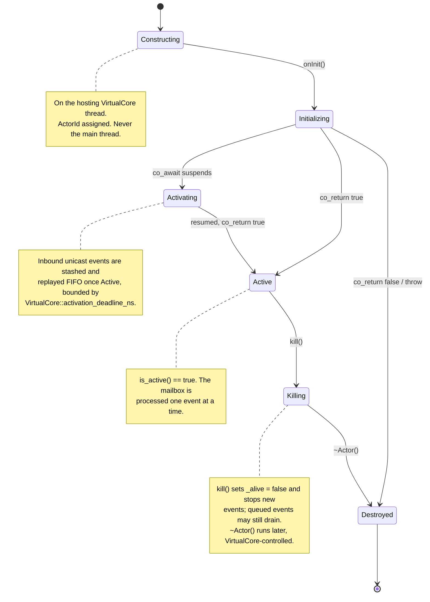

# The actor model in qb

> **Audience:** Adopter · **Status:** stable · **Verified-against:** qb 3.0.0 (C++20 default, C++23 supported)

An actor is an isolated unit of state and behavior that communicates only by passing events; the runtime processes each actor's mailbox one event at a time, so its private state needs no locks.

**Prerequisites:** [Core concepts overview](./README.md) — **See also:** [The event system](./event_system.md), [Concurrency and parallelism](./concurrency.md), [qb-core: the Actor API](../4_qb_core/actor.md)

## Summary

The qb runtime is built on the [actor model](https://en.wikipedia.org/wiki/Actor_model). Rather than managing threads, mutexes, and shared queues directly, you write **actors**: objects that own their state, react to messages, and never touch another actor's memory. The engine assigns each actor to a single worker thread (a `qb::VirtualCore`), delivers messages to its mailbox, and runs its handlers one at a time. Because an actor's own handlers never execute concurrently, its member variables are free of data races by construction.

This page covers the actor abstraction itself: the `qb::Actor` base class, the `qb::ActorId` identity, the lifecycle hooks (`onInit`, `kill`, the destructor), single-event-at-a-time mailbox processing, and state isolation. It does not cover the full sending API or engine wiring — those are owned by [The event system](./event_system.md) and [qb-core: the Actor API](../4_qb_core/actor.md).

## Concepts

### `qb::Actor`: the unit of computation

Every actor inherits from `qb::Actor` (`qb/core/Actor.h`). The base class is non-copyable — it derives from `qb::nocopy`, so an actor is owned by its `VirtualCore` and addressed by its `ActorId`, never copied or moved by application code. Three properties define an actor:

- **Isolated state.** An actor's data members are its private state. No other actor can read or write them directly; the only way to influence an actor is to send it an event. This is what eliminates data races as a class of bug.
- **Message-driven behavior.** Actors interact exclusively by sending asynchronous messages — **events**, all derived from `qb::Event`. An actor's behavior is the set of `on(const SomeEvent&)` handlers it registers.
- **Sequential processing.** Each actor has a mailbox. Its hosting `VirtualCore` removes events one at a time and dispatches each to the matching handler before starting the next. An actor's handlers therefore never run concurrently with one another, so the actor's own state is safe to mutate without locks.

```text
+-----------+        push<MyEvent>(B, ...)        +-----------+
|  Actor A  | ----------------------------------> |  Actor B  |
| (sender)  |                                     | (receiver)|
+-----------+                                     +-----------+
                                                       |
   1. A constructs and pushes MyEvent toward B         | 3. B's VirtualCore dispatches
   2. The event lands in B's mailbox                   |    MyEvent to B::on(const MyEvent&)
```

### Defining an actor

The example below is a self-contained counter actor. It registers its event handler in `onInit()`, mutates private state in the handler, and terminates itself once a threshold is reached.

```cpp
// <!-- src: examples/01-actors/01-hello-actor.cpp (adapted) -->
#include <qb/actor.h>   // qb::Actor, qb::ActorId
#include <qb/event.h>   // qb::Event, qb::KillEvent
#include <qb/io.h>      // qb::io::cout (thread-safe console output)

// 1. Define an event. Events derive from qb::Event and carry their payload.
struct CountEvent : qb::Event {
    int increment_by;
    explicit CountEvent(int amount) : increment_by(amount) {}
};

// 2. Define an actor. Custom actors inherit from qb::Actor.
class CounterActor : public qb::Actor {
    int _current_count = 0;   // private state — no other actor can touch this

public:
    // onInit() runs once after construction and ID assignment, before any
    // event is processed. It is the place to subscribe to event types.
    qb::io::async::task<bool> onInit() override {
        registerEvent<CountEvent>(*this);   // subscribe: route CountEvent to on(const CountEvent&)
        qb::io::cout() << "CounterActor [" << id() << "] on core "
                       << getIndex() << " ready\n";
        co_return true;   // returning false aborts startup and destroys the actor
    }

    // Event handler. Registered handlers are public methods named on(),
    // taking the event type by const reference (or non-const, to reply/forward).
    void on(const CountEvent &event) {
        _current_count += event.increment_by;
        qb::io::cout() << "CounterActor [" << id() << "] count is now "
                       << _current_count << '\n';
        if (_current_count >= 10) {
            kill();   // request self-termination
        }
    }

    // Destructor runs after the actor has terminated and the engine removes it.
    // Use members with their own destructors (qb::string, std::unique_ptr, ...)
    // for resource cleanup; RAII applies here.
    ~CounterActor() override {
        qb::io::cout() << "CounterActor [" << id() << "] destroyed; final count "
                       << _current_count << '\n';
    }
};
```

Three points carry most of the model:

- **`onInit()` is where subscriptions happen.** Call `registerEvent<YourEvent>(*this)` for each event type the actor handles. Returning `false` aborts startup: the actor is not added to the engine and is destroyed immediately. By default an actor is already subscribed to five system events at construction — see [Default system events](#default-system-events).
- **Handlers are `on(...)` methods.** A registered handler is a public member function `void on(const YourEvent&)` (or `void on(YourEvent&)` when it needs to `reply` or `forward`).
- **`kill()` requests termination.** An actor can shut itself down from any handler. The call only flags the actor — see [Lifecycle](#lifecycle).

The default `KillEvent` handler in `qb::Actor` already calls `kill()` for you, so an actor that needs no custom shutdown logic does not have to write `on(const qb::KillEvent&)` at all.

### Actor identity: `qb::ActorId`

Every actor has a unique `qb::ActorId` (`qb/core/ActorId.h`). The id is the address you send events to.

- **Composition.** An `ActorId` packs two 16-bit fields into a 32-bit value: a `ServiceId` (the actor's slot within its core) and a `CoreId` (which `VirtualCore` hosts it). Both `CoreId` and `ServiceId` are `uint16_t`. The value is bit-castable to and from `uint32_t` (`ActorId` defines `operator uint32_t()` and a `uint32_t` constructor, both implemented with `std::bit_cast`).
- **Accessors.** `sid()` returns the `ServiceId`; `index()` returns the `CoreId`; `is_valid()` reports whether the id is assigned (not the default `NotFound == 0`); `is_broadcast()` reports whether it is a per-core broadcast id.
- **Obtaining it.** Inside an actor, call `id()`. At creation time, `engine.addActor<MyActor>(core_id, ...)` returns the new actor's id, and `addRefActor<Child>()` returns a phase-aware `qb::ActorHandle<Child>` whose `.id()` gives the child's id (valid immediately, even while the child is still Activating).

Two special values:

- `qb::ActorId{}` — the default-constructed, invalid id (`NotFound`, numeric value `0`). Use it for an as-yet-unassigned id member; `is_valid()` returns `false`.
- `qb::BroadcastId(core_id)` — a per-core broadcast address whose `ServiceId` is the reserved `ActorId::BroadcastSid` (the maximum `ServiceId` value). Used as `push<Event>(qb::BroadcastId(core_id), ...)` to deliver an event to every actor on `core_id`. To reach every actor on every core, use `broadcast<Event>(...)` instead.

```cpp
// Inside an actor method:
qb::ActorId self = id();

if (_target.is_valid()) {                 // _target is an ActorId member
    push<MyEvent>(_target, /* args */);
}

// Deliver to every actor on core 1:
push<SystemUpdateEvent>(qb::BroadcastId(1), /* args */);
```

### Lifecycle

An actor moves through a fixed sequence of stages. The hooks you control are `onInit()`, `kill()`, and the destructor.



Key invariants, each grounded in the source:

- **Construction is thread-affine.** An actor must be constructed from within a `VirtualCore` worker thread, never from the main thread or an arbitrary user thread. The constructors assert this (`VirtualCore::_handler != nullptr`). In practice you never call the constructor directly — you use `engine.core(idx).addActor<T>(...)`, `engine.addActor<T>(idx, ...)`, or `addRefActor<T>(...)`, all of which run the construction on the correct thread.
- **`onInit()` runs exactly once**, after construction and id assignment, before any business event is processed. It is an async coroutine (`qb::io::async::task<bool>`): `co_return true` activates the actor, `co_return false` or an uncaught exception aborts registration and immediately destroys it. While a suspended `onInit()` is in flight the actor is **Activating** — unicast business events are stashed and replayed FIFO once active, bounded by `qb::VirtualCore::activation_deadline_ns`. `is_active()` reports whether activation completed (vs `is_alive()`).
- **`kill()` only flags.** It sets the internal `_alive` flag to `false` and asks the `VirtualCore` to schedule removal. The actor stops receiving *new* events but may still drain events already queued; `~Actor()` runs later, under `VirtualCore` control, not at the point of the `kill()` call. `kill()` is `const noexcept` — handlers can call it even through a const `this`.
- **The destructor is the RAII boundary.** It runs after the actor has terminated and the engine removes it. Member objects with their own destructors are cleaned up here; this is the natural place to release anything not covered by RAII members.

The full lifecycle walkthrough, the `is_alive()` semantics, and graceful-shutdown patterns are owned by [qb-core: the Actor API](../4_qb_core/actor.md). Runnable lifecycle coverage lives in [`tests/core/system/lifecycle/`](../../tests/core/system/lifecycle/).

### Default system events

Constructing an actor with the default constructor auto-subscribes it to five system events: `KillEvent`, `SignalEvent`, `UnregisterCallbackEvent`, `PingEvent`, and `RequireEvent`. This is why a plain actor already shuts down cleanly on `Main::stop()` and on `SIGINT` without any handler code: the built-in `on(const KillEvent&)` calls `kill()`, and the built-in `on(const SignalEvent&)` calls `kill()` on **`SIGINT` and `SIGTERM`** — both are terminal, and `Main::start()` installs both, so a container stop (`SIGTERM` is what Docker, Kubernetes and systemd send first) unwinds every actor without escalating to `SIGKILL`. Every other signal is delivered but is **not** terminal: a signal added with `qb::Main::registerSignal()` (`SIGHUP`, `SIGUSR1`, …) arrives and is ignored unless you override `on(SignalEvent&)`. (`src/qb/core/Actor.cpp:120-124,168-171,186-187`, `src/qb/core/Actor.h:417`, `src/qb/core/Main.cpp:530-531`)

For pools of short-lived actors where five subscriptions per actor are measurable overhead, pass `qb::no_default_events` to the base constructor to skip all five. The derived class is then responsible for registering, in `onInit()`, any system event it expects — at minimum **`SignalEvent`**, which is how `Main::stop()` and the terminal signals arrive; the engine never sends a `KillEvent`, so registering that one alone leaves the actor unstoppable.

```cpp
class LeanWorker : public qb::Actor {
public:
    LeanWorker() : qb::Actor(qb::no_default_events) {}  // no default subscriptions

    qb::io::async::task<bool> onInit() override {
        registerEvent<qb::SignalEvent>(*this);  // re-add graceful shutdown by hand — THIS is the one
        registerEvent<qb::KillEvent>(*this);    // only needed if a peer kills you by pushing one
        registerEvent<WorkEvent>(*this);
        co_return true;
    }

    void on(WorkEvent &ev) { /* ... */ }

    // Declaring `on(WorkEvent&)` hides EVERY base `on` overload, and dispatch goes through the
    // derived type — so both of these are needed for the two registrations above to compile.
    void on(qb::KillEvent const &) { kill(); }
    void on(qb::SignalEvent const &) { kill(); }
};
```

### State isolation and thread safety

Because a `VirtualCore` runs an actor's handlers one at a time and an actor never migrates between cores, an actor's own member variables have a single reader and a single writer on a single thread. The framework relies on this: even the internal `_alive` liveness flag needs no atomic, no fence, and no lock. Remote senders never touch an actor's state directly — they only enqueue events into its core's mailbox.

That guarantee covers an actor's *own* state only. It does not extend to memory shared outside the actor model.

## Pitfalls

- **Do not block in a handler.** Event handlers and `qb::ICallback::on(qb::LoopEvent const&)` implementations run on the `VirtualCore` thread and must never block. A long computation, a synchronous file read, or a wait on an external lock freezes the entire core, stalling *every* actor assigned to it. Offload long work to a spawned coroutine (`spawn`) or a dedicated worker actor; `qb::io::async::defer` moves it off the current handler frame but keeps it on the same core's turn, and `qb::io::async::callback` **without** a delay does not move it at all — it runs inline. See [Asynchronous I/O](./async_io.md).
- **`kill()` is not immediate.** It flags the actor; queued events may still be processed and the destructor runs later. Do not assume the actor is gone the instant `kill()` returns.
- **Sharing external state is your responsibility.** The lock-free guarantee applies only to an actor's private members. If an actor must touch a global, a static, or a non-thread-safe third-party library, you must serialize that access yourself — typically by funneling all access through one dedicated "manager" actor so the actor model serializes it for you.
- **Direct calls on referenced actors bypass the mailbox.** `addRefActor<T>()` returns a phase-aware `qb::ActorHandle<T>`; calling `handle->method()` skips the child's event queue and its one-event-at-a-time guarantee. Only call through the handle when `handle.ready()` (the child is active) — `get()`/`operator->` return `nullptr` (debug `assert`) while it is Activating or after it died, never a dangling pointer. Prefer sending events to `handle.id()` (always safe; stashed while Activating). See [qb-core: the Actor API](../4_qb_core/actor.md).
- **`send()` requires a trivially destructible event.** The unordered `send<Event>()` path requires the event type to be trivially destructible and does not guarantee delivery order; prefer the ordered `push<Event>()` for almost all cases. Ordering and delivery semantics are detailed in [The event system](./event_system.md).

## See also

- [The event system](./event_system.md) — defining events, the `push`/`send`/`reply`/`forward` API, and ordering guarantees.
- [Concurrency and parallelism](./concurrency.md) — how `qb::Main` and `qb::VirtualCore` schedule actors across cores.
- [Asynchronous I/O](./async_io.md) — keeping handlers non-blocking with the event loop and `qb::io::async::callback`.
- [qb-core: the Actor API](../4_qb_core/actor.md) — the complete actor reference: full lifecycle, callbacks, referenced actors, services, and coroutines.
- [Getting started](../6_guides/getting_started.md) — these concepts in a first runnable program.
