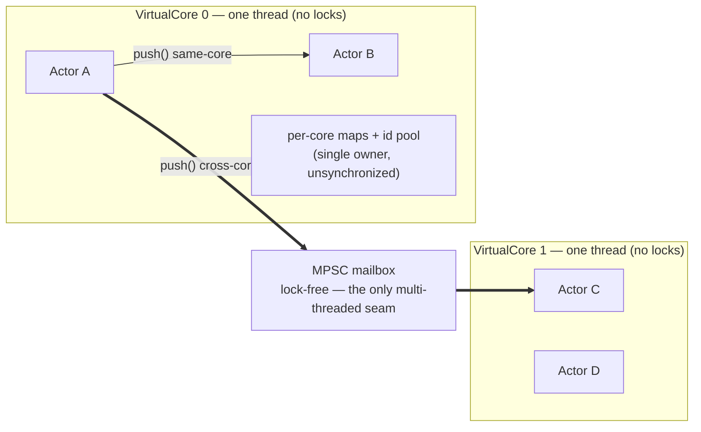

# Concurrency in qb

> **Audience:** Adopter · **Status:** stable · **Verified-against:** qb 3.0.0 (C++20 default, C++23 supported) @ b87d39a

qb makes the actor the unit of concurrency: each actor owns its state, runs on exactly one worker thread, and processes its mailbox one event at a time, so application code never reaches for a mutex.

**Prerequisites:** [The actor model](./actor_model.md), [The event system](./event_system.md) — **See also:** [Asynchronous I/O](./async_io.md), [The engine](../4_qb_core/engine.md), [Lock-free primitives](../7_reference/lockfree_primitives.md), [Core invariants](../7_reference/core_invariants.md)

## Summary

Concurrency in qb is built on one rule: **no two threads ever touch the same mutable state**. An actor is the unit of concurrency. It is created on a single [`VirtualCore`](../4_qb_core/engine.md) worker thread, it never migrates to another thread, and the events addressed to it are delivered to that thread and processed sequentially. Because an actor's state is reachable only from its own event handlers — which run one at a time — its members need no locks, no atomics, and no memory fences.

Parallelism comes from running many actors across many cores. The [`qb::Main`](../4_qb_core/engine.md) engine spawns one `VirtualCore` per logical core, distributes actors across them, and moves cross-core events over lock-free queues. You write the same single-threaded-looking handler code whether an actor talks to a neighbor on its own core or a peer three cores away.

This page contrasts that model with threads-and-mutexes, states the delivery guarantees precisely, and marks the one place where qb's *internals* are genuinely multi-threaded (the lock-free message-passing surface) versus everywhere else, which is single-thread-per-core by construction.

## Concurrency versus parallelism

The two terms describe different things, and qb provides both through one mechanism.

- **Concurrency** is the system making progress on many tasks that overlap in time. A single `VirtualCore` is concurrent: it interleaves event handlers, timer callbacks, and non-blocking I/O for all of its actors on one thread, never blocking on a syscall while other work waits. This comes from [`qb-io`](./async_io.md)'s event loop.
- **Parallelism** is many tasks executing at the same instant on different physical cores. qb achieves parallelism by placing actors on different `VirtualCore` threads, each of which the operating system can schedule on a separate CPU core.

You do not choose between them. A qb application is concurrent within each core and parallel across cores, and the actor model is what keeps both safe.

## The actor as the unit of concurrency

In a threads-and-mutexes design, the unit of concurrency is the *thread*, and shared data structures are the hazard: every object reachable from two threads needs a lock, and the burden of getting the locking right is on you. qb inverts this. The unit of concurrency is the *actor*, and the framework guarantees that no actor's state is reachable from another thread.

Three structural invariants make this hold:

1. **One actor, one thread, for life.** An actor is constructed on a `VirtualCore` worker thread and is strictly thread-affine — it never migrates between cores. Even shutdown is mediated by messages: a remote sender that wants to stop an actor enqueues a `KillEvent` into the target core's mailbox; it never flips the actor's state directly. (`src/qb/core/Actor.h:211-218`)

2. **A core owns its actors exclusively.** A `VirtualCore` owns its set of actors in a single thread; its internal actor maps and id pool perform no synchronization, because no other thread reaches them. Actors communicate only via events and pipes, never by touching another core's actor state. (`src/qb/core/VirtualCore.h:177-178`)

3. **Construction is core-thread-only.** An actor must be created from within a worker thread, through [`Main::core(idx).addActor<T>(...)`](../4_qb_core/engine.md) or `addRefActor<T>()`. Constructing one from the main thread or an arbitrary user thread is a programming error. (`src/qb/core/Actor.cpp:115-118`)

The payoff is in the framework's own code: the actor's `_alive` flag needs no atomic, lock, or fence, because it has a single writer and a single reader, both on the same thread. (`src/qb/core/Actor.h:211-218`) Your actor members get the same treatment for free — a plain `int` counter or `std::vector` buffer is race-free without any annotation, as long as it lives inside the actor.

## No shared mutable state

The model only holds if you respect its one boundary: do not share mutable state between actors. Two patterns preserve the guarantee, and two patterns break it.

**Preserves the guarantee:**

- **Communicate by passing events.** Copy the data the recipient needs into an [event](./event_system.md) and `push()` it. The recipient processes its own copy on its own thread.
- **Move ownership through events.** A move-only payload (for example a `std::unique_ptr` carried in an event) transfers ownership from sender to recipient; once sent, the sender must not touch it. Only one actor owns the data at any instant.

**Breaks the guarantee — do not do this:**

- **A shared pointer to mutable state passed between actors on different cores.** Two threads then mutate the same object concurrently, and you are back to the data races the model exists to prevent. If two actors must share data, give it to one actor and have the other ask for it by message.
- **A `static` or global mutable variable touched from handlers on different cores.** This is shared mutable state by another name.

Read-only sharing is fine: immutable data, or a `std::shared_ptr<const T>`, can be referenced by many actors because nobody writes it.

## Ordered, one-at-a-time delivery

Within a single `VirtualCore`, actors execute their `on(Event&)` handlers and `on(qb::LoopEvent const&)` ticks **one at a time, to completion**. The core finishes processing one event for one actor before it starts the next event for any actor on that core. This is what eliminates data races on an actor's own state — no handler can ever observe a half-updated member, because no two handlers run at the same time on that thread. (`src/qb/core/VirtualCore.h:177-178`)

Delivery ordering between two specific actors depends on which send primitive you use:

| Primitive | Ordering | Event constraint | Failure mode |
|---|---|---|---|
| `push<Event>(dest, …)` | FIFO from the same source to the same destination, including cross-core | any event (supports non-trivially-destructible members) | `noexcept`; throw across the boundary calls `std::terminate()` |
| `send<Event>(dest, …)` | none, even same-core same-destination | must be trivially destructible | `noexcept`; throw across the boundary calls `std::terminate()` |

`push()` is the primary, recommended primitive. Events pushed from a given source actor to a given destination actor are processed in the order they were pushed, even when the two actors live on different cores. (`src/qb/core/Actor.h:850`, `src/qb/core/Pipe.h:118`) `send()` trades that ordering for a narrower contract and is reserved for fire-and-forget, order-independent notifications of trivially-destructible event types. (`src/qb/core/Actor.h:873`)

Both `push()` and `send()` are `noexcept`. The messaging hot path may grow a buffer or run an event constructor that throws (for example under out-of-memory); a throw across that `noexcept` boundary calls `std::terminate()` and aborts the process. Keep events small and allocation-light. This is intentional. (`src/qb/core/Actor.h:871-874`, `src/qb/core/Pipe.h:126`)

Ordering is *pairwise*. `push()` orders messages along one source→destination pipe. It does not impose a global order across different sources or different destinations: if actors A and B both push to C, C sees A's messages in order and B's messages in order, but the two streams may interleave arbitrarily.

## Parallelism across cores

The [`qb::Main`](../4_qb_core/engine.md) engine turns the single-core model into a multicore one. It spawns one `qb::jthread` per `VirtualCore` (`std::jthread` when the standard library provides it, qb's C++20 fallback otherwise), each running its own [`qb-io` event loop](./async_io.md), and distributes actors across them. You assign an actor to a core when you add it:

<!-- src: examples/core/example3_multicore.cpp (adapted) -->
```cpp
#include <qb/actor.h>
#include <qb/main.h>
#include <qb/io.h>

#include <thread>
#include <vector>

struct WorkEvent : qb::Event {
    int value;
    explicit WorkEvent(int v) : value(v) {}
};

// Runs on whichever core it was placed on; processes its mailbox sequentially.
class WorkerActor : public qb::Actor {
public:
    qb::io::async::task<bool> onInit() final {
        registerEvent<WorkEvent>(*this);
        co_return true;
    }

    void on(const WorkEvent &event) {
        // No lock: this actor's state is reachable only from this thread.
        qb::io::cout() << "worker " << id() << " on core " << getIndex()
                       << " handled " << event.value << '\n';
    }
};

// Lives on core 0; fans work out to workers on other cores via push().
class DispatcherActor : public qb::Actor {
    std::vector<qb::ActorId> _workers;

public:
    explicit DispatcherActor(std::vector<qb::ActorId> workers)
        : _workers(std::move(workers)) {}

    qb::io::async::task<bool> onInit() final {
        for (int i = 0; i < 9; ++i)
            push<WorkEvent>(_workers[i % _workers.size()], i); // cross-core, ordered per worker
        co_return true;
    }
};

int main() {
    qb::Main engine;

    const unsigned cores = std::max(2u, std::thread::hardware_concurrency());
    std::vector<qb::ActorId> workers;
    for (unsigned core = 0; core < cores; ++core)
        workers.push_back(engine.addActor<WorkerActor>(core)); // one worker per core

    engine.addActor<DispatcherActor>(0, workers);             // dispatcher on core 0

    engine.start();   // async by default: returns once all cores report ready
    engine.join();    // block until every actor has stopped
    return 0;
}
```

`addActor<T>(core, args...)` returns the new actor's `ActorId` (`src/qb/core/Main.h:611`), which you pass to `push()` to address it from anywhere in the system. The dispatcher's `push<WorkEvent>` calls cross thread boundaries transparently: the framework places each event into the destination core's mailbox, and the destination core delivers it to the right `on()` handler during its own loop. From the handler's point of view there is no difference between a same-core and a cross-core message.

By default `start()` is asynchronous: it returns once all cores report ready, and you call `join()` later to block until shutdown. (`src/qb/core/Main.cpp:292`)

> All actors and per-core configuration must be set up **before** `Main::start()`. `Main::core()` throws `std::runtime_error` once the engine is running. (`src/qb/core/Main.cpp:369`)

## Two threading surfaces: lock-free internals, single-thread-per-core code

qb is single-thread-per-core almost everywhere, with exactly one genuinely multi-threaded surface inside the engine. Knowing which is which tells you where you can write plain code and where the framework is doing the hard part for you.



**Single-thread-per-core (the surface you write against).** Your actors, their state, their event handlers, their `on(qb::LoopEvent const&)` ticks, and the per-core data structures the engine keeps for them all live on one thread. No part of the public actor API requires you to reason about concurrent access to your own state. The framework's own per-core structures — the actor maps, the service-id pool — also perform no synchronization, because they are owned by a single worker thread. (`src/qb/core/VirtualCore.h:177-178`)

**Lock-free, real multi-threaded (the engine's message bus).** The one place where multiple threads genuinely meet is cross-core event delivery. Each `VirtualCore` has an incoming mailbox built on a multi-producer, single-consumer (MPSC) lock-free ring buffer: every other core can enqueue into it concurrently, while the owning core is the only consumer. (`src/qb/core/Main.h:328`, backed by `qb::lockfree::mpsc::ringbuffer` from `src/qb/system/lockfree/mpsc.h`) The enqueue path takes no lock; a per-mailbox `std::mutex` and `std::condition_variable` are used only to let an idle consumer sleep when its core latency is greater than zero, never to move an event. (`src/qb/core/Main.h:330-331`, used only by `wait()` at `src/qb/core/Main.h:348-354`) This is the seam that lets ordered, transparent `push()` cross thread boundaries. The lock-free primitives are documented separately in [Lock-free primitives](../7_reference/lockfree_primitives.md); you use them through `push()`/`send()` and rarely touch them directly.

The practical rule: trust the model. Write your handlers as if single-threaded — because for your state, they are — and let the lock-free message bus carry data between cores.

## Tuning core behavior

A `VirtualCore`'s idle behavior is configurable per core, before the engine starts, through its [`CoreInitializer`](../4_qb_core/engine.md) (obtained from `Main::core(id)`):

- **Idle latency** — `engine.core(id).setLatency(qb::duration)`. The default, `qb::duration::zero()`, is low-latency busy-spin: the core spins at 100% CPU on its assigned core to process events with minimal delay. A value greater than zero lets the core sleep for up to that duration when idle, lowering CPU usage at the cost of a potential worst-case latency before a new event is picked up. (`src/qb/core/Main.h:284`)
- **CPU affinity** — `engine.core(id).setAffinity(qb::CoreIdSet{…})`. Pins the `VirtualCore` thread to a set of physical CPUs, which can help cache locality and reduce thread migration. Affinity is best-effort: a logical qb `CoreId` need not map to a physical CPU, so a failed pin warns and never fails startup. (`src/qb/core/VirtualCore.cpp:426-432`)

Both calls return the `CoreInitializer` for chaining and must run before `start()`. See [Performance tuning](../6_guides/performance_tuning.md) for guidance on choosing values.

## Pitfalls

- **Sharing mutable state between actors.** A `std::shared_ptr` to a mutable object, a global, or a `static` touched from handlers on different cores reintroduces the data races the model prevents. Pass data by event; move ownership when handoff is needed; share only immutable data.
- **Assuming a global event order.** `push()` orders one source→destination pair, not the whole system. Do not rely on messages from different senders, or to different recipients, arriving in any particular interleaving.
- **Letting an event constructor throw or allocate heavily.** `push()`/`send()` are `noexcept`; a throw across that boundary calls `std::terminate()`. Keep events small and allocation-light. (`src/qb/core/Pipe.h:126`)
- **Blocking inside a handler or `on(qb::LoopEvent const&)`.** Both run on the `VirtualCore` event-loop thread. A blocking call (a synchronous syscall, a sleep, a long computation) stalls that core and every actor on it. Use [`qb-io`](./async_io.md)'s non-blocking operations instead. (`src/qb/core/ICallback.h:16`)
- **Using `send()` where order matters.** `send()` gives no ordering guarantee even same-core, same-destination, and requires trivially-destructible events. Default to `push()`. The requirement is compiler-enforced only for events deriving from `qb::EventQOS0` — `VirtualCore::fill_event`'s `static_assert` sits inside `if constexpr (event_qos0_type<T>)`, so a plain `qb::Event` subclass holding a `std::string` compiles silently and leaks if the engine ever drops it. (`src/qb/core/Actor.h:900`, `src/qb/core/VirtualCore.h:795-797`)
- **Touching another core's actor state directly.** Holding a raw pointer to an actor on another core and calling its methods bypasses the model and races. Address it by `ActorId` and `push()`. (`src/qb/core/VirtualCore.h:177-178`)
- **Configuring cores after `start()`.** Affinity, latency, and actor placement must be set before the engine runs; `Main::core()` throws once started. (`src/qb/core/Main.cpp:369`)

## See also

- [The actor model](./actor_model.md) — what an actor is and how it is defined.
- [The event system](./event_system.md) — defining events and the `push`/`send`/`reply`/`forward` primitives.
- [Asynchronous I/O](./async_io.md) — the non-blocking event loop each `VirtualCore` runs.
- [The engine](../4_qb_core/engine.md) — `Main`, `VirtualCore`, and `CoreInitializer` in depth.
- [Lock-free primitives](../7_reference/lockfree_primitives.md) — the MPSC ring buffer behind cross-core delivery.
- [Performance tuning](../6_guides/performance_tuning.md) — choosing latency, affinity, and actor placement.
- [Core invariants](../7_reference/core_invariants.md) — the full list of runtime guarantees.
- [Glossary](../7_reference/glossary.md) — definitions of actor, VirtualCore, mailbox, and related terms.
