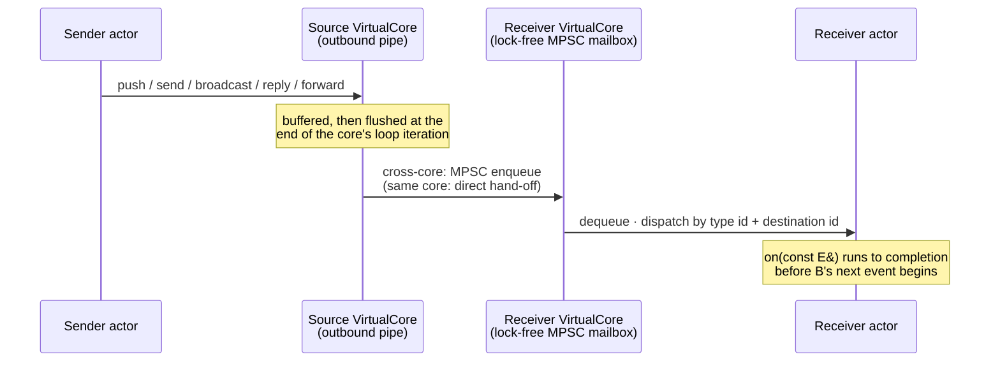

# The event system

> **Audience:** Adopter · **Status:** stable · **Verified-against:** qb 2.6.0 (C++20 default, C++23 supported)

Events are the only channel through which actors communicate; this page covers how to define them, how the five delivery primitives differ, and what ordering and lifetime guarantees the runtime makes.

**Prerequisites:** [The actor model](./actor_model.md) — **See also:** [Concurrency model](./concurrency.md), [Asynchronous I/O model](./async_io.md), [qb-core: event messaging](../4_qb_core/messaging.md), [qb-core: the actor](../4_qb_core/actor.md)

## Summary

In qb, actors never share memory and never call each other's methods across the actor boundary. They exchange typed messages called *events*. An event is a small C++ object that derives from `qb::Event`; the runtime carries it from a source actor to a destination actor and invokes the destination's handler for that exact type. Because each actor processes its events one at a time on a single `VirtualCore` worker thread, an event handler never races against the actor's other handlers, and the actor's state stays free of locks.

This page is grounded in two headers: `qb/core/Event.h` (the event base class and its variants) and `qb/core/Actor.h` (the send and receive API). The lower-level pipe mechanics referenced here live in `qb/core/Pipe.h`.

## Concepts

### `qb::Event`: the message base class

Every message exchanged between actors derives publicly from `qb::Event`, defined in `qb/core/Event.h`. The base class is cache-line aligned (`QB_LOCKFREE_CACHELINE_ALIGNMENT`) and carries the metadata the runtime needs to route and recycle the message. Those fields are private; you read them through accessors and never set them yourself.

| Accessor | Returns | Meaning |
| --- | --- | --- |
| `getID()` | `Event::id_type` | The event's type identifier, used to dispatch to the matching `on()` handler. |
| `getSource()` | `qb::ActorId` | The `ActorId` of the actor that sent the event. |
| `getDestination()` | `qb::ActorId` | The `ActorId` the event was routed to. |
| `getQOS()` | `uint8_t` | Quality-of-service level: `2` on the base `Event` (the default), `0` on `EventQOS0`. Read only by the cross-core flush, as a binary `!= 0` gate. |
| `is_alive()` | `bool` | Framework liveness bit used during event reuse by `reply()`/`forward()`. |
| `getSize()` | `std::size_t` | Total bytes the event occupies in the pipe (its bucket count times the bucket size). |

The type identifier is assigned by `qb::type_id<T>()`, a dense, collision-free 16-bit counter incremented once per distinct type through a magic-static barrier (`qb::detail::type_id_for`). It is stable for the lifetime of the process and safe across concurrent first use; you do not assign or compare it manually.

Treat events as plain data carriers. The receiving actor reads the data and decides what to do; keep behavior in the actor, not in the event.

### Defining your own events

Derive a `struct` (or `class`) from `qb::Event` and add data members. The framework constructs your event in place inside the destination pipe, forwarding the constructor arguments you pass to the send call.

```cpp
// src: derived from qb/core/Event.h and examples/core/example2_basic_actors.cpp
#include <qb/core/Event.h> // qb::Event
#include <qb/string.h>     // qb::string<N>
#include <cstdint>
#include <memory>
#include <string>
#include <vector>

// 1. A pure signal: a type with no payload.
struct StartProcessing : qb::Event {};

// 2. Plain data members.
struct UpdateValue : qb::Event {
    int    key;
    double value;
    UpdateValue(int k, double v) : key(k), value(v) {}
};

// 3. A fixed-capacity string member: no heap allocation, trivially destructible.
struct LogLine : qb::Event {
    qb::string<128> text; // up to 128 chars
    explicit LogLine(const char *msg) : text(msg) {}
};

// 4. Heap-owned text. NOTE: a by-value std::string is NOT safe in an event -- a short one
//    points into its own inline buffer on libstdc++, and the runtime memcpy-relocates events
//    (pipe growth, reply/forward, every cross-core hop -- same core is no exception).
//    Box it (or use qb::string<N> above) so only a heap pointer travels.
struct UserCommand : qb::Event {
    std::shared_ptr<std::string> input;
    explicit UserCommand(std::string in)
        : input(std::make_shared<std::string>(std::move(in))) {}
};

// 5. Large payload shared by pointer, so only the pointer is copied across cores.
struct ProcessBuffer : qb::Event {
    std::shared_ptr<std::vector<std::uint8_t>> buffer;
    explicit ProcessBuffer(std::shared_ptr<std::vector<std::uint8_t>> b)
        : buffer(std::move(b)) {}
};
```

Guidance for payload data:

- **Small POD-like data:** direct members are the right choice.
- **`qb::string<N>`:** use when a string has a known, modest maximum length. It avoids heap allocation and stays trivially destructible, so it is usable with `send()` as well as `push()`.
- **`std::vector`, smart pointers, and other heap-backed members:** valid with `push()`. The framework calls the event's destructor after delivery, so these members are cleaned up correctly. They are **not** permitted with `send()`.
- **A by-value `std::string` is NOT valid in an event, on any path.** The runtime relocates events with raw `memcpy`: the bytes are copied to a new address and the source is abandoned without a destructor running there, so a member holding a pointer into its own storage dangles after the move. This is not a cross-core-only concern: the source pipe `memcpy`s everything it already holds when it grows, and `reply`/`forward` byte-recycle the event — both apply to a same-core `push`. A *short* `std::string` is exactly the offending shape on libstdc++ (small-string buffer referenced by an internal pointer): the receiver reads reused memory and its destructor frees a non-heap address. libc++ recomputes `data()` from `this`, so this corrupts on Linux while passing every macOS test. Use `qb::string<N>`, or box the string in a `std::shared_ptr`. ([Full rule, and what the debug-build check does and does not cover](../4_qb_core/messaging.md#push--ordered-the-default).)
- **Large or shared payloads:** wrap them in a `std::shared_ptr` so that crossing cores copies only the pointer, not the bytes.

### System and quality-of-service variants

`qb/core/Event.h` also defines events the runtime itself uses, and which your handlers may opt into:

- `qb::KillEvent` — requests an actor to terminate. The default `qb::Actor::on(const KillEvent&)` calls `kill()`.
- `qb::SignalEvent` — delivers an OS signal number to an actor.
- `qb::PingEvent` / `qb::RequireEvent` — drive actor discovery via `require<T>()`; see [the actor model](./actor_model.md).
- `qb::EventQOS0` — a distinct base whose constructor sets QoS to `0`, the lowest priority; `EventQOS2` and `EventQOS1` are aliases of `Event` itself (priority is held in the header).
- `qb::ServiceEvent` — a base for service-to-service messages that can be bounced back to a forwarding address through its `received()` helper.

## Sending events

All five send primitives are members of `qb::Actor`, so you call them from inside a handler or lifecycle method. Each constructs the event in the destination's pipe; you never allocate it yourself.

### `push` — ordered delivery (the default)

```cpp
template <typename _Event, typename... _Args>
_Event &push(ActorId const &dest, _Args &&...args) const noexcept;
```

`push<E>(dest, args...)` constructs an `E` in the pipe from this actor (the source) to `dest` and returns a **mutable reference** to it, valid until the runtime flushes the pipe at the end of the current processing step. You may set additional fields on the returned reference before it is sent. Use `push` unless you have a specific reason not to.

```cpp
// src: derived from qb/include/qb/core/Actor.h (push, mutable-reference idiom)
auto &evt = push<UpdateValue>(target_id, /*key=*/7, /*value=*/0.0);
evt.value = 42.5; // modify before the pipe is flushed
```

**Ordering guarantee.** Events sent with `push` from one source actor to one destination actor are delivered in the order they were pushed (FIFO per source→destination pipe). This is a *pairwise* guarantee: it says nothing about the relative order of events arriving at one actor from *different* sources, nor about events sent to *different* destinations.

The fluent form `to(dest)` returns an `EventBuilder` that chains pushes over the same pipe, preserving that order:

```cpp
// src: qb/include/qb/core/Actor.h (EventBuilder)
to(target_id)
    .push<StartProcessing>()
    .push<UpdateValue>(7, 42.5)
    .push<LogLine>("done");
```

### `send` — unordered, for trivially destructible events

```cpp
template <typename _Event, typename... _Args>
void send(ActorId const &dest, _Args &&...args) const noexcept;
```

`send<E>(dest, args...)` is a fire-and-forget variant. It returns nothing and makes **no ordering guarantee** (even between two sends from the same source to the same destination). `E` **must be trivially destructible**: `send` is the primitive fire-and-forget messages use, and a fire-and-forget message should derive from `qb::EventQOS0` — the one class of event the engine is allowed to **drop** when a peer's mailbox is full, discarding it without running its destructor. Events holding a `std::vector` or another heap-backed member are not valid here; use `qb::string<N>` or plain data members instead. Prefer `push` unless ordering genuinely does not matter for the message.

The trivially-destructible requirement is a usage contract documented on `Actor::send` (`qb/include/qb/core/Actor.h`). It is enforced at compile time only for events that derive from `qb::EventQOS0`, through a `static_assert` in `qb::VirtualCore::fill_event` (`qb/include/qb/core/VirtualCore.tpp`); a plain `qb::Event` subclass with a non-trivial member still compiles, so the constraint is yours to honor.

### `broadcast` — every actor on every core

```cpp
template <typename _Event, typename... _Args>
void broadcast(_Args &&...args) const noexcept;
```

`broadcast<E>(args...)` delivers a copy of the event to every actor currently running across all `VirtualCore`s, with this actor as the source. It is built on the `send` path (`qb::VirtualCore::broadcast` calls `send` once per core), so it carries the same trivially-destructible expectation: broadcast plain-data or `qb::string<N>` events, not events holding `std::string`/`std::vector`. To target every actor on a single core instead, push to a `qb::BroadcastId`:

```cpp
// src: qb/source/core/tests/system/messaging/messaging-api.cpp + ActorId.h (BroadcastId)
broadcast<SystemNotice>("shutting down");         // all actors, all cores
push<SystemNotice>(qb::BroadcastId(core_id), ""); // all actors on one core
```

### `reply` and `forward` — reuse a received event

```cpp
void reply(Event &event) const noexcept;
void forward(ActorId dest, Event &event) const noexcept;
```

These two recycle the event object you are currently handling instead of constructing a new one, so the handler must take its argument **by non-const reference**.

- `reply(event)` swaps the event's destination and source and re-marks it alive, returning it to whoever sent it (`qb/source/core/src/VirtualCore.cpp`).
- `forward(dest, event)` sets the destination to `dest`, **preserves the original source**, and re-marks the event alive, so the new recipient still sees the original sender (`qb/source/core/src/Actor.cpp`).

```cpp
// src: qb/source/core/tests/system/messaging/messaging-reply-forward.cpp (reply/forward handlers)
void on(WorkItem &event) {       // non-const reference is required
    event.result = compute(event.input);
    reply(event);                // back to event.getSource()
}

void on(WorkForward &event) {    // non-const reference is required
    forward(_worker_id, event);  // re-route; original source preserved
}
```

Three constraints follow from the implementation:

1. **Broadcast events cannot be replied to or forwarded.** If `event.getDestination()` is a broadcast id, `reply`/`forward` log a warning and drop the call (`qb/source/core/src/Actor.cpp`).
2. **Both route through the unordered `send` path,** not `push`. A replied or forwarded event therefore carries no ordering guarantee relative to events you `push` to the same destination.
3. **Both byte-recycle the existing event** (`qb::VirtualCore::send(Event const&)` calls `VirtualPipe::recycle`, a raw `memcpy` into the pipe — on the same core as much as across cores), so they carry the same trivially-destructible expectation as `send`, and the relocation rule applies to them unconditionally. Reply or forward events whose members are plain data or `qb::string<N>`; copy a heap-backed payload out and `push` a fresh event instead.

### How the five primitives compare

| Primitive | Ordering | Event constraints | Destination | Returns |
| --- | --- | --- | --- | --- |
| `push<E>(dest, …)` | FIFO per source→dest | any `qb::Event` subclass | one actor | `E&` (mutable until flush) |
| `to(dest).push<E>(…)` | FIFO per source→dest | any `qb::Event` subclass | one actor | `EventBuilder&` |
| `send<E>(dest, …)` | none | trivially destructible | one actor | `void` |
| `broadcast<E>(…)` | none | trivially destructible (uses `send` path) | all actors, all cores | `void` |
| `reply(event)` / `forward(dest, event)` | none (uses `send` path) | non-broadcast received event; trivially destructible | source / `dest` | `void` |

The "trivially destructible" rows are a usage contract, not a statement about delivery: an event that *is* delivered has its destructor run exactly once by the receiving core, whichever primitive queued it. What the contract protects is the **drop** path — a `qb::EventQOS0` event discarded on a full peer mailbox is never disposed, and a heap-owning member then leaks. It is compiler-enforced only for events deriving from `qb::EventQOS0`; for a plain `qb::Event` subclass the requirement is yours to honor. Reach for `push` for heap-backed payloads such as a `std::vector`. Independently of all this, a by-value `std::string` is invalid in *any* event on *any* path — see the relocation rule under [Defining your own events](#defining-your-own-events).

## Receiving events

An actor handles an event in two steps: subscribe to the type, then implement a matching `on()` handler.

### Subscribe in `onInit()`

```cpp
template <event_type _Event, actor_type _Actor>
void registerEvent(_Actor &actor) const noexcept;
```

Call `registerEvent<E>(*this)` once per event type the actor handles, typically inside `onInit()` (invoked once after construction and ID assignment). Until an actor registers for a type, events of that type are not dispatched to it. Use `unregisterEvent<E>(*this)` to stop receiving a type at runtime.

### Implement an `on()` handler per type

For each registered type, provide a public `on()` method. The runtime selects the handler by the event's type id and the destination's `ActorId`. Choose the parameter form by intent:

- `void on(const E &event)` — read-only access to the event.
- `void on(E &event)` — non-const access, required when the handler will `reply(event)` or `forward(dest, event)`, or otherwise mutate the event in place.

```cpp
// src: derived from examples/core/example2_basic_actors.cpp
#include <qb/core/Actor.h>
#include <qb/io.h>

class DataHandler : public qb::Actor {
public:
    qb::io::async::task<bool> onInit() final {
        registerEvent<UpdateValue>(*this);
        registerEvent<UserCommand>(*this);
        registerEvent<qb::KillEvent>(*this);
        co_return true;
    }

    void on(const UpdateValue &event) { // read-only
        qb::io::cout() << "UpdateValue key=" << event.key
                       << " value=" << event.value
                       << " from " << event.getSource() << '\n';
    }

    void on(const UserCommand &event) { // read-only: heap-backed event
        // UserCommand boxes its text in a std::shared_ptr, so it is not trivially
        // destructible and carries the same expectation as send(): reply/forward
        // byte-recycle the event into the pipe. Read it (*event.input), then push a
        // fresh, trivially destructible response back to the sender.
        push<LogLine>(event.getSource(), "ack");
    }

    void on(const qb::KillEvent &) { kill(); }
};
```

### Sequential processing and event lifetime

A single actor processes its events one at a time, on its owning `VirtualCore` thread; one `on()` call completes before the next begins for that actor. Two rules follow from how the runtime treats the event object:

- **Do not retain a `push` return reference past the current scope.** The reference is valid only until the pipe is flushed; the runtime owns the object afterward.
- **Treat an event as consumed after `reply`/`forward`.** Both recycle the same object into the outbound path, so the in-handler reference must not be read or modified afterward. If you need to keep data, copy it out before the call.

Conceptual flow from sender to handler:



## Pitfalls

- **Using `send` with a non-trivially-destructible event.** Delivery itself is safe: the receiving core destroys the event exactly once, on every placement path. The contract exists for the **drop** path — a `qb::EventQOS0` event discarded on a full peer mailbox is never disposed, so a `std::vector` or smart-pointer member leaks there. For a plain `qb::Event` subclass this is a documented contract, not a compile error, so the mistake is silent — use `push` for those events.
- **Relying on cross-source ordering.** `push` orders events only per source→destination pipe. Events from two different senders to one actor have no defined relative order; do not assume one.
- **Assuming `reply`/`forward` preserve order with `push`.** They route through the unordered `send` path. If a response must follow earlier pushed events in order, `push` a new event instead.
- **Replying to or forwarding a broadcast event.** The call is logged and dropped. Construct and send a fresh event to a concrete destination instead.
- **Forgetting `registerEvent`.** An actor receives only the types it has registered for; an unregistered event type is never dispatched to that actor.
- **Taking the event by `const&` and then calling `reply`/`forward`.** Both require a non-const reference. Declare the handler `void on(E &event)`.
- **`noexcept` send under allocation failure.** `push`, `send`, and `broadcast` are `noexcept`. Growing the pipe buffer or constructing the event under out-of-memory cannot report an error and calls `std::terminate()` (see `qb::Pipe::push`). Keep events small and allocation-light.

## See also

- [The actor model](./actor_model.md) — actors, `ActorId`, lifecycle, and discovery via `require<T>()`.
- [Concurrency model](./concurrency.md) — how `VirtualCore` threads schedule and isolate actors.
- [Asynchronous I/O model](./async_io.md) — the I/O runtime that backs the actor engine.
- [qb-core: event messaging](../4_qb_core/messaging.md) — pipes, `getPipe`, and `allocated_push` for large payloads.
- [qb-core: the actor](../4_qb_core/actor.md) — the full `qb::Actor` API.
