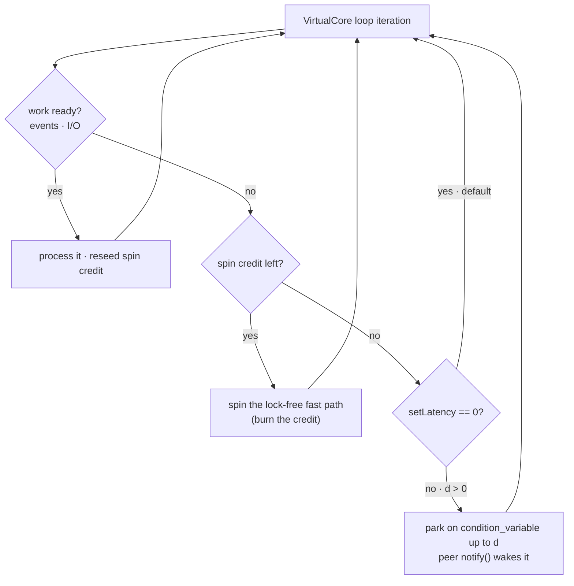

# The threading model

> **Audience:** Adopter · **Status:** stable · **Verified-against:** qb 2.6.0 (C++20 default, C++23 supported) @ b87d39a

qb runs one `VirtualCore` worker thread per engine core, each owning its actors and draining a private lock-free mailbox, so the only genuinely multi-threaded surface is the message-passing layer between cores.

**Prerequisites:** [Concurrency in qb](./concurrency.md), [The actor model](./actor_model.md) — **See also:** [The event system](./event_system.md), [The engine](../4_qb_core/engine.md), [Lock-free primitives](../7_reference/lockfree_primitives.md), [Core invariants](../7_reference/core_invariants.md)

## Summary

The qb engine is a fixed set of worker threads. [`qb::Main`](../4_qb_core/engine.md) (aliased `qb::engine`) spawns one [`qb::VirtualCore`](../4_qb_core/engine.md) per configured core, each running in its own `qb::jthread` (`std::jthread` when the standard library provides it, qb's C++20 fallback otherwise). A `VirtualCore` owns a set of actors, runs a single event loop over them, and exchanges cross-core events through a per-core lock-free mailbox.

This page describes the mechanism: how a `VirtualCore` maps to a thread, how to pin that thread to a CPU with `CoreInitializer::setAffinity`, how cross-core events move over multi-producer/single-consumer (MPSC) queues, and how the idle-latency knob (`setLatency`, a [`qb::duration`](../7_reference/api_overview.md)) trades CPU for wake-up responsiveness. It then states precisely what is real multithreading versus single-thread-per-core.

The *programming model* that follows from this design — actors that need no locks because their state is reachable from one thread only — is owned by [Concurrency in qb](./concurrency.md). This page covers the runtime that makes that model true.

## Concepts

### VirtualCore: one worker thread, pinned by intent

A `VirtualCore` is a worker thread that owns a set of actors and runs the event loop dispatching their events, callbacks, and inter-core message flushing. The engine starts one `qb::jthread` per configured core (`source/core/src/Main.cpp:301`); with `start(false)` the calling thread runs the last core in the engine's internal registration order (unspecified; do not rely on which core) instead of a new one being spawned (`source/core/src/Main.cpp:289`).

A `VirtualCore` is identified by a logical [`CoreId`](../7_reference/glossary.md) — `using CoreId = uint16_t` (`include/qb/core/ActorId.h:51`). Logical core ids are an engine-internal numbering chosen by you when you call `engine.core(id)`; they are *not* required to equal physical CPU numbers. The upper bound is `qb::MaxCores == 256` (`include/qb/core/ActorId.h:80`); `engine.core(index)` throws `std::range_error` for `index >= MaxCores` (`source/core/src/Main.cpp:366`).

An actor is strictly thread-affine to the `VirtualCore` that created it: it never migrates to another thread for its entire lifetime. This is the invariant that lets actor state be lock-free (`include/qb/core/VirtualCore.h:172`). The full set of consequences — single-writer state, sequential event handling, no mutexes — is covered in [Concurrency in qb](./concurrency.md).

### CPU affinity: a best-effort pin

`CoreInitializer::setAffinity(CoreIdSet const &)` requests that the `VirtualCore` thread be pinned to a set of physical CPU cores (`include/qb/core/Main.h:241`). The pin is applied when the engine starts, inside `VirtualCore::__init__` (`source/core/src/VirtualCore.cpp:331`), using `pthread_setaffinity_np` on POSIX/macOS and `SetThreadAffinityMask` on MSVC Windows.

Affinity is best-effort by design. A logical `CoreId` need not map to a physical CPU (for example, core 255 on an 8-core host), so a failed pin only logs a warning and never fails core initialization (`source/core/src/VirtualCore.cpp:361`). Two filtering rules apply before any OS call:

- Any `CoreId >= qb::MaxCores` is filtered out of the affinity set, including the `qb::NoAffinity` sentinel (`source/core/src/VirtualCore.cpp:336`). `qb::NoAffinity == std::numeric_limits<CoreId>::max()` (`include/qb/core/Main.h:78`), so passing `CoreIdSet{qb::NoAffinity}` is a well-defined "let the OS schedule this thread" with no pinning performed.
- If the filtered set contains zero real core ids — including an empty set — no affinity call is issued at all (`source/core/src/VirtualCore.cpp:339`).

On Windows built with a GNU compiler, affinity is not applied (`#warning` at `source/core/src/VirtualCore.cpp:377`).

### Per-core mailboxes and inter-core MPSC delivery

Each `VirtualCore` consumes from exactly one inbound mailbox. A `Mailbox` is a multi-producer/single-consumer lock-free ring buffer of `EventBucket` slots (`include/qb/core/Main.h:299`), built on `qb::lockfree::mpsc::ringbuffer` (`include/qb/system/lockfree/mpsc.h:47`). All mailboxes are owned by an internal `SharedCoreCommunication` instance held by `qb::Main` (`include/qb/core/Main.h:293`). The MPSC shape is the crux of the threading model: many sender cores enqueue into a mailbox, but only the owning `VirtualCore` ever dequeues from it.

Cross-core routing is O(1). The engine wraps the configured `CoreIdSet` in an internal `CoreSet`, which precomputes a dense, zero-based index for each logical `CoreId` so an event's destination core resolves to a mailbox slot without a hash lookup (`include/qb/core/CoreSet.h:49`). Application code does not touch the internal `CoreSet` directly; to query which cores an actor can reach, call `Actor::getCoreSet()`, which returns a `const CoreIdSet&` (the user-facing bitset, not the internal `CoreSet`) (`include/qb/core/Actor.h:558`).

Within one iteration, a `VirtualCore` flushes its outbound events to peer mailboxes (`__flush_all__`) and then drains its own inbound mailbox (`__receive__`) (`source/core/src/VirtualCore.cpp:691-694`). Outbound flushing is bounded so it cannot deadlock against a full peer mailbox: QoS-guaranteed events use a spin-then-yield backoff with partial flush, and best-effort (QoS-0) events are dropped after a single failed `try_send` (`source/core/src/VirtualCore.cpp:341-350`). A single event spanning more `EventBucket` slots than the ring holds is a different case entirely — the destination's batched, all-or-nothing `enqueue` of `event.bucket_size` buckets fails no matter how much the peer drains (`source/core/src/Main.cpp:201`), so retrying could never converge. The flush therefore recognises it as permanently unsendable rather than backpressured: it logs at `LOG_CRIT`, disposes the event and drops it, and keeps flushing the rest of the pipe (`source/core/src/VirtualCore.cpp:329-339`). The ring capacity is `MaxRingEvents == std::numeric_limits<uint16_t>::max() / QB_LOCKFREE_EVENT_BUCKET_BYTES` (`include/qb/core/Main.h:297`). The inter-core flush and deadlock-recovery rules are consolidated in [Core invariants](../7_reference/core_invariants.md).

### Engine latency: busy-spin versus parked-idle

The idle latency of a core is a `qb::duration` (`std::chrono::nanoseconds`; see [the time vocabulary](../7_reference/api_overview.md)). It controls what a `VirtualCore` does when its event loop finds no work.

- `setLatency(qb::duration::zero())` — the default — puts the core in busy-spin low-latency mode: the loop never blocks and the thread holds its CPU at 100% to react with minimal delay (`include/qb/core/Main.h:248`).
- `setLatency(d)` with `d > 0` lets the core park on a `std::condition_variable` for up to `d` when idle (`include/qb/core/Main.h:250`, mailbox `wait()` at `include/qb/core/Main.h:320`). A peer enqueuing an event calls `notify()` to wake it. This trades worst-case wake-up latency for lower CPU.



The loop does not park the instant it goes idle. A per-core adaptive backoff seeds a spin credit from the work done in the previous iteration; the core burns through that credit on the lock-free fast path before it is allowed to block on `_mail_box.wait()` (`source/core/src/VirtualCore.cpp:653`). When latency is zero, that branch is skipped entirely and the loop spins.

Two scopes set latency:

| Call | Scope | Signature |
| --- | --- | --- |
| [`CoreInitializer::setLatency`](../4_qb_core/engine.md) | One core | `CoreInitializer &setLatency(qb::duration latency = qb::duration::zero()) noexcept` (`include/qb/core/Main.h:254`) |
| [`Main::setLatency`](../4_qb_core/engine.md) | Every registered core | `void setLatency(qb::duration latency = qb::duration::zero())` (`include/qb/core/Main.h:561`) |

`Main::getLatency()` does not exist; read a single core's configured value with `engine.core(id).getLatency()`, which returns the `qb::duration` last set (`include/qb/core/Main.h:270`).

### What is real multithreading, and what is not

This is the line the model draws:

- **Genuinely multi-threaded:** the inter-core mailbox layer. Multiple `VirtualCore` threads concurrently enqueue events into another core's MPSC mailbox; the lock-free ring buffer and the `condition_variable` wake-up are the only places where threads touch shared, concurrently-mutated memory. This surface is the framework's job, not yours.
- **Single-thread-per-core (no synchronization):** everything an actor sees. A `VirtualCore` owns its actors, its `ServiceIdPool`, and its actor maps exclusively on one thread and performs no synchronization on them (`include/qb/core/VirtualCore.h:172`). The per-thread async I/O layer is the same: each thread has its own `thread_local` `listener::current` event loop, and I/O objects must never be shared across threads — safety comes from isolation, not locks (`include/qb/io/async/listener.h:88`). The coroutine scheduler is likewise mono-thread per `VirtualCore` (`include/qb/io/async/coroutine/scheduler.h:98`).

The practical rule: never touch another core's actor state directly, and never share an I/O object, coroutine, or `RefActorHandle` across threads. All cross-core communication goes through events into the destination core's mailbox.

## Configuring cores

All cores and their per-core settings must be configured *before* `Main::start()`. Calling `engine.core(id)` after the engine is running throws `std::runtime_error("Cannot access to CoreInitializers while engine is running")` (`source/core/src/Main.cpp:357`). A core registered with zero actors fails engine startup, so only call `core(id)` for cores that will receive at least one actor (`source/core/src/Main.cpp:224`).

The following pattern dedicates one zero-latency core to a hot accept loop and runs a pool of worker actors on other cores. It is an adapted, simplified version of the topology used by the auction-house example (whose real actors are `TcpListener` / `AuctionManager` and which also wires up a database); the snippet below distills just the core-placement and latency wiring.

```cpp
// src: examples/all/auction_house/src/main.cpp (adapted/illustrative)
#include <qb/main.h>           // qb::Main, qb::CoreInitializer
#include <qb/io.h>             // qb::io::cerr
#include <qb/system/time.h>
// ... your actor headers: ListenerActor, WorkerActor ...

int main() {
    qb::Main engine;

    constexpr qb::CoreId kListenerCore = 0;
    constexpr qb::CoreId kFirstWorker  = 1;
    constexpr std::uint16_t kWorkers   = 3;

    // Worker pool: default latency (busy-spin) on cores 1..3, each pinned to
    // the matching physical CPU.
    std::vector<qb::ActorId> workers;
    for (qb::CoreId c = kFirstWorker; c < kFirstWorker + kWorkers; ++c) {
        engine.core(c).setAffinity(qb::CoreIdSet{c});
        auto id = engine.addActor<WorkerActor>(c);
        if (!id.is_valid()) {
            qb::io::cerr() << "failed to create worker on core " << c << "\n";
            return 1;
        }
        workers.push_back(id);
    }

    // Dedicated accept core: zero idle latency for minimal accept latency.
    engine.core(kListenerCore).setLatency(qb::duration::zero());
    auto listener = engine.addActor<ListenerActor>(kListenerCore, workers);
    if (!listener.is_valid())
        return 1;

    engine.start();   // spawn one qb::jthread per registered core, then run
    engine.join();    // block until every actor on every core has terminated
    return engine.hasError() ? 1 : 0;
}
```

To lower CPU on cores that tolerate a small wake-up delay, set a non-zero latency on those cores while keeping the hot core at zero. `Main::setLatency` overwrites the latency of *every* registered core, so call it first to set a fleet-wide default, then override the cores that need a different value:

```cpp
// src: examples/all/taskmanager/src/main.cpp (adapted/illustrative latency topology)
#include <qb/main.h>             // qb::Main, qb::CoreInitializer
#include <qb/system/time.h> // qb::duration, qb::time_literals

using namespace qb::time_literals; // std::chrono suffixes (ms, us) re-exported into qb

engine.setLatency(1ms);                          // fleet-wide default: park up to 1 ms
engine.core(0).setLatency(qb::duration::zero()); // hot loop, 100% CPU on core 0
engine.core(1).setLatency(200us);                // park up to 200 us when idle
```

`std::chrono::microseconds` (`200us`) and `std::chrono::milliseconds` (`1ms`) convert implicitly to `qb::duration`, which is `std::chrono::nanoseconds` (`include/qb/system/time.h:90`).

A per-core `setLatency` is idempotent — calling it more than once on the same core overwrites the previous value (`source/core/src/Main.cpp:69`). `Main::setLatency` applies unconditionally to all registered cores (`source/core/src/Main.cpp:257`), so a per-core override must follow it, not precede it.

## Pitfalls

- **Affinity never fails loudly.** A `CoreId` with no matching physical CPU, or a Windows GNU build, drops the pin and only logs a warning (`source/core/src/VirtualCore.cpp:361`). Do not assume a thread is pinned because `setAffinity` returned; verify with `LOG_WARN` output or OS tooling if placement is load-bearing.
- **Logical core ids are not CPU numbers.** `engine.core(7)` registers logical core 7, which is pinned to physical CPU 7 only if you also call `setAffinity(qb::CoreIdSet{7})`. Without an affinity set, the OS schedules the thread freely.
- **Configuration after `start()` throws.** Affinity, latency, and actor registration are start-time only. `engine.core(id)` after start throws `std::runtime_error` (`source/core/src/Main.cpp:357`); read-only `usedCoreSet()` remains safe.
- **Empty cores abort startup.** Registering a core with no actors logs `VirtualCore(<id>).id(<thread>) Started with 0 Actor` and fails the start (`source/core/src/Main.cpp:224`). Only configure cores you will populate.
- **`async = false` consumes the calling thread.** `start(false)` runs the last core's event loop on the caller (`source/core/src/Main.cpp:289`) and blocks until shutdown, so `join()` is neither needed nor reached afterward. Use the default `start()` plus `join()` when the calling thread must keep doing other work.
- **Non-zero latency caps responsiveness, not throughput.** A parked core wakes on `notify()` from a sender, but the worst case before a self-initiated wake is the configured `qb::duration`. Keep latency at zero on any core that drives time-critical I/O.
- **Never reach across a core boundary.** A `VirtualCore`'s actor maps, service-id pool, `listener::current`, and coroutine scheduler are single-thread state with no locks (`include/qb/core/VirtualCore.h:172`, `include/qb/io/async/listener.h:88`). Cross-thread access is undefined behavior; route everything through events into the destination mailbox.

## See also

- [Concurrency in qb](./concurrency.md) — the lock-free programming model that this runtime guarantees.
- [The actor model](./actor_model.md) — actors, ids, and lifecycle on a `VirtualCore`.
- [The event system](./event_system.md) — how events are addressed, pushed, and delivered.
- [The engine](../4_qb_core/engine.md) — `Main`, `VirtualCore`, and `CoreInitializer` reference.
- [Lock-free primitives](../7_reference/lockfree_primitives.md) — the MPSC ring buffer and spinlock backing the mailboxes.
- [Core invariants](../7_reference/core_invariants.md) — thread-affinity, mailbox sizing, and shutdown rules in one place.
- [API overview](../7_reference/api_overview.md) — the `qb::duration` time vocabulary used by `setLatency`, and the `Main`/`VirtualCore`/`CoreInitializer` surface.
