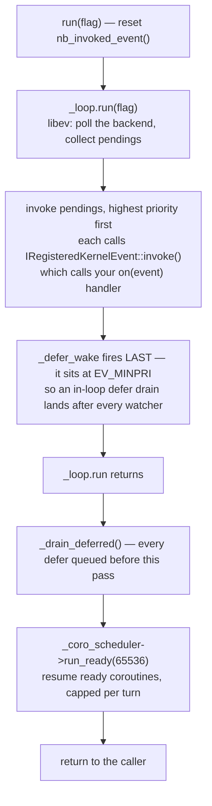

# The async runtime: the event loop and its turn

> **Audience:** Adopter · **Status:** stable · **Verified-against:** qb 3.1.0 (C++20 default, C++23 supported) — f1d8cca6

`qb::io::async` is one libev-backed event loop per thread. Almost every rule in `qb-io` — why `defer` runs next turn, why `co_await` gives the thread back, why `callback(f)` is not deferred at all, why the coroutine drain is capped — is a consequence of the order in which one turn of that loop does its work. This page owns that order.

**Prerequisites:** [qb-io overview](./README.md) · [The time vocabulary](../0_foundations/time.md) — **See also:** [C++20 coroutines](./coroutines.md) · [Transports](./transports.md) · [Protocols](./protocols.md) · [What has no coroutine form](./gaps.md) · [Async, lifecycle, and allocation invariants](../7_reference/io_invariants.md)

## One loop, one thread, no lock

`qb::io::async::listener` is the class that holds every watcher registered on this thread; its one data member of interest is a libev `ev::dynamic_loop` (`src/qb/io/async/listener.h:256`). You never construct one and you never pass one around: it is a `thread_local` static member named `current` (`src/qb/io/async/listener.h:97`), created on first access.

That single design choice is where qb-io's thread safety comes from. There is no mutex, no atomic and no work-stealing anywhere in the reactor. A `listener` and every object registered with it belong to exactly one thread, and objects reach each other only because they are on the same thread. Under `qb-core` a `VirtualCore` *is* a thread, therefore it is a listener, therefore everything on this page is per-core.

Three consequences follow immediately, and all three are load-bearing:

- **An I/O object may not be shared across threads.** Not "should not" — the watcher it registered lives in another thread's loop, and stopping or restarting it from here corrupts libev's per-fd bookkeeping. On Windows the epoll backend is wepoll (IOCP), which additionally requires the whole loop lifecycle to stay on one thread (`src/qb/io/async/listener.h:79-81`).
- **`listener::current` is one per thread, not one per thread per binary image.** Its definition is `inline` **in the header** and `QB_ABI_ANCHOR`-annotated, because an out-of-line `thread_local` emits a `non-external` TLS descriptor: a host executable and a `dlopen`ed plugin that each statically link `libqb-io.a` would then hold *two* event loops for one thread, and everything the second registers goes into a loop nobody runs — silently (`src/qb/io/async/listener.h:984`). The definition site carries the measurement. Do not move it into a `.cpp`.
- **The libev backend is auto-selected, and overridable for measurement only.** The constructor passes `_resolve_backend_flags()` (`src/qb/io/async/listener.h:435`), which reads `QB_EV_BACKEND` and accepts `select`, `poll`, `epoll`, `kqueue`, `port`, `linuxaio`, `iouring`/`io_uring` and `auto`. The selection is safe by construction: an unknown name, a backend not compiled in, and a backend that fails to initialise at runtime (io_uring under a restrictive seccomp profile, for instance) all degrade to `EVFLAG_AUTO` with a one-line stderr notice, never a throw — the last case is caught by creating and destroying a throwaway probe loop first (`src/qb/io/async/listener.h:471-474`). Ask the running loop what it chose with `backend()` and `backend_name(unsigned)` (`src/qb/io/async/listener.h:503`, `:511`).

`qb::io::async::init()` exists for symmetry and is a **no-op** — its whole body is a comment (`src/qb/io/async/listener.h:994`). It deliberately does *not* clear anything: fixtures that share a thread's listener would have their already-registered watchers invalidated, leaving dangling `_async_event` references in live objects. When you genuinely want a clean loop — a test `TearDown`, a restart — call `listener::current.clear()` (`src/qb/io/async/listener.h:543`).

## The turn

`listener::run(flag)` is one turn. It does four things, in this order, every time:


<!-- src: qb/src/qb/io/async/listener.h:746-791 -->

Read it as a rule set:

1. **Watchers run first, and they run inside libev.** libev polls the backend, builds a pending list, and invokes it. Each pending watcher's callback is `listener::on(EV_EVENT&, int)` (`src/qb/io/async/listener.h:638`), which stamps `_revents` onto the wrapper and calls `IRegisteredKernelEvent::invoke()` — which is what finally calls *your* `on(event::io const&)`, `on(event::timer&)` or `on(event::file const&)`.
2. **Deferred callbacks run at the tail of the turn.** They are drained twice over, and both drains matter. `_defer_wake` is a never-started `ev::timer` parked at `EV_MINPRI` (`src/qb/io/async/listener.h:334`, `:495`); `defer()` merely *feeds* it an event (`src/qb/io/async/listener.h:830`). Because libev drains pendings highest-priority-first and every qb watcher stays at the default priority, that hook runs after every other watcher pending in the same iteration — which is `defer()`'s contract, and it holds identically under `run(0)`, `EVRUN_ONCE` and `EVRUN_NOWAIT`. The second drain, `_drain_deferred()` after `_loop.run()` returns (`src/qb/io/async/listener.h:762`), catches anything queued while the loop was unwinding.
3. **Ready coroutines run last, and the drain is bounded.**

> Each `run()` call finishes its turn in a fixed order: libev watchers first, then the **deferred queue** (`defer()` callbacks — drained before coroutines, so a `defer()` that wakes a coroutine is picked up in the same turn), then ready coroutines through the listener's scheduler. The coroutine drain is **bounded** at `listener::kMaxCoroutineResumesPerTurn` (65536) per turn, deliberately: two coroutines that resume each other would otherwise keep the ready queue non-empty forever and `run()` would never return, starving every watcher and wedging the `VirtualCore` driving it. The cap is per turn, not per coroutine — anything scheduled past it simply runs on the next turn, so nothing is dropped or reordered.
<!-- src: qb/src/qb/io/async/listener.h:762-764 (deferred drain), :768-790 (why the coroutine drain is bounded), :795 (kMaxCoroutineResumesPerTurn = 65536) -->

The measurement behind that cap is worth keeping in mind, because it is what makes the failure mode concrete rather than theoretical: before the bound, a single `run(EVRUN_NOWAIT)` turn executed **2,000,000 ping-pongs in 162 ms** and only returned because the probe's loops were finite (`src/qb/io/async/listener.h:777-778`). An unbuffered `channel<T>` producer/consumer pair with no I/O await in the cycle is enough to produce that shape. `CoroutineScheduler::run_ready()`'s own default stays unbounded, for the teardown drains that genuinely must empty the queue (`src/qb/io/async/coroutine/scheduler.h:502`).

### A defer that defers

`_drain_deferred()` snapshots the queue size and runs exactly that many callbacks (`src/qb/io/async/listener.h:349-367`). A callback that itself calls `defer()` is therefore *not* run in the same pass; `_on_defer_wake` re-arms the hook with a zero-delay one-shot instead of re-feeding it, because a fed event would land in the pass that is still draining (`src/qb/io/async/listener.h:341-342`). A `defer()` chain advances one turn at a time and cannot starve the loop.

The drain is also re-entrancy-guarded by an RAII flag, and it contains exceptions: a callback that throws would otherwise unwind through libev's C frames, which is undefined behaviour (`src/qb/io/async/listener.h:370-377`).

### Who turns the crank

| Context | What drives the loop |
|---|---|
| Under `qb-core` | `qb::Main` starts one `VirtualCore` thread per core, and each calls `listener::current.run(EVRUN_NOWAIT)` once per pass, and only when there is work: the gate is `listener::has_work()` — a referenced active watcher, a pending event, an outstanding `defer()` or a ready coroutine — so a pure-actor core with no live qb-io object skips the pass entirely, and still pumps when a bare `defer()` is outstanding (`src/qb/core/VirtualCore.cpp:755-760`; `src/qb/io/async/listener.h:899-903`). |
| Standalone | You call `run()`, `run_once()` or `run_until()` yourself. |

Every timed API on this page takes a `qb::duration` (a `std::chrono::nanoseconds` span) or any `std::chrono::duration`, which converts implicitly. There is no `double`-seconds overload anywhere on the public surface.

The free functions all operate on `listener::current`:

| Function | Behaviour | Declared |
|---|---|---|
| `async::run(int flag = 0)` | One turn with a libev flag. `0` blocks until the loop is broken or no active watcher remains. Returns the number of events invoked. | `listener.h:1034` |
| `async::run_once()` | `run(EVRUN_ONCE)` — wait for and process one block of events. | `listener.h:1078` |
| `async::run_until(bool const &status)` | `run(EVRUN_NOWAIT)` while `status` holds, sleeping 50 µs between idle passes so an idle loop does not spin. | `listener.h:1093` |
| `async::break_parent()` | Ask `listener::current` to leave its current `run()` cycle. | `listener.h:1114` |
| `async::defer(func)` | Queue `func` for the tail of this turn. | `listener.h:1060` |
| `async::run_for(qb::duration)` | Pump the loop and the scheduler for a `steady_clock`-measured window, then return. | `coroutine/utils.h:227` |
| `async::run_sync(Awaitable&&)` | Spawn an awaitable and pump until it completes, returning its result. | `coroutine/utils.h:285` |

> **`run_once()` and timerfd.** When libev is built with timerfd-based time-jump detection (`QB_EV_USE_TIMERFD=ON`, off by default) and only `ev_io` watchers are active with no heap timers (`timercnt == 0`), `EVRUN_ONCE` can block for libev's internal maximum wait time — on the order of 10⁶ seconds. In a pump loop, prefer `run_until` or `run(EVRUN_NOWAIT)`. Both `run_sync`'s pump and `listener::clear()`'s flush avoid `EVRUN_ONCE` for exactly this reason (`src/qb/io/async/coroutine/utils.h:308-312`; `src/qb/io/async/listener.h:536-539`).

## `run_sync` and `run_for` block the calling thread

These two are the bridge from ordinary synchronous code into the coroutine world, and they are the one part of qb-io whose correct use cannot be decided from the signature. The mechanism is simple and it is worth knowing exactly.

`run_sync(awaitable)` spawns the awaitable on this thread's scheduler and then runs a `pump` loop until a captured `done` flag flips (`src/qb/io/async/coroutine/utils.h:298-316`). The pump calls `listener::current.run(EVRUN_NOWAIT)` up to 16 times per pass while coroutines are ready, and otherwise runs one NOWAIT turn and sleeps 1 ms. `run_for(d)` is the same shape without a completion condition: it pumps until a `steady_clock` deadline (`src/qb/io/async/coroutine/utils.h:227-257`).

So while `run_sync` is running, **the loop keeps turning**: sockets are serviced, timers fire, deferred callbacks drain, coroutines resume. What does *not* happen is everything the caller would have done after returning.

### The guard, and what it actually checks

Both open with `ensure_not_inside_ready_drain(...)` (`src/qb/io/async/coroutine/utils.h:288`, `:228`). That guard asks exactly one question — is this scheduler currently inside `CoroutineScheduler::run_ready()`? — and the flag it reads, `in_run_ready_`, is set by an RAII guard scoped to `run_ready()` and to nothing else (`src/qb/io/async/listener.h:1009-1021`; `src/qb/io/async/coroutine/scheduler.h:530-539`, `:601-604`). When it fires it asserts in debug and throws `std::logic_error`.

That covers exactly one case, and covers it well:

- **A coroutine body** is resumed *by* `run_ready()`, so `in_run_ready_` is set. Calling `run_sync`, `run_for`, `run`, `run_once` or `run_until` from inside a coroutine throws. This is the case the guard exists for, and it is genuinely diagnosed.

It does not cover the case people actually hit:

- **An actor event handler** does not run under `run_ready()`. `VirtualCore::__workflow__` calls `listener::current.run(EVRUN_NOWAIT)` **first** — and `run()` is where `run_ready()` lives — and only *after that call has returned* does it reach `__flush_all__()` and `__receive__()`, which is what dispatches actor handlers (`src/qb/core/VirtualCore.cpp:758`, `:771`, `:773`). During any actor handler `in_run_ready_` is false, the guard passes, and `run_sync` proceeds: **no assertion, no throw, no log, no trace.**

### What blocking the calling thread costs, and when it costs nothing

The pump runs *on whatever thread called it*. Everything therefore turns on whose thread that is.

**Outside the actor engine, that thread is yours.** A `main()`, a test fixture, a CLI, a setup step before `qb::Main::start()` — nothing else is scheduled on it, there is no core to freeze, and blocking it until an awaitable completes is the honest spelling. The framework's own best statement of this is a comment in an example:

> *Pre-engine setup: there is no actor loop yet, so we drive a coroutine to completion synchronously.*
> — `examples/07-applications/02-auction-house/src/main.cpp:45-46`

**Inside an actor handler, that thread is the `VirtualCore`.** Until the awaitable completes, this core never returns to its workflow loop: no `__flush_all__()`, no `__receive__()`, no `LoopEvent` tick, no actor reaping (`src/qb/core/VirtualCore.cpp:771-773`). Every actor on the core is frozen.

And because the core stops draining its own mailbox, peers pushing to it eventually find the ring full. A `try_send` that fails on a QoS-guaranteed event burns a bounded backoff and then makes the sender partial-bail and retry next pass, so the stall propagates outward as backpressure; a QoS-0 event is simply dropped (`src/qb/core/VirtualCore.cpp:419-432`).

The failure is *hard to notice*, which is why it needs prose rather than a warning box. Watchers and coroutines keep firing inside the pump, so a sanity check that "the socket still responds" passes. The only symptom is actor latency.

`co_await` is structurally different: `await_suspend` returns, the stack unwinds through `run_ready()` → `run()` → the VirtualCore, and every other actor and session on that core gets its turn while this coroutine is parked. **Coroutine-first is a throughput property, not a style preference.**

### The rule

> **`run_sync` and `run_for` appear only where the calling thread is yours to block.**

That is a scope test, not a prohibition. A page, a test or an example that shows `run_sync` should say in one line whose thread is being blocked and why that is legitimate there. Inside an actor, `co_await` — through `Actor::spawn` and the free `qb::ask` — is the only correct form; the annotated side-by-side call chains live on [Async in actors](../5_core_io_integration/async_in_actors.md), and the full coroutine surface is on [C++20 coroutines](./coroutines.md).

## Registering a watcher

`listener::current.registerEvent<_Event, _Actor, _Args...>(actor, args...)` binds a libev watcher, a handler object and the loop together (`src/qb/io/async/listener.h:688`):

- `_Event` — the qb-io event type (`event::io`, `event::timer`, `event::file`, `event::signal<Sig>`), each wrapping one libev watcher.
- `_Actor` — the handler instance, which must define `on(_Event&)`.
- `_Args...` — forwarded to the libev watcher's `set()` (an fd and `EV_READ`/`EV_WRITE` for `event::io`).

You rarely call it. The CRTP bases — `async::input`, `async::output`, `async::io`, `async::with_timeout`, `async::file_watcher`, `async::directory_watcher` — register in their constructors and unregister in their destructors, through the common base `async::base<_Derived, _EV_EVENT>` (`src/qb/io/async/io.h:73`, ctor `:82`, dtor `:91`).

Four properties of that machinery are worth knowing because they show up in crash reports rather than in signatures:

- **Registration is O(1) and allocation-free in steady state.** Handlers are linked into an intrusive doubly-linked list owned by the listener — the links live on `IRegisteredKernelEvent` itself, so there is no hash table and no per-registration node (`src/qb/io/async/listener.h:385`, `:401`). Each `RegisteredKernelEvent<E, A>` instantiation draws from its own thread-local LIFO freelist whose blocks are re-linked in place, so churn performs no `malloc`/`free` (`src/qb/io/async/listener.h:213-229`). The freelist is drained at thread exit, and a `delete` that runs *after* that teardown bypasses the dead list and goes straight to the global allocator — which is what stops a joined worker thread from leaking the watcher `~listener` frees on its way out (`src/qb/io/async/listener.h:232-245`).
- **Dispatch checks liveness when the handler exposes it.** `invoke()` calls `_actor.on(_event)` only if `_actor.is_alive()` is true, when the handler type has that member at all (`src/qb/io/async/listener.h:142-149`). That is how a killed actor stops receiving watcher callbacks without every watcher having to be unregistered first.
- **Exceptions are contained at the dispatch boundary, once.** `listener::on` wraps `invoke()` in `try { … } catch (...)` and logs a warning (`src/qb/io/async/listener.h:660-664`). This is not defensive style: libev is compiled as C, so letting an exception unwind through `ev_invoke_pending`/`ev_run` skips libev's own epilogue and is a hard failure on toolchains that emit no unwind info for C. It also strands the re-entrancy chain `clear()` reads on a destroyed stack frame.
- **`clear()` detaches, it does not delete.** Each `async::base` holds a *reference* to its embedded event, so deleting the wrapper while the owning object is alive would leave a dangling `_async_event`; the owner's destructor performs the final unregister and delete (`src/qb/io/async/listener.h:564-608`). The one exception is a loop-owned self-deleting handler — an `async::callback` `Timeout` whose one-shot never fired — which `clear()` destroys through the owner hook it registered, unless that handler's `invoke()` is currently on the call stack, in which case the in-flight `delete this` reclaims it (`src/qb/io/async/listener.h:586-604`).

## Choosing a continuation primitive

Four primitives answer "run this later", and they differ in ways the names do not advertise. Pick from the mechanism.

| | `defer(f)` | `callback(f)` | `callback(f, d > 0)` | `scoped_callback(f, d)` |
|---|---|---|---|---|
| When it runs | tail of this loop turn | **inline, right now** | after a real delay `d` | after a real delay `d` |
| Re-entrant from a handler | never | **always** | no | no |
| Safe to destroy the object the handler is running on | yes | no | not deterministically | not deterministically |
| Cancellable | no (it runs this turn) | n/a | no | `handle.reset()` / `handle->cancel()` |
| Ownership | listener-owned queue entry | none | self-deleting `Timeout<F>` | caller-owned `unique_ptr<ScopedTimeout<F>>` |
| Heap traffic in steady state | one `std::function` per call | none | zero (freelist) | one allocation per call |

<!-- src: qb/src/qb/io/async/listener.h:1060 (defer), qb/src/qb/io/async/io.h:368 (callback inline), :374 (callback delayed), :470 (scoped_callback), :481 (scoped_callback timed) -->

A fifth shape does not belong in that table because it is not a one-shot: [`with_timeout<Derived>`](#inactivity-timeouts-with_timeoutderived) is a member timer that lives with the object and measures from the last activity rather than from arming.

### `callback(f)` does not defer

This is the sharpest edge on the page, and the header says so itself. `callback(_Func&&)` is `func();` — the whole body (`src/qb/io/async/io.h:368-370`). `callback(f, d)` with `d <= 0` likewise calls `func()` and returns (`src/qb/io/async/io.h:376-379`). Only a positive duration allocates a `Timeout<_Func>` that fires once and deletes itself.

So a handler that calls `callback([this]{ delete this; })` to "schedule cleanup" frees itself *while its own handler is still on the stack*. And `callback(f, 1ms)` does not fix it — it only hides the race behind a timer.

The delayed path refreshes libev's cached "now" before arming (`src/qb/io/async/io.h:388`). That matters more than it sounds: libev caches the monotonic time at loop-iteration boundaries, so a thread that has been out of the loop for a while — one that just returned from a blocking `sleep_for`, say — would otherwise compute the expiry against a stale base and fire the timer on the very next `ev_run`.

### `defer(f)` is the one that breaks re-entrancy

`defer(func)` queues `func` to run **once, at the tail of the current loop turn** — after every libev watcher for that turn has returned. It is the correct primitive whenever a handler must **destroy or replace the object it is currently running on**, the canonical case being a reconnect that frees and recreates its own connection.

```cpp
// src: derived from qb/src/qb/io/async/listener.h:822 (listener::defer)
void on(qb::io::async::event::disconnected const &) {
    // NOT callback(...): this frees the object whose handler is running.
    qb::io::async::defer([this] { reconnect(); });
}
```

Captured state is released when the callback fires **or** when the loop is torn down (`listener::current.clear()`), whichever comes first — so a `shared_ptr` capture keeps its target alive exactly that long, leak-free (`src/qb/io/async/listener.h:809-811`). `clear()` releases those closures by *swapping* the queue out rather than clearing it in place, because releasing a capture runs arbitrary destructors and one of them may `defer()` again; after the swap the member is empty, so a re-entrant defer lands in a fresh queue (`src/qb/io/async/listener.h:558-562`).

Same-thread only. A `defer()` issued from *inside a coroutine* — which runs after the drain — fires on the next turn.

### `scoped_callback` when you need the handle back

`scoped_callback` (`src/qb/io/async/io.h:470`) is the RAII counterpart to `callback`. It returns a `std::unique_ptr<ScopedTimeout<std::decay_t<_Func>>>` the caller owns; destroying or resetting the pointer stops the watcher and releases its registration, with no self-delete involved.

```cpp
#include <qb/io/async.h>
#include <chrono>
#include <iostream>

using namespace std::chrono_literals;

// Schedule work in 2 seconds, keeping a cancellation handle.
auto handle = qb::io::async::scoped_callback([] {
    std::cout << "2 seconds elapsed\n";
}, 2s);

// Cancel before it fires — stops and unregisters the watcher cleanly.
handle.reset();
```

A timeout of zero or less fires the callable inline at construction (matching `callback`'s immediate semantics) and marks the timer as fired. `ScopedTimeout` also exposes `fired()` (`src/qb/io/async/io.h:429`) and `cancel()`, which sets the timeout to `qb::duration::zero()` (`src/qb/io/async/io.h:435`).

> **Both timer wrappers swallow exceptions.** `Timeout::on` and `ScopedTimeout::on` invoke the callable inside `try { _func(); } catch (...) {}` (`src/qb/io/async/io.h:338-341`, `:448-451`). An exception escaping your callback is discarded, not propagated — for the same libev-unwinding reason as the dispatch boundary above. Handle errors inside the callable.

A worked periodic-timer program, driving the loop directly:

```cpp
// src: derived from qb/tests/io/system/async/callback-dispatch.cpp
#include <qb/io/async.h>
#include <qb/system/time.h>
#include <atomic>
#include <chrono>
#include <functional>
#include <iostream>

using namespace std::chrono_literals;

int main() {
    std::atomic<bool> running{true};

    // Reschedule from inside the callback to build a periodic task.
    std::function<void()> tick = [&] {
        std::cout << "tick at " << qb::to_iso8601(qb::wall_now()) << '\n';
        if (running)
            qb::io::async::callback([&] { tick(); }, 1s);
    };
    qb::io::async::callback([&] { tick(); }, 1s);

    // One-shot stop after 5 seconds.
    qb::io::async::callback([&] {
        running = false;
        qb::io::async::break_parent();
    }, 5s);

    // Blocks until break_parent() runs or no active watchers remain.
    qb::io::async::run();
    return 0;
}
```

## Inactivity timeouts: `with_timeout<Derived>`

`with_timeout<Derived>` (`src/qb/io/async/io.h:111`) is a CRTP base that gives a class a resettable deadline. It is the mechanism behind session idle-timeouts, and it is the one timer here that measures *from the last activity* rather than from arming.

```cpp
// src: derived from qb/tests/io/system/async/timer-timeout.cpp (CountingTimer)
#include <qb/io/async.h>
#include <chrono>

using namespace std::chrono_literals;

class IdleHandler : public qb::io::async::with_timeout<IdleHandler> {
public:
    explicit IdleHandler(qb::duration timeout = 100ms)
        : with_timeout(timeout) {}

    // Called when the inactivity deadline is reached.
    void on(qb::io::async::event::timer const &) {
        // Handle the timeout: close a connection, fail an operation, etc.
    }

    void on_activity() {
        updateTimeout(); // Reset the countdown on each activity.
    }
};
```

- **Constructor.** `with_timeout(qb::duration timeout = std::chrono::seconds(3))` starts the timer when `timeout > 0`; a non-positive value leaves it disabled (`src/qb/io/async/io.h:121-128`).
- **`updateTimeout()`** refreshes libev's cached now and records it as the last activity (`src/qb/io/async/io.h:137`). It does **not** re-arm the watcher — which is the point: you can call it on every byte received without touching the timer heap.
- **The watcher fires, then re-arms itself if it was premature.** The internal handler computes `_last_activity - now + _timeout`; if that is still positive, activity was more recent than the deadline, so it re-arms for exactly the remaining interval and your `on()` is *not* called (`src/qb/io/async/io.h:181-190`). One timer, no re-arming per byte, exact deadline semantics.
- **`setTimeout(qb::duration)`** changes the period and restarts; `qb::duration::zero()` disables (`src/qb/io/async/io.h:149`). **`getTimeout()`** returns the configured period, zero when disabled (`src/qb/io/async/io.h:165`).
- **Your handler receives an lvalue.** The base forwards with `Derived.on(event)` (`src/qb/io/async/io.h:185`), so implement `on(event::timer const&)` or `on(event::timer&)`. An `on(event::timer&&)` rvalue handler will not bind.

## Watching the filesystem

`file_watcher<Derived>` (`src/qb/io/async/io.h:499`) and `directory_watcher<Derived>` (`src/qb/io/async/io.h:720`) wrap an `event::file` — a libev `ev::stat` watcher — to poll a path for attribute changes such as size or modification time.

```cpp
#include <qb/io/async.h>
#include <chrono>
#include <filesystem>
#include <iostream>

using namespace std::chrono_literals;

class LogTail : public qb::io::async::directory_watcher<LogTail> {
public:
    explicit LogTail(std::filesystem::path path) {
        // Poll every 500 ms for attribute changes.
        start(path, 500ms);
    }

    void on(qb::io::async::event::file const &event) {
        if (event.attr.st_nlink == 0) {
            std::cout << "path removed\n";
            disconnect(); // Stop watching.
            return;
        }
        if (event.attr.st_mtime != event.prev.st_mtime)
            std::cout << "attributes changed, size " << event.attr.st_size << '\n';
    }
};
```

- **`start(std::filesystem::path const&, qb::duration interval = 100ms)`** begins watching (`src/qb/io/async/io.h:581`, `:745`). `interval` is libev's polling cadence — shorter is more responsive and costs more CPU. **This is polling, not inotify/FSEvents**; `ev::stat` `stat()`s the path on a timer.
- **The watcher owns the path string.** `ev_stat` stores the path *pointer* without copying it, so `start()` copies the path into a member `std::string` that lives as long as the watcher (`src/qb/io/async/io.h:580-584`, member at `:669`). You may safely pass a temporary.
- **`disconnect()`** stops the watcher (`src/qb/io/async/io.h:595`).
- **The payload** carries `attr` (the current `ev_statdata`) and `prev` (the previous snapshot), both members of the libev watcher (`src/qb/ev/ev.h:453-454`). `attr.st_nlink == 0` means the path is gone.

The difference between the two: `file_watcher` also **reads and frames file content** (`do_read == true`, `src/qb/io/async/io.h:507`). When the watched file grows, its internal handler calls `read_all()` (`src/qb/io/async/io.h:621`), which loops `read()` → the active `IProtocol`'s `getMessageSize()`/`onMessage()` → `flush()` until the file is drained, enforcing `max_message_size()` on the way. `directory_watcher` (`do_read == false`) only forwards the notification. `async::file<Derived>` (`src/qb/io/async/file.h`) composes `file_watcher` with `transport::file`.

The read inside `read_all()` is a **blocking** `sys::file::read`, and a size *decrease* on the watched path makes the handler `lseek` back to the start (`src/qb/io/async/io.h:693`). Both are capability limits rather than bugs, and both matter on a `VirtualCore` — see [What has no coroutine form](./gaps.md#file-io-is-polled-metadata-plus-a-blocking-read).

## The event vocabulary

`qb-io` delivers strongly-typed event structs (`src/qb/io/async/event/all.h`). Components deriving from `async::input`, `output` or `io` react by declaring `on(SpecificEvent&&)`.

| Event type | Trigger | Backed by | Key fields |
|---|---|---|---|
| `disconnected` | Connection closed or I/O error | — | `int reason`, `std::error_code error_code`, `std::string message` |
| `input_drained` *(alias `eof`)* | Input buffer fully consumed — **not** an end-of-stream signal | — | — |
| `eos` | Output buffer fully flushed | — | — |
| `file` | Watched file/directory attributes changed | `ev::stat` | `ev_statdata attr`, `ev_statdata prev` |
| `handshake` | Transport handshake complete | — | — |
| `io` | Raw fd readiness | `ev::io` | `_revents` carries `EV_READ`/`EV_WRITE` |
| `pending_read` | Unprocessed bytes remain in the input buffer | — | `std::size_t bytes` |
| `pending_write` | Unsent bytes remain in the output buffer | — | `std::size_t bytes` |
| `signal<Sig>` | OS signal caught | `ev::sig` | — |
| `timer` *(alias `timeout`)* | Timer or inactivity timeout expired | `ev::timer` | — |
| `extracted` | Connection extracted from an I/O handler | — | — |
| `dispose` | Component is about to be destroyed | — | — |

<!-- src: qb/src/qb/io/async/event/disconnected.h:87, eof.h:57, eof.h:68, eos.h:65, file.h:70, handshake.h:49, io.h:51, pending_read.h:60, pending_write.h:66, signal.h:82, timer.h:64, timer.h:83, extracted.h:49, dispose.h:78 -->

### Disconnect reason codes

`disconnected::reason` is a plain `int`, and the named constants are the `disconnect_reason` scoped enum over `int` (`src/qb/io/async/event/disconnected.h:45`). The integer backing is deliberate: applications pass their own positive codes through the same field.

| Code | Named constant | Set by |
|---|---|---|
| `0` | `peer_closed` | normal shutdown — peer closed, or the local side closed cleanly |
| `1` | `user_initiated` | `disconnect()` from application code — including `disconnect(0)`, which is remapped (`src/qb/io/async/io.h:1257`) |
| `> 1` | *(application-defined)* | your code (`qbm-http` uses this range) |
| `-1` | `protocol_error` | the protocol marked itself `not_ok()` |
| `-2` | `message_too_large` | `getMessageSize()` reported more than `max_message_size()`, or more than the bytes actually buffered |
| `-3` | `buffer_overflow` | a read or write buffer would exceed its configured cap |

```cpp
void on(qb::io::async::event::disconnected &&ev) {
    using R = qb::io::async::event::disconnect_reason;
    switch (static_cast<R>(ev.reason)) {
        case R::peer_closed:       /* normal */    break;
        case R::protocol_error:    /* bad frame */ break;
        case R::message_too_large: /* DoS guard */ break;
        default:
            if (ev.error_code)
                std::cerr << "system error: " << ev.error_code.message() << '\n';
    }
}
```

`error_code` is populated only when a real system error was captured — `disconnected::with_error(reason, errno)` builds it from `std::system_category()` (`src/qb/io/async/event/disconnected.h:116`). A protocol-initiated graceful close reports **no** system error, deliberately, so a stale `errno` from an earlier non-fatal write is not surfaced as a failure (`src/qb/io/async/io.h:2829-2837`).

### Handler signatures, and the one that fails silently

- `void on(event::X&&)` — preferred. This is how the framework dispatches: `Derived.on(std::move(evt))`.
- `void on(event::X const&)` — accepted; binds to the rvalue.
- `void on(event::X&)` — **not** accepted for rvalue-delivered events, and it does not produce a compile error.

The last one deserves the emphasis. Dispatch of the optional events is gated on the `qb::has_on` concept, generated by `QB_DEFINE_METHOD_TRAIT(on)` (`src/qb/utility/type_traits.h:802`). It is satisfied only when `d.on(std::declval<event::X>())` compiles — an *rvalue* argument. A non-const lvalue reference cannot bind to it, so the concept is false, the `if constexpr` branch is compiled out, and your handler is simply never called. Nothing warns you. (`event::timer` delivered through `with_timeout` is the exception, and goes the other way: it arrives as an lvalue.)

## Introspection

| Accessor | Reports | Declared |
|---|---|---|
| `nb_invoked_event()` | events invoked during the most recent `run()` — reset at the start of each call | `listener.h:850` |
| `total_events_processed()` | cumulative events since the listener was created; never reset | `listener.h:861` |
| `size()` | watchers currently registered | `listener.h:870` |
| `has_deferred()` | whether any `defer()` callback is still queued | `listener.h:882` |
| `backend()` | the libev backend actually in use, as an `EVBACKEND_*` value | `listener.h:503` |
| `backend_name(b)` | that value as a human-readable string | `listener.h:511` |
| `has_coro_scheduler()` | whether the coroutine scheduler has been created yet | `listener.h:928` |

Both counters include deferred callbacks and coroutine resumes, not just libev watchers: `run()` adds the drained counts to each (`src/qb/io/async/listener.h:763-764`, `:788-789`).

## Pitfalls

- **`init()` does not reset anything.** It is a no-op by design (`src/qb/io/async/listener.h:994`). For a clean loop — tests, restarts — call `listener::current.clear()`.
- **`callback(func)` runs `func` inline.** So does `callback(func, d)` with `d <= 0`. If a handler must continue *after it unwinds* — above all if it must destroy or replace the object it is running on — that is `defer()`, not `callback()`, and not `callback(func, 1ms)`.
- **Timer callbacks swallow exceptions.** `Timeout` and `ScopedTimeout` wrap the callable in `catch (...)`; so does the deferred drain, and so does the watcher dispatch boundary. Errors that escape your callable are logged at most, never propagated.
- **`run_sync` / `run_for` block the thread that calls them.** Legitimate in a `main()`, a test or a CLI; a defect inside an actor handler, where the thread is the `VirtualCore` and the framework's guard does not fire. See [the rule above](#the-rule).
- **`on(event::X&)` silently never fires.** Use `on(event::X&&)` or `on(event::X const&)` for everything except the `with_timeout` timer, which is delivered as an lvalue.
- **`EVRUN_ONCE` can park for a very long time** under a timerfd-enabled libev build with no heap timers. Pump with `run_until` or `run(EVRUN_NOWAIT)`.
- **Every timed API takes `qb::duration` or another `std::chrono::duration`, never a bare number.** `setTimeout(500)` does not compile, and there is no `double`-seconds overload to fall back on — see [the time vocabulary](../0_foundations/time.md#qbduration-rejects-a-bare-integer).
- **One thread per listener.** Never share I/O objects, watchers or the loop across threads. If two threads must talk, the actor mailbox is the one legal channel.

## See also

- [C++20 coroutines](./coroutines.md) — the `co_await` model layered on this loop: awaiters, cancellation, combinators, channels, and the scheduler whose drain this page bounds.
- [Transports](./transports.md) — what happens between a readable fd and your `on(Protocol::message&&)`.
- [Protocols](./protocols.md) — the framing contract the read loop drives.
- [What has no coroutine form](./gaps.md) — accept, QUIC, signals and file I/O, and why.
- [The time vocabulary](../0_foundations/time.md) — `qb::duration`, `qb::mono_time`, `qb::wall_time`.
- [Async, lifecycle, and allocation invariants](../7_reference/io_invariants.md) — the same guarantees in reference form.
