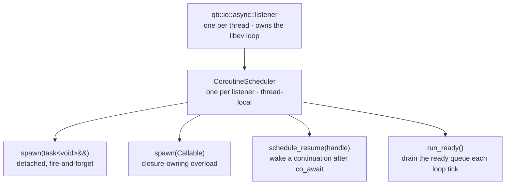

# C++20 coroutines

> **Audience:** Adopter · **Status:** stable · **Verified-against:** qb 3.0.0 (C++20 default, C++23 supported) — f1d8cca6

`qb::io::async` ships a native C++20/23 coroutine layer — `task<T>`, awaiters, combinators, channels, structured-concurrency scopes, generators, streams, retry, and cancellation — running directly on the same single-threaded libev loop as the rest of `qb-io`, so asynchronous code reads as straight-line sequential code.

**Prerequisites:** [The async runtime](./async_system.md), [qb-io overview](./README.md) — **See also:** [What has no coroutine form](./gaps.md) · [Transports](./transports.md) · [Protocols](./protocols.md) · [Async, lifecycle, and allocation invariants](../7_reference/io_invariants.md)

## Summary

A coroutine in `qb-io` is any function that returns `qb::io::async::task<T>` and uses `co_await`, `co_return`, or (for generators) `co_yield`. Tasks suspend at `co_await` and hand control back to the thread's event loop; the loop resumes them when the awaited timer, socket, channel, lock, or inner task completes. Everything runs on one thread per scheduler, cooperatively — two coroutines on the same thread are never concurrent, which is what makes the synchronization primitives lock-free and the actor-integration rules tractable.

Include the whole layer with one header:

```cpp
#include <qb/io/async/coroutine.h>   // task, awaiters, scheduler, combinators, …
```

`<qb/io/async.h>` pulls it in transitively, so any program that already uses the async runtime has the coroutine API available. The TCP connect awaiter lives in `<qb/io/async/tcp/connector.h>` (guarded by `__cpp_impl_coroutine`) and is reached through `<qb/io/async.h>`.
<!-- src: qb/src/qb/io/async/coroutine.h, qb/src/qb/io/async.h:53 -->

The framework targets C++20 by default; coroutine support requires a compiler with working C++20 coroutines.
<!-- src: qb/README.md (C++20 requirement); connector.h gated on __cpp_impl_coroutine -->

Every timed coroutine API on this page takes a `qb::duration` (a `std::chrono::nanoseconds` span; any `std::chrono::duration` converts implicitly). Deadlines that need an absolute point use `std::chrono::steady_clock::time_point` (the type behind `qb::mono_time`). Raw `double`-seconds arguments are not part of this surface.
<!-- src: qb/src/qb/io/async/coroutine/awaiter.h:330, cancellation.h:901 -->

## The execution model



| Property | Value | Source |
|---|---|---|
| Schedulers per thread | one (`thread_local`, owned by the listener) | `scheduler.h:153-157`, `utils.h:212` |
| Concurrency model | cooperative, single-threaded | `scheduler.h:153-157` |
| Interleaving point | `co_await` only | `scheduler.h:543-554` (Factbook) |
| OS mutexes / atomics on the hot path | none, within one thread | `scheduler.h:41-49`, `sync.h:31-34` |
| Cross-thread wake-up | route through the `qb-core` actor mailbox | `scheduler.h:158-161` |

Because all coroutines on a thread share one scheduler and one event loop, only one runs at a time and another can start only at a suspension point. Mutual exclusion between two coroutines on the same thread is therefore a property of the model, not something you lock for. Pushing or resuming a coroutine from a *different* thread is undefined behavior — the scheduler holds no mutex; cross-thread signaling must go through the actor mailbox (see [Safe integration with `qb::Actor`](#safe-integration-with-qbactor)).
<!-- src: qb/src/qb/io/async/coroutine/scheduler.h:151-161 -->

## Quick start (standalone)

Outside `qb-core`, drive the loop yourself: initialize the thread's listener, then hand the root task to `run_sync`, which pumps the loop until that task completes and returns its value.

```cpp
// src: derived from examples/03-coroutines/01-first-coroutine.cpp
#include <qb/io/async/coroutine.h>
#include <chrono>
#include <iostream>

using namespace qb::io::async;
using namespace std::chrono_literals;

task<int> compute_value(int base) {
    co_await sleep(100ms);            // suspends; the loop runs other work
    co_return base * 2;
}

task<void> use_computed_value() {
    int result = co_await compute_value(21);
    std::cout << "Result: " << result << '\n';   // prints "Result: 42"
}

int main() {
    qb::io::async::init();                        // no-op, kept for symmetry (see below)
    run_sync(use_computed_value());               // pump the loop until the task is done
    return 0;
}
```

`init()` is a **no-op** kept for symmetry — its whole body is a comment. `listener::current` is a `thread_local` that initializes itself on first access, so nothing needs readying; and `init()` deliberately does *not* clear existing state, because fixtures that share a thread's listener would have their already-registered watchers invalidated. For a genuinely clean loop, call `listener::current.clear()` (see [The async runtime](./async_system.md#one-loop-one-thread-no-lock)). `coro_scheduler()` returns the listener's scheduler so `spawn`, timers, and `run_ready()` all share one loop; `run_sync` spawns onto it for you, which is why the example above never names it.

Prefer `run_sync(awaitable)` over `run_for(duration)` for a root task. `run_sync` returns when the work is done — it pumps the loop until the awaitable completes, then yields its value or rethrows its exception. `run_for` returns when the *duration* is up, so it burns its whole budget even when the work finished early, and the duration is a correctness guess in the other direction too: pick it too small on a loaded machine and the coroutine is abandoned mid-flight, with no diagnostic and exit code 0. Reach for `run_for` only when pumping the loop for a fixed span is genuinely what you mean. Under `qb-core`, each `VirtualCore` owns its listener and pumps the loop for you — you call neither from inside an actor (see [Safe integration with `qb::Actor`](#safe-integration-with-qbactor)).
<!-- src: qb/src/qb/io/async/listener.h:966 (init), qb/src/qb/io/async/coroutine/utils.h:212 (coro_scheduler), :227 (run_for), :285 (run_sync), examples/03-coroutines/01-first-coroutine.cpp:144-175 -->

## `task<T>` — the coroutine return type

`task<T>` (`coroutine/task.h`) is the primary return type. `T` is the value produced by `co_return`; use `task<void>` when there is none.

```cpp
// src: derived from qb/src/qb/io/async/coroutine/task.h
#include <qb/io/async/coroutine.h>
using namespace qb::io::async;
using namespace std::chrono_literals;

task<int> async_add(int a, int b) {
    co_await sleep(0ms);             // yield once, then resume on the same thread
    co_return a + b;
}

task<void> caller() {
    int v = co_await async_add(3, 4);   // suspends caller until async_add finishes
    // v == 7
}
```

| Property | Detail | Source |
|---|---|---|
| Return types | `task<void>` or `task<T>` for any move-constructible `T` | `task.h:418`, `:787` |
| Initial suspend | `std::suspend_always` — lazy until spawned or awaited | `task.h:490-491` |
| Move-only | yes; a moved-from task is empty and destroys nothing | `task.h:652-653`, `:671-672` |
| Exception propagation | stored in the promise, re-thrown at the awaiting `co_await` | `task.h:554`, `:726-727` |
| Symmetric transfer | `await_suspend` returns a `coroutine_handle<>` — flat stack in deep chains | `task.h:698-699` |
| Frame allocation | thread-local size-bucketed freelist (`detail::CoroutineFrameAllocator`) | `task.h:183` |

`await_resume()` always checks for a stored exception first and re-throws it; if the task is somehow not ready it throws `std::logic_error` rather than returning an uninitialized value. You generally never see these paths — you `co_await` the task and the result (or exception) is delivered.
<!-- src: qb/src/qb/io/async/coroutine/task.h:718-736 -->

> `task<T>` is move-only. Pass it to `spawn` (or any consumer) with `std::move`. `coro_scheduler().spawn(t)` is a compile error; write `coro_scheduler().spawn(std::move(t))`. See the [`spawn(Callable)` overload](#the-scheduler) for the case where you want to hand a lambda directly.
<!-- src: qb/src/qb/io/async/coroutine/task.h:671-672; scheduler.h:278 (Factbook) -->

### `shared_task<T>` — one computation, many awaiters

`shared_task<T>` (`coroutine/shared_task.h`) is a copyable handle to a single coroutine result. The first `co_await` runs the computation; later awaits — from any number of coroutines — observe the same result without re-running it.

```cpp
// src: derived from qb/src/qb/io/async/coroutine/shared_task.h
#include <qb/io/async/coroutine.h>
using namespace qb::io::async;
using namespace std::chrono_literals;

task<int> compute_value() { co_await sleep(50ms); co_return 42; }

task<void> fan_out() {
    shared_task<int> shared = make_shared_task(compute_value());
    int a = co_await shared;        // triggers execution
    int b = co_await shared;        // reuses the cached result, no extra work
    // a == b == 42
}
```

Awaiting a default-constructed `shared_task` throws `std::logic_error` — construct it through `make_shared_task`.
<!-- src: qb/src/qb/io/async/coroutine/shared_task.h:185, :366 -->

## The scheduler

The per-thread scheduler is reached through `coro_scheduler()` (`coroutine/utils.h`), which returns the listener's `CoroutineScheduler` (`coroutine/scheduler.h`).

```cpp
// Detached, fire-and-forget — the scheduler owns the frame to completion.
coro_scheduler().spawn(std::move(my_task));

// Closure-owning overload: pass the lambda itself (no trailing ()),
// so the closure is moved into an owning frame and cannot dangle.
coro_scheduler().spawn([captured]() -> task<void> {
    co_await do_work(captured);
});

// Introspection
std::size_t live    = coro_scheduler().active_count();   // ready + suspended
std::size_t pending = coro_scheduler().pending_count();  // ready queue only
bool        ready   = coro_scheduler().has_ready();
```
<!-- src: qb/src/qb/io/async/coroutine/scheduler.h:278 (spawn task), :433 (spawn Callable), :671 (active_count), :611 (pending_count), :591 (has_ready); utils.h:212 (coro_scheduler) -->

`spawn(task<void>&&)` takes ownership of the handle: the coroutine runs to completion even after the original `task` object is destroyed, and the scheduler frees the frame when it finishes. `spawn(Callable)` accepts a no-argument callable returning `task<void>` and moves the closure into an owning wrapper frame — the fix for the "dangling lambda" trap described in [Lifetime footguns](#lifetime-footguns). `schedule_resume()` does *not* take ownership; it is how awaiters wake a continuation whose frame belongs to a `task<T>` object elsewhere.
<!-- src: qb/src/qb/io/async/coroutine/scheduler.h:256-278 (spawn task), :405-436 (spawn Callable), :453 (schedule_resume, Factbook) -->

`active_count()` returns ready-queue frames plus suspended frames — the count of coroutines still in flight, which is what a drain or shutdown loop needs. Note what it does *not* count: a spawned coroutine parked on an inner `task` is tracked only in `owned_frames_`, because only the innermost I/O or timer awaiter registers as suspended (`src/qb/io/async/coroutine/scheduler.h:716-727`).

### Never pump the loop from inside a coroutine

Calling `run`, `run_once`, `run_until`, `run_for` or `run_sync` from **inside a coroutine body** throws `std::logic_error` (and asserts in debug). A coroutine body is resumed *by* `CoroutineScheduler::run_ready()`, so the `in_run_ready_` flag is set, and `ensure_not_inside_ready_drain()` sees it (`src/qb/io/async/coroutine/scheduler.h:520-529`; `src/qb/io/async/listener.h:981`). A second, deeper guard inside `run_ready()` itself refuses a nested drain, asserting in debug and returning `0` in release.

**That guard does not fire in an actor event handler**, which is where the mistake is actually made — an actor handler runs *after* `listener::run()` has returned, so nothing is draining. The consequence is a silently frozen `VirtualCore`, and [the async runtime page owns the full rule](./async_system.md#run_sync-and-run_for-block-the-calling-thread). Inside an actor, `Actor::spawn` and `co_await` are the only correct spelling.
<!-- src: qb/src/qb/io/async/coroutine/scheduler.h:671 (active_count), :520-529 (re-entrancy guard), :602 (is_draining_ready); qb/src/qb/io/async/listener.h:981 (ensure_not_inside_ready_drain) -->

## Awaiters

Awaiters bridge coroutines to libev events. The free functions in `coroutine/utils.h` cover the common cases; `coroutine/awaiter.h` defines the underlying types (`timer_awaiter`, `socket_awaiter`, `async_awaiter<T>`).

```cpp
// src: derived from qb/src/qb/io/async/coroutine/utils.h, awaiter.h
#include <qb/io/async/coroutine.h>
using namespace qb::io::async;
using namespace std::chrono_literals;

co_await sleep(500ms);              // suspend for a duration (qb::duration)

co_await wait_readable(fd);         // resume when fd is EV_READ ready
co_await wait_writable(fd);         // resume when fd is EV_WRITE ready
co_await wait_for_io(fd, EV_READ | EV_WRITE);
```

Note what `wait_readable` takes: a **raw descriptor**. It is the coroutine layer's only entry into the network stack, and it is one level below sessions and protocols — see [what has no coroutine form](./gaps.md) for the list of things that therefore have no awaiter.

### Bridging a callback API

`async_awaiter<T>` is the generic adapter, and it is the shape every callback-based library gets wrapped in — including the three qbm modules' own hand-rolled awaiters.

```cpp
// src: derived from qb/src/qb/io/async/coroutine/awaiter.h:602-612
// Bridge a callback-style API into a coroutine result.
int result = co_await async_awaiter<int>([](auto cb) {
    legacy_async_op([cb](int r) { cb(r); });   // cb fires from an event handler
});
```

The callback must fire **exactly once**: `await_resume` asserts on a resume with no result, because the only path that schedules the frame is the callback itself, which engages the result before waking it (`awaiter.h:684-688`). The awaiter holds a `shared_ptr<bool>` liveness flag that its destructor clears, so a callback that fires after the coroutine frame is gone is a safe no-op rather than a use-after-free (`awaiter.h:667-675`, `:692-697`).

What it does **not** give you is cancellation-awareness. A coroutine parked in an `async_awaiter` registers no `on_cancel` hook, so `cancel()` neither wakes it nor unwinds it; it stays parked until the operation completes naturally. To make one interruptible inside an actor, wrap it — `ctx.cancellable(...)`, `with_deadline(...)`, or a `when_any` against `check_cancelled(tok)`.

`sleep(qb::duration)` with a duration of zero or less is a **cooperative yield**, not a kernel timer: the coroutine is re-enqueued at the back of the ready queue and resumes on the next scheduler turn. A positive duration arms an `qev_timer`. There is no `sleep_until` in this layer; for an absolute deadline use [`with_deadline`](#cancellation).
<!-- src: qb/src/qb/io/async/coroutine/awaiter.h:303-312 (yield_only_ rationale), :332 (duration <= 0), :355-358 (re-enqueue, no timer), utils.h:101 (sleep); no sleep_until exists -->

> Awaiters must remain alive until `await_resume()`. Never create a temporary awaiter that goes out of scope before the coroutine resumes. The framework awaiters stop their libev watcher in `await_resume()` and in their destructor, so an early return or thrown exception cannot leave a live watcher pointing at a freed frame.
<!-- src: qb/src/qb/io/async/coroutine/awaiter.h:30-35, :380-394 (await_resume stops the watcher), :404-427 (destructor) -->

### Awaiting a TCP connect

The coroutine connect factory (`tcp/connector.h`) returns an awaiter that yields `std::optional<Socket_>` — empty on timeout or error.

```cpp
// src: derived from qb/src/qb/io/async/tcp/connector.h
#include <qb/io/async.h>            // pulls in tcp/connector.h
using namespace qb::io::async;
using namespace std::chrono_literals;

task<void> connect_to(qb::io::uri remote) {
    auto sock = co_await tcp::connect(remote, 5s);   // std::optional<...>
    if (!sock) {
        // timed out or failed to connect
        co_return;
    }
    // use *sock
}
```

`connect<Transport>(uri remote, qb::duration timeout = qb::duration::zero(), bool verify_peer = true)` defaults to `transport::tcp`. A zero timeout means no deadline.
<!-- src: qb/src/qb/io/async/tcp/connector.h:757-761 (connect factory), :736-737 (await_resume std::optional<Socket_>) -->

## Combinators

`coroutine/combinators.h` composes several tasks into one awaitable.

### `when_all` — wait for every task

```cpp
// Heterogeneous: returns std::tuple<A, B>
auto [a, b] = co_await when_all(fetch_int(), fetch_string());

// Homogeneous vector: returns std::vector<T>
std::vector<task<int>> work;
for (int i = 0; i < 8; ++i) work.push_back(compute(i));
std::vector<int> results = co_await when_all(std::move(work));
```
<!-- src: qb/src/qb/io/async/coroutine/combinators.h:199 (variadic), :309 (vector) -->

### `when_any` / `race` — first to finish wins

```cpp
// when_any returns when_any_result { size_t index; std::any value; std::exception_ptr exception; }
auto r = co_await when_any(fast(), slow(), backup());
// Structured bindings expose (index, value); the value is std::any:
auto [idx, value] = r;
int v = std::any_cast<int>(value);

// race(...) is a semantic alias for when_any(...).
co_await race(network_task(), local_cache_task());
```

`when_any_result::get<T>()` casts the winning value (and re-throws if the winner threw). On win, the losing branches are **reclaimed (cancelled)** — the scheduler tears down each loser, stopping its timers and dropping its result — so nothing lingers in the background.
<!-- src: qb/src/qb/io/async/coroutine/combinators.h:321 (when_any_result), :558 (when_any), :1042 (race) -->

### `coro_with_timeout` — deadline wrapper

```cpp
try {
    auto value = co_await coro_with_timeout(fetch_data(), 2s);   // returns T
    use(value);
} catch (const qb::io::async::timeout_error&) {
    // deadline elapsed before fetch_data() completed
}
```

`coro_with_timeout(task<T>&&, qb::duration)` returns `T` and **throws `timeout_error`** on timeout — it does not return an `std::optional`. On timeout the inner task keeps running in the background until it finishes naturally; its result is then dropped.

The awaiter arms a **raw self-stopping `qev_timer`** rather than spawning a `co_await sleep()` helper, deliberately: a spawned helper would leave one parked frame plus one armed watcher per in-flight call for the full timeout duration — the `qev_timer` lives in the awaiter's shared state instead (`combinators.h:700-730`). It is non-copyable and non-movable for the same reason — the watcher's `data` pointer refers to the state it owns.

Note the asymmetry between the timeout path and the teardown path, because it is easy to read as a contradiction. A **timeout** resolves the race in `resolve_timeout()` and leaves the inner task alone (`combinators.h:744-749`). A **destroyed awaiter** — this call was itself a `when_any` loser, or its scope was cancelled — tears the inner task down: it destroys the spawned runner, `forget`s the inner frame and drops it (`combinators.h:811-828`). For a genuinely interruptible deadline, use `with_deadline(op, tp, token)` instead.
<!-- src: qb/src/qb/io/async/coroutine/combinators.h:883 (coro_with_timeout returns T), :856 (throws timeout_error), :816-818 (inner task is not interrupted) -->

## Cancellation

`coroutine/cancellation.h` provides a cooperative `cancellation_token` and helpers that observe it.

```cpp
// src: derived from qb/src/qb/io/async/coroutine/cancellation.h
#include <qb/io/async/coroutine.h>
using namespace qb::io::async;
using namespace std::chrono_literals;

cancellation_token token;

// Sleep that wakes immediately with cancelled_error when the token fires.
task<void> worker(cancellation_token tok) {
    co_await cancellable_sleep(500ms, tok);
    // reached only if not cancelled before the timeout
}

// Run an operation against an absolute deadline.
task<int> bounded(task<int>&& op, cancellation_token tok) {
    auto deadline = std::chrono::steady_clock::now() + 200ms;
    co_return co_await with_deadline(std::move(op), deadline, tok);
}

token.on_cancel([] { release_resource(); });   // cleanup callback
token.cancel();                                 // same thread only
```

`cancellation_token` is copyable (it shares state through a `shared_ptr`) and holds no mutex: `cancel()` and `on_cancel()` must run on the token's own thread. `with_deadline(task<T>&& operation, std::chrono::steady_clock::time_point deadline, cancellation_token token = {})` throws `timeout_error` (including if the deadline is already past on entry) or `cancelled_error`; a winning operation result is authoritative and is never reclassified against wall-clock time. `check_cancelled(token)` and `yield_or_cancel(token)` throw `cancelled_error` when the token is set; `make_cancellable(task, token)` wraps a task so it surfaces cancellation.
<!-- src: qb/src/qb/io/async/coroutine/cancellation.h:148 (cancel), :177 (on_cancel), :901 (with_deadline), :909-911 (deadline already past), :309 (check_cancelled), :346 (yield_or_cancel), :645 (make_cancellable), :765 (cancellable_sleep) -->

> **Cross-thread cancellation.** A token has no lock. To cancel from another thread, send a `qb-core` actor event to the owning thread and call `token.cancel()` from that actor's synchronous handler, where it runs on the right thread.
<!-- src: qb/src/qb/io/async/coroutine/cancellation.h:97-103 -->

## Every awaitable, and what cancellation does to it

This is the table to read before you rely on cancellation for anything. **`cancel()` does not stop a coroutine.** It sets a flag and runs the callbacks registered against that token — and only five awaitables in the whole layer register one. A coroutine parked on anything else is listening to nothing: it stays parked until its own operation completes naturally, and then resumes into a world that may have moved on.

The distinction the vocabulary draws, and which the rest of this section depends on: **cancellation-aware** means the awaiter registers an `on_cancel` hook, so `cancel()` wakes it. **Cancellable** means you can *wrap* it so that something else wakes on your behalf — which is what `make_cancellable`, `with_deadline` and `when_any` are for. Everything can be made cancellable; almost nothing is cancellation-aware.

### Cancellation-aware — `cancel()` wakes these

| Awaitable | Parks on | Hook | On cancel |
|---|---|---|---|
| `co_await cancellable_sleep(d, tok)` | a spawned timer task (`sleep(d)` inside it) | `on_cancel` — `cancellation.h:719` | wakes now, tears the spawned timer down through `cancel_spawned`, and `await_resume` throws `cancelled_error` |
| `co_await make_cancellable(std::move(t), tok, throw_on_cancel)` | a spawned `task_runner` driving the inner task | `on_cancel` — `cancellation.h:438` (`:576` for `void`) | destroys the runner frame **first**, then `forget`s and drops the inner task, then resumes the waiter; throws `cancelled_error` when `throw_on_cancel` |
| `co_await with_deadline(std::move(op), deadline, tok)` | `when_any(op, timeout_branch)`; the timeout branch owns the hook | `on_cancel` — `cancellation.h:827` | resolves the branch with `result == 1`, reclaims the deadline timer, and `with_deadline` throws `cancelled_error` |
| `co_await check_cancelled(tok)` | nothing but the token itself | `on_cancel` — `cancellation.h:283` | resumes and throws `cancelled_error` |
| `co_await sem.acquire(tok)` | the semaphore's `_waiters` deque | `on_cancel` — `sync.h:237` | marks the node cancelled, retracts it from the queue, resumes, and throws `cancelled_error` |

`yield_or_cancel(tok)` is a near miss worth naming: it re-enqueues the coroutine at the back of the ready queue and **checks** the token when it resumes — `yield_or_cancel` (`cancellation.h:320-348`), so it observes cancellation promptly in a loop — but it registers no hook, so it cannot be woken by `cancel()` from a longer sleep.

### Not cancellation-aware — `cancel()` does nothing to these

Everything else. Grouped by what they park on, because that determines what *does* eventually wake them.

| Awaitable | Parks on | Woken by |
|---|---|---|
| `co_await sleep(d)` | `timer_awaiter`, i.e. a `qev_timer` (`awaiter.h:292`); `d <= 0` is a bare re-enqueue with no timer at all | the timer |
| `co_await wait_readable(fd)` / `wait_writable(fd)` / `wait_for_io(fd, ev)` | `socket_awaiter`, i.e. a `qev_io` watcher (`awaiter.h:467`) | fd readiness |
| `co_await async_awaiter<T>(op)` | your callback (`awaiter.h:619`) | your callback |
| `co_await tcp::connect(uri, timeout)` | the callback connector (`async/tcp/connector.h:680`) | connect success, failure, or the connector's own deadline |
| `co_await innerTask` | the inner coroutine, by **symmetric transfer** (`task.h:699`) | the inner coroutine finishing |
| `co_await sharedTask` | the shared state's waiter list (`shared_task.h:148`) | the one computation finishing |
| `co_await when_all(...)` / `when_any(...)` / `race(...)` | N spawned branch runners (`combinators.h:76`, `:409`) | the branches |
| `co_await coro_with_timeout(t, d)` | a spawned runner **and** a raw self-stopping `qev_timer` (`combinators.h:730`) | whichever comes first |
| `co_await ch.send(v)` / `ch.recv()` | the channel's own `_send_waiters` / `_recv_waiters` deque — `send_awaiter` (`channel.h:158`), `recv_awaiter` (`:312`) | a counterparty, or `close()` |
| `co_await ch.send_for(v, d)` / `ch.recv_for(d)` | the same deques plus a spawned `sleep` timer — `timed_recv_awaiter` (`channel.h:618`), `timed_send_awaiter` (`:728`) | a counterparty, `close()`, or the timer |
| `co_await select(a, b, ...)` | every channel's `_select_waiters`, through `channel_select_awaiter` (`channel.h:1160`) | the first channel with data or a close |
| `co_await sem.acquire()` (no token) / `mtx.lock()` / `rw.lock_read()` / `lock_write()` | the primitive's own waiter deque — `acquire_awaiter` (`sync.h:101`), `lock_awaiter` (`:460`), `read_lock_awaiter` (`:686`), `write_lock_awaiter` (`:733`) | a `release()` / `unlock()` |
| `co_await b.arrive_and_wait()` / `ev.wait()` / `latch.wait()` | the primitive's waiter list — `arrive_awaiter` (`sync.h:974`) and the two `wait_awaiter`s (`:1123`, `:1316`) | the final arrival / `set()` / the count reaching zero |
| `co_await gen.next()` (async generator) | the generator, by symmetric transfer (`generator.h:415`) | the generator's next `co_yield` |
| `co_await stream.collect()` and every other terminal | an ordinary `task` over the source | the source |
| `co_await with_retry(f, policy)` | `f()`, and `sleep(delay)` between attempts (`retry.h:273`, `:321`, `:379`) | `f()` or the backoff timer — **the backoff is a plain `sleep`, not `cancellable_sleep`** |

Two entries deserve a sentence of their own. **`coro_with_timeout` does not interrupt anything on timeout**: the timeout path sets the result and resumes the waiter, never touching the inner task, which runs to completion in the background and has its result dropped. And **`with_retry` parked in its backoff cannot be woken by a token** — `retry.h` does not include `cancellation.h` at all, so a 30-second `max_delay` is 30 seconds.

### The other way a parked coroutine ends: its frame is destroyed

Since almost nothing is cancellation-aware, the mechanism that actually reclaims a parked coroutine in this framework is **structural**: someone destroys the frame, and the awaiter's destructor cleans up on the way out. That is what `coroutine_scope`'s cancel policy, `when_any`'s loser reclaim, and `Actor::kill()` all ultimately do.

Every awaiter in the layer therefore carries a destructor that has to survive "destroyed while still parked", and they are worth knowing as a family because the pattern is the same each time:

- **Watcher-backed awaiters stop the watcher unconditionally, gated only on "was it armed", never on `qev_is_active`.** A one-shot `qev_timer` is auto-stopped by libev the instant it expires — *before* its callback runs — so between expiry and dispatch it is inactive yet still sitting in `pendings[]` with `w->data` pointing at the awaiter. An active-gated stop would skip it and leave a freed watcher queued for invocation (`awaiter.h:409-428`).
- **They scrub the scheduler's queues, not just the suspended set.** Once a watcher has fired, the frame has already moved out of `suspended_coroutines_` and *into* the ready queue and in-flight set. `unregister_suspended()` alone would leave a dangling handle for the next drain to resume; `unschedule()` → `CoroutineScheduler::forget()` clears all three (`awaiter.h:262-266`; `scheduler.h:387`).
- **Queue-backed awaiters retract their own entry** — and several also *repair* the object they were parked on. A destroyed `sem.acquire()` that had already been granted a permit calls `release()` so capacity does not erode by one permanently (`sync.h:122-124`); a destroyed `mtx.lock()` whose handle is no longer in the queue means `unlock()` already handed it ownership, so it unlocks rather than leaving the mutex locked with no holder (`sync.h:479-480`); an auto-reset `async_event` re-`set()`s a consumed-but-unclaimed signal (`sync.h:1141-1142`); a destroyed `ch.recv()` whose sender already wrote through its result slot re-buffers the value so the message is not lost (`channel.h:349-351`).
- **Combinators tear down what they spawned, in a fixed order.** `when_any`'s loser reclaim destroys the branch's spawned runner **first** — so the inner task's `continuation_`, which points at that frame, can never be resumed — then `forget`s the inner frame, then destroys the inner `task`, whose destructor stops any watcher it was parked on (`combinators.h:442-449`). Getting that order wrong is a use-after-free, which is why the source spells it out.

`~task()` is the blunt instrument at the bottom of all this: for a frame still in flight it calls `forget_frame_if_current(handle_)` and then `handle_.destroy()` (`task.h:642-645`). It does not wait, does not resume, and does not cancel cooperatively — the frame is destroyed where it sits, running the destructors of every live local. Every property above is what makes that safe.

One consequence for your own code: **a coroutine's locals are destroyed at `co_return`, not when the frame is later freed.** Anything a deferred operation needs must be owned by the frame — a parameter or a capture — not borrowed from a caller's stack.

### One notable inconsistency

`when_any`'s two overloads deliver a winning branch's exception differently. The variadic form **carries** it in `when_any_result::exception` and rethrows only when you call `get<T>()` or `rethrow_if_exception()` (`combinators.h:324`, `:328`, `:347`). The `std::vector<task<T>>` overload **rethrows directly** from `await_resume` (`combinators.h:600-601`). Same situation, opposite delivery.

`with_retry_until` has a similar edge: unlike both `with_retry` overloads it has **no** `try`/`catch`, so a throwing factory propagates immediately with no retry at all, and its `retry_exhausted` carries a null `last_error` (`retry.h:348-382`).

## Synchronization primitives

`coroutine/sync.h` provides primitives that suspend the coroutine instead of blocking the OS thread. They rely on cooperative single-thread scheduling for mutual exclusion — no OS locks are involved.

```cpp
// src: derived from qb/src/qb/io/async/coroutine/sync.h
#include <qb/io/async/coroutine.h>
using namespace qb::io::async;

// ── Counting semaphore ────────────────────────────────────────────────
semaphore sem(3);                              // 3 permits
co_await sem.acquire();
sem.release();
auto guard = co_await sem.scoped_acquire();    // RAII: release on scope exit
co_await sem.acquire(token);                   // cancellation-AWARE overload:
                                               // cancel() wakes it, throws cancelled_error

// ── Async mutex ───────────────────────────────────────────────────────
async_mutex mtx;
co_await mtx.lock();
mtx.unlock();
auto lk = co_await mtx.scoped_lock();          // RAII unlock

// ── Read/write lock ───────────────────────────────────────────────────
async_rw_lock rw;
{ auto r = co_await rw.scoped_read_lock();  /* concurrent reads */ }
{ auto w = co_await rw.scoped_write_lock(); /* exclusive write  */ }

// ── Barrier (reusable rendezvous) ─────────────────────────────────────
barrier b(4);
co_await b.arrive_and_wait();                  // wait for all 4 arrivals

// ── Event (manual- or auto-reset) ─────────────────────────────────────
async_event ready;                             // manual-reset: set() wakes all
ready.set();
co_await ready.wait();
async_event gate(/*auto_reset=*/true);         // auto-reset: set() wakes one
gate.set();

// ── Latch (one-shot countdown) ────────────────────────────────────────
async_latch latch(3);
latch.count_down();                            // non-suspending
co_await latch.wait();                         // resume when count reaches 0

// ── RAII helpers (run a synchronous callable while holding the resource)
co_await with_semaphore(sem, [] { return do_sync_work(); });
co_await with_lock(mtx,     [] { return do_sync_work(); });
```

Notes grounded in the headers: the mutex methods are `lock()` / `unlock()` / `scoped_lock()`; the read/write lock exposes `lock_read()` / `lock_write()` / `unlock_read()` / `unlock_write()` plus the RAII `scoped_read_lock()` / `scoped_write_lock()`. `async_event(bool auto_reset = false, bool initially_set = false)`. `with_semaphore` and `with_lock` take a *synchronous* callable and return its result (they `co_return f()`), not a task factory. Over-releasing a semaphore is a no-op; unlocking an unheld mutex or rw-lock asserts in debug builds.
<!-- src: qb/src/qb/io/async/coroutine/sync.h:261 (acquire), :376 (scoped_acquire), :511 (lock), :534 (unlock), :601 (scoped_lock), :899/:905 (scoped_read/write_lock), :789/:803 (unlock_read/write), :1023 (arrive_and_wait), :1104 (async_event ctor), :1187 (set), :1296 (count_down), :1443/:1474 (with_semaphore/with_lock), :294/:535 (no-op / assert) -->

Two properties are worth spelling out because they are the reason these primitives exist at all rather than `std::mutex` and friends. **The rw-lock is writer-preferring**: a reader is admitted only when no writer holds *and* `_write_waiters` is empty (`sync.h:716`), so a steady stream of readers cannot starve a writer. And **`semaphore::acquire(cancellation_token)` is the one cancellation-aware primitive in the whole layer** (`sync.h:272`) — everything else here is woken only by a matching `release()`, `unlock()`, `set()` or arrival. `with_semaphore` uses the *non*-token overload (`sync.h:1444`).

## Channels

`coroutine/channel.h` defines a single-thread `channel<T>` for handing values between coroutines. It is non-copyable and non-movable; the capacity defaults to `0` (rendezvous: a send and a recv meet directly with no buffering).

```cpp
// src: derived from qb/src/qb/io/async/coroutine/channel.h
#include <qb/io/async/coroutine.h>
using namespace qb::io::async;
using namespace std::chrono_literals;

channel<int> ch(/*capacity=*/16);

// Producer
co_await ch.send(42);                          // suspends if the buffer is full
bool sent = ch.try_send(42);                   // non-blocking

// Consumer
std::optional<int> v = co_await ch.recv();     // empty optional when closed
std::optional<int> w = ch.try_recv();          // non-blocking

// Timed member operations
std::optional<int> r = co_await ch.recv_for(200ms);   // empty on timeout
bool ok               = co_await ch.send_for(7, 200ms); // false on timeout

ch.close();                                    // wakes pending recvs with empty;
                                               // pending sends throw channel_closed

// Pipeline utilities (free functions / factories)
co_await transform(in_ch, out_ch, [](int x) { return x * 2; });
co_await filter   (in_ch, out_ch, [](int x) { return x % 2 == 0; });
std::vector<int> all = co_await collect(in_ch);

auto chan          = make_channel<int>(16);              // std::unique_ptr<channel<int>>
auto [in_p, out_p] = make_pipeline<int, int>(            // pair of unique_ptr channels
    [](int x) { return x + 1; });
```

`recv_for` / `send_for` are **member functions** (`ch.recv_for(timeout)` returns `task<std::optional<T>>`; `ch.send_for(value, timeout)` returns `task<bool>`). `send(value)`/`recv()` return awaiters; `recv()` yields `std::optional<T>` that is empty once the channel is closed, while `send(value)` throws `channel_closed` on a closed channel. `make_channel` and `make_pipeline` return `std::unique_ptr` so the caller owns the channel's lifetime.

What `close()` does to each parked party is worth a table of its own, because the three answers differ (`channel.h:490-511`):

| Parked on | After `close()` |
|---|---|
| `recv()` / `recv_for()` | resumes with `std::nullopt` — never an exception, and a value still in `_buffer` is drained first (`channel.h:394-398`) |
| `send()` | resumes and **throws `channel_closed`** (`channel.h:269-271`) |
| `send_for()` | resumes and returns **`false`** once `_closed` — no exception (`channel.h:772-776`) |
| `select()` | resumes with `closed == true` and an empty `value` (`channel.h:509`) |

`~channel()` clears its liveness flag **before** calling `close()`, and the order is load-bearing: `close()` only *schedules* the resumes, so by the time they run the channel is gone and every awaiter must be able to answer from its own state alone (`channel.h:137-143`). A parked `recv` then returns `nullopt`, a parked `send` throws, a parked `send_for` returns `false` — the same answers as a plain close, reached without touching the freed object.

`send_for` also has a **move-only caveat the header documents explicitly** above `send_for` (`channel.h:708`): its slow path stores the pending value in a `std::any`, so for a `T` that is not copy-constructible the timed path can only ever resolve as a timeout. Use a copyable payload, or `send()` with an outer `with_deadline`.
<!-- src: qb/src/qb/io/async/coroutine/channel.h:131 (capacity default 0), :302 (send), :410 (recv), :608 (recv_for), :708 (send_for), :420/:473 (try_send/try_recv), :490 (close), :915 (make_channel), :1092 (make_pipeline), :1016/:1039/:1061 (transform/filter/collect) -->

### `select` — first ready channel wins

```cpp
auto res = co_await select(ch_int, ch_string);   // select_result
if (res.index == 0)      use(res.get<int>());
else if (!res.closed)    use(res.get<std::string>());
```

`select(...)` returns `select_result { size_t index; bool closed; std::any value; }`: `index` is the 0-based channel that won, `closed` is true when that channel was closed (the value is then empty), and `get<T>()` casts the received value. The immediate pass checks every channel for **data before checking any for closure**, deliberately, so a closed channel in the set cannot starve a live one (`channel.h:1167-1191`).

One asymmetry to know before you compose `select` with anything that can abandon it: a `select` that resolved *with a value* and is then destroyed before it resumes — a `when_any` loser, a cancelled scope — **drops that value** (`channel.h:1218-1230`). `recv()` and `recv_for()` re-buffer theirs instead (`channel.h:349-351`, `:653-655`); `select` cannot, because by then the channels it was watching may already be gone and the only thing it still holds is its own refcounted state.
<!-- src: qb/src/qb/io/async/coroutine/channel.h:1139 (select_result), :1267 (select variadic), :1343 (select vector) -->

> A `channel<T>` is single-thread only. Its destructor clears an internal liveness flag *before* closing, so a parked sender or receiver whose frame is torn down does not touch freed channel memory. `channel_range` (and `async_stream::from_channel`) drain non-blocking and stop at the first empty slot — use [`async_stream`](#async-streams) for true async iteration, and prefer `from_channel_shared` to avoid the borrowed-reference lifetime trap.
<!-- src: qb/src/qb/io/async/coroutine/channel.h:137-143 (dtor clears _alive before close), :923-926 (channel_range does not suspend, Factbook); stream.h:98/:110 -->

## Structured concurrency: `coroutine_scope`

`coroutine/scope.h` groups child coroutines and bounds their lifetime to the scope.

```cpp
// src: derived from qb/src/qb/io/async/coroutine/scope.h
#include <qb/io/async/coroutine.h>
using namespace qb::io::async;
using namespace std::chrono_literals;

task<void> structured_work() {
    coroutine_scope scope;                       // default policy: cancel_all

    scope.spawn(worker_a());
    scope.spawn(worker_b());
    scope.spawn([cap]() -> task<void> { co_await process(cap); });  // closure-owning

    co_await scope.join_all();                    // wait for all children
    // size_t winner = co_await scope.join_any();  // wait for the first
    // bool   all_ok = co_await scope.join_all_for(2s);  // bounded wait

    scope.cancel_all();                           // signal the scope's token
    scope.rethrow_if_error();                     // re-throw the first failure
}

// RAII wrapper
co_await with_scope([](coroutine_scope& s) -> task<void> {
    s.spawn(worker());
    co_await s.join_all();
});

// Bounded-concurrency map: f comes BEFORE max_concurrency
std::vector<Result> out = co_await parallel_map(
    items,
    [](Item it) -> task<Result> { co_return process(it); },
    /*max_concurrency=*/4);

// Loop while a synchronous predicate holds; factory returns a fresh task each turn
co_await repeat_while(
    []        { return make_iteration_task(); },   // factory → task<void>
    []         { return should_continue(); });      // predicate → bool
```

`join_any()` returns `task<size_t>` (the completed index); `join_all_for(qb::duration)` returns `task<bool>`. The cleanup policy on scope destruction is one of `cancel_all` (default — signals the scope token), `join_all` (best-effort; children keep running via the shared scope state if you forgot to `co_await join_all()`), or `detach`. `parallel_map(items, f, max_concurrency = 10)` takes the mapping function *before* the concurrency limit; `repeat_while(factory, should_continue, cancel_token = {})` calls `should_continue()` synchronously and `factory()` to build each iteration's task. The ready-made `joining_scope`, `cancelling_scope`, and `detaching_scope` subclasses fix the policy.
<!-- src: qb/src/qb/io/async/coroutine/scope.h:81 (cleanup_policy), :153 (default cancel_all), :228/:255 (spawn task/Callable), :366 (join_all), :423 (join_any), :487 (join_all_for), :617/:626/:635 (scope subclasses), :715 (with_scope), :732 (repeat_while), :778 (parallel_map) -->

## Generators

`coroutine/generator.h` provides pull-based sequences.

### Synchronous `generator<T>`

Uses `co_yield`; `co_await` is disallowed (`await_transform` is deleted). Supports range-for.

```cpp
// src: derived from qb/src/qb/io/async/coroutine/generator.h
#include <qb/io/async/coroutine.h>
using namespace qb::io::async;

generator<int> fibonacci(int n) {
    int a = 0, b = 1;
    for (int i = 0; i < n; ++i) {
        co_yield a;
        std::tie(a, b) = std::pair{b, a + b};
    }
}

for (int v : fibonacci(10)) { use(v); }

auto gen   = range(0, 100);        // generator over [0, 100)
auto inf   = iota(0);              // infinite: 0, 1, 2, …
auto fromv = from_range(my_vector);
auto fromi = from_iterator(my_vector.begin(), my_vector.end());
```

A `generator<T>` must outlive any iterator over it; a throwing generator body surfaces the exception to the consumer rather than appearing as normal exhaustion. `collect_to_vector(gen)` has two overloads: an lvalue-reference one that drains a named generator in place, and an rvalue one so a composed pipeline — `collect_to_vector(take(range(0, 100), 4))` — can be drained in a single expression, matching every other helper in the family (all of which take their generator by value).

#### The transforms, and which of them consume the source

Both generator kinds carry the same operation set under the same names — the argument type picks the
overload, which is why there is no prefix on either side. What a reader has to know is not the names but
which ones **consume**:

| | lazy — returns a generator | terminal — drains the source |
| --- | --- | --- |
| `generator<T>` | `take` · `skip` · `map` · `filter` · `concat` | `for_each` · `reduce` · `collect_to_vector` |
| `async_generator<T>` | `take` · `skip` · `map` · `filter` | `for_each` · `reduce` · `collect_to_vector` · `map_to_vector` · `filter_to_vector` |

```cpp
// Lazy composes, and the composition is the reason to prefer it: nothing is produced that nobody asked
// for. This pulls exactly three values out of an INFINITE source.
auto first3 = collect_to_vector(take(map(iota(1), [](int v) { return v * v; }), 3));

// Terminal, so the source is gone afterwards. The seed comes FIRST, as in std::ranges::fold_left.
auto total  = reduce(range(1, 11), 0, std::plus<int>{});
for_each(range(0, 3), [](int v) { use(v); });
```

`map_to_vector` and `filter_to_vector` exist only on the async side and are **eager**: they run the source
to exhaustion and hand back a `task<std::vector<…>>`. They are not spelled `map`/`filter` on purpose —
those are lazy here and on `async_stream`, and one word cannot mean "lazy" in one family and "eager, and
it consumed your generator" in another. If you want the eager result from a lazy chain, say so:
`co_await collect_to_vector(map(src, f))`.

One property is worth relying on: **`take(gen, n)` pulls exactly `min(n, size(gen))` values and never one
more.** The limit is tested before the source is resumed. Over `iota` an extra pull would cost nothing,
which is exactly why the opposite behaviour survived for so long; over a source whose body reads a row, a
token or a socket byte, that pull is a side effect nobody asked for.
<!-- src: qb/src/qb/io/async/coroutine/generator.h:77 (generator), :112 (await_transform deleted), :513 (collect_to_vector lvalue), :540 (collect_to_vector rvalue), :567 (from_range), :608 (from_iterator), :623 (iota), range/repeat (:640/:655) -->

### Asynchronous `async_generator<T>`

Combines `co_yield` with `co_await`, so each element can wait on the event loop.

```cpp
async_generator<std::string> read_lines(std::string path);   // co_await + co_yield inside

co_await for_each(read_lines("log.txt"), [](std::string line) {
    process(line);                                            // synchronous consumer
});
co_await for_each(read_lines("log.txt"), [](std::string line) -> task<void> {
    co_await store(line);                                     // async consumer
});

std::vector<std::string> all = co_await collect_to_vector(read_lines("log.txt"));
auto sizes = co_await map_to_vector   (read_lines("f"), [](auto& s) { return s.size(); });
auto kept  = co_await filter_to_vector(read_lines("f"), [](auto& s) { return !s.empty(); });
auto total = co_await reduce(read_lines("f"), std::size_t{0},
                                [](auto acc, auto& s) { return acc + s.size(); });
```

`reduce(gen, init, reducer)` takes the seed before the reducer.
<!-- src: qb/src/qb/io/async/coroutine/generator.h:289 (async_generator), :780 (take), :794 (skip), :819 (map, lazy), :830 (filter, lazy), :853 (for_each), :883 (reduce: init then reducer), :901 (collect_to_vector), :927 (map_to_vector, eager), :946 (filter_to_vector, eager) -->

## Async streams

`coroutine/stream.h` adds a lazy, composable `async_stream<T>` over asynchronous sources.

```cpp
// src: derived from qb/src/qb/io/async/coroutine/stream.h
#include <qb/io/async/coroutine.h>
using namespace qb::io::async;
using namespace std::chrono_literals;

// Sources
auto s1 = async_stream<int>::from_vector({1, 2, 3, 4, 5});
auto s2 = async_stream<int>::from_channel(ch);            // ch must outlive the stream
auto s3 = async_stream<int>::from_channel_shared(ch_ptr); // shared ownership, no UAF
auto s4 = range_stream(1, 101);                           // [1, 100]
auto s5 = interval(100ms);                                // async_stream<size_t>: 0,1,2,…

// Lazy transforms (chainable)
auto pipeline = async_stream<int>::from_vector({1,2,3,4,5,6})
    .map   ([](int v) { return v * v; })
    .filter([](int v) { return v % 2 == 0; })
    .take(5)
    .skip(1);

// Terminal consumers (each is co_await-ed)
co_await pipeline.for_each([](int v) { use(v); });        // sync sink
std::vector<int>   v   = co_await pipeline.collect();
std::optional<int> hd  = co_await pipeline.first();
size_t             n   = co_await pipeline.count();
int                sum = co_await pipeline.reduce(0, [](int a, int b) { return a + b; });
bool               any = co_await pipeline.any([](int v) { return v > 10; });
bool               all = co_await pipeline.all([](int v) { return v > 0; });
std::optional<int> hit = co_await pipeline.find([](int v) { return v == 36; });
co_await pipeline.drain_to(out_channel);

// Combining
auto merged = merge_streams(std::vector{stream_a, stream_b});      // async_stream<T>
auto zipped = zip(stream_of_ints, stream_of_strings);             // pairs
```

The numeric source is `range_stream(start, end)` (there is no `async_stream<T>::range`). `merge_streams` takes a `std::vector<async_stream<T>>`; `zip(a, b)` yields `async_stream<std::pair<T, U>>`; `reduce(f, initial)` takes the reducer then the seed; `for_each` also accepts a callable returning `task<void>` for an async sink.
<!-- src: qb/src/qb/io/async/coroutine/stream.h:98/:110/:118 (from_channel/_shared/_vector), :884 (range_stream), :833 (interval), :692 (merge_streams), :745 (zip), :156/:173/:190/:206 (map/filter/take/skip), :392/:400/:408/:417/:425/:434/:443/:452/:462 (for_each/collect/first/reduce/count/any/all/find/drain_to) -->

## Safe integration with `qb::Actor`

Under `qb-core`, each `VirtualCore` runs one thread, one listener, and one coroutine scheduler. The actor dispatch model assumes a handler runs to completion with exclusive access to its actor's state — but a `co_await` *yields the thread*, letting other handlers run in between. A coroutine that touches actor members across a suspension point is therefore a single-thread data race, and the actor may even be destroyed while the coroutine is parked.

The supported integration points are `Actor::spawn` and `Actor::spawn_detached`. Both launch an *isolated* coroutine and may communicate back only through events. `spawn` is the recommended default: the coroutine is *scoped* to the actor (cancelled when the actor is killed) and receives a `qb::ScopedCoroContext` with cancellation-aware operations, usable with the free `qb::ask()` request/reply helper. `spawn_detached` is the explicit fire-and-forget variant: the coroutine outlives the actor and receives a plain `qb::CoroContext` (an `ActorId`-by-value handle). The example below uses `spawn`.

```cpp
// src: derived from examples/03-coroutines/02-actor-coroutines.cpp
#include <qb/actor.h>
#include <qb/io/async/coroutine.h>
#include <memory>
#include <string>

// Event payloads must be trivially RELOCATABLE. The runtime moves an event with raw
// memcpy — the source pipe relocates what it already holds when it grows, reply/forward
// byte-recycle it, and a cross-core hop copies it twice — and a short std::string points
// into its own inline buffer on libstdc++, so a by-value one is invalid on every path.
// Box dynamic text so only the heap pointer travels (or use qb::string<N> when the
// length has a known bound). Note `request_id`, not `id`: qb::Event already has an
// `id` member (the event type id), and shadowing it stops the event from compiling.
struct StartProcessing : qb::Event {
    int                                request_id;
    std::shared_ptr<const std::string> data;
    StartProcessing(int rid, std::string d)
        : request_id(rid)
        , data(std::make_shared<const std::string>(std::move(d))) {}
};
struct ProcessingComplete : qb::Event {
    int                                request_id;
    std::shared_ptr<const std::string> result;
    uint64_t                           ns;
    ProcessingComplete(int rid, std::string r, uint64_t n)
        : request_id(rid)
        , result(std::make_shared<const std::string>(std::move(r)))
        , ns(n) {}
};

class CoroWorker : public qb::Actor {
    int processed_ = 0;
public:
    qb::io::async::task<bool> onInit() override {
        registerEvent<StartProcessing>(*this);
        registerEvent<ProcessingComplete>(*this);
        co_return true;
    }

    // Synchronous handler — runs with exclusive access to actor state.
    void on(StartProcessing& req) {
        int      rid   = req.request_id;    // capture by VALUE only
        auto     data  = req.data;          // shared_ptr copy — the bytes are not copied
        uint64_t start = time();

        spawn([rid, data, start](auto ctx) -> qb::io::async::task<void> {
            // Isolated context: NO access to actor members here.
            std::string result = co_await AsyncService::process_data(*data);
            uint64_t    ns     = ctx.time() - start;
            // `template` is required: ctx's type is dependent inside a generic lambda.
            ctx.template push<ProcessingComplete>(rid, std::move(result), ns);
        });
    }

    // Synchronous handler — exclusive access again.
    void on(ProcessingComplete& ev) {
        ++processed_;                       // safe: no suspension here
    }
};
```

`CoroContext` exposes exactly five members: `push<Event>(args…)` (send an event to the spawning actor — i.e. to `self`), `push_to<Event>(dest, args…)` (send to a specific `ActorId`), `broadcast<Event>(args…)` (fan out to every actor on all cores, mirroring `Actor::broadcast` — this is how `qb::require` sends its discovery ping), `id()`, and `time()`. Events sent to a now-dead actor are ignored, so the context is safe to use after any suspension. A `spawn` coroutine instead receives a `qb::ScopedCoroContext`, which derives from `CoroContext` and adds cancellation-aware operations (`sleep`, `until_cancelled`, `cancellation_point`, `cancellable`). For request/reply, use the free helper `qb::ask(ctx, target, Event{...}, timeout)` (declared in `qb/core/patterns/request.h`): it sends `Event` to `target` and `co_return`s the same `Event` filled in by the responder's `reply()` — e.g. `auto r = co_await qb::ask(ctx, target, PriceQuery{"BTC"}, 500ms);`. `has_active_coroutines()` reports whether the actor still has spawned coroutines in flight.
<!-- src: qb/src/qb/core/Actor.h:1390 (class CoroContext), :1408 (push), :1418 (push_to), :1427 (broadcast), :1442 (time), :1679 (ScopedCoroContext), :1244 (spawn), :1207 (spawn_detached); qb/src/qb/core/patterns/request.h:100 (ask free helper); qb/src/qb/core/Actor.cpp:241,260 (__resolve_coro_scheduler__ debug-asserts a TLS scheduler) -->

| Rule | Reason | Source |
|---|---|---|
| Event handlers stay `void on(Event&)` | `registerEvent` requires a `void` handler; a `task<void> on(Event&)` breaks actor dispatch | `Actor.h:776` |
| Use `spawn()` (or `spawn_detached()`) for coroutine work | isolates the coroutine from live actor state | `Actor.h:1244`, `:1207` |
| Capture by **value** inside the lambda | a reference (or `this`) dangles after the first `co_await` | `Actor.h:1166-1168`, `:1224-1225`; examples/03-coroutines/02-actor-coroutines.cpp:138 |
| Communicate via `ctx.push` / `ctx.push_to` | preserves message-passing semantics; an event addressed to an actor that is already gone finds no subscribed handler, so it is disposed instead of delivered | `Actor.h:1407-1408` (`push`), `:1417-1418` (`push_to`); `qb/src/qb/system/event/router.h:348-357` (no handler → dispose, no dispatch) |
| Process results in a synchronous handler | guarantees exclusive access to actor state | `Actor.h:1162-1164` |

`spawn()` and `spawn_detached()` must be called on the actor's own `VirtualCore` thread (each debug-asserts that a thread-local scheduler exists). They are the only supported way to use coroutines inside an actor — `run`, `run_for` and `run_sync` block that thread, and [the framework's guard does not fire from a handler](./async_system.md#the-guard-and-what-it-actually-checks).

One corollary of [the cancellation table](#every-awaitable-and-what-cancellation-does-to-it) applies specifically here, and it is the sharpest thing on this page. `kill()` cancels the actor's coroutine scope, which **signals the token** — by itself that stops nothing.

A coroutine parked on a cancellation-aware operation unwinds promptly, because that awaiter registered a hook. All four of the context's own operations qualify: `ctx.sleep(d)` is `cancellable_sleep` (`src/qb/core/Actor.h:1724`), `ctx.until_cancelled()` is `check_cancelled` (`src/qb/core/Actor.h:1745`), `ctx.cancellable(t)` is `make_cancellable` (`src/qb/core/Actor.h:1757`), and `qb::ask` registers its own `on_cancel` hook on the same token (`src/qb/core/Actor.h:1589`). `ctx.cancellation_point()` is a near relative rather than a member of that set: it returns a `yield_or_cancel` that hands the loop a turn and throws if the token fired while it was away (`src/qb/core/Actor.h:1735`), so it is prompt inside a loop but cannot be woken out of a long wait.

A coroutine parked on **anything else** is listening to nothing. It is neither woken nor unwound; it resumes when its own operation finishes, into a world where its actor is gone. The `CoroContext` makes that safe rather than fatal — an event addressed to a dead actor finds no handler and is disposed — but the work is not cancelled, and whatever it holds is not released until it completes. **To be interruptible, an unwrapped await must be wrapped**: `ctx.cancellable(op)`, `with_deadline(op, deadline, ctx.token())`, or a `when_any` against `ctx.until_cancelled()`.
<!-- src: qb/src/qb/core/Actor.cpp:260; qb/src/qb/io/async/listener.h:981 (ensure_not_inside_ready_drain) -->

## Lifetime footguns

The most common coroutine bug in this layer is a dangling capture: a *temporary* lambda is destroyed as soon as its call expression finishes, but the coroutine frame may outlive it and reference its captures after the first suspension.

```cpp
// src: derived from qb/src/qb/io/async/coroutine.h, qb/src/qb/io/async/coroutine/task.h
using namespace qb::io::async;
using namespace std::chrono_literals;

// WRONG: temporary lambda is gone before the coroutine resumes
auto t = [&data]() -> task<void> {
    co_await sleep(100ms);
    use(data);                       // dangling reference
}();

// OK: store the lambda so it outlives its invocation
auto fn = [&data]() -> task<void> {
    co_await sleep(100ms);
    use(data);
};
coro_scheduler().spawn(fn());        // fn is alive throughout

// BEST: hand the lambda itself to spawn(); the closure is moved into an owning frame
coro_scheduler().spawn([data_copy = data]() -> task<void> {
    co_await sleep(100ms);
    use(data_copy);                  // copy lives in the coroutine frame
});

// WRONG: loop variable captured by reference
for (int i = 0; i < 5; ++i) {
    tasks.push_back([&i]() -> task<int> {
        co_await sleep(10ms);
        co_return i * 10;            // i is out of scope / wrong value
    }());
}

// OK: pass the loop variable as a by-value parameter (copied into the frame)
auto worker = [](int id) -> task<int> {
    co_await sleep(10ms);
    co_return id * 10;
};
for (int i = 0; i < 5; ++i) {
    tasks.push_back(worker(i));      // i is copied into the argument
}
```

Three rules cover every case: function parameters are copied into the coroutine frame, so passing data as an argument is always safe; the `spawn(Callable)` and `coroutine_scope::spawn(Callable)` overloads move the closure into an owning frame for you; and a coroutine local lives until `co_return`, not until the frame is destroyed. Note that a coroutine's locals are destroyed at `co_return` — not when the spawned frame is later freed — so anything a deferred operation needs must be owned by the frame (a parameter or a capture), not borrowed from a caller stack.
<!-- src: qb/src/qb/io/async/coroutine/scheduler.h:405-436 (spawn Callable), :791 (invoke_owned_), task.h:671-672; coroutine.h (capture-safety guidance); io_invariants Factbook scheduler.h:433 -->

> **Scheduler teardown.** `~CoroutineScheduler` destroys only ready-queue frames it owns plus deferred completed frames; *suspended* frames are intentionally left alone because their libev watchers still reference them. Stop the event loop before destroying the scheduler. The listener does this on its own destruction, so application code rarely manages it directly; in debug builds, leaked suspended frames at teardown print a one-line warning.
<!-- src: qb/src/qb/io/async/coroutine/scheduler.h:180-208 (rationale), :209-254 (teardown, debug warning at :238-245) -->

## Debug tracing

Each macro is a compile-time flag (`-DQB_DEBUG_CORO_LIFECYCLE=1`); when set it emits trace output to `stderr`.

| Macro | What it traces | Source |
|---|---|---|
| `QB_DEBUG_COROUTINES` | `task<T>` promise lifecycle, awaiter `on_event_ready`, timer fire | `task.h:92`, `awaiter.h:208` |
| `QB_DEBUG_SCOPE` | `coroutine_scope` spawn / join / completion | `scope.h:42` |
| `QB_DEBUG_CORO_LIFECYCLE` | `CoroutineScheduler` teardown, suspended-count traces | `scheduler.h:51-52` |
| `QB_DEBUG_AGEN` | `async_generator` yield / next / suspend flow | `generator.h:35-37` |

`QB_DEBUG_SCOPE` and `QB_DEBUG_CORO_LIFECYCLE` share the scheduler trace channel.
<!-- src: qb/src/qb/io/async/coroutine/{task.h:92, awaiter.h:208, scope.h:42, scheduler.h:51-52, generator.h:35-37} -->

## Header reference

| Header | Key exports |
|---|---|
| `coroutine/task.h` | `task<T>` — primary coroutine return type |
| `coroutine/shared_task.h` | `shared_task<T>`, `make_shared_task` — multi-consumer result |
| `coroutine/scheduler.h` | `CoroutineScheduler`, `schedule_via_current` |
| `coroutine/awaiter.h` | `awaiter_base`, `timer_awaiter`, `socket_awaiter`, `async_awaiter<T>` |
| `coroutine/utils.h` | `sleep`, `wait_readable` / `wait_writable` / `wait_for_io`, `coro_scheduler`, `run_for`, `run_sync` |
| `coroutine/combinators.h` | `when_all`, `when_any`, `race`, `coro_with_timeout`, `timeout_error`, `when_any_result` |
| `coroutine/cancellation.h` | `cancellation_token`, `cancelled_error`, `check_cancelled`, `yield_or_cancel`, `make_cancellable`, `cancellable_sleep`, `with_deadline` |
| `coroutine/sync.h` | `semaphore`, `async_mutex`, `async_rw_lock`, `barrier`, `async_event`, `async_latch`, `with_semaphore`, `with_lock` |
| `coroutine/channel.h` | `channel<T>`, `channel_closed`, `select`, `make_channel`, `make_pipeline`, `transform`, `filter`, `collect` |
| `coroutine/scope.h` | `coroutine_scope`, `joining_scope` / `cancelling_scope` / `detaching_scope`, `with_scope`, `parallel`, `parallel_map`, `repeat_while` |
| `coroutine/generator.h` | `generator<T>`, `async_generator<T>`, `range`, `iota`, `from_range`, `repeat` / `repeat_n`, `concat`; lazy `take` / `skip` / `map` / `filter`; terminal `for_each` / `reduce` / `collect_to_vector`; eager `map_to_vector` / `filter_to_vector` |
| `coroutine/stream.h` | `async_stream<T>`, `range_stream`, `interval`, `merge_streams`, `zip`, `timer`, `repeat_value`, `from_generator` |
| `coroutine/retry.h` | `retry_policy`, `backoff_strategy`, `retry_exhausted`, `with_retry`, `with_retry_until`, `make_retryable`, predefined policies |
| `coroutine.h` | umbrella include for everything above |
<!-- src: qb/src/qb/io/async/coroutine.h (include list) and each cited header -->

## Retry policies

`coroutine/retry.h` wraps a task factory with backoff-driven retries.

```cpp
// src: derived from qb/src/qb/io/async/coroutine/retry.h
#include <qb/io/async/coroutine.h>
using namespace qb::io::async;
using namespace std::chrono_literals;

retry_policy policy {
    .max_attempts = 5,
    .base_delay   = 100ms,
    .max_delay    = 30s,
    .strategy     = backoff_strategy::exponential_jitter,
    .is_retryable = [](const std::exception& e) { return is_transient(e); },
    .on_retry     = [](std::size_t attempt, const std::exception& e) { log_retry(attempt, e); },
};

// Retry until the task succeeds (or attempts are exhausted → retry_exhausted)
int result = co_await with_retry(
    []() -> task<int> { co_return co_await fetch(); }, policy);

// Retry until a success predicate over the result holds
std::string status = co_await with_retry_until(
    []() -> task<std::string> { co_return co_await get_status(); },
    [](const std::string& s)  { return s == "ready"; },
    policy);

// Bind a factory + policy into a reusable retrying callable
auto retryable = make_retryable([]() -> task<int> { co_return co_await fetch(); }, policy);
int again = co_await retryable();
```

`retry_policy` defaults: `max_attempts = 3`, `base_delay = 100ms`, `max_delay = 30000ms`, `strategy = backoff_strategy::exponential`. `on_retry` has signature `void(std::size_t attempt, const std::exception&)`. When all attempts fail, `with_retry` throws `retry_exhausted`. The predefined policies are: `transient_network_policy()` — 5 attempts, exponential-jitter backoff, retryable on common transient-error substrings; `idempotent_policy()` — 10 attempts, exponential-jitter, always retryable; `aggressive_retry_policy()` — 20 attempts, linear backoff, always retryable.
<!-- src: qb/src/qb/io/async/coroutine/retry.h:85-97 (retry_policy defaults, on_retry signature), :219 (with_retry), :350 (with_retry_until), :418 (make_retryable), :45 (retry_exhausted), :428/:446/:460 (predefined policies) -->

## See also

- [The async runtime](./async_system.md) — the loop turn this layer is drained by, the bounded coroutine drain, and the `run_sync` rule.
- [What has no coroutine form](./gaps.md) — accept, QUIC, signals, file I/O and DNS, with the structural reason for each.
- [Transports](./transports.md) — the callback stack `wait_readable` sits underneath.
- [Protocols](./protocols.md) — the framing contract that turns bytes into the messages a session handler receives.
- [Async, lifecycle, and allocation invariants](../7_reference/io_invariants.md) — the scheduler and awaiter guarantees in reference form.
