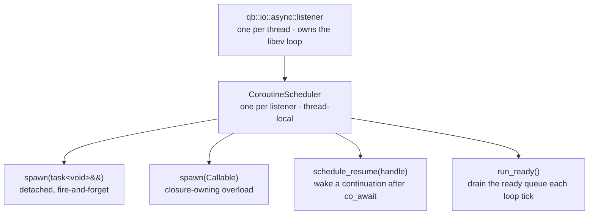

# C++20 coroutines

> **Audience:** Adopter · **Status:** stable · **Verified-against:** qb 3.0.0 (C++20 default, C++23 supported)

`qb::io::async` ships a native C++20/23 coroutine layer — `task<T>`, awaiters, combinators, channels, structured-concurrency scopes, generators, streams, retry, and cancellation — running directly on the same single-threaded libev loop as the rest of `qb-io`, so asynchronous code reads as straight-line sequential code.

**Prerequisites:** [The async runtime](./async_system.md), [QB-IO overview](./README.md) — **See also:** [Transports](./transports.md), [Protocols](./protocols.md), [Async, lifecycle, and allocation invariants](../7_reference/io_invariants.md)

## Summary

A coroutine in `qb-io` is any function that returns `qb::io::async::task<T>` and uses `co_await`, `co_return`, or (for generators) `co_yield`. Tasks suspend at `co_await` and hand control back to the thread's event loop; the loop resumes them when the awaited timer, socket, channel, lock, or inner task completes. Everything runs on one thread per scheduler, cooperatively — two coroutines on the same thread are never concurrent, which is what makes the synchronization primitives lock-free and the actor-integration rules tractable.

Include the whole layer with one header:

```cpp
#include <qb/io/async/coroutine.h>   // task, awaiters, scheduler, combinators, …
```

`<qb/io/async.h>` pulls it in transitively, so any program that already uses the async runtime has the coroutine API available. The TCP connect awaiter lives in `<qb/io/async/tcp/connector.h>` (guarded by `__cpp_impl_coroutine`) and is reached through `<qb/io/async.h>`.
<!-- src: qb/src/qb/io/async/coroutine.h, qb/src/qb/io/async.h:53 -->

The framework targets C++20 by default; coroutine support requires a compiler with working C++20 coroutines.
<!-- src: qb/README.md (C++20 requirement); connector.h gated on __cpp_impl_coroutine -->

Every timed coroutine API on this page takes a `qb::duration` (a `std::chrono::nanoseconds` span; any `std::chrono::duration` converts implicitly). Deadlines that need an absolute point use `std::chrono::steady_clock::time_point` (the type behind `qb::mono_time`). Raw `double`-seconds arguments are not part of this surface.
<!-- src: qb/src/qb/io/async/coroutine/awaiter.h:309, cancellation.h:873 -->

## The execution model



| Property | Value | Source |
|---|---|---|
| Schedulers per thread | one (`thread_local`, owned by the listener) | `scheduler.h:153-157`, `utils.h:212` |
| Concurrency model | cooperative, single-threaded | `scheduler.h:153-157` |
| Interleaving point | `co_await` only | `scheduler.h:543-554` (Factbook) |
| OS mutexes / atomics on the hot path | none, within one thread | `scheduler.h:41-49`, `sync.h:31-34` |
| Cross-thread wake-up | route through the `qb-core` actor mailbox | `scheduler.h:158-161` |

Because all coroutines on a thread share one scheduler and one event loop, only one runs at a time and another can start only at a suspension point. Mutual exclusion between two coroutines on the same thread is therefore a property of the model, not something you lock for. Pushing or resuming a coroutine from a *different* thread is undefined behavior — the scheduler holds no mutex; cross-thread signaling must go through the actor mailbox (see [Safe integration with `qb::Actor`](#safe-integration-with-qbactor)).
<!-- src: qb/src/qb/io/async/coroutine/scheduler.h:151-161 -->

## Quick start (standalone)

Outside `qb-core`, drive the loop yourself: initialize the thread's listener, spawn the root task, then run the loop.

```cpp
// src: derived from examples/coroutine/standalone_timer_example.cpp
#include <qb/io/async/coroutine.h>
#include <chrono>
#include <iostream>

using namespace qb::io::async;
using namespace std::chrono_literals;

task<int> compute_value(int base) {
    co_await sleep(100ms);            // suspends; the loop runs other work
    co_return base * 2;
}

task<void> root() {
    int result = co_await compute_value(21);
    std::cout << "Result: " << result << '\n';   // prints "Result: 42"
}

int main() {
    qb::io::async::init();                        // no-op, kept for symmetry (see below)
    coro_scheduler().spawn(root());               // task is a prvalue → moved
    run_for(2s);                                  // pump the loop + scheduler
    return 0;
}
```

`init()` is a **no-op** kept for symmetry — its whole body is a comment. `listener::current` is a `thread_local` that initializes itself on first access, so nothing needs readying; and `init()` deliberately does *not* clear existing state, because fixtures that share a thread's listener would have their already-registered watchers invalidated. For a genuinely clean loop, call `listener::current.clear()` (see [The async runtime](./async_system.md#initialization)). `coro_scheduler()` returns the listener's scheduler so `spawn`, timers, and `run_ready()` all share one loop. Under `qb-core`, each `VirtualCore` owns its listener and pumps the loop for you — you never call `run_for` from inside an actor (see [Safe integration with `qb::Actor`](#safe-integration-with-qbactor)).
<!-- src: qb/src/qb/io/async/listener.h:966 (init), qb/src/qb/io/async/coroutine/utils.h:212 (coro_scheduler), :227 (run_for) -->

## `task<T>` — the coroutine return type

`task<T>` (`coroutine/task.h`) is the primary return type. `T` is the value produced by `co_return`; use `task<void>` when there is none.

```cpp
// src: derived from qb/src/qb/io/async/coroutine/task.h
#include <qb/io/async/coroutine.h>
using namespace qb::io::async;
using namespace std::chrono_literals;

task<int> async_add(int a, int b) {
    co_await sleep(0ms);             // yield once, then resume on the same thread
    co_return a + b;
}

task<void> caller() {
    int v = co_await async_add(3, 4);   // suspends caller until async_add finishes
    // v == 7
}
```

| Property | Detail | Source |
|---|---|---|
| Return types | `task<void>` or `task<T>` for any move-constructible `T` | `task.h:399`, `:754` |
| Initial suspend | `std::suspend_always` — lazy until spawned or awaited | `task.h:471-472` |
| Move-only | yes; a moved-from task is empty and destroys nothing | `task.h:619-620`, `:638-639` |
| Exception propagation | stored in the promise, re-thrown at the awaiting `co_await` | `task.h:521`, `:693-694` |
| Symmetric transfer | `await_suspend` returns a `coroutine_handle<>` — flat stack in deep chains | `task.h:665-666` |
| Frame allocation | thread-local size-bucketed freelist (`detail::CoroutineFrameAllocator`) | `task.h:164` |

`await_resume()` always checks for a stored exception first and re-throws it; if the task is somehow not ready it throws `std::logic_error` rather than returning an uninitialized value. You generally never see these paths — you `co_await` the task and the result (or exception) is delivered.
<!-- src: qb/src/qb/io/async/coroutine/task.h:685-703 -->

> `task<T>` is move-only. Pass it to `spawn` (or any consumer) with `std::move`. `coro_scheduler().spawn(t)` is a compile error; write `coro_scheduler().spawn(std::move(t))`. See the [`spawn(Callable)` overload](#the-scheduler) for the case where you want to hand a lambda directly.
<!-- src: qb/src/qb/io/async/coroutine/task.h:638-639; scheduler.h:278 (Factbook) -->

### `shared_task<T>` — one computation, many awaiters

`shared_task<T>` (`coroutine/shared_task.h`) is a copyable handle to a single coroutine result. The first `co_await` runs the computation; later awaits — from any number of coroutines — observe the same result without re-running it.

```cpp
// src: derived from qb/src/qb/io/async/coroutine/shared_task.h
#include <qb/io/async/coroutine.h>
using namespace qb::io::async;
using namespace std::chrono_literals;

task<int> compute_value() { co_await sleep(50ms); co_return 42; }

task<void> fan_out() {
    shared_task<int> shared = make_shared_task(compute_value());
    int a = co_await shared;        // triggers execution
    int b = co_await shared;        // reuses the cached result, no extra work
    // a == b == 42
}
```

Awaiting a default-constructed `shared_task` throws `std::logic_error` — construct it through `make_shared_task`.
<!-- src: qb/src/qb/io/async/coroutine/shared_task.h:185, :366 -->

## The scheduler

The per-thread scheduler is reached through `coro_scheduler()` (`coroutine/utils.h`), which returns the listener's `CoroutineScheduler` (`coroutine/scheduler.h`).

```cpp
// Detached, fire-and-forget — the scheduler owns the frame to completion.
coro_scheduler().spawn(std::move(my_task));

// Closure-owning overload: pass the lambda itself (no trailing ()),
// so the closure is moved into an owning frame and cannot dangle.
coro_scheduler().spawn([captured]() -> task<void> {
    co_await do_work(captured);
});

// Introspection
std::size_t live    = coro_scheduler().active_count();   // ready + suspended
std::size_t pending = coro_scheduler().pending_count();  // ready queue only
bool        ready   = coro_scheduler().has_ready();
```
<!-- src: qb/src/qb/io/async/coroutine/scheduler.h:278 (spawn task), :433 (spawn Callable), :671 (active_count), :611 (pending_count), :591 (has_ready); utils.h:212 (coro_scheduler) -->

`spawn(task<void>&&)` takes ownership of the handle: the coroutine runs to completion even after the original `task` object is destroyed, and the scheduler frees the frame when it finishes. `spawn(Callable)` accepts a no-argument callable returning `task<void>` and moves the closure into an owning wrapper frame — the fix for the "dangling lambda" trap described in [Lifetime footguns](#lifetime-footguns). `schedule_resume()` does *not* take ownership; it is how awaiters wake a continuation whose frame belongs to a `task<T>` object elsewhere.
<!-- src: qb/src/qb/io/async/coroutine/scheduler.h:256-278 (spawn task), :405-436 (spawn Callable), :453 (schedule_resume, Factbook) -->

`active_count()` returns ready-queue frames plus suspended frames — the count of coroutines still in flight, which is what a drain or shutdown loop needs. Do not call `run_ready()` (or `run`, `run_for`, `run_sync`) re-entrantly from inside a coroutine body or actor handler; the scheduler guards against re-entrancy (asserts in debug, returns `0` in release).
<!-- src: qb/src/qb/io/async/coroutine/scheduler.h:657-673 (active_count), :503-529 (re-entrancy guard) -->

## Awaiters

Awaiters bridge coroutines to libev events. The free functions in `coroutine/utils.h` cover the common cases; `coroutine/awaiter.h` defines the underlying types (`timer_awaiter`, `socket_awaiter`, `async_awaiter<T>`).

```cpp
// src: derived from qb/src/qb/io/async/coroutine/utils.h, awaiter.h
#include <qb/io/async/coroutine.h>
using namespace qb::io::async;
using namespace std::chrono_literals;

co_await sleep(500ms);              // suspend for a duration (qb::duration)

co_await wait_readable(fd);         // resume when fd is EV_READ ready
co_await wait_writable(fd);         // resume when fd is EV_WRITE ready
co_await wait_for_io(fd, EV_READ | EV_WRITE);

// Bridge a callback-style API into a coroutine result.
int result = co_await async_awaiter<int>([](auto cb) {
    legacy_async_op([cb](int r) { cb(r); });   // cb fires from an event handler
});
```

`sleep(qb::duration)` with a duration of zero or less is a **cooperative yield**, not a kernel timer: the coroutine is re-enqueued at the back of the ready queue and resumes on the next scheduler turn. A positive duration arms an `qev_timer`. There is no `sleep_until` in this layer; for an absolute deadline use [`with_deadline`](#cancellation).
<!-- src: qb/src/qb/io/async/coroutine/awaiter.h:282-291 (yield_only_ rationale), :311 (duration <= 0), :334-337 (re-enqueue, no timer), utils.h:101 (sleep); no sleep_until exists -->

> Awaiters must remain alive until `await_resume()`. Never create a temporary awaiter that goes out of scope before the coroutine resumes. The framework awaiters stop their libev watcher in `await_resume()` and in their destructor, so an early return or thrown exception cannot leave a live watcher pointing at a freed frame.
<!-- src: qb/src/qb/io/async/coroutine/awaiter.h:30-35, :359-373 (await_resume stops the watcher), :383-406 (destructor) -->

### Awaiting a TCP connect

The coroutine connect factory (`tcp/connector.h`) returns an awaiter that yields `std::optional<Socket_>` — empty on timeout or error.

```cpp
// src: derived from qb/src/qb/io/async/tcp/connector.h
#include <qb/io/async.h>            // pulls in tcp/connector.h
using namespace qb::io::async;
using namespace std::chrono_literals;

task<void> connect_to(qb::io::uri remote) {
    auto sock = co_await tcp::connect(remote, 5s);   // std::optional<...>
    if (!sock) {
        // timed out or failed to connect
        co_return;
    }
    // use *sock
}
```

`connect<Transport>(uri remote, qb::duration timeout = qb::duration::zero(), bool verify_peer = true)` defaults to `transport::tcp`. A zero timeout means no deadline.
<!-- src: qb/src/qb/io/async/tcp/connector.h:750-754 (connect factory), :729-730 (await_resume std::optional<Socket_>) -->

## Combinators

`coroutine/combinators.h` composes several tasks into one awaitable.

### `when_all` — wait for every task

```cpp
// Heterogeneous: returns std::tuple<A, B>
auto [a, b] = co_await when_all(fetch_int(), fetch_string());

// Homogeneous vector: returns std::vector<T>
std::vector<task<int>> work;
for (int i = 0; i < 8; ++i) work.push_back(compute(i));
std::vector<int> results = co_await when_all(std::move(work));
```
<!-- src: qb/src/qb/io/async/coroutine/combinators.h:199 (variadic), :309 (vector) -->

### `when_any` / `race` — first to finish wins

```cpp
// when_any returns when_any_result { size_t index; std::any value; std::exception_ptr exception; }
auto r = co_await when_any(fast(), slow(), backup());
// Structured bindings expose (index, value); the value is std::any:
auto [idx, value] = r;
int v = std::any_cast<int>(value);

// race(...) is a semantic alias for when_any(...).
co_await race(network_task(), local_cache_task());
```

`when_any_result::get<T>()` casts the winning value (and re-throws if the winner threw). On win, the losing branches are **reclaimed (cancelled)** — the scheduler tears down each loser, stopping its timers and dropping its result — so nothing lingers in the background.
<!-- src: qb/src/qb/io/async/coroutine/combinators.h:321 (when_any_result), :558 (when_any), :1042 (race) -->

### `coro_with_timeout` — deadline wrapper

```cpp
try {
    auto value = co_await coro_with_timeout(fetch_data(), 2s);   // returns T
    use(value);
} catch (const qb::io::async::timeout_error&) {
    // deadline elapsed before fetch_data() completed
}
```

`coro_with_timeout(task<T>&&, qb::duration)` returns `T` and **throws `timeout_error`** on timeout — it does not return an `std::optional`. On timeout the inner task keeps running in the background until it finishes naturally; its result is then dropped.
<!-- src: qb/src/qb/io/async/coroutine/combinators.h:883 (coro_with_timeout returns T), :856 (throws timeout_error), :816-818 (inner task is not interrupted) -->

## Cancellation

`coroutine/cancellation.h` provides a cooperative `cancellation_token` and helpers that observe it.

```cpp
// src: derived from qb/src/qb/io/async/coroutine/cancellation.h
#include <qb/io/async/coroutine.h>
using namespace qb::io::async;
using namespace std::chrono_literals;

cancellation_token token;

// Sleep that wakes immediately with cancelled_error when the token fires.
task<void> worker(cancellation_token tok) {
    co_await cancellable_sleep(500ms, tok);
    // reached only if not cancelled before the timeout
}

// Run an operation against an absolute deadline.
task<int> bounded(task<int>&& op, cancellation_token tok) {
    auto deadline = std::chrono::steady_clock::now() + 200ms;
    co_return co_await with_deadline(std::move(op), deadline, tok);
}

token.on_cancel([] { release_resource(); });   // cleanup callback
token.cancel();                                 // same thread only
```

`cancellation_token` is copyable (it shares state through a `shared_ptr`) and holds no mutex: `cancel()` and `on_cancel()` must run on the token's own thread. `with_deadline(task<T>&& operation, std::chrono::steady_clock::time_point deadline, cancellation_token token = {})` throws `timeout_error` (including if the deadline is already past on entry) or `cancelled_error`; a winning operation result is authoritative and is never reclassified against wall-clock time. `check_cancelled(token)` and `yield_or_cancel(token)` throw `cancelled_error` when the token is set; `make_cancellable(task, token)` wraps a task so it surfaces cancellation.
<!-- src: qb/src/qb/io/async/coroutine/cancellation.h:148 (cancel), :177 (on_cancel), :873 (with_deadline), :881-883 (deadline already past), :281 (check_cancelled), :318 (yield_or_cancel), :617 (make_cancellable), :737 (cancellable_sleep) -->

> **Cross-thread cancellation.** A token has no lock. To cancel from another thread, send a `qb-core` actor event to the owning thread and call `token.cancel()` from that actor's synchronous handler, where it runs on the right thread.
<!-- src: qb/src/qb/io/async/coroutine/cancellation.h:97-103 -->

## Synchronization primitives

`coroutine/sync.h` provides primitives that suspend the coroutine instead of blocking the OS thread. They rely on cooperative single-thread scheduling for mutual exclusion — no OS locks are involved.

```cpp
// src: derived from qb/src/qb/io/async/coroutine/sync.h
#include <qb/io/async/coroutine.h>
using namespace qb::io::async;

// ── Counting semaphore ────────────────────────────────────────────────
semaphore sem(3);                              // 3 permits
co_await sem.acquire();
sem.release();
auto guard = co_await sem.scoped_acquire();    // RAII: release on scope exit

// ── Async mutex ───────────────────────────────────────────────────────
async_mutex mtx;
co_await mtx.lock();
mtx.unlock();
auto lk = co_await mtx.scoped_lock();          // RAII unlock

// ── Read/write lock ───────────────────────────────────────────────────
async_rw_lock rw;
{ auto r = co_await rw.scoped_read_lock();  /* concurrent reads */ }
{ auto w = co_await rw.scoped_write_lock(); /* exclusive write  */ }

// ── Barrier (reusable rendezvous) ─────────────────────────────────────
barrier b(4);
co_await b.arrive_and_wait();                  // wait for all 4 arrivals

// ── Event (manual- or auto-reset) ─────────────────────────────────────
async_event ready;                             // manual-reset: set() wakes all
ready.set();
co_await ready.wait();
async_event gate(/*auto_reset=*/true);         // auto-reset: set() wakes one
gate.set();

// ── Latch (one-shot countdown) ────────────────────────────────────────
async_latch latch(3);
latch.count_down();                            // non-suspending
co_await latch.wait();                         // resume when count reaches 0

// ── RAII helpers (run a synchronous callable while holding the resource)
co_await with_semaphore(sem, [] { return do_sync_work(); });
co_await with_lock(mtx,     [] { return do_sync_work(); });
```

Notes grounded in the headers: the mutex methods are `lock()` / `unlock()` / `scoped_lock()`; the read/write lock exposes `lock_read()` / `lock_write()` / `unlock_read()` / `unlock_write()` plus the RAII `scoped_read_lock()` / `scoped_write_lock()`. `async_event(bool auto_reset = false, bool initially_set = false)`. `with_semaphore` and `with_lock` take a *synchronous* callable and return its result (they `co_return f()`), not a task factory. Over-releasing a semaphore is a no-op; unlocking an unheld mutex or rw-lock asserts in debug builds.
<!-- src: qb/src/qb/io/async/coroutine/sync.h:261 (acquire), :376 (scoped_acquire), :511 (lock), :534 (unlock), :601 (scoped_lock), :899/:905 (scoped_read/write_lock), :789/:803 (unlock_read/write), :1023 (arrive_and_wait), :1104 (async_event ctor), :1187 (set), :1296 (count_down), :1401/:1425 (with_semaphore/with_lock), :294/:535 (no-op / assert) -->

## Channels

`coroutine/channel.h` defines a single-thread `channel<T>` for handing values between coroutines. It is non-copyable and non-movable; the capacity defaults to `0` (rendezvous: a send and a recv meet directly with no buffering).

```cpp
// src: derived from qb/src/qb/io/async/coroutine/channel.h
#include <qb/io/async/coroutine.h>
using namespace qb::io::async;
using namespace std::chrono_literals;

channel<int> ch(/*capacity=*/16);

// Producer
co_await ch.send(42);                          // suspends if the buffer is full
bool sent = ch.try_send(42);                   // non-blocking

// Consumer
std::optional<int> v = co_await ch.recv();     // empty optional when closed
std::optional<int> w = ch.try_recv();          // non-blocking

// Timed member operations
std::optional<int> r = co_await ch.recv_for(200ms);   // empty on timeout
bool ok               = co_await ch.send_for(7, 200ms); // false on timeout

ch.close();                                    // wakes pending recvs with empty;
                                               // pending sends throw channel_closed

// Pipeline utilities (free functions / factories)
co_await transform(in_ch, out_ch, [](int x) { return x * 2; });
co_await filter   (in_ch, out_ch, [](int x) { return x % 2 == 0; });
std::vector<int> all = co_await collect(in_ch);

auto chan          = make_channel<int>(16);              // std::unique_ptr<channel<int>>
auto [in_p, out_p] = make_pipeline<int, int>(            // pair of unique_ptr channels
    [](int x) { return x + 1; });
```

`recv_for` / `send_for` are **member functions** (`ch.recv_for(timeout)` returns `task<std::optional<T>>`; `ch.send_for(value, timeout)` returns `task<bool>`). `send(value)`/`recv()` return awaiters; `recv()` yields `std::optional<T>` that is empty once the channel is closed, while `send(value)` throws `channel_closed` on a closed channel. `make_channel` and `make_pipeline` return `std::unique_ptr` so the caller owns the channel's lifetime.
<!-- src: qb/src/qb/io/async/coroutine/channel.h:131 (capacity default 0), :302 (send), :410 (recv), :608 (recv_for), :709 (send_for), :420/:473 (try_send/try_recv), :490 (close), :916 (make_channel), :1093 (make_pipeline), :1017/:1039/:1061 (transform/filter/collect) -->

### `select` — first ready channel wins

```cpp
auto res = co_await select(ch_int, ch_string);   // select_result
if (res.index == 0)      use(res.get<int>());
else if (!res.closed)    use(res.get<std::string>());
```

`select(...)` returns `select_result { size_t index; bool closed; std::any value; }`: `index` is the 0-based channel that won, `closed` is true when that channel was closed (the value is then empty), and `get<T>()` casts the received value.
<!-- src: qb/src/qb/io/async/coroutine/channel.h:1140 (select_result), :1268 (select variadic), :1344 (select vector) -->

> A `channel<T>` is single-thread only. Its destructor clears an internal liveness flag *before* closing, so a parked sender or receiver whose frame is torn down does not touch freed channel memory. `channel_range` (and `async_stream::from_channel`) drain non-blocking and stop at the first empty slot — use [`async_stream`](#async-streams) for true async iteration, and prefer `from_channel_shared` to avoid the borrowed-reference lifetime trap.
<!-- src: qb/src/qb/io/async/coroutine/channel.h:137-143 (dtor clears _alive before close), :924-927 (channel_range does not suspend, Factbook); stream.h:98/:110 -->

## Structured concurrency: `coroutine_scope`

`coroutine/scope.h` groups child coroutines and bounds their lifetime to the scope.

```cpp
// src: derived from qb/src/qb/io/async/coroutine/scope.h
#include <qb/io/async/coroutine.h>
using namespace qb::io::async;
using namespace std::chrono_literals;

task<void> structured_work() {
    coroutine_scope scope;                       // default policy: cancel_all

    scope.spawn(worker_a());
    scope.spawn(worker_b());
    scope.spawn([cap]() -> task<void> { co_await process(cap); });  // closure-owning

    co_await scope.join_all();                    // wait for all children
    // size_t winner = co_await scope.join_any();  // wait for the first
    // bool   all_ok = co_await scope.join_all_for(2s);  // bounded wait

    scope.cancel_all();                           // signal the scope's token
    scope.rethrow_if_error();                     // re-throw the first failure
}

// RAII wrapper
co_await with_scope([](coroutine_scope& s) -> task<void> {
    s.spawn(worker());
    co_await s.join_all();
});

// Bounded-concurrency map: f comes BEFORE max_concurrency
std::vector<Result> out = co_await parallel_map(
    items,
    [](Item it) -> task<Result> { co_return process(it); },
    /*max_concurrency=*/4);

// Loop while a synchronous predicate holds; factory returns a fresh task each turn
co_await repeat_while(
    []        { return make_iteration_task(); },   // factory → task<void>
    []         { return should_continue(); });      // predicate → bool
```

`join_any()` returns `task<size_t>` (the completed index); `join_all_for(qb::duration)` returns `task<bool>`. The cleanup policy on scope destruction is one of `cancel_all` (default — signals the scope token), `join_all` (best-effort; children keep running via the shared scope state if you forgot to `co_await join_all()`), or `detach`. `parallel_map(items, f, max_concurrency = 10)` takes the mapping function *before* the concurrency limit; `repeat_while(factory, should_continue, cancel_token = {})` calls `should_continue()` synchronously and `factory()` to build each iteration's task. The ready-made `joining_scope`, `cancelling_scope`, and `detaching_scope` subclasses fix the policy.
<!-- src: qb/src/qb/io/async/coroutine/scope.h:81 (cleanup_policy), :153 (default cancel_all), :228/:255 (spawn task/Callable), :366 (join_all), :423 (join_any), :487 (join_all_for), :617/:626/:635 (scope subclasses), :715 (with_scope), :732 (repeat_while), :779 (parallel_map) -->

## Generators

`coroutine/generator.h` provides pull-based sequences.

### Synchronous `generator<T>`

Uses `co_yield`; `co_await` is disallowed (`await_transform` is deleted). Supports range-for.

```cpp
// src: derived from qb/src/qb/io/async/coroutine/generator.h
#include <qb/io/async/coroutine.h>
using namespace qb::io::async;

generator<int> fibonacci(int n) {
    int a = 0, b = 1;
    for (int i = 0; i < n; ++i) {
        co_yield a;
        std::tie(a, b) = std::pair{b, a + b};
    }
}

for (int v : fibonacci(10)) { use(v); }

auto gen   = range(0, 100);        // generator over [0, 100)
auto inf   = iota(0);              // infinite: 0, 1, 2, …
auto fromv = from_range(my_vector);
auto fromi = from_iterator(my_vector.begin(), my_vector.end());
```

A `generator<T>` must outlive any iterator over it; a throwing generator body surfaces the exception to the consumer rather than appearing as normal exhaustion. `collect_to_vector(gen)` takes the generator by reference.
<!-- src: qb/src/qb/io/async/coroutine/generator.h:77 (generator), :112 (await_transform deleted), :513 (collect_to_vector ref), :543 (from_range), :584 (from_iterator), :599 (iota), range/repeat (:616/:631) -->

### Asynchronous `async_generator<T>`

Combines `co_yield` with `co_await`, so each element can wait on the event loop.

```cpp
async_generator<std::string> read_lines(std::string path);   // co_await + co_yield inside

co_await ag_for_each(read_lines("log.txt"), [](std::string line) {
    process(line);                                            // synchronous consumer
});
co_await ag_for_each(read_lines("log.txt"), [](std::string line) -> task<void> {
    co_await store(line);                                     // async consumer
});

std::vector<std::string> all = co_await ag_collect(read_lines("log.txt"));
auto sizes = co_await ag_map   (read_lines("f"), [](auto& s) { return s.size(); });
auto kept  = co_await ag_filter(read_lines("f"), [](auto& s) { return !s.empty(); });
auto total = co_await ag_reduce(read_lines("f"), std::size_t{0},
                                [](auto acc, auto& s) { return acc + s.size(); });
```

`ag_reduce(gen, init, reducer)` takes the seed before the reducer.
<!-- src: qb/src/qb/io/async/coroutine/generator.h:289 (async_generator), :731 (ag_for_each), :754 (ag_collect), :774 (ag_map), :791 (ag_filter), :812 (ag_reduce: init then reducer) -->

## Async streams

`coroutine/stream.h` adds a lazy, composable `async_stream<T>` over asynchronous sources.

```cpp
// src: derived from qb/src/qb/io/async/coroutine/stream.h
#include <qb/io/async/coroutine.h>
using namespace qb::io::async;
using namespace std::chrono_literals;

// Sources
auto s1 = async_stream<int>::from_vector({1, 2, 3, 4, 5});
auto s2 = async_stream<int>::from_channel(ch);            // ch must outlive the stream
auto s3 = async_stream<int>::from_channel_shared(ch_ptr); // shared ownership, no UAF
auto s4 = range_stream(1, 101);                           // [1, 100]
auto s5 = interval(100ms);                                // async_stream<size_t>: 0,1,2,…

// Lazy transforms (chainable)
auto pipeline = async_stream<int>::from_vector({1,2,3,4,5,6})
    .map   ([](int v) { return v * v; })
    .filter([](int v) { return v % 2 == 0; })
    .take(5)
    .skip(1);

// Terminal consumers (each is co_await-ed)
co_await pipeline.for_each([](int v) { use(v); });        // sync sink
std::vector<int>   v   = co_await pipeline.collect();
std::optional<int> hd  = co_await pipeline.first();
size_t             n   = co_await pipeline.count();
int                sum = co_await pipeline.reduce([](int a, int b) { return a + b; }, 0);
bool               any = co_await pipeline.any([](int v) { return v > 10; });
bool               all = co_await pipeline.all([](int v) { return v > 0; });
std::optional<int> hit = co_await pipeline.find([](int v) { return v == 36; });
co_await pipeline.drain_to(out_channel);

// Combining
auto merged = merge_streams(std::vector{stream_a, stream_b});      // async_stream<T>
auto zipped = zip(stream_of_ints, stream_of_strings);             // pairs
```

The numeric source is `range_stream(start, end)` (there is no `async_stream<T>::range`). `merge_streams` takes a `std::vector<async_stream<T>>`; `zip(a, b)` yields `async_stream<std::pair<T, U>>`; `reduce(f, initial)` takes the reducer then the seed; `for_each` also accepts a callable returning `task<void>` for an async sink.
<!-- src: qb/src/qb/io/async/coroutine/stream.h:98/:110/:118 (from_channel/_shared/_vector), :833 (range_stream), :782 (interval), :670 (merge_streams), :723 (zip), :156/:173/:190/:206 (map/filter/take/skip), :392/:400/:408/:417/:425/:434/:443/:452/:462 (for_each/collect/first/reduce/count/any/all/find/drain_to) -->

## Safe integration with `qb::Actor`

Under `qb-core`, each `VirtualCore` runs one thread, one listener, and one coroutine scheduler. The actor dispatch model assumes a handler runs to completion with exclusive access to its actor's state — but a `co_await` *yields the thread*, letting other handlers run in between. A coroutine that touches actor members across a suspension point is therefore a single-thread data race, and the actor may even be destroyed while the coroutine is parked.

The supported integration points are `Actor::spawn` and `Actor::spawn_detached`. Both launch an *isolated* coroutine and may communicate back only through events. `spawn` is the recommended default: the coroutine is *scoped* to the actor (cancelled when the actor is killed) and receives a `qb::ScopedCoroContext` with cancellation-aware operations, usable with the free `qb::ask()` request/reply helper. `spawn_detached` is the explicit fire-and-forget variant: the coroutine outlives the actor and receives a plain `qb::CoroContext` (an `ActorId`-by-value handle). The example below uses `spawn`.

```cpp
// src: derived from examples/coroutine/actor_example.cpp
#include <qb/actor.h>
#include <qb/io/async/coroutine.h>
#include <memory>
#include <string>

// Event payloads must be trivially RELOCATABLE. The runtime moves an event with raw
// memcpy — the source pipe relocates what it already holds when it grows, reply/forward
// byte-recycle it, and a cross-core hop copies it twice — and a short std::string points
// into its own inline buffer on libstdc++, so a by-value one is invalid on every path.
// Box dynamic text so only the heap pointer travels (or use qb::string<N> when the
// length has a known bound). Note `request_id`, not `id`: qb::Event already has an
// `id` member (the event type id), and shadowing it stops the event from compiling.
struct StartProcessing : qb::Event {
    int                                request_id;
    std::shared_ptr<const std::string> data;
    StartProcessing(int rid, std::string d)
        : request_id(rid)
        , data(std::make_shared<const std::string>(std::move(d))) {}
};
struct ProcessingComplete : qb::Event {
    int                                request_id;
    std::shared_ptr<const std::string> result;
    uint64_t                           ns;
    ProcessingComplete(int rid, std::string r, uint64_t n)
        : request_id(rid)
        , result(std::make_shared<const std::string>(std::move(r)))
        , ns(n) {}
};

class CoroWorker : public qb::Actor {
    int processed_ = 0;
public:
    qb::io::async::task<bool> onInit() override {
        registerEvent<StartProcessing>(*this);
        registerEvent<ProcessingComplete>(*this);
        co_return true;
    }

    // Synchronous handler — runs with exclusive access to actor state.
    void on(StartProcessing& req) {
        int      rid   = req.request_id;    // capture by VALUE only
        auto     data  = req.data;          // shared_ptr copy — the bytes are not copied
        uint64_t start = time();

        spawn([rid, data, start](auto ctx) -> qb::io::async::task<void> {
            // Isolated context: NO access to actor members here.
            std::string result = co_await AsyncService::process_data(*data);
            uint64_t    ns     = ctx.time() - start;
            // `template` is required: ctx's type is dependent inside a generic lambda.
            ctx.template push<ProcessingComplete>(rid, std::move(result), ns);
        });
    }

    // Synchronous handler — exclusive access again.
    void on(ProcessingComplete& ev) {
        ++processed_;                       // safe: no suspension here
    }
};
```

`CoroContext` exposes exactly five members: `push<Event>(args…)` (send an event to the spawning actor — i.e. to `self`), `push_to<Event>(dest, args…)` (send to a specific `ActorId`), `broadcast<Event>(args…)` (fan out to every actor on all cores, mirroring `Actor::broadcast` — this is how `qb::require` sends its discovery ping), `id()`, and `time()`. Events sent to a now-dead actor are ignored, so the context is safe to use after any suspension. A `spawn` coroutine instead receives a `qb::ScopedCoroContext`, which derives from `CoroContext` and adds cancellation-aware operations (`sleep`, `until_cancelled`, `cancellation_point`, `cancellable`). For request/reply, use the free helper `qb::ask(ctx, target, Event{...}, timeout)` (declared in `qb/core/patterns/request.h`): it sends `Event` to `target` and `co_return`s the same `Event` filled in by the responder's `reply()` — e.g. `auto r = co_await qb::ask(ctx, target, PriceQuery{"BTC"}, 500ms);`. `has_active_coroutines()` reports whether the actor still has spawned coroutines in flight.
<!-- src: qb/src/qb/core/Actor.h:1385 (class CoroContext), :1403 (push), :1413 (push_to), :1422 (broadcast), :1437 (time), :1674 (ScopedCoroContext), :1239 (spawn), :1202 (spawn_detached); qb/src/qb/core/patterns/request.h:100 (ask free helper); qb/src/qb/core/Actor.cpp:241,260 (__resolve_coro_scheduler__ debug-asserts a TLS scheduler) -->

| Rule | Reason | Source |
|---|---|---|
| Event handlers stay `void on(Event&)` | `registerEvent` requires a `void` handler; a `task<void> on(Event&)` breaks actor dispatch | `Actor.h:771` |
| Use `spawn()` (or `spawn_detached()`) for coroutine work | isolates the coroutine from live actor state | `Actor.h:1239`, `:1202` |
| Capture by **value** inside the lambda | a reference (or `this`) dangles after the first `co_await` | `Actor.h:1161-1163`, `:1219-1220`; examples/coroutine/actor_example.cpp:80 |
| Communicate via `ctx.push` / `ctx.push_to` | preserves message-passing semantics; an event addressed to an actor that is already gone finds no subscribed handler, so it is disposed instead of delivered | `Actor.h:1402-1403` (`push`), `:1412-1413` (`push_to`); `qb/src/qb/system/event/router.h:348-357` (no handler → dispose, no dispatch) |
| Process results in a synchronous handler | guarantees exclusive access to actor state | `Actor.h:1157-1159` |

`spawn()` and `spawn_detached()` must be called on the actor's own `VirtualCore` thread (each debug-asserts that a thread-local scheduler exists). They are the only supported way to use coroutines inside an actor — never call `run`, `run_for`, or `run_sync` from a handler.
<!-- src: qb/src/qb/core/Actor.cpp:260; qb/src/qb/io/async/listener.h:981 (ensure_not_inside_ready_drain) -->

## Lifetime footguns

The most common coroutine bug in this layer is a dangling capture: a *temporary* lambda is destroyed as soon as its call expression finishes, but the coroutine frame may outlive it and reference its captures after the first suspension.

```cpp
// src: derived from qb/src/qb/io/async/coroutine.h, qb/src/qb/io/async/coroutine/task.h
using namespace qb::io::async;
using namespace std::chrono_literals;

// WRONG: temporary lambda is gone before the coroutine resumes
auto t = [&data]() -> task<void> {
    co_await sleep(100ms);
    use(data);                       // dangling reference
}();

// OK: store the lambda so it outlives its invocation
auto fn = [&data]() -> task<void> {
    co_await sleep(100ms);
    use(data);
};
coro_scheduler().spawn(fn());        // fn is alive throughout

// BEST: hand the lambda itself to spawn(); the closure is moved into an owning frame
coro_scheduler().spawn([data_copy = data]() -> task<void> {
    co_await sleep(100ms);
    use(data_copy);                  // copy lives in the coroutine frame
});

// WRONG: loop variable captured by reference
for (int i = 0; i < 5; ++i) {
    tasks.push_back([&i]() -> task<int> {
        co_await sleep(10ms);
        co_return i * 10;            // i is out of scope / wrong value
    }());
}

// OK: pass the loop variable as a by-value parameter (copied into the frame)
auto worker = [](int id) -> task<int> {
    co_await sleep(10ms);
    co_return id * 10;
};
for (int i = 0; i < 5; ++i) {
    tasks.push_back(worker(i));      // i is copied into the argument
}
```

Three rules cover every case: function parameters are copied into the coroutine frame, so passing data as an argument is always safe; the `spawn(Callable)` and `coroutine_scope::spawn(Callable)` overloads move the closure into an owning frame for you; and a coroutine local lives until `co_return`, not until the frame is destroyed. Note that a coroutine's locals are destroyed at `co_return` — not when the spawned frame is later freed — so anything a deferred operation needs must be owned by the frame (a parameter or a capture), not borrowed from a caller stack.
<!-- src: qb/src/qb/io/async/coroutine/scheduler.h:405-436 (spawn Callable), :791 (invoke_owned_), task.h:638-639; coroutine.h (capture-safety guidance); io_invariants Factbook scheduler.h:433 -->

> **Scheduler teardown.** `~CoroutineScheduler` destroys only ready-queue frames it owns plus deferred completed frames; *suspended* frames are intentionally left alone because their libev watchers still reference them. Stop the event loop before destroying the scheduler. The listener does this on its own destruction, so application code rarely manages it directly; in debug builds, leaked suspended frames at teardown print a one-line warning.
<!-- src: qb/src/qb/io/async/coroutine/scheduler.h:180-208 (rationale), :209-254 (teardown, debug warning at :238-245) -->

## Debug tracing

Each macro is a compile-time flag (`-DQB_DEBUG_CORO_LIFECYCLE=1`); when set it emits trace output to `stderr`.

| Macro | What it traces | Source |
|---|---|---|
| `QB_DEBUG_COROUTINES` | `task<T>` promise lifecycle, awaiter `on_event_ready`, timer fire | `task.h:92`, `awaiter.h:187` |
| `QB_DEBUG_SCOPE` | `coroutine_scope` spawn / join / completion | `scope.h:42` |
| `QB_DEBUG_CORO_LIFECYCLE` | `CoroutineScheduler` teardown, suspended-count traces | `scheduler.h:51-52` |
| `QB_DEBUG_AGEN` | `async_generator` yield / next / suspend flow | `generator.h:35-37` |

`QB_DEBUG_SCOPE` and `QB_DEBUG_CORO_LIFECYCLE` share the scheduler trace channel.
<!-- src: qb/src/qb/io/async/coroutine/{task.h:92, awaiter.h:187, scope.h:42, scheduler.h:51-52, generator.h:35-37} -->

## Header reference

| Header | Key exports |
|---|---|
| `coroutine/task.h` | `task<T>` — primary coroutine return type |
| `coroutine/shared_task.h` | `shared_task<T>`, `make_shared_task` — multi-consumer result |
| `coroutine/scheduler.h` | `CoroutineScheduler`, `schedule_via_current` |
| `coroutine/awaiter.h` | `awaiter_base`, `timer_awaiter`, `socket_awaiter`, `async_awaiter<T>` |
| `coroutine/utils.h` | `sleep`, `wait_readable` / `wait_writable` / `wait_for_io`, `coro_scheduler`, `run_for`, `run_sync` |
| `coroutine/combinators.h` | `when_all`, `when_any`, `race`, `coro_with_timeout`, `timeout_error`, `when_any_result` |
| `coroutine/cancellation.h` | `cancellation_token`, `cancelled_error`, `check_cancelled`, `yield_or_cancel`, `make_cancellable`, `cancellable_sleep`, `with_deadline` |
| `coroutine/sync.h` | `semaphore`, `async_mutex`, `async_rw_lock`, `barrier`, `async_event`, `async_latch`, `with_semaphore`, `with_lock` |
| `coroutine/channel.h` | `channel<T>`, `channel_closed`, `select`, `make_channel`, `make_pipeline`, `transform`, `filter`, `collect` |
| `coroutine/scope.h` | `coroutine_scope`, `joining_scope` / `cancelling_scope` / `detaching_scope`, `with_scope`, `parallel`, `parallel_map`, `repeat_while` |
| `coroutine/generator.h` | `generator<T>`, `async_generator<T>`, `range`, `iota`, `from_range`, `ag_for_each` / `ag_collect` / `ag_map` / `ag_filter` / `ag_reduce` |
| `coroutine/stream.h` | `async_stream<T>`, `range_stream`, `interval`, `merge_streams`, `zip`, `timer`, `repeat_value`, `from_generator` |
| `coroutine/retry.h` | `retry_policy`, `backoff_strategy`, `retry_exhausted`, `with_retry`, `with_retry_until`, `make_retryable`, predefined policies |
| `coroutine/mixin.h` | `coro_mixin<Derived>` — CRTP `.coro()` accessor |
| `coroutine.h` | umbrella include for everything above |
<!-- src: qb/src/qb/io/async/coroutine.h (include list) and each cited header -->

## Retry policies

`coroutine/retry.h` wraps a task factory with backoff-driven retries.

```cpp
// src: derived from qb/src/qb/io/async/coroutine/retry.h
#include <qb/io/async/coroutine.h>
using namespace qb::io::async;
using namespace std::chrono_literals;

retry_policy policy {
    .max_attempts = 5,
    .base_delay   = 100ms,
    .max_delay    = 30s,
    .strategy     = backoff_strategy::exponential_jitter,
    .is_retryable = [](const std::exception& e) { return is_transient(e); },
    .on_retry     = [](std::size_t attempt, const std::exception& e) { log_retry(attempt, e); },
};

// Retry until the task succeeds (or attempts are exhausted → retry_exhausted)
int result = co_await with_retry(
    []() -> task<int> { co_return co_await fetch(); }, policy);

// Retry until a success predicate over the result holds
std::string status = co_await with_retry_until(
    []() -> task<std::string> { co_return co_await get_status(); },
    [](const std::string& s)  { return s == "ready"; },
    policy);

// Bind a factory + policy into a reusable retrying callable
auto retryable = make_retryable([]() -> task<int> { co_return co_await fetch(); }, policy);
int again = co_await retryable();
```

`retry_policy` defaults: `max_attempts = 3`, `base_delay = 100ms`, `max_delay = 30000ms`, `strategy = backoff_strategy::exponential`. `on_retry` has signature `void(std::size_t attempt, const std::exception&)`. When all attempts fail, `with_retry` throws `retry_exhausted`. The predefined policies are: `transient_network_policy()` — 5 attempts, exponential-jitter backoff, retryable on common transient-error substrings; `idempotent_policy()` — 10 attempts, exponential-jitter, always retryable; `aggressive_retry_policy()` — 20 attempts, linear backoff, always retryable.
<!-- src: qb/src/qb/io/async/coroutine/retry.h:85-97 (retry_policy defaults, on_retry signature), :219 (with_retry), :350 (with_retry_until), :418 (make_retryable), :45 (retry_exhausted), :428/:446/:460 (predefined policies) -->

---

**Next:** [Transports](./transports.md) · [Protocols](./protocols.md) · [The async runtime](./async_system.md) · [Async, lifecycle, and allocation invariants](../7_reference/io_invariants.md)
