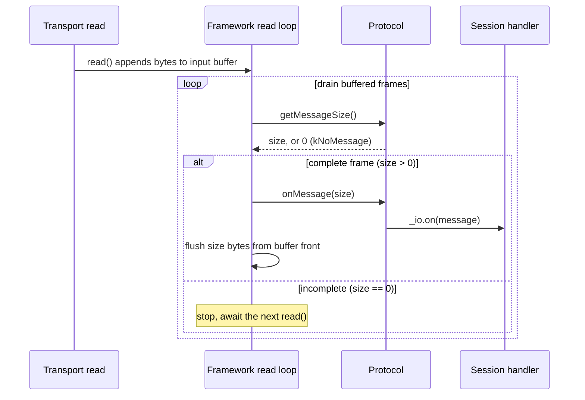

# Framing messages with protocols

> **Audience:** Adopter · **Status:** stable · **Verified-against:** qb 2.6.0 (C++20 default, C++23 supported)

A protocol is the pluggable framing strategy that turns a continuous byte stream into discrete application messages: it decides where one message ends and hands each complete message to the I/O component's handler.

**Prerequisites:** [qb-io overview](./README.md), [Transports](./transports.md) — **See also:** [Asynchronous I/O model](./async_system.md), [TCP transport](./transports.md), [Secure (SSL/TLS) transport](./ssl_transport.md)

## Summary

TCP, TLS, and most pipe transports deliver a continuous stream of bytes with no inherent message boundaries — a single `read()` may return half a message, one message, or three and a half. Reconstructing logical messages from that stream is *message framing*, and in `qb-io` it is the job of a **protocol**.

A protocol is a small state machine attached to an I/O component. On every read it answers two questions:

1. Is a complete message available in the input buffer? (`getMessageSize()`)
2. If so, parse it and dispatch it to the component. (`onMessage()`)

The framework owns the buffer, the read loop, and message size limits; the protocol owns only the framing rule and the parse. `qb-io` ships protocols for the three common framing strategies (delimiter byte, delimiter sequence, length-prefix header) plus JSON and MessagePack, and lets you define your own by subclassing one interface.

## Concepts

### The protocol contract: `IProtocol` and `AProtocol<IO_>`

Every protocol implements `qb::io::async::IProtocol` (in `qb/io/async/protocol.h`). Custom protocols derive from the CRTP helper `qb::io::async::AProtocol<IO_>`, which stores a typed reference to the owning I/O component as the protected member `_io` and forwards the three pure-virtual hooks:

```cpp
// src: qb/include/qb/io/async/protocol.h
namespace qb::io::async {

class IProtocol {
public:
    static constexpr std::size_t kNoMessage = 0; // "no complete message yet"

    virtual std::size_t getMessageSize() noexcept = 0;
    virtual void        onMessage(std::size_t size) noexcept = 0;
    virtual void        reset() noexcept = 0;

    [[nodiscard]] bool ok() const noexcept;          // valid operational state?
    void not_ok() noexcept;                          // mark unrecoverable error
    void set_should_flush(bool) noexcept;            // control post-message flush
    bool should_flush() const noexcept;
};

template <typename _IO_>
class AProtocol : public IProtocol {
protected:
    _IO_ &_io;                                       // the owning I/O component
    AProtocol(_IO_ &io) noexcept;
};

} // namespace qb::io::async
```

The `_IO_` type is the I/O component that will use the protocol (typically your TCP session class). The protocol reads from the component's input buffer through `this->_io.in()` and dispatches parsed messages through `this->_io.on(...)`.

### The three hooks

**`std::size_t getMessageSize() noexcept`** inspects the input buffer and reports the size of the next complete message.

- Return the **number of bytes to consume from the front of the buffer** for the next complete message — the framework flushes exactly that many after `onMessage()` returns. For the delimiter protocols this includes the trailing delimiter; for `size_as_header` it is the payload length only, because that protocol removes the fixed header itself before reporting.
- Return `IProtocol::kNoMessage` (which is `0`) when the buffer does not yet hold a complete message; the framework will call again after more bytes arrive.
- The reported size must satisfy `size <= _io.pendingRead()` — the framework trusts the report and consumes exactly that many bytes on the matching `onMessage()` call.
- For a *custom* protocol, keep it **inspection-only and side-effect-free**: do not consume bytes, do not call back into the I/O component, and do not drive transport state machines from here. Two built-in protocols deviate by design — the internal `handshake` protocol drives the TLS state machine, and `size_as_header` consumes its fixed header here (see [Length-prefixed messages](#length-prefixed-messages)) — but the inspection-only rule is the one to follow when you write your own.
- A size greater than the component's `max_message_size()` is treated as a protocol error: the framework disconnects with `disconnect_reason::message_too_large`.

**`void onMessage(std::size_t size) noexcept`** is called once per non-zero `getMessageSize()` result. It parses the `size`-byte message at the front of the input buffer and dispatches it, conventionally by constructing the protocol's `message` type and calling `this->_io.on(...)`. You do **not** remove the bytes yourself — after `onMessage()` returns, the framework flushes `size` bytes from the front of the buffer (subject to `should_flush()`).

**`void reset() noexcept`** clears partial parsing state so the protocol is ready for the next message from a clean slate. The delimiter protocols clear their resumable scan offset here; `size_as_header` clears its pending header value. Note: `reset()` does not restore `ok()` — a protocol that called `not_ok()` stays not-ok and must be replaced.

### The `message` type alias

Concrete protocols expose a nested type named `message` (e.g. `using message = MyParsed;`). This is the type the I/O component receives in `void on(Protocol::message&&)`. The built-in protocols define their own `message` struct; a custom protocol declares the alias to whatever struct it parses into.

### Signaling errors: `not_ok()`

When a protocol detects unrecoverable corruption (bad magic, invalid length field, undecodable payload), it calls `this->not_ok()`. The framework observes `ok() == false`, closes the connection, and dispatches `qb::io::async::event::disconnected` with `reason == disconnect_reason::protocol_error` (`-1`). A protocol cannot recover after `not_ok()`: the connection is torn down. Continuing the conversation requires a new connection with a fresh protocol instance; `not_ok()` is for framing errors, not for the mid-session protocol upgrades described under [Using a protocol in an I/O component](#using-a-protocol-in-an-io-component), which switch protocols on a healthy connection.

### Buffer access

The input buffer returned by `this->_io.in()` is a `qb::allocator::pipe<char>`. Protocols read it with:

- `buffer.size()` — bytes currently buffered (same value as `_io.pendingRead()`).
- `buffer.begin()` / `buffer.end()` — iterators for scanning.
- `buffer.cbegin()` — pointer to the first buffered byte, used to build `std::string_view`s and to `memcpy` out fixed headers.

These views point into the live input buffer and are valid only until the buffer is flushed or refilled — copy out anything you need to retain past `onMessage()`.

### The framing cycle

On each read the framework drives the protocol until the buffer holds no further complete message:



A `not_ok()` from either hook breaks out of this cycle: the framework closes the connection and dispatches `event::disconnected` instead of continuing the loop.

## Built-in protocols

`qb-io` provides protocols for the common framing strategies. Including `qb/io/async.h` pulls them all in; the individual headers are noted below.

### Delimiter-framed messages

A message ends at a known byte or byte sequence. Defined in `qb/io/protocol/base.h` and aliased for text in `qb/io/protocol/text.h`.

| Type | Framing | `message` payload |
|---|---|---|
| `base::byte_terminated<IO_, EndByte>` | single byte, default `'\0'` | base only (framing) |
| `base::bytes_terminated<IO_, Trait>` | sequence from `Trait::_EndBytes` | base only (framing) |
| `text::string<IO_>` | `'\0'`-terminated | `std::string text` |
| `text::command<IO_>` | `'\n'`-terminated | `std::string text` |
| `text::string_view<IO_>` | `'\0'`-terminated | `std::string_view text` (zero-copy) |
| `text::command_view<IO_>` | `'\n'`-terminated | `std::string_view text` (zero-copy) |

`byte_terminated` exposes `static constexpr char end` (the delimiter) and `static constexpr std::size_t delimiter_size = 1`. `bytes_terminated` takes a trait such as `struct CRLF { static constexpr char _EndBytes[] = "\r\n"; };` and rejects an empty delimiter at compile time. Both keep a resumable scan offset, so re-invocation after a partial read does not rescan from the start of the buffer.

The `text::*` aliases build a `message` whose fields are the payload **without** the delimiter:

```cpp
// src: qb/include/qb/io/protocol/text.h
struct message {
    const std::size_t size; // payload length, delimiter excluded
    const char       *data; // pointer into the input buffer
    _StringTrait      text; // std::string or std::string_view over [data, data+size)
};
```

For `string_view` and `command_view`, `text` is a view into the input buffer and is only valid for the duration of the `on(...)` call; copy it out if you need it later.

### Length-prefixed messages

Each payload is preceded by an unsigned integer header giving its byte length. Defined in `qb/io/protocol/base.h`, aliased for binary in `qb/io/protocol/text.h`.

| Type | Header | Max payload |
|---|---|---|
| `base::size_as_header<IO_, Size>` | `Size` (default `uint16_t`) | `Size`'s max |
| `text::binary8<IO_>` | `uint8_t` | 255 bytes |
| `text::binary16<IO_>` | `uint16_t` | 65 535 bytes |
| `text::binary32<IO_>` | `uint32_t` | 4 294 967 295 bytes |

`size_as_header` reads the header, converts from network byte order for 2- and 4-byte headers (`ntohs` / `ntohl`), consumes the header bytes from the buffer, then waits for the full payload. A received header of zero is rejected with `not_ok()`. The matching `text::binary*` protocols dispatch a payload-only message:

```cpp
// src: qb/include/qb/io/protocol/text.h
struct message {
    const std::size_t size; // payload length
    const char       *data; // pointer to the payload in the input buffer
};
```

To **build** the outgoing header, call the static `Header(std::size_t)`:

```cpp
// src: qb/include/qb/io/protocol/base.h
static _Size Header(std::size_t size); // throws std::runtime_error if size exceeds the header's range
```

It requires an unsigned `Size` and returns the length in network byte order, ready to write before the payload.

### JSON and MessagePack

Defined in `qb/io/protocol/json.h`; both frame on a trailing `'\0'` byte (they derive from `base::byte_terminated<IO_, '\0'>`).

| Type | Encoding | `message` payload |
|---|---|---|
| `qb::protocol::json<IO_>` | UTF-8 JSON text | `{ size, data, nlohmann::json json }` |
| `qb::protocol::json_packed<IO_>` | MessagePack | `{ size, data, nlohmann::json json }` |

Before handing a payload to `nlohmann`'s recursive parser, both protocols run a linear pre-scan that bounds container nesting to `qb::protocol::detail::kJsonMaxNestingDepth` (`512`). A document nested deeper than that, or a payload that fails to parse, is rejected with `not_ok()` rather than risking a stack overflow that a `try`/`catch` cannot recover from. The `json` field is owned by the message and survives the `on(...)` call; the `data` pointer is a buffer view and does not.

### Acceptor and handshake protocols

Two protocols under `qb::io::protocol` (in `qb/io/protocol/accept.h` and `qb/io/protocol/handshake.h`) are used internally by the framework rather than declared by application sessions:

- `accept` is the stateless protocol an acceptor uses to detect an accepted socket and hand it to the I/O component.
- `handshake` drives a transport (SSL/TLS) handshake to completion and emits `async::event::handshake`. It is a deliberate exception to the "`getMessageSize()` is a pure query" rule — it calls into the transport's `do_handshake()` and caches the result — and it disables input-buffer flushing (`set_should_flush(false)`) so handshake bytes are not consumed as messages.

You normally never name these directly; the secure transports wire them in for you. See [Secure (SSL/TLS) transport](./ssl_transport.md).

## Using a protocol in an I/O component

Three steps connect a protocol to a session: declare it, install it, and handle its messages.

```cpp
// src: qb/source/io/tests/system/session/text-session-loopback.cpp (adapted)
#include <qb/io/async.h>

class CommandClient : public qb::io::use<CommandClient>::tcp::client<> {
public:
    // 1. Declare the protocol this session uses.
    using Protocol = qb::protocol::text::command<CommandClient>;

    CommandClient() {
        // 2. Install it. switch_protocol<P>(args...) constructs P{args...},
        //    checks ok(), takes ownership, and makes it the active protocol.
        this->switch_protocol<Protocol>(*this);
    }

    // 3. Handle parsed messages. command::message carries { size, data, text }.
    void on(Protocol::message &&msg) {
        qb::io::cout() << "command: " << msg.text << '\n';
        if (msg.text == "QUIT")
            this->disconnect();
    }

    void on(qb::io::async::event::disconnected const &ev) {
        qb::io::cout() << "disconnected (reason " << ev.reason << ")\n";
    }
};
```

`switch_protocol<Protocol>(*this)` constructs the protocol with the session as its `_IO_` argument, verifies `ok()`, stores it in the session's owned protocol list, and makes it active. It returns a pointer to the new protocol, or `nullptr` if the protocol reported `not_ok()` during construction (the failed instance is destroyed and the active protocol is left unchanged). The session owns the protocol; it is destroyed with the session or when `clear_protocols()` is called.

### Sending data that conforms to the protocol

The protocol frames inbound bytes; the sender must produce matching framing. For a delimiter protocol, append the delimiter exposed as `Protocol::end`:

```cpp
// src: qb/source/io/tests/system/session/text-session-loopback.cpp
*this << msg.text << Protocol::end; // command::end is '\n'
```

For a length-prefixed binary protocol, write the network-order header followed by the payload:

```cpp
// src: qb/source/io/tests/system/session/text-session-loopback.cpp
uint16_t len = htons(static_cast<uint16_t>(payload.size()));
*this << std::string_view(reinterpret_cast<const char *>(&len), sizeof(len))
      << std::string_view(payload.data(), payload.size());
```

`size_as_header::Header(payload.size())` produces the same network-order header value with a range check, which is preferable when the payload size is not statically known.

## Defining a custom protocol

When no built-in framing fits your wire format, subclass `AProtocol<IO_>` and implement the three hooks. The pattern below frames a fixed binary header followed by a variable payload, and is condensed from the worked example.

### 1. Define the wire structures

```cpp
// src: examples/io/example5_custom_protocol.cpp (adapted)
#pragma pack(push, 1)
struct MessageHeader {
    uint16_t magic;   // protocol identifier
    uint8_t  version;
    uint8_t  type;
    uint32_t id;
    uint32_t length;  // payload byte count
};
#pragma pack(pop)

constexpr uint16_t MAGIC   = 0x5150;
constexpr uint8_t  VERSION = 0x01;

struct custom_message {           // what the session's on() receives
    uint8_t     type;
    uint32_t    id;
    std::string payload;
};
```

### 2. Implement the protocol

```cpp
// src: examples/io/example5_custom_protocol.cpp (adapted)
#include <qb/io/async.h>
#include <cstring>

template <typename IO_>
class custom_protocol : public qb::io::async::AProtocol<IO_> {
    static constexpr std::size_t HEADER_SIZE = sizeof(MessageHeader);
    bool          _reading_header = true;
    MessageHeader _header{};

public:
    using message = custom_message;

    custom_protocol() = delete;
    explicit custom_protocol(IO_ &io) noexcept
        : qb::io::async::AProtocol<IO_>(io) {}

    std::size_t getMessageSize() noexcept final {
        auto &buffer = this->_io.in();

        if (_reading_header) {
            if (buffer.size() < HEADER_SIZE)
                return 0;                                  // wait for the header
            std::memcpy(&_header, buffer.cbegin(), HEADER_SIZE);
            if (_header.magic != MAGIC || _header.version != VERSION) {
                this->not_ok();                            // unrecoverable: disconnect
                return 0;
            }
            _reading_header = false;
        }

        const std::size_t total = HEADER_SIZE + _header.length;
        if (buffer.size() < total)
            return 0;                                      // wait for the payload
        return total;                                      // full message present
    }

    void onMessage(std::size_t size) noexcept final {
        const char *base = this->_io.in().cbegin();

        message msg;
        msg.type = _header.type;
        msg.id   = _header.id;
        if (_header.length > 0)
            msg.payload.assign(base + HEADER_SIZE, _header.length);

        this->_io.on(std::move(msg));                      // dispatch
        _reading_header = true;                            // ready for the next frame
        // Do not flush here: the framework removes `size` bytes after this returns.
    }

    void reset() noexcept final {
        _reading_header = true;
        _header = {};
    }
};
```

`getMessageSize()` parses the header on the first call that has it buffered, validates it, then reports the full frame size once the payload has also arrived. Storing `_reading_header` and `_header` across calls avoids re-parsing the header while waiting for a slow payload. `onMessage()` builds the `message`, dispatches it, and re-arms for the next frame; the framework flushes the `size` bytes afterward.

### 3. Serialize the outbound side

Teach the output pipe how to write your message type by specializing `qb::allocator::pipe<char>::put<T>`, which enables the `session << message` syntax:

```cpp
// src: examples/io/example5_custom_protocol.cpp
namespace qb::allocator {
template <>
pipe<char> &pipe<char>::put<custom_message>(const custom_message &msg) {
    MessageHeader header;
    header.magic   = MAGIC;
    header.version = VERSION;
    header.type    = msg.type;
    header.id      = msg.id;
    header.length  = static_cast<uint32_t>(msg.payload.size());

    this->put(reinterpret_cast<const char *>(&header), sizeof(header));
    if (!msg.payload.empty())
        this->put(msg.payload.data(), msg.payload.size());
    return *this;
}
} // namespace qb::allocator
```

### 4. Use it from a session

```cpp
// src: examples/io/example5_custom_protocol.cpp (adapted)
class EchoSession : public qb::io::use<EchoSession>::tcp::client<> {
public:
    using Protocol = custom_protocol<EchoSession>;

    EchoSession() { this->switch_protocol<Protocol>(*this); }

    void on(Protocol::message &&msg) {
        *this << custom_message{msg.type, msg.id, msg.payload}; // echo
    }
};
```

The `chat_tcp` and `message_broker` examples under `examples/core_io/` apply this same structure (header + payload + `put<T>` specialization) to a full client/server application.

## Pitfalls

- **`getMessageSize()` must stay side-effect-free.** It runs in the read hot path and may be called many times before a message completes. Do not dispatch, do not write to the socket, and do not flush the buffer from it. The one framework exception is the internal `handshake` protocol, which documents the deviation.
- **Do not flush in `onMessage()`.** The framework removes exactly the `size` bytes you reported from `getMessageSize()`. Calling `flush()` yourself double-consumes and corrupts framing.
- **Report exactly the buffered frame size.** The reported size must be `<= _io.pendingRead()` and `<= max_message_size()`. The framework checks both before calling `onMessage()`: a size above `max_message_size()`, or a size larger than the bytes currently buffered (when `should_flush()` is true), marks the protocol not-ok and disconnects with `message_too_large` (reason `-2`).
- **Buffer views are transient.** `data`/`cbegin()` pointers and `string_view`/`command_view` payloads reference the live input buffer and are invalidated once `onMessage()` returns and the bytes are flushed. Copy out anything you keep.
- **`reset()` does not clear `not_ok()`.** `reset()` clears partial parsing state (the scan offset, a half-read header) but does not restore `ok()`. After a protocol marks itself not-ok, the connection closes; `reset()` cannot rescue it.
- **Handle endianness in custom headers.** Multi-byte length or type fields should be serialized and deserialized in a fixed byte order (network order is the convention; see `htons`/`htonl` and the `size_as_header` source). A raw `memcpy` of a `uint32_t` is host-endian and will mis-frame across architectures.
- **Size limits are enforced, not advisory.** Input/output buffers are capped at `QB_MAX_READ_BUFFER_SIZE` / `QB_MAX_WRITE_BUFFER_SIZE` and per-message size at `QB_MAX_MESSAGE_SIZE` (see `qb/io/config.h`). Exceeding them marks the protocol not-ok and disconnects (`buffer_overflow`, reason `-3`). Raise a component's limit deliberately with `set_max_message_size()` / `set_max_read_buffer_size()` rather than assuming it is unlimited.

## See also

- [Asynchronous I/O model](./async_system.md) — the read loop, the event loop, and where `getMessageSize()` / `onMessage()` are called from.
- [Transports](./transports.md) — the stream and transport layers a protocol reads through (`in()`, `out()`, `publish()`).
- [Secure (SSL/TLS) transport](./ssl_transport.md) — how the `handshake` protocol participates in a TLS session.
- `examples/io/example5_custom_protocol.cpp` — the complete custom binary protocol this page condenses.
- `examples/core_io/chat_tcp/shared/Protocol.h`, `examples/core_io/message_broker/shared/Protocol.h` — custom protocols inside full applications.
