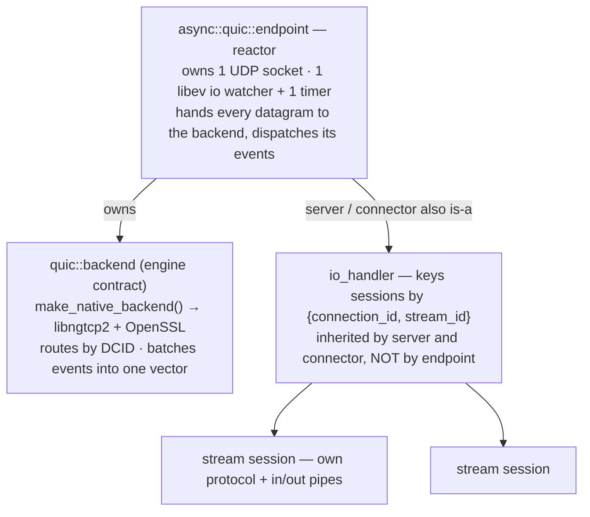

# Native QUIC and HTTP/3 transport

> **Audience:** Adopter · **Status:** stable · **Verified-against:** qb 3.1.0 (C++20 default, C++23 supported) — f1d8cca6

`qb-io` exposes QUIC as an optional asynchronous I/O family built on libngtcp2 and OpenSSL: a reactor-driven endpoint owns one UDP socket, hands every datagram to the ngtcp2 backend — which routes it by connection id — and dispatches typed lifecycle events for connections, streams, and datagrams. It is a **callback surface with no coroutine form at all**; see [what has no coroutine form](./gaps.md#quic-has-no-coroutine-surface-at-all) for why.

**Prerequisites:** [qb-io overview](./README.md) · [Transports](./transports.md) · [SSL/TLS transport](./ssl_transport.md) — **See also:** [Protocols](./protocols.md) · [The async runtime](./async_system.md) · [What has no coroutine form](./gaps.md)

## Summary

QUIC in `qb-io` is transport infrastructure only. The layer owns UDP sockets, timers, connection-id routing, streams, stream credit, resets, stop-sending, datagrams, and typed lifecycle events. Request/response semantics such as HTTP/3 framing and QPACK belong to higher modules such as `qbm/http`, not to `qb-io`. The default Application-Layer Protocol Negotiation (ALPN) identifier is `h3`, so an endpoint is wired for HTTP/3 out of the box, but the transport itself carries opaque stream bytes.

The feature is gated at build time, and it is worth being precise about *what* the gate removes. **The QUIC types always compile**: `quic.cpp` is unconditionally in the library's sources, all six headers are unconditional, and `use<_Derived>::quic` sits inside no `#ifdef` — unlike `use<>::tcp::ssl`. What `QB_HAS_QUIC` gates is the **native backend's body** and what `make_native_backend()` returns. So an endpoint declared in a QUIC-off build compiles and links; it throws when you call `listen` or `connect`. Branch on `qb::io::quic::available()` at runtime, or on `QB_HAS_QUIC` at compile time — and note that `available()` is a compile-time constant: for whether the OpenSSL crypto helper actually initialised at process start, ask `qb::io::quic::native_backend_ready()`.
<!-- src: qb/src/qb/io/CMakeLists.txt:85 (quic.cpp unconditional), qb/src/qb/io/async.h:147 (use<>::quic is not #ifdef'd), qb/src/qb/io/quic.cpp:1571-1575 (make_native_backend), qb/src/qb/io/quic/types.h:103 (available), :122 (native_backend_ready) -->

## Build

QUIC is controlled by the tri-state CMake cache variable `QB_WITH_QUIC`, which defaults to `AUTO`.

| Value           | Behavior                                                                       |
| --------------- | ------------------------------------------------------------------------------ |
| `AUTO` (default)| Enable QUIC if and only if libngtcp2 is found; stay quiet when it is absent.    |
| `ON`            | Require libngtcp2; warn and disable QUIC if it (or SSL) is missing.            |
| `OFF`           | Disable QUIC outright.                                                          |

<!-- src: qb/cmake/qbConfig.cmake:164-165 -->
<!-- src: qb/cmake/qbDependencies.cmake:226-264 -->

```sh
cmake -DQB_WITH_QUIC=ON ...
```

QUIC requires SSL. If `QB_HAS_SSL` is false, QUIC is disabled regardless of `QB_WITH_QUIC`; under `AUTO` the disable is silent, under `ON` it warns. libngtcp2 is resolved through `find_package` only and is never fetched; the custom `FindNgtcp2.cmake` module creates the imported targets `Ngtcp2::ngtcp2` and `Ngtcp2::crypto_ossl`. A successful detection defines the `QB_HAS_QUIC` compile macro that guards all QUIC code. The native backend currently targets the ngtcp2 OpenSSL helper APIs; the GnuTLS helper package is a different backend, not a link-compatible substitute.

```cpp
// src: qb/src/qb/io/quic/types.h:103-119
#include <qb/io/quic.h>

if (!qb::io::quic::available()) {
    // qb::io::quic::unavailable_reason() returns a human-readable message
    // when QUIC was not compiled in.
    return;
}
```

> **Note for CI — `ON` does not fail the build.** A runner without libngtcp2 configured with `QB_WITH_QUIC=AUTO` disables QUIC silently; with `=ON` it prints a `message(WARNING)`, sets `QB_HAS_QUIC` false and carries on. The knob that turns a missing dependency into a `FATAL_ERROR` is **`-DQB_REQUIRE_FEATURES=ON`**. This matters more than it looks: a test declared `qb_add_executable(REQUIRES quic)` is not merely skipped when the capability is off, it is never registered — so the only symptom of a QUIC-less runner is a `ctest` count that is quietly smaller. Configure CI with `-DQB_WITH_QUIC=ON -DQB_REQUIRE_FEATURES=ON`, and assert the registered-test count.
<!-- src: qb/cmake/qbDependencies.cmake:256-258 (qb_feature_degraded), qb/cmake/qbConfig.cmake:521-530 (WARNING unless QB_REQUIRE_FEATURES), qb/cmake/qbFunctions.cmake:394-398 (REQUIRES quic unregisters the target) -->

## Concepts

### Endpoint, backend, and stream session

Three types carry the model.

The **endpoint** (`qb::io::async::quic::endpoint`) is the reactor object. It owns the UDP socket, holds a `std::unique_ptr<qb::io::quic::backend>`, bridges the libev I/O watcher and **one** libev timer, flushes outbound packets, and dispatches backend events to virtual hooks. It is the only polymorphic class in `qb::io::async::quic` — it has a virtual destructor and virtual `dispatch(...)` overloads, while `stream`, `session_base`, `client`, `io_handler` and `stream_key` have none. (`qb::io::quic::backend` is polymorphic too, of course: it is the abstract engine contract described next.) The endpoint is **non-copyable and non-movable** — all four special member operations are deleted — so it must be held in place and cannot be relocated after construction.

Two things it does *not* do, both easy to attribute to it and both one layer down: it does not arm the handshake or idle timeouts — those are ngtcp2 settings and transport parameters written by the backend, and the endpoint's single timer is armed from whatever `backend::next_timeout()` reports; and it does not route by connection id — it hands **every** datagram to `_backend->on_udp_datagram(...)` unrouted, and the DCID lookup happens inside the native backend.
<!-- src: qb/src/qb/io/async/quic/endpoint.h:131-143 (the one timer, armed from next_timeout), :609 (every datagram goes to the backend unrouted); qb/src/qb/io/quic.cpp:829-833 (the server CID index lookup), :1001-1003 (handshake_timeout is an ngtcp2 setting), :1017-1019 (max_idle_timeout is a transport parameter) -->

The **backend** (`qb::io::quic::backend`) is the abstract engine contract: `configure`, `start_server`, `start_client`, `on_udp_datagram`, `on_timeout`, `next_timeout`, `wants_write`, `drain_packets`, `drain_events`, the stream and datagram mutators, and `current_stats`. The shipped implementation drives libngtcp2 plus OpenSSL and is obtained through `qb::io::quic::make_native_backend()`. Custom backends are possible by implementing the contract and passing the instance to the endpoint constructor or `set_backend(...)`.

<!-- src: qb/src/qb/io/quic/backend.h:53-82 -->

A **stream session** (`qb::io::async::quic::client` / `detail::session_base`) is a logical, per-stream buffered session with its own protocol and in/out pipes. Unlike a TCP session, it is not a movable kernel socket. A TCP session owns one file descriptor and can be extracted and moved to another `io_handler`; a QUIC connection owns one UDP descriptor plus shared congestion, ACK/loss recovery, TLS, timer, and connection-id state for every stream it carries. Moving a single stream to another thread would split that shared state, so streams stay on the endpoint owner.


<!-- src: qb/src/qb/io/async/quic/io_handler.h:22-27 (stream_key), :55 (session_map_t); qb/src/qb/io/async/quic/server.h:15-17 (server inherits io_handler), qb/src/qb/io/async/quic/client.h:86-88 (connector does too) -->

All streams of a connection stay on the endpoint owner — a QUIC stream is not extracted to another listener the way a TCP session is.

**Dispatch is deliberately non-reentrant, and this is the property most likely to surprise a handler author.** A `send_stream_data`, `extend_stream_credit` or `reset_stream` issued *from inside* a `dispatch(event::…)` handler re-enters `drain_backend_events`, which refuses: it sets `_drain_events_again` and returns, so the freshly queued events are delivered after the current handler unwinds rather than nested inside it. The header calls the alternative "the root of a whole class of UAF / buffer-underflow bugs" — `event::stream_data::payload` is a `std::string_view` into the very vector a nested drain would be refilling. Calling the mutators from a handler is correct and supported; expecting their events *before* your handler returns is not.
<!-- src: qb/src/qb/io/async/quic/endpoint.h:209-243 (the guard), :288-297 (the re-drain), :271 (payload is a view into the event vector) -->

### Endpoint affinity

QUIC is not TCP with one descriptor per connection. A server endpoint owns one UDP descriptor and routes inbound datagrams to per-connection child backends by connection id. The threading model follows from that:

- A QUIC connection and all of its streams stay on the listener that owns the UDP socket.
- A QUIC stream is not extracted to another listener the way a TCP session is.
- Under `qb-core`, scale by running endpoints on separate ports or listeners, or by forwarding business work to worker actors through `qb` events that carry the connection and stream ids, then posting responses back to the actor that owns the endpoint.

The internal `connection_id` is a monotonically assigned `std::uint64_t`, not the on-wire connection id. `io_handler` — which `server` and `connector` inherit, and `endpoint` does **not** — keys stream sessions by the `{connection_id, stream_id}` pair, and caps how many it will create: `set_max_sessions(n)` makes `ensure_stream_session` return `nullptr` past the limit, with `session_count()` and `max_sessions()` to observe it.
<!-- src: qb/src/qb/io/async/quic/io_handler.h:77-89 (the cap accessors), :182-183 (enforcement) -->

### The `use<>::quic` aliases

The declarative `qb::io::use<Derived>` helper exposes a `quic` group whose nested aliases attach QUIC behavior to a user class.

| Alias                          | Resolves to                                              |
| ------------------------------ | ------------------------------------------------------- |
| `use<D>::quic::session`        | `async::quic::client<D>` (stream session, no server)    |
| `use<D>::quic::stream_session` | `async::quic::client<D>` (same)                         |
| `use<D>::quic::client<Server>` | `async::quic::client<D, Server>`                        |
| `use<D>::quic::server<S>`      | `async::quic::server<D, S>`                             |
| `use<D>::quic::connector<S>`   | `async::quic::connector<D, S>` (`S` defaults to `void`) |
| `use<D>::quic::io_handler<S>`  | `async::quic::io_handler<D, S>`                         |
| `use<D>::quic::endpoint`       | `async::quic::endpoint`                                 |
| `use<D>::quic::stream`         | `async::quic::stream`                                   |

<!-- src: qb/src/qb/io/async.h:147-164 -->

A server derives from `server<Derived, StreamSession>`; a client that manages stream sessions derives from `connector<Derived, StreamSession>`; a client that handles events directly with no per-stream sessions derives from `connector<Derived>` (the `StreamSession=void` specialization). Application message callbacks remain ordinary `on(...)` methods. The QUIC facades dispatch the typed events below to matching `on(event::...)` overloads when the derived class declares them.

## Settings and timeouts

`qb::io::quic::settings` carries the connection-level configuration. The timeout fields are `qb::duration` (a `std::chrono::nanoseconds` span); the windows, limits, and batch sizes are `std::uint64_t`. The verified defaults are:

| Field                       | Type            | Default              |
| --------------------------- | --------------- | -------------------- |
| `handshake_timeout`         | `qb::duration`  | `seconds(10)`        |
| `idle_timeout`              | `qb::duration`  | `seconds(30)`        |
| `stream_recv_window`        | `std::uint64_t` | `1 MiB`              |
| `connection_recv_window`    | `std::uint64_t` | `16 MiB`             |
| `max_stream_data_bidi_local`| `std::uint64_t` | `1 MiB`              |
| `max_stream_data_bidi_remote`| `std::uint64_t`| `1 MiB`              |
| `max_stream_data_uni`       | `std::uint64_t` | `1 MiB`              |
| `max_streams_bidi`          | `std::uint64_t` | `100`                |
| `max_streams_uni`           | `std::uint64_t` | `100`                |
| `max_datagram_frame_size`   | `std::uint64_t` | `0` (datagrams off)  |
| `max_connections`           | `std::uint64_t` | `4096`               |
| `max_pending_stream_bytes`  | `std::uint64_t` | `16 MiB`             |
| `max_pending_stream_frames` | `std::uint64_t` | `4096`               |
| `max_pending_datagram_bytes`| `std::uint64_t` | `4 MiB`              |
| `max_pending_datagram_frames`| `std::uint64_t`| `1024`               |
| `udp_rx_batch_size`         | `std::uint64_t` | `256`                |
| `udp_tx_batch_size`         | `std::uint64_t` | `256`                |
| `enable_stateless_retry`    | `bool`          | `true`               |
| `enable_datagrams`          | `bool`          | `false`              |
| `enable_keylog`             | `bool`          | `false`              |

<!-- src: qb/src/qb/io/quic/types.h:45-66 -->

`handshake_timeout` bounds how long the QUIC/TLS handshake may take before failing; it maps to `ngtcp2_settings.handshake_timeout`. `idle_timeout` is the inactivity ceiling after which the connection closes with `disconnect_reason::idle_timeout`; it maps to the QUIC `max_idle_timeout` transport parameter. Both are converted to milliseconds and multiplied by `NGTCP2_MILLISECONDS` when the native settings are built, so any sub-millisecond precision is truncated.

<!-- src: qb/src/qb/io/quic.cpp:1001-1003 (handshake_timeout), :1017-1019 (max_idle_timeout) -->

Not every field is wired in the shipped backend. The verified enforcement points are:

- The transport-parameter fields (`max_stream_data_*`, `connection_recv_window` → `initial_max_data`, `max_streams_bidi`, `max_streams_uni`, `max_datagram_frame_size`) are written into the ngtcp2 transport parameters when the connection starts — `max_datagram_frame_size` only when `enable_datagrams` is set, otherwise the parameter goes on the wire as `0`. <!-- src: qb/src/qb/io/quic.cpp:1011-1021 (make_transport_params), :1021 (max_datagram_frame_size, gated on enable_datagrams) -->
- `max_pending_stream_bytes` / `max_pending_stream_frames` and `max_pending_datagram_bytes` / `max_pending_datagram_frames` are enforced inside the native backend; overrunning a pending queue closes the connection with `disconnect_reason::buffer_overflow`. <!-- src: qb/src/qb/io/quic.cpp:517-522 -->
- `udp_rx_batch_size` and `udp_tx_batch_size` are enforced by the endpoint's UDP read and write loops, not the backend; a value of `0` means an unbounded batch. <!-- src: qb/src/qb/io/async/quic/endpoint.h:163 (udp_tx_batch_size), :585 (udp_rx_batch_size) -->

`enable_stateless_retry` (default on) performs **address validation via Retry** (RFC 9000 §8.1): the server answers a first Initial with a Retry packet carrying an address-bound token and allocates **no** connection state (`send_retry(...); return nullptr;`). Only once the client re-sends its Initial echoing a token that passes `ngtcp2_crypto_verify_retry_token` does the server construct the child connection. This defends against off-path spoofed-Initial floods. (`ngtcp2_accept` itself runs on **both** datagrams — it is what parses the header so the token can be tested for absence in the first place.) <!-- src: qb/src/qb/io/quic.cpp:863 (ngtcp2_accept), :865 (tokenlen == 0), :867-868 (send_retry, no state), :874-879 (verify_retry_token), :885-892 (the child connection) -->

The following fields are carried in the struct but have **no observed effect** in the shipped native backend, so do not rely on them: `stream_recv_window` is not read anywhere; `enable_keylog` has no TLS keylog wiring. Treat both as reserved until the backend implements them.

Apply settings through the constructor or `set_settings(...)` before `listen` / `connect`:

```cpp
qb::io::quic::settings cfg;
cfg.handshake_timeout = std::chrono::seconds(5);
cfg.idle_timeout      = std::chrono::seconds(20);
cfg.max_connections   = 1024;
endpoint.set_settings(cfg);
```

### Connection limit

`settings.max_connections` caps concurrent server connections; `0` means unlimited. When a server is at the cap, an over-limit new-connection datagram is **silently dropped**, not closed. Dropping rejects only that one new connection, keeps the listener up, and is repeatable; existing connections (matched by their destination connection id) are unaffected and a client may retry after a timeout. The drop is deliberate: queuing a close event on the parent listener would carry the listener's sentinel connection id `0`, which the endpoint interprets as "the listener itself closed", and that close is sticky — a single over-limit datagram would otherwise permanently shut the whole server down, turning a per-client limit into a full-server denial of service.

<!-- src: qb/src/qb/io/quic.cpp:839-852 -->

### Connection migration

QUIC connection migration is supported within the owning endpoint: a peer that changes its network path — a client whose NAT rebinds it to a new source port, or one that deliberately migrates — keeps its connection instead of being dropped. Two mechanisms cooperate:

- **Path rebind on send.** Outgoing packets are addressed to the peer's *current*, path-validated address that ngtcp2 writes back after each `writev`, not the address cached when the connection was accepted. Sending to the stale accept-time address would black-hole every packet and idle-time-out the connection.
  <!-- src: qb/src/qb/io/quic.cpp:1157-1173 (fill_packet_path), :1165-1166 (the rebind onto the path ngtcp2 wrote back) -->
- **Connection-id rotation.** When ngtcp2 issues fresh Source Connection IDs (which the peer may migrate onto), the server re-indexes the connection's current SCID set, so a later datagram carrying a rotated destination connection id still routes to the existing connection rather than being mistaken for a brand-new one.
  <!-- src: qb/src/qb/io/quic.cpp:324-330 (the per-datagram call), :767-814 (reconcile_server_cids), :802-811 (the set difference that retires and re-indexes) -->

Active migration is enabled at the transport-parameter level (`disable_active_migration = 0`). This is path migration *within* the one core that owns the endpoint; moving a connection across cores/threads is a separate concern (see [V1 limits](#v1-limits)).

<!-- src: qb/src/qb/io/quic.cpp:1022 -->

### TLS and hostname verification

`qb::io::quic::tls_config` carries `certificate_file`, `private_key_file`, `server_name`, and `verify_peer` (default `true`).

<!-- src: qb/src/qb/io/quic/types.h:68-73 -->

A server requires `certificate_file` and `private_key_file`. For a client, `verify_peer` validates the certificate chain, but chain validation alone accepts any CA-trusted certificate for any host. The backend binds OpenSSL hostname verification (`SSL_set1_host`) only when `verify_peer` is true **and** `server_name` is set. **Every `connect` overload fills `server_name` from the URI host when it is empty** — the `tls_config` one included, since it takes its config by value and mutates the copy — so a hand-built `tls_config` still gets hostname verification. What defeats it is a `server_name` you set to something *wrong*, one you cleared deliberately, or a URI with no host at all.
<!-- src: qb/src/qb/io/async/quic/endpoint.h:428-429 (server_name filled when empty); qb/src/qb/io/quic.cpp:977-985 (SSL_set1_host gated on verify_peer + server_name) -->

<!-- src: qb/src/qb/io/quic.cpp:977-985 -->

## Examples

A complete, runnable program lives in the corpus — `examples/02-io/12-quic.cpp`
(`qb-example-io-quic`, gated `REQUIRES quic`). It runs a server and a client on **one** listener,
completes a handshake with ALPN negotiated inside it, exchanges a bidirectional stream and a
datagram over the same connection, and then asserts the case this page's ALPN section describes:
a client offering an ALPN the server does not advertise is refused *inside* the handshake — the
peer reaches `closed`, the server's `on(connected)` never fires, and the listener keeps serving
its first connection. The snippets below are the same shapes, trimmed.

### Server

```cpp
// src: qb/tests/io/system/quic/quic-handshake.cpp:531-535 (stream session), :542 (listen), :806 (server) (shape)
#include <qb/io/async.h>

// The per-stream session: a buffered session with its own protocol pipe.
class StreamSession : public qb::io::use<StreamSession>::quic::session {
public:
    using Base = qb::io::use<StreamSession>::quic::session;
    using Base::Base;

    // Optional: declare a protocol with `using Protocol = ...;` and override
    // on(Protocol::message&&). Inbound stream bytes land in in(); writes go
    // through out() via publish()/operator<<.
};

class Server : public qb::io::use<Server>::quic::server<StreamSession> {
public:
    void on(qb::io::async::quic::event::connected const&) {}
    void on(qb::io::async::quic::event::stream_data const& ev) {
        // ev.payload is a borrowed std::string_view valid only for this call.
    }
    void on(qb::io::async::quic::event::connection_closed const&) {}
};

void run_server(Server& server) {
    server.listen(qb::io::uri{"quic://0.0.0.0:4433"},
                  "server.crt", "server.key");      // default ALPN: {"h3"}
}
```

`listen(bind_uri, cert_file, key_file, alpn_protocols = {"h3"})` binds the UDP socket, configures the backend, starts the server role, registers the I/O and timer watchers, and drains the first batch of packets. It returns `false` if the bind fails.

<!-- src: qb/src/qb/io/async/quic/endpoint.h:364-384 -->

### Client

```cpp
// src: qb/tests/io/system/quic/quic-handshake.cpp:619-625 (shape), :815 (connector)
#include <qb/io/async.h>

class Client : public qb::io::use<Client>::quic::connector<StreamSession> {
public:
    using connector::connector;

    // The handshake has completed: NOW a stream can be opened. See the note below.
    void on(qb::io::async::quic::event::connected const &) {
        auto *stream = open_bidirectional_stream_session();
        *stream << std::string_view{"hello\n"};
        finish_stream_session(*stream);   // flush, then send FIN
    }

    void on(qb::io::async::quic::event::connection_closed const &) {}
};

void run_client(Client &client) {
    // connect() is ASYNCHRONOUS: it reaches state::connecting and returns.
    client.connect(qb::io::uri{"quic://example.org:4433"});  // default ALPN: {"h3"}
}
```

> **Do not open a stream before `event::connected`.** `connect()` returns as soon as the endpoint reaches `state::connecting`; the peer's `initial_max_streams_bidi` has not arrived yet, so `ngtcp2_conn_open_bidi_stream` answers `NGTCP2_ERR_STREAM_ID_BLOCKED` — and the backend turns **any** non-zero ngtcp2 return into `throw std::runtime_error("ngtcp2 stream open failed with …")`. Every stream-opening call site in the test suite opens only after reaching `connected`. Drive it from the `event::connected` hook, or pump the loop until the endpoint reports `connected` before opening.
> <!-- src: qb/src/qb/io/async/quic/endpoint.h:432 (connect returns at state::connecting), :447-453 (open_bidirectional_stream); qb/src/qb/io/quic.cpp:503-504 (the throw); qb/tests/io/system/quic/quic-handshake.cpp:582 (establish_loopback pumps to connected), :588 (then opens) -->

`connect(remote_uri, alpn_protocols = {"h3"})`, its `tls_config` overload, and a third
`connect(uri, std::initializer_list<std::string>)` disambiguator all init and bind a local UDP
socket, configure the backend, start the client role, and move the endpoint to the `connecting`
state. That third overload is what makes `client.connect(uri, {"h3", "hq-interop"})` compile at
all — a braced list is otherwise ambiguous against the `tls_config` overload. ALPN entries must be
1 to 255 bytes long and at least one is required; otherwise the wire-ALPN builder throws
`std::invalid_argument`.

**Every** overload fills `tls.server_name` from the URI host when it is empty — including the
`tls_config` one, which takes its argument by value and mutates the copy. A hand-built
`tls_config` therefore still gets hostname verification; the risk to watch for is a *wrong* or
deliberately cleared `server_name`, or a URI with no host, not a forgotten one.

<!-- src: qb/src/qb/io/async/quic/endpoint.h:386-391 (the no-tls_config overload), :406-409 (the initializer_list disambiguator), :412-440 (the tls_config overload), :428-429 (server_name filled from the URI host) -->
<!-- src: qb/src/qb/io/quic.cpp:39-51 (make_wire_alpn), :43-44 (the 1..255 throw), :48-49 (the at-least-one throw), :977-985 (hostname verification) -->

### Streams and protocols

QUIC streams reuse the standard buffered-session conventions:

- received stream bytes append directly into `session.in()`;
- application writes go through `session.out()` via `publish` / `operator<<`;
- a `using Protocol = ...;` alias and `switch_protocol<...>(*this)` work exactly as in classic `async::io`;
- backend stream state is metadata only.

This keeps the invariant that the durable receive payload lives in `session.in()`, the durable transmit payload lives in `session.out()`, and the backend stream state is metadata.

<!-- src: qb/src/qb/io/async/quic/stream.h:133 (in), :137 (out), :205 (publish), :238 (switch_protocol) -->

For streams opened locally by the application, the endpoint or handler owns the drain because an individual QUIC stream has no fd watcher of its own:

```cpp
auto* stream = client.open_bidirectional_stream_session();
stream->publish(std::string_view{"hello\n"});
client.flush_stream_session(*stream);   // write pending output
client.finish_stream_session(*stream);  // flush, then send FIN
```

The same methods exist on servers with an explicit connection id:

```cpp
auto* stream = server.open_unidirectional_stream_session(connection_id);
*stream << std::string_view{"event: ready\n"};
server.finish_stream_session(connection_id, stream->id());
```

<!-- src: qb/src/qb/io/async/quic/server.h:40-98 (the connection-id-taking session overloads), :46-50 (open_unidirectional_stream_session), :85-92 (finish_stream_session) -->

## Lifecycle events

The endpoint dispatches seven typed events to derived `on(event::...)` overloads. All live in `qb::io::async::quic::event`.

| Event               | Key fields                                                        |
| ------------------- | ---------------------------------------------------------------- |
| `connected`         | `connection_id`, `negotiated_alpn`                               |
| `connection_closed` | `connection_id`, `reason`, `error_code`, `reason_phrase`         |
| `stream_started`    | `connection_id`, `id`, `direction`, `origin`                     |
| `stream_data`       | `connection_id`, `id`, `payload`, `fin`                          |
| `stream_data_acked` | `connection_id`, `id`, `bytes`                                   |
| `stream_closed`     | `connection_id`, `id`, `reason`, `error_code`                    |
| `datagram`          | `connection_id`, `payload`                                       |

<!-- src: qb/src/qb/io/async/quic/events.h:16-58 -->

`reason` on `connection_closed` is a `qb::io::quic::disconnect_reason` (`idle_timeout`, `handshake_failed`, `stateless_retry_failed`, `transport_error`, `application_close`, and others). `reason` on `stream_closed` is a `qb::io::quic::stream_close_reason` that distinguishes normal finish from `reset`, `stop_sending`, `flow_control_error`, and `connection_closed`. `reset_stream(...)` maps to an abrupt stream shutdown; `stop_stream(...)` maps to the QUIC read-side stop-sending path.

<!-- src: qb/src/qb/io/quic/types.h:18-39 -->

Server-side and client-side close semantics differ. A `connection_closed` carrying connection id `0` (or any client) sets the endpoint's `_open` flag to false, which means the whole endpoint is down. For a server child connection it only downgrades the endpoint state to `listening` or `connected` and keeps the listener open.

<!-- src: qb/src/qb/io/async/quic/endpoint.h:250-257 -->

> **Borrowed payloads.** The `payload` on `event::stream_data` and `event::datagram` is a `std::string_view` into the backend's drain buffer. It is valid only for the duration of the dispatch call. Copy the bytes if you need to retain them.

<!-- src: qb/src/qb/io/async/quic/endpoint.h:271, :284 (payload string_view over the drain buffer) -->

## Flow control and datagrams

The QUIC layer separates UDP packet RX/TX budgets, per-stream read and write limits, stream credit updates, connection flow control, congestion and loss handled by the backend, and application pending output in `qb` pipes. Credit is extended only for bytes actually consumed — and if you build on `server` or `connector`, **that happens for you**: `feed_stream_data` extends credit by exactly the bytes the protocol took out of `in()`. You call `extend_stream_credit` by hand only on the raw `endpoint` path.

Inbound credit must be re-flushed. `extend_stream_credit(...)` and every backend mutator (send, reset, stop, datagram) call the internal packet drain so the generated `MAX_STREAM_DATA` / `MAX_DATA` frames are actually written; skipping that flush would queue the credit grant but never send it, stalling the receive path. Note the asymmetry with the *event* half of the drain: packets go out immediately, but events generated by a mutator called from inside a handler are deferred until that handler returns (see [Endpoint, backend, and stream session](#endpoint-backend-and-stream-session)).

<!-- src: qb/src/qb/io/async/quic/endpoint.h:492-503 (extend_stream_credit + drain); qb/src/qb/io/async/quic/io_handler.h:285-295 (automatic credit), qb/src/qb/io/async/quic/server.h:124-126 (the server facade wires it) -->

QUIC DATAGRAMs are off by default: `settings.enable_datagrams` is `false` and `max_datagram_frame_size` is `0`. Calling `send_datagram(...)` while datagrams are disabled does not silently no-op — the native backend queues a `connection_closed` event with `disconnect_reason::protocol_error` and the reason phrase `QUIC DATAGRAM is not enabled`. Enable datagrams (`settings.enable_datagrams = true` plus a non-zero `max_datagram_frame_size`) before sending. A payload that exceeds `max_datagram_frame_size`, or that overflows the `max_pending_datagram_bytes` / `max_pending_datagram_frames` queue, resolves as `disconnect_reason::buffer_overflow` instead. An empty payload, or a send issued while the connection is closing, is dropped without error.

Two precisions on that paragraph, both worth knowing before you debug a datagram problem. **The per-payload size check is itself gated on `max_datagram_frame_size > 0`**, so `enable_datagrams = true` with the size left at its `0` default gives you no ceiling at this layer at all. And **every datagram-path failure closes the connection locally only**: they call `queue_close_event(...)` without `write_application_close`, so nothing goes on the wire — your endpoint sees `connection_closed`, the peer is never told and will time out. The stream path does both (`quic.cpp:518-526`), which is the contrast to have in mind.

<!-- src: qb/src/qb/io/quic/types.h:55 (max_datagram_frame_size), :64 (enable_datagrams) -->
<!-- src: qb/src/qb/io/quic.cpp:593-620 (the datagram send path), :599 (the size check is gated on max_datagram_frame_size > 0), :600 (queue_close_event with no wire close), :518-526 (the stream path does both) -->

A stream-session read-buffer overflow is fatal to the stream. Appending past `max_read_buffer_size` makes `feed_stream_data` fail, and the `server` / `connector` facade turns that failure into a `reset_stream` with error code `1`. The write side is not symmetric: publishing past `max_write_buffer_size` returns `nullptr` and marks the session's disconnect reason, but it is not on the `feed_stream_data` path and produces **no** reset. Both limits are per session and settable with `set_max_read_buffer_size` / `set_max_write_buffer_size`.

<!-- src: qb/src/qb/io/async/quic/stream.h:190-193 (append overflow), :208-212 (publish overflow), :157-165 (the setters) -->
<!-- src: qb/src/qb/io/async/quic/io_handler.h:286-287 (feed_stream_data returns false), qb/src/qb/io/async/quic/server.h:127 (the reset) -->

## Pitfalls

- **The endpoint cannot be moved.** All copy and move operations are deleted. Construct it in place and hold it by pointer or reference; never store it in a container that relocates its elements.
  <!-- src: qb/src/qb/io/async/quic/endpoint.h:308-311 -->
- **Most, but not all, entry points throw when QUIC is absent.** `ensure_backend()` throws `std::runtime_error` if `qb::io::quic::available()` is false or no backend could be created, and `make_native_backend()` throws when `QB_HAS_QUIC` is undefined. It is called by `listen`, all three `connect` overloads, `open_bidirectional_stream`, `open_unidirectional_stream`, `send_stream_data`, `reset_stream`, `stop_stream` and `send_datagram`. Three do **not** call it and are silent no-ops instead: `extend_stream_credit`, `close_connection` and `close`, each of which simply tests `if (!_backend) return;`. Guard with `available()` or `QB_HAS_QUIC` rather than relying on a throw.
  <!-- src: qb/src/qb/io/async/quic/endpoint.h:84-93 (ensure_backend), :493-495 (extend_stream_credit no-op), :555-557 (close_connection no-op), :564-566 (close no-op) -->
  <!-- src: qb/src/qb/io/quic.cpp:1569-1576 -->
- **Borrowed event payloads do not outlive the dispatch.** Copy `event::stream_data.payload` / `event::datagram.payload` before returning from the handler.
- **Do not open a stream before `event::connected`.** `connect()` returns while the handshake is still in flight, and opening then throws `std::runtime_error` from the backend.
- **A mutator called from inside a handler does not deliver its events before that handler returns.** The event drain refuses to re-enter and re-runs afterwards. Packets are flushed immediately; events are not.
- **There is no `co_await` anywhere in the QUIC surface.** If you want coroutine ergonomics, park on your own `async_awaiter<T>` completed by a `dispatch(...)` handler — after copying the payload. See [what has no coroutine form](./gaps.md#quic-has-no-coroutine-surface-at-all).
- **Do not move a stream across threads.** Keep the `io_handler` on the core that owns the endpoint and delegate work through `qb` events that carry the connection and stream ids.
  <!-- src: qb/src/qb/io/async/quic/io_handler.h:38-50 -->
- **HTTP/3 semantics are not here.** Server push, request/response framing, and QPACK belong to `qbm/http`. The `qb-io` layer carries opaque stream bytes under the `h3` ALPN.

## V1 limits

The native QUIC layer is intentionally transport-only:

- no HTTP, QPACK, request, or response concepts live in `qb-io`;
- no QUIC stream extraction across listeners;
- no migration of a connection *across cores/threads* — QUIC path migration (NAT rebind and connection-id rotation) is supported, but always within the one core that owns the endpoint (see [Connection migration](#connection-migration));
- HTTP/3 server push and HTTP semantics belong to `qbm/http`.

`SO_REUSEPORT`, a central connection-id dispatcher, and moving a live connection between cores can be layered on top later, but the model remains one endpoint owner per UDP socket.

## See also

- [qb-io module overview](./README.md)
- [Transports](./transports.md) — TCP, UDP, and the transport abstraction QUIC sits beside
- [SSL/TLS transport](./ssl_transport.md) — the OpenSSL dependency QUIC shares
- [Protocols](./protocols.md) — declaring a `Protocol` for stream sessions
- [Async system](./async_system.md) — the listener, watchers, and event loop the endpoint binds to
