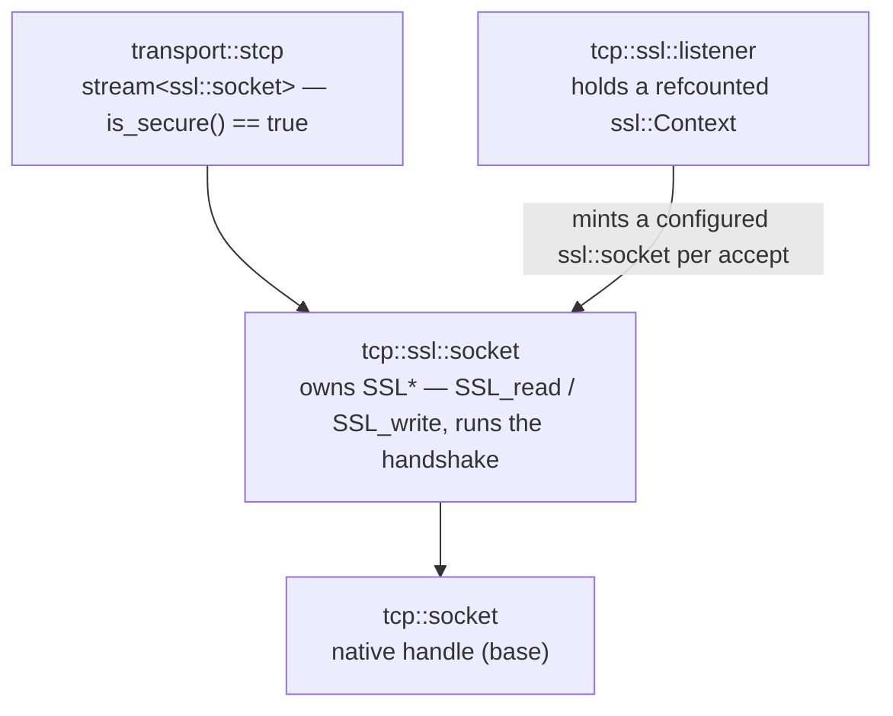

# Secure TCP with SSL/TLS

> **Audience:** Adopter · **Status:** stable · **Verified-against:** qb 3.0.0 (C++20 default, C++23 supported) — f1d8cca6

`qb-io` layers OpenSSL-backed SSL/TLS over its TCP stack, with secure-by-default client verification, a context-holding listener, and a stream transport that drains OpenSSL's internal buffers.

**Prerequisites:** [Transports](./transports.md) · [The async runtime](./async_system.md) — **See also:** [Native QUIC transport](./quic_transport.md) · [qb-io utilities](./utilities.md)

## Summary

Secure TCP in `qb-io` is the plain TCP stack with an OpenSSL encryption layer spliced
underneath the same stream and async interfaces. The pieces are:

- `qb::io::ssl::Context` — **the preferred way to configure TLS.** A value-semantic,
  reference-counted, secure-by-default handle over an `SSL_CTX`: copyable (copies share one
  context, freed exactly once — no user `SSL_CTX_free`), fluent (`Context::client()` /
  `Context::server(cert, key).alpn({"h2"})`), fail-closed (a bad cert yields a falsy Context
  whose `error()` explains why). Hand it to a socket or listener; there is no raw context
  lifetime to manage. See [The `ssl::Context` type](#the-sslcontext-type).
- `qb::io::tcp::ssl::socket` — a `tcp::socket` that owns an OpenSSL `SSL*` and runs the
  handshake plus transparent `SSL_read`/`SSL_write`. Build it from a `Context`
  (`ssl::socket{ssl::Context::client()}`) or let `connect()` auto-create a secure client one.
- `qb::io::tcp::ssl::listener` — a `tcp::listener` that holds a `Context` and mints a
  configured `ssl::socket` per accepted connection.
- `qb::io::transport::stcp` — the `stream<ssl::socket>` specialization that backs every
  asynchronous secure session.
- Free functions in `qb::io::ssl` for building and configuring raw `SSL_CTX` objects — the
  advanced/escape-hatch layer, kept permanently but superseded by `ssl::Context` for most uses.

The whole slice compiles only when the build was configured with OpenSSL available; see
[Build gating](#build-gating). Throughout, the socket and listener follow `qb-io`'s
ownership conventions: they are move-only, and the listener holds a **refcounted**
`ssl::Context` rather than owning the raw `SSL_CTX` outright — `~listener()` frees nothing,
and the `SSL_CTX` dies when the last `Context` copy *and* the last `SSL` minted from it are
gone (`src/qb/io/tcp/ssl/listener.cpp:30`; `src/qb/io/tcp/ssl/context.cpp:174`).



> **Linking the SSL slice changes one process-wide setting.** `qb/io/tcp/ssl/init.cpp` runs a
> static initializer that calls `SSL_library_init()`, `SSL_load_error_strings()`,
> `OpenSSL_add_all_algorithms()` **and `signal(SIGPIPE, SIG_IGN)`**
> (`src/qb/io/tcp/ssl/init.cpp:62-71`). Ignoring `SIGPIPE` is what stops a write to a
> half-closed socket from killing the process, and it is almost always what you want — but it
> is an observable side effect of linking, not of calling anything, so a program that relied on
> the default disposition needs to reinstate it after startup.

## Build gating

The SSL transport is an optional feature. The CMake option `QB_WITH_SSL` defaults to `ON`,
but OpenSSL is found by `find_package(OpenSSL QUIET)` and is **never** fetched. If OpenSSL
is not present, `QB_WITH_SSL` is forced `OFF`, the resolved capability `QB_HAS_SSL` becomes
false, and the entire SSL/TLS slice is absent.

<!-- src: qb/cmake/qbConfig.cmake:160, qb/cmake/qbDependencies.cmake:125-147 -->

| Symbol | Meaning |
| --- | --- |
| `QB_WITH_SSL` | User-facing request (CMake option, default `ON`). Forced `OFF` if OpenSSL is missing. |
| `QB_HAS_SSL` | Resolved capability after dependency probing. Gates the compile definition and the headers below. |

All SSL headers — `qb/io/tcp/ssl/socket.h`, `qb/io/tcp/ssl/context.h`,
`qb/io/tcp/ssl/listener.h`, `qb/io/transport/stcp.h` and `qb/io/transport/saccept.h` — require
an OpenSSL-enabled build. (They are still installed; they simply do not compile without it.)
The `use<>::tcp::ssl` async aliases in `qb/io/async.h` are themselves guarded by
`#ifdef QB_HAS_SSL`, so code that references them must also be compiled under that definition.

<!-- src: qb/src/qb/io/async.h:113-127 -->

> The crypto and JWT toolbox shares this OpenSSL dependency, but does not fail the same way.
> `qb/io/crypto_jwt.h` `#error`s at compile time unless `QB_HAS_SSL` is defined;
> `qb/io/crypto.h` compiles either way, because its gate is per **member** — the class keeps
> everything that needs no OpenSSL (the hex codec a cleartext qbm-pgsql build depends on) and
> drops the rest, so a no-SSL build fails at the call site (`no member named 'md5' in
> 'qb::crypto'`). A non-SSL build has neither secure transport nor the OpenSSL-backed crypto.
> <!-- src: qb/src/qb/io/crypto.h:33-44, qb/src/qb/io/crypto_jwt.h:36-38 -->

## Core components

### The `ssl::Context` type

Declared in `qb/io/tcp/ssl/context.h`. A `Context` is a value: copy it and both copies share the
same reference-counted `SSL_CTX`, destroyed exactly once when the last copy — and the last `SSL`
minted from it — is gone. There is no user-visible `SSL_CTX_free`, so the double-free / leak
footguns of hand-rolled OpenSSL ownership are structurally impossible.

<!-- src: qb/src/qb/io/tcp/ssl/context.h:128 -->

It is **secure by default** and **fails closed**: `Context::client()` pins TLS 1.2+, loads the
system trust store, and verifies the peer; a construction or configuration error (a missing cert, a
bad cipher list) yields a falsy Context whose `error()` explains why — it never silently degrades to
an insecure context.

```cpp
// Server: one shared, fluently-configured context.
auto ctx = qb::io::ssl::Context::server("cert.pem", "key.pem").alpn({"h2", "http/1.1"});
qb::io::tcp::ssl::listener listener{ctx};              // shared by ref-count across every accept

// Client: secure by default; per-connection SNI on top.
qb::io::tcp::ssl::socket client{qb::io::ssl::Context::client().alpn({"h2"})};
client.sni("example.com").connect(ep);
```

The factories are `Context::client()`, `Context::server(cert, key)`, and two escape hatches for
wrapping a raw `SSL_CTX*`: `Context::adopt` (transfer the caller's reference) and `Context::share`
(take a new reference; the caller keeps theirs).

<!-- src: qb/src/qb/io/tcp/ssl/context.h:139-164 -->

Configuration is a fluent chain (`min_version`/`max_version`, `verify`, `trust`/`trust_system`,
`identity`, `alpn`, `ciphers`/`ciphersuites`/`curves`, `dh_params`, `session_cache`/
`session_timeout`); each call is a no-op once the Context has errored, so a single `ok()` check at
the end suffices. The verification, key-log and SNI hooks are **typed** callbacks (`on_verify` /
`on_keylog` / `on_sni` take `std::function`s, not raw C pointers): the closures live on the
context's `SSL_CTX` ex-data, so they are reachable from every minted `SSL` and are destroyed with
the context. `VerifyMode` is `none` / `peer` / `peer_require` (the last adds fail-if-no-cert, i.e.
mutual TLS); `TlsVersion` is `v1_2` / `v1_3`.

<!-- src: qb/src/qb/io/tcp/ssl/context.h:62 (TlsVersion), :72 (VerifyMode), :192-196 (typed on_keylog/on_verify/on_sni) -->

The raw `qb::io::ssl::` free functions and `socket::init(SSL*)` / `listener::init(SSL_CTX*)` remain
available as an advanced escape hatch for fully hand-built configurations.

### `qb::io::tcp::ssl::socket`

Declared in `qb/io/tcp/ssl/socket.h`. Inherits `qb::io::tcp::socket` and owns the OpenSSL
`SSL*` through a `std::unique_ptr<SSL, …>`, plus an optional `ssl::Context` it was built from.
It is move-only (the copy constructor is deleted, move construction is defaulted, and move
assignment is user-provided — it releases the existing `SSL` before taking over the source; the
`SSL`'s reference to its reference-counted `SSL_CTX` is dropped by `SSL_free`, never by a direct
`SSL_CTX_free`), so ownership of the native handle, the `SSL`, and the context transfers on move.

```cpp
class QB_API socket : public tcp::socket {
    // ...
public:
    constexpr static bool is_secure() noexcept { return true; }

    void init(SSL *handle = nullptr) noexcept;

    int connect(endpoint const &ep, std::string const &hostname = "") noexcept;
    int connect(uri const &u) noexcept;
    int connect_v4(std::string const &host, uint16_t port) noexcept;
    int connect_v6(std::string const &host, uint16_t port) noexcept;

    int n_connect(qb::io::endpoint const &ep, std::string const &hostname = "") noexcept;
    int connected() noexcept;          // drives SSL_connect/SSL_accept after non-blocking connect

    int handshake_status() noexcept;   // 1 done, 0 needs I/O, -1 fatal
    [[nodiscard]] bool handshake_complete() const noexcept;

    int read(void *data, std::size_t size) noexcept;        // SSL_read
    int write(const void *data, std::size_t size) noexcept; // SSL_write
    int disconnect() noexcept;                              // NO close_notify — see below

    void set_insecure() noexcept;                           // opt out of peer verification
    [[nodiscard]] bool verify_peer() const noexcept;

    [[nodiscard]] SSL *ssl_handle() const noexcept;
};
```
<!-- src: qb/src/qb/io/tcp/ssl/socket.h:338-925 -->

Key behaviors verified in the header:

- **Initialization.** A default-constructed `ssl::socket` is uninitialized. `init(SSL*)`
  takes ownership of an `SSL` handle (created with `SSL_new` from an `SSL_CTX`). The
  blocking `connect*` family builds an `SSL_CTX` and handle for you when none is supplied,
  which is why those calls work directly on a default-constructed socket.
- **Async connector with a Context.** For full control the async connectors take a caller-built
  `ssl::Context` socket — a private CA (`trust`), a client certificate (`identity`, mutual TLS), or a
  custom verify mode: `connect(ssl::socket{Context::client()…}, uri, cb)`, and the STARTTLS sibling
  for PostgreSQL `SSLRequest` / SMTP·IMAP `STARTTLS`. The negotiator policy is **not deducible**, so
  that one must be spelled with explicit template arguments —
  `starttls_connect<Socket, Negotiator>(socket, uri, cb)`. Both async connect overloads also take a
  trailing `bool verify_peer = true`, applied as `set_insecure()` before `n_connect` — the
  asynchronous equivalent of calling `set_insecure()` yourself. The `qbm`
  PostgreSQL (`ssl_root_cert`/`ssl_cert`/`ssl_key`) and Redis (`set_ssl_root_cert` /
  `set_ssl_client_certificate`) clients drive exactly this path.
  <!-- src: qb/src/qb/io/async/tcp/connector.h:634-637 (starttls_connect, Negotiator_ not deducible), :568 (connect verify_peer), :592 (connect with existing socket), :333-336 (verify_peer applies set_insecure) -->
- **Return convention.** `connect*` and `n_connect*` return `int`: `0` on success — the
  value of `qb::io::SocketStatus::Done` — and non-zero on failure, generically
  `SocketStatus::Error` (`-1`). `n_connect*` returns the underlying non-blocking TCP
  result, so a connect still in progress is not an error.
  A **failed peer verification is not a distinct return value.** It fails the TLS
  handshake in `handCheck()`, which disconnects and returns `-1`, so `connect()` reports
  `-1` exactly as any other handshake error does. The enum's third enumerator,
  `SocketStatus::CertificateError` (`1`), is part of the public surface but is returned by
  nothing in qb; to tell a verification failure apart, read `SSL_get_verify_result()` or
  the OpenSSL error queue.
  <!-- src: qb/src/qb/io/system/sys__socket.h:1567-1571 (SocketStatus enumerators) -->
  <!-- src: qb/src/qb/io/tcp/ssl/socket.cpp:788-799 (connect return gate), :904-912 (n_connect), :724-750 (handCheck) -->
- **Handshake progress.** `handshake_status()` returns `1` when the TLS handshake is
  complete, `0` when OpenSSL needs more socket readiness (`WANT_READ`/`WANT_WRITE`), and
  `-1` on a fatal error. `handshake_complete()` reports whether it finished successfully.
  `do_handshake()` is an inline alias for the internal handshake check.
- **`read()`'s return convention is not the plain socket's.** It returns the number of
  decrypted bytes on success; **`-1` on an orderly peer shutdown** (OpenSSL's
  `SSL_ERROR_ZERO_RETURN` — the peer sent `close_notify`), so the framework's error path
  disposes the session; and **`0` when OpenSSL needs more socket readiness**
  (`WANT_READ` / `WANT_WRITE`) or the handshake is still in progress. That is the inverse of
  `tcp::socket::read`, where `0` means the peer closed. The header's `@return` block says
  otherwise and is wrong.
  <!-- src: qb/src/qb/io/tcp/ssl/socket.cpp:987-992 (orderly shutdown returns -1), :997-999 (WANT_* returns 0), :1004 (handshake in progress returns 0) -->
- **Read drains less than requested.** Because OpenSSL can hold already-decrypted
  application data internally, generic streaming code should use `transport::stcp`, which
  handles `SSL_pending()` for you (see [The stcp transport](#the-stcp-transport)).
- **`disconnect()` sends no `close_notify`.** It clears the connected flag and calls
  `tcp::socket::disconnect()`; `SSL_shutdown` is not called anywhere in the tree. The
  auto-created client context is put into quiet-shutdown mode at connect time
  (`SSL_set_quiet_shutdown`), which makes that the deliberate behaviour rather than an
  omission — but a peer that requires a graceful TLS closure will see an abrupt one.
  <!-- src: qb/src/qb/io/tcp/ssl/socket.cpp:969-973 (disconnect), :881 (SSL_set_quiet_shutdown) -->

#### Secure by default

When `qb-io` builds the client `SSL_CTX` itself — the usual `connect()` / `n_connect()` /
async-connector path — it loads the system trust store, enables `SSL_VERIFY_PEER`, and
verifies the server certificate against the target hostname or IP. A connection to a host
whose certificate does not validate **fails**.

```cpp
// Verifying client (default): rejects a self-signed or untrusted certificate.
qb::io::tcp::ssl::socket c;
int rc = c.connect_v4("example.com", 443);   // 0 only if the chain + hostname verify
```

To opt out — self-signed certificates in tests, pinning handled elsewhere, or a channel
trusted by other means — call `set_insecure()` **before** `connect()` / `n_connect()`.

```cpp
// Opt out of verification for a local self-signed fixture.
qb::io::tcp::ssl::socket c;
c.set_insecure();                            // disables MITM protection — use deliberately
int rc = c.connect_v4("127.0.0.1", 64388);
```
<!-- src: qb/tests/io/system/tls/tls-peer-verification.cpp:140-145 -->

**Supplying your own `SSL` handle through `init(SSL*)` does not opt you out of that policy** — and this is the one place on the page where getting it wrong is a security bug rather than a compile error. `setup_client_ssl()` calls `apply_client_verification_()` unconditionally, and that function branches on whether an `ssl::Context` was supplied, not on whether *you* built the handle. An `init(SSL*)` socket has no `Context`, so it takes the auto-context branch: `SSL_set_verify(ssl, SSL_VERIFY_PEER, nullptr)` plus hostname checking. A `SSL_VERIFY_NONE` you set on your own context is overridden to `SSL_VERIFY_PEER`, and a verify callback you installed on the handle is replaced with `nullptr`. `SSL_set_quiet_shutdown` and `SSL_set_connect_state` are applied to your handle too.

To keep an `init(SSL*)` handle unverified — the shape every SSL test in the suite uses for a self-signed fixture — call `set_insecure()` before connecting. To keep *your own* verification policy, build a `qb::io::ssl::Context` and pass that instead: the `Context` path is honoured as written.

<!-- src: qb/src/qb/io/tcp/ssl/socket.cpp:891 (apply_client_verification_ is unconditional), :703-722 (the branch is keyed on _ctx.native() == nullptr), :572-573 (SSL_VERIFY_PEER + hostname on the auto path), :881 (quiet shutdown), :892 (connect state); qb/src/qb/io/tcp/ssl/socket.h:498-505 (init takes ownership of the SSL) -->

#### Pre-handshake configuration

These settings must be applied before the handshake — but only **five of the seven are
cached** on the socket and replayed once the `SSL` handle exists. The other two need a live
handle and are silent no-ops without one, which is the trap on this table:

| Method | Before `connect()`? | Purpose |
| --- | --- | --- |
| `set_sni_hostname(const std::string&)` | cached | Server Name Indication for the next handshake. |
| `set_alpn_protocols(const std::vector<std::string>&)` | cached | Offer ALPN protocols (e.g. `{"h2", "http/1.1"}`). |
| `disable_session_resumption()` | cached | Sets `SSL_OP_NO_TICKET \| SSL_OP_NO_SESSION_RESUMPTION_ON_RENEGOTIATION` and drops any pending session. |
| `request_ocsp_stapling(bool enable = true)` | cached | Request a stapled OCSP response from the server. |
| `set_session(qb::io::ssl::Session&)` | cached | Offer a previously cached session for resumption. |
| `set_verify_callback(int(*)(int, X509_STORE_CTX*), int mode)` | **needs a handle** | Per-connection X.509 verification callback. |
| `set_verify_depth(int)` | **needs a handle** | Maximum verification chain depth. |
| `set_insecure()` | any time before the handshake | Disable peer verification on the auto-created context. |

`set_verify_callback` and `set_verify_depth` both open with `if (!_ssl_handle) return false;`. On a default-constructed or `Context`-built socket the `SSL` is minted *inside* `connect()` / `n_connect()`, so calling either beforehand does nothing and returns `false` — a return value it is easy not to check. The windows in which they work are: after `init(SSL*)`, or between `n_connect()` and `connected()`.

`disable_session_resumption()` and `set_session()` are mutually exclusive when deferred; the last call wins.

<!-- src: qb/src/qb/io/tcp/ssl/socket.cpp:1299-1305 (set_verify_callback needs a handle), :1307-1313 (set_verify_depth), :1287 (sni deferred), :1296 (alpn deferred), :1130-1131 (resumption deferred, drops the session), :1144 (ocsp deferred), :1256-1257 (session deferred), :1123 (the two SSL_OP flags); qb/src/qb/io/tcp/ssl/socket.h:754 (disable_session_resumption), :765 (request_ocsp_stapling), :799 (set_session), :822 (set_sni_hostname), :834 (set_alpn_protocols), :844 (set_verify_callback), :852 (set_verify_depth), :871 (set_insecure) -->

#### Introspection and sessions

After a successful handshake the socket exposes `get_negotiated_cipher_suite()`,
`get_negotiated_tls_version()`, `get_alpn_selected_protocol()`,
`get_peer_certificate_details()` and `get_peer_certificate_chain()` — all five gate on the
connected flag and return nothing before that. `get_last_ssl_error_string()` does **not**:
it needs only an `SSL` handle, which is what makes it the accessor to reach for after a
*failed* handshake.
<!-- src: qb/src/qb/io/tcp/ssl/socket.cpp:1044 (cipher suite gates on _connected), :1076, :1085, :1094, :1151, :1107-1109 (error string gates only on the handle) -->

`get_session()` returns a `qb::io::ssl::Session` for client-side resumption. The caller
owns it and must release it with `qb::io::ssl::free_session()`. Setting a session does not
guarantee resumption — the server must agree.

<!-- src: qb/src/qb/io/tcp/ssl/socket.h:710-735 (introspection), :774 (peer chain), :786 (get_session), :310 (free_session) -->

### `qb::io::tcp::ssl::listener`

Declared in `qb/io/tcp/ssl/listener.h`. Inherits `qb::io::tcp::listener` and holds a
value-semantic `qb::io::ssl::Context` — **not** a raw `std::unique_ptr<SSL_CTX, …>`. The context is
shared by reference count with every connection the listener accepts, so there is no `SSL_CTX_free`
bookkeeping and one context can back several listeners. It is move-only (copy construction and copy
assignment are `= delete`).

```cpp
class QB_API listener : public tcp::listener {
    qb::io::ssl::Context _ctx;   // value-semantic, refcount-shared with every accepted connection
    // _alpn_wire: the ALPN wire buffer, held behind a unique_ptr so its heap address
    // stays STABLE across a listener move (the SSL_CTX registers that address as the
    // alpn_select_cb argument). Used only by the raw set_supported_alpn_protocols() path.
    mutable std::unique_ptr<std::vector<unsigned char>> _alpn_wire;
public:
    constexpr static bool is_secure() noexcept { return true; }

    listener() noexcept;
    explicit listener(qb::io::ssl::Context ctx) noexcept;   // preferred
    listener(listener const &)            = delete;
    listener(listener &&)                 = default;
    listener &operator=(listener &&)      = default;

    void init(qb::io::ssl::Context ctx) noexcept;   // preferred — no raw lifetime to manage
    void init(SSL_CTX *ctx) noexcept;               // escape hatch; adopts the caller's ref

    ssl::socket accept() const noexcept;
    int         accept(ssl::socket &socket) const noexcept;

    [[nodiscard]] SSL_CTX                     *ssl_handle() const noexcept;
    [[nodiscard]] const qb::io::ssl::Context  &context() const noexcept;   // fail-closed via context().ok()
    // plus context configuration: configure_mtls, set_tls_protocol_versions,
    // set_cipher_list, set_supported_alpn_protocols, enable_session_caching, ...
};
```
<!-- src: qb/src/qb/io/tcp/ssl/listener.h:44 (class listener), :45 (the Context member), :85-96 (move-only), :107 (init), :146 (ssl_handle), :152 (context) -->
<!-- src: qb/src/qb/io/tcp/ssl/listener.h:44-341 (the whole class, `class QB_API listener` to its closing brace) -->

- **Two `init` overloads, and the `Context` one is the one to use.** `init(ssl::Context)`
  takes the value-semantic handle and has no lifetime to manage
  (`src/qb/io/tcp/ssl/listener.h:115`); it is what `async::tcp::acceptor::listen_no_start()`
  calls, and what the TLS round-trip test uses. `init(SSL_CTX*)` is the escape hatch: it
  **adopts** the caller's single reference into the refcounted holder
  (`_ctx = ssl::Context::adopt(ctx)`, `src/qb/io/tcp/ssl/listener.cpp:38-42`). Neither makes
  `~listener()` free anything — its body is empty; the `SSL_CTX` goes when the last `Context`
  copy and the last minted `SSL` are gone. Call either **before** `listen()`.
  <!-- src: qb/src/qb/io/tcp/ssl/listener.cpp:30 (empty destructor), :38-42 (adopt), :44-47 (init(Context)); qb/src/qb/io/async/tcp/acceptor.h:160 (the acceptor's call) -->
- **`adopt` and `share` mark the context client-role.** A raw `SSL_CTX` brought in that way
  is treated as a client context, so a later `.alpn(...)` on it configures the *client offer*,
  not the server's selection list — a server that adopts a raw context and then calls `.alpn()`
  gets the wrong behaviour with no diagnostic. Build server contexts with
  `ssl::Context::server(cert, key)` instead. (`src/qb/io/tcp/ssl/context.cpp:285`, `:295`.)
- **Accept.** Both `accept()` overloads first perform a plain TCP accept, then create an
  `SSL` object from `_ctx` and associate it with the accepted descriptor. The returned
  (or filled) `ssl::socket` still needs its handshake driven — by `connected()` /
  `do_handshake()` for manual use, or automatically by the async server machinery.
- **Server configuration.** The listener forwards a wide range of context settings,
  including `configure_mtls()` for client-certificate (mTLS) authentication,
  `set_tls_protocol_versions()`, `set_cipher_list()` / `set_ciphersuites_tls13()`,
  `set_supported_alpn_protocols()`, `enable_session_caching()`,
  `configure_dh_parameters()`, and `configure_ecdh_curves()`. Each returns `false` if the
  context is not initialized.

### The stcp transport

`qb::io::transport::stcp` (in `qb/io/transport/stcp.h`) is the
`qb::io::stream<qb::io::tcp::ssl::socket>` specialization that backs every asynchronous
secure session. Its `read()` does a socket read, then checks `SSL_pending()` and performs a
second read for any application data OpenSSL has already decrypted and buffered internally.
Without that drain, decrypted bytes would be stranded until the next socket readiness
event. Both `read()` results are bounded by `_max_read_buffer_size` and return
`ErrBufferLimitExceeded` if the cap would be exceeded.

<!-- src: qb/src/qb/io/transport/stcp.h:44-89 -->

### SSL context helpers

Free functions in namespace `qb::io::ssl` (declared in `qb/io/tcp/ssl/socket.h`) build and
configure `SSL_CTX` objects.

```cpp
namespace qb::io::ssl {

SSL_CTX *create_client_context(const SSL_METHOD *method);

SSL_CTX *create_server_context(const SSL_METHOD *method,
                               std::filesystem::path cert_path,
                               std::filesystem::path key_path);

// Context configuration (each returns bool):
bool load_ca_certificates(SSL_CTX *ctx, const std::filesystem::path &ca_file_path);
bool load_ca_directory(SSL_CTX *ctx, const std::filesystem::path &ca_dir_path);
bool set_tls_protocol_versions(SSL_CTX *ctx, int min_version, int max_version);
bool configure_mtls_server_context(SSL_CTX *ctx,
                                   const std::filesystem::path &client_ca_file_path,
                                   int verification_mode = SSL_VERIFY_PEER);
bool configure_client_certificate(SSL_CTX *ctx,
                                  const std::filesystem::path &client_cert_path,
                                  const std::filesystem::path &client_key_path);
bool configure_dh_parameters_server(SSL_CTX *ctx, const std::filesystem::path &dh_param_file_path);
bool set_alpn_protos_client(SSL_CTX *ctx, const std::vector<std::string> &protocols);
// ... cipher lists, OCSP, ECDH, keylog, session caching, PHA, and more.

} // namespace qb::io::ssl
```
<!-- src: qb/src/qb/io/tcp/ssl/socket.h:37-323 (the whole `namespace qb::io::ssl` free-function block), :84 (create_client_context), :95 (create_server_context), :321 (enable_post_handshake_auth_server) -->

`create_client_context` and `create_server_context` return `nullptr` on failure (for
example when the certificate or key file cannot be loaded). **The caller owns the returned
`SSL_CTX` and must release it with `SSL_CTX_free()`** — except when it is handed to a
`listener` via `init()`, which then owns and frees it.

Every file-path argument across these helpers — the certificate and key for
`create_server_context`, the CA file/directory for `load_ca_certificates` /
`load_ca_directory` / `configure_mtls_server_context`, the client certificate and key for
`configure_client_certificate`, and the DH parameters for
`configure_dh_parameters_server` — is a `std::filesystem::path`, not a raw `const char*`.
Each path is resolved through `qb::io::sys::resolve_resource()` before OpenSSL opens it: an
absolute path is used unchanged, while a relative path is looked up against the current
working directory first and then against the running executable's own directory. A server
shipped next to its `cert.pem` / `key.pem` therefore loads them regardless of the cwd it is
launched from.

<!-- src: qb/src/qb/io/tcp/ssl/socket.cpp:185-204 (create_server_context), :206-308 (the four CA/client-cert helpers), :207 (load_ca_certificates), :220 (load_ca_directory), :273 (configure_mtls_server_context), :291 (configure_client_certificate), :413-418 (configure_dh_parameters_server) -->

## Building an SSL server

Inherit from the async SSL server alias, build a server context from the certificate and key
file paths, and hand it to the transport's listener before listening. The aliases (verified in
`qb/io/async.h`) are:

| Alias | Role |
| --- | --- |
| `use<T>::tcp::ssl::acceptor` | Accepts connections; you handle each accepted `ssl::socket`. |
| `use<T>::tcp::ssl::server<Session>` | Acceptor plus per-client `Session` management. |
| `use<T>::tcp::ssl::io_handler<Session>` | Session-management mixin for custom servers. |
| `use<T>::tcp::ssl::client<Server = void>` | Secure client session over `transport::stcp`. |

<!-- src: qb/src/qb/io/async.h:113-127 -->

```cpp
// src: qb/tests/io/system/tls/tls-text-roundtrip.cpp:78-127 (adapted)
#include <qb/io/async.h>
#include <qb/io/protocol/text.h>
#include <qb/io/tcp/ssl/socket.h>   // qb::io::ssl::create_server_context

using namespace qb::io;

class SecureServer;

// One session per accepted client. The transport is transport::stcp.
class SecureSession
    : public use<SecureSession>::tcp::ssl::client<SecureServer> {
public:
    using Protocol = qb::protocol::text::command<SecureSession>;

    explicit SecureSession(IOServer &server) : client(server) {}

    void on(Protocol::message &&msg) {
        *this << msg.text << Protocol::end;   // echo back, still encrypted
    }
};

class SecureServer
    : public use<SecureServer>::tcp::ssl::server<SecureSession> {
public:
    void on(IOSession &) { /* a new secure session was established */ }
};

void run_server(const std::filesystem::path &cert_path,
                const std::filesystem::path &key_path) {
    async::init();

    SecureServer server;
    // create_server_context returns nullptr on failure; the listener takes
    // ownership of the SSL_CTX and frees it on destruction.
    server.transport().init(
        ssl::create_server_context(TLS_server_method(), cert_path, key_path));

    server.transport().listen_v4(64384);   // 0 on success
    server.start();                        // begin accepting on the event loop

    while (true)
        async::run(EVRUN_ONCE);
}
```

The server-side handshake is driven by the async machinery as each connection is accepted;
you never call `SSL_accept` directly. For listeners that need mTLS, protocol pinning, or
specific cipher policy, configure the context (or the listener's forwarding methods) before
`listen()`.

## Building an SSL client

The default client verifies the peer. Against a public CA-signed server, a plain
`connect_v4(host, port)` is sufficient. For a self-signed test fixture, opt out with
`set_insecure()` before connecting.

```cpp
// src: qb/tests/io/system/tls/tls-text-roundtrip.cpp:104-143 (adapted)
#include <qb/io/async.h>
#include <qb/io/protocol/text.h>

using namespace qb::io;

class SecureClient : public use<SecureClient>::tcp::ssl::client<> {
public:
    using Protocol = qb::protocol::text::command<SecureClient>;

    void on(Protocol::message &&msg) {
        // received a decrypted, framed message
    }
};

void run_client() {
    async::init();

    SecureClient client;

    // Local self-signed server on 127.0.0.1: opt out of the default
    // peer verification. Omit this line for a CA-signed endpoint.
    client.transport().set_insecure();

    if (SocketStatus::Done !=
        client.transport().connect_v4("127.0.0.1", 64384)) {
        throw std::runtime_error("could not connect to secure server");
    }

    client.start();
    client << "ping" << '\n';   // encrypted on the wire

    while (true)
        async::run(EVRUN_ONCE);
}
```

**Connecting by hostname sets SNI for you** — and overwrites anything you set beforehand.
`connect_v4` / `connect_v6` route the host through `connect(ep, hostname)`, and `connect(uri)`
supplies `u.host()`; `setup_client_ssl` then assigns that host to the cached SNI value. So
this is all a verified client needs:

```cpp
SecureClient client;
if (SocketStatus::Done != client.transport().connect_v4("api.example.com", 443))
    throw std::runtime_error("TLS connect/verify failed");   // SNI + hostname check: automatic
```

`set_sni_hostname()` earns its place in the cases where no hostname reaches the socket: the
`connect(endpoint)` / `n_connect(endpoint)` overloads, whose `hostname` parameter defaults to
empty, and the Unix-domain entry points. Those are the connections where the chain is
validated but the **name is not**, so set it explicitly before connecting — or pass the
hostname to the overload that takes one.
<!-- src: qb/src/qb/io/tcp/ssl/socket.cpp:882-883 (the cached SNI is overwritten with the connect hostname), :758 (connect_in), :843-849 (connect(ep, hostname)), :816-827 (connect(uri) supplies u.host()); qb/src/qb/io/tcp/ssl/socket.h:524 (the endpoint overload's empty default), :822 (set_sni_hostname) -->

## Generating a test certificate

The framework's own SSL tests generate a self-signed certificate with OpenSSL. The exact
command (RSA-2048, `CN=localhost`, 365-day validity, with a `subjectAltName` so hostname
verification can pass for `localhost`) is:

```bash
# src: qb/tests/io/system/CMakeLists.txt:106-108
openssl req -x509 -newkey rsa:2048 -keyout key.pem -out cert.pem \
    -days 365 -nodes \
    -subj "/CN=localhost/O=QB Tests/C=US" \
    -addext "subjectAltName = DNS:localhost"
```

A self-signed certificate is rejected by a default (verifying) client; pair it with
`set_insecure()` on the client, or add the certificate to the client's trust store.

## Pitfalls

- **The slice vanishes without OpenSSL.** If OpenSSL is not found, `QB_WITH_SSL` is forced
  `OFF`, the headers stop compiling, and the `use<>::tcp::ssl` aliases do not exist. Verify
  `QB_HAS_SSL` in the build configuration before depending on any of this.
- **Verification is on by default — including for an `SSL` handle you built yourself.**
  `init(SSL*)` does not exempt you: the socket applies `SSL_VERIFY_PEER` and hostname checking
  to your handle, replacing a `SSL_VERIFY_NONE` and any verify callback you installed. To keep
  a handle unverified, call `set_insecure()`; to keep your own policy, pass an `ssl::Context`
  instead of a raw `SSL*`.
- **`read()` returns `-1`, not `0`, when the peer shuts the TLS session down cleanly** — and
  `0` when OpenSSL merely wants more socket readiness. Do not carry `tcp::socket::read`'s
  convention across.
- **`disconnect()` does not send `close_notify`.** The client context runs in quiet-shutdown
  mode; a peer that requires a graceful TLS closure sees an abrupt one.
- **`set_verify_callback` / `set_verify_depth` are silent no-ops before `connect()`.** They
  need a live `SSL` handle and return `false` without one. Every other pre-handshake setting
  is cached and replayed; these two are not.
- **Connecting by hostname sets SNI itself and discards a prior `set_sni_hostname()`.** Set
  it explicitly only for the `connect(endpoint)` / Unix-domain paths, where no hostname is
  supplied and the chain is validated without the name being checked.
- **Timed connect does not bound the handshake.** The timed `connect(ep, hostname, wtimeout)`
  overloads bound only the underlying TCP connect phase; the TLS handshake itself is not
  separately timed.
  <!-- src: qb/src/qb/io/tcp/ssl/socket.h:529, :541 (timed connect overloads); qb/src/qb/io/tcp/ssl/socket.cpp:769-798 -->
- **`SSL_CTX` ownership splits by path.** A context from `create_*_context` is caller-owned
  and must be `SSL_CTX_free`d — unless it is passed to `listener::init()`, which then owns
  and frees it. A `Session` from `get_session()` is always caller-owned; release it with
  `free_session()`.
- **Use `stcp` for streaming, not raw `read()`.** OpenSSL may buffer decrypted data
  internally. `transport::stcp::read()` drains `SSL_pending()`; the raw `socket::read()`
  does not, so a hand-rolled read loop can strand already-decrypted bytes.

## See also

- [Transports](./transports.md) — how `stcp` fits the stream/transport model.
- [Asynchronous I/O system](./async_system.md) — the event loop and `use<>` helpers.
- [Native QUIC transport](./quic_transport.md) — the alternative encrypted transport.
- [qb-io utilities](./utilities.md) — the OpenSSL-backed crypto toolbox that shares this dependency.
