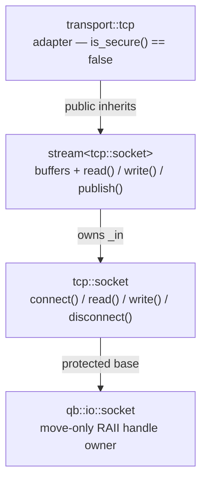

# TCP and UDP transports and sockets

> **Audience:** Adopter · **Status:** stable · **Verified-against:** qb 3.0.0 (C++20 default, C++23 supported)

Transports bind the buffered stream abstractions to concrete sockets, turning a raw `tcp::socket` or `udp::socket` into a read/write/buffer unit that the asynchronous I/O layer and protocols build on.

**Prerequisites:** [qb-io overview](./README.md), [Asynchronous I/O model](./async_system.md) — **See also:** [Framing messages with protocols](./protocols.md), [Secure (SSL/TLS) transport](./ssl_transport.md), [QUIC transport](./quic_transport.md), [Time vocabulary](../0_foundations/time.md)

## Summary

A *transport* in `qb-io` is an adapter class that specializes the generic stream template over one concrete I/O type — a TCP socket, a UDP socket, an SSL socket, a TCP listener, or a file. It inherits the stream's input/output buffers and read/write loop, and adds whatever framing and endpoint bookkeeping that I/O type needs. The four network transports are `qb::io::transport::tcp`, `qb::io::transport::udp`, `qb::io::transport::stcp` (secure TCP), and `qb::io::transport::accept` / `saccept` (connection acceptance). Each one names the socket class it wraps, so understanding the transport means understanding two layers: the socket API underneath and the stream API on top.

This page covers the two plaintext network transports and the sockets they wrap:

- the `qb::io::socket` derivatives `tcp::socket`, `tcp::listener`, and `udp::socket`, including their connect/bind/read/write surfaces and the `qb::duration`-bounded timed variants;
- the stream classes (`istream`, `ostream`, `stream`) that every transport specializes;
- the `transport::tcp`, `transport::udp`, and `transport::accept` adapters.

SSL/TLS (`transport::stcp`) and QUIC are covered on their own pages; this page links to them where the surfaces meet.

## Concepts

### The two layers: socket, then stream

Every network transport is two layers stacked (shown for `transport::tcp`):



The lower layer is a thin, move-only wrapper over a native socket handle. The upper layer adds a pair of growable buffers (`qb::allocator::pipe<char>`) and the read/write loop that the event loop and protocols drive. The transport adapter itself is usually a few lines — it picks the socket type and sets compile-time flags such as `is_secure()`.

`qb::io::socket` and the typed sockets are **move-only**: copy construction and copy assignment are deleted, and the destructor closes the handle. Pass them by value to transfer ownership (for example, moving an accepted socket from a listener into a session), never by copy.

### Stream abstractions

The three stream templates live in `qb/io/stream.h`. Each is parameterized by the underlying I/O type `_IO_`:

- **`qb::io::istream<_IO_>`** — owns the I/O object (`_in`) plus an input buffer. `read()` pulls bytes from the transport into the buffer; `flush(size)` drops `size` consumed bytes from the front; `pendingRead()` reports buffered bytes.
- **`qb::io::ostream<_IO_>`** — owns its own I/O object (`_out`) plus an output buffer, for output-only streams. `publish(data, size)` copies bytes into the buffer; `write()` drains the buffer to the transport.
- **`qb::io::stream<_IO_>`** — combines both for bidirectional channels, reusing the single `_in` I/O object inherited from `istream` for both directions (the usual socket case). This is the base for `transport::tcp`, `transport::udp`, and `transport::stcp`.

`stream::write()` calls `this->_in.write(...)`, so a bidirectional stream sends through the same socket it reads from. Reading and writing both go through buffers, so partial reads and partial writes are handled by the stream, not by your code.

Buffer growth is bounded for denial-of-service protection. `set_max_read_buffer_size(size)` and `set_max_write_buffer_size(size)` adjust the per-stream caps at runtime; the defaults are `QB_MAX_READ_BUFFER_SIZE` and `QB_MAX_WRITE_BUFFER_SIZE` (200 MB each, defined in `qb/io/config.h`). A read that would push the input buffer over its cap returns the error code `qb::io::ErrBufferLimitExceeded` (`-2`); a `publish()` that would push the output buffer over its cap returns `nullptr`. The per-read chunk size is `QB_DEFAULT_READ_BUFFER_SIZE` (65536 bytes). Passing `SIZE_MAX` to either setter disables the cap; that is not recommended for network-facing components.

<!-- src: qb/src/qb/io/stream.h -->

### TCP socket: `qb::io::tcp::socket`

`qb::io::tcp::socket` (`qb/io/tcp/socket.h`) provides reliable, ordered, byte-stream communication over IPv4, IPv6, or — when `QB_ENABLE_UDS` is active — Unix domain stream sockets. It inherits `protected` from `qb::io::socket` and re-exports the handle accessors (`is_open`, `native_handle`, `close`, `local_endpoint`, `peer_endpoint`, `set_nonblocking`, `release_handle`, and the option getters/setters) through `using`-declarations.

Lifecycle and addressing:

| Method | Returns | Purpose |
|---|---|---|
| `init(int af = AF_INET)` | `int` (0 on success) | Open the socket with `SOCK_STREAM` for the given address family. |
| `bind(endpoint const&)` / `bind(uri const&)` | `int` | Bind to a local endpoint or URI. |
| `connect(endpoint const&)` | `int` | Blocking connect to a remote endpoint. |
| `connect(endpoint const&, qb::duration wtimeout)` | `int` | Connect with a wall-clock bound on the TCP handshake. |
| `connect(uri const&)` / `connect(uri const&, qb::duration)` | `int` | Connect (optionally timed) to a URI. |
| `connect_v4(host, port)` / `connect_v6(host, port)` / `connect_un(std::filesystem::path const&)` | `int` | Blocking connect to a v4/v6/Unix target. |
| `n_connect(endpoint const&)` / `n_connect(uri const&)` | `int` | Begin a non-blocking connect. |
| `n_connect_v4` / `n_connect_v6` / `n_connect_un(std::filesystem::path const&)` | `int` | Non-blocking connect to a v4/v6/Unix target. |
| `connected()` | `void` | No-op finalizer for a non-blocking connect; overridden by `ssl::socket` to drive the handshake. |
| `disconnect()` | `int` | Shut down both directions and close the handle. |

Data transfer:

| Method | Returns | Notes |
|---|---|---|
| `read(void* dest, std::size_t len)` | `int` | Bytes read; `0` means the peer closed gracefully; negative means error (including `EWOULDBLOCK`/`EAGAIN` on a non-blocking socket with no data). |
| `write(const void* data, std::size_t size)` | `int` | Bytes written; may be less than `size` if the send buffer is full; negative means error. |

A return of `0` from `connect`-family calls is success; `qb::io::SocketStatus::Done` is the enumerator with value `0`, so comparing `connect_v4(...) == qb::io::SocketStatus::Done` is equivalent to comparing against `0`.

The Unix-domain-socket entry points (`connect_un`, `n_connect_un`, and `tcp::listener::listen_un` / `udp::socket::bind_un`, and the `ssl::socket` mirrors) take a `std::filesystem::path`, so a `std::filesystem::path`, a `std::string`, or a string literal all bind without an explicit conversion.

The timed `connect(endpoint, qb::duration)` overload performs a non-blocking connect and waits up to `wtimeout` for completion. Non-positive durations are clamped to zero, meaning a single poll. On expiry the call fails and the underlying error is read through the static base accessor `qb::io::socket::get_last_errno()` (it is not re-exported as a typed-socket member).

<!-- src: qb/src/qb/io/tcp/socket.h -->

### TCP listener: `qb::io::tcp::listener`

`qb::io::tcp::listener` (`qb/io/tcp/listener.h`) accepts incoming TCP connections. It inherits `private` from `qb::io::socket` and exposes the same handle accessors as `tcp::socket`.

| Method | Returns | Purpose |
|---|---|---|
| `listen(endpoint const&)` / `listen(uri const&)` | `int` | Open, bind, and listen on an endpoint or URI; backlog is `SOMAXCONN`. |
| `listen_v4(port, host = "0.0.0.0")` | `int` | Listen on an IPv4 address. |
| `listen_v6(port, host = "::")` | `int` | Listen on an IPv6 address. |
| `listen_un(std::filesystem::path const&)` | `int` | Listen on a Unix domain socket (requires `QB_ENABLE_UDS`). |
| `accept()` | `tcp::socket` | Accept one connection and return it as a new socket; the result is not open on error. |
| `accept(tcp::socket& sock)` | `int` | Accept into an existing socket object; `0` on success. |
| `disconnect()` | `int` | Stop accepting and close the listener. |

A blocking listener blocks in `accept()`; a non-blocking listener (`set_nonblocking(true)`) returns an error such as `EWOULDBLOCK` when no connection is queued, and is typically driven by the event loop.

The server-side bind sets a platform-correct address-reuse option. On POSIX it sets `SO_REUSEADDR`, so a restarted listener can rebind its port immediately while old connections linger in `TIME_WAIT`. On Windows it instead sets `SO_EXCLUSIVEADDRUSE`: binding a port already in active use fails fast with `WSAEADDRINUSE`, and no other process can hijack (silently shadow) the port — Windows already allows rebinding `TIME_WAIT` ports with no option set, and its `SO_REUSEADDR` has hijack semantics that would let a second bind succeed yet never accept.

<!-- src: qb/src/qb/io/tcp/listener.h -->

### UDP socket: `qb::io::udp::socket`

`qb::io::udp::socket` (`qb/io/udp/socket.h`) provides connectionless, datagram (message-oriented) communication over IPv4, IPv6, or datagram Unix domain sockets. It inherits `private` from `qb::io::socket` and re-exports the same handle accessors as `tcp::socket`. Note that `init()` here returns `bool` (`true` on success), unlike the TCP socket's `int`.

Two datagram-size constants matter:

- `DefaultDatagramSize` = `512` — a conservative default working size.
- `MaxDatagramSize` = `65507` — the theoretical IPv4 UDP payload ceiling, and the size the UDP transport reads into per datagram.

Binding and lifecycle:

| Method | Returns | Purpose |
|---|---|---|
| `init(int af = AF_INET)` | `bool` | Open the socket with `SOCK_DGRAM`. |
| `bind(endpoint const&)` / `bind(uri const&)` | `int` | Bind to a local endpoint or URI. |
| `bind_v4(port, host = "0.0.0.0")` / `bind_v6(port, host = "::")` / `bind_un(std::filesystem::path const&)` | `int` | Bind to a v4/v6/Unix local address. |
| `address_family()` | `int` | Report the socket's address family. |
| `is_bound()` | `bool` | Whether the socket is bound to a local address. |
| `disconnect()` | `int` | Clear any default destination and close the socket. |

Datagram I/O — each datagram carries its own peer, so reads return the sender and writes name the destination:

| Method | Returns | Notes |
|---|---|---|
| `read(void* dest, std::size_t len, endpoint& peer)` | `int` | Read one datagram; `peer` is filled with the source. Negative on error. |
| `read_timeout(void* dest, std::size_t len, endpoint& peer, qb::duration const& timeout)` | `int` | Read one datagram, waiting up to `timeout`. Negative on error or timeout. |
| `try_read(void* dest, std::size_t len, endpoint& peer)` | `int` | Non-blocking attempt: bytes read, `0` if none available, negative on error. Toggles non-blocking around the call and restores the prior state. |
| `write(const void* data, std::size_t len, endpoint const& to)` | `int` | Send one datagram to `to`. Usually returns `len` on success; negative on error. |

Socket options for broadcast and multicast:

| Method | Purpose |
|---|---|
| `set_buffer_size(size)` | Set `SO_SNDBUF` and `SO_RCVBUF`. |
| `set_broadcast(bool)` | Toggle `SO_BROADCAST`. |
| `join_multicast_group(group, iface = "")` / `leave_multicast_group(...)` | Manage IPv4/IPv6 group membership. |
| `set_multicast_ttl(int)` | Set the outgoing multicast TTL (IPv4) or hop limit (IPv6). |
| `set_multicast_loopback(bool)` | Toggle whether sent multicast packets loop back locally. |

UDP is all-or-nothing: `read_timeout` and `write` succeed for a whole datagram or report an error; there is no partial transfer.

<!-- src: qb/src/qb/io/udp/socket.h -->

### TCP transport: `qb::io::transport::tcp`

`qb::io::transport::tcp` (`qb/io/transport/tcp.h`) is `stream<tcp::socket>` plus `static constexpr bool is_secure() = false`. It inherits the stream's buffered `read()`, `write()`, `publish()`, and buffer-cap controls unchanged. There is no datagram bookkeeping: TCP is a byte stream, so a single logical message may span several reads, and a [protocol](./protocols.md) is responsible for framing.

This is the transport behind asynchronous TCP clients and server-side sessions exposed through `qb::io::use<...>::tcp::client` and `qb::io::use<...>::tcp::server`, documented in [Building network actors](../5_core_io_integration/network_actors.md).

<!-- src: qb/src/qb/io/transport/tcp.h -->

### UDP transport: `qb::io::transport::udp`

`qb::io::transport::udp` (`qb/io/transport/udp.h`) is `stream<udp::socket>` extended with datagram bookkeeping. Because UDP is message-oriented, it sets `static constexpr bool has_reset_on_pending_read = true` (the input-buffer state resets per pending read), and it tracks per-datagram source and destination endpoints.

Endpoint management — each datagram has an explicit peer:

| Member | Signature | Purpose |
|---|---|---|
| `getSource()` | `const udp::identity&` | Source endpoint of the last successfully received datagram. |
| `setDestination(udp::identity const& to)` | `void` | Set the default destination for subsequent sends via `out()` / `operator<<`. |
| `publish(char const* data, std::size_t size)` | `char*` | Enqueue one datagram to the current default destination (the one last set via `setDestination`). Returns `nullptr` on buffer-cap or size violation. |
| `publish_to(udp::identity const& to, char const* data, std::size_t size)` | `char*` | Enqueue one datagram to a specific destination. Returns `nullptr` on buffer-cap or size violation. |
| `out()` | `ProxyOut&` | A `operator<<`-style sender that accumulates bytes into the current datagram for the current destination. |

`udp::identity` is `qb::io::endpoint` plus a hasher and equality operator, so it can key an unordered map. `getSource()` is updated by `read()`; on each successful read the transport also calls `setDestination(getSource())`, so a reply written immediately after a read goes back to the sender by default.

Datagram I/O at the transport level:

- `read()` reads a single complete datagram (up to `MaxDatagramSize`) into the input buffer and updates the source identity. A payload larger than the remaining buffer cap is rejected with `EMSGSIZE` rather than truncated.
- `write()` sends the next complete datagram from the output buffer. UDP sends are all-or-nothing, so each call either consumes the whole queued datagram on success or reports the error — there is no partial-send offset. A queued payload exceeding `MaxDatagramSize` is rejected with `EMSGSIZE`.

These transports back `qb::io::use<...>::udp::client` and `qb::io::use<...>::udp::server`.

<!-- src: qb/src/qb/io/transport/udp.h -->

### Acceptance transport: `qb::io::transport::accept`

`qb::io::transport::accept` (`qb/io/transport/accept.h`) wraps a `tcp::listener` so an asynchronous acceptor can treat "a new connection is ready" as a readable event. Its `read()` accepts one connection and returns the accepted socket's native handle; `getAccepted()` hands back the `tcp::socket`. It deliberately remaps transient accept failures (`ECONNABORTED`, `EPROTO`, and resource-exhaustion errors such as `EMFILE`/`ENFILE`/`ENOMEM`/`ENOBUFS`) to `EWOULDBLOCK`, so a single aborted handshake or a momentary fd-table exhaustion is retried on the next readiness event instead of taking the whole listener down. The secure counterpart is `transport::saccept`. These are wired automatically by `qb::io::use<...>::tcp::acceptor`; application code rarely touches them directly.

<!-- src: qb/src/qb/io/transport/accept.h -->

### Where `transport::stcp`, `transport::file`, and QUIC fit

- **`transport::stcp`** (`qb/io/transport/stcp.h`) is `stream<tcp::ssl::socket>` with `is_secure() == true`. It overrides `read()` to drain OpenSSL's internal buffer via `SSL_pending()` after each socket read, so decrypted application bytes are not stranded. See [Secure (SSL/TLS) transport](./ssl_transport.md).
- **`transport::file`** (`qb/io/transport/file.h`) is `stream<sys::file>` for buffered local-file I/O; its `write()` is a no-op placeholder because file writes are driven through other mechanisms. Filesystem watching is covered in [the asynchronous I/O model](./async_system.md).
- **QUIC** is not a `stream`-based transport. It is a reactor-driven endpoint over UDP; see [QUIC transport](./quic_transport.md).

### Transport comparison

| Transport | Base | Wraps | Secure | Message model | Distinctive trait |
|---|---|---|---|---|---|
| `transport::tcp` | `stream<tcp::socket>` | `tcp::socket` | no | byte stream (a [protocol](./protocols.md) frames it) | plain buffered read/write |
| `transport::udp` | `stream<udp::socket>` | `udp::socket` | no | datagram (message-oriented) | per-datagram source/dest; `has_reset_on_pending_read` |
| `transport::stcp` | `stream<tcp::ssl::socket>` | `tcp::ssl::socket` | yes | byte stream | drains `SSL_pending()` after each socket read |
| `transport::accept` / `saccept` | — (used as an `_IO_` type, not a `stream`) | `tcp::listener` | n/a | one connection per `read()` | remaps transient accept errors to `EWOULDBLOCK` |
| `transport::file` | `stream<sys::file>` | `sys::file` | no | byte stream | local file I/O; `write()` is a no-op placeholder |

## Examples

### Blocking TCP connect with a timeout

A standalone socket use, with no event loop, showing the `qb::duration`-bounded connect.

```cpp
#include <qb/io/tcp/socket.h>
#include <qb/io.h>
#include <qb/system/time.h>
#include <cstring>                                 // std::strlen

using namespace qb::time_literals;                // brings in 3s, 2s, …

int main() {
    qb::io::tcp::socket sock;
    if (sock.init() != 0) {                       // open an IPv4 SOCK_STREAM socket
        qb::io::cerr() << "init failed\n";
        return 1;
    }

    // Bound the TCP handshake to 3 seconds; non-positive durations poll once.
    qb::io::endpoint ep = qb::io::endpoint().as_in("127.0.0.1", 8888);
    if (sock.connect(ep, 3s) != 0) {              // 0 == SocketStatus::Done
        qb::io::cerr() << "connect failed/timed out: " << qb::io::socket::get_last_errno() << '\n';
        return 1;
    }

    const char *msg = "ping\n";
    sock.write(msg, std::strlen(msg));

    char    buf[256];
    const int n = sock.read(buf, sizeof(buf));
    if (n > 0)
        qb::io::cout() << "received " << n << " bytes\n";
    sock.disconnect();
    return 0;
}
```

<!-- src: qb/src/qb/io/tcp/socket.h (connect timed overload), qb/tests/io/system/async/async-connect-timeout.cpp -->

### Reading a UDP datagram with a timeout

`read_timeout` waits up to a `qb::duration` for one datagram and fills the sender endpoint.

```cpp
#include <qb/io/udp/socket.h>
#include <qb/io.h>
#include <qb/system/time.h>

using namespace qb::time_literals;

int main() {
    qb::io::udp::socket sock;
    if (!sock.init())                 // init() returns bool for UDP
        return 1;
    sock.bind_v4(9090);               // receive on UDP/9090

    char             buf[qb::io::udp::socket::MaxDatagramSize];
    qb::io::endpoint sender;

    const int n = sock.read_timeout(buf, sizeof(buf), sender, 2s);
    if (n < 0) {
        qb::io::cerr() << "no datagram within 2s (or error)\n";
        return 1;
    }
    qb::io::cout() << "got " << n << " bytes from a peer\n";
    return 0;
}
```

<!-- src: qb/src/qb/io/udp/socket.h -->

### Asynchronous TCP client and server

In production code you do not call the socket API directly; you derive from the `qb::io::use<...>` helpers, which wrap `transport::tcp` and a [protocol](./protocols.md) into an event-loop-driven session. The client connects with `transport().connect_v4(...)`; the server listens with `transport().listen_v4(...)`.

```cpp
#include <qb/io.h>
#include <qb/io/async.h>
#include <qb/io/protocol/text.h>

// Server-side session: one instance per connected client.
class Session : public qb::io::use<Session>::tcp::client<class EchoServer> {
public:
    using Protocol = qb::protocol::text::command<Session>; // newline-framed text

    explicit Session(IOServer &server) : client(server) {}

    void on(Protocol::message &&msg) {
        *this << "echo: " << msg.text << Protocol::end;    // reply through the buffer
    }
};

class EchoServer : public qb::io::use<EchoServer>::tcp::server<Session> {
public:
    void on(IOSession &) {}                                // called per new session
};

int main() {
    qb::io::async::init();                                 // one event loop per thread

    EchoServer server;
    server.transport().listen_v4(8888);                    // bind + listen on TCP/8888
    server.start();                                        // begin accepting

    while (true)
        qb::io::async::run(EVRUN_NOWAIT);                  // drive the loop
}
```

<!-- src: examples/io/example3_tcp_networking.cpp -->

### Asynchronous UDP client and server

The UDP client sets a destination before each send; the UDP server replies to the source of the datagram it received last (the transport sets that as the default destination on read).

```cpp
#include <qb/io.h>
#include <qb/io/async.h>
#include <qb/io/protocol/text.h>

class UDPServer : public qb::io::use<UDPServer>::udp::server {
public:
    using Protocol = qb::protocol::text::command<UDPServer>;

    void on(Protocol::message &&msg) {
        // The read path already pointed the default destination at the sender,
        // so this reply goes back to whoever sent the datagram.
        *this << "Response to: " << msg.text << Protocol::end;
    }
};

class UDPClient : public qb::io::use<UDPClient>::udp::client {
public:
    using Protocol = qb::protocol::text::command<UDPClient>;

    void on(Protocol::message &&msg) {
        qb::io::cout() << "client received: " << msg.text << '\n';
    }
};

int main() {
    qb::io::async::init();

    UDPServer server;
    if (server.transport().bind_v4(9090))                  // non-zero == bind error
        return 1;
    server.start();

    UDPClient client;
    client.transport().init();                             // open the client socket
    client.start();

    client.setDestination(qb::io::endpoint().as_in("127.0.0.1", 9090));
    client << "Hello from UDP client!" << UDPClient::Protocol::end;

    for (int i = 0; i < 100; ++i)
        qb::io::async::run(EVRUN_NOWAIT);
}
```

<!-- src: examples/io/example4_udp_networking.cpp -->

## Pitfalls

- **Sockets are move-only.** Copy construction and assignment are deleted; the destructor closes the handle. Move to transfer ownership (for example, an accepted socket from a listener into a session). Use `release_handle()` only when something else has taken responsibility for closing the fd.
- **A `read()` of `0` on TCP means the peer closed.** It is not "no data." A non-blocking socket with no data available returns a negative value (`EWOULDBLOCK`/`EAGAIN`), distinct from a graceful close.
- **`connect`-family success is `0`, not `true`.** These return `int`; `0` is `SocketStatus::Done`. Comparing the result against `qb::io::SocketStatus::Done` works because that enumerator equals `0`. Do not treat a nonzero return as success.
- **`udp::socket::init()` returns `bool`; `tcp::socket::init()` returns `int`.** For UDP, `true` means success; for TCP, `0` means success. Check the right sense.
- **UDP is all-or-nothing.** A datagram larger than `MaxDatagramSize` (65507) is rejected with `EMSGSIZE`, not truncated or split. Fragment large payloads at the application layer; the transport will not do it for you.
- **Timed waits use `qb::duration`.** `connect(ep, wtimeout)` and `read_timeout(...)` take a `qb::duration` (a `std::chrono::nanoseconds` span). Non-positive durations are clamped to zero (poll once), not treated as "wait forever."
- **Buffer caps are a DoS guard, not a soft limit.** A read past `max_read_buffer_size()` returns `ErrBufferLimitExceeded` (`-2`); a `publish()` past `max_write_buffer_size()` returns `nullptr`. Network-facing components should keep the defaults rather than raising the cap to `SIZE_MAX`.
- **Do not drive sockets directly inside an actor.** The blocking socket calls shown above are for standalone or test code. Inside the runtime, derive from `qb::io::use<...>` so reads and writes run on the non-blocking event loop instead of stalling a `VirtualCore`. See [Building network actors](../5_core_io_integration/network_actors.md).

## See also

- [Asynchronous I/O model](./async_system.md) — the event loop, timers, and how transports are driven non-blocking.
- [Building network actors](../5_core_io_integration/network_actors.md) — the `qb::io::use<...>` client/server mixins that wrap these transports.
- [Framing messages with protocols](./protocols.md) — turning the TCP byte stream into discrete messages.
- [Secure (SSL/TLS) transport](./ssl_transport.md) — `transport::stcp` and the secure socket/listener.
- [QUIC transport](./quic_transport.md) — the UDP-based, reactor-driven QUIC endpoint.
- [Time vocabulary](../0_foundations/time.md) — `qb::duration`, `qb::mono_time`, and `qb::wall_time`.
