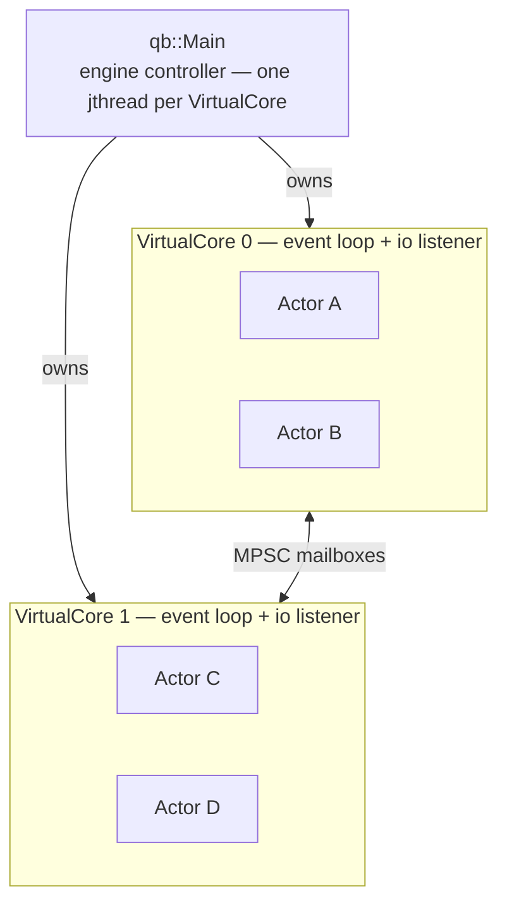

# qb-core: the actor engine

> **Audience:** Adopter · **Status:** stable · **Verified-against:** qb 3.0.0 (C++20 default, C++23 supported)

`qb-core` is the C++20-first actor runtime layered on `qb-io`: it owns the `qb::Main` engine, the per-thread `qb::VirtualCore` workers, the `qb::Actor` base class, and the event-passing layer that connects them.

**Prerequisites:** [The actor model](../2_core_concepts/actor_model.md), [The event system](../2_core_concepts/event_system.md), [qb-io module overview](../3_qb_io/README.md) — **See also:** [Core and IO integration](../5_core_io_integration/README.md), [Patterns cookbook](../6_guides/patterns_cookbook.md)

## Summary

`qb-core` brings the actor model to the framework. An actor is an isolated object with a unique
`qb::ActorId` that owns private state and communicates only by passing events. Each actor lives on
exactly one `qb::VirtualCore` worker thread for its whole lifetime and processes its messages one at
a time, so actor code is single-threaded by construction and needs no locks for its own state.
`qb::Main` configures the cores, spawns one `std::jthread` per `VirtualCore`, places actors onto
those workers, and drives the event loops until shutdown.

This section documents that runtime: how to write an actor, how messages move between actors within
and across cores, how the engine starts, stops, and pins threads, and how to compose the primitives
into recurring designs.

## Architecture at a glance

Key design points, each documented on the linked page:

- Each `VirtualCore` runs its own `qb::io::async::listener` event loop, so actors can mix
  event handlers and async I/O on the same thread — see [the engine](./engine.md).
- An actor never migrates between cores; its `_alive` flag is single-writer/single-reader on one
  thread and needs no atomic — see [writing actors](./actor.md).
- Actors on the **same** core exchange events through the core's local pipe (a per-destination-core
  buffer); actors on **different** cores exchange them through per-core lock-free MPSC mailboxes —
  see [messaging](./messaging.md).
- Actors may run C++20 coroutines through `spawn` (or detached via `spawn_detached`), returning results to themselves through a
  capture-by-value `qb::CoroContext` — see [actor patterns](./patterns.md) and
  [qb-io coroutines](../3_qb_io/coroutines.md).

## Pages in this section

| Page | What it covers |
|---|---|
| [qb-core features and capabilities](./features.md) | A catalog of the runtime's capabilities — actor lifecycle, the event system, multicore scheduling, coroutine support, and shared utilities — each linked to its in-depth page. |
| [Writing actors with `qb::Actor`](./actor.md) | Defining, initializing, and tearing down an actor; handling events; the `no_default_events` tag; periodic work via `ICallback`; and per-core services with `qb::ServiceActor`. |
| [Event messaging between actors](./messaging.md) | How `push`, `send`, `reply`, `forward`, and `broadcast` differ in delivery semantics and ordering, and how events move through the per-destination-core pipe and per-core mailbox within and across cores. |
| [The engine: `qb::Main` and `VirtualCore`](./engine.md) | Engine startup and shutdown, the `CoreInitializer` configuration step, CPU affinity, the `VirtualCore` loop, inter-core flushing, signal handling, and the stop-token cancellation path. |
| [Actor patterns](./patterns.md) | Composing the `Actor` primitives into recurring designs: finite state machines, service registries, publish/subscribe, request/response with timeouts, supervision, referenced actors with `RefActorHandle`, runtime dependency resolution with `require`, and coroutine flows. |
| [Interaction patterns library](./patterns_library.md) | The header-only toolkit that packages those designs as ready-made coroutine primitives — `qb::ask`/`answer`, scatter-gather (`ask_all`/`ask_any`/`ask_quorum`), discovery (`ping`/`require`), `run_saga`, resilience (`ask_retry`/`CircuitBreaker`/`rate_limiter`/`bulkhead`), `ask_stream`, `PubSub`, `Supervisor`, `WorkerPool`, `answer_idempotent`, and `batcher`. |

## Suggested reading order

1. **[Features and capabilities](./features.md)** — survey what the runtime provides before going deep.
2. **[Writing actors](./actor.md)** → **[Event messaging](./messaging.md)** — the two pages that
   teach the day-to-day API: defining an actor and getting events between actors.
3. **[The engine](./engine.md)** — how `qb::Main` brings cores up, schedules work, and shuts down,
   so you understand the runtime your actors execute on.
4. **[Actor patterns](./patterns.md)** — practical ways to structure application logic once the
   fundamentals are clear.
5. **[Interaction patterns library](./patterns_library.md)** — the ready-made coroutine primitives
   (ask, scatter-gather, saga, resilience, supervision, …) that implement those patterns for you.

## See also

- [Core and IO integration](../5_core_io_integration/README.md) — how an actor drives `qb-io`
  sockets, sessions, and protocols on its own `VirtualCore` listener.
- [Patterns cookbook](../6_guides/patterns_cookbook.md) — task-oriented recipes that combine the
  primitives from this section.
- [The actor model](../2_core_concepts/actor_model.md) and
  [The event system](../2_core_concepts/event_system.md) — the conceptual background this section
  builds on.

**(Next:** ensure you have read the [qb-io module overview](../3_qb_io/README.md) — `qb-core` builds
on it — then continue to [Core and IO integration](../5_core_io_integration/README.md).)**
