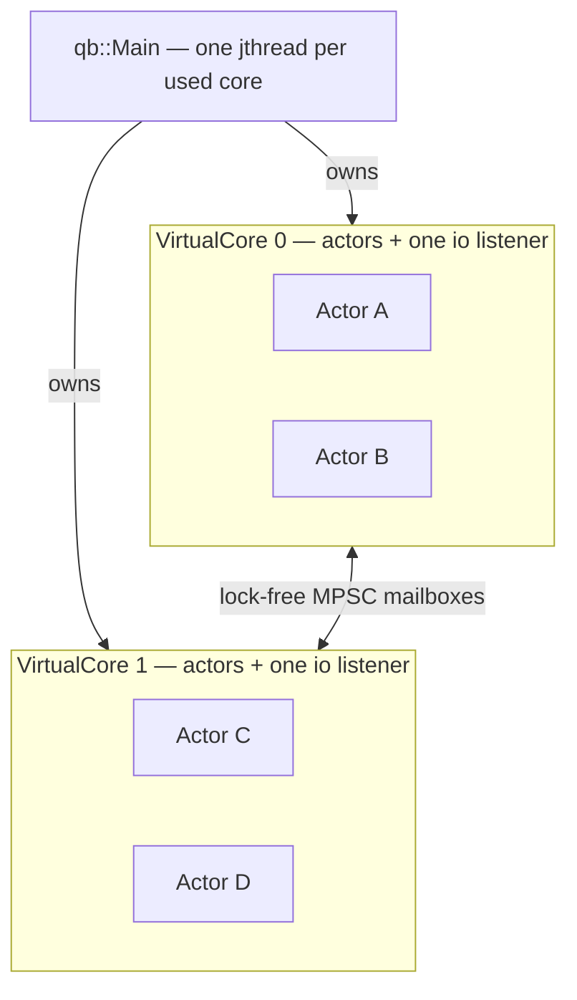

# qb-core: the actor engine

> **Audience:** Adopter · **Status:** stable · **Verified-against:** qb 3.1.0 (C++20 default, C++23 supported) — 60487ee7

`qb-core` is the actor runtime layered on `qb-io`, and it is small: one base class, one engine, one address type, one buffer — and one decision that everything else in this section follows from.

**Prerequisites:** [The actor model](../2_core_concepts/actor_model.md), [The event system](../2_core_concepts/event_system.md), [qb-io overview](../3_qb_io/README.md) — **See also:** [Core and IO integration](../5_core_io_integration/README.md), [Core invariants](../7_reference/core_invariants.md)

## The decision the whole tier descends from

An `ActorId` is `{ServiceId, CoreId}` packed into 32 bits, and **the core half is not metadata — it is the routing decision.** Every send resolves the destination core, then appends raw bytes to a buffer dedicated to that core. Nothing ever looks an actor up by identity across a thread boundary.

Because actors are thread-affine, `VirtualCore::_handler` — a `thread_local` pointer to "the core running on this thread" — is always the right core, so almost every `qb::Actor` member is a one-line forward through it and **the actor state path carries no lock, no atomic and no fence.** `_alive` is a plain `bool` on purpose.

That buys a message path with no synchronisation on it at all, and a model small enough to hold: *one thread owns everything it can see; to reach anything else, send a message.* What it costs is four things, none of which produces a compile error, and all four are why this section exists:

| It costs you | Where it is documented |
|---|---|
| An event is `memcpy`-relocated — by pipe growth or compaction, by `reply`/`forward`, and again on the cross-core hop — and its source destructor never runs, so a payload must be trivially **relocatable**, not merely copyable. A same-core `push` is no exception, and C++20 has no trait for that. | [messaging.md](./messaging.md#payloads-must-be-trivially-relocatable-not-merely-copyable) |
| The reference `push` returns dies at the **next** push to the same destination core, not at end of scope — and in-place compaction makes that invisible to every sanitizer. | [messaging.md](./messaging.md#the-reference-push-returns-dies-at-the-next-push-to-that-core) |
| Blocking the calling thread inside a handler freezes every actor on that core, with no diagnostic. | [async_in_actors.md](../5_core_io_integration/async_in_actors.md#the-two-call-chains) |
| The runtime allocates in proportion to the square of the core count and never shrinks — 22.5 MiB at rest on 8 cores. | [buffers.md](../0_foundations/buffers.md#memory-it-grows-and-it-does-not-come-back) |

## Pages in this section

| Page | Role | What it owns |
|---|---|---|
| [Features and capabilities](./features.md) | survey | A one-line entry per capability, each linked to its owning page. Read it to find out *where* something lives. |
| [Writing actors](./actor.md) | narrative | Identity, the life of a `qb::Actor` from `addActor` through an `onInit()` that may suspend to a `kill()` that flags rather than destroys; the *Activating* phase; `qb::no_default_events`; `qb::ICallback` ticks; `qb::ServiceActor<Tag>` and `getService<T>()`; `qb::ActorHandle<T>` (alias `RefActorHandle<T>`); `spawn` versus `spawn_detached` and what a kill does to a parked coroutine. |
| [Inter-actor messaging](./messaging.md) | narrative | The `qb::ActorId` as the route; one event traced core A → core B; `push` versus `send` as one mechanism; `reply`, `forward` and `broadcast`; the relocation rule; the reference-invalidation rule; the size ceiling; ordering. |
| [The engine](./engine.md) | narrative | `qb::Main`, `qb::VirtualCore`, `CoreInitializer`, the eight-step loop pass, latency and affinity, the startup barrier and its error codes, backpressure, and the shutdown drain. |
| [Actor patterns](./patterns.md) | reference | The *shapes* the engine supports and why they work: state machines, service registries, publish/subscribe, request/response, supervision, referenced actors, discovery, coroutine flows. |
| [Interaction patterns library](./patterns_library.md) | catalogue | What qb ships **pre-built** for those shapes: `qb::ask`/`answer`, scatter-gather (`ask_all`/`ask_any`/`ask_quorum`), discovery (`ping`/`require`), `run_saga`, resilience (`ask_retry`/`CircuitBreaker`/`rate_limiter`/`bulkhead`), `ask_stream`, `PubSub`, `Supervisor`, `WorkerPool`, `answer_idempotent`, `batcher`. |

Those last two sit beside [the patterns cookbook](../6_guides/patterns_cookbook.md), which is task-shaped: *reference* (why a shape works) → *catalogue* (what is already written) → *recipes* (how to assemble one for a job).

## Suggested reading order

1. **[Writing actors](./actor.md)** — the unit of computation, and its whole lifecycle.
2. **[Inter-actor messaging](./messaging.md)** — how two of them reach each other, and the three rules that path imposes.
3. **[The engine](./engine.md)** — the loop that runs both, and how it starts and stops.
4. **[Actor patterns](./patterns.md)** → **[the patterns library](./patterns_library.md)** — structure, once the fundamentals are clear.

[Features and capabilities](./features.md) is the index to jump into at any point.

## See also

- [Core and IO integration](../5_core_io_integration/README.md) — how an actor drives `qb-io` sockets, sessions and timers on its own `VirtualCore` listener.
- [Core invariants](../7_reference/core_invariants.md) — the same contracts in reference form, each cited to what enforces it.
- [The pipe](../0_foundations/buffers.md) — the single buffer type behind both the mailbox and every I/O stream.
- [Patterns cookbook](../6_guides/patterns_cookbook.md) — task-oriented recipes built from these primitives.

**(Next:** [Core and IO integration](../5_core_io_integration/README.md), where actors meet the event loop.)**
