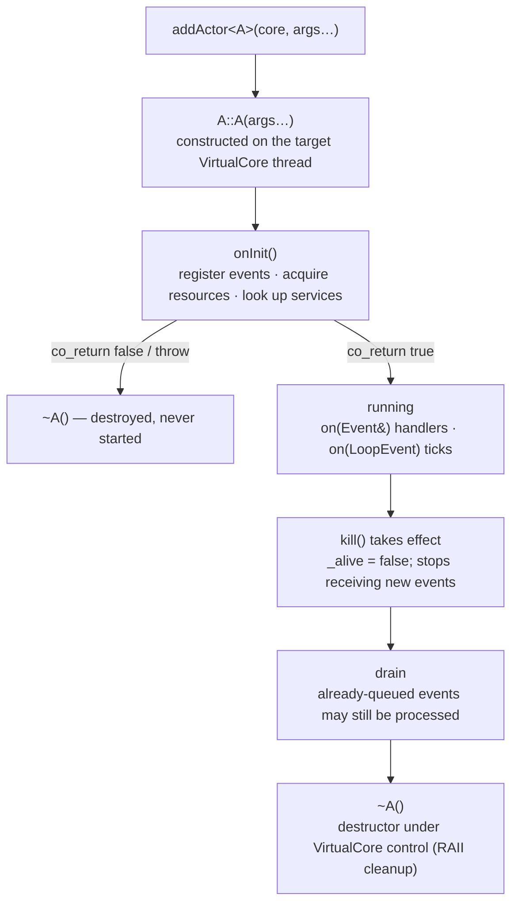

# Writing actors with qb::Actor

> **Audience:** Adopter · **Status:** stable · **Verified-against:** qb 3.0.0 (C++20 default, C++23 supported)

How to define an actor, initialize it, handle events, send messages, manage its lifecycle, run periodic work, and expose it as a per-core service.

**Prerequisites:** [The actor model](../2_core_concepts/actor_model.md), [The event system](../2_core_concepts/event_system.md) — **See also:** [Event messaging](./messaging.md), [The engine: Main and VirtualCore](./engine.md), [Actor patterns](./patterns.md)

`qb::Actor` (`qb/core/Actor.h`) is the base class for every actor in the framework. A derived
actor owns private state, subscribes to event types, reacts to messages one at a time on its
owning `VirtualCore` thread, and follows a defined lifecycle. This page covers the parts of the
`Actor` API you use to write application code: `onInit`, event handlers, the send primitives
(`push`, `send`, `broadcast`, `reply`, `forward`), `kill` and the lifecycle, `qb::ServiceActor`,
and periodic work through `qb::ICallback`.

## Concepts

An actor is created on exactly one `VirtualCore` worker thread and never migrates. Because the
runtime delivers events to an actor one at a time on that thread, an actor's own members need no
locks; this is the single-writer invariant that the framework's [threading
model](../2_core_concepts/threading_model.md) rests on. The defaults that follow from this — `kill()`
only flags the actor, the send primitives are `noexcept`, `time()` is cached per turn — are
properties of that model, not incidental choices.

Three header types anchor this page:

- `qb::Actor` — the base class. Non-copyable (derives from `qb::nocopy`). Construction must happen
  on a `VirtualCore` worker thread; see [the engine page](./engine.md) for how `addActor` arranges
  that.
- `qb::ICallback` (`qb/core/ICallback.h`) — a mixin granting one `on(qb::LoopEvent const&)` tick per event-loop
  iteration.
- `qb::ServiceActor<Tag>` — a singleton-per-core actor reachable by type through `getService<T>()`.

## Defining an actor

### Minimal actor

An actor subclasses `qb::Actor`, registers the event types it handles in `onInit()`, and provides a
matching `on()` method for each.

```cpp
// src: derived from examples/core/example4_lifecycle.cpp
#include <qb/actor.h>
#include <qb/io.h>

struct WorkEvent : qb::Event {
    int value;
    explicit WorkEvent(int v) : value(v) {}
};

class MyWorker : public qb::Actor {
public:
    qb::io::async::task<bool> onInit() override {
        registerEvent<WorkEvent>(*this);     // subscribe to WorkEvent
        registerEvent<qb::KillEvent>(*this); // graceful shutdown
        co_return true;                      // actor is ready
    }

    void on(WorkEvent const &ev) {
        qb::io::cout() << "got " << ev.value << '\n';
    }

    void on(qb::KillEvent const &) { kill(); }
};
```

Prefer calling `registerEvent<T>(*this)` from `onInit()`; constructor-body registration also works
(the id is assigned in the initializer list before the body runs). Registering an event type requires
a public `on(T const &)` or `on(T &)` method on the actor; the framework dispatches by event type.

### State encapsulation

Actor members are ordinary C++ members. The runtime guarantees that handlers on one actor run
sequentially on one thread, so self-state needs no synchronization.

```cpp
class StatefulActor : public qb::Actor {
    int                _counter = 0;
    std::string        _name;
    std::vector<float> _history;
public:
    // handlers mutate these freely; no mutex required
};
```

### Constructor parameters

Configuration flows through the actor's constructor. `Main::addActor<A>(core, args...)` forwards
`args...` to `A`'s constructor on the target core.

```cpp
class ConfiguredActor : public qb::Actor {
    const std::string _config_path;
    int               _initial_value;
public:
    ConfiguredActor(std::string path, int val)
        : _config_path(std::move(path)), _initial_value(val) {}
    // ...
};

// In main():
engine.addActor<ConfiguredActor>(0, "/etc/app.cfg", 42);
```

String literals passed to `addActor` are converted to `std::string` before storage; other arguments
are decayed and stored by value. See [The engine page](./engine.md) for `addActor` and the
`builder()` form.

### Lightweight actors: no_default_events

The default `Actor` constructor subscribes the actor to five system events at construction time:
`KillEvent`, `SignalEvent`, `UnregisterCallbackEvent`, `PingEvent`, and `RequireEvent`
(`src/qb/core/Actor.cpp`). For pools of short-lived actors where that bookkeeping is measurable
overhead, pass `qb::no_default_events` to the base constructor to skip all five.

```cpp
class ComputeTask : public qb::Actor {
public:
    ComputeTask() : qb::Actor(qb::no_default_events) {}

    qb::io::async::task<bool> onInit() override {
        registerEvent<InputEvent>(*this);
        registerEvent<qb::KillEvent>(*this); // re-subscribe — see warning below
        co_return true;
    }

    void on(InputEvent const &ev) {
        push<ResultEvent>(ev.getSource(), compute(ev.data));
        kill();
    }

    void on(qb::KillEvent const &) { kill(); }
};
```

> **Warning:** With `qb::no_default_events`, the actor does **not** respond to `KillEvent`,
> `SignalEvent`, `PingEvent`, `UnregisterCallbackEvent`, or `RequireEvent` unless you re-register them in `onInit()`.
> Register at least `KillEvent` so the actor terminates on `Main::stop()`.

## The actor lifecycle



### onInit: the initialization checkpoint

`onInit()` runs once, after the actor is constructed and has been assigned its `ActorId`, and before
it processes any business event. It is an **async coroutine** — `qb::io::async::task<bool>` — so it
may `co_await` (sleep, `qb::ask` a peer for its config, run a pattern) while the owning core keeps
serving its other actors. `co_return true` activates the actor; `co_return false` (or an uncaught
exception) aborts registration and destroys the actor immediately (it is never started). The common
case needs no `co_await` and simply `co_return`s — it completes synchronously and pays none of the
suspended-init machinery.

While a suspended `onInit()` is in flight the actor is **Activating**: inbound *unicast business*
events are stashed and replayed FIFO once it becomes active (broadcasts and `KillEvent` still pass
through, so a kill during init unwinds the coroutine cleanly), and the wait is bounded by a
configurable activation deadline (`qb::VirtualCore::activation_deadline_ns`, default 5 s) so a mutual
or stuck init can never deadlock. Use `context()` for a cancellation-aware context
(`co_await context().sleep(...)`) so a kill during init throws `cancelled_error` and unwinds it.
`is_active()` (vs `is_alive()`) reports whether activation has completed.

```cpp
qb::io::async::task<bool> onInit() override {
    // Register every event type this actor will handle.
    registerEvent<DataEvent>(*this);
    registerEvent<QueryEvent>(*this);
    registerEvent<qb::KillEvent>(*this);

    // Acquire resources; fail startup if a precondition is not met.
    auto *logger = getService<LoggerService>();  // nullptr if not on this core
    if (!logger)
        co_return false;  // actor is destroyed, not started

    _logger = logger;
    co_return true;
}
```

Prefer `onInit()` for calling `registerEvent<T>()`; constructor-body registration also works (the id
is assigned in the initializer list before the body runs), but `onInit()` keeps everything in one
place. Use `getService<T>()` to confirm a service is actually
present on this core: `getServiceId<Tag>(core)` only computes the deterministic id for the tag and
never reports whether such a service is registered.

### Event handlers

For each registered event type, provide a public `on()` method. Take the event by `const &` for a
read-only handler; take it by non-const `&` when you intend to `reply()` or `forward()` it (those
methods consume and reuse the received object).

```cpp
// Read-only handler.
void on(DataEvent const &ev) {
    process(ev.payload);
}

// Mutable handler — required for reply() / forward().
void on(QueryEvent &ev) {
    ev.result = lookup(ev.key);
    reply(ev);   // sends ev back to its source
}
```

The source of any received event is available through `ev.getSource()`. See [Event
messaging](./messaging.md) for the full event API.

### Graceful shutdown

The base `Actor::on(KillEvent const &)` already calls `kill()`. It is not virtual; declare
your own `on(qb::KillEvent const &)` only when you need cleanup that RAII does not cover. Your
handler hides the base one by name (do not write `override`), and must finish by calling
`kill()`.

```cpp
void on(qb::KillEvent const &) {
    // Optional: notify peers or flush state before terminating.
    push<ShutdownNotice>(_manager_id, id());
    kill();  // mandatory — marks the actor for removal
}
```

### kill and is_alive

`kill()` is declared `void kill() const noexcept`. It only *flags* the actor: it sets the internal
`_alive` flag to false and asks the `VirtualCore` to remove the actor. The actor stops receiving new
events, but events already in its queue may still be delivered, and `~Actor()` runs later under
`VirtualCore` control — not synchronously inside `kill()`.

`is_alive()` returns `true` until that removal has taken effect. Because `kill()` is `const`, it is
callable from any handler, including those that receive the event by const reference.

### Destructor

The destructor runs after `kill()` has taken effect and the actor has been removed from its
`VirtualCore`. RAII members are released here.

```cpp
~MyActor() override {
    // RAII members (files, connections) are released here.
    // Do NOT send events from the destructor.
}
```

## Accessors

| Method | Returns | Notes |
|---|---|---|
| `id()` | `qb::ActorId` | This actor's unique system-wide id. |
| `getIndex()` | `qb::CoreId` | The `VirtualCore` this actor runs on. |
| `getName()` | `std::string_view` | Class name from `typeid`; demangled on GCC and Clang, raw on other compilers. |
| `getCoreSet()` | `const qb::CoreIdSet &` | Cores the owning `VirtualCore` can reach. |
| `time()` | `uint64_t` | Cached nanosecond timestamp; see below. |
| `is_alive()` | `bool` | True until `kill()` takes effect. |

`time()` returns a `uint64_t` nanosecond value that the `VirtualCore` refreshes once per loop
iteration. Every call within a single handler or `on(qb::LoopEvent const&)` invocation returns the *same* value.
For a continuously updating, high-precision timestamp, use `qb::unix_nanos(qb::wall_now())` from
`<qb/system/time.h>` (see the canonical time vocabulary in [qb-io
utilities](../3_qb_io/utilities.md)).

## Sending events

All of these methods set this actor as the event's source. The send primitives — `push`, `send`, and
`broadcast` — are `noexcept`. A handler does not need to be aware that delivery may cross cores; the
runtime routes the event.

> **Warning:** Because `push`, `send`, and `broadcast` are `noexcept`, an allocation failure while
> growing a pipe buffer or constructing an event (for example, under OOM) cannot be reported and
> calls `std::terminate()`. Keep events small and allocation-light. The full contract lives on
> `qb::Pipe::push`.

### push: ordered delivery (default)

`push<E>(dest, args...)` constructs an event of type `E`, queues it for ordered delivery, and returns
a mutable reference to it so you can finish populating it before it is sent. Events pushed from the
same source to the same destination are delivered in push order. `push` supports events with
non-trivially-destructible members (for example `std::vector`, or a payload held behind a
`std::shared_ptr`).

```cpp
push<DataEvent>(target_id, value, label);

auto &ev = push<BatchEvent>(target_id);
ev.items.push_back(item1);   // mutate the event before it is sent
```

Do not hold the returned reference beyond the current scope; the framework owns the event after the
turn ends.

> **Every event member must be trivially relocatable — no pointer into itself.** The runtime moves
> events with raw `memcpy`: the source pipe relocates whatever it already holds when it grows,
> `reply`/`forward` byte-recycle the event, and a cross-core hop copies it twice more. This applies
> to a same-core `push` as much as to a cross-core one. A by-value `std::string` is therefore not
> valid in an event on any path — a short one points into its own inline buffer on libstdc++. Use
> `qb::string<N>` for inline text, or box the data behind a `std::shared_ptr` / `std::unique_ptr`.
> The rule, and the limits of the debug-build check that catches part of it, are detailed in
> [Event messaging](./messaging.md#push--ordered-the-default).

### send: unordered, trivially destructible events

`send<E>(dest, args...)` delivers without an ordering guarantee, even to the same destination from
the same source. `E` must be trivially destructible (POD-like members, or `qb::string<N>`; not
`std::string` or `std::vector`). Prefer `push` unless you have measured a need and ordering does not
matter.

```cpp
// FireForgetSignal must be trivially destructible.
send<FireForgetSignal>(monitor_id);
```

### broadcast: every actor on every core

`broadcast<E>(args...)` sends one event to every actor on every core. To target a single core, push
to a `qb::BroadcastId(core_id)` instead. Because `broadcast` fans out via `send` on every core, the
event **should be trivially destructible** — not because delivery leaks it (a delivered event is
destroyed exactly once, by the receiving core), but because the requirement guards the **drop** path:
a `qb::EventQOS0` broadcast is best-effort, so a full peer mailbox makes the flush discard it
*without* disposing it, and that is where a heap-owning member leaks. Keep bulk data behind a
`std::shared_ptr` and prefer deriving from `qb::EventQOS0` so the requirement is caught at compile
time.

```cpp
broadcast<SystemAlertEvent>("disk full");
```

### reply and forward: reuse a received event

`reply(event)` swaps the event's destination and source and sends it back to the original sender.
`forward(dest, event)` sends the same event to a new destination while preserving its original
source. Both consume the received object, so the handler must take the event by non-const reference,
and after the call the event must not be used again.

```cpp
void on(RequestEvent &req) {
    req.result = compute(req.input);
    reply(req);                  // back to the sender; dest/source swapped
}

void on(WorkOrder &order) {
    forward(_worker_id, order);  // re-route; original source preserved
}
```

> **Warning:** Broadcast events cannot be replied to or forwarded; the framework logs and drops such
> attempts.

### to: chained sends to one destination

`to(dest)` returns an `EventBuilder` whose `push<E>(...)` calls chain. Use it to send several ordered
events to the same destination without repeating the lookup.

```cpp
to(stats_id)
    .push<CountEvent>("logins")
    .push<TimerEvent>("session");
```

### getPipe: low-level and pre-allocated sends

`getPipe(dest)` returns the `qb::Pipe` to a destination. With `Pipe::allocated_push<E>(hint, ...)`
you can pre-size the buffer when carrying a large payload. See [Event messaging](./messaging.md) for
the pipe API.

```cpp
auto blob = std::make_shared<std::vector<char>>(256 * 1024);
qb::Pipe pipe = getPipe(processor_id);
// The hint is the EXTRA bytes reserved AFTER the event; the framework adds
// sizeof(BlobEvent) itself. The blob is heap-owned, so the event carries only the
// shared_ptr and needs no trailing bytes at all — pass 0, never blob->size()
// (that would reserve 256 KiB and blow past the ~64 KiB cross-core ceiling).
pipe.allocated_push<BlobEvent>(0, blob);
```

## Periodic work: qb::ICallback

An actor that needs to run code once per event-loop iteration also inherits `qb::ICallback` and
overrides `on(qb::LoopEvent const&)`. Activate it by calling `registerCallback(*this)` from `onInit()`, and stop
it with `unregisterCallback()`. The runtime calls `on(qb::LoopEvent const&)` once per loop iteration, after the
core has flushed its outgoing pipes and dispatched that iteration's received events; events a callback
pushes are flushed on the next iteration. The `qb::LoopEvent` carries per-loop context (`now`, `iteration`).

```cpp
// src: derived from examples/core/example4_lifecycle.cpp
#include <qb/actor.h>
#include <qb/icallback.h>
#include <qb/io.h>

class PollingActor : public qb::Actor, public qb::ICallback {
    int _poll_count = 0;
public:
    qb::io::async::task<bool> onInit() override {
        registerEvent<qb::KillEvent>(*this);
        registerCallback(*this);   // activate the per-iteration tick
        co_return true;
    }

    void on(qb::LoopEvent const &) override {
        ++_poll_count;
        if (pollExternalSystem())
            push<DataReadyEvent>(id());
        if (_poll_count > 1000) {
            unregisterCallback();  // deactivate
            kill();
        }
    }

    void on(qb::KillEvent const &) { kill(); }
};
```

> **Warning:** `on(qb::LoopEvent const&)` runs on the `VirtualCore` event-loop thread. It must be fast and
> non-blocking — no mutex waits, no synchronous I/O, no `sleep`. Blocking it stalls the whole core
> and every actor on it. The callback rate depends on the core's load and its
> `CoreInitializer::setLatency()` setting.

## Service actors: qb::ServiceActor

A `qb::ServiceActor<Tag>` is a singleton per `VirtualCore` per `Tag`: at most one instance of that
type runs on a given core, and any actor on that core can obtain a typed pointer to it through
`getService<T>()`. The `Tag` is an empty struct that makes the service type unique.

```cpp
// src: derived from qb/tests/core/system/actor/actor-add.cpp
#include <qb/actor.h>

struct LoggerTag {};  // unique tag for this service type

class LoggerService : public qb::ServiceActor<LoggerTag> {
public:
    qb::io::async::task<bool> onInit() override {
        registerEvent<qb::KillEvent>(*this);
        co_return true;
    }

    void on(qb::KillEvent const &) { kill(); }

    void log(std::string_view line) { /* ... */ }
};

class Worker : public qb::Actor {
    LoggerService *_logger = nullptr;
public:
    qb::io::async::task<bool> onInit() override {
        _logger = getService<LoggerService>();  // same core only
        if (!_logger)
            co_return false;                    // service not present on this core
        registerEvent<qb::KillEvent>(*this);
        co_return true;
    }

    void on(qb::KillEvent const &) { kill(); }
};
```

`getService<T>()` returns a raw pointer to the service on the **same** core, or `nullptr` if no such
service is registered there. Calling its methods directly bypasses the event queue, so reserve direct
calls for read-only or clearly safe operations; for everything else, send events to the service's
`id()`. To find the `ActorId` of a service on a specific core without dereferencing it, use
`getServiceId<Tag>(core_index)`, which returns an `ActorId`. Add a service to a core with
`addActor<LoggerService>(core)` before the worker; see [the engine page](./engine.md) for startup
ordering.

## Pitfalls

- **Registering events in the constructor.** Prefer `onInit()` for `registerEvent<T>()`;
  constructor-body registration also works (the id is assigned in the initializer list before the
  body runs), but `onInit()` keeps all subscriptions in one place.
- **Constructing an actor off-thread.** Actors must be created on a `VirtualCore` worker thread via
  `Main::core(idx).addActor<T>(...)` (or `addRefActor<T>()` from within an actor), never from the
  main thread or an arbitrary user thread. The constructors assert this in debug builds.
- **Forgetting to re-register `KillEvent` with `no_default_events`.** Such an actor ignores
  `Main::stop()` until you re-subscribe to `KillEvent` in `onInit()`.
- **Using a received event after `reply()` or `forward()`.** Both consume the event object; touching
  it afterward is a use-after-consume bug. Also: the handler must take the event by non-const
  reference, or `reply`/`forward` will not compile.
- **`send()` with a non-trivially-destructible event.** `send` requires `std::is_trivially_destructible`
  (compiler-enforced only for `qb::EventQOS0`); use `push` for events carrying a `std::vector` or a
  smart pointer. A by-value `std::string` belongs in neither — it is not trivially relocatable.
- **Treating `time()` as a live clock.** It is cached per loop iteration and is identical across one
  handler invocation. Use `qb::unix_nanos(qb::wall_now())` when you need a fresh reading.
- **Blocking inside `on(qb::LoopEvent const&)` or any handler.** One actor's handler thread serves every actor on
  its core. A blocking call there stalls the entire core.
- **Sending events from a destructor.** The actor is being torn down; do not push from `~Actor()`.

## See also

- [Event messaging](./messaging.md) — defining events, the full send and receive API, pipes.
- [The engine: Main and VirtualCore](./engine.md) — `addActor`, core configuration, startup and
  shutdown.
- [Actor patterns](./patterns.md) — referenced actors (`addRefActor` / `addRefHandle`), discovery
  (`require<T>()`), coroutines (`spawn` / `spawn_detached`), and supervision.
- [The actor model](../2_core_concepts/actor_model.md) and [the threading
  model](../2_core_concepts/threading_model.md) — the concepts the API rests on.
