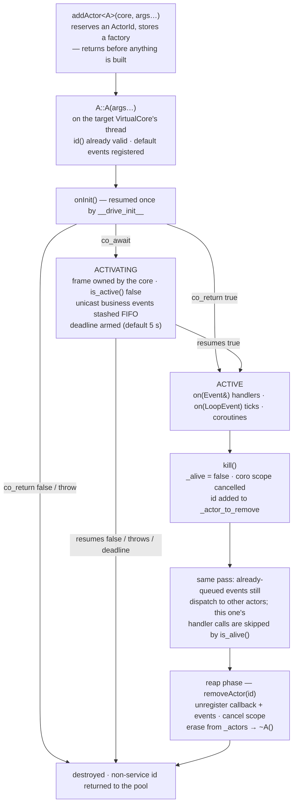

# Writing actors: identity, life, and death

> **Audience:** Adopter · **Status:** stable · **Verified-against:** qb 3.0.0 (C++20 default, C++23 supported) — 60487ee7

A `qb::Actor` is not an addressable object — it is an entry in one `VirtualCore`'s map, reached only by its `ActorId`. This page follows one actor from `addActor` through an `onInit()` that may suspend, through steady state, to a `kill()` that flags rather than destroys, and finally to a destructor that runs several steps later — plus what happens to a coroutine it spawned if the actor dies while that coroutine is parked.

**Prerequisites:** [The actor model](../2_core_concepts/actor_model.md) · [The event system](../2_core_concepts/event_system.md) — **See also:** [Inter-actor messaging](./messaging.md) · [The engine](./engine.md) · [Async in actors](../5_core_io_integration/async_in_actors.md) · [C++20 coroutines](../3_qb_io/coroutines.md) · [Core invariants](../7_reference/core_invariants.md)

## The smallest actor that works

```cpp
// src: derived from qb/tests/core/system/messaging/messaging-api.cpp (TestActorReceiver)
#include <qb/actor.h>
#include <qb/io.h>

struct WorkEvent : qb::Event {
    int value;
    explicit WorkEvent(int v) : value(v) {}
};

class MyWorker : public qb::Actor {
public:
    qb::io::async::task<bool> onInit() override {
        registerEvent<WorkEvent>(*this);      // subscribe
        registerEvent<qb::KillEvent>(*this);  // graceful shutdown
        co_return true;                       // the actor is ready
    }

    void on(WorkEvent const &ev) {
        qb::io::cout() << "got " << ev.value << '\n';
    }

    void on(qb::KillEvent const &) { kill(); }
};
```

Four things are already true of that class and worth stating before anything else:

- **It has an identity before it has a body.** `qb::Actor`'s default constructor draws the id in its member-initialiser list, so `id()` is already valid in *your* constructor's body (`src/qb/core/Actor.cpp:114-125`).
- **It is not copyable.** `Actor` derives from `qb::nocopy` (`src/qb/core/Actor.h:199`).
- **It lives on exactly one thread for its whole life** and never migrates, which is why none of its members needs a lock.
- **`onInit()` is a coroutine.** The declaration returns `qb::io::async::task<bool>`, so `co_await` is legal from the actor's first moment of life (`src/qb/core/Actor.h:354-357`). The common case never suspends and pays nothing for the option.

## Identity, and why nothing needs a lock

`id()` returns a `qb::ActorId`: `{ServiceId, CoreId}` in 32 bits, where the core half *is* the routing decision — [Inter-actor messaging](./messaging.md#the-address-is-the-route) owns that. What it buys the actor layer is this: because an actor never leaves its core, and because `VirtualCore::_handler` is a `thread_local` pointer to the core running on this thread, "the right core" is always already in a register. So the liveness flag is a plain `bool`:

```cpp
    mutable bool _alive = true;
```
<!-- src: qb/src/qb/core/Actor.h:229 -->

Single-writer, single-reader, both always on the one owning thread — remote senders enqueue a `KillEvent`, they never flip the flag. No atomic, no fence, no lock (`src/qb/core/Actor.h:207-228`). `mutable` is what lets `kill()` be `const`, so a handler that received its event by const reference can still terminate its actor. The activation flag `_activated` has the identical contract (`src/qb/core/Actor.h:230-247`).

**External code must not read `_alive`.** It is not synchronised, and a cross-thread read is a data race. To test whether some other actor is still there, use a `qb::ActorHandle<T>` or `is_actor_alive(id)` — both re-query the owning core.

| Accessor | Returns | Notes |
|---|---|---|
| `id()` | `qb::ActorId` | system-wide unique; valid from the constructor body onward |
| `getIndex()` | `qb::CoreId` | the `VirtualCore` hosting this actor |
| `getName()` | `std::string_view` | demangled class name on GCC/Clang, mangled elsewhere; the pointer is deliberately immortal (`src/qb/core/Actor.h:1994-2043`) |
| `getCoreSet()` | `const qb::CoreIdSet&` | every core the engine was started with |
| `time()` | `uint64_t` | nanoseconds since the epoch, **cached once per loop pass** |
| `now()` | `qb::wall_time` | the same cached instant as a `std::chrono` time point — prefer this (`src/qb/core/Actor.h:596`) |
| `is_alive()` | `bool` | `_alive` only; `true` until the reap |
| `is_active()` | `bool` | `_alive && _activated` — the phase oracle |
| `is_actor_alive(id)` | `bool` | same-core only; one hash lookup, no `dynamic_cast` |

`time()` does not move inside a handler. It is the `VirtualCore`'s per-pass timestamp, so `assert(t1 == time())` holds across any amount of work in one handler (`src/qb/core/Actor.h:571-588`). For a moving clock read `qb::unix_nanos(qb::wall_now())` from `<qb/system/time.h>`.

`is_actor_alive(id)` exists for bookkeeping that stores bare ids — a subscriber list, a routing table — and must drop entries whose actor is gone. It is **same-core by construction**: an actor map belongs to its own `VirtualCore` and is not synchronised, so `false` for a *remote* id is not evidence of anything. For cross-core liveness, ask (`co_await qb::ping(...)`) (`src/qb/core/Actor.h:931-952`).

## The life of an actor



### Construction happens on the worker, not where you asked for it

`Main::addActor` and `CoreInitializer::addActor` only *reserve* an id and store a factory — [the engine page](./engine.md#configuration-coreinitializer-and-what-addactor-returns) has that half. Your constructor runs later, on the target core's thread, and both `Actor` constructors assert it:

```cpp
Actor::Actor() noexcept
    : _id((assert(VirtualCore::_handler != nullptr
                  && "Actor must be constructed from within a VirtualCore worker thread "
```
<!-- src: qb/src/qb/core/Actor.cpp:114-119 -->

So construct actors only through `Main::addActor<T>(core, …)`, `Main::core(idx).addActor<T>(…)`, a `builder()`, or `addRefActor<T>()` from inside another actor on the same core. `new MyActor` on the main thread trips the assertion in a debug build and dereferences a null `_handler` in a release one.

The default constructor also subscribes to five system events — `KillEvent`, `SignalEvent`, `UnregisterCallbackEvent`, `PingEvent`, `RequireEvent` (`src/qb/core/Actor.cpp:120-124`). That is where the framework's own machinery comes from: `Main::stop()` reaches you through `SignalEvent`, `unregisterCallback()` through `UnregisterCallbackEvent`, and `co_await qb::ping/require` through the `PingEvent`/`RequireEvent` pair.

### `no_default_events` — and the one line you must not forget

For pools of short-lived actors where five router insertions per actor are measurable, pass the tag:

```cpp
class ComputeTask : public qb::Actor {
public:
    ComputeTask() : qb::Actor(qb::no_default_events) {}

    qb::io::async::task<bool> onInit() override {
        registerEvent<InputEvent>(*this);
        registerEvent<qb::SignalEvent>(*this); // THE one: Main::stop() and SIGINT/SIGTERM arrive as this
        registerEvent<qb::KillEvent>(*this);   // only for a peer that kills you by pushing one
        co_return true;
    }

    void on(InputEvent const &ev) {
        push<ResultEvent>(ev.getSource(), compute(ev.data));
        kill();
    }

    // BOTH must be declared here. Declaring any `on` in a derived class HIDES every base
    // overload of that name, and the router dispatches through `Derived::on(...)` — so
    // `registerEvent<qb::SignalEvent>(*this)` above does not compile without this line.
    void on(qb::KillEvent const &) { kill(); }
    void on(qb::SignalEvent const &) { kill(); }
};
```
<!-- src: qb/src/qb/core/Actor.h:293-306; qb/src/qb/core/Actor.cpp:139-144 -->

The tag constructor's body is empty on purpose (`src/qb/core/Actor.cpp:142-143`). **The line you must not forget is `SignalEvent`, not `KillEvent`** — the distinction is not pedantry, it is the difference between a program that stops and one that does not. `Main::stop()` sends nothing: it stores a signum and bumps a generation counter, and each `VirtualCore` then synthesises a `qb::SignalEvent` for the actors it owns (`src/qb/core/Main.cpp:455-463`, `src/qb/core/VirtualCore.cpp:677-681`). Nothing in the engine ever constructs a `qb::KillEvent`; that type is for a *peer* to kill you with. An actor holding only a `KillEvent` subscription therefore ignores `Main::stop()` and every signal, its core never empties, and `Main::join()` never returns — with no diagnostic. Register both if peers will also kill you directly. Pinned by `NoDefaultEvents.*` (`qb/tests/core/system/engine/no-default-events.cpp`), whose second case asserts the `KillEvent`-only actor really is unstoppable.

### `onInit()`: a coroutine from the first moment of life

`onInit()` runs once, after construction and id assignment, before any business event. Because it is a coroutine, setup that would otherwise need a state machine spread across callbacks reads as straight-line code:

```cpp
// src: derived from qb/tests/core/system/init/init-lifecycle.cpp (MultiSuspendInit)
// #include <qb/patterns.h> for qb::require; using namespace std::chrono_literals for 5ms/200ms
qb::io::async::task<bool> onInit() override {
    registerEvent<Tick>(*this);
    registerEvent<qb::KillEvent>(*this);

    co_await context().sleep(5ms);          // warm-up window
    auto peers = co_await qb::require<Peer>(context(), 200ms);  // task<std::vector<qb::ActorId>>
    if (peers.empty())
        co_return false;                    // give up: the actor is destroyed, never started

    _peer = peers.front();
    co_return true;                         // active from here
}
```

`co_return true` activates the actor; `co_return false` **or an uncaught exception** fails it, and the actor is removed without ever processing a message (`src/qb/core/VirtualCore.cpp:487-514`). Both are pinned, on the synchronous and the suspended path alike, by `InitLifecycle.SyncOnInitReturnsFalseWithoutCoAwait`, `…SyncOnInitThrowsWithoutCoAwait`, `…AsyncInitFailureRemovesActor` and `…ExceptionAfterSuspensionFailsInit` (`qb/tests/core/system/init/init-lifecycle.cpp`).

Use `context()` rather than a bare `qb::io::async::sleep`. It returns a `qb::ScopedCoroContext` carrying this actor's cancellation scope, so a kill during init throws `cancelled_error` and unwinds the frame cleanly instead of leaving it parked (`src/qb/core/Actor.h:1246-1262`, `:1767-1771`).

**The common case costs nothing.** `__drive_init__` resumes the coroutine exactly once. If it runs to `co_return` without suspending — no `co_await` anywhere — the verdict is read immediately and the frame is freed; none of the activation machinery below is entered (`src/qb/core/VirtualCore.cpp:488-514`).

### Activating: what is deferred, what is withheld, what is not

If `onInit()` *does* suspend, the actor enters the **Activating** phase. Its still-live frame is moved into the core's `_activating` map, `_activated` flips to `false`, and a deadline is armed (`src/qb/core/VirtualCore.cpp:516-531`).

```cpp
actor._activated = false;
const auto now   = static_cast<std::uint64_t>(qb::unix_nanos(qb::wall_now()));
Activation act;
act.init        = std::move(init);
act.deadline_ns = activation_deadline_ns ? now + activation_deadline_ns : 0; // 0 ⇒ no deadline
```
<!-- src: qb/src/qb/core/VirtualCore.cpp:524-528 -->

`qb::VirtualCore::activation_deadline_ns` defaults to **5 s** and is a public knob you set *before* `Main::start()`; `0` disables the bound, which also removes the mutual-init deadlock guard (`src/qb/core/VirtualCore.h:345-353`). When it expires the core cancels the actor's coroutine scope so the init unwinds, and the activation is finalised as a failure on a later pass (`src/qb/core/VirtualCore.cpp:574-583`).

While Activating, a unicast **business** event addressed to this actor is byte-copied into a per-actor FIFO stash and replayed in order once it activates — deferred, not dropped. The stash is capped at 4096 events; overflowing it drops the event, disposes its payload and forces the activation to fail on the next pump rather than letting a wedged init exhaust the core's memory (`src/qb/core/VirtualCore.h:342`; `src/qb/core/VirtualCore.cpp:538-560`).

Three things bypass the gate entirely (`src/qb/core/VirtualCore.cpp:159-199`):

- **broadcasts**, so a system-wide notice still reaches an Activating actor;
- **any `KillEvent`**, so an Activating actor stays killable and its in-flight `onInit()` can be unwound;
- **the reply to a `qb::ask` this actor issued from inside its own `onInit()`** — stashing that would deadlock the init on its own reply. The gate recognises it without RTTI, because every correlated reply derives from `qb::CorrelatedEvent` as its first base, so `correlation_id` sits at a fixed offset (`src/qb/core/Event.h:571-583`).

The surfaces that observe the phase do **not** all behave the same, and that is deliberate:

| Surface | Consults | While the target is *Activating* |
|---|---|---|
| `VirtualCore::findActor<T>(id)` | `is_active()` | **withheld** — `nullptr` |
| `ActorHandle<T>::get()` / `operator->` / `operator*` / `ready()` / `operator bool` | `findActor` | **withheld** — `nullptr` / `false` |
| `is_actor_alive(id)` | `is_active()` | **withheld** — `false` |
| `is_active()` | `_alive && _activated` | `false` |
| `is_alive()` | `_alive` only | `true` — it is not a phase check |
| `getService<T>()` | *nothing* | **handed out**, by design |
| inbound-event dispatch gate | `VirtualCore::_activating` membership | **deferred**, not withheld |
| `ActorHandle<T>::id()`, `push` / `send` / `broadcast` / `to()` | *nothing* | usable immediately |

<!-- src: qb/src/qb/core/Actor.h:641-676 -->

A `false` from any of the gated ones is therefore not, on its own, evidence that the actor is gone. Over a `co_await` in a peer's `onInit()` it may simply be early.

### Steady state: handlers

For every registered type, provide a public `on()`. Take the event by `const&` to read it; take it by non-const `&` when you intend to `reply()` or `forward()`, because both mutate it in place and consume it.

```cpp
void on(DataEvent const &ev) { process(ev.payload); }

void on(QueryEvent &ev) {              // non-const: reply() reuses the object
    ev.result = lookup(ev.key);
    reply(ev);                         // ev is consumed here
}
```

`ev.getSource()` is the sender; `ev.getDestination()` is the id it was routed to. Dispatch is by exact type: a handler for a base class is **not** called for a derived event, because the router keys on `type_id<E>()` of the type that was pushed.

> **The five built-in handlers are not `virtual`.** `Actor::on(KillEvent const&)`, `on(SignalEvent const&)`, `on(UnregisterCallbackEvent const&)`, `on(PingEvent const&)` and `on(RequireEvent&)` are plain members (`src/qb/core/Actor.h:412`, `:440`, `:451`, `:464`, `:473`) — the router dispatches through a per-handler-type trampoline, not a vtable, so it does not need them to be. Declaring your own therefore **hides** the base one by name; do not write `override`, which will not compile. If you replace `on(KillEvent const&)`, call `kill()` at the end of your body — the base version's whole job is that one call (`src/qb/core/Actor.cpp:168-171`). If you replace `on(SignalEvent const&)`, call `Actor::on(event)` explicitly for the terminal signals, or handle `SIGINT`/`SIGTERM` yourself.

```cpp
void on(qb::KillEvent const &) {              // no `override`
    push<ShutdownNotice>(_manager_id, id());  // last words
    kill();                                   // mandatory: nothing else marks the actor
}
```

`registerEvent<E>(*this)` is normally called from `onInit()`, but constructor-body registration works too (the id is already assigned) and so does registration at runtime from any handler. What `onInit()` uniquely offers is the failure path: `co_return false` aborts before the actor sees a single message. `unregisterEvent<E>(*this)` stops delivery of one type; `qb::Actor`'s removal from the router happens automatically at the reap (`src/qb/core/VirtualCore.h:929-945`; `src/qb/core/VirtualCore.cpp:131-133`).

### Steady state: sending

Every send primitive is a `const noexcept` member of `qb::Actor` and sets this actor as the source. [Inter-actor messaging](./messaging.md) owns all of them — their ordering, their lifetimes and the mechanism behind each; this is the map.

| Call | What it is for |
|---|---|
| `push<E>(dest, args…)` | the default: ordered per source → destination, any event type, returns `E&` so you can finish populating it |
| `to(dest)` → `EventBuilder` | several ordered pushes to one destination, chained |
| `getPipe(dest)` → `qb::Pipe` | the raw channel, plus `Pipe::allocated_push<E>(tail_bytes, …)` for an event with a trailing byte region |
| `send<E>(dest, args…)` | unordered; the drop path makes it a `qb::EventQOS0` primitive in practice |
| `broadcast<E>(args…)` | every actor on every core; `push<E>(qb::BroadcastId(core), …)` for one core, ordered |
| `reply(event)` / `forward(dest, event)` | reuse the event you are handling; the handler must take `E&` |

Three consequences you must know before writing the first `push`, each explained in full on that page:

- **The reference `push` returns dies at the next event queued to the same destination core** — not at end of scope. Compaction makes the failure invisible to every sanitizer.
- **Every event payload must be trivially *relocatable*.** The runtime moves events with `memcpy` and never runs the source destructor, so a by-value `std::string` is invalid on every path. Use `qb::string<N>`, or box the data behind a `std::shared_ptr` / `std::unique_ptr`.
- **The whole send path is `noexcept`.** A throwing event constructor, or a `std::bad_alloc` growing the buffer, calls `std::terminate()`.

### Periodic work: `qb::ICallback`

Inherit `qb::ICallback` alongside `qb::Actor`, override `on(qb::LoopEvent const&)`, and call `registerCallback(*this)` — normally from `onInit()`.

```cpp
// src: derived from qb/src/qb/core/ICallback.h (the HeartbeatActor example)
class HeartbeatActor : public qb::Actor, public qb::ICallback {
    int _tick = 0;
public:
    qb::io::async::task<bool> onInit() override {
        registerEvent<qb::KillEvent>(*this);
        registerCallback(*this);
        co_return true;
    }

    void on(qb::LoopEvent const &loop) override {
        if (++_tick >= 10) {
            unregisterCallback();
            kill();
        }
    }

    void on(qb::KillEvent const &) { kill(); }
};
```

The tick fires once per `VirtualCore` pass, **after** the core has flushed its outbound pipes and dispatched that pass's inbound events — so anything the tick pushes leaves the core on the *next* pass ([the loop pass](./engine.md#the-loop-pass)). `qb::LoopEvent` carries `now` (identical to `time()` for that pass) and a monotonic `iteration` counter; it is delivered by a direct virtual call, not routed, so it is neither pushed nor addressed (`src/qb/core/ICallback.h:65-80`).

> **The tick runs on the `VirtualCore` thread, like everything else.** It must be fast and non-blocking: no mutex wait, no synchronous I/O, no `sleep` (`src/qb/core/ICallback.h:163-169`). Its rate follows the core's load and its `CoreInitializer::setLatency` setting (`src/qb/core/ICallback.h:140-142`).

`unregisterCallback()` with no argument routes through a `UnregisterCallbackEvent` pushed to yourself, so it takes effect on a later pass; the typed `unregisterCallback(*this)` removes the entry immediately (`src/qb/core/Actor.cpp:235-238`; `src/qb/core/VirtualCore.cpp:955-958`, `:941-953`; `src/qb/core/VirtualCore.h:923-927`).

### `kill()` flags; the destructor runs later

```cpp
void
Actor::kill() const noexcept {
    _alive = false;
    __cancel_coro_scope__();
    VirtualCore::_handler->killActor(id());
}
```
<!-- src: qb/src/qb/core/Actor.cpp:282-290 -->

Three effects, none of which is destruction. The flag flips, the actor's coroutine cancellation scope is cancelled (a no-op if it never spawned a scoped coroutine), and the id joins `_actor_to_remove`. `killActor` is one set insertion (`src/qb/core/VirtualCore.cpp:937-940`).

What follows, in order, on the same pass:

1. **The actor stops being called.** It is still in the router's handler map, so events addressed to it are still copied and routed — but the dispatch trampoline checks `handler.is_alive()` first, so no handler runs ([dispatch-time liveness](./messaging.md#is_alive-is-checked-at-dispatch-not-at-enqueue)).
2. **Its `ICallback` tick is skipped** if it was killed earlier in the same pass (`src/qb/core/VirtualCore.cpp:728-729`).
3. **The reap phase destroys it**: `removeActor(id)` unregisters the callback, unsubscribes every event type, cancels the coroutine scope again as a catch-all, and erases the `unique_ptr` — which is where `~Actor()` finally runs (`src/qb/core/VirtualCore.cpp:879-922`).
4. **A non-service id goes back to the pool.** Service ids never do, so `ServiceIndex` stays stable for the life of the process (`src/qb/core/VirtualCore.cpp:916-920`).

`is_alive()` is `true` until step 3. Do not send events from `~Actor()`: the actor is mid-teardown and its id is about to be recycled.

There is exactly one case where destruction is *deferred past* the reap. If the actor is killed while its `onInit()` frame is still suspended, `removeActor` cancels the scope, records the id in `_dying_with_frame` and **returns without destroying anything** — the actor must outlive its own coroutine frame. Teardown completes on a later pass, once the frame reports `done()` (`src/qb/core/VirtualCore.cpp:879-895`, `:586-622`). Pinned by `InitLifecycle.KillDuringInitCancelsAndDestroysCleanly`.

## Children: `addRefActor` and `ActorHandle<T>`

`addRefActor<T>(args...)` creates an actor on the **same** core and returns a `qb::ActorHandle<T>` (`RefActorHandle<T>` is an alias; so is the method `addRefHandle<T>`, which differs only in being `[[nodiscard]]` — `addRefActor` deliberately is not, because creating a self-managing child you only ever talk to by events is a first-class use) (`src/qb/core/Actor.h:1122-1141`). The child manages its own lifecycle; the parent does not own it.

```cpp
// src: derived from qb/src/qb/core/Actor.h:1114-1118 (addRefActor's own example)
auto helper = addRefActor<HelperActor>(cfg);   // qb::ActorHandle<HelperActor>
push<TaskEvent>(helper.id(), task_data);        // always safe — stashed if it is still Activating
if (helper.ready())                             // sync-init child: ready at once
    helper->doSomething();
```

The handle never dangles. It stores the `ActorId` and resolves the pointer **on demand** through `VirtualCore::findActor<T>()`, which is phase-aware, so `get()` / `operator->` / `operator*` return `nullptr` while the child is Activating, after a failed init, and once it has been destroyed (`src/qb/core/VirtualCore.h:953-968`, `:724-743`).

| Member | Behaviour |
|---|---|
| `id()` | valid the instant `addRefActor` returns, even mid-activation — always safe to `push` to |
| `valid()` | the handle was constructed from a non-null actor |
| `get()` / `operator bool` / `ready()` | the pointer, or `nullptr`/`false` unless the actor is **active** |
| `operator->` / `operator*` | `get()` with a debug `assert` that it resolved |
| `ready_async(ctx, timeout = 5s)` | `co_await`-able poll; `true` once ready, `false` on timeout (`src/qb/core/Actor.h:1901-1912`) |

Two rules the type cannot enforce:

- **Only dereference from the owning core's thread.** `get()` reads the `thread_local` `VirtualCore::_handler`, which is null off any worker thread and points at the *wrong* core elsewhere, so it simply returns `nullptr` (`src/qb/core/VirtualCore.h:953-968`). There is no thread-identity check anywhere: what `operator->` and `operator*` carry is a generic non-null debug `assert` that also fires after the actor dies, and release builds carry nothing at all — so cross-thread misuse is a silent null dereference (`src/qb/core/Actor.h:1914-1928`).
- **Prefer `push(handle.id(), …)` over `handle->method()`.** A direct call bypasses the mailbox, the ordering guarantee and the one-event-at-a-time discipline the whole model rests on.

## Services: one per core, per tag

`qb::ServiceActor<Tag>` is a singleton per `VirtualCore` per `Tag`. The `Tag` must be a **complete** type — `struct MyTag {};` first, because `ServiceActor<struct MyTag>` only *declares* it and the index reaches `typeid(Tag)` (`src/qb/core/Actor.h:1784-1807`).

```cpp
// src: derived from qb/tests/core/system/actor/actor-add.cpp (TestServiceActor / CheckServiceActor)
struct LoggerTag {};

class LoggerService : public qb::ServiceActor<LoggerTag> {
public:
    qb::io::async::task<bool> onInit() override {
        registerEvent<qb::KillEvent>(*this);
        co_return true;
    }
    void on(qb::KillEvent const &) { kill(); }
    void log(std::string_view line) { /* … */ }
};

class Worker : public qb::Actor {
    LoggerService *_logger = nullptr;
public:
    qb::io::async::task<bool> onInit() override {
        _logger = getService<LoggerService>();   // same core only
        if (!_logger)
            co_return false;                     // no logger here: refuse to start
        registerEvent<qb::KillEvent>(*this);
        co_return true;
    }
    void on(qb::KillEvent const &) { kill(); }
};
```

`getServiceId<Tag>(core)` computes a service's deterministic `ActorId` on any core **without proving anything exists there** — it is pure arithmetic over the registered index. `getService<T>()` is the one that actually looks (`src/qb/core/VirtualCore.h:1009-1024`).

> **`getService<T>()` is deliberately not phase-gated, so a non-null pointer is not proof the service is usable.** It consults neither `is_active()` nor `is_alive()`. It hands the pointer back while the service's own async `onInit()` is still in flight, **and** after the service has been `kill()`ed but not yet reaped. That is exactly what lets a service look itself, or a peer service, up from inside its own `onInit()` — the common bootstrap pattern, and the reason the gate is absent rather than forgotten. The cost is on the caller: what you get back may be mid-init or dying. It matters most for the pattern the example above uses, caching the raw pointer as a member for the actor's lifetime. If you need an initialisation guarantee, *ask* the service — `push` an event, or `co_await qb::ask(...)` — instead of touching its state.
<!-- src: qb/src/qb/core/Actor.h:604-618; qb/src/qb/core/VirtualCore.h:745-768 -->

`actor-add.cpp` pins all three positions of that contract: `getService<TestServiceActor>()` is `nullptr` in the service's own constructor (it is not in `_actors` yet), is exactly `this` inside its `onInit()`, and is non-null to a peer on the same core (`qb/tests/core/system/actor/actor-add.cpp:69-104`).

## Coroutines, and what happens when the actor dies first

An actor drives a coroutine on its own core's loop with `spawn` (recommended) or `spawn_detached`. Both return immediately, and both are safe **only** under one rule.

### The rule is a lifetime rule

A coroutine's frame outlives the statement that created it. It does **not** outlive the actor — the actor may be destroyed while the coroutine is parked, and nothing in either `spawn` waits for it. So:

- **Capture everything you need by value before the first `co_await`.** Never capture `this` or a reference to a member.
- **After a suspension, reach the actor system only through the context.** `ctx.push<E>(...)` (to the spawning actor), `ctx.push_to<E>(dest, ...)`, `ctx.broadcast<E>(...)`, `ctx.id()`, `ctx.time()` — all safe, because the context holds the `ActorId` **by value**, never a pointer (`src/qb/core/Actor.h:1390-1443`).
- **Keep them short.** The longer the coroutine runs, the wider the window in which its actor can vanish.

```cpp
// Safe: copy out, await, answer through the context.
void on(RequestEvent &ev) {
    std::string key    = ev.key;         // copied BEFORE spawning
    qb::ActorId sender = ev.getSource();

    spawn([key, sender](qb::ScopedCoroContext ctx) -> qb::io::async::task<void> {
        auto reply = co_await fetch(key);              // the actor may die here
        ctx.push_to<ResultEvent>(sender, reply);       // safe: id captured by value
    });
}
```

```cpp
// Dangerous — identical for spawn and spawn_detached.
spawn([this](qb::ScopedCoroContext ctx) -> qb::io::async::task<void> {
    co_await ctx.sleep(100ms);   // the actor may die while suspended
    this->_member = value;       // undefined behaviour: the actor may be gone
});
```

The machinery that makes the *frame* safe is worth knowing, because it is what the rule leans on. `spawn` does not hand your lambda to the scheduler; it hands it to a wrapper coroutine that takes `func` and `ctx` **by value**, so a temporary lambda's closure lives inside the frame rather than in the dead caller's stack (`src/qb/core/VirtualCore.h:1135-1169`). The active-coroutine counter is a `shared_ptr<std::atomic<size_t>>` precisely so the RAII guard can decrement it after the actor is gone (`src/qb/core/Actor.h:1336-1349`).

### Killed while parked

The actor side of that is three lines and one omission. `kill()` cancels the actor's coroutine scope, and `removeActor` cancels it again as a catch-all, so *every* destruction path — kill, failed init, engine shutdown — signals the token exactly once or twice and never zero times (`src/qb/core/Actor.cpp:285-288`; `src/qb/core/VirtualCore.cpp:901-904`).

**The omission is that nothing waits.** `removeActor` looks at `has_active_coroutines()`, logs what it sees, and destroys the actor anyway: an `INFO` line when the actor had a scope — those coroutines were just cancelled and will unwind on the next pass — and a `WARN` when it did not, because those are unbounded (`src/qb/core/VirtualCore.cpp:905-913`). `has_active_coroutines()` and `active_coroutine_count()` are there so you can look before deciding to `kill()` (`src/qb/core/Actor.h:1268-1270`, `:1304-1307`).

Whether the signal actually reaches the coroutine is a property of the awaiter it is parked on, and [C++20 coroutines](../3_qb_io/coroutines.md#safe-integration-with-qbactor) owns that distinction with the full inventory. In one line: an awaiter that registered an `on_cancel` hook — everything `ScopedCoroContext` offers, plus `qb::ask` — wakes on the next pass and throws `cancelled_error`; anything else is listening to nothing and simply finishes on its own schedule. `spawn`'s wrapper swallows that `cancelled_error`, because a scoped coroutine being torn down is expected rather than an error (`src/qb/core/VirtualCore.h:1156-1169`); `spawn_detached`'s does the same, though for a different reason — its coroutine never joined the scope, so a `cancelled_error` there can only come from a token the caller manages themselves, which is their control flow rather than a failure (`src/qb/core/VirtualCore.h:1135-1147`). **Every other exception is reported.** Both wrappers end in a `catch (...)` that names the actor, the API and the `what()` on `std::cerr` — through `qb::io::cerr`, since `QB_LOG_CRIT` compiles to nothing unless the build asked for logging. Until 3.0 they did not: a spawned body has no continuation and no `task<>` owner, so its `exception_ptr` sat in a promise the scheduler then destroyed, and the throw vanished without a trace at any log level. Reporting changes nothing else — the frame still unwinds, RAII still runs, and the engine keeps going (`qb/tests/core/system/coroutine/coroutine-escaped-exception.cpp`).

Either way the coroutine survives its actor safely, because the frame owns everything it needs: your closure and the context by value, the counter behind a `shared_ptr`, and the cancellation token as a copied handle whose shared state outlives the actor. An event it pushes afterwards finds no subscribed handler and is disposed — it goes nowhere, rather than anywhere bad.

`Actor::context()` gives you the same `ScopedCoroContext` a `spawn` body receives, wherever you hold the actor — most usefully inside `onInit()`, which is what makes a `co_await` during init cancellable (`src/qb/core/Actor.h:1767-1771`). The scope itself is allocated lazily on first use, so an actor that never spawns a scoped coroutine pays nothing (`src/qb/core/Actor.h:1351-1360`).

## Pitfalls

- **Constructing an actor off a worker thread.** Every `Actor` constructor asserts `VirtualCore::_handler != nullptr`. Use `addActor` or `addRefActor`.
- **`qb::no_default_events` without re-registering `qb::SignalEvent`.** The actor ignores `Main::stop()` and every signal, and the engine never terminates. `KillEvent` is *not* the one that fixes this — the engine never sends it.
- **Capturing `this` into a coroutine.** The scope bounds the coroutine's *lifetime*; it does not legalise member access after a `co_await`. Copy by value, answer through `ctx`.
- **Assuming `kill()` destroys.** It flags. The destructor runs at the reap, later in the same pass — or later still if an `onInit()` frame is suspended.
- **Sending events from `~Actor()`.** The actor is being torn down and its id is about to be recycled.
- **Trusting a non-null `getService<T>()`.** It is not phase-gated: the service may be mid-`onInit()` or already killed. Ask it, do not read it.
- **Calling `operator->` on a handle you have not checked.** `nullptr` while Activating, after a failed init, after death, and from the wrong thread. `ready()` first, or `co_await ready_async(context())`.
- **Treating `time()` as a live clock.** It is cached per loop pass. Use `qb::unix_nanos(qb::wall_now())` for a fresh reading.
- **Blocking in a handler or an `on(qb::LoopEvent const&)` tick.** One thread serves every actor on the core, and nothing diagnoses it — see [Async in actors](../5_core_io_integration/async_in_actors.md).
- **Using a received event after `reply()` or `forward()`.** Both consume it, and both need `void on(E&)`.

## See also

- [Inter-actor messaging](./messaging.md) — the send API in full, and the path an event takes to reach the handler.
- [The engine](./engine.md) — where construction, the activation pump, the reap and the shutdown drain actually happen.
- [Async in actors](../5_core_io_integration/async_in_actors.md) — timers, deferred work, and the annotated `co_await` versus `run_sync` call chains.
- [C++20 coroutines](../3_qb_io/coroutines.md) — the awaitables a spawned coroutine can wait on, and which of them are cancellation-aware.
- [Actor patterns](./patterns.md) and [the patterns library](./patterns_library.md) — supervision, discovery, request/response and the rest, built on this surface.
- [Core invariants](../7_reference/core_invariants.md) — the same lifecycle rules in reference form.
