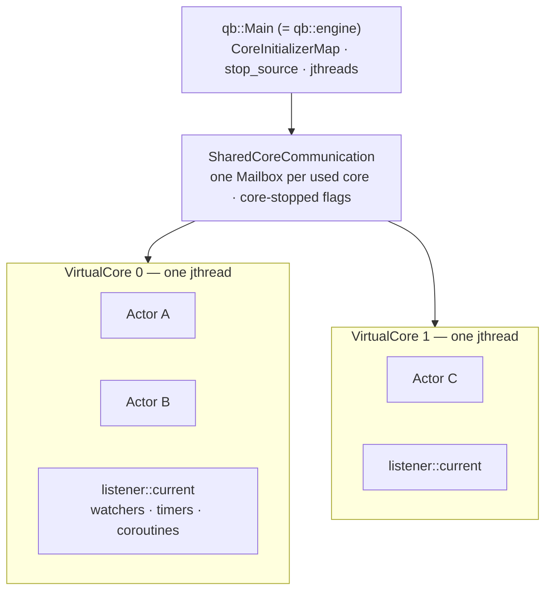
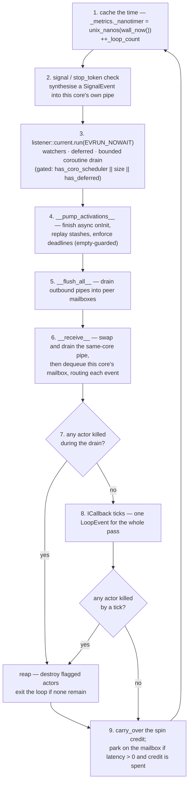
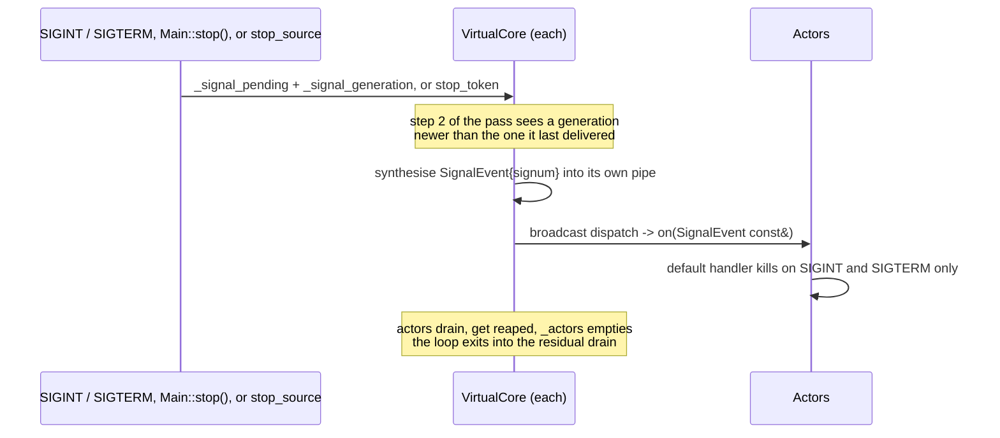

# The engine: `qb::Main` and `VirtualCore`

> **Audience:** Adopter · **Status:** stable · **Verified-against:** qb 3.0.0 (C++20 default, C++23 supported) — 60487ee7

`qb::Main` is a configuration object that becomes N threads, each of them a `qb::VirtualCore` that owns a disjoint set of actors, drives one `qb::io::async::listener` loop, and runs the same eight-step pass forever. This page owns that pass, the startup barrier, the backpressure policy, and the shutdown drain.

**Prerequisites:** [Writing actors](./actor.md) · [Inter-actor messaging](./messaging.md) — **See also:** [The async runtime](../3_qb_io/async_system.md) · [The pipe](../0_foundations/buffers.md) · [Core invariants](../7_reference/core_invariants.md) · [Concurrency primitives](../0_foundations/concurrency_primitives.md)

## Two objects, and only one of them is yours

- **`qb::Main`** (alias `qb::engine`) — you construct one, register actors against logical core indices, tune each core, then `start()` and `join()`.
- **`qb::VirtualCore`** — you never name it. `Main` builds one per used core inside its own `qb::jthread`, and it owns its actors, their id pool, their event router, its outbound pipes and its inbound mailbox — `_actors`, `_ids`, `_router`, `_pipes`, `_mail_box` — all without synchronisation, because exactly one thread ever touches them (`src/qb/core/VirtualCore.h:262-293`).



Between them sits **`SharedCoreCommunication`**, which `Main` owns and no application code names. It holds the `CoreSet`, one `Mailbox` per used core, and one atomic "has stopped" flag per core (`src/qb/core/Main.h:382-390`). A `Mailbox` is a `qb::lockfree::mpsc::ringbuffer<EventBucket, MaxRingEvents, 0>` (`src/qb/system/lockfree/mpsc.h`) plus the condition variable used by the latency path. The matching send side lives inside each `VirtualCore`: one `qb::VirtualPipe` per destination core, plus one for itself. [Inter-actor messaging](./messaging.md#the-address-is-the-route) narrates a single event through both.

A *core index* is a logical `qb::CoreId`, not a CPU. The valid range is `0 … qb::MaxCores - 1` (256); `core(index)` with a larger index throws `std::range_error`, and the `qb::NoAffinity` sentinel is `CoreId` max, deliberately above `MaxCores`, so it can never be mistaken for one (`src/qb/core/Main.cpp:494-495`; `src/qb/core/Main.h:104`).

`qb::Main()` registers **no** cores. A core comes into existence the first time you call `core(index)` or `addActor(index, …)` for it; there is no default population from hardware concurrency (`src/qb/core/Main.cpp:483-497`).

## Configuration: `CoreInitializer`, and what `addActor` returns

`Main::core(index)` returns a `qb::CoreInitializer&` — the configuration for one logical core: its affinity set, its idle latency, and the list of actor factories to instantiate when the worker starts. The first call for an index registers the core; later calls return the same object.

```cpp
// src: derived from qb/tests/core/system/actor/actor-add.cpp (ShouldRetrieveValidOrderedActorIdList)
auto builder = engine.core(0).builder()
                   .addActor<LoggerService>()
                   .addActor<Worker>(cfg);
if (!builder)                                   // == builder.valid()
    return 1;                                   // some addActor failed to reserve an id
const std::vector<qb::ActorId> ids = builder.idList();   // creation order, NotFound for a failure
```

`CoreInitializer::builder()` returns an `ActorBuilder` whose `addActor` chains; `idList()` gives the created ids in creation order as a `qb::Main::ActorIdList` (a `std::vector<qb::ActorId>`), and `valid()` — also reachable through `explicit operator bool` — reports whether every add on that builder reserved an id (`src/qb/core/Main.h:128-195`; `src/qb/core/Main.cpp:94-109`).

**`addActor` does not construct the actor.** It reserves an `ActorId`, stores a `TActorFactory` holding your decayed constructor arguments, and returns the id immediately (`src/qb/core/Main.h:737-763`). The object is built much later, on the worker thread, when `start()` calls `factory->create()` (`src/qb/core/Main.cpp:344-345`). Two consequences you can see from the call site:

- **String literals become `std::string`** and every other argument is decayed and stored by value, because the factory has to outlive the call. Anything matching the `reference_wrapper_type` concept is preserved as-is (`src/qb/core/Actor.h:2081-2115`, `:2140-2149`).
- **A valid id is not a promise that the actor will exist.** `qb::ActorId::NotFound` (`0`, the default-constructed id — test it with `is_valid()`) comes back only when the *reservation* fails: a second `ServiceActor` of a type already on that core, or `_next_id` reaching `ServiceId` max. An `onInit()` that later fails is reported through `hasError()`, never by changing the id you already have (`src/qb/core/Main.h:742-760`; `src/qb/core/ActorId.h:442`).

The reservation and the real allocation are two different counters, and three things make them line up. `CoreInitializer::_next_id` starts at `_nb_service + 1` (`src/qb/core/Main.cpp:42`) and hands out `ActorId(_next_id++, index)`; on the worker, `Actor`'s constructor calls `VirtualCore::__generate_id__()`, which draws the *lowest free* slot from a per-core bitset pool seeded at exactly the same value (`src/qb/core/VirtualCore.cpp:109`, `:119-127`); and the worker constructs **every** registered actor before it runs a single `onInit()` (`src/qb/core/Main.cpp:344-348`), so nothing else can draw from that pool in between. Same seed, same order, one at a time — so the id you were handed is the id the actor gets. Service actors sidestep both: `ServiceActor<Tag>::ServiceIndex` is assigned once per tag at static-init time and is *below* the pool's floor, which is why a service id is stable, deterministic (the first one is `1`) and never recycled (`src/qb/core/VirtualCore.h:1033-1047`; `src/qb/core/VirtualCore.cpp:916-920`).

Everything on `CoreInitializer` is **pre-start only**. Once the engine is running, `core(index)` throws:

```cpp
if (_is_running)
    throw std::runtime_error("Cannot access to CoreInitializers while engine is running");
```
<!-- src: qb/src/qb/core/Main.cpp:485-486 -->

To create an actor after startup, do it from inside a running actor with `addRefActor<T>()` (or its alias `addRefHandle<T>()`), which lands on the *same* core — see [Writing actors](./actor.md#children-addrefactor-and-actorhandlet).

## Latency: what a core does when it has nothing to do

`setLatency` is the one knob that changes how a core behaves when idle, and it works through the mailbox rather than through the loop.

```cpp
void
wait() noexcept {
    if (_latency > qb::duration::zero()) {
        std::unique_lock lk(_mtx);
        _cv.wait_for(lk, _latency);
    }
}
```
<!-- src: qb/src/qb/core/Main.h:348-354 -->

| `setLatency(...)` | `Mailbox::wait()` | Cost |
|---|---|---|
| `qb::duration::zero()` (the default) | returns immediately — the core stays on the lock-free poll | lowest latency, one CPU fully occupied |
| `> 0` | parks on a `std::condition_variable` for up to that span | lower CPU at idle, up to one span of wake-up delay |

`qb::duration` is `std::chrono::nanoseconds`, so pass a chrono value — `std::chrono::nanoseconds(500'000)`, `std::chrono::microseconds(500)`, `qb::duration::zero()` — never a bare integer ([the time vocabulary](../0_foundations/time.md)). Calling `setLatency` more than once on a core is safe; the last value wins.

A producer that enqueues into a mailbox calls `notify()`, which signals that condition variable — and is itself a no-op at zero latency, so the busy-spin configuration pays nothing for the wake path (`src/qb/core/Main.h:365-369`; `src/qb/core/Main.cpp:216`). The latency is fixed at mailbox construction from the `CoreInitializer` and read back with `getLatency()` (`src/qb/core/Main.cpp:127-130`; `src/qb/core/Main.h:376-379`).

A core does not park the moment it finds nothing to do. It keeps an integer **spin credit**, refilled each pass with the total work observed that pass, and parks only once the credit is exhausted:

```cpp
_metrics.carry_over();
if (_mail_box.getLatency() > qb::duration::zero()) {
    if (likely(_metrics._spin_credit))
        --_metrics._spin_credit;
    else
        _mail_box.wait();
}
```
<!-- src: qb/src/qb/core/VirtualCore.cpp:757-763 -->

So a burst of traffic buys a run of lock-free polls before the core is allowed to sleep, and a genuinely idle core still yields its CPU (`src/qb/core/VirtualCore.h:369-403`).

> **`Main::setLatency` is a blanket overwrite, not a default.** It loops every registered core and calls `setLatency` on each, last write wins (`src/qb/core/Main.cpp:380-384`). Pairing it with per-core tuning clobbers whatever you set before it. Use one or the other, or call the global one first.

## Affinity is a request, and on macOS it is a different request

`setAffinity(CoreIdSet)` asks the OS to run the worker only on the listed CPUs. `qb::NoAffinity` is `std::numeric_limits<CoreId>::max()`, deliberately above `qb::MaxCores`; ids at or above that bound are filtered out before any OS call is made, so `CoreIdSet{qb::NoAffinity}` is the explicit, well-defined way to say "no pinning" and is exactly equivalent to an empty set (`src/qb/core/Main.h:104`; `src/qb/core/VirtualCore.cpp:406-409`). `qb::CoreIdBitSet` applies the same filter at insertion, so an out-of-range id never even reaches the set (`src/qb/core/ActorId.h:121-129`).

It is best-effort in the ordinary sense — a failed `pthread_setaffinity_np` / `SetThreadAffinityMask` logs a warning and **never** fails core init, because a logical `CoreId` need not name a physical CPU (`src/qb/core/VirtualCore.cpp:431-432`). It is also best-effort in a sharper sense that a successful return will not tell you:

- **macOS has no `pthread_setaffinity_np`.** qb supplies one that calls `thread_policy_set(THREAD_AFFINITY_POLICY)` (`src/qb/core/VirtualCore.cpp:77-93`). On **Apple Silicon** that flavour is not implemented: every call answers `KERN_NOT_SUPPORTED`, and the shim deliberately reports *success* for that code — otherwise every core of every run would warn. Nothing is pinned, silently.
- Where macOS does implement it (Intel), the header calls the policy experimental and a scheduler **hint**: threads sharing an affinity *tag* are placed to share an L2 cache. qb passes the `CoreId` as that tag, so `setAffinity(3)` means "group me with other tag-3 threads", not "pin me to CPU 3".
- The shim honours only the **first** real id in the set, so a multi-core `CoreIdSet` narrows to its lowest member there.
- A Windows **GNU** build applies no affinity at all — the code path is `#warning`-ed out (`src/qb/core/VirtualCore.cpp:446-448`).

Do not infer placement from a call that returned. Ask `qb::CPU::ThreadPinningSupported()` (`src/qb/system/cpu.h:189`), which is a runtime probe and is therefore also right for an x86_64 binary under Rosetta 2. The full account is on `qb::NoAffinity` (`src/qb/core/Main.h:73-96`).

## Startup: the barrier, and what "started" means

```cpp
engine.start();   // async = true (default): returns once every core is past the barrier
engine.join();    // block until every worker has terminated
return engine.hasError() ? 1 : 0;
```

`start(true)` spawns one `qb::jthread` per registered core and then spins until the shared counter reaches the core count; `start(false)` promotes the **calling thread** to the last worker, so `start()` itself blocks until shutdown and no `join()` is needed (`src/qb/core/Main.cpp:414-431`, `:433-440`). The two modes install the signal handlers at the only point each of them can: asynchronously, right after the barrier; synchronously, immediately *before* the calling thread is consumed, since it will not come back until shutdown.

Each worker, in `Main::start_thread`, does this in order (`src/qb/core/Main.cpp:305-367`):

1. Construct the `VirtualCore` on its own stack, wire the engine's `qb::stop_token`, and publish `VirtualCore::_handler = &core` — the `thread_local` every `Actor` member forwards through.
2. Arm an `ExitGuard` whose destructor marks this core stopped *and* nulls `_handler`. It fires on every exit path including an exception escaping `__workflow__` — without it, peers would keep treating a crashed core as live and the shutdown drain would hang `join()` forever (`src/qb/core/Main.cpp:322-333`).
3. `__init__(affinity)` — apply the affinity request.
4. Refuse a registered core with **zero** actor factories: `Error::NoActor` (`src/qb/core/Main.cpp:341-343`).
5. `factory->create()` and `appendActor(...)` for each registered actor — construction only, no init.
6. `__init__actors__()` — call `onInit()` on every actor, in creation order, driving each coroutine to its first `co_await` or its `co_return`.
7. `__wait__all__cores__ready` — `fetch_add(1)` on the shared counter, then spin until it reaches the core count.
8. `__workflow__()`.

That single counter carries two things at once, which is why the error codes start at `1 << 9`:

```cpp
static_assert(static_cast<uint64_t>(qb::MaxCores) < static_cast<uint64_t>(BadInit),
              "startup-barrier sentinel space (Error::BadInit) must exceed "
              "MaxCores so a clean ready-count is never mistaken for an error");
```
<!-- src: qb/src/qb/core/VirtualCore.h:139-141 -->

A value below `BadInit` is a clean ready-count; anything at or above it is a failure. A failing core **stores** its error code over the counter, which both trips `hasError()` and releases every other core's barrier — so one bad core aborts the whole start rather than leaving the rest spinning (`src/qb/core/Main.cpp:369-378`, `:449-452`).

### The four error codes, and which path raises which

They are the `qb::VirtualCore::Error` flags:

```cpp
enum Error : uint64_t {
    BadInit         = (1u << 9u),
    NoActor         = (1u << 10u),
    BadActorInit    = (1u << 11u),
    ExceptionThrown = (1u << 12u)
};
```
<!-- src: qb/src/qb/core/VirtualCore.h:126-131 -->

| Code | Raised when |
|---|---|
| `BadInit` | `VirtualCore::__init__` returned false, or `start()` was called with no core registered at all (`src/qb/core/Main.cpp:399-403`) |
| `NoActor` | a core was registered with `core(n)` but given no actor |
| `BadActorInit` | an actor's `onInit()` resolved to `false` — **including the case where it threw** |
| `ExceptionThrown` | an exception escaped anywhere else in `start_thread`: an actor **constructor**, or a handler once the core is running |

The `onInit()`-throws case is worth stating exactly, because it is easy to guess wrong. `__drive_init__` is `noexcept` and catches the exception itself, logs it, and reports `InitOutcome::ReadyFalse` (`src/qb/core/VirtualCore.cpp:499-511`). It therefore lands on `BadActorInit`, identically to a clean `co_return false`. `ExceptionThrown` is reserved for a throw that actually escapes — a throwing constructor during `create()`, or a handler throwing inside `__workflow__`.

Only the boolean is public. `hasError()` reads the barrier counter and compares it against `BadInit`; the individual code is visible only in the log (`src/qb/core/Main.cpp:449-452`). **`join()` returning does not mean success** — always check.

## The loop pass

One iteration of `__workflow__`, in the order it happens (`src/qb/core/VirtualCore.cpp:641-764`):



Five things read off that ordering, and each is a question people actually ask:

- **`Actor::time()` is constant for a whole pass.** It forwards to `VirtualCore::time()`, which returns `_metrics._nanotimer` — set once at step 1 from `qb::unix_nanos(qb::wall_now())` (`src/qb/core/VirtualCore.cpp:644`, `:1014-1017`). Every actor on the core sees the same value in the same pass, and so does `qb::LoopEvent::now`. For a moving clock read `qb::wall_now()` directly; `Actor::now()` is the same cached instant as a `qb::wall_time`.
- **A `qb::ICallback` tick happens *after* the flush**, so events a tick pushes wait for the *next* pass to leave the core. Events pushed from an ordinary handler in step 6 also miss step 5, for the same reason. One `qb::LoopEvent` is built for the whole pass and handed to every registered callback by a direct virtual call — it is not a routed event and has no source or destination (`src/qb/core/VirtualCore.cpp:717`; `src/qb/core/ICallback.h:65-80`).
- **`listener::run` comes before the actor dispatch, not around it.** That is the whole mechanism behind the `run_sync` rule: an actor handler runs at step 6, after `run()` has returned, so the scheduler's re-entrancy guard is not armed and blocking there freezes the rest of the pass. [The async runtime](../3_qb_io/async_system.md#run_sync-and-run_for-block-the-calling-thread) owns that rule; [Async in actors](../5_core_io_integration/async_in_actors.md) narrates the two call chains side by side.
- **Step 3 is gated.** `has_coro_scheduler() || size() || has_deferred()` — a pure-actor core with no live qb-io object skips the loop entirely, but still pumps when a bare `defer()` is outstanding (`src/qb/core/VirtualCore.cpp:685-691`).
- **The loop ends when the last actor is reaped**, not on a flag: `if (_actors.empty()) break;` (`src/qb/core/VirtualCore.cpp:751-753`). An engine whose actors never call `kill()` runs forever, by design.

### Reaping is a drain, not a sweep

`kill()` only flags. The reap at step 7/8 destroys the flagged actors — and destroying one runs arbitrary user code, which may `kill()` another and re-enter `killActor()`. Iterating the set being mutated would be a use-after-free in release (a growth rehash reallocates the flat set's entries), so the loop swaps into a scratch buffer and repeats until a pass adds nothing:

```cpp
while (!_actor_to_remove.empty()) {
    _actor_remove_batch.clear();
    _actor_remove_batch.swap(_actor_to_remove);
    for (auto const &actor : _actor_remove_batch)
        removeActor(actor);
}
```
<!-- src: qb/src/qb/core/VirtualCore.cpp:744-749 -->

It terminates because only user code refills the set and each actor can be removed at most once — after an id leaves `_actors`, `removeActor` destroys nothing. Pinned by `KillDuringReap.ActorKilledFromAnotherDestructorIsStillReaped` (`qb/tests/core/system/lifecycle/kill-during-reap.cpp`). A callback whose actor was killed earlier **in the same pass** is skipped rather than ticked one last time, because the tick loop consults `_actor_to_remove` before every call (`src/qb/core/VirtualCore.cpp:728-729`).

## Backpressure: why the flush always terminates

Cores can fill each other's mailboxes. If core A and core B both hold full outbound pipes for each other *and* their inbound mailboxes are full, neither can progress without first reading its own mailbox — so an unbounded retry inside `try_send` would deadlock. The invariant that replaces it is: **every pass of `__flush_all__` terminates in bounded time.**

A failed `try_send` falls into one of four cases, tested in this order (`src/qb/core/VirtualCore.cpp:283-396`):

| Case | Test | Action |
|---|---|---|
| Malformed | `bucket_size == 0` | cannot be stepped over — log `LOG_CRIT` and **discard the rest of that pipe** |
| Permanently undeliverable | `bucket_size > kMaxDeliverableBuckets` | log `LOG_CRIT`, **dispose** the event (its destructor runs) and skip it |
| Best-effort | `state.bits.qos == 0` | drop it **without** disposing — this is the drop path the `EventQOS0` `static_assert` protects |
| Guaranteed | otherwise | bounded backoff, then a partial flush |

The backoff is monotonic and its two thresholds are compile-time constants — `kFlushSpinAttempts = 64` and `kFlushYieldAttempts = 512`, `static_assert`ed in that order (`src/qb/core/VirtualCore.cpp:267-269`). After the first `try_send` fails, the retry loop runs a budget of 512 further attempts (`src/qb/core/VirtualCore.cpp:360-372`):

- attempts `1 … 63` — `qb::spin_loop_pause()` between tries, a CPU hint with no scheduler involvement;
- attempts `64 … 512` — `std::this_thread::yield()`, giving the peer's consumer a slot;
- budget exhausted — **partial flush**: `notify()` the destination's mailbox, `pipe.reset(cur - base)` so the unsent tail stays queued in order, and return to the workflow (`src/qb/core/VirtualCore.cpp:381-387`).

The caller then runs `__receive__`, which frees room in *this* core's mailbox for its peers, so the next pass makes progress. That is what closes the cycle: no cross-core deadlock, no starvation, and no event silently reordered — the tail keeps its place in the FIFO.

Separating "permanently undeliverable" from "backpressured" is what makes the whole thing terminate. An oversized event can never be enqueued however much the consumer drains, so retrying it would hold the FIFO pipe hostage behind it, the sender would spin in the shutdown drain forever, and `Main::join()` would never return — [the size ceiling](./messaging.md#the-size-ceiling-and-what-happens-past-it) has the numbers.

## Shutdown

### Three triggers, one path



`Main::start()` calls `Main::install_default_signals()`, which installs handlers for **both** `SIGINT` and `SIGTERM` through `sigaction`, so Ctrl-C and the signal a container runtime or service manager sends both unwind every actor through the ordinary `kill()` path (`src/qb/core/Main.cpp:521-532`). You do not need to register either yourself. `sigaction` rather than `std::signal` is deliberate: under the historical System V semantics `std::signal` resets the disposition after the first delivery, so a second Ctrl-C would terminate the process instead of shutting it down again (`src/qb/core/Main.cpp:500-518`).

The handler itself does the minimum a signal handler may: store the signum, then bump a generation counter with release ordering. Both are `std::atomic` and both are `static_assert`ed lock-free (`src/qb/core/Main.cpp:274-287`).

The generation is what makes the mechanism repeatable. `_signal_pending` holds only the *latest* signum and is never cleared during a run, so a per-core "already consumed" latch would drop every signal after the first — a `SIGHUP` reload followed by a `SIGTERM`, or `Main::stop()` after any earlier signal, would leave the engine unstoppable. Each core re-synthesises whenever the generation advances past the one it last delivered (`src/qb/core/VirtualCore.cpp:657-683`). Signals **coalesce**: two raised between two passes deliver one event carrying the later signum.

`Main::stop()` is the same path with a synthetic `SIGINT`, and is safe from any thread including a signal handler (`src/qb/core/Main.cpp:454-463`). The C++20 `qb::stop_source` is the third: `~Main` requests it, workers observe it through their `stop_token`, and each synthesises a virtual `SIGINT` once — a signal-free shutdown that works identically on platforms with no POSIX signals (`src/qb/core/Main.cpp:294-303`; `src/qb/core/VirtualCore.cpp:658`, `:672-676`).

### Terminal versus delivered

`registerSignal(signum)` routes a signal through the engine so that every core synthesises a `qb::SignalEvent` carrying it. It does **not** make that signal terminal:

```cpp
if (event.signum == SIGINT || event.signum == SIGTERM)
    kill();
```
<!-- src: qb/src/qb/core/Actor.cpp:186-187 -->

A `SIGHUP` or `SIGUSR1` is delivered and ignored by the default handler — those are the config-reload and stats-dump cases. To act on one, declare your own `on(qb::SignalEvent const&)` and inspect `event.signum`; call `kill()` there if that signal should stop the actor. `unregisterSignal` restores the OS default, `ignoreSignal` sets `SIG_IGN` (the usual reason being `SIGPIPE` on a network server) (`src/qb/core/Main.cpp:534-547`).

### The residual drain, and the flag it turns on

Leaving `__workflow__` is not the end. Cores exit independently — there is no shutdown barrier — so a peer can stop draining its mailbox while this core still holds guaranteed events for it, and the hot-loop invariant ("partial-bail, then the peer's `__receive__` frees room") no longer holds. An unbounded `while (__flush_all__())` would spin forever.

```cpp
for (;;) {
    __receive__();
    if (!__flush_all__())
        break; // every outbound pipe drained — clean finish
    if (!__dispose_residual_to_stopped_cores__())
        break; // nothing left targets a still-live core — done
}
_engine.mark_core_stopped(_resolved_index);
```
<!-- src: qb/src/qb/core/VirtualCore.cpp:783-792 -->

Each pass keeps receiving (so live peers can still deliver *to* us) and keeps flushing. A pipe is abandoned only once its destination has published its "stopped" flag — it has left its own workflow and will never drain its mailbox again, so that residue can never arrive. Those events are disposed through the disposer registry rather than merely dropped, because nobody else will ever free a non-trivial payload for them (`src/qb/core/VirtualCore.cpp:798-835`). A pipe to a **live but backpressured** peer is retried, never dropped.

The stopped flag is published *after* the final receive and flush, which is exactly the right order: from that instant this core no longer drains its mailbox, so peers must stop sending to it (`src/qb/core/Main.h:384-390`).

One window remains open by construction: a peer's last cross-core flush can land in a mailbox *after* that core's final `__receive__` but *before* it publishes the flag. Nobody will drain it. `Main::join()` closes it — after every worker has joined, and therefore single-threaded, it sweeps every mailbox and disposes what is left (`src/qb/core/Main.cpp:465-481`). That sweep must copy events out of the ring rather than walk it in place: a saturated ring wraps, and `consume_all` would hand the walker two disjoint segments, tearing any multi-bucket event straddling the wrap (`src/qb/core/Main.cpp:228-265`).

### RAII is the backstop

`~Main` calls `_stop_source.request_stop()` and then `join()`; the workers are `qb::jthread`s — an alias for `std::jthread` where the standard library provides it, and qb's own fallback otherwise — so even a `Main` you neither stopped nor joined shuts down when it goes out of scope, because each `jthread` destructor requests a stop and joins (`src/qb/core/Main.cpp:294-303`; `src/qb/utility/compat.h:52-66`). Explicit `stop()`/`join()` are for controlling *when*. The `qb::stop_source` / `qb::stop_token` pair is also usable programmatically, which is the signal-free path a Windows service or an embedded host wants.

## A complete engine, start to finish

```cpp
// src: derived from examples/07-applications/01-taskmanager/src/main.cpp
#include <chrono>
#include <vector>
#include <qb/io.h>
#include <qb/main.h>

int
main() {
    qb::Main engine;

    // Core 0: the accept loop. Zero latency = never park, lowest accept latency.
    engine.core(0).setLatency(qb::duration::zero());

    // Workers on cores 1..3. Set the latency inside the same loop that adds the
    // actor, so core(n) is only ever called for a core that will receive one —
    // a registered core with zero actors fails startup with Error::NoActor.
    std::vector<qb::ActorId> worker_ids;
    for (std::uint32_t i = 0; i < 3; ++i) {
        const qb::CoreId core = static_cast<qb::CoreId>(1 + i);
        engine.core(core).setLatency(std::chrono::nanoseconds(500'000)); // 500 us
        const auto id = engine.addActor<Worker>(core, /* ctor args… */);
        if (!id.is_valid()) {
            qb::io::cerr() << "failed to reserve a Worker on core " << core << '\n';
            return 1;
        }
        worker_ids.push_back(id);
    }

    engine.addActor<Listener>(0, worker_ids);
    qb::Main::ignoreSignal(SIGPIPE);   // usual for a network server

    engine.start();                    // async: returns once every core is ready
    engine.join();                     // Ctrl-C, SIGTERM or Main::stop() ends it

    return engine.hasError() ? 1 : 0;  // join() returns on failure too
}
```

## Memory: committed before the first event

The engine allocates eagerly and quadratically in the core count, and none of it ever shrinks: every core keeps a private outbound pipe to every other core, and every mailbox keeps a private inbound ring from every other core. Measured on this checkout, the resting footprint is about **0.6 MiB at 1 core, 6.3 at 4, 22.5 at 8 and 85 at 16** — doubling the core count roughly quadruples it. The per-structure figures, and why the buffers never come back, are on [the pipe](../0_foundations/buffers.md#memory-it-grows-and-it-does-not-come-back). Worth knowing before you configure a 64-core engine inside a container memory limit.

## Pitfalls

- **Configuring after `start()`.** `core(index)` throws `std::runtime_error`. Create runtime actors from inside an actor with `addRefActor<T>()`.
- **Registering a core you never populate.** `core(n)` with no actor fails startup with `Error::NoActor`, logged as `Started with 0 Actor`.
- **Pairing `Main::setLatency` with per-core `setLatency`.** The global form overwrites every core, last write wins.
- **Believing `setAffinity` pinned anything.** It is a request; on Apple Silicon it succeeds and pins nothing. Branch on `qb::CPU::ThreadPinningSupported()`, not on the call returning.
- **Passing a bare integer to `setLatency`.** It takes a `qb::duration`. Write `std::chrono::microseconds(500)` or `qb::duration::zero()`.
- **Ignoring `hasError()`.** `join()` returns on failure just as it does on success.
- **Expecting `registerSignal(SIGHUP)` to stop the engine.** Only `SIGINT` and `SIGTERM` are terminal in the default handler; everything else is delivered for you to act on.
- **Blocking anywhere on the pass.** A handler, an `on(qb::LoopEvent const&)` tick and an I/O callback all run on the one thread that serves every actor on the core. There is no diagnostic — the only symptom is latency. Chunk the work, hand it to a coroutine with `spawn`, defer it with `qb::io::async::callback`, or move it to a dedicated actor on its own core.
- **Treating a logical core index as a CPU.** `qb::MaxCores` (256) bounds the index space, not your machine.

## See also

- [Writing actors](./actor.md) — what runs inside step 6 of the pass, and the lifecycle the reap completes.
- [Inter-actor messaging](./messaging.md) — what steps 5 and 6 are moving, and the ceiling the flush enforces.
- [The async runtime](../3_qb_io/async_system.md) — the loop turn inside step 3, and the `run_sync` rule.
- [The pipe](../0_foundations/buffers.md) — the buffers this page sizes.
- [Concurrency primitives](../0_foundations/concurrency_primitives.md) — the MPSC ring behind the mailbox.
- [Core invariants](../7_reference/core_invariants.md) — the same guarantees in reference form.
