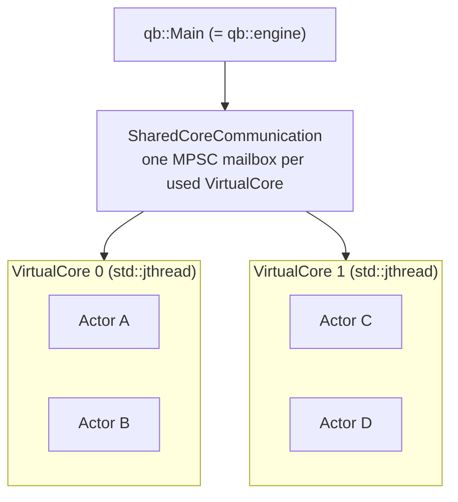
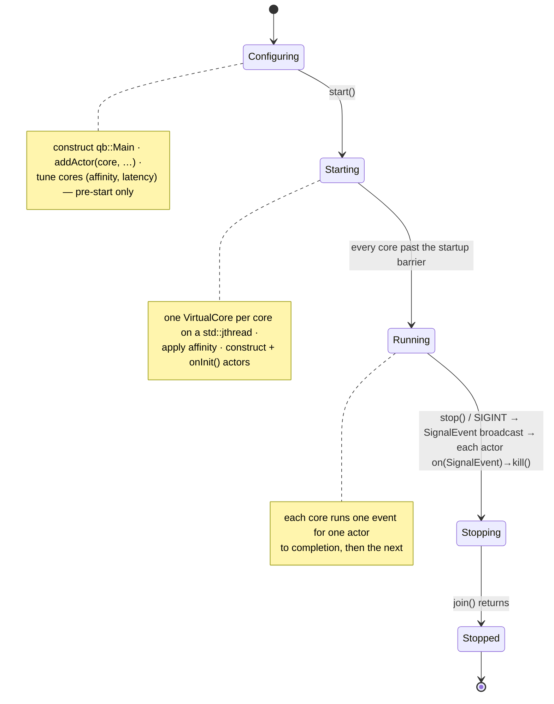
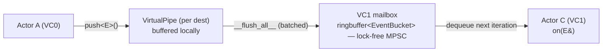

# The engine: `qb::Main` and `VirtualCore`

> **Audience:** Adopter · **Status:** stable · **Verified-against:** qb 2.6.0 (C++20 default, C++23 supported)

`qb::Main` is the runtime that launches one worker thread per logical core, places actors onto those workers, and drives event processing until shutdown; `qb::VirtualCore` is the per-thread worker it manages on your behalf.

**Prerequisites:** [Core concepts: concurrency and parallelism](../2_core_concepts/concurrency.md), [Writing actors with qb::Actor](./actor.md) — **See also:** [The actor model](../2_core_concepts/actor_model.md), [Event messaging](./messaging.md), [Reference and service actors](./patterns.md)

---

## Summary

The engine has two collaborating types, both declared in `qb/include/qb/core/Main.h` and `qb/include/qb/core/VirtualCore.h`:

- **`qb::Main`** (aliased `qb::engine`) — the single entry point. You construct one instance, register actors against logical core indices, optionally tune each core, then call `start()` and `join()`.
- **`qb::VirtualCore`** — a worker that owns a disjoint set of actors and runs their event loop on one thread. Application code never instantiates or touches a `VirtualCore` directly; `qb::Main` constructs one per used core inside its own `std::jthread`.

Each `VirtualCore` runs on its own thread and owns its actors exclusively, with no synchronization on the actor maps or the id pool. Thread safety is structural, not lock-based: actors communicate only by passing events between cores, never by touching another core's actor state directly (`qb/include/qb/core/VirtualCore.h`).



`qb::Main` holds a `std::stop_source` and hands a `std::stop_token` to every worker, so it can request cooperative cancellation without relying on OS signals (`qb/include/qb/core/Main.h`).



---

## Concepts

### Logical cores and `CoreId`

A *core index* is a logical `qb::CoreId`, not a physical CPU. You assign actors to logical cores; the engine maps each used logical core to one `VirtualCore` worker thread. Whether that thread is pinned to a physical CPU is a separate, best-effort decision made through `setAffinity` (see [Latency and affinity tuning](#3-latency-and-affinity-tuning)).

The valid index range is `0` to `qb::MaxCores - 1`. Requesting `core(index)` with `index >= qb::MaxCores` throws `std::range_error`; `qb::NoAffinity` (defined as `std::numeric_limits<CoreId>::max()`) is deliberately greater than `qb::MaxCores`, so it can never be used as a core index (`qb/include/qb/core/Main.h`, `qb/source/core/src/Main.cpp`).

### `CoreInitializer` — per-core setup, pre-start only

`qb::Main::core(index)` returns a `qb::CoreInitializer&`, the configuration object for one logical core. The first call for a given index *registers* that core; subsequent calls return the same initializer. A `CoreInitializer` carries the core's affinity, idle latency, and the list of actor factories to instantiate when the worker starts.

Registration is meaningful: a registered core that ends up with zero actors fails startup. Only call `core(index)` for indices that will actually receive at least one actor (`qb/source/core/src/Main.cpp`; see also `examples/all/taskmanager/src/main.cpp`).

### `VirtualCore` — the worker

Once `start()` runs, each used `CoreInitializer` is consumed to build a `VirtualCore` on a dedicated `std::jthread`. The worker initializes (applying affinity), constructs and initializes its actors, waits at a startup barrier until every core is ready, then enters its event loop (`__workflow__`). A `VirtualCore` processes one event for one actor to completion before moving to the next; no handler can be interrupted or re-entered, which is why actor state needs no internal locking.

---

## Steps and examples

### 1. Initialize the engine

Construct one `qb::Main`, register actors against logical cores, then start and join.

```cpp
// src: examples/all/auction_house/src/main.cpp (adapted)
#include <qb/main.h>
#include "MyActors.h"

int main() {
    qb::Main engine;

    // Register actors against logical cores. The first core(index) or
    // addActor(index, ...) call for an index registers that VirtualCore.
    const auto logger_id = engine.addActor<LoggerService>(0);
    engine.addActor<WorkerA>(1, logger_id);
    engine.addActor<WorkerB>(1, logger_id);

    engine.start();   // async = true (default): returns immediately
    engine.join();    // block until every core has shut down

    return engine.hasError() ? 1 : 0;
}
```

`qb::Main()` registers no cores by default; cores come into existence only as you call `core(index)` or `addActor(index, ...)`. There is no automatic population based on hardware concurrency (`qb/source/core/src/Main.cpp`).

### 2. Add actors and read placement

`addActor<T>(index, args...)` is a convenience for `core(index).addActor<T>(args...)`. It records the actor's construction against the chosen core and reserves its `qb::ActorId` immediately; the actor object itself is constructed, and its `onInit()` is run, later when `start()` spins up the worker. The returned id is `qb::ActorId::NotFound` only when reservation fails at registration time — a second `ServiceActor` of a type already registered on that core, or the per-core actor count reaching its limit. `NotFound` is the default-constructed, invalid id; test it with `is_valid()` (`qb/include/qb/core/Main.tpp`, `qb/include/qb/core/ActorId.h`).

A returned valid id does not by itself prove the actor's `onInit()` will succeed: an `onInit()` that returns `false` fails the core with `BadActorInit`; an `onInit()` that throws is caught by the engine and surfaced as `ExceptionThrown`. Either way the failure is reported through `hasError()`, not by changing the already-returned id (`qb/source/core/src/Main.cpp`). Always check `hasError()` after `join()` (see [step 5](#5-check-for-errors)).

```cpp
// Single actor; verify the returned id before relying on it.
const qb::ActorId id = engine.addActor<MyActor>(/*core=*/0, arg1, arg2);
if (!id.is_valid()) {
    // Reservation failed: duplicate service type on core 0, or the
    // per-core actor limit was reached.
    qb::io::cerr() << "Failed to register MyActor on core 0\n";
    return 1;
}
```

For several actors on the same core, `CoreInitializer::builder()` returns a fluent `ActorBuilder`. `idList()` returns the created ids in creation order as a `std::vector<qb::ActorId>` (`qb::Main::ActorIdList`); `valid()` reports whether every `addActor` on that builder succeeded.

```cpp
auto builder = engine.core(1).builder();
builder.addActor<DataProcessor>(logger_id)
       .addActor<ReportGenerator>(logger_id);

if (!builder.valid()) { /* at least one addActor failed to reserve an id */ }
const std::vector<qb::ActorId> ids = builder.idList();
```

All actors and per-core configuration must be set up *before* `start()`. Once the engine is running, `core(index)` throws `std::runtime_error("Cannot access to CoreInitializers while engine is running")`. To create actors after startup, spawn them from inside a running actor with `addRefActor<T>()` or `addRefHandle<T>()` — see [Reference and service actors](./patterns.md) (`qb/source/core/src/Main.cpp`).

### 3. Latency and affinity tuning

Both knobs live on `CoreInitializer` and return `*this` for chaining. Configure them before `start()`.

```cpp
// src: examples/all/taskmanager/src/main.cpp (adapted)
#include <chrono>
#include <qb/main.h>

// Core 0: latency-critical accept loop, pinned to physical CPU 0.
engine.core(0)
    .setLatency(qb::duration::zero())      // busy-spin: lowest latency, 100% CPU
    .setAffinity(qb::CoreIdSet{0});        // pin to physical core 0

// Core 1: background work, may float across physical CPUs 1-2.
engine.core(1)
    .setLatency(std::chrono::nanoseconds(500'000))  // park up to 500 us when idle
    .setAffinity(qb::CoreIdSet{1, 2});
```

`Main::setLatency(...)` applies one latency to **every** registered core at once. It is a blanket
overwrite (it loops every core, last-write-wins), *not* a default for cores without an explicit
override — so do not pair it with the per-core block above or it will clobber core 0's busy-spin
setting. Use it instead of per-core tuning, or before it:

```cpp
// Overwrites the latency on EVERY registered core (including any set above).
engine.setLatency(std::chrono::microseconds(500));
```

**Latency** is a `qb::duration` (a `std::chrono::nanoseconds` span; the canonical time model is documented in [API overview: time vocabulary](../7_reference/api_overview.md)). It bounds how long an idle core may park before polling again:

| `setLatency(...)` | Behavior | Trade-off |
|---|---|---|
| `qb::duration::zero()` (the default) | Busy-spin; the core polls continuously and never parks | Lowest latency, 100% CPU on that core |
| `> 0` | When idle, the core may park on a condition variable up to the given duration | Lowers CPU cost; adds up to that duration of worst-case wake latency |

`setLatency` takes a `qb::duration`, so pass a chrono value (`std::chrono::nanoseconds(500'000)`, `std::chrono::microseconds(500)`) or `qb::duration::zero()` — never a bare integer. Calling it more than once on the same core is safe; the last value wins (`qb/include/qb/core/Main.h`, `examples/all/taskmanager/src/main.cpp`).

**Affinity** (`setAffinity(CoreIdSet)`) requests that the worker thread run only on the listed physical CPUs. It is best-effort: a logical `CoreId` need not correspond to a physical CPU, and a failed `pthread_setaffinity_np` / `SetThreadAffinityMask` only logs a warning — it never fails core initialization. `CoreId` values `>= qb::MaxCores` (including `qb::NoAffinity`) are filtered out before pinning, so `qb::NoAffinity` is the explicit, well-defined way to request no pinning (`qb/source/core/src/VirtualCore.cpp`, `qb/include/qb/core/Main.h`):

```cpp
engine.core(0).setAffinity(qb::CoreIdSet{qb::NoAffinity});  // let the OS schedule freely
```

### 4. Start, join, and shut down

```cpp
// Asynchronous start (default): returns once every core reports ready.
engine.start();          // equivalent to engine.start(true)
// ...the calling thread is free to do other work...
engine.join();           // blocks until all cores have stopped

// Synchronous start: the calling thread becomes the last worker and
// start() blocks until the engine shuts down. No join() is needed.
engine.start(false);
```

With `start(true)` (the default), every `VirtualCore` runs on its own `std::jthread` and `start()` returns after all cores cross the startup barrier; call `join()` later to wait for shutdown. With `start(false)`, the calling thread is promoted to the last worker, so `start()` itself blocks until shutdown (`qb/include/qb/core/Main.h`, `qb/source/core/src/Main.cpp`).

**Trigger a graceful shutdown** from any thread, including a signal handler:

```cpp
qb::Main::stop();   // static; same effect as a default-handled SIGINT
```

Shutdown converges on one path regardless of trigger. A registered POSIX signal (`SIGINT` by default, plus any signal you register via `sigaction`), `qb::Main::stop()` (which sets the pending-signal flag to `SIGINT`), and the `std::stop_source` (`request_stop()` on `~Main` or programmatically) all cause each worker to synthesize a virtual `SIGINT` and broadcast a `qb::SignalEvent`. The `~Main` destructor requests stop and then joins; because workers are `std::jthread`s, RAII makes shutdown automatic even if you forget to call `stop()` or `join()` (`qb/source/core/src/Main.cpp`).

**Signal management** is static and process-wide:

```cpp
qb::Main::registerSignal(SIGTERM);   // route SIGTERM through the engine -> graceful stop
qb::Main::registerSignal(SIGUSR1);   // route SIGUSR1 through the engine -> graceful stop
qb::Main::unregisterSignal(SIGUSR1); // restore default OS behavior for SIGUSR1
qb::Main::ignoreSignal(SIGPIPE);     // common for network servers
```

`start()` registers `SIGINT` through `sigaction` so a `Ctrl-C` triggers a graceful shutdown; it does not register `SIGTERM` for you. To shut down on `SIGTERM` (or any other signal), call `registerSignal()` for it before `start()`, as the worked examples do (`qb/source/core/src/Main.cpp`, `examples/all/taskmanager/src/main.cpp`).

### 5. Check for errors

After `join()` (or after a synchronous `start(false)` returns), `hasError()` reports whether any core terminated abnormally. The flags are defined on `qb::VirtualCore::Error` (`qb/include/qb/core/VirtualCore.h`):

```cpp
enum VirtualCore::Error : uint64_t {
    BadInit         = (1u << 9u),   // a VirtualCore failed to initialize, or no core was registered
    NoActor         = (1u << 10u),  // a registered core started with zero actors
    BadActorInit    = (1u << 11u),  // an actor's onInit() returned false
    ExceptionThrown = (1u << 12u),  // an unhandled exception escaped a handler on the core, or onInit() threw
};
```

```cpp
engine.join();
if (engine.hasError()) {
    // Likely causes: an actor's onInit() returned false (BadActorInit),
    // a registered core had no actors (NoActor), or a handler or onInit()
    // threw (ExceptionThrown). All are surfaced through hasError().
    return 1;
}
```

Two startup conditions are worth calling out explicitly: starting the engine with an empty initializer map (no `core()`/`addActor()` ever called) fails with `BadInit`, and a core that was registered but received no actors fails with `NoActor` (`qb/source/core/src/Main.cpp`).

---

## The `VirtualCore` event loop

You never write against `VirtualCore`, but knowing its loop explains the engine's latency and ordering guarantees. Each iteration of `__workflow__` does, in order (`qb/source/core/src/VirtualCore.cpp`):

1. **Refresh the cached time** — set the per-core `_nanotimer` once from `qb::unix_nanos(qb::wall_now())`; this is the value `Actor::time()` returns for the rest of the iteration.
2. **Observe cancellation** — read the pending-signal flag and poll the `std::stop_token`; if either fired and has not yet been consumed, synthesize a virtual `SIGINT` and recycle a `SignalEvent` into this core's self-pipe to begin shutdown. This makes signal-free shutdown work uniformly on Linux, macOS, and Windows.
3. **Process I/O events** — drive the thread-local `qb::io::async::listener` (timers, sockets, files, coroutine resumptions).
4. **Flush outgoing pipes** (`__flush_all__`) — transfer locally buffered events to their destination cores' mailboxes.
5. **Receive events** (`__receive__`) — drain this core's same-core self-pipe, then its inter-core MPSC mailbox, dispatching each event to the destination actor's `on(E&)`.
6. **Run registered callbacks** — invoke `ICallback::on(qb::LoopEvent const&)` once per registered actor (after flush and receive). Callbacks must be fast and non-blocking; blocking one stalls the whole core (`qb/include/qb/core/ICallback.h`).
7. **Remove killed actors** — destroy actors flagged for removal during this iteration; if none remain, the loop exits.
8. **Idle** — if `latency > 0` and the spin credit is exhausted, park on a condition variable up to the configured latency.

### Adaptive backoff

The worker keeps an integer `_spin_credit` seeded from the total work observed in the previous iteration. While there is activity, the core stays in a lock-free spin; only when the credit drains to zero is it allowed to park on the mailbox condition variable (and only if `latency > 0`). This avoids parking during traffic bursts while still yielding CPU during genuine idle periods (`qb/include/qb/core/VirtualCore.h`).

### Per-core cached time

`VirtualCore::time()` (which backs `Actor::time()`) returns a nanosecond timestamp refreshed once per loop iteration from `qb::unix_nanos(qb::wall_now())`. Every actor on the core observes the same value within a single iteration, which is constant inside one handler or `on(qb::LoopEvent const&)` invocation. For a continuously updating, high-precision clock, read `qb::wall_now()` directly (`qb/include/qb/core/VirtualCore.h`). The canonical time types are covered in [API overview: time vocabulary](../7_reference/api_overview.md).

---

## Inter-core communication

Cross-core delivery is a buffer-then-flush pipeline, not a direct call (`qb/include/qb/core/Main.h`, `qb/include/qb/system/lockfree/mpsc.h`):



1. Actor A calls `push<E>(actor_c_id, ...)`.
2. The event is written to VC0's per-destination `VirtualPipe`, buffered locally.
3. During VC0's flush phase (`__flush_all__`, step 4 above), pipes flush and the event is copied into VC1's mailbox.
4. VC1 dequeues the event on its next iteration and dispatches it to Actor C's `on(E&)`.

**Components:**

- **`VirtualPipe`** — a per-destination buffer inside each `VirtualCore`; events accumulate and are batch-written to the destination mailbox.
- **`SharedCoreCommunication`** — owns one MPSC mailbox per used `VirtualCore`. Many cores may write concurrently (multi-producer); only the owning core reads (single-consumer).
- **Mailbox** — a lock-free `ringbuffer<EventBucket>` with the optional condition variable used by the latency parking path.

Backpressure handling depends on delivery class: best-effort (QoS-0) events are dropped after a single failed `try_send`, while guaranteed events use bounded spin-then-yield backoff and partial flushing so the flush always terminates in bounded time, avoiding cross-core deadlock (`qb/source/core/src/VirtualCore.cpp`).

---

## Pitfalls

- **Configuring or adding after start.** `core(index)`, `addActor`, `setLatency`, and `setAffinity` are pre-start operations. `core(index)` throws `std::runtime_error` once the engine is running. Create runtime actors from inside an actor with `addRefActor<T>()` instead (`qb/source/core/src/Main.cpp`).
- **Registering an empty core.** Calling `core(n)` without giving that core any actor fails startup with `Error::NoActor` (logged as `VirtualCore(n).id(...) Started with 0 Actor`). Register a core only when it will host at least one actor (`qb/source/core/src/Main.cpp`).
- **Passing a bare integer to `setLatency`.** It takes a `qb::duration`. Use `std::chrono::nanoseconds(500'000)`, `std::chrono::microseconds(500)`, or `qb::duration::zero()`.
- **Out-of-range core index.** `core(index)` with `index >= qb::MaxCores` throws `std::range_error`. `qb::NoAffinity` is not a valid core index — it is only meaningful inside a `CoreIdSet` passed to `setAffinity` (`qb/source/core/src/Main.cpp`).
- **Assuming affinity is guaranteed.** `setAffinity` is best-effort; a failed pin only warns and never aborts the core. Do not depend on a thread being on a specific physical CPU for correctness (`qb/source/core/src/VirtualCore.cpp`).
- **Treating logical cores as physical CPUs.** Core indices are logical. Use `setAffinity` to influence physical placement, and remember that `qb::MaxCores` (256) bounds the logical index space, not your machine's CPU count.
- **Blocking a handler or `on(qb::LoopEvent const&)`.** A `VirtualCore` runs handlers sequentially on one thread; a blocking call freezes every actor on that core. Offload blocking work via `qb::io::async::callback` or events (see [The qb-io asynchronous system](../3_qb_io/async_system.md)).
- **Ignoring `hasError()`.** A core can terminate early (bad actor init, thrown handler). `join()` returning does not imply success — always check `hasError()` (`qb/include/qb/core/VirtualCore.h`).

---

## Complete startup and shutdown example

```cpp
// src: examples/all/auction_house/src/main.cpp (adapted)
#include <chrono>
#include <qb/io.h>
#include <qb/main.h>
#include "MyActors.h"

int main() {
    qb::Main engine;

    // Per-core tuning (before start).
    engine.core(0).setLatency(qb::duration::zero());            // hot path: no parking
    engine.core(1).setLatency(std::chrono::microseconds(500)); // background: park up to 500 us

    // Register actors; verify placement.
    const auto svc = engine.addActor<MyService>(0);
    if (!svc.is_valid()) {
        qb::io::cerr() << "Failed to create MyService\n";
        return 1;
    }
    engine.addActor<Worker>(1, svc);
    engine.addActor<Worker>(1, svc);

    // Optional signal tuning.
    qb::Main::ignoreSignal(SIGPIPE);

    // Run.
    engine.start();                          // async
    qb::io::cout() << "Engine running.\n";
    engine.join();                           // wait for shutdown

    if (engine.hasError()) {
        qb::io::cout() << "Terminated with error.\n";
        return 1;
    }
    return 0;
}
```

---

## See also

- [Writing actors with qb::Actor](./actor.md) — the unit of computation the engine schedules.
- [Reference and service actors](./patterns.md) — `addRefActor`, `addRefHandle`, and per-core singletons.
- [Event messaging](./messaging.md) — `push`, `broadcast`, and the cross-core pipeline in depth.
- [Core concepts: concurrency and parallelism](../2_core_concepts/concurrency.md) — the engine's threading model at a higher level.
- [API overview: time vocabulary](../7_reference/api_overview.md) — `qb::duration`, `qb::mono_time`, `qb::wall_time`.
- Reference tests: `qb/source/core/tests/system/engine/main-lifecycle.cpp`, `qb/source/core/tests/system/messaging/messaging-api.cpp`.
