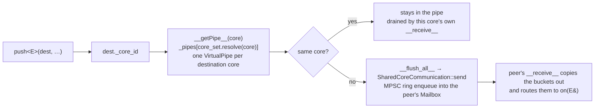

# Inter-actor messaging: the address is the route

> **Audience:** Adopter · **Status:** stable · **Verified-against:** qb 3.1.0 (C++20 default, C++23 supported) — 60487ee7

An `ActorId` is `{ServiceId, CoreId}` packed into 32 bits, and the core half is not metadata — it *is* the routing decision. Every rule on this page (`push` versus `send`, the lifetime of the reference `push` hands back, why a payload must be relocatable, why one event can be silently dropped) is a consequence of that one packing and of the buffer it selects.

**Prerequisites:** [Writing actors](./actor.md) · [The event system](../2_core_concepts/event_system.md) — **See also:** [The pipe: qb's one buffer](../0_foundations/buffers.md) · [The engine](./engine.md) · [Core invariants](../7_reference/core_invariants.md) · [Concurrency primitives](../0_foundations/concurrency_primitives.md)

## The address is the route

```cpp
class ActorId {
    ServiceId _service_id;
    CoreId    _core_id;
```
<!-- src: qb/src/qb/core/ActorId.h:385-397 -->

Two `uint16_t`s (`src/qb/core/ActorId.h:53`, `:61`), no padding, converted to and from a `uint32_t` with `std::bit_cast` in both directions (`src/qb/core/ActorId.h:427`, `:436`). `sid()` is the actor's slot inside its core; `index()` names the core. Three values are reserved: `NotFound == 0` is the default-constructed, invalid id, `BroadcastSid` (`ServiceId` max) marks a `qb::BroadcastId`, and `qb::MaxCores == 256` bounds the core half (`src/qb/core/ActorId.h:413-414`, `:82`).

Every send begins by reading the core half and ends by writing bytes into a buffer chosen by it:


<!-- src: qb/src/qb/core/VirtualCore.h:860 (dest._core_id selects the pipe), qb/src/qb/core/VirtualCore.h:880-883 (__getPipe__), qb/src/qb/core/Main.cpp:227-232 (the ring enqueue) -->

Nothing in that path looks an actor up by identity across a thread boundary. The sender resolves a **core**, appends bytes to a buffer it owns exclusively, and the destination core turns those bytes back into an event on its own thread. The one cross-thread structure is the mailbox ring, and it is reached only from the flush.

Both buffers store the same unit. A `qb::VirtualPipe` is `qb::allocator::segmented_pipe<EventBucket>` (`src/qb/core/Event.h:698`) — a FIFO of 256 KB segments drawn from the core's `segment_pool` (`src/qb/core/VirtualCore.h:273`; the pool carves them eight to a 2 MB slab from the process-wide `slab_cache`, [Buffers](../0_foundations/buffers.md#events)), which grows by linking a segment and never moves an event once queued — and an `EventBucket` is one cache line wide — `QB_LOCKFREE_EVENT_BUCKET_BYTES`, which is `QB_LOCKFREE_CACHELINE_BYTES`, 64 bytes on common targets (`src/qb/utility/prefix.h:66-68`, `:138-140`). An event occupies a whole number of contiguous buckets and records that count in its own 16-bit header. The destination side is a `SharedCoreCommunication::Mailbox`, one per core, reached through `getMailBox(CoreId)`; it derives from `qb::lockfree::mpsc::ringbuffer<EventBucket, MaxRingEvents, 0>` — many producers, one consumer, no lock (`src/qb/core/Main.h:380`, `:492-493`, `:600`). Its idle-wait policy is a `qb::duration` set per core; [the engine page](./engine.md#latency-what-a-core-does-when-it-has-nothing-to-do) owns that.

That is also why the send API needs no handle to the runtime. `VirtualCore::_handler` is a `thread_local` pointer to "the core running on this thread" (`src/qb/core/VirtualCore.h:85`), and because actors are thread-affine it is always the right core — so `Actor::push` is one forward through it:

```cpp
template <typename _Event, typename... _Args>
_Event &
Actor::push(ActorId const &dest, _Args &&...args) const noexcept {
    return VirtualCore::_handler->template push<_Event>(dest, id(), std::forward<_Args>(args)...);
}
```
<!-- src: qb/src/qb/core/VirtualCore.h:997-1001 -->

`Actor::send` is the same one-line shape (`src/qb/core/VirtualCore.h:1003-1007`), and so is `Actor::broadcast` (`src/qb/core/VirtualCore.h:1030-1034`). So are the non-template members: `getPipe` (`src/qb/core/Actor.cpp:213-216`), `reply` and `forward` (`src/qb/core/Actor.cpp:298-316`), `time` (`src/qb/core/Actor.cpp:195-198`). No lock, no atomic, no fence appears anywhere on that path.

### A `Pipe` is per destination **core**, not per destination actor

`getPipe(dest)` returns a `qb::Pipe`, which is a `VirtualPipe *` plus the two endpoint ids (`src/qb/core/Pipe.h:94-101`), and the `VirtualPipe` it points at is selected by `dest._core_id` alone:

```cpp
Pipe
VirtualCore::getProxyPipe(ActorId const dest, ActorId const source) noexcept {
    return {__getPipe__(dest._core_id), dest, source};
}
```
<!-- src: qb/src/qb/core/VirtualCore.cpp:1058-1061 -->

Two actors on the same core therefore share one outbound buffer, which is why the lifetime rule below is stated per *core* rather than per *actor*. What `getPipe`/`to` actually save is two array indexings, not a hash lookup: `_pipes` is a `PipeMap`, which is `std::vector<VirtualPipe>` (`src/qb/core/VirtualCore.h:160`, `:274`), indexed by `CoreSet::resolve`, which reads a `std::array<uint8_t, MaxCores>` (`src/qb/core/CoreSet.h:130`). The saving is real but small; reach for `to(dest)` for readability, not for throughput.

## One event, core A to core B

The journey of a single `push` across a core boundary, in the order it happens.

**On the sending core, inside the handler.**

1. `Actor::push<E>(dest, args...)` forwards to `VirtualCore::push<E>(dest, id(), args...)`.
2. `router::ensure_disposer<Event, E>()` registers a type-erased destructor for `E` if it is not trivially destructible. This runs at the *enqueue* funnel because that is the one place which statically knows the type; without it every drop path later would free bytes without running `~E()` (`src/qb/core/VirtualCore.h:859`; `src/qb/system/event/router.h:1152-1159`).
3. `__getPipe__(dest._core_id)` selects the outbound buffer for the destination core.
4. `pipe.allocate_back(BUCKET_SIZE)` reserves `ceil(sizeof(E) / 64)` buckets at the tail. `BUCKET_SIZE` is `allocator::getItemSize<E, EventBucket>()` (`src/qb/system/allocator/pipe.h:40-42`).
5. `detail::prepare_event_storage` zeroes that whole bucket range **in debug builds only** — the relocation guard in step 9 scans it, and an event's range is never fully written by its payload (`src/qb/core/Event.h:281-286`).
6. The event is placement-newed into the reservation, then `fill_event` stamps `id`, `dest`, `source` and `bucket_size` into the header (`src/qb/core/VirtualCore.h:865-869`, `:800-818`).
7. `push` returns a reference into the pipe. It stays valid until the handler that obtained it returns — see [below](#the-reference-push-returns-lives-until-your-handler-returns).

**Later in the same loop pass, in `__flush_all__`.**

8. The flush walks each non-empty outbound pipe one segment at a time — `front()` is the head segment's live range, and no event straddles two — stepping over whole events by their `bucket_size` (`src/qb/core/VirtualCore.cpp:327-353`).
9. `try_send` → `SharedCoreCommunication::send(_resolved_index, event)`. In a debug build this first scans the event's whole bucket range for a pointer-sized word addressing that same range and aborts if it finds one (`src/qb/core/Main.cpp:207-220`).
10. `enqueue(source_index, buckets, bucket_size)` copies the buckets into the destination mailbox's SPSC ring for *this* producer core, then `notify()` wakes a parked consumer (`src/qb/core/Main.cpp:229-231`). The producer slot is **this core's** resolved index, never `event.source` — `forward()` preserves the original sender, so deriving the slot from it would let two threads write one single-producer ring (`src/qb/core/Main.cpp:222-226`).
11. On success the pipe cursor advances past the event. Its destructor is **not** run here: the bytes now live in the ring, and the receiver owns them.

**On the destination core, on its next pass.**

12. `__receive__` calls `_mail_box.consume_all(fn, _event_buffer->data(), MaxRingEvents)`, which copies a contiguous batch out of *each* producer ring into the core's own `EventBuffer` — the third argument bounds one producer's batch, not the total, so every peer core is read on every pass (`src/qb/core/VirtualCore.cpp:247-250`).
13. `__receive_events__` walks that batch bucket-by-bucket, `reinterpret_cast`ing each offset to an `Event *` and trusting `bucket_size` to find the next one. A `bucket_size == 0` would make the walk stand still, so it is checked and the batch abandoned (`src/qb/core/VirtualCore.cpp:145-156`).
14. `event->state.bits.alive = 0`, then `_router.route(*event, onError)`.
15. The router resolves `event.getID()` to the per-type resolver, which looks the destination up in `_subscribed_handlers.find(event.getDestination())` (`src/qb/system/event/router.h:508-513`) and calls `dispatch_trampoline` — a per-handler-type static function that recasts a `void *` and calls `handler.on(event)` (`src/qb/system/event/router.h:441-451`).
16. After the handler returns, the same call disposes the event: `~E()` runs exactly once, on the receiving core, at an address the event was never constructed at (`src/qb/system/event/router.h:515-516`).

Two things in that sequence are worth pinning down, because they are where the surprises live: step 11 (nobody destroys the source copy) and step 16 (somebody destroys the *relocated* copy).

### `is_alive()` is checked at dispatch, not at enqueue

Nothing filters an event addressed to a dead actor on the way in. The actor stays in the router's handler map until `VirtualCore::removeActor` reaches `unregisterEvents(id)` at the end of the pass (`src/qb/core/VirtualCore.cpp:993-994`), so between `kill()` and the reap it is still a routing target. What stops it receiving is the trampoline:

```cpp
auto &handler = *static_cast<_Handler *>(opaque_handler);
if constexpr (qb::has_is_alive<_RawEvent>) {
    if (handler.is_alive())
        handler.on(event);
}
```
<!-- src: qb/src/qb/system/event/router.h:443-450 -->

So "events to a dead actor are dropped" is precise, and it is a *dispatch-time* check on the destination core. The event is still copied, still flushed, still routed, and still disposed — only the handler call is skipped.

### An event nobody subscribed to

If no actor on the destination core registered *that event type at all*, `memh::route` takes its `onError` branch. `VirtualCore` passes a lambda that logs a warning for a unicast destination and stays silent for a broadcast, since a broadcast reaching a core with no subscriber is normal (`src/qb/core/VirtualCore.cpp:207-216`). The router then disposes the event itself through the disposer registry that step 2 populated (`src/qb/system/event/router.h:1035-1057`). That is why `ensure_disposer` sits at the enqueue funnel and not at `subscribe`: a type that is pushed but subscribed nowhere would otherwise have no disposer, and every drop path would leak its heap members.

## The primitives at a glance

Every one of these is a member of `qb::Actor`, `const` and `noexcept`, and callable from any handler, from `onInit()`, and from an `on(qb::LoopEvent const&)` tick. Each sets this actor as the event's source.

| Primitive | Ordering | Event object | Trivially destructible? | Handler takes | Destination |
|---|---|---|---|---|---|
| `push<E>(dest, …)` | FIFO per source → dest | new, at the pipe **tail** | no — the receiver runs `~E()` | — | one `ActorId`, or `BroadcastId(core)` |
| `to(dest).push<E>(…)` | same as `push` | same | no | — | one `ActorId` |
| `getPipe(dest).allocated_push<E>(n, …)` | same as `push` | same, plus an `n`-byte tail | no | — | one `ActorId` |
| `send<E>(dest, …)` | **none** | new, at the pipe **front**, retracted on immediate delivery | **enforced for `EventQOS0`** — those may be dropped without disposal | — | one `ActorId` |
| `broadcast<E>(…)` | **none** (one `send` per core) | one per core | same as `send`, on every remote core | — | every actor on every core |
| `reply(event)` | none (goes through `send`) | **reuses** the received event | n/a | `on(E&)` non-const | back to `event.source` |
| `forward(dest, event)` | none (goes through `send`) | **reuses** the received event | n/a | `on(E&)` non-const | new `ActorId`, `source` preserved |

When in doubt the answer is `push`.

### `to(dest)` — chaining over one pipe

`to(dest)` returns an `Actor::EventBuilder`, which holds a `qb::Pipe` and whose `push` forwards to `Pipe::push` and returns the builder for chaining (`src/qb/core/Actor.h:497-535`; `src/qb/core/VirtualCore.h:1053-1058`):

```cpp
// src: derived from qb/tests/core/system/messaging/messaging-api.cpp (EventBuilderPushActor)
to(stats_id)
    .push<CounterIncrement>("login_attempts")
    .push<TimerStart>("session");
```

`EventBuilder::push` discards the event reference rather than returning it, which is exactly right for the chained form: each call is the "next event queued to that core" that would have killed the previous reference anyway.

## `push` and `send` are the same allocation, from two ends

The two primitives make the same tail reservation; they differ in what happens next. Everything else in their contract follows from that. (Until 3.1 `send` carved from the *front* of a doubling `allocator::pipe`; the segmented pipe has no front end, and the retraction below is what replaced it.)

```cpp
// push
auto *const raw = pipe.allocate_back(BUCKET_SIZE);
```
<!-- src: qb/src/qb/core/VirtualCore.h:865 -->

```cpp
// send
auto *const raw = pipe.allocate_back(BUCKET_SIZE);
…
if (dest._core_id != _index && try_send(data))
    pipe.free_back(BUCKET_SIZE);
```
<!-- src: qb/src/qb/core/VirtualCore.h:822-840 -->

`allocate_back` reserves at the tail of the head-most segment with room, or of a fresh one from the core's pool: the event joins the FIFO stream and is delivered by the next flush, in order with everything already queued to that core ([what the segmented pipe does on each push](../0_foundations/buffers.md#events)).

Then `send` does the thing `push` cannot: it attempts an immediate cross-core delivery and, on success, **retracts the allocation**. `free_back` moves the segment's end cursor back by exactly the reservation — exact because nothing was queued in between, so the reservation is still the tail. The event never enters the outbound stream, so it can arrive *before* events queued earlier by `push`. That is the unordered contract, stated as a mechanism rather than as a rule.

Three consequences fall out of the retraction, and only the third is a compile error:

- **If the immediate attempt fails, or the destination is this same core, the retraction does not happen** and the event stays in the pipe to be flushed normally. `send` is not "no buffering"; it is "buffering it can undo".
- **The retraction is a cursor move, not a destructor call.** Nothing runs `~E()` on that storage.
- Hence the `static_assert`, and hence its exact scope:

```cpp
if constexpr (event_qos0_type<T>) {
    static_assert(std::is_trivially_destructible_v<T>, "EventQOS < 2 require to be trivially destructible");
}
```
<!-- src: qb/src/qb/core/VirtualCore.h:808-810 -->

It fires only for types deriving from `qb::EventQOS0`. A plain `qb::Event` subclass holding a `std::vector` compiles through `send` — and, on every path where it is actually *delivered*, is destroyed exactly once by the receiver, which `SendNonTrivialPayload.{SameCore,CrossCore}DestroysEveryPayloadExactlyOnce` pins to a zero live-object balance (`qb/tests/core/system/messaging/send-nontrivial-payload.cpp`). What the requirement protects is the **drop** path, and only `EventQOS0` events have one: a best-effort event that fails its single `try_send` during the flush is skipped without being disposed, on the strength of one `qos` test (`src/qb/core/VirtualCore.cpp:418-427`). Derive fire-and-forget events from `qb::EventQOS0` so the compiler holds you to it.

That assertion is quoted above from `VirtualCore::fill_event`, which is where it lived alone until 3.0 — and `fill_event` is reached by `push` and `send` but **not** by `Pipe::push` / `Pipe::allocated_push`, which duplicate it. So `to(dest).push<E>()` and `getPipe(dest).allocated_push<E>()` accepted a QoS-0 event owning heap and leaked it on every backpressure drop: measured at 18977 live payloads out of 20000 enqueued, against a core too busy to drain. The same rule now also sits in `qb::detail::routing_safe_type_id<T>` (`src/qb/core/Event.h`), the one function all four spellings call — the same place, and for the same reason, as the routing-field shadow guard.

> **QoS is a binary backpressure policy, not a priority order.** `qb::EventQOS2` and `qb::EventQOS1` are both `using … = Event` (`src/qb/core/Event.h:500`, `:510`); the base `Event` header encodes `qos = 2` and `EventQOS0`'s constructor sets it to `0` (`src/qb/core/Event.h:415`, `:517-521`). The only read of that field is the flush's `if (!event.state.bits.qos)` gate (`src/qb/core/VirtualCore.cpp:418`). Events drain in FIFO order whatever their QoS.

**Prefer `push`.** `send` buys the possibility of skipping one flush cycle on a cross-core hop and costs the ordering guarantee outright. Reach for it when ordering is genuinely irrelevant *and* you have measured that it matters.

## The reference `push` returns lives until your handler returns

`push<E>(dest, …)` returns `E&` so you can finish populating the event after construction:

```cpp
// src: derived from qb/tests/core/system/messaging/messaging-api.cpp:145-147
auto &e          = getPipe(_to).allocated_push<TestEvent>(32);
e.has_extra_data = true;
copyAllocatedPayload(e);
```

That reference **stays valid until the handler or callback that obtained it returns** — whatever else is pushed in between — and not one instruction longer. The header says so itself:

> The returned reference lives until the handler or callback that obtained it returns — not merely until the next event is queued, and not one instruction longer.
> — the `@attention` on `Actor::push` (`src/qb/core/Actor.h:869-881`)

The pipe is segmented (`qb::allocator::segmented_pipe`, `src/qb/system/allocator/segmented_pipe.h:377-378`). `allocate_back` has two branches, and neither moves anything already queued:

- **Fast path** — the reservation fits in the tail segment: a compare and a cursor add (`src/qb/system/allocator/segmented_pipe.h:511-518`). Nothing moves.
- **Growth** — the tail cannot hold the reservation, so a segment is taken from the core's pool (or carved from a slab, the first time) and linked behind it (`src/qb/system/allocator/segmented_pipe.h:454`). What the earlier segments hold is untouched; there is no reallocation and no compaction, so no earlier reference moves.

What ends the reference is the engine **consuming** the event, and it only does that between handlers: the next receive pass for a same-core destination (`src/qb/core/VirtualCore.cpp:242-246`), the next flush for a remote one (`src/qb/core/VirtualCore.cpp:462`). So the reference is good for the rest of the handler that obtained it:

```cpp
auto &evt = push<UpdateValue>(target_id, /*key=*/7, /*value=*/0.0);
push<Other>(target_id);        // links a segment if it must; `evt` does not move
evt.value = 42.5;              // OK — still the handler that pushed it
```

Two limits remain. A **coroutine** handler must finish with the reference **before its first `co_await`** — the suspension returns to the engine, which consumes the pipe. And the reference must never be kept in a member or otherwise outlive the handler. Until 3.2 the rule was far sharper (the contiguous pipe reallocated or compacted at the next push, and compaction left a stale reference silently aliasing a different event); code written to that rule is still correct, only stricter than it needs to be. Pinned by `SegmentedPipeContract.*` in `qb/tests/io/unit/core/segmented-pipe.cpp` and, end to end through the engine, by `PushReferenceStability.*` in `qb/tests/core/system/messaging/push-reference-stability.cpp`.

## Payloads must be trivially **relocatable**, not merely copyable

An event is moved by raw `memcpy`: the bytes are copied to a new address and the source is abandoned **without running a destructor there**. A member holding a pointer into its own storage therefore keeps addressing the old bytes after the move.

C++20 has no `is_trivially_relocatable` trait, clang's builtin rejects `std::vector` (which is safe here), and without reflection a `static_assert` cannot inspect an event's members. So there is no compile-time check, and there cannot be one. `qb::string<N>`, plain data, `std::unique_ptr`, `std::shared_ptr` and `std::vector` are all fine. A **by-value `std::string` is not**: on libstdc++ a short string's `_M_p` addresses its own inline `_M_local_buf`, so the receiver reads reused memory and `~basic_string()` calls `operator delete` on a pointer that never came from the heap. libc++ recomputes `data()` from `this`, so the defect is structurally invisible on macOS and corrupts only on Linux.

**The rule is not scoped to cross-core delivery.** An event is relocated at two independent points, and only the second crosses a core:

| Where | What moves it | Applies to a same-core `push`? |
|---|---|---|
| `reply` / `forward` | both route through `VirtualCore::send(Event const&)`, which byte-recycles the event into a pipe with `VirtualPipe::recycle_back` — a `memcpy` into a fresh reservation (`src/qb/core/VirtualCore.cpp:1073-1078`; `src/qb/system/allocator/segmented_pipe.h:531`) | **yes** |
| The cross-core hop | sender pipe → mailbox ring → receive buffer: two more `memcpy`s | no |

Pipe growth used to be a third: until 3.2 the contiguous pipe `memcpy`d everything it held when it grew and `memmove`d it when it compacted. The segmented pipe does neither — but the two relocations above are enough to keep the rule, so nothing about what a payload may contain has changed.

### What the debug guard does, and the two things it cannot see

Before handing an event to a peer's ring, a debug build scans the event's whole bucket range for a pointer-sized word addressing that same range, and aborts with a diagnostic rather than corrupting the receiver:

```cpp
for (std::size_t off = 0; off + sizeof(std::uintptr_t) <= bytes; off += alignof(std::uintptr_t)) {
    std::uintptr_t word = 0;
    std::memcpy(&word, base + off, sizeof(word));
    if (word >= lo && word < hi)
        return true;
}
```
<!-- src: qb/src/qb/core/Main.cpp:194-200 -->

It is `#ifndef NDEBUG`, so release pays nothing (`src/qb/core/Main.cpp:207`). Two gaps follow from where it sits:

- **It never runs for same-core delivery**, which does not go through the mailbox layer at all — the exact path the table above says is *not* exempt.
- **It looks for a word addressing the event's current bytes.** A self-pointer that an earlier pipe growth already left dangling now points at the old buffer, outside the scanned range, and passes.

It is also only sound because every construction site zeroes the bucket range first. An event's range is not fully written by its payload — dead bytes inside `sizeof(E)`, tail padding, an `allocated_push` tail — and those bytes come out of a recycled buffer, so a stale value that happens to address the range makes the guard fire on a perfectly relocatable payload. That was measured at 2 runs in 30 on `qb-core-test-system-shutdown-saturation` before `prepare_event_storage` was introduced, with the offending words at offsets 40 and 56 of a 64-byte event whose live members end at 52 (`src/qb/core/Main.cpp:175-185`). Treat a clean debug run as evidence, not proof. Pinned by `RelocatablePayload.*` / `RelocatablePayloadDeathTest.*` in `qb/tests/core/system/messaging/relocatable-payload.cpp`.

## `reply` and `forward` reuse the event in place

```cpp
void
VirtualCore::reply(Event &event) noexcept {
    std::swap(event.dest, event.source);
    event.state.bits.alive = 1;
    send(event);
}
```
<!-- src: qb/src/qb/core/VirtualCore.cpp:1086-1091 -->

`forward` is the same three lines with `event.dest = dest;` in place of the swap, and **deliberately leaves `event.source` untouched** so a downstream `reply` returns to the true client rather than to the forwarder (`src/qb/core/VirtualCore.cpp:1093-1098`). In one line: *`reply` swaps `dest` and `source`; `forward` sets a new `dest` and keeps `source`.*

Three consequences:

- **The handler must take the event by non-const reference.** Both mutate it in place; `void on(E const&)` will not compile against `reply(event)`.
- **Both route through `send`, not `push`,** so a replied or forwarded event carries no ordering guarantee relative to your pushes to the same destination.
- **Both byte-recycle the received event** into a pipe with `recycle`, so the relocation rule applies to them unconditionally, same core or not.

A broadcast event can be neither replied to nor forwarded: `Actor::reply` and `Actor::forward` test `event.dest.is_broadcast()`, log a warning and return without sending (`src/qb/core/Actor.cpp:299-305`, `:307-316`). After either call the event is consumed — do not read or modify it.

## `broadcast`, and the two ways to fan out

```cpp
for (const auto it : _engine._core_set.raw())
    send<T>(BroadcastId(it), source, init...);
```
<!-- src: qb/src/qb/core/VirtualCore.h:850-851 -->

One `send` per registered core, addressed to `BroadcastId(core)`. Note `init...` rather than `std::forward<_Init>(init)...`: forwarding an rvalue would move it into the first core's event and leave every later core constructing from moved-from arguments — an empty string on every core but one (`src/qb/core/VirtualCore.h:845-849`).

On the receiving side, a broadcast destination makes the router snapshot every subscribed handler for that type into a `thread_local` buffer and then dispatch from the snapshot, because a handler may subscribe or unsubscribe during the walk — spawning an actor registers `KillEvent`, and that insert can rehash and reallocate the entry array under a live iterator (`src/qb/system/event/router.h:471-506`).

To reach every actor on **one** core, push to a `qb::BroadcastId` instead. That keeps `push`'s ordering, because it goes through the ordinary tail allocation:

```cpp
broadcast<SystemNotice>("shutting down");          // every actor, every core — via send
push<CacheFlush>(qb::BroadcastId(1), "users");     // every actor on core 1 — via push, ordered
```

Because `broadcast` fans out through `send`, it inherits `send`'s drop path on every remote core. Broadcast a trivially destructible event, ideally one deriving from `qb::EventQOS0` so the `static_assert` holds you to it, and keep bulk data behind a `std::shared_ptr`.

## The size ceiling, and what happens past it

An event's in-pipe footprint must fit the destination mailbox ring. The two constants are close together and easy to conflate:

| Constant | Value at a 64-byte bucket | What it sizes |
|---|---|---|
| `SharedCoreCommunication::MaxRingEvents` | `65535 / 64` = **1023** buckets (≈ 64 KiB) | each per-producer SPSC ring inside a mailbox (`src/qb/core/Main.h:354`) |
| `VirtualCore::MaxRingEvents` | `65536 / 64` = **1024** buckets | the per-core `EventBuffer` the receive path copies into (`src/qb/core/VirtualCore.h:152`) |
| `VirtualCore::kMaxDeliverableBuckets` | = the first of the two, **1023** | the widest event `__flush_all__` will even attempt (`src/qb/core/VirtualCore.h:154`) |

The ring enqueue is all-or-nothing, so an event wider than 1023 buckets is not *backpressured* — it is permanently undeliverable, however much the consumer drains. Retrying it would hold the whole FIFO pipe to that core hostage behind it, and `Main::join()` would never return. The flush therefore separates the two cases before it retries anything:

```cpp
if (unlikely(event.bucket_size > kMaxDeliverableBuckets)) {
    QB_LOG_CRIT(…);
    _router.dispose(event);
```
<!-- src: qb/src/qb/core/VirtualCore.cpp:405-411 -->

The event is disposed (its destructor *does* run), the pipe advances past it, and the rest of the pipe keeps flowing. **The message is lost and nothing at the call site says so** — the only trace is a `LOG_CRIT` naming source, destination and bucket count. A malformed `bucket_size == 0`, reachable only by overflowing that `uint16_t` with a ≥ 65536-bucket `allocated_push`, cannot even be stepped over, so the rest of that pipe is discarded instead (`src/qb/core/VirtualCore.cpp:394-402`). Pinned by `OversizeEvent.OversizedEventDoesNotWedgeTheEngine` in `qb/tests/core/system/messaging/oversize-event-probe.cpp`.

### `allocated_push` sizes the **tail**, not the event

```cpp
size += sizeof(T);
size = size / sizeof(EventBucket) + static_cast<bool>(size % sizeof(EventBucket));
```
<!-- src: qb/src/qb/core/Pipe.h:327-328 -->

The `size` argument is the **extra bytes after the event object**; `sizeof(_Event)` is added internally and the sum is rounded up to whole buckets. So `allocated_push<E>(0)` reserves exactly one event's worth — the event is never under-allocated — and a non-zero `size` is correct only when you intend to write raw bytes into the region immediately following the event, the way `AllocatedPipePushActor` does with `allocated_push<TestEvent>(32)` plus a 32-byte tail (`qb/tests/core/system/messaging/messaging-api.cpp:145-148`).

Passing `sizeof(E) + n` double-counts one event and halves the usable ceiling. Passing the payload size when the payload is heap-owned is worse:

```cpp
auto blob = std::make_shared<std::vector<char>>(256 * 1024);
qb::Pipe pipe = getPipe(processor_id);
// 0, not blob->size(): the blob lives on the heap, so the event's in-pipe
// footprint is just the event. blob->size() would reserve 256 KiB and put the
// event 4x past the 1023-bucket cross-core ceiling — dropped, with a LOG_CRIT.
pipe.allocated_push<BlobEvent>(0, blob);
```

**Size the event small, not the payload.** The hint only helps the source pipe reserve space; the ceiling that matters is the destination ring, and no hint moves it.

## Ordering, stated exactly

The runtime makes one ordering promise:

> Events delivered with `push` (or `Pipe::push`, or `to(dest).push`) from a **single source actor** to a **single destination actor** are processed by the destination in the exact order they were pushed.

It holds because `push` appends to the tail of one buffer and the destination drains that buffer front to back, and because a `VirtualCore` is single-threaded and an actor never migrates, so no handler ever runs concurrently with another handler of the same actor.

What it does **not** cover:

- **No cross-source ordering.** If A and B both push to C, each source's own subsequence is preserved; the merge is unspecified.
- **No cross-destination ordering.** Two pushes from A to different actors have no relationship — even when both destinations are on the same core, because the flush and the drain interleave with the peers' own work.
- **`send` is unordered, period** — see the retraction above.
- **`reply` and `forward` are `send`**, so they are unordered relative to your pushes.
- **`broadcast` fans out as independent sends.** Per-recipient there is no ordering at all; across recipients there is no global order.

## The event header

`qb::Event` is cache-line aligned and carries 12 bytes of routing metadata before your first member (`src/qb/core/Event.h:337`):

```cpp
    union Header {
        struct {
            uint32_t : 16, : 8, alive : 1, qos : 2, factor : 5;
        } bits;
        uint8_t prot[4] = {'q', 'b', '\0', 4 | ((QB_LOCKFREE_EVENT_BUCKET_BYTES / 16) << 3)};
    } state;
    uint16_t bucket_size;
    id_type  id;
    // for users
    id_handler_type dest;
    id_handler_type source;
```
<!-- src: qb/src/qb/core/Event.h:396-421 -->

Three details are load-bearing:

- **The bit-fields live in a named struct, never as bare union members.** In a union every member sits at offset 0 and each bit-field declarator is its own member, so `alive`, `qos` and `factor` would all alias one another *and* `prot[0]`: writing `alive` would rewrite `qos`, and `reply()` would mutate the `'q'` of the magic on every call. Inside a struct the `: 16, : 8` padding declarators do their job and place `alive` at bit 24 — `prot[3]`, the one byte the default initialiser encodes.
- **`id_type` is `EventId` (a `uint16_t`) in every build mode.** It used to be `const char *` under `!NDEBUG`, which moved `dest` from offset 8 to offset 16. Cross-core events are memcpy-relocated and `libqb-core` is installable, so a consumer built with the other `NDEBUG` read `dest` at the wrong offset and routed to a garbage `ActorId`, silently. The human-readable name moved to a side registry — `qb::event_type_name(id)`, diagnostics only (`src/qb/core/Event.h:349-362`, `:487-490`).
- **`bucket_size` is 16 bits**, which is where the 65536-bucket wrap in the previous section comes from, and it is what keeps the whole header inside one cache line. `getSize()` multiplies it back out by the bucket size (`src/qb/core/Event.h:472-475`).

Type ids are dense and assigned once per type through a magic static, then recorded in a process-wide registry keyed by `typeid(T).name()` so that a second image whose own magic static failed to coalesce recovers the id `T` already has instead of minting a colliding one (`src/qb/core/Event.h:237-243`). A `type_id<T>()` value is stable for the life of the process and **not** stable across runs; do not persist it.

## `noexcept` on the message path

`push`, `send`, `broadcast`, `reply`, `forward`, `Pipe::push` and `Pipe::allocated_push` are all `noexcept`, yet they grow a pipe buffer — which can throw `std::bad_alloc` — and run your event's constructor in place, which can throw anything. A throw cannot cross a `noexcept` boundary, so **any such failure calls `std::terminate()` and aborts the process** (`src/qb/core/Actor.h:882-886`; `src/qb/core/Pipe.h:138-150`).

This is a design position, not an oversight: events are expected to be small, allocation-light messages on an adequately provisioned system, and an allocation failure in the messaging hot path is treated as fatal. Keep event constructors cheap, and move heap data in through an already-allocated `std::shared_ptr` rather than allocating inside the constructor.

## Pitfalls

- **Holding a `push` reference across another send.** It dies at the next event queued to the same destination *core* — including one addressed to a different actor on that core. Compaction makes the failure invisible to every sanitizer. Populate the event, then queue.
- **A by-value `std::string` in an event.** Not valid on any path, not just cross-core. Use `qb::string<N>` for inline text, or box it behind a `std::shared_ptr`. The debug guard catches the common case on the cross-core hop only.
- **Using `send` because it "looks faster".** It costs the ordering guarantee outright and only sometimes skips a flush cycle. The default answer is `push`.
- **A non-trivially-destructible `send` payload.** Delivery is safe — the receiver destroys it exactly once. The drop path is not, and only `EventQOS0` events have one, which is exactly where the `static_assert` fires. Derive fire-and-forget events from `qb::EventQOS0`.
- **Sizing `allocated_push` to the payload.** The argument is the trailing bytes after the event; `sizeof(E)` is added for you. An oversized event is dropped cross-core with a `LOG_CRIT` and nothing at the call site fails.
- **Replying to or forwarding a broadcast.** Logged and dropped. Build a fresh unicast event instead.
- **Taking the event by `const&` and then calling `reply`/`forward`.** Both mutate in place; declare `void on(E &event)`.
- **Assuming `reply` keeps its place in the `push` order.** It goes through `send`. If a response must follow earlier pushes in order, `push` a new event.
- **Allocating inside an event constructor under memory pressure.** The `noexcept` path terminates the process.

## See also

- [The pipe: qb's one buffer](../0_foundations/buffers.md) — the cursor model, the three branches of `allocate_back`, and why memory only grows. This page is that mechanism applied to events.
- [Writing actors](./actor.md) — the send API in the context of an actor's life, and what happens to a coroutine when the actor dies.
- [The engine](./engine.md) — the loop pass that runs the flush and the receive, and the backpressure policy behind a failed `try_send`.
- [The event system](../2_core_concepts/event_system.md) — defining event types, `qb::string<N>` versus `std::string`, and handler registration.
- [Concurrency primitives](../0_foundations/concurrency_primitives.md) — the MPSC ring the flush enqueues into.
- [Core invariants](../7_reference/core_invariants.md) — the same guarantees in reference form.
