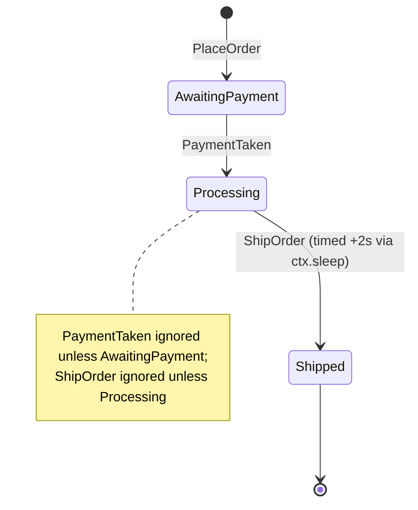

# Actor patterns

> **Audience:** Adopter · **Status:** stable · **Verified-against:** qb 3.0.0 (C++20 default, C++23 supported)

Compose the `qb::Actor` primitives into recurring designs: finite state machines, service registries, publish/subscribe, request/response with a timeout, supervision, and runtime dependency resolution.

This page is the **reference** of the three pattern pages: the *shapes* the engine supports and why each one works. [The patterns library](./patterns_library.md) is the **catalogue** of what qb already ships pre-built for those shapes, and [the patterns cookbook](../6_guides/patterns_cookbook.md) is the **recipes** — task-shaped walkthroughs that assemble them for a job.

**Prerequisites:** [Writing actors with qb::Actor](./actor.md), [Event messaging](./messaging.md) — **See also:** [The engine: Main and VirtualCore](./engine.md), [Coroutines](../3_qb_io/coroutines.md), [Patterns cookbook](../6_guides/patterns_cookbook.md)

This page builds on the `Actor` API rather than redefining it. The send primitives
(`push`, `send`, `broadcast`, `reply`, `forward`), `qb::ServiceActor`, `getService<T>()`, and
`qb::ICallback` are documented on [the actor page](./actor.md); the event types and pipe API on
[the messaging page](./messaging.md). What follows is how those pieces combine into patterns you
will reach for repeatedly.

## Concepts

Every pattern below rests on three invariants of the actor model, covered in full on [the threading
model page](../2_core_concepts/threading_model.md):

- **Single-writer state.** An actor's members are touched only by that actor's handlers, which run
  one at a time on one `VirtualCore` thread. State machines, registries, and subscription tables can
  therefore be plain C++ members with no locking.
- **Message-only coupling.** Actors never read each other's state. A request/response or pub/sub
  edge is a pair of events, not a shared pointer or a callback into another actor.
- **`kill()` only flags.** Termination is cooperative and deferred (`_alive = false`; destruction
  runs later under `VirtualCore` control), which is what makes supervision and graceful shutdown
  tractable.

The patterns also use two timing tools from `qb-io`:

- `spawn(f)` + `co_await ctx.sleep(delay)` is how anything happens *later*. The lambda takes a
  `qb::ScopedCoroContext` and runs under the actor's cancellation scope, which `kill()` cancels, so a
  pending sleep unwinds instead of resuming into a destroyed actor. Because it runs outside any handler
  it must capture **by value only, never `this`**, and come back through a self-addressed event: `ctx`
  carries the `ActorId`, not the address. `qb::io::async::callback(func, delay)` arms a similar timer
  but binds it to the *event loop*, not to any actor, so it fires whatever happened to the actor
  meanwhile; an `is_alive()` guard inside it cannot help, because reading `_alive` on a destroyed actor
  is already the invalid access. Keep it for work that must deliberately outlive its actor, and use
  `scoped_callback` held as an actor member when you want a cancellable handle.
- `Actor::time()` returns a per-iteration cached nanosecond timestamp — uniform within one handler.
  For a fresh reading use `qb::unix_nanos(qb::wall_now())` (`qb/system/time.h`).
<!-- src: qb/src/qb/core/Actor.h:1238-1239,1717-1719, qb/src/qb/core/Actor.cpp:205-208,283-289, qb/src/qb/io/async/io.h:312-318,343 -->

## The patterns library (`<qb/core/patterns.h>`)

Many of the designs below now ship **ready-made** as header-only free functions over the same
primitives — prefer them over hand-rolling, and reach for the mechanics on this page only to build
variants the library does not cover. They are all **core-local** (single-thread, no locking), and the
coroutine-side helpers are **cancel-on-kill**. Full signatures live in the API reference; runnable
recipes in the [patterns cookbook](../6_guides/patterns_cookbook.md).

| Need | Library API |
|------|-------------|
| Request / response (await a reply) | `co_await qb::ask(ctx, target, req, timeout)` with `qb::Request<Resp>` / `qb::answer` / `Actor::resolve_ask` |
| Bound a whole request chain | `qb::deadline` + `qb::deadline_in` / `qb::remaining` / `qb::ask_by` |
| Discover actors / liveness | `co_await qb::require<T>(ctx, timeout)` / `co_await qb::ping(ctx, target, timeout)` (zero boilerplate; works in `onInit`) |
| Idempotent (retry-safe) effects | `qb::answer_idempotent` + `qb::dedup_map` + a stable `idempotency_key` |
| Coalesce many events into batches | `qb::batcher<T>` (flush on count or time window) |
| Many replies for one request | `qb::ask_stream` → `qb::stream<E>` (+ `qb::StreamRequest`, `qb::yield_answer`, `qb::end_stream`; route chunks with `resolve_ask`) |
| Fan out & gather | `qb::ask_all` (incl. bounded sliding-window), `qb::ask_any`, `qb::ask_quorum` (k-of-N) |
| Retry with backoff | `qb::ask_retry` + `qb::retry_policy` (with `.jitter`) |
| Fail fast on a flaky dependency | `qb::ask_guarded` + `qb::CircuitBreaker` |
| Throttle a rate | `qb::rate_limiter` (alias `qb::token_bucket`) |
| Cap concurrency / isolate failures | `qb::bulkhead` |
| Compensating (saga) transaction | `qb::run_saga` + `qb::SagaScope` |
| Round-robin work distribution | `qb::WorkerPool` |
| Topic publish/subscribe (per core) | `qb::PubSub<Topic>` |
| Restart children on failure | `qb::Supervisor` + `qb::SupervisedActor` + `qb::restart_strategy` |

## Finite state machines

An actor is already a state machine: its members are the state, and its event handlers are the
transitions. Model the states with an `enum class`, store the current state as a member, and branch
on it inside each handler. Timed transitions (a brew finishing, a session expiring) are scheduled
with `spawn` + `co_await ctx.sleep(...)`, which posts a self-event when the sleep elapses — and is
cancelled if the actor is killed first.

```cpp
// src: derived from examples/01-actors/09-state-machine.cpp (scheduleAction)
#include <qb/actor.h>
#include <qb/io.h>
#include <qb/io/async.h>
#include <chrono>

struct PlaceOrder    : qb::Event { qb::string<128> details; };
struct PaymentTaken  : qb::Event {};
struct ShipOrder     : qb::Event {};

class OrderActor : public qb::Actor {
    enum class State { AwaitingPayment, Processing, Shipped };
    State           _state = State::AwaitingPayment;
    qb::string<128> _details;

public:
    qb::io::async::task<bool> onInit() override {
        registerEvent<PlaceOrder>(*this);
        registerEvent<PaymentTaken>(*this);
        registerEvent<ShipOrder>(*this);
        registerEvent<qb::KillEvent>(*this);
        co_return true;
    }

    void on(PlaceOrder const &ev) {
        _details = ev.details;
        _state   = State::AwaitingPayment;
    }

    void on(PaymentTaken const &) {
        if (_state != State::AwaitingPayment)
            return;                                 // guard: ignore out-of-state input
        _state = State::Processing;
        // Timed transition: post ShipOrder to self after the fulfillment delay.
        // Capture nothing — `ctx` carries our ActorId, and kill() cancels the sleep.
        spawn([](qb::ScopedCoroContext ctx) -> qb::io::async::task<void> {
            co_await ctx.sleep(std::chrono::seconds(2));
            ctx.template push<ShipOrder>();
        });
    }

    void on(ShipOrder const &) {
        if (_state == State::Processing)
            _state = State::Shipped;
    }

    void on(qb::KillEvent const &) { kill(); }
};
```

The `OrderActor` above is exactly this state machine:



Two rules keep an actor FSM correct:

- **Guard every transition on the current state.** Handlers can fire in any order; an unguarded
  handler that assumes a prior state corrupts the machine. The `if (_state != ...)` check above
  rejects events that arrive in the wrong state.
- **Drive timed transitions through `spawn` + `ctx.sleep` + a self-event**, never a blocking wait and
  never a bare `qb::io::async::callback`. That timer holds no claim on the actor, so it fires whether
  or not the actor is still there — and an `is_alive()` guard inside the closure is not a weaker fix,
  it is the same bug: `is_alive()` reads the actor's `_alive` member, so once the destructor has run,
  *evaluating the guard* is the read of freed memory. Nor is the killed-but-not-yet-reaped window the
  relevant one for a timed transition: `VirtualCore` reaps in the same or the next loop turn, seconds
  before a two-second timer. `ctx.sleep` closes this by construction, because `kill()` cancels the
  actor's coroutine scope; if you want a timer handle instead, hold a `scoped_callback` as a member so
  the actor's own destructor cancels it. See [Error handling — the two guards](../6_guides/error_handling.md#fire-and-forget-callbacks-outlive-their-captures)
  and [Capture safety](../5_core_io_integration/async_in_actors.md#capture-safety-the-actor-may-be-gone).
  <!-- src: qb/src/qb/core/Actor.cpp:205-208,283-289, qb/src/qb/core/VirtualCore.cpp:734,896 -->

For a larger machine, a `std::map<State, std::map<Input, Handler>>` transition table makes the
states and transitions explicit and keeps each handler small — see the full coffee-machine FSM in
`examples/01-actors/09-state-machine.cpp`.

## Service actors as per-core registries

A `qb::ServiceActor<Tag>` is a singleton per `VirtualCore` per `Tag` (defined on [the actor
page](./actor.md#services-one-per-core-per-tag)). That makes it the natural home for a per-core
shared resource — a logger, a metrics sink, a connection registry — that other actors on the same
core reach by type, and actors on other cores reach by computed id.

```cpp
// src: derived from qb/tests/core/system/event/service-event-ring.cpp
#include <qb/actor.h>
#include <qb/io.h>

struct LoggerTag {};   // unique, empty tag that names the service type

struct LogLine : qb::Event {
    qb::string<128> text;
    explicit LogLine(const char *t) : text(t) {}
};

class CoreLogger : public qb::ServiceActor<LoggerTag> {
public:
    qb::io::async::task<bool> onInit() override {
        registerEvent<LogLine>(*this);
        registerEvent<qb::KillEvent>(*this);
        co_return true;
    }

    void on(LogLine const &ev) {
        qb::io::cout() << "[core " << getIndex() << "] " << ev.text.c_str() << '\n';
    }

    void on(qb::KillEvent const &) { kill(); }
};
```

Register one instance per core, then reach it two ways:

```cpp
// Startup: at most one CoreLogger per core.
engine.addActor<CoreLogger>(0);
engine.addActor<CoreLogger>(1);
```

```cpp
// Same core — a typed pointer, resolved with no message hop.
if (auto *logger = getService<CoreLogger>())
    push<LogLine>(logger->id(), "hello from the same core");

// Any core — compute the service's ActorId for a target core, then send.
qb::ActorId logger_id = qb::Actor::getServiceId<LoggerTag>(target_core);
push<LogLine>(logger_id, "hello from another core");
```

`getService<T>()` returns the registered pointer on the **current** core, or `nullptr` if no such
service runs there. `getServiceId<Tag>(core)` computes the deterministic `ActorId` a
`ServiceActor<Tag>` would occupy on `core`; it does **not** verify that an instance is actually
registered there, so a send to an unpopulated core's service id is dropped by the router.

> **`getService<T>()` is not phase-gated, and that is deliberate.** Unlike `ActorHandle::get()` and
> `VirtualCore::findActor()`, it consults neither `is_active()` nor `is_alive()`. It hands back the
> pointer while the service's own async `onInit()` is still in flight (*Activating*), and after the
> service has been `kill()`ed but not yet reaped. That is what makes the bootstrap pattern work — a
> service legitimately looks itself or a peer up from inside its own `onInit()`. The cost is on you:
> the service you get back may not have finished initializing. If you need that guarantee, ask it
> (`push` an event, or `co_await qb::ask(...)`) rather than touching its state. A non-null pointer is
> therefore **not** evidence that the service is alive or ready.
<!-- src: qb/src/qb/core/Actor.h:603-613 (not phase-gated, by design); qb/src/qb/core/Actor.h:641-662 (the Activating inventory table) -->

> **Pitfall:** prefer sending events to the service's `id()` over calling its methods through the
> `getService<T>()` pointer. A direct call bypasses the event queue and runs synchronously inside
> your handler — acceptable for read-only accessors, but a re-entrancy hazard for anything that
> mutates the service or sends further events.

## Publish/subscribe through a broker

The broker pattern decouples publishers from subscribers: a broker actor owns a
`topic -> {subscriber ids}` table, subscribers register for topics, and publishers send to the
broker without knowing who (if anyone) will receive a message. Because the broker's table is plain
actor state, no synchronization is involved.

```cpp
// src: derived from examples/05-services/02-pubsub-broker/server/TopicManagerActor.h
#include <qb/actor.h>
#include <map>
#include <memory>
#include <set>
#include <string>

enum class Topic { Weather, News, Stocks };

// The body is boxed, not held by value. An event must be trivially RELOCATABLE:
// the runtime moves it with raw memcpy (the source pipe relocates what it already
// holds when it grows, reply/forward byte-recycle it, a cross-core hop copies it
// twice), and a short std::string points into its own inline buffer on libstdc++.
// A shared_ptr member carries only a heap pointer, so it survives relocation --
// and here it also lets one payload back every Delivery.
struct Subscribe   : qb::Event { Topic topic; qb::ActorId who; };
struct Unsubscribe : qb::Event { Topic topic; qb::ActorId who; };
struct Publish     : qb::Event { Topic topic; std::shared_ptr<const std::string> body; };
struct Delivery    : qb::Event { Topic topic; std::shared_ptr<const std::string> body; };

class Broker : public qb::Actor {
    std::map<Topic, std::set<qb::ActorId>> _subscribers;

public:
    qb::io::async::task<bool> onInit() override {
        registerEvent<Subscribe>(*this);
        registerEvent<Unsubscribe>(*this);
        registerEvent<Publish>(*this);
        registerEvent<qb::KillEvent>(*this);
        co_return true;
    }

    void on(Subscribe const &ev)   { _subscribers[ev.topic].insert(ev.who); }
    void on(Unsubscribe const &ev) { _subscribers[ev.topic].erase(ev.who); }

    void on(Publish const &ev) {
        auto it = _subscribers.find(ev.topic);
        if (it == _subscribers.end())
            return;
        for (qb::ActorId sub : it->second)        // fan out one Delivery per subscriber
            push<Delivery>(sub, Delivery{ .topic = ev.topic, .body = ev.body });
    }

    void on(qb::KillEvent const &) { kill(); }
};
```

A subscriber registers in `onInit()` and handles `Delivery`:

```cpp
class Subscriber : public qb::Actor {
    qb::ActorId _broker;
public:
    explicit Subscriber(qb::ActorId broker) : _broker(broker) {}

    qb::io::async::task<bool> onInit() override {
        registerEvent<Delivery>(*this);
        registerEvent<qb::KillEvent>(*this);
        push<Subscribe>(_broker, Subscribe{ .topic = Topic::Weather, .who = id() });
        co_return true;
    }

    void on(Delivery const &ev) { /* consume *ev.body */ }
    void on(qb::KillEvent const &) { kill(); }
};
```

Design notes:

- **A subscriber list is per-topic actor state**, so add and remove are ordinary `std::set`
  operations with no locking.
- **The fan-out is already zero-copy**, because the body is boxed: each `Delivery` copies a
  `shared_ptr` (one refcount bump), not the bytes. That is the same choice the relocation rule
  forces on you — a by-value `std::string` is not a valid event member on any path — so the safe
  shape and the fast shape coincide here. The `examples/05-services/02-pubsub-broker` sample pushes the
  same idea further: one shared-ownership `MessageContainer` holds the bytes and the events carry
  `std::string_view`s into it (a view is a pointer plus a length, so it relocates cleanly too).
- **Distinguish broker pub/sub from `broadcast<E>()`.** `broadcast` reaches *every* actor on every
  core unconditionally; the broker reaches exactly the actors that opted into a topic. Use
  `broadcast` for system-wide notices (shutdown, alerts), the broker for selective subscription.

The full demo — broker, multiple subscribers, a publisher, and a driver — is
`examples/05-services/02-pubsub-broker/`. For the SHIPPED bus rather than a hand-rolled table, see
`examples/04-patterns/01-pubsub.cpp` and [patterns_library.md](./patterns_library.md); the difference
is that `qb::PubSub<Topic>` keys on the event TYPE, while a broker like this one keys on a runtime
topic string.

## Request/response with a timeout

> **Prefer the library:** `co_await qb::ask(ctx, target, req, timeout)` (with `qb::Request<Resp>` /
> `qb::answer` / `Actor::resolve_ask`) does the correlation, timeout, and cancel-on-kill for you —
> see [the patterns library](#the-patterns-library-qbcorepatternsh) and the cookbook. The hand-rolled
> version below shows the underlying mechanics (and is the model for replies you must correlate
> outside a coroutine).

Actor messaging is one-way; a request/response exchange is two events plus a correlation id so the
requester can match a reply to the request it sent. Because a peer may never answer, a robust
requester also arms a timeout and treats whichever arrives first — the reply or the deadline — as
the resolution.

```cpp
#include <qb/actor.h>
#include <qb/io/async.h>
#include <chrono>
#include <cstdint>
#include <unordered_map>

struct Query  : qb::Event { std::uint64_t correlation; qb::string<64> key; };
struct Answer : qb::Event { std::uint64_t correlation; qb::string<64> value; };
struct QueryTimeout : qb::Event { std::uint64_t correlation; };

class Requester : public qb::Actor {
    qb::ActorId                            _service;
    std::uint64_t                          _next = 1;
    std::unordered_map<std::uint64_t, bool> _pending;   // correlation -> outstanding

public:
    explicit Requester(qb::ActorId service) : _service(service) {}

    qb::io::async::task<bool> onInit() override {
        registerEvent<Answer>(*this);
        registerEvent<QueryTimeout>(*this);
        registerEvent<qb::KillEvent>(*this);
        co_return true;
    }

    void ask(const char *key) {
        const std::uint64_t id_ = _next++;
        _pending[id_] = true;
        push<Query>(_service, Query{ .correlation = id_, .key = key });

        // Arm a deadline. The correlation id travels by value; nothing captures `this`,
        // and kill() cancels the sleep so a dead requester arms no timeout at all.
        spawn([id_](qb::ScopedCoroContext ctx) -> qb::io::async::task<void> {
            co_await ctx.sleep(std::chrono::milliseconds(500));
            ctx.template push<QueryTimeout>(QueryTimeout{ .correlation = id_ });
        });
    }

    void on(Answer const &ev) {
        if (_pending.erase(ev.correlation))         // first responder wins
            { /* success: use ev.value */ }
    }

    void on(QueryTimeout const &ev) {
        if (_pending.erase(ev.correlation))         // timeout only if still outstanding
            { /* failure: retry, fall back, or report */ }
    }

    void on(qb::KillEvent const &) { kill(); }
};
```

The responder answers the request's source, echoing the correlation id back in a distinct `Answer`
event so the requester can pair it. (`reply()` reuses the *same* event object and so keeps the same
type; use it when request and response share one event type, and a fresh event — as here — when they
differ. See [reply and forward](./actor.md#steady-state-sending).)

```cpp
class Service : public qb::Actor {
public:
    qb::io::async::task<bool> onInit() override {
        registerEvent<Query>(*this);
        registerEvent<qb::KillEvent>(*this);
        co_return true;
    }

    void on(Query const &q) {
        push<Answer>(q.getSource(), Answer{ .correlation = q.correlation, .value = lookup(q.key) });
    }

    void on(qb::KillEvent const &) { kill(); }
};
```

Key points:

- **The correlation id, not the event type, pairs a reply with its request.** Erasing the id from
  `_pending` on the first of {answer, timeout} makes the resolution idempotent: a late reply after a
  timeout (or vice versa) finds nothing to erase and is ignored.
- **The timeout is a self-event, not a blocking wait.** The requester keeps processing other events
  while the deadline runs on its own loop.
- **Bind the deadline to the requester, do not guard it.** `spawn` runs the sleep under the actor's
  cancellation scope, so killing the requester cancels the pending deadline. The older shape —
  `qb::io::async::callback([this, id_]{ if (is_alive()) … }, 500ms)` — does not work: that timer is
  owned by the loop, it fires long after `VirtualCore` has reaped the actor, and `is_alive()` reads an
  actor member, so evaluating the guard is itself the use-after-free.
  <!-- src: qb/src/qb/core/Actor.cpp:205-208,283-289 -->

For an exchange that fans out to an external network service, drive the I/O from a coroutine instead
of a peer actor — see [Coroutines](#coroutines-for-async-io) below.

## Referenced (child) actors

`addRefActor<T>(args...)` creates a child actor on the **same** `VirtualCore` and returns a
phase-aware `qb::ActorHandle<T>` (alias `RefActorHandle<T>`, `qb/core/Actor.h`). The parent does not
own the child — the child manages its own lifecycle and must `kill()` itself. The handle never
dangles: it caches the `ActorId` and resolves the live pointer on demand, so `get()` / `operator->`
return `nullptr` while the child is still *Activating* (async `onInit` in flight), after a failed
init, or once it died. The child has its own `ActorId` and receives events normally.

```cpp
// src: derived from qb/tests/core/system/actor/actor-add.cpp
auto helper = addRefActor<ChildHelper>(id());   // qb::ActorHandle<ChildHelper>
push<Task>(helper.id(), Task{ .a = 2, .b = 3 }); // always safe — stashed if still Activating
if (helper.ready())                              // sync-init child: ready at once
    helper->doSomethingDirect();                 // direct call only when active
// async-init child: if (co_await helper.ready_async(context())) helper->serve();
```

`helper.id()` is valid the instant `addRefActor` returns, so you can `push()` to it even before the
child finishes an async `onInit()` (the event is stashed and replayed FIFO once it activates). Gate
any **direct** method call on `helper.ready()`; never `operator->` a non-ready handle.

```cpp
// src: derived from qb/tests/core/system/actor/actor-add.cpp
#include <qb/actor.h>
#include <qb/io.h>

struct Task   : qb::Event { int a, b; };
struct Result : qb::Event { int value; };

class ChildHelper : public qb::Actor {
    qb::ActorId _parent;
public:
    explicit ChildHelper(qb::ActorId parent) : _parent(parent) {}

    qb::io::async::task<bool> onInit() override {
        registerEvent<Task>(*this);
        registerEvent<qb::KillEvent>(*this);
        co_return true;
    }

    void on(Task const &ev)        { push<Result>(_parent, Result{ .value = ev.a + ev.b }); }
    void on(qb::KillEvent const &)  { kill(); }
};

class Parent : public qb::Actor {
    qb::RefActorHandle<ChildHelper> _helper;
public:
    qb::io::async::task<bool> onInit() override {
        _helper = addRefHandle<ChildHelper>(id());
        if (!_helper)                               // onInit() failed inside the child
            co_return false;
        registerEvent<Result>(*this);
        registerEvent<qb::KillEvent>(*this);
        co_return true;
    }

    void dispatch(int a, int b) {
        push<Task>(_helper.id(), Task{ .a = a, .b = b });  // id() is always safe (stashed if Activating)
    }

    void on(Result const &ev) {
        qb::io::cout() << "result = " << ev.value << '\n';
    }

    void on(qb::KillEvent const &) {
        if (_helper.valid())
            push<qb::KillEvent>(_helper.id());      // ask the child to stop first
        kill();
    }
};
```

`ActorHandle<T>` surface (alias `RefActorHandle<T>`, `qb/core/Actor.h`):

| Member | Returns | Behavior |
|---|---|---|
| `valid()` | `bool` | True if the handle holds a valid `ActorId` (creation succeeded). |
| `id()` | `qb::ActorId` | The referenced actor's id — valid immediately, even while the child is still Activating (always safe to `push()` to). |
| `get()` | `T *` | Phase-aware: the live pointer **only if the actor is active** on the current core, else `nullptr` (while Activating, after a failed init, or once it died). |
| `ready()` | `bool` | `get() != nullptr` — the child is active and safe to call directly. |
| `ready_async(ctx, timeout = 5s)` | `task<bool>` | `co_await` until the (async-init) child becomes active or the timeout elapses. **The default `timeout` is `std::chrono::seconds{5}`** — a bare `co_await h.ready_async(context())` is bounded at 5 s, not unbounded. |
| `operator->()` | `T *` | `get()` with a debug-build assertion that it is non-null. |
| `operator*()` | `T &` | Dereference; undefined unless `ready()`. |
| `operator bool()` | `bool` | `== ready()`. |

> **Pitfall:** a `RefActorHandle` may be dereferenced only on the owning `VirtualCore` thread — the
> thread that created the child. It is a same-core construct: cross-core access is a logic error and
> is asserted in debug builds. To reach an actor on another core, send to its `id()`.

## Supervision

The framework has no built-in supervisor hierarchy; supervision is a pattern you assemble from the
primitives. A supervisor actor creates its workers, holds their ids (or `RefActorHandle`s for
same-core children), and decides what to do when one stops. Because actor creation and termination
both flow through the supervisor's handlers, restart and shutdown policies stay in one place.

```cpp
#include <qb/actor.h>
#include <vector>

struct WorkerDown : qb::Event { qb::ActorId who; };   // a worker reports its own exit

class Supervisor : public qb::Actor {
    std::vector<qb::RefActorHandle<Worker>> _workers;
    std::size_t                             _target = 4;

public:
    qb::io::async::task<bool> onInit() override {
        registerEvent<WorkerDown>(*this);
        registerEvent<qb::KillEvent>(*this);
        for (std::size_t i = 0; i < _target; ++i)
            spawnWorker();
        co_return true;
    }

    void spawnWorker() {
        auto h = addRefHandle<Worker>(id());          // same-core child, reports to id()
        if (h)
            _workers.push_back(h);
    }

    void on(WorkerDown const &ev) {
        // Restart policy: replace the worker that reported it is shutting down.
        spawnWorker();
        (void)ev;
    }

    void on(qb::KillEvent const &) {
        for (auto &h : _workers)                       // fan out shutdown to every child
            if (h.valid())                             // NOT `if (h)` — that is ready(), which is
                push<qb::KillEvent>(h.id());           // false while the child is still Activating
        kill();
    }
};
```

Supervision techniques:

- **Let workers report their own termination.** A worker pushes a `WorkerDown` to the supervisor in
  its `on(KillEvent const &)` before calling `kill()`. The supervisor sees the exit through an
  ordinary handler and applies its policy (restart, escalate, or let the pool shrink).
- **Cascade shutdown explicitly.** A supervisor's `on(KillEvent const &)` should push `KillEvent` to
  each worker before killing itself. There is no automatic parent/child teardown; the cooperative
  `kill()` model means you choose the order.
- **Prefer `RefActorHandle` for same-core workers** so a dereference after a worker has died yields
  `nullptr` rather than undefined behavior. For workers on other cores, hold their `ActorId`s and
  rely on the router dropping events to dead ids.

## Dependency resolution with require

> **Prefer the coroutine form:** `auto peers = co_await qb::require<Peer>(ctx, timeout)` returns the
> discovered `ActorId`s directly (and `co_await qb::ping(ctx, target, timeout)` probes one actor's
> liveness) — no `on(RequireEvent&)` handler needed — Actor routes replies by default. See the
> [patterns library](#the-patterns-library-qbcorepatternsh). The broadcast form below shows the
> underlying mechanics.

When an actor must find peers whose `ActorId`s are not known at construction time — services started
elsewhere, or instances spread across cores — `require<T...>()` performs runtime discovery.
`require<A, B>()` broadcasts a `PingEvent` for each listed type; every **live** actor of a listed
type replies with a `qb::RequireEvent` carrying its type tag (a reply *is* the liveness signal — there
is no status field). The requester overrides `on(RequireEvent&)` and uses `is<T>(event)` to identify
which type answered.

```cpp
// src: derived from qb/tests/core/system/actor/actor-dependency.cpp
#include <qb/actor.h>

class Client : public qb::Actor {
    qb::ActorId _logger;
    bool        _resolved = false;

public:
    qb::io::async::task<bool> onInit() override {
        registerEvent<qb::RequireEvent>(*this);
        registerEvent<qb::KillEvent>(*this);
        require<CoreLogger>();                  // broadcast a discovery ping for CoreLogger
        co_return true;
    }

    void on(qb::RequireEvent const &ev) {
        if (is<CoreLogger>(ev)) {               // a reply means the actor is alive
            _logger   = ev.getSource();         // the responding actor's id
            _resolved = true;
            push<LogLine>(_logger, "client resolved its logger");
        }
    }

    void on(qb::KillEvent const &) { kill(); }
};
```

Behavior and limits:

- **One response per live instance.** If several actors of the requested type exist (for example a
  per-core service across N cores), the requester receives N `RequireEvent`s. Handle each as it
  arrives — collect them into a list rather than assuming a single answer.
- **`require` is one-shot discovery, not a subscription.** It is a point-in-time broadcast: actors
  that start *after* the ping do not retroactively respond. Re-issue `require<T>()` if you need to
  rediscover later.
- **Discovery reports presence only.** A live actor replies; there is no automatic notification when
  a peer later terminates.
  Detect a peer's death through your own protocol (such as the `WorkerDown` report in the
  supervision pattern), not by waiting for a `Dead` `RequireEvent`.
- **Static wiring is simpler when ids are known up front.** If you create the dependencies yourself,
  capture their `ActorId`s from `addActor` and pass them through constructors (the
  `actor/actor-dependency.cpp` `ActorIdList` form). Reserve `require<T>()` for when you genuinely do
  not hold the ids.

## Coroutines for async I/O

When a handler needs a non-blocking external round trip (an HTTP call, a database query) before it
can answer, drive it from a coroutine launched with `spawn` (the recommended, *scoped* entry point —
cancelled when the actor is killed; use `spawn_detached` only when the work must outlive its actor).
The coroutine runs in an isolated context: it cannot touch actor members after the first `co_await`,
and it communicates results back through a `qb::CoroContext`, which captures the actor's `id()` by
value and survives the actor's destruction.

```cpp
// see ../3_qb_io/coroutines.md for the full coroutine model
void on(ApiRequest &req) {
    // Copy everything the coroutine needs BEFORE the first co_await.
    std::string url    = req.url;
    qb::ActorId sender = req.getSource();

    spawn([url, sender](auto ctx) -> qb::io::async::task<void> {
        auto response = co_await http_get(url);     // the actor may be destroyed here
        ctx.template push_to<ApiResponse>(sender, response.body);  // safe: ctx is self-contained
    });
}
```

`CoroContext` exposes `push<E>(...)` (to the spawning actor), `push_to<E>(dest, ...)` (to any
actor), `id()`, and `time()` (`qb/core/Actor.h`). These are the only operations valid after a
suspension point — never dereference `this` or an actor member past a `co_await`.

To shut down cleanly while coroutines are still in flight, check `has_active_coroutines()` and defer
termination until they drain:

```cpp
class ApiActor : public qb::Actor {
    // Lifetime-bound by ownership: destroying the actor destroys the handle,
    // which cancels the pending re-check.
    std::unique_ptr<qb::io::async::ScopedTimeout<std::function<void()>>> _drain_check;

public:
    void on(qb::KillEvent const &) {
        if (!has_active_coroutines()) {
            kill();
            return;
        }
        // Re-check shortly. `this` is sound here because the timer is a MEMBER and so
        // cannot outlive the actor; the guard covers the killed-but-not-yet-destroyed
        // window, where reading `_alive` is still valid.
        _drain_check = qb::io::async::scoped_callback(std::function<void()>{[this] {
            if (is_alive())
                push<qb::KillEvent>(id());
        }}, std::chrono::milliseconds(100));
    }
};
```

This is the one place on this page that does **not** use `spawn` + `ctx.sleep`, and the reason is
specific: `spawn` increments the very counter this handler is polling
(`active_coroutines_->fetch_add(1)`), so a spawned re-check would be work waiting for itself. A
member-owned `scoped_callback` gives the same lifetime binding without touching the count. A bare
`qb::io::async::callback` would give neither — its timer is owned by the loop, so it can fire after
the actor is gone, and the `is_alive()` guard above is only valid because the *handle* is a member.
<!-- src: qb/src/qb/core/VirtualCore.h:1188-1198, qb/src/qb/io/async/io.h:479-484 -->

The full coroutine contract — the dangling-closure rule, the `task<void>` type, the scheduler, and
the safety requirements — lives on the [Coroutines](../3_qb_io/coroutines.md) page. The footgun to
remember: capture state by value before the first `co_await`, and route everything through the
context.

## Pitfalls

- **Unguarded state transitions.** An FSM handler that assumes a prior state without checking
  `_state` corrupts the machine when events arrive out of order. Guard every transition.
- **Timer closures that re-enter a dead actor.** `qb::io::async::callback` keeps no claim on the
  actor: its timer is owned by the event loop and fires whatever happened to the actor meanwhile.
  `is_alive()` inside the closure is **not a partial fix, it is the same bug** — it reads the actor's
  `_alive` member, so a timer that survives `~Actor()` reads freed memory *at the guard itself*, and
  the branch never gets to run. Nor is the killed-but-not-yet-reaped window the one that matters for a
  delayed timer: `VirtualCore` reaps in the same or the next loop turn, long before a 100 ms — let
  alone a 5 s — timer. Bind the delay to the actor instead: `Actor::spawn()` + `co_await
  ctx.sleep(...)` + a self-addressed event (the frame is bound to a per-actor cancellation scope that
  `kill()` cancels), or own a `scoped_callback` handle as a member so the actor's own destructor
  cancels the watcher. See
  [Error handling](../6_guides/error_handling.md#fire-and-forget-callbacks-outlive-their-captures) and
  [Capture safety](../5_core_io_integration/async_in_actors.md#capture-safety-the-actor-may-be-gone).
  <!-- src: qb/src/qb/core/Actor.cpp:205-208,283-289, qb/src/qb/core/VirtualCore.cpp:734,896 -->
- **Passing a bare number as a delay.** `qb::io::async::callback(func, delay)` requires a
  `std::chrono::duration` (`std::chrono::seconds(2)`, `100ms` with `using namespace
  std::chrono_literals`), not a raw `double`.
- **Calling `handle->method()` on a non-active child.** `addRefActor<T>()` returns a phase-aware
  `qb::ActorHandle<T>` whose `get()`/`operator->` yield `nullptr` (debug `assert`) while the child is
  Activating, after a failed init, or once it died. Gate direct calls on `handle.ready()` (or
  `co_await handle.ready_async(context())`); prefer sending to `handle.id()`, which is always safe.
- **Cross-core `ActorHandle` use.** Handles are same-core only. Reach actors on other cores by
  `id()`.
- **Treating `require<T>()` as a live registry.** It is a one-shot ping answered only by actors
  alive at that instant. Presence *is* the status — `qb::RequireEvent` carries only `type` and the
  inherited `correlation_id`, and there is **no status field** to test. Re-issue it to rediscover,
  and detect deaths through your own protocol. (`qb/src/qb/core/Event.h:623`)
- **Calling a `getService<T>()` pointer's mutating methods.** A direct call runs synchronously and
  bypasses the queue — a re-entrancy hazard. Send an event to the service's `id()` instead.

## See also

- [Writing actors with qb::Actor](./actor.md) — the `Actor` API these patterns compose:
  `onInit`, handlers, send primitives, `ServiceActor`, `ICallback`, `kill`/`is_alive`.
- [Event messaging](./messaging.md) — defining events, `reply`/`forward`, pipes, correlation.
- [The engine: Main and VirtualCore](./engine.md) — `addActor`, core configuration, startup and
  shutdown ordering.
- [Coroutines](../3_qb_io/coroutines.md) — the full `spawn_detached` / `CoroContext` model.
- [Patterns cookbook](../6_guides/patterns_cookbook.md) — larger, end-to-end worked examples.
