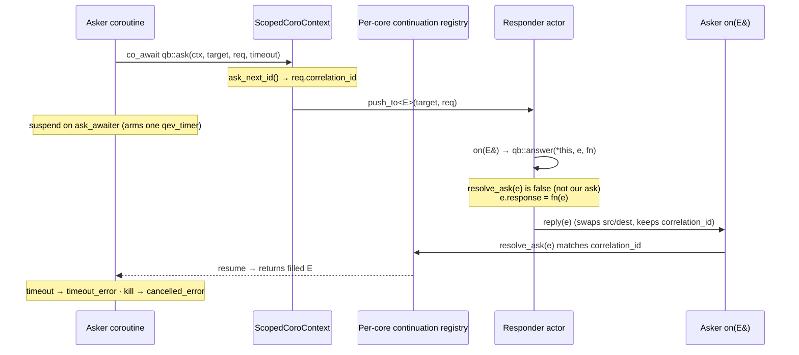
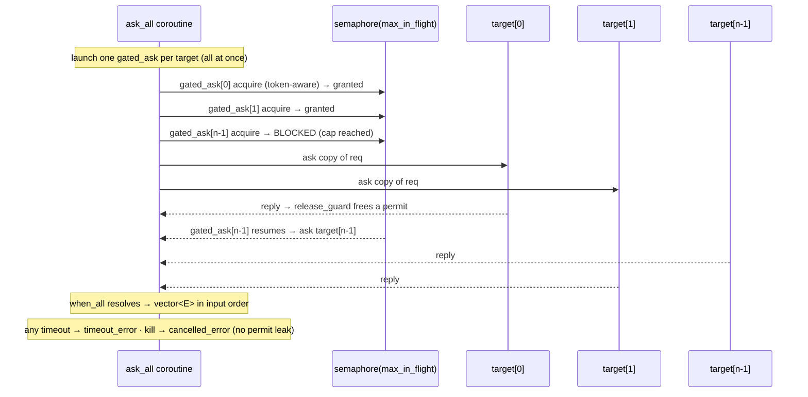

# Interaction patterns library

> **Audience:** Adopter · **Status:** stable · **Verified-against:** qb 3.0.0 (C++20 default, C++23 supported)

After reading this you can use the qb-core interaction patterns — request/reply, scatter-gather,
discovery, saga, pub/sub, supervision, resilience, streaming, routing, idempotency and aggregation —
to compose actor conversations without hand-writing correlation, timeout or cancellation logic.

**Prerequisites:** [Writing actors with `qb::Actor`](./actor.md), [qb-io coroutines](../3_qb_io/coroutines.md) — **See also:** [Actor patterns](./patterns.md), [Event messaging](./messaging.md), [The engine](./engine.md)

---

## Overview

The patterns library is a header-only set of free functions and helper types layered over the public
`qb::Actor` / `qb::ScopedCoroContext` kernel. The kernel holds no pattern logic of its own; every
pattern composes only public primitives
(`qb/include/qb/core/patterns.h:13-14`, `qb/include/qb/core/patterns/request.h:6-8`).

Include the whole library through one umbrella header:

```cpp
#include <qb/patterns.h>   // pulls Actor.h + Actor.tpp + core/patterns.h
```
<!-- src: qb/include/qb/patterns.h:18-20 -->

`qb/patterns.h` is self-sufficient: it includes `core/Actor.h`, `core/Actor.tpp` (the template
implementation) and `core/patterns.h` (`qb/include/qb/patterns.h:18-20`). The narrower
`#include <qb/core/patterns.h>` pulls the eleven module headers but assumes the Actor template
implementation is already visible (`qb/include/qb/core/patterns.h:27-37`); the test suite includes
`<qb/core/patterns.h>` alongside `<qb/actor.h>`
(`qb/source/core/tests/shared/ProbeResponders.h:29-30`).

### The model the library assumes

Every pattern is built on three kernel facts. Read the actor and coroutine docs for the full model;
this page only states what the patterns depend on.

- **Single-writer actors.** Each actor runs on one `VirtualCore` thread; its handlers and the
  coroutines it spawns execute cooperatively on that thread, so the per-core state these patterns
  hold (quorum tallies, dedup caches, breaker state) needs no locking
  (`qb/include/qb/core/patterns/scatter.h:151-153`, `qb/include/qb/core/patterns/idempotency.h:60-62`).
- **`ScopedCoroContext` carries the actor's id and cancellation scope.** A coroutine launched with
  `Actor::spawn(...)` receives a `qb::ScopedCoroContext` (`qb/include/qb/core/Actor.h:1134-1135`);
  inside `onInit()` or any handler you obtain the same context from `Actor::context()`
  (`qb/include/qb/core/Actor.h:1153`, `:1658-1662`). The context exposes the safe send surface
  (`push`, `push_to`, `broadcast`, `id`, `time` from `CoroContext`,
  `qb/include/qb/core/Actor.h:1298-1333`) plus the scope token and cancellation-aware `sleep`
  (`qb/include/qb/core/Actor.h:1584-1616`). **Never capture `this` past a `co_await`** — capture by
  value (`qb/include/qb/core/Actor.h:1567-1568`).
- **Correlation via `CorrelatedEvent`.** A reply is routed back to its waiting coroutine by a
  `correlation_id` carried at a fixed base-class offset. `qb::CorrelatedEvent` holds that id
  (`qb/include/qb/core/Event.h:321-323`); `qb::AskEvent` derives from it for the request/response API
  (`qb/include/qb/core/Actor.h:1347-1350`); `qb::PingEvent` / `qb::RequireEvent` derive from it for
  discovery (`qb/include/qb/core/Event.h:344-372`). Because the id sits at a uniform offset, the
  per-core continuation registry can deliver a reply even to an actor that is still *Activating*
  (inside `onInit()`), so the whole library works during init
  (`qb/include/qb/core/Event.h:314-319`).

### Cancellation, timeout and failure — the common contract

These behaviours are uniform across the awaitable patterns and are not repeated per family below:

- **Cancel-on-kill.** When an actor is killed/destroyed its scope token is cancelled; any pattern
  parked on a cancellation-aware wait wakes within the next loop iteration and throws
  `qb::io::async::cancelled_error` (`qb/include/qb/core/Actor.h:1561-1564`).
- **Timeouts throw.** A relative `qb::duration` timeout that elapses throws
  `qb::io::async::timeout_error`. A `timeout <= 0` waits indefinitely (until reply or kill)
  (`qb/include/qb/core/patterns/request.h:87-90`).
- **Run all pattern tests under `ASAN_OPTIONS=detect_leaks=0`** — cross-core asks leave a fixed,
  benign teardown residual (`qb/source/core/tests/system/coroutine/ask-patterns.cpp:37-38`).

---

## Request / reply (`request.h`)

**Solves:** a typed, awaitable round-trip to one actor — send a request, suspend, resume with the
response — without writing a reply handler that demultiplexes by hand.

A single event type round-trips the whole exchange. Derive your event from `qb::Request<Resp>`: the
base supplies the `response` slot and the `AskEvent` correlation id, you add the request fields
(`qb/include/qb/core/patterns/request.h:70-74`). The exchange type must satisfy `ask_event_type`
(derives from `qb::AskEvent`, copyable — it is copied per attempt by `ask_retry` and per target by
`ask_all`) (`qb/include/qb/core/patterns/request.h:46-47`).

### Public API

| Symbol | Signature | Source |
|---|---|---|
| `qb::Request<Resp>` | `struct Request : qb::AskEvent { using response_type = Resp; Resp response{}; }` | `request.h:70-74` |
| `qb::ask` | `task<E> ask(ScopedCoroContext ctx, ActorId target, E req, qb::duration timeout)` | `request.h:98-105` |
| `qb::answer` | `void answer(Actor &self, E &e, Fn &&fn) noexcept(noexcept(fn(e)))` | `request.h:186-193` |
| `qb::deadline` | `struct deadline { std::uint64_t at_ns{0}; }` | `request.h:115-117` |
| `qb::deadline_in` | `deadline deadline_in(ScopedCoroContext ctx, qb::duration dur) noexcept` | `request.h:120-124` |
| `qb::remaining` | `qb::duration remaining(deadline dl, ScopedCoroContext ctx) noexcept` | `request.h:127-131` |
| `qb::ask_by` | `task<E> ask_by(ScopedCoroContext ctx, ActorId target, E req, deadline dl)` | `request.h:154-161` |

- `ask` stamps a fresh correlation id, `push_to`s the request, and `co_await`s a single custom
  awaiter that handles correlation, timeout and cancel-on-kill with no detached helper
  (`request.h:98-105`). Returns `task<E>` resolving to the filled response event; throws
  `timeout_error` / `cancelled_error` (`request.h:86-93`).
- `answer` is the responder helper. It first calls `self.resolve_ask(e)` (routing any reply to one of
  the responder's own pending asks, returning early if so), then sets `e.response = fn(e)` and
  `reply()`s the same event back, preserving the correlation id (`request.h:186-193`). **`fn` must
  not throw** — a throwing handler terminates the worker core; carry failure in the response payload
  instead (`request.h:178-185`).
- `deadline` is an **absolute** completion time (epoch nanoseconds). Thread one `deadline` through a
  chain of `ask_by` calls to bound the *whole* chain end-to-end; each hop gets only the time the
  previous hop left (`request.h:108-117`, `:133-161`). `ask_by` throws `timeout_error` immediately,
  sending nothing, if the budget is already spent (`request.h:156-160`).

The asker routes replies by calling `resolve_ask(e)` in its own `on(E&)` handler
(`qb/include/qb/core/Actor.h:1173-1189`); one actor can both ask and answer the same event type
because `answer`/`resolve_ask` disambiguate replies from inbound requests
(`qb/source/core/tests/system/coroutine/ask-patterns.cpp:22-23`).

### Example — typed round-trip

```cpp
// Exchange: request carries `seq`, the Request<int> base carries `response`.
struct Ping : public qb::Request<int> {
    int seq{0};
    Ping() = default;
    explicit Ping(int s) : seq(s) {}
};

// Responder — answers synchronously: response == seq * 2.
class Echoer : public qb::Actor {
public:
    qb::io::async::task<bool> onInit() override {
        registerEvent<Ping>(*this);
        co_return true;
    }
    void on(Ping &p) {
        qb::answer(*this, p, [](Ping const &r) { return r.seq * 2; });
    }
};

// Asker — inside a spawned coroutine.
spawn([mkt](qb::ScopedCoroContext ctx) -> qb::io::async::task<void> {
    auto q = co_await qb::ask(ctx, mkt, Quote{21}, 500ms);
    g_typed_resp = q.response;             // 21 * 2 == 42
    ctx.push<PatternsDone>();
});
```
<!-- src: qb/source/core/tests/shared/AskResponders.h:57-76 (Ping, Echoer); qb/source/core/tests/system/coroutine/ask-patterns.cpp:172-176 (asker) -->

### Example — absolute deadline across a chain

```cpp
spawn([fast](qb::ScopedCoroContext c) -> qb::io::async::task<void> {
    const auto dl = qb::deadline_in(c, 100ms);            // whole budget
    // remaining(dl, c) reads back exactly 100'000'000 ns in the same loop pass.

    try {                                                  // already-spent budget → fail fast
        (void) co_await qb::ask_by(c, fast, Probe{5}, qb::deadline{0});
    } catch (const qb::io::async::timeout_error &) { /* no request was sent */ }

    auto r = co_await qb::ask_by(c, fast, Probe{5}, qb::deadline_in(c, 500ms));
    use(r.response);                                       // seq 5 + 1 == 6
});
```
<!-- src: qb/source/core/tests/system/patterns/request-deadline.cpp:63-82 -->

### Flow — `ask` → `answer` correlation


<!-- Reflects qb/include/qb/core/patterns/request.h:98-105,186-193 + qb/include/qb/core/Actor.h:1173-1189 -->

---

## Scatter-gather (`scatter.h`)

**Solves:** fan one request out to many actors and gather replies — all of them, the first, the
first `k`, or all under a concurrency cap.

### Public API

| Symbol | Signature | Source |
|---|---|---|
| `qb::ask_all` (all) | `task<std::vector<E>> ask_all(ScopedCoroContext, std::vector<ActorId> targets, E req, qb::duration timeout)` | `scatter.h:57-65` |
| `qb::ask_all` (bounded) | `task<std::vector<E>> ask_all(…, qb::duration timeout, std::size_t max_in_flight)` | `scatter.h:109-120` |
| `qb::ask_any` | `task<E> ask_any(ScopedCoroContext, std::vector<ActorId> targets, E req, qb::duration timeout)` | `scatter.h:138-147` |
| `qb::ask_quorum` | `task<std::vector<E>> ask_quorum(ScopedCoroContext, std::vector<ActorId> targets, std::size_t k, E req, qb::duration timeout)` | `scatter.h:242-282` |

- **`ask_all`** asks every target with a copy of `req` and awaits **all** replies, returned in input
  order; built on `when_all`. Throws `timeout_error` if **any** target fails to reply in time
  (`scatter.h:38-65`).
- **Bounded `ask_all`** caps concurrency at `max_in_flight` via a shared cancellation-aware
  `qb::io::async::semaphore` — a true sliding window (a new ask starts the instant one finishes).
  `max_in_flight == 0` (or `>= targets.size()`) is equivalent to the unbounded overload
  (`scatter.h:86-120`).
- **`ask_any`** races all targets and resolves with the **first** reply; losers are reclaimed
  immediately (their ask timers stopped) rather than lingering. Built on `when_any`
  (`scatter.h:122-147`).
- **`ask_quorum`** asks every target and resolves with the **first `k`** successful replies, in
  completion order (`k` clamped to `[1, targets.size()]`; empty vector if `k == 0` or no targets).
  Throws `timeout_error` (carrying the first underlying error) once the quorum is provably
  unreachable — i.e. `fail > total - need` (`scatter.h:219-282`). Surplus replies beyond `k` are
  dropped (`scatter.h:233-236`). Internally it spawns one detached collector per target into a
  shared `quorum_state`; the awaiter's destructor clears `st->cont` so a late collector cannot
  resume a reclaimed frame (`scatter.h:149-215`).

### Example — bounded scatter (`ask_all` with a cap)

```cpp
spawn([targets, cap](qb::ScopedCoroContext c) -> qb::io::async::task<void> {
    std::vector<Probe> r;
    if (cap == 0)
        r = co_await qb::ask_all(c, targets, Probe{10}, 2s);       // unbounded
    else
        r = co_await qb::ask_all(c, targets, Probe{10}, 2s, cap);  // ≤ cap in flight
    int s = 0;
    for (auto const &e : r) s += e.response;                       // N * (10+1)
    g_sum.store(s);
    qb::Main::stop();
});
```
<!-- src: qb/source/core/tests/system/patterns/aggregate-scatter.cpp:105-117 -->

### Example — quorum (first `k` of `n`)

```cpp
spawn([targets, k, to](qb::ScopedCoroContext c) -> qb::io::async::task<void> {
    try {
        auto r = co_await qb::ask_quorum(c, targets, k, Probe{10}, to);
        // r.size() == k, in completion order; each response == seq(10)+1.
    } catch (const qb::io::async::timeout_error &) {
        // quorum became unreachable (too many silent/failed targets)
    } catch (const qb::io::async::cancelled_error &) {
        // the asker was killed while parked
    }
});
```
<!-- src: qb/source/core/tests/system/patterns/aggregate-quorum.cpp:87-103 -->

### Flow — `ask_all` bounded sliding window


<!-- Reflects qb/include/qb/core/patterns/scatter.h:67-120 -->

---

## Discovery and liveness (`discovery.h`)

**Solves:** an awaitable replacement for the legacy fire-and-forget
`require<T>()` + `on(RequireEvent&)` + `is<T>()` dance — probe one actor, or discover all live actors
of a type within a time window.

### Public API

| Symbol | Signature | Source |
|---|---|---|
| `qb::ping` | `task<bool> ping(ScopedCoroContext ctx, ActorId target, qb::duration timeout = std::chrono::seconds{1})` | `discovery.h:184-196` |
| `qb::require<_Actor>` | `task<std::vector<ActorId>> require(ScopedCoroContext ctx, qb::duration timeout = std::chrono::milliseconds{200})` | `discovery.h:216-235` |

- **`ping`** sends a wildcard `PingEvent` (`type == 0`); any live actor replies. Returns `true` if
  `target` replied within `timeout`, else `false` (`discovery.h:172-196`).
- **`require<_Actor>`** broadcasts a typed `PingEvent` to every core and collects the `RequireEvent`
  replies for the whole window, returning the responders' ids (empty if none)
  (`discovery.h:198-235`).
- Replies are routed automatically by `Actor`'s default `on(RequireEvent&)` (which calls
  `resolve_require`) — **no handler boilerplate** (`qb/include/qb/core/Actor.h:455-470`). Both work
  inside `onInit()` because replies reach an *Activating* asker through the continuation registry
  (`discovery.h:181-183`, `:206-210`). Throws `cancelled_error` on kill; never throws on timeout
  (a timed-out `ping` returns `false`, a timed-out `require` returns the partial set)
  (`discovery.h:130-140`).

### Example

```cpp
spawn([target](qb::ScopedCoroContext c) -> qb::io::async::task<void> {
    bool alive = co_await qb::ping(c, target, 150ms);             // targeted liveness
    bool dead  = co_await qb::ping(c, qb::ActorId{}, 100ms);      // invalid id → false (timeout)
    auto found = co_await qb::require<DiscWorker>(c, 120ms);      // discover all live DiscWorkers
    use(found.size());
});
```
<!-- src: qb/source/core/tests/system/patterns/discovery-ping-require.cpp:82-87 -->

A plain actor answers discovery out of the box — the kernel auto-registers `PingEvent`, so a worker
needs no special handler to be discoverable
(`qb/source/core/tests/system/patterns/discovery-ping-require.cpp:54-61`).

---

## Saga orchestration (`saga.h`)

**Solves:** a sequence of steps where each step can register a compensating action; if a later step
fails, the registered compensations run in reverse order before the failure propagates.

### Public API

| Symbol | Signature | Source |
|---|---|---|
| `qb::SagaScope` | `class SagaScope { void on_compensate(Comp&&); std::size_t pending() const; task<void> compensate(); }` | `saga.h:44-88` |
| `qb::run_saga` | `task<void> run_saga(ScopedCoroContext ctx, Body body)` | `saga.h:115-132` |

- `run_saga` runs `body(ctx, saga)`. On success it returns with nothing to compensate. On a
  **non-cancellation** failure it captures the exception, runs `saga.compensate()` (the registered
  compensations in LIFO order), then re-throws the original failure (`saga.h:115-132`).
- A **`cancelled_error`** (the actor is being killed) is re-thrown **without** compensation — abort
  hard (`saga.h:123-124`).
- `compensate()` is best-effort: an exception thrown by one compensation is swallowed so the rest
  still run; but if a compensation throws `cancelled_error` (kill mid-rollback) the remaining
  compensations are skipped (`saga.h:65-87`). A compensation is any callable returning
  `task<void>` — typically another `qb::ask(...)` (`saga.h:38-43`).

### Example

```cpp
co_await qb::run_saga(ctx, [ok, silent](qb::ScopedCoroContext c, qb::SagaScope &saga)
                           -> qb::io::async::task<void> {
    (void) co_await qb::ask(c, ok, SagaQ{1}, 500ms);              // step 1
    saga.on_compensate([c, ok]() -> qb::io::async::task<void> {
        (void) co_await qb::ask(c, ok, SagaQ{2}, 500ms);          // undo step 1 (runs LAST)
    });
    (void) co_await qb::ask(c, ok, SagaQ{3}, 500ms);              // step 2
    saga.on_compensate([c, silent]() -> qb::io::async::task<void> {
        (void) co_await qb::ask(c, silent, SagaQ{4}, 500ms);      // undo step 2 (runs FIRST)
    });
    (void) co_await qb::ask(c, silent, SagaQ{5}, 30ms);           // step 3 TIMES OUT → rollback
});
```
<!-- src: qb/source/core/tests/system/patterns/saga-cancel.cpp:103-116 -->

---

## Resilience (`resilience.h`)

**Solves:** make a call survive transient failures — retry with backoff, fail fast through a circuit
breaker, throttle with a token bucket, and isolate with a concurrency bulkhead.

### Public API

| Symbol | Signature | Source |
|---|---|---|
| `qb::retry_policy` | `struct { int max_attempts=3; qb::duration backoff=50ms; double multiplier=2.0; qb::duration max_backoff=1s; double jitter=0.0; }` | `resilience.h:46-60` |
| `qb::ask_retry` | `task<E> ask_retry(ScopedCoroContext, ActorId target, E req, qb::duration timeout, qb::retry_policy policy = {})` | `resilience.h:425-444` |
| `qb::CircuitBreaker` | `class { enum class State{closed,open,half_open}; CircuitBreaker(unsigned failure_threshold, qb::duration cooldown); bool allow(uint64_t now_ns); void on_success(); void on_failure(uint64_t); void on_abandoned(uint64_t); State state() const; unsigned failure_count() const; }` | `resilience.h:120-216` |
| `qb::circuit_open_error` | `struct circuit_open_error : std::runtime_error` | `resilience.h:102-105` |
| `qb::ask_guarded` | `task<E> ask_guarded(ScopedCoroContext, std::shared_ptr<CircuitBreaker> breaker, ActorId target, E req, qb::duration timeout)` | `resilience.h:463-485` |
| `qb::rate_limiter` | `class { rate_limiter(double capacity, qb::duration per_token); bool try_acquire(uint64_t now_ns); task<void> acquire(ScopedCoroContext); double tokens(uint64_t now_ns); }` | `resilience.h:239-306` |
| `qb::bulkhead` | `class { explicit bulkhead(std::size_t max_concurrent); class slot; task<slot> enter(ScopedCoroContext); bool try_enter(slot&); std::size_t available() const; }` | `resilience.h:331-404` |

- **`ask_retry`** retries only `timeout_error` (a kill propagates at once). The wait before retry `n`
  is `min(backoff * multiplier^(n-1), max_backoff)`, computed overflow-safely; backoff waits are
  cancellation-aware (`ctx.sleep`). Throws `timeout_error` after `max_attempts` tries
  (`resilience.h:38-60`, `:406-444`). `jitter` in `[0,1]` draws the actual wait uniformly from
  `[backoff*(1-jitter), backoff]` to desynchronize retry storms (`resilience.h:51-59`).
- **`CircuitBreaker`** is a timer-less single-thread state machine the caller drives with
  `ctx.time()`. It trips **open** after `failure_threshold` consecutive failures, fails fast during
  `cooldown`, then admits exactly **one** half-open trial; a success closes it, a failure re-opens it
  (`resilience.h:107-160`). `on_abandoned` releases a half-open trial whose caller was killed so the
  breaker is not wedged (`resilience.h:182-196`). Hold it by `std::shared_ptr` so a coroutine can
  capture it by value and outlive its actor (`resilience.h:115-118`).
- **`ask_guarded`** fails fast with `circuit_open_error` (sending nothing) when the breaker is open;
  otherwise it records the outcome — success closes the breaker, a timeout/other error is a failure
  that may trip it, and a kill is **not** counted as a failure (it calls `on_abandoned`)
  (`resilience.h:446-485`).
- **`rate_limiter`** is a token bucket: starts full with `capacity` tokens, regenerates one every
  `per_token`. `acquire(ctx)` waits (cancellation-aware) when empty; `try_acquire(now_ns)` is the
  non-blocking probe (`resilience.h:221-306`).
- **`bulkhead`** caps concurrent operations. `enter(ctx)` returns an RAII `slot` that frees the
  permit on scope exit, waiting (cancellation-aware) when full; `try_enter` is non-blocking. Built on
  the cancel-aware `semaphore`, so a killed actor parked on a full bulkhead unwinds without leaking a
  slot (`resilience.h:311-404`).

### Example — retry, and a breaker-guarded ask

```cpp
// Retry with backoff (capture by value).
spawn([t, attempts](qb::ScopedCoroContext ctx) -> qb::io::async::task<void> {
    try {
        auto r = co_await qb::ask_retry(ctx, t, Ping{7}, kAskTimeout, make_policy(attempts));
        use(r.response);
    } catch (const qb::io::async::timeout_error &) { /* all attempts exhausted */ }
});

// Circuit-breaker-guarded ask — the breaker is shared by shared_ptr and captured by value.
auto breaker = std::make_shared<qb::CircuitBreaker>(2u, 10s);   // opens after 2 failures
spawn([b = breaker, t, n](qb::ScopedCoroContext ctx) -> qb::io::async::task<void> {
    for (int i = 0; i < n; ++i) {
        try {
            auto r = co_await qb::ask_guarded(ctx, b, t, Ping{i}, kAskTimeout);
            (void) r;
        } catch (const qb::circuit_open_error &)        { /* failed fast, no request sent */ }
        catch (const qb::io::async::timeout_error &)    { /* counted as a breaker failure */ }
    }
});
```
<!-- src: qb/source/core/tests/system/coroutine/coroutine-resilience.cpp:135-150 (ask_retry); :346-360,371 (ask_guarded) -->

### Example — rate limiter and bulkhead

```cpp
// Throttle: burst 2, then 1 token / 15ms — all four acquires complete (throttled, not dropped).
spawn([](qb::ScopedCoroContext c) -> qb::io::async::task<void> {
    auto rl = std::make_shared<qb::rate_limiter>(2.0, 15ms);
    for (int i = 0; i < 4; ++i) {
        co_await rl->acquire(c);                 // first 2 immediate, next 2 wait
        do_work();
    }
});

// Bulkhead: at most 2 concurrent ops; the slot frees on scope exit.
auto bh = std::make_shared<qb::bulkhead>(2);
spawn([bh](qb::ScopedCoroContext c) -> qb::io::async::task<void> {
    auto slot = co_await bh->enter(c);           // waits while 2 are already in flight
    co_await c.sleep(15ms);
});                                              // slot released here
```
<!-- src: qb/source/core/tests/system/patterns/resilience-rate-limiter.cpp:56-64; qb/source/core/tests/system/patterns/resilience-bulkhead.cpp:64-74 -->

---

## Streaming (`streaming.h`)

**Solves:** a request that yields **many** replies — the responder pushes chunks for one request and
the asker drains them one at a time until end-of-stream.

### Public API

| Symbol | Signature | Source |
|---|---|---|
| `qb::StreamRequest<Chunk>` | `struct StreamRequest : qb::AskEvent { using chunk_type = Chunk; Chunk chunk{}; bool stream_done = false; }` | `streaming.h:59-64` |
| `qb::stream<E>` | `class { stream(uint64_t, shared_ptr<…>, qb::duration); stream_next_awaiter<E> next(); }` (move-only) | `streaming.h:263-301` |
| `qb::stream_overflow_error` | `struct stream_overflow_error : std::runtime_error` | `streaming.h:90-93` |
| `qb::ask_stream` | `stream<E> ask_stream(ScopedCoroContext, ActorId target, E req, qb::duration timeout = std::chrono::seconds{5}, std::size_t capacity = 256)` | `streaming.h:322-342` |
| `qb::yield_answer` | `void yield_answer(Actor &self, E const &request, typename E::chunk_type chunk)` | `streaming.h:352-359` |
| `qb::end_stream` | `void end_stream(Actor &self, E const &request)` | `streaming.h:368-374` |

- `ask_stream` sends the request (its `correlation_id` is the stream id) and returns a `stream<E>`.
  Drain it with `while (auto c = co_await s.next()) use(c->chunk);` — `next()` yields each chunk in
  FIFO order, then `std::nullopt` at end-of-stream (`streaming.h:303-342`).
- The responder pushes chunks with `yield_answer(self, request, chunk)` and signals completion with
  `end_stream(self, request)` (`streaming.h:344-374`). Chunks are `AskEvent`s, so the asker routes
  them via `resolve_ask(e)` in its `on(E&)` (`streaming.h:317-320`).
- `next()` throws `timeout_error` if no chunk arrives within the **per-chunk** timeout,
  `cancelled_error` on kill, and `stream_overflow_error` if the responder outran the buffer (a loud
  failure, not a silent drop) (`streaming.h:285-295`, `:124-135`). Works inside `onInit()`
  (`streaming.h:317-318`).

### Example

```cpp
struct Feed : qb::StreamRequest<int> { int count{0}; };

// Producer — emits `count` chunks then ends the stream.
void on(Feed &e) {
    for (int i = 0; i < e.count; ++i)
        qb::yield_answer(*this, e, i * 10);     // chunks 0,10,20,…
    qb::end_stream(*this, e);
}

// Consumer — drains chunks one at a time.
spawn([prod, count, to](qb::ScopedCoroContext c) -> qb::io::async::task<void> {
    Feed f; f.count = count;
    auto s = qb::ask_stream(c, prod, f, to);
    try {
        while (auto chunk = co_await s.next())
            sum += chunk->chunk;                // 0+10+20+30+40 == 100
    } catch (const qb::io::async::timeout_error &) { /* no end marker in time */ }
      catch (const qb::io::async::cancelled_error &) { /* killed while parked */ }
});
```
<!-- src: qb/source/core/tests/system/patterns/streaming-ask-stream.cpp:53-119 -->

---

## Pub/sub (`pubsub.h`)

**Solves:** a per-core publish/subscribe bus for one topic event type — no coroutine required.

### Public API

| Symbol | Signature | Source |
|---|---|---|
| `qb::PubSub<Topic>` | `class PubSub : public qb::ServiceActor<PubSub<Topic>>` | `pubsub.h:61-62` |
| `PubSub::subscribe` | `void subscribe(ActorId who)` (idempotent) | `pubsub.h:81-98` |
| `PubSub::unsubscribe` | `void unsubscribe(ActorId who)` | `pubsub.h:99-103` |
| `PubSub::publish` | `template <class... Args> void publish(Args const &...args)` | `pubsub.h:124-150` |
| `PubSub::subscriber_count` | `std::size_t subscriber_count() const noexcept` | `pubsub.h:117-122` |

`PubSub<Topic>` is a `ServiceActor` (one instance per `VirtualCore`); add it with
`main.addActor<qb::PubSub<Topic>>(coreId)`. Same-core actors reach it via
`getService<qb::PubSub<Topic>>()`. A subscriber calls `subscribe(id())` (and registers a `Topic`
handler); a publisher calls `publish(args…)`, which builds a `Topic{args…}` and pushes a copy to
every current subscriber. **Per-core by design** — a publication reaches subscribers on the bus's own
core only; add a bus per core for cross-core topics (`pubsub.h:36-40`).

### Example

```cpp
// Subscriber onInit (same core as the bus):
registerEvent<Tick>(*this);
getService<qb::PubSub<Tick>>()->subscribe(id());

// Publisher (same core):
auto *bus = getService<qb::PubSub<Tick>>();
for (int i = 1; i <= publications; ++i)
    bus->publish(i);                            // builds Tick{i}, fans out to all subscribers

// Wiring (the bus is added first):
main.addActor<qb::PubSub<Tick>>(0);
```
<!-- src: qb/source/core/tests/system/patterns/pubsub-fanout.cpp:120-121,186-188,202 -->

---

## Supervision (`supervisor.h`)

**Solves:** restart child actors when they terminate, with selectable restart strategies and an
optional restart-intensity cap — no coroutine required.

### Public API

| Symbol | Signature | Source |
|---|---|---|
| `qb::restart_strategy` | `enum class { one_for_one, one_for_all, rest_for_one }` | `supervisor.h:38-42` |
| `qb::ChildDown` | `struct ChildDown : qb::Event { std::size_t slot; std::uint64_t generation; ChildDown(std::size_t,std::uint64_t); }` | `supervisor.h:51-57` |
| `qb::SupervisedActor` | `class SupervisedActor : public qb::Actor { SupervisedActor(ActorId,std::size_t,std::uint64_t); ActorId supervisor() const; void notify_supervisor_down() const; void stop(); }` | `supervisor.h:70-99` |
| `qb::Supervisor` | `class Supervisor : public qb::Actor` | `supervisor.h:121-266` |
| `Supervisor` ctor | `Supervisor(restart_strategy, std::size_t child_count, unsigned max_restarts = 0, qb::duration restart_window = qb::duration::zero())` | `supervisor.h:130-135` |
| `Supervisor::spawn_child` | `virtual ActorId spawn_child(std::size_t slot, std::uint64_t generation) = 0` | `supervisor.h:206-212` |
| `Supervisor::on_escalate` | `virtual void on_escalate()` (default no-op) | `supervisor.h:214-216` |
| `Supervisor::child` / `restarts` / `child_count` | `ActorId child(std::size_t) const · unsigned restarts() const · std::size_t child_count() const` | `supervisor.h:190-204` |

- Override `spawn_child(slot, generation)` to create child `slot` with
  `addRefActor<Child>(id(), slot, generation, …)` where `Child` derives from `SupervisedActor`. A
  child calls `stop()` to terminate cooperatively (it sends `ChildDown`, then `kill()`s itself); the
  supervisor restarts it per the strategy, bumping each restarted slot's **generation** so stale
  `ChildDown`s are ignored (`supervisor.h:104-120`, `:150-171`).
- `one_for_one` restarts only the dead child; `one_for_all` restarts every child; `rest_for_one`
  restarts the dead child and every child started after it (`supervisor.h:38-42`, `:159-170`).
- `max_restarts` (0 = unlimited) caps restart intensity and calls `on_escalate()` past the cap —
  cumulative, or, with a non-zero `restart_window`, as a sliding-window "N restarts within T" rule
  (`supervisor.h:104-120`, `:224-244`).
- Killing the supervisor tears down its children first (sending each a `KillEvent`, then `kill()`ing
  itself), so children are never orphaned; `Main::stop()` / `SIGINT` already broadcast to every actor
  (`supervisor.h:173-188`).
- **Cooperative:** a child that dies *without* calling `stop()` (e.g. a failed `onInit`) is not
  auto-detected — supervision keys off the `ChildDown` notification (`supervisor.h:118-120`).

### Example

```cpp
class TestWorker : public qb::SupervisedActor {
    qb::ActorId _coord;
    std::size_t _slot;
public:
    TestWorker(qb::ActorId sup, std::size_t slot, std::uint64_t gen, qb::ActorId coord)
        : qb::SupervisedActor(sup, slot, gen), _coord(coord), _slot(slot) {}
    qb::io::async::task<bool> onInit() override {
        registerEvent<Crash>(*this);
        push<SpawnAck>(_coord, _slot, id(), supervisor());
        co_return true;
    }
    void on(Crash &) { stop(); }                // notify supervisor + kill → triggers a restart
};

class TestSupervisor : public qb::Supervisor {
    qb::ActorId _coord;
public:
    TestSupervisor(qb::restart_strategy strat, std::size_t count, qb::ActorId coord)
        : qb::Supervisor(strat, count), _coord(coord) {}
    qb::io::async::task<bool> onInit() override {
        registerEvent<TriggerCrash>(*this);
        co_return co_await qb::Supervisor::onInit();   // registers ChildDown + spawns children
    }
protected:
    qb::ActorId spawn_child(std::size_t slot, std::uint64_t generation) override {
        return addRefActor<TestWorker>(id(), slot, generation, _coord).id();
    }
};
```
<!-- src: qb/source/core/tests/system/patterns/supervisor-strategies.cpp:193-246 -->

A subclass that overrides `onInit()` must `co_await qb::Supervisor::onInit()` — the base registers
`ChildDown` and `KillEvent` and spawns the initial children
(`qb/include/qb/core/patterns/supervisor.h:137-148`,
`qb/source/core/tests/system/patterns/supervisor-strategies.cpp:227-231`).

---

## Routing (`routing.h`)

**Solves:** distribute work across a pool of worker actors — round-robin or sticky-by-key — with a
small, allocation-light helper. No coroutine required.

### Public API

| Symbol | Signature | Source |
|---|---|---|
| `qb::WorkerPool` | `class { WorkerPool(); explicit WorkerPool(std::vector<ActorId>); void add(ActorId); void remove(ActorId); bool empty() const; std::size_t size() const; const std::vector<ActorId>& workers() const; ActorId next(); ActorId for_key(std::uint64_t) const; }` | `routing.h:48-100` |

`WorkerPool` holds a list of worker `ActorId`s and a round-robin cursor. The actor picks a worker and
`push`es to it: `pool.next()` (round-robin), `pool.for_key(k)` (sticky — the same key always maps to
the same worker until the pool size changes), or iterate `workers()` to broadcast. It does **not**
own the workers or track liveness — pair it with discovery/supervision if workers come and go.
`next()` and `for_key()` require a non-empty pool (asserted) (`routing.h:33-99`).

### Example

```cpp
qb::WorkerPool pool{_workers};
for (int i = 0; i < kJobs; ++i)
    push<Job>(pool.next(), i);                   // 9 jobs / 3 workers → 3 each, in delivery order
// Sticky-by-key:
push<Session>(pool.for_key(userId), s);          // same user → same worker
```
<!-- src: qb/source/core/tests/system/patterns/routing-dispatch.cpp:125-128 + qb/include/qb/core/patterns/routing.h:42-46 -->

---

## Idempotency (`idempotency.h`)

**Solves:** responder-side request de-duplication so a retried request runs its side effect at most
once.

### Public API

| Symbol | Signature | Source |
|---|---|---|
| `qb::idempotent_event` | `concept` — an `ask_event_type` that also has `e.response` and `e.idempotency_key` | `idempotency.h:48-52` |
| `qb::dedup_map<Key,Resp>` | `class { explicit dedup_map(std::size_t capacity = 1024); const Resp* find(const Key&); void put(const Key&, Resp); bool contains(const Key&) const; std::size_t size() const; std::size_t capacity() const; void clear(); }` | `idempotency.h:64-133` |
| `qb::answer_idempotent` | `void answer_idempotent(Actor &self, E &e, Cache &cache, Fn &&fn)` | `idempotency.h:158-179` |

Because `ask_retry` re-sends a request with a fresh correlation id per attempt, a reply lost to a
timeout would make the responder run its effect twice. Carry a **stable** `idempotency_key` on the
request (added to your `Request<Resp>` subtype) and let the responder de-duplicate by it
(`idempotency.h:1-9`, `:40-52`).

- `answer_idempotent` (1) routes any reply via `resolve_ask(e)`, (2) for a non-default key already in
  the cache, replies the cached response **without** running `fn`, otherwise (3) runs `fn`, caches
  the result, and replies. A default-valued key (`{}`) bypasses the cache — always runs `fn`
  (`idempotency.h:135-179`).
- `dedup_map` is a bounded **LRU** cache (`find` promotes to most-recently-used; inserting past
  `capacity` evicts the least-recently-used entry). Core-local, no locking — use it as a responder
  member (`idempotency.h:54-133`).

### Example

```cpp
struct Charge : qb::Request<int> { std::uint64_t idempotency_key{0}; int amount{0}; };

class IdemBank : public qb::Actor {
    qb::dedup_map<std::uint64_t, int> _seen{16};
public:
    qb::io::async::task<bool> onInit() override { registerEvent<Charge>(*this); co_return true; }
    void on(Charge &e) {
        qb::answer_idempotent(*this, e, _seen, [](Charge const &r) {
            return r.amount * 10;                // the side effect — runs at most once per non-zero key
        });
    }
};
```
<!-- src: qb/source/core/tests/system/patterns/idempotency-answer.cpp:49-71 -->

---

## Aggregation (`aggregate.h`)

**Solves:** coalesce a stream of small items into batches, flushed on a count or time trigger, to
amortize a costly per-item action.

### Public API

| Symbol | Signature | Source |
|---|---|---|
| `qb::batcher<T>` | `class { batcher(std::size_t max, qb::duration window, std::function<void(std::vector<T>&&)> on_flush); void add(ScopedCoroContext ctx, T item); void flush(); std::size_t pending() const; }` | `aggregate.h:65-149` |

`batcher` flushes the whole buffered vector (running `on_flush(std::vector<T>&&)` once) as soon as
either `max` items are buffered or `window` elapses since the first item of the batch — whichever
comes first (`window <= 0` ⇒ size-only, no timer). The window timer is a cancellation-aware coroutine
bound to the actor scope (`ctx`), so a killed actor **drops** the pending flush (buffered items are
not flushed — call `flush()` from a shutdown handler to drain). Core-local, no locking
(`aggregate.h:40-115`).

Hold it as an **actor member**. Unlike the resilience helpers (captured by value into a coroutine), a
`batcher` is used synchronously from handlers and `on_flush` **may safely reference the actor**
(`[this]`): the scope-bound timer guarantees the flush never fires after the actor is gone
(`aggregate.h:53-63`).

### Example

```cpp
class BatchCountActor : public qb::Actor {
    qb::batcher<int> _batch{3, 5s, [](std::vector<int> &&b) { db_write(std::move(b)); }};
public:
    qb::io::async::task<bool> onInit() override {
        for (int i = 0; i < 7; ++i)
            _batch.add(context(), i);            // flushes synchronously at 3 and at 6
        // pending() == 1 here (item #7 buffered; the 5s window has not fired)
        co_return true;
    }
};
```
<!-- src: qb/source/core/tests/system/patterns/aggregate-batcher.cpp:66-81 -->

---

## Using patterns inside `onInit()`

The awaitable patterns work during actor activation: obtain the context with `Actor::context()` and
`co_await` directly in `onInit()`. Replies reach the still-*Activating* asker through the
continuation registry (`qb/include/qb/core/Actor.h:1137-1153`,
`qb/include/qb/core/Event.h:314-319`). The init suite exercises `ask`, `ask_retry`, `ask_all`,
`ask_any`, `ask_guarded`, `ask_quorum`, `ask_by`, `run_saga` and `rate_limiter` all inside `onInit()`
(`qb/source/core/tests/system/init/init-patterns.cpp:105-107,166,203,256,289,321,361,451,496`).

```cpp
qb::io::async::task<bool> onInit() override {
    auto r = co_await qb::ask(context(), _peer, Cfg{1}, 30ms);   // ask during activation
    co_return true;
}
```
<!-- src: qb/source/core/tests/system/init/init-patterns.cpp:105-107 -->

---

## When to use which pattern

| Goal | Pattern | Entry point |
|---|---|---|
| One typed round-trip to one actor | request/reply | `qb::ask` + `qb::answer` (`request.h:98,186`) |
| Bound the total latency of a request chain | request/reply | `qb::ask_by` + `qb::deadline` (`request.h:154,115`) |
| Ask many, need every reply | scatter-gather | `qb::ask_all` (`scatter.h:57`) |
| Ask many, fan out without overwhelming a downstream | scatter-gather | `qb::ask_all(…, max_in_flight)` (`scatter.h:109`) |
| Ask many, fastest reply wins (hedged) | scatter-gather | `qb::ask_any` (`scatter.h:138`) |
| Ask many, need a majority / first `k` | scatter-gather | `qb::ask_quorum` (`scatter.h:242`) |
| Is an actor alive? | discovery | `qb::ping` (`discovery.h:184`) |
| Find all live actors of a type | discovery | `qb::require<T>` (`discovery.h:216`) |
| Multi-step workflow with rollback | saga | `qb::run_saga` + `qb::SagaScope` (`saga.h:115,44`) |
| Survive transient timeouts | resilience | `qb::ask_retry` (`resilience.h:425`) |
| Fail fast when a dependency is down | resilience | `qb::ask_guarded` + `qb::CircuitBreaker` (`resilience.h:463,120`) |
| Throttle call rate | resilience | `qb::rate_limiter` (`resilience.h:239`) |
| Cap concurrent calls to a resource | resilience | `qb::bulkhead` (`resilience.h:331`) |
| One request, many replies | streaming | `qb::ask_stream` + `qb::yield_answer` / `qb::end_stream` (`streaming.h:322,352,368`) |
| Fan an event to many subscribers (per core) | pub/sub | `qb::PubSub<Topic>` (`pubsub.h:62`) |
| Restart child actors on failure | supervision | `qb::Supervisor` + `qb::SupervisedActor` (`supervisor.h:121,70`) |
| Distribute work across workers | routing | `qb::WorkerPool` (`routing.h:48`) |
| Run a retried side effect at most once | idempotency | `qb::answer_idempotent` + `qb::dedup_map` (`idempotency.h:158,64`) |
| Batch small items into one costly action | aggregation | `qb::batcher` (`aggregate.h:65`) |

---

## Pitfalls

- **`answer`'s `fn` must not throw.** A throwing actor handler terminates the worker core; there is no
  per-event exception containment on the steady-state dispatch path. Validate before `answer`, or
  carry failure in the response payload (`request.h:178-185`).
- **Capture by value, never `this`.** The scope token bounds a coroutine's lifetime but does not make
  actor-member access legal after a `co_await` (`qb/include/qb/core/Actor.h:1567-1568`). The
  long-lived resilience helpers (`CircuitBreaker`, `rate_limiter`, `bulkhead`) are held by
  `std::shared_ptr` and captured by value so they outlive the actor
  (`resilience.h:115-118`, `:228-231`, `:320-322`).
- **`batcher` is the exception:** hold it as an actor member and let `on_flush` reference the actor;
  the scope-bound timer guarantees no post-death flush (`aggregate.h:53-63`).
- **Pub/sub is per core.** A publication reaches only subscribers on the bus's own `VirtualCore`; add
  a bus per core for cross-core topics (`pubsub.h:39-41`).
- **Supervision is cooperative.** A child must call `stop()` (or `notify_supervisor_down()`); a child
  that dies silently is not auto-restarted (`supervisor.h:118-120`).
- **A bounded `ask_stream` buffer fails loudly.** If the responder outruns `capacity`, `next()`
  throws `stream_overflow_error` rather than silently dropping chunks (`streaming.h:88-93`,
  `:124-135`).

## See also

- [Actor patterns](./patterns.md) — the hand-rolled designs (FSM, registry, request/response, supervision) this library packages as ready-made primitives.
- [qb-io coroutines](../3_qb_io/coroutines.md) — `task`, awaiters, and the cancellation model the awaitable patterns build on.
- [Writing actors with `qb::Actor`](./actor.md) · [Event messaging](./messaging.md) — the `Actor`/event primitives every pattern composes.
