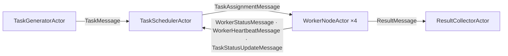

# Distributed-computing simulation walkthrough

> **Audience:** Adopter · **Status:** stable · **Verified-against:** qb 3.0.0 (C++20 default, C++23 supported)

An annotated reading of `examples/core/example10_distributed_computing.cpp`: five cooperating actor types that generate, schedule, execute, collect, and monitor a stream of simulated computational tasks across multiple cores.

**Prerequisites:** [Actor model](../../2_core_concepts/actor_model.md), [Event system](../../2_core_concepts/event_system.md), [Messaging](../../4_qb_core/messaging.md), [Engine](../../4_qb_core/engine.md) — **See also:** [Async system](../../3_qb_io/async_system.md), [Actor reference](../../4_qb_core/actor.md), [Core & IO integration overview](../README.md)

<!-- src: examples/core/example10_distributed_computing.cpp -->

## Summary

The example builds a single-process simulation of a distributed work pool. A `TaskGeneratorActor` emits `Task` objects at a fixed rate; a `TaskSchedulerActor` queues them, sorts by priority, and dispatches to whichever `WorkerNodeActor` reports spare capacity; workers simulate processing with a delayed callback, then forward a `TaskResult` to a `ResultCollectorActor`; and a `SystemMonitorActor` wires the topology together, prints periodic statistics, and drives a coordinated shutdown after a fixed wall-clock budget.

It is a useful study of three patterns that recur in larger qb applications:

- **A multi-stage actor pipeline** with one role per actor type (generation, scheduling, execution, collection, supervision).
- **Self-paced periodic work** built from one-shot [`qb::io::async::callback`](../../3_qb_io/async_system.md) timers that re-arm themselves, rather than a blocking loop.
- **A supervisor-driven lifecycle**, where one actor owns setup and teardown for the whole system.

> **Read this as a pattern catalog, not a copy-paste template.** The example trades correctness for brevity in a few places that this page calls out explicitly under [Pitfalls](#pitfalls-and-corrections) — most importantly, its load-balancing decisions race against stale metrics. Where the source and the current API disagree, the API is ground truth.

## Architecture at a glance



`SystemMonitorActor` sits outside this flow: it creates all the actors, broadcasts `InitializeMessage` and `ShutdownMessage` to every actor, and prints `SystemStatsMessage`.

All five actor types derive from `qb::Actor`. Each registers its event handlers in its constructor with `registerEvent<T>(*this)` and overrides `onInit()` for first-loop setup. Inter-actor communication uses `push<Event>(destination, ...)` and `broadcast<Event>(...)` exclusively — no shared mutable state crosses actor boundaries except the global `std::atomic` counters discussed below.

## Domain model

Three plain structs carry the simulation state. Note the use of [`qb::string<N>`](../../3_qb_io/utilities.md), a fixed-capacity inline string (`template <std::size_t _Size = 30>`, backed by `std::array<char, _Size + 1>`) chosen so that events stay trivially copyable and avoid heap traffic on the hot path.

```cpp
// src: examples/core/example10_distributed_computing.cpp
enum class ComplexityLevel { SIMPLE = 1, MEDIUM = 5, COMPLEX = 10, VERY_COMPLEX = 20 };

struct Task {
    qb::string<64>  task_id;
    qb::string<32>  task_type;
    int             priority;        // 1..10; >7 is "high priority"
    ComplexityLevel complexity;      // drives simulated processing time
    qb::string<256> data;            // synthetic input payload
    TaskStatus      status;          // PENDING / ASSIGNED / IN_PROGRESS / COMPLETED / FAILED / CANCELED
    uint64_t        creation_time;
    uint64_t        start_time{0};
    uint64_t        completion_time{0};
};

struct TaskResult {
    qb::string<64>   task_id;
    bool             success;
    qb::string<1024> result_data;
    uint64_t         processing_time;  // microseconds
};

struct WorkerMetrics {
    uint64_t total_tasks_processed{0};
    uint64_t total_processing_time{0}; // microseconds
    uint64_t failed_tasks{0};
    uint64_t successful_tasks{0};
    double   average_processing_time{0.0};
    double   utilization{0.0};         // 0.0..1.0, busy-time / wall-time
    uint64_t last_heartbeat{0};
};
```

A `Task` is wrapped in a `std::shared_ptr` so the scheduler's queue, its `_active_tasks` map, and the worker handling it can all reference the same instance. The events below carry that shared pointer by value, so ownership is reference-counted across actors rather than copied.

> **`std::shared_ptr` in an event is a deliberate exception, not the default.** Most qb events should hold values or fixed-capacity buffers so they stay trivially serializable. A `shared_ptr` only works here because every actor runs in the same process; it would not survive a future cross-process transport. See [Messaging](../../4_qb_core/messaging.md) for the value-semantics rule events are normally expected to follow.

## Event vocabulary

Events derive from `qb::Event`. The task-related messages form a small hierarchy so that an assignment, a cancellation, and a status update all share the same `task` payload:

```cpp
// src: examples/core/example10_distributed_computing.cpp
struct TaskMessage : qb::Event {
    std::shared_ptr<Task> task;
    explicit TaskMessage(const std::shared_ptr<Task> &t) : task(t) {}
};
struct TaskAssignmentMessage   : TaskMessage { using TaskMessage::TaskMessage; };
struct TaskCancellationMessage : TaskMessage { using TaskMessage::TaskMessage; };
struct TaskStatusUpdateMessage : TaskMessage { using TaskMessage::TaskMessage; };

struct ResultMessage : qb::Event { TaskResult result; /* ... */ };

struct WorkerStatusMessage    : qb::Event { qb::ActorId worker_id; WorkerMetrics metrics; /* ... */ };
struct WorkerHeartbeatMessage : qb::Event { qb::ActorId worker_id; uint64_t timestamp; bool is_busy; /* ... */ };

struct InitializeMessage : qb::Event {};
struct ShutdownMessage   : qb::Event {};
struct UpdateWorkersMessage : qb::Event { std::vector<qb::ActorId> worker_ids; /* ... */ };
```

Deriving distinct event types (`TaskAssignmentMessage` vs. `TaskMessage`) lets each actor subscribe to exactly the messages it cares about: the scheduler handles `TaskMessage`, the worker handles `TaskAssignmentMessage`, even though both carry an identical payload. Registration and dispatch are by static type, so the two never collide. See [Event system](../../2_core_concepts/event_system.md) for how the registry resolves handlers.

## The five actors

### 1. `TaskGeneratorActor` — the source

The generator registers for `InitializeMessage` and `ShutdownMessage` in its constructor, then begins producing tasks once initialized:

```cpp
// src: examples/core/example10_distributed_computing.cpp
void on(InitializeMessage &) {
    _is_active = true;
    _start_time = getCurrentTimestamp();
    scheduleTaskGeneration();           // arm the first timer
}

void scheduleTaskGeneration() {
    if (!_is_active) return;
    double seconds_per_task = 1.0 / TASKS_PER_SECOND;   // 50 tasks/s -> 0.02 s
    qb::io::async::callback([this]() {
        if (_is_active) {
            generateTask();
            scheduleTaskGeneration();    // re-arm: a self-pacing loop
        }
    }, std::chrono::duration<double>(seconds_per_task));
}
```

This is the **self-rescheduling timer** pattern: each callback fires once, does its work, and arms the next one. There is no blocking sleep and no busy loop — the [event loop](../../3_qb_io/async_system.md) on this core stays free to dispatch other actors between ticks. `generateTask()` builds a randomized `Task`, pushes it to the scheduler with `push<TaskMessage>(_scheduler_id, task)`, and increments the global `g_total_tasks` counter.

> The runtime delay above is a `double` count of seconds, wrapped in `std::chrono::duration<double>` before it reaches `async::callback`, because the timed overload accepts only a `std::chrono::duration` — see [Pitfalls](#timer-delays-must-be-chrono-durations). A bare `double` or `int` would not bind.

### 2. `TaskSchedulerActor` — the dispatcher and load balancer

The scheduler is the heart of the simulation. Its state:

| Member | Type | Role |
| --- | --- | --- |
| `_worker_ids` | `std::vector<qb::ActorId>` | Known worker actors |
| `_worker_metrics` | `std::map<qb::ActorId, WorkerMetrics>` | Last-reported status per worker |
| `_task_queue` | `std::deque<std::shared_ptr<Task>>` | Pending tasks |
| `_active_tasks` | `std::map<qb::string<64>, std::shared_ptr<Task>>` | Dispatched, not-yet-completed tasks |

It registers eight event types. The load-relevant handlers:

- `on(TaskMessage&)` — enqueue, then call `scheduleTasks()`.
- `on(WorkerHeartbeatMessage&)` — refresh that worker's `last_heartbeat`.
- `on(WorkerStatusMessage&)` — replace that worker's full `WorkerMetrics`.
- `on(ResultMessage&)` — erase the finished task from `_active_tasks`, then `scheduleTasks()` again because a worker has freed up.
- `on(UpdateWorkersMessage&)` — receive the worker-ID list (the scheduler is constructed before the workers exist; the monitor sends the IDs after construction).

Dispatch sorts by priority and assigns to the first available worker:

```cpp
// src: examples/core/example10_distributed_computing.cpp
void scheduleTasks() {
    if (!_is_active || _task_queue.empty()) return;

    std::stable_sort(_task_queue.begin(), _task_queue.end(),
        [](const auto &a, const auto &b) { return a->priority > b->priority; });

    for (const auto &worker_id : _worker_ids) {
        if (_task_queue.empty()) break;
        if (isWorkerAvailable(worker_id)) {
            auto task = _task_queue.front();
            _task_queue.pop_front();
            task->status = TaskStatus::ASSIGNED;
            _active_tasks[task->task_id] = task;
            push<TaskAssignmentMessage>(worker_id, task);
        }
    }
}

bool isWorkerAvailable(qb::ActorId worker_id) {
    auto it = _worker_metrics.find(worker_id);
    if (it == _worker_metrics.end()) return true;          // no metrics yet -> optimistic
    const auto &m = it->second;
    if (getCurrentTimestamp() - m.last_heartbeat > HEARTBEAT_TIMEOUT) return false; // stale
    if (m.utilization > 0.8) return false;                 // overloaded
    return true;
}
```

`assessLoadBalance()` runs on its own re-arming one-second timer and logs the mean utilization and queue depths. It is observation only; it does not change dispatch.

> **The availability check is racy and over-optimistic — by design, for brevity.** `utilization` and `_is_busy` arrive asynchronously, so a worker can be assigned a task while it is already running one (the worker handles that by re-queueing — see below). The check is a teaching scaffold, not a production scheduler. [Pitfalls](#scheduling-is-best-effort-not-authoritative) expands on this.

### 3. `WorkerNodeActor` — the executor

Four worker instances are spread across cores `0..3`. On `InitializeMessage`, each starts two independent re-arming timers — a one-second heartbeat and a two-second metrics update — and then waits for assignments.

Execution simulates work with a delayed callback rather than blocking:

```cpp
// src: examples/core/example10_distributed_computing.cpp
void on(TaskAssignmentMessage &msg) {
    if (_is_busy) {                                  // already working: bounce it back
        msg.task->status = TaskStatus::PENDING;
        push<TaskStatusUpdateMessage>(_scheduler_id, msg.task);
        return;
    }
    _current_task = msg.task;
    _current_task->status = TaskStatus::IN_PROGRESS;
    _current_task->start_time = getCurrentTimestamp();
    _is_busy = true;
    _busy_start_time = getCurrentTimestamp();
    push<TaskStatusUpdateMessage>(_scheduler_id, _current_task);

    double processing_time = generateProcessingTime(_current_task->complexity);
    qb::io::async::callback([this]() {
        if (_is_active) completeCurrentTask();       // "finish" after the simulated delay
    }, std::chrono::duration<double>(processing_time));
}
```

`completeCurrentTask()` rolls a 95% success probability, updates `_metrics`, builds a `TaskResult`, pushes it to the collector with `push<ResultMessage>(_collector_id, result)`, sends a final `TaskStatusUpdateMessage` to the scheduler, increments the global completed/failed counters, and clears `_is_busy` so the next assignment is accepted.

This is the key non-blocking idiom: a worker never sleeps. It captures `this`, schedules a one-shot timer, and returns to the event loop immediately, so its core keeps serving other actors during the simulated processing window.

> Capturing `this` in a self-scheduled callback is safe **only** because every callback first checks `_is_active` and the actor's `on(ShutdownMessage&)` sets `_is_active = false` before `kill()`. A timer that fires after the actor is destroyed and dereferences `this` is a use-after-free. The guard flag is load-bearing, not decorative.

### 4. `ResultCollectorActor` — the sink

The collector stores every `TaskResult` in a `std::map` keyed by task id and logs it. On `ShutdownMessage`, it computes and prints the final success rate and mean processing time across all collected results, then calls `kill()`. It is the simplest actor — a pure aggregator with no timers.

### 5. `SystemMonitorActor` — the supervisor

The monitor owns the lifecycle. Its `onInit()` sends itself an `InitializeMessage`; the handler then fans out:

```cpp
// src: examples/core/example10_distributed_computing.cpp
void on(InitializeMessage &) {
    _is_active = true;
    _start_time = getCurrentTimestamp();
    // ... banner ...
    push<InitializeMessage>(_task_generator_id);
    push<InitializeMessage>(_scheduler_id);
    push<InitializeMessage>(_collector_id);
    for (const auto &w : _worker_ids) push<InitializeMessage>(w);
    push<UpdateWorkersMessage>(_scheduler_id, _worker_ids);  // hand the scheduler its workers

    schedulePerformanceReport();                              // re-arming 2 s stats timer

    qb::io::async::callback([this]() {                        // one-shot end-of-run timer
        if (_is_active) shutdownSystem();
    }, std::chrono::seconds(SIMULATION_DURATION_SECONDS));
}
```

`schedulePerformanceReport()` reads the global atomics every two seconds, computes throughput, and pushes a `SystemStatsMessage` to itself; `on(SystemStatsMessage&)` prints it. `shutdownSystem()` emits a final report, pushes `ShutdownMessage` to the generator, scheduler, workers, and collector (collector last, so it sees all results), then arms a short final timer that calls `broadcast<ShutdownMessage>()` to catch anyone missed.

This concentrates two responsibilities — topology setup and orderly teardown — in one supervisor, which keeps the other four actors free of cross-cutting lifecycle logic.

## Wiring it together: `main`

```cpp
// src: examples/core/example10_distributed_computing.cpp
int main() {
    try {
        qb::Main engine;

        auto collector_id = engine.addActor<ResultCollectorActor>(0);
        auto scheduler_id = engine.addActor<TaskSchedulerActor>(0);

        std::vector<qb::ActorId> worker_ids;
        for (int i = 0; i < NUM_WORKERS; ++i) {
            int core_id = i % 4;                              // spread workers over cores 0..3
            worker_ids.push_back(
                engine.addActor<WorkerNodeActor>(core_id, scheduler_id, collector_id));
        }

        auto generator_id = engine.addActor<TaskGeneratorActor>(0, scheduler_id);
        engine.addActor<SystemMonitorActor>(
            0, generator_id, scheduler_id, collector_id, worker_ids);

        engine.start();   // async = true by default: returns immediately
        engine.join();    // block until every VirtualCore stops
    } catch (const std::exception &e) {
        qb::io::cerr() << "Exception: " << e.what() << std::endl;
        return 1;
    }
    return 0;
}
```

`engine.addActor<T>(core, args...)` is the convenience form of `engine.core(core).addActor<T>(args...)`; it returns the new actor's `ActorId` and must be called before `start()`. The construction order matters: the collector and scheduler must exist so their IDs can be passed into the worker constructors, and the workers must exist so their IDs can be handed to the monitor. The scheduler receives its worker list later, via `UpdateWorkersMessage`, because it is constructed before the workers are.

`engine.start()` defaults to `async = true` and returns immediately; `engine.join()` blocks the calling thread until all `VirtualCore`s terminate. See [Engine](../../4_qb_core/engine.md) for the full start/stop/join contract.

## Patterns worth keeping

- **One actor, one role.** Generation, scheduling, execution, collection, and supervision are cleanly separated. Each actor's state is private and reached only through events.
- **Self-pacing timers over loops.** Every recurring activity — generation, heartbeats, metrics, load assessment, reporting — is a one-shot [`async::callback`](../../3_qb_io/async_system.md) that re-arms itself, guarded by an `_is_active` flag. No actor ever blocks its core.
- **Supervisor-owned lifecycle.** A single `SystemMonitorActor` performs setup and a staged shutdown, so the other actors carry no orchestration logic.
- **Typed event subclasses for routing.** Deriving `TaskAssignmentMessage` from `TaskMessage` lets producers and consumers subscribe to different messages that share a payload, with no runtime tagging.

## Pitfalls and corrections

### Timer delays must be chrono durations

Every delay in the example reaches `qb::io::async::callback` as a `std::chrono` duration — `std::chrono::duration<double>(seconds_per_task)` in `scheduleTaskGeneration`, `std::chrono::seconds(SIMULATION_DURATION_SECONDS)` in the monitor, `std::chrono::seconds(1)` for heartbeats — because the timed overload requires it. The current overload is:

```cpp
// src: qb/include/qb/io/async/io.h
template <typename _Func, typename Rep, typename Period>
void callback(_Func &&func, std::chrono::duration<Rep, Period> timeout);
```

It accepts a `std::chrono::duration` only. The canonical `qb::duration` (`std::chrono::nanoseconds`) accepts any finer-or-equal chrono literal implicitly and rejects bare integers — so a bare `double` or `int` does **not** bind. If you adapt this code, keep delays as chrono literals or explicit durations, exactly as the example does:

```cpp
#include <chrono>
using namespace std::chrono_literals;

// Recurring at 50 Hz:
qb::io::async::callback([this]{ /* ... */ }, 20ms);

// A delay computed at runtime — wrap the seconds in a double-based duration:
auto delay = std::chrono::duration<double>(1.0 / TASKS_PER_SECOND);
qb::io::async::callback([this]{ /* ... */ }, delay);

// Run the callable immediately (inline) — a non-positive duration fires
// synchronously in this call; it does NOT defer to the next loop iteration:
qb::io::async::callback([this]{ /* ... */ }, qb::duration::zero());
```

This matches how the framework's own tests schedule delayed work, e.g. the `1ms` chained callbacks in `qb/source/core/tests/system/timer/async-callback-ordering.cpp` (line 81).

### The example's `getCurrentTimestamp()` is not the canonical clock

The file defines a local `getCurrentTimestamp()` returning microseconds since epoch from `std::chrono::high_resolution_clock`. That is fine for an isolated demo, but it is **not** the framework time vocabulary. For real code, prefer the canonical types in [`qb/system/time.h`](../../3_qb_io/utilities.md): `qb::mono_now()` (a `qb::mono_time` from `steady_clock`) for intervals, deadlines, and latency; and `qb::wall_now()` (a `qb::wall_time` from `system_clock`) for wall-clock instants. Mixing a wall clock into interval math, as the example does, is exactly what the canonical split exists to prevent.

### Scheduling is best-effort, not authoritative

`isWorkerAvailable()` reads `utilization` and `last_heartbeat` that arrive asynchronously and lag reality by up to a metrics interval. Two consequences:

1. The scheduler can dispatch to a worker that is already busy. The worker defends itself by bouncing the task back as `PENDING` via `TaskStatusUpdateMessage`. That update is recorded but the bounced task is not re-enqueued, so under contention work can be silently dropped from the active set.
2. The 95% "success" roll and the synthetic processing time make the throughput figures illustrative, not measured.

Read the load-balancing logic as a demonstration of *how to route on reported metrics*, not as a scheduler to ship.

### Global atomics are a shortcut, not the recommended pattern

`g_total_tasks`, `g_completed_tasks`, and friends are process-global `std::atomic` counters incremented from multiple cores. They are thread-safe and convenient for a top-line tally, but they bypass the actor model's message-passing discipline. For anything beyond a coarse counter, route statistics through a dedicated aggregator actor (the example's own `ResultCollectorActor` is the in-model alternative) so that state stays owned by one actor and reachable only through events.

### Build note

`example10_distributed_computing` is registered in `examples/core/CMakeLists.txt`. Its timer calls already pass `std::chrono` durations, so it builds against the current `async::callback` signature with no changes.

## See also

- [Async system](../../3_qb_io/async_system.md) — `qb::io::async::callback`, the event loop, and timer semantics.
- [Messaging](../../4_qb_core/messaging.md) — `push`, `broadcast`, event value semantics, and delivery guarantees.
- [Engine](../../4_qb_core/engine.md) — `qb::Main`, `addActor`, `start`, `join`, and core assignment.
- [Actor reference](../../4_qb_core/actor.md) — `registerEvent`, `onInit`, `kill`, and the actor lifecycle.
- [Event system](../../2_core_concepts/event_system.md) — handler registration and type-based dispatch.
- [File monitor walkthrough](./file_monitor_analysis.md) — another core/IO integration case study.
