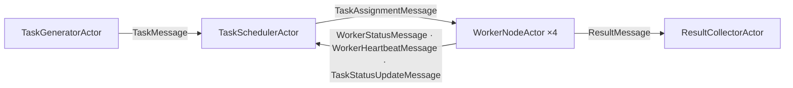

# Distributed-computing simulation walkthrough

> **Audience:** Adopter · **Status:** stable · **Verified-against:** qb 3.0.0 (C++20 default, C++23 supported)

An annotated reading of `examples/core/example10_distributed_computing.cpp`: five cooperating actor types that generate, schedule, execute, collect, and monitor a stream of simulated computational tasks across multiple cores.

**Prerequisites:** [Actor model](../../2_core_concepts/actor_model.md), [Event system](../../2_core_concepts/event_system.md), [Messaging](../../4_qb_core/messaging.md), [Engine](../../4_qb_core/engine.md) — **See also:** [Async system](../../3_qb_io/async_system.md), [Coroutines](../../3_qb_io/coroutines.md), [Actor reference](../../4_qb_core/actor.md), [Core & IO integration overview](../README.md)

<!-- src: examples/core/example10_distributed_computing.cpp -->

## Summary

The example builds a single-process simulation of a distributed work pool. A `TaskGeneratorActor` emits `Task` objects at a fixed rate; a `TaskSchedulerActor` queues them, sorts by priority, and hands them round-robin to whichever `WorkerNodeActor` it has not already given work to; workers simulate processing with a lifetime-bound coroutine timer, then forward a `TaskResult` to a `ResultCollectorActor`; and a `SystemMonitorActor` wires the topology together, *polls* each component for the counters that component owns, prints the merged report, and drives a coordinated shutdown after a fixed wall-clock budget.

It is a useful study of four patterns that recur in larger qb applications:

- **A multi-stage actor pipeline** with one role per actor type (generation, scheduling, execution, collection, supervision).
- **Self-paced periodic work built from lifetime-bound coroutines** — `spawn(...)` + `co_await ctx.sleep(...)`, which the actor's own cancellation scope tears down on `kill()`. This is the pattern to copy; the `qb::io::async::callback([this]{ ... }, delay)` shape it replaced is a use-after-free, and [Pitfalls](#a-this-capturing-asynccallback-timer-is-a-use-after-free-and-the-guard-flag-is-the-bug) explains exactly why the obvious `_is_active` guard does not save it.
- **Telemetry by request/response** rather than by shared counters: the monitor asks, each component answers with the numbers it alone owns.
- **A supervisor-driven lifecycle**, where one actor owns setup and a staged teardown.

> **This file carries its own defect log.** Its header comment (`examples/core/example10_distributed_computing.cpp:45-83`) enumerates six things the program used to get wrong — all of them while exiting 0 — including the AddressSanitizer abort, a fleet where two of four workers received zero tasks, and a rejected task that was dropped instead of requeued. Read that block alongside this page: the sections below explain the mechanisms, the header records the measurements.

## Architecture at a glance



`SystemMonitorActor` sits outside that flow. It creates nothing itself — `main` does the construction — but it owns the run: it broadcasts `InitializeMessage` to the four components, hands the scheduler its worker list with `UpdateWorkersMessage`, polls generator, scheduler and collector every two seconds with `StatsRequestMessage`, merges the three `StatsReportMessage` replies into one printed report, and finally pushes `ShutdownMessage` to each component before a `broadcast<ShutdownMessage>()` sweeps up whatever is left.

All five actor types derive from `qb::Actor`. Each registers its event handlers in its constructor with `registerEvent<T>(*this)` and overrides `onInit()` — in the coroutine form, `qb::io::async::task<bool>` returning `co_return true` (`qb/src/qb/core/Actor.h:354-356`). Inter-actor communication uses `push<Event>(destination, ...)` and `broadcast<Event>(...)` exclusively. **There is no shared mutable state between actors at all**: the five process-global `std::atomic` counters this example used to carry were replaced by per-actor members reported over events, and the one function-local `static std::mt19937` was replaced by a per-actor `_rng`. The only remaining process-wide object with mutable state is the `static std::atomic<uint64_t> next_id` inside `generateTaskId()`, which mints task identifiers and is never read for a decision.

## Domain model

Three plain structs carry the simulation state. Note the use of [`qb::string<N>`](../../0_foundations/containers.md), a fixed-capacity inline string that publicly derives from `std::array<char, _Size + 1>` (`template <std::size_t _Size = 30>`, `qb/src/qb/string.h:85-86`), chosen so that a payload holds its characters *inside itself* and needs no heap allocation on the hot path.

```cpp
// src: examples/core/example10_distributed_computing.cpp
enum class ComplexityLevel { SIMPLE = 1, MEDIUM = 5, COMPLEX = 10, VERY_COMPLEX = 20 };

// The four levels, in one place, so the generator draws an actual enumerator.
constexpr std::array<ComplexityLevel, 4> COMPLEXITY_LEVELS{
    ComplexityLevel::SIMPLE, ComplexityLevel::MEDIUM,
    ComplexityLevel::COMPLEX, ComplexityLevel::VERY_COMPLEX
};

struct Task {
    qb::string<64>  task_id;
    qb::string<32>  task_type;
    int             priority;        // 1..10; >7 is "high priority"
    ComplexityLevel complexity;      // drives simulated processing time
    qb::string<256> data;            // synthetic input payload
    TaskStatus      status;          // PENDING / ASSIGNED / IN_PROGRESS / COMPLETED / FAILED / CANCELED
    uint64_t        creation_time;
    uint64_t        start_time{0};
    uint64_t        completion_time{0};
};

struct TaskResult {
    qb::string<64>   task_id;
    bool             success;
    qb::string<1024> result_data;
    uint64_t         processing_time;  // microseconds
};

struct WorkerMetrics {
    uint64_t total_tasks_processed{0};
    uint64_t total_processing_time{0}; // microseconds
    uint64_t failed_tasks{0};
    uint64_t successful_tasks{0};
    double   average_processing_time{0.0};
    double   utilization{0.0};         // 0.0..1.0, busy-time / wall-time
    uint64_t last_heartbeat{0};
};
```

`COMPLEXITY_LEVELS` earns its place. The generator used to synthesize a level with `static_cast<ComplexityLevel>(1 << complexity_dist(_rng))`, which yields 1, 2, 4, 8 — and only 1 is an enumerator of `ComplexityLevel`. Three of every four tasks therefore carried a value with no name, and every `switch` over it fell through to `default`. Indexing a table of the actual enumerators makes that class of bug unrepresentable.

A `Task` travels between actors inside a `std::shared_ptr`, but **each actor gets its own `Task`**, not a shared one — see [the snapshot rule](#boxing-a-payload-makes-the-event-relocatable-it-does-not-make-the-pointee-owned) below. Inside one actor the pointer is shared freely: the scheduler's `_task_queue` and its `_active_tasks` map do hold the same instance, and that is fine, because both live on the same `VirtualCore` and are touched only by that actor's handlers.

> **`std::shared_ptr` in an event is a deliberate exception, not the default.** Most qb events should hold values or fixed-capacity buffers so they stay trivially relocatable and trivially serializable. A `shared_ptr` only works here because every actor runs in the same process; it would not survive a future cross-process transport. See [Messaging](../../4_qb_core/messaging.md) for the value-semantics rule events are normally expected to follow.

## Event vocabulary

Events derive from `qb::Event`. The task-related messages form a small hierarchy so that an assignment, a cancellation, and a status update all share the same `task` payload:

```cpp
// src: examples/core/example10_distributed_computing.cpp
struct TaskMessage : qb::Event {
    std::shared_ptr<Task> task;
    explicit TaskMessage(const std::shared_ptr<Task> &t) : task(t) {}
};
struct TaskAssignmentMessage   : TaskMessage { /* inherits the ctor */ };
struct TaskCancellationMessage : TaskMessage { /* inherits the ctor */ };
struct TaskStatusUpdateMessage : TaskMessage { /* inherits the ctor */ };

struct ResultMessage : qb::Event { TaskResult result; /* ... */ };

struct WorkerStatusMessage    : qb::Event { qb::ActorId worker_id; WorkerMetrics metrics; /* ... */ };
struct WorkerHeartbeatMessage : qb::Event { qb::ActorId worker_id; uint64_t timestamp; bool is_busy; /* ... */ };

struct InitializeMessage : qb::Event {};
struct ShutdownMessage   : qb::Event {};
struct UpdateWorkersMessage : qb::Event { std::vector<qb::ActorId> worker_ids; /* ... */ };

// Telemetry, done the actor way: the monitor ASKS, each component ANSWERS.
struct StatsRequestMessage : qb::Event {};
struct StatsReportMessage  : qb::Event {
    uint64_t total_tasks{0};      // produced by the generator
    uint64_t completed_tasks{0};  // counted by the collector
    uint64_t failed_tasks{0};     // counted by the collector
    uint64_t queued_tasks{0};     // scheduler backlog
    uint64_t active_tasks{0};     // scheduler in-flight
    /* ... */
};

// Self-addressed wake-ups produced by each actor's own coroutine timers.
struct GenerateTickMessage     : qb::Event {};
struct TaskCompleteTickMessage : qb::Event {};
struct HeartbeatTickMessage    : qb::Event {};
struct MetricsTickMessage      : qb::Event {};
struct ReportTickMessage       : qb::Event {};
struct ShutdownTickMessage     : qb::Event {};
struct FinalStopTickMessage    : qb::Event {};
```

Two design points are worth extracting.

**Typed subclasses route without runtime tagging.** Deriving distinct event types (`TaskAssignmentMessage` vs. `TaskMessage`) lets each actor subscribe to exactly the messages it cares about: the scheduler handles `TaskMessage`, the worker handles `TaskAssignmentMessage`, even though both carry an identical payload. Registration and dispatch are by static type, so the two never collide. See [Event system](../../2_core_concepts/event_system.md) for how the registry resolves handlers.

**The seven `…TickMessage` types are the shape of a lifetime-bound timer.** A coroutine spawned with `spawn(...)` must not capture `this` — so it cannot call a member function when it wakes. What it *can* do is push a self-addressed event: `ctx.push<T>()` sends to the spawning actor's own id (`qb/src/qb/core/Actor.h:1402-1403`), which the context stored by value when it was constructed (`:1393-1394`) rather than holding the actor. The coroutine therefore does one thing — sleep, then post a tick — and the actor's ordinary handler does the work, back on the actor's own frame where `this` is valid again. Every recurring activity in this file uses that two-step shape.

## The five actors

### 1. `TaskGeneratorActor` — the source

It registers four events (`InitializeMessage`, `ShutdownMessage`, `GenerateTickMessage`, `StatsRequestMessage`), owns a per-instance `std::mt19937 _rng` seeded in its constructor, and counts its own output in `_tasks_generated`.

```cpp
// src: examples/core/example10_distributed_computing.cpp
void on(InitializeMessage &) {
    _is_active  = true;
    _start_time = getCurrentTimestamp();
    scheduleTaskGeneration();           // arm the first timer
}

void on(GenerateTickMessage const &) {
    if (!_is_active)
        return;
    generateTask();
    scheduleTaskGeneration();           // re-arm: a self-pacing loop
}

void scheduleTaskGeneration() {
    if (!_is_active)
        return;

    const auto period = std::chrono::duration_cast<qb::duration>(
        std::chrono::duration<double>(1.0 / TASKS_PER_SECOND));   // 5 tasks/s -> 0.2 s

    spawn([period](qb::ScopedCoroContext ctx) -> qb::io::async::task<void> {
        co_await ctx.sleep(period);
        ctx.template push<GenerateTickMessage>();
    });
}
```

Read the lambda's capture list first: `[period]`, by value, and **nothing else**. That is the whole discipline. The coroutine frame outlives the call that created it, so anything it captures by reference — `this` above all — may be dangling by the time it resumes. Copying the one `qb::duration` it needs costs nothing and removes the question.

`generateTask()` builds a randomized `Task` (type, priority 1..10, a complexity drawn from `COMPLEXITY_LEVELS`, and a synthetic digit-string body of 10..100 characters), pushes it to the scheduler with `push<TaskMessage>(_scheduler_id, task)`, and increments `_tasks_generated`. When the monitor asks, `on(StatsRequestMessage&)` answers with that one number and zeros for the four counters other actors own:

```cpp
// src: examples/core/example10_distributed_computing.cpp
void on(StatsRequestMessage &msg) {
    push<StatsReportMessage>(msg.getSource(), _tasks_generated, 0, 0, 0, 0);
}
```

### 2. `TaskSchedulerActor` — the dispatcher and load balancer

The scheduler is the heart of the simulation. Its state:

| Member | Type | Role |
| --- | --- | --- |
| `_worker_ids` | `std::vector<qb::ActorId>` | Known worker actors |
| `_worker_metrics` | `std::map<qb::ActorId, WorkerMetrics>` | Last-reported status per worker |
| `_task_queue` | `std::deque<std::shared_ptr<Task>>` | Pending tasks |
| `_active_tasks` | `std::map<qb::string<64>, std::shared_ptr<Task>>` | Dispatched, not-yet-completed tasks |
| `_busy_workers` | `std::set<qb::ActorId>` | Workers this scheduler handed a task and has not heard back from |
| `_next_worker` | `std::size_t` | Round-robin cursor into `_worker_ids` |

It registers nine event types: `TaskMessage`, `TaskStatusUpdateMessage`, `WorkerStatusMessage`, `WorkerHeartbeatMessage`, `InitializeMessage`, `ShutdownMessage`, `UpdateWorkersMessage`, `StatsRequestMessage`, and `ReportTickMessage`. The load-relevant handlers:

- `on(TaskMessage&)` — enqueue, then call `scheduleTasks()`.
- `on(WorkerHeartbeatMessage&)` — refresh that worker's `last_heartbeat` (only if the worker already has a metrics entry).
- `on(WorkerStatusMessage&)` — replace that worker's full `WorkerMetrics`.
- `on(TaskStatusUpdateMessage&)` — the single path by which a worker becomes free again; see below.
- `on(UpdateWorkersMessage&)` — receive the worker-ID list (the scheduler is constructed before the workers exist; the monitor sends the IDs after construction).
- `on(ReportTickMessage const&)` — run `assessLoadBalance()`, then re-arm the one-second assessment timer.

Dispatch sorts by priority and walks the fleet **once**, from a cursor that persists across calls:

```cpp
// src: examples/core/example10_distributed_computing.cpp
void scheduleTasks() {
    if (!_is_active || _task_queue.empty())
        return;
    if (_worker_ids.empty())
        return;

    std::stable_sort(_task_queue.begin(), _task_queue.end(),
        [](const auto &a, const auto &b) { return a->priority > b->priority; });

    for (std::size_t probed = 0; probed < _worker_ids.size() && !_task_queue.empty(); ++probed) {
        const auto worker_id = _worker_ids[_next_worker];
        _next_worker         = (_next_worker + 1) % _worker_ids.size();

        if (!isWorkerAvailable(worker_id))
            continue;

        auto task = _task_queue.front();
        _task_queue.pop_front();

        task->status                 = TaskStatus::ASSIGNED;
        _active_tasks[task->task_id] = task;
        _busy_workers.insert(worker_id);

        // The worker gets its OWN copy — see "Boxing a payload …" below.
        push<TaskAssignmentMessage>(worker_id, std::make_shared<Task>(*task));
    }
}

bool isWorkerAvailable(qb::ActorId worker_id) {
    if (_busy_workers.count(worker_id))                   // what the scheduler KNOWS
        return false;
    if (_worker_metrics.find(worker_id) == _worker_metrics.end())
        return true;                                      // no metrics yet -> optimistic
    const auto &metrics = _worker_metrics[worker_id];
    if (getCurrentTimestamp() - metrics.last_heartbeat > HEARTBEAT_TIMEOUT)  // 5 s
        return false;                                     // unresponsive
    return true;
}
```

Two properties of that loop are load-bearing, and both were absent before.

**The cursor advances on every probe, not on every assignment.** Consecutive tasks therefore land on consecutive workers even when some are skipped. The previous version restarted from `_worker_ids.begin()` each time and asked a purely metric-based `isWorkerAvailable()`; because `WorkerMetrics::utilization` is refreshed every two seconds and tasks arrive every 200 ms, every worker looked idle at decision time and the first in the list took everything. The header records one measured run: of 1497 assignments, one worker took 1198, a second took 299, and the two workers on cores 2 and 3 took **zero**.

**`_busy_workers` is what the scheduler *knows*; `utilization` is what it was *told*.** A scheduler has first-hand knowledge of who it just gave work to, and that knowledge is exact and immediate. `utilization` and `last_heartbeat` remain useful — they detect a worker that has *stopped answering*, which local bookkeeping cannot — but they are a liveness signal, not an occupancy signal. Checking the authoritative fact first and the lagging report second is the general shape; note that the `utilization > 0.8` test the old version used as an occupancy proxy is gone, because occupancy is now tracked exactly.

`on(TaskStatusUpdateMessage&)` is the return path, and it distinguishes three outcomes:

```cpp
// src: examples/core/example10_distributed_computing.cpp
void on(TaskStatusUpdateMessage &msg) {
    auto           task    = msg.task;
    qb::string<64> task_id = task->task_id;

    // A busy worker answers PENDING: "I did not take this one."
    if (task->status == TaskStatus::PENDING) {
        _active_tasks.erase(task_id);
        _busy_workers.erase(msg.getSource());
        _task_queue.push_back(task);        // REQUEUE — this line is the fix
        scheduleTasks();
        return;
    }

    if (_active_tasks.find(task_id) != _active_tasks.end())
        _active_tasks[task_id] = task;      // in-progress: just record it

    // A terminal status frees the worker even though the result went to the collector.
    if (task->status == TaskStatus::COMPLETED ||
        task->status == TaskStatus::FAILED   ||
        task->status == TaskStatus::CANCELED) {
        _active_tasks.erase(task_id);
        _busy_workers.erase(msg.getSource());
        scheduleTasks();
    }
}
```

The `PENDING` branch is a rejection, and a rejection that is not requeued is a lost task. The previous version rewrote a map entry and returned; combined with the fixed-order assignment above, that is where most of a measured 94% incompletion went.

Note also what this handler is *not*: the scheduler has **no** `on(ResultMessage&)`. It used to register one "to know when workers become free", but nothing ever sent it a `ResultMessage` — a worker pushes its result to the *collector* and only a `TaskStatusUpdateMessage` to the scheduler — so the handler was unreachable and the freeing it was supposed to perform never happened. Dead handlers are invisible in a green build; the way to find them is to ask, for every registered event type, which line pushes it. See the [reachability rule](#a-registered-handler-nobody-pushes-to-is-dead-code) below.

`assessLoadBalance()` logs mean utilization, queue depth and in-flight count once a second. It is observation only; it does not change dispatch.

### 3. `WorkerNodeActor` — the executor

Four worker instances are spread across cores `0..3` (`int core_id = i % 4;` with `NUM_WORKERS == 4`). Each registers seven event types — `TaskAssignmentMessage`, `TaskCancellationMessage`, `InitializeMessage`, `ShutdownMessage`, and the three tick events `TaskCompleteTickMessage`, `HeartbeatTickMessage`, `MetricsTickMessage` — and seeds its own `std::mt19937 _rng` in its constructor. On `InitializeMessage` it starts two independent re-arming timers: a one-second heartbeat and a two-second metrics update.

Execution simulates work with a lifetime-bound coroutine rather than blocking:

```cpp
// src: examples/core/example10_distributed_computing.cpp
void on(TaskAssignmentMessage &msg) {
    if (_is_busy) {                                  // already working: bounce it back
        auto task    = msg.task;
        task->status = TaskStatus::PENDING;
        push<TaskStatusUpdateMessage>(_scheduler_id, task);
        return;
    }
    _current_task             = msg.task;
    _current_task->status     = TaskStatus::IN_PROGRESS;
    _current_task->start_time = getCurrentTimestamp();
    _is_busy                  = true;
    _busy_start_time          = getCurrentTimestamp();
    push<TaskStatusUpdateMessage>(_scheduler_id, _current_task);

    const auto processing_time = std::chrono::duration_cast<qb::duration>(
        std::chrono::duration<double>(generateProcessingTime(_current_task->complexity, _rng)));

    spawn([processing_time](qb::ScopedCoroContext ctx) -> qb::io::async::task<void> {
        co_await ctx.sleep(processing_time);
        ctx.template push<TaskCompleteTickMessage>();
    });
}

void on(TaskCompleteTickMessage const &) {
    if (!_is_active)
        return;
    completeCurrentTask();
}
```

`completeCurrentTask()` rolls a 95% success probability *from the actor's own `_rng`*, updates `_metrics`, builds a `TaskResult`, pushes it to the collector with `push<ResultMessage>(_collector_id, result)`, sends a final `TaskStatusUpdateMessage` to the scheduler, and clears `_is_busy` so the next assignment is accepted.

This is the key non-blocking idiom: a worker never sleeps its core. It spawns a coroutine that suspends, and returns to the event loop immediately, so the core keeps serving other actors during the simulated processing window. And because the coroutine was created by `spawn` rather than `spawn_detached`, it is registered in the actor's cancellation scope: `Actor::kill()` cancels that scope (`qb/src/qb/core/Actor.cpp:283-289`), so a worker killed mid-task wakes its parked `ctx.sleep` with `qb::io::async::cancelled_error` within the next loop iteration and unwinds, instead of leaving a timer pointed at a destroyed object.

`generateProcessingTime(ComplexityLevel, std::mt19937 &)` takes the generator **as a parameter**. It used to hold a function-local `static std::mt19937`, driven concurrently from four worker cores; `std::mt19937::operator()` is not thread-safe, and a release build will never say so.

### 4. `ResultCollectorActor` — the sink

The collector registers four event types (`ResultMessage`, `InitializeMessage`, `ShutdownMessage`, `StatsRequestMessage`). It stores every `TaskResult` in a `std::map` keyed by task id, logs it, and maintains its own `_completed` / `_failed` tallies — the counters that used to be process-global atomics written from four cores. `on(StatsRequestMessage&)` answers with exactly those two. On `ShutdownMessage` it computes and prints the final success rate and mean processing time across all collected results, then calls `kill()`. It is the simplest actor: an aggregator with no timers of its own.

### 5. `SystemMonitorActor` — the supervisor

The monitor owns the run. Its `onInit()` pushes itself an `InitializeMessage`; the handler then fans out:

```cpp
// src: examples/core/example10_distributed_computing.cpp
void on(InitializeMessage &) {
    _is_active  = true;
    _start_time = getCurrentTimestamp();
    // ... banner: worker count, task types, target throughput, duration ...
    push<InitializeMessage>(_task_generator_id);
    push<InitializeMessage>(_scheduler_id);
    push<InitializeMessage>(_collector_id);
    for (const auto &worker_id : _worker_ids)
        push<InitializeMessage>(worker_id);

    push<UpdateWorkersMessage>(_scheduler_id, _worker_ids);  // hand the scheduler its workers

    schedulePerformanceReport();                             // re-arming 2 s stats timer

    spawn([](qb::ScopedCoroContext ctx) -> qb::io::async::task<void> {  // end-of-run timer
        co_await ctx.sleep(std::chrono::seconds(SIMULATION_DURATION_SECONDS));
        ctx.template push<ShutdownTickMessage>();
    });
}
```

**Telemetry is a scatter/gather, not a shared counter read.** Every two seconds a `ReportTickMessage` arrives and the monitor calls `requestStats()`, which sets `_pending_reports = 3`, zeroes its five accumulators, and pushes a `StatsRequestMessage` to the generator, the scheduler and the collector. Each replies with a `StatsReportMessage` carrying only the fields it owns and zeros elsewhere, so the merge is a plain sum. `on(StatsReportMessage&)` accumulates and decrements; when the third reply lands it prints the report:

```cpp
// src: examples/core/example10_distributed_computing.cpp
void on(StatsReportMessage &msg) {
    _total_tasks     += msg.total_tasks;
    _completed_tasks += msg.completed_tasks;
    _failed_tasks    += msg.failed_tasks;
    _queued_tasks    += msg.queued_tasks;
    _active_tasks    += msg.active_tasks;

    if (--_pending_reports > 0)
        return;

    printStatistics();

    if (_shutting_down)
        stopEverything();
}
```

That last conditional is how shutdown stays ordered. `on(ShutdownTickMessage const&)` does not tear anything down: it clears `_is_active`, sets `_shutting_down`, and issues **one last polling round**, so the closing figures are the components' own numbers rather than a stale local copy. Only when that round completes does `stopEverything()` run — pushing `ShutdownMessage` to the generator, the scheduler, each worker, and the collector *last* (so the collector has seen every result before it prints its summary), then spawning a final 500 ms coroutine that posts `FinalStopTickMessage`, whose handler calls `broadcast<ShutdownMessage>()` to sweep up anything still alive.

This concentrates three responsibilities — orchestration, telemetry aggregation, and orderly teardown — in one supervisor, which keeps the other four actors free of cross-cutting lifecycle logic.

## Wiring it together: `main`

```cpp
// src: examples/core/example10_distributed_computing.cpp
int main() {
    try {
        qb::Main engine;

        auto collector_id = engine.addActor<ResultCollectorActor>(0);

        std::vector<qb::ActorId> worker_ids;
        auto scheduler_id = engine.addActor<TaskSchedulerActor>(0);

        for (int i = 0; i < NUM_WORKERS; ++i) {
            int  core_id   = i % 4;                           // spread workers over cores 0..3
            auto worker_id = engine.addActor<WorkerNodeActor>(core_id, scheduler_id, collector_id);
            worker_ids.push_back(worker_id);
        }

        auto generator_id = engine.addActor<TaskGeneratorActor>(0, scheduler_id);
        engine.addActor<SystemMonitorActor>(
            0, generator_id, scheduler_id, collector_id, worker_ids);

        engine.start();   // async = true by default: returns immediately
        engine.join();    // block until every VirtualCore stops
    } catch (const std::exception &e) {
        qb::io::cerr() << "Exception: " << e.what() << std::endl;
        return 1;
    }
    return 0;
}
```

`engine.addActor<T>(core, args...)` is the convenience form of `engine.core(core).addActor<T>(args...)`; it returns the new actor's `ActorId` and must be called before `start()`. The construction order matters: the collector and scheduler must exist so their IDs can be passed into the worker constructors, and the workers must exist so their IDs can be handed to the monitor. The scheduler receives its worker list later, via `UpdateWorkersMessage`, because it is constructed before the workers are.

`engine.start()` defaults to `async = true` and returns immediately; `engine.join()` blocks the calling thread until all `VirtualCore`s terminate. See [Engine](../../4_qb_core/engine.md) for the full start/stop/join contract.

## Patterns worth keeping

- **One actor, one role.** Generation, scheduling, execution, collection, and supervision are cleanly separated. Each actor's state is private and reached only through events.
- **Lifetime-bound timers over lifetime-free ones.** Every recurring activity — generation, task completion, heartbeats, metrics, load assessment, reporting, shutdown staging — is `spawn(...)` + `co_await ctx.sleep(d)` + `ctx.push<Tick>()`, with a by-value capture list and no `this`. No actor ever blocks its core, and no timer outlives the actor that armed it.
- **Ask for numbers; do not share them.** Each component owns its counters and answers a `StatsRequestMessage`. The merged report is a sum of three replies, not a read of five atomics.
- **Decide from what you know, verify with what you are told.** `_busy_workers` (exact, immediate) gates assignment; `last_heartbeat` (lagging, remote) detects a dead worker. Do not use a lagging metric for a decision an exact local fact can make.
- **Requeue a rejection.** Any dispatcher that can be refused needs a path back into the queue, or its throughput silently becomes a fraction of its arrival rate.
- **Supervisor-owned lifecycle.** A single `SystemMonitorActor` performs setup, telemetry and a staged shutdown, so the other actors carry no orchestration logic.
- **Typed event subclasses for routing.** Deriving `TaskAssignmentMessage` from `TaskMessage` lets producers and consumers subscribe to different messages that share a payload, with no runtime tagging.

## Pitfalls and corrections

### A `this`-capturing `async::callback` timer is a use-after-free, and the guard flag *is* the bug

The most important correction on this page is one it used to get wrong itself. Earlier revisions of this walkthrough presented the following as an idiom to copy:

```cpp
// DO NOT COPY — this is the shape AddressSanitizer aborts on.
qb::io::async::callback([this]() {
    if (_is_active)          // <-- this read is the use-after-free
        doPeriodicWork();
}, delay);
```

The reasoning was that `on(ShutdownMessage&)` sets `_is_active = false` before `kill()`, so a late fire is harmless. It is not, and the flaw is structural: **the guard is a member read.** If the actor has already been destroyed when the timer fires, evaluating `_is_active` *is* the read of freed memory — the branch never gets the chance to protect anything.

The lifetime is not the actor's to control, either. The timed overload heap-allocates a `Timeout` object and drops the pointer (`qb/src/qb/io/async/io.h:389`); the constructor registers it as **loop-owned** so a listener teardown can reclaim it (`qb/src/qb/io/async/io.h:312-318`), and it `delete`s itself when it fires (`:343`). Nothing in that chain connects it to any `qb::Actor`. It fires when the listener says so, whatever happened to the actor in the meantime.

This example measured it: three runs of three aborted under the `sanitize` preset with `AddressSanitizer: heap-use-after-free`, reported inside such a lambda at `WorkerNodeActor::scheduleMetricsUpdate()` twice and `TaskGeneratorActor::scheduleTaskGeneration()` once. All eight sites in this file are now `spawn(...)` + `co_await ctx.sleep(d)`, as are 30 across the four programs that were swept — 8 here, 17 in `09-state-machine.cpp`, 4 in `example9_trading_system.cpp`, 1 in `qbm/http/02_simple_client.cpp`.

**The sweep has since reached the rest of the corpus, and the remainder was not a rounding error.** When this page was first written, **21** `this`-capturing *timed* `qb::io::async::callback(f, delay)` call sites survived in programs the first two repair commits did not touch: `qbm/redis` (10 — examples 4, 5, 6 and 7), `core_io/file_monitor` (3), `core_io/chat_tcp` (2), `core_io/file_processor` (2), `core_io/message_broker` (2), `qbm/ws/02_chat_client.cpp` (2). All 21 are now `spawn(...)` + `co_await ctx.sleep(d)` + a self-addressed tick event; a re-count over `examples/` returns **zero**. A further 5 sites capture `this` but use the **no-delay** overload, which runs inline and is therefore not this hazard at all — those are unchanged, and their comments now say so, because three separate sweeps misread them as the timed form. Four timed sites also remain, deliberately: their lambdas capture nothing, stop the engine or log, and are meant to outlive every actor. That is the job the loop-owned timer is right for.

**A second program convicted itself on the way out.** `examples/06-modules/redis/05-transactions.cpp` aborted under the `sanitize` preset, three runs of three, with `heap-use-after-free` reading 4 bytes 76 bytes into a freed `OrderClientActor` — a `push<ShutdownEvent>(_coordinator_id)` inside a 500 ms `callback([this]...)` armed from `on(OrderResultEvent&)`, half a second after the coordinator had already killed the client. It is the same shape as the three this page measured, in a program nobody had pointed a sanitizer at.

The replacement works because `spawn` (`qb/src/qb/core/Actor.h:1238-1239`) binds the coroutine to the actor's cancellation scope, `ScopedCoroContext::sleep` routes that scope's token into a cancellable sleep (`qb/src/qb/core/Actor.h:1717-1719`), and `Actor::kill()` cancels the scope (`qb/src/qb/core/Actor.cpp:283-289`). qb's own test suite pins the difference in one actor: a `spawn`ed 40 ms `ctx.sleep` must **not** complete after a kill at ~10 ms, while a `spawn_detached` sibling must (`qb/tests/core/system/coroutine/coroutine-scope.cpp:186-200`, asserted at `:228-229`).

Three rules follow, and they are not stylistic:

1. **Capture by value; never capture `this`.** The scope bounds the coroutine's lifetime; it does not make member access after a `co_await` legal. Copy the `qb::duration`, the `ActorId`, the key — whatever the body needs.
2. **Come back through an event.** `ctx.push<Tick>()` posts to the spawning actor's id, and the actual work happens in an ordinary handler where `this` is valid again.
3. **`spawn_detached` is the exception, not the shorthand.** It is genuinely detached: it survives the actor and completes. Reach for it only when that is the behaviour you want.

`qb::io::async::callback` itself remains correct and useful — for work whose closure owns everything it touches, and for the framework's own timing tests, e.g. the chained `1ms` callbacks in `qb/tests/core/system/timer/async-callback-ordering.cpp:81-87`. What is wrong is capturing a raw `this` in one and guarding with a member.

### Boxing a payload makes the *event* relocatable; it does not make the *pointee* owned

The engine relocates an event with `memcpy`, so an event payload may hold no pointer into its own storage — that is why `Task` uses `qb::string<N>` and why the event carries a `std::shared_ptr<Task>` rather than a `std::string`. But the two questions are separate, and satisfying the first says nothing about the second:

```cpp
// src: examples/core/example10_distributed_computing.cpp
// Send the worker its OWN copy.
push<TaskAssignmentMessage>(worker_id, std::make_shared<Task>(*task));
```

Handing a worker on another core the *same* `Task` the scheduler keeps in `_active_tasks` is shared mutable state across cores: the worker writes `status`, `start_time` and `completion_time` on it while the scheduler reads and rewrites the same fields. The `shared_ptr` makes that data race convenient, not safe. Snapshotting at the actor boundary — one `Task` copy per recipient — is what closes it. `examples/core/example9_trading_system.cpp` carries the same shape and its `snapshot()` helper carries the ThreadSanitizer evidence; this file measured zero races only because its broken scheduler was keeping all the work on one core.

The rule generalizes: **an event is a message, not a handle.** If a payload is reachable from two actors after delivery, it is shared state regardless of how it was boxed.

### A registered handler nobody pushes to is dead code

The scheduler used to `registerEvent<ResultMessage>` and implement `on(ResultMessage&)` to release a busy worker. Nothing ever sent it one, so the release never happened — and nothing in the build, the test count, or the exit code says so. Registration compiles, the handler compiles, and an event type that is never pushed simply never arrives.

The check is mechanical and worth doing for any actor with more than a handful of registrations: for each `registerEvent<T>` in the actor, grep the program for a `push<T>`/`broadcast<T>` whose destination can be this actor. If there is none, either the handler is dead or a producer is missing; both are defects, and they look identical from the outside.

### The example's `getCurrentTimestamp()` is not the canonical clock

The file defines a local `getCurrentTimestamp()` returning microseconds since epoch from `std::chrono::high_resolution_clock`. That is fine for an isolated demo, but it is **not** the framework time vocabulary. For real code, prefer the canonical types in [`qb/system/time.h`](../../0_foundations/time.md): `qb::mono_now()` (a `qb::mono_time` from `steady_clock`) for intervals, deadlines, and latency; and `qb::wall_now()` (a `qb::wall_time` from `system_clock`) for wall-clock instants. Mixing a wall clock into interval math, as the example does, is exactly what the canonical split exists to prevent.

Delays passed to `ctx.sleep` are `qb::duration` (that is, `std::chrono::nanoseconds`), which accepts any finer-or-equal chrono literal implicitly and rejects bare integers. A runtime-computed delay must therefore be converted rather than passed as a number — both sites in this file do it explicitly:

```cpp
const auto period = std::chrono::duration_cast<qb::duration>(
    std::chrono::duration<double>(1.0 / TASKS_PER_SECOND));
```

A fixed delay needs no ceremony: `co_await ctx.sleep(std::chrono::seconds(1))` and `co_await ctx.sleep(500ms)` both bind directly.

### Offered load must be within the fleet's capacity, or the backlog measures nothing

`TASKS_PER_SECOND` is `5.0`. That number is chosen, not arbitrary: a task's base cost is `complexity * 0.1 s`, and since `generateProcessingTime` draws uniformly from `[0.8·base, 1.2·base]` its mean is the base itself — so the four levels (0.1 s, 0.5 s, 1.0 s, 2.0 s, drawn uniformly) average 0.9 s, and `NUM_WORKERS == 4` of them top out near 4.4 tasks/sec. (The file's own header comment rounds these to 0.875 s and 4.6; the figures above are what the code computes.) Offering 5 tasks/sec puts the system just past saturation, so the queue grows slowly and the scheduler's reported backlog is a real signal.

It used to be `50`, against the same four workers — an offered load roughly eleven times the provisioned capacity. The resulting "6% completed" was arithmetic, not a defect to debug, and it masked the two real defects above by making every run look catastrophically broken for a reason that was not the reason. When a simulation reports a number you intend to reason about, check first that the number is reachable.

### Per-actor state instead of process globals

Five `std::atomic<uint64_t>` counters used to be incremented from four cores and read by the monitor. They were thread-safe and convenient, and they still bypassed the actor model: the monitor's "total" was a read of a value nobody owned, at a moment nobody defined. Each counter now lives in the actor that produces it (`_tasks_generated`, `_completed`, `_failed`, plus the scheduler's queue sizes) and travels to the monitor as a `StatsReportMessage` on request. The report is a consistent snapshot per component instead of five independent reads, and there is no cross-core write left to reason about.

The same argument retired the `static std::mt19937` inside `generateProcessingTime()`: a function-local static shared by four cores is shared mutable state whether or not it looks like a counter, and `std::mt19937::operator()` is not thread-safe. Each actor now seeds its own `_rng`.

### Build note

`example10_distributed_computing` is registered in `examples/core/CMakeLists.txt` and builds with the rest of the `examples/` tree, which the superproject root forces **ON**. The program runs for `SIMULATION_DURATION_SECONDS` (30) and exits 0; run it under the `sanitize` and `sanitize-thread` presets if you adapt it, since both of the defect classes above are silent in a release build.

## See also

- [Async system](../../3_qb_io/async_system.md) — `qb::io::async::callback`, the event loop, and timer semantics.
- [Coroutines](../../3_qb_io/coroutines.md) — `qb::io::async::task<T>`, cancellation scopes, and the awaiter vocabulary behind `ctx.sleep`.
- [Messaging](../../4_qb_core/messaging.md) — `push`, `broadcast`, event value semantics, and delivery guarantees.
- [Engine](../../4_qb_core/engine.md) — `qb::Main`, `addActor`, `start`, `join`, and core assignment.
- [Actor reference](../../4_qb_core/actor.md) — `registerEvent`, `onInit`, `spawn`, `kill`, and the actor lifecycle.
- [Event system](../../2_core_concepts/event_system.md) — handler registration and type-based dispatch.
- [File monitor walkthrough](./file_monitor_analysis.md) — another core/IO integration case study.
