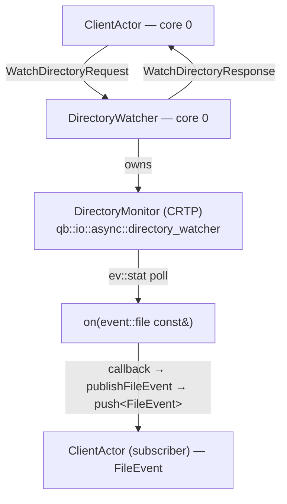

# File-monitor example: annotated walkthrough

> **Audience:** Adopter · **Status:** stable · **Verified-against:** qb 2.6.0 (C++20 default, C++23 supported)

A guided reading of `examples/core_io/file_monitor`, which wraps `qb::io::async::directory_watcher` inside an actor so file-system attribute changes arrive as ordinary typed events on a `VirtualCore`.

**Prerequisites:** [Asynchronous I/O inside actors](../async_in_actors.md), [Core/IO integration overview](../README.md) — **See also:** [File-processor example](./file_processor_analysis.md), [Message-broker example](./message_broker_analysis.md)

> **Where the sources live.** The `examples/core_io/…` paths cited below are in the companion **qb-examples** repository (mounted at the repo root as `examples/`), not under `qb/`. To open a file, look under `examples/core_io/file_monitor/` at the repository root.

## Summary

The example builds three actors that cooperate over typed events:

- `file_monitor::DirectoryWatcher` owns one or more low-level watchers and turns raw attribute-change notifications into application-level `FileEvent`s.
- `file_monitor::FileProcessor` consumes `FileEvent`s and maintains per-file metadata.
- `ClientActor` (defined in `main.cpp`) drives the demo: it requests a watch, fabricates file activity, and orchestrates shutdown.

The load-bearing integration point is that `qb::io::async::directory_watcher<_Derived>` is a CRTP base whose `on(qb::io::async::event::file const&)` callback runs on the same `VirtualCore` event loop that dispatches actor messages. The watcher needs no extra thread, lock, or queue: its notifications and the actor's `on(Event&)` handlers are serialized by the same loop.

> **Note on the checked-in sources.** The `examples/core_io/file_monitor` tree predates the canonical `std::chrono` time-model migration. It calls `start(path, 0.5)` and `qb::io::async::callback(fn, 0.5)` with bare `double` arguments. The current signatures take a `std::chrono` duration (`start(std::filesystem::path const&, qb::duration)`, `callback(_Func&&, std::chrono::duration<Rep, Period>)`), which does not accept a bare `double`. Every code block below shows the **current** API. Where it differs from the on-disk file, the difference is called out. Treat the signatures here, not the example text, as authoritative.

## Architecture



`main.cpp` places `DirectoryWatcher` and `ClientActor` on core `0` and `FileProcessor` on core `1`:

```cpp
// src: examples/core_io/file_monitor/main.cpp
qb::Main engine;

auto watcher_id   = engine.addActor<file_monitor::DirectoryWatcher>(0);
auto processor_id = engine.addActor<file_monitor::FileProcessor>(1, test_dir);
auto client_id    = engine.addActor<ClientActor>(0, watcher_id, test_dir, duration);

engine.start();
engine.join();
```

`qb::Main::addActor<_Actor>(CoreId index, args...)` constructs the actor on the named core and returns its `ActorId` (or `ActorId::NotFound` on failure). Constructor arguments after the core index are forwarded to the actor.

### Wiring caveat: who actually receives `FileEvent`?

In this `main.cpp`, only `ClientActor` subscribes to file events — it does so by sending a `WatchDirectoryRequest` carrying its own `id()` as the `requestor`. `DirectoryWatcher` records that `ActorId` and pushes `FileEvent`s only to recorded subscribers (see [Event detection and fan-out](#event-detection-and-fan-out)). `FileProcessor` is constructed but never sends a `WatchDirectoryRequest`, so as wired it does not receive `FileEvent`s from `DirectoryWatcher`. `FileProcessor` is a complete, standalone consumer of `FileEvent`; to feed it, route file events to `processor_id` as well — for example by adding `processor_id` to the subscriber set, or by having `ClientActor` (or `DirectoryWatcher`) `push<FileEvent>(processor_id, …)`. The walkthrough below describes `FileProcessor` on its own terms so you can wire it into your own topology.

## The watcher actor

**Headers:** `examples/core_io/file_monitor/watcher.h`, `watcher.cpp`.

`DirectoryWatcher` is a plain `qb::Actor`. It does not inherit the watcher itself; it composes a helper, `DirectoryMonitor`, which is the CRTP-derived watcher. This keeps the actor free to own several monitors (one per watched path) while each monitor binds exactly one `ev::stat` watcher.

### DirectoryMonitor: the CRTP watcher

```cpp
// src: examples/core_io/file_monitor/watcher.h
class DirectoryMonitor : public qb::io::async::directory_watcher<DirectoryMonitor> {
    FileEventCallback _callback;                 // std::function<void(const std::string&, FileEventType)>
    std::map<std::string, time_t> _last_mtimes;

public:
    explicit DirectoryMonitor(FileEventCallback callback);
    void on(qb::io::async::event::file const &event);   // notification entry point
    void startWatching(const std::string &path,
                       qb::duration interval = std::chrono::milliseconds(500));
    void stopWatching();
};
```

`qb::io::async::directory_watcher<_Derived>` is defined in `qb/include/qb/io/async/io.h`. It exposes two control methods and forwards one event:

| Member | Signature | Effect |
| --- | --- | --- |
| `start` | `void start(std::filesystem::path const &fpath, qb::duration interval = std::chrono::milliseconds(100)) noexcept` | Arms an `ev::stat` watcher on `fpath`, polling at `interval`. The watcher stores the path string internally and passes its address to libev, which keeps the pointer without copying — so the watcher owns the path for as long as it is armed. |
| `disconnect` | `void disconnect() noexcept` | Stops the watcher; no further events fire. |
| `on` (yours) | `void on(qb::io::async::event::file const &event)` | Called by the loop when the watched path's attributes change. Implemented by `_Derived`. |

`directory_watcher` sets `constexpr static bool do_read = false`, so — unlike `file_watcher` — it never reads the watched path's contents; it only forwards the attribute-change event to your `on` handler. The base `on(event::file const&)` invokes `_Derived::on(event)` only when `_Derived` defines that handler (detected at compile time via `qb::has_on`).

> **Interval is a `qb::duration`, not a `double`.** The checked-in `startWatching` declares `double interval = 0.5` and calls `start(path, 0.5)`. Against the current `start(std::filesystem::path const&, qb::duration)` that does not compile — `qb::duration` is `std::chrono::nanoseconds`, which has no implicit conversion from `double`. Pass a `std::chrono` duration: `start(path, std::chrono::milliseconds(500))`. The example's intent ("check every 500 ms") is preserved by `std::chrono::milliseconds(500)`. (The path parameter is now a `std::filesystem::path`; the example's `std::string` path argument converts implicitly.)

### How change detection works

`ev::stat` is poll-based. Every `interval`, libev calls `stat()` on the path and compares the result with the previous reading. When any monitored attribute differs, the loop fires `event::file`. On Linux, libev accelerates the watcher with inotify when `EV_USE_INOTIFY` is compiled in (it is by default), so a change can wake the poll sooner than the next tick; on every other platform — including the BSDs and macOS — `ev::stat` is purely periodic stat polling, with no kernel-notification fast path. Either way, the contract you program against is the stat-diff: you receive the current `struct stat` in `event.attr` and the prior one in `event.prev`. libev also floors very small intervals (`MIN_STAT_INTERVAL`, roughly 0.107 s); the 500 ms used here is well above that floor.

`qb::io::async::event::file` (in `qb/include/qb/io/async/event/file.h`) derives from `qb::io::async::event::base<ev::stat>`, which derives from libev's `ev::stat`. The fields the handler reads come from `ev_stat`:

| Field | Type | Meaning |
| --- | --- | --- |
| `event.path` | `const char *` | The watched path. |
| `event.attr` | `ev_statdata` (`struct stat`) | Current stat result. |
| `event.prev` | `ev_statdata` (`struct stat`) | Previous stat result. |

> **Deletion is signalled by link count, not `stat()` failure.** When a watched path is removed, `ev::stat` reports `event.attr.st_nlink == 0`. The header's reference example checks exactly that. The example's `DirectoryMonitor::on` instead re-checks existence with `std::filesystem::exists`, which is a second syscall after the event already told you the answer; `st_nlink == 0` is the cheaper, canonical test.

`DirectoryMonitor::on` classifies the change into a `FileEventType` and forwards it through the actor-supplied callback:

```cpp
// src: examples/core_io/file_monitor/watcher.cpp
void DirectoryMonitor::on(qb::io::async::event::file const &event) {
    std::string file_path = event.path;
    FileEventType event_type = FileEventType::MODIFIED;

    if (event.attr.st_mode != event.prev.st_mode ||
        event.attr.st_uid  != event.prev.st_uid  ||
        event.attr.st_gid  != event.prev.st_gid) {
        event_type = FileEventType::ATTRIBUTES_CHANGED;
    } else if (!std::filesystem::exists(file_path)) {
        event_type = FileEventType::DELETED;
    } else if (_last_mtimes.find(file_path) == _last_mtimes.end() ||
               event.attr.st_nlink > event.prev.st_nlink) {
        event_type = FileEventType::CREATED;
    } else if (event.attr.st_mtime != event.prev.st_mtime) {
        event_type = FileEventType::MODIFIED;
    }

    if (std::filesystem::exists(file_path))
        _last_mtimes[file_path] = event.attr.st_mtime;
    else
        _last_mtimes.erase(file_path);

    if (_callback)
        _callback(file_path, event_type);
}
```

This classifier is a teaching heuristic, not a precise file-system change log. `ev::stat` watches one path (the directory) and reports changes to *that path's* stat record; it does not enumerate which child file changed. The `FileEventType` derived here reflects the directory entry, and per-file granularity in this example comes from the `ClientActor` driving known files plus `FileProcessor` diffing content. For production change tracking, prefer a dedicated notification API over stat-diff heuristics.

### Turning a request into a watch

`DirectoryWatcher` registers its handlers in the constructor, the standard qb pattern:

```cpp
// src: examples/core_io/file_monitor/watcher.cpp
DirectoryWatcher::DirectoryWatcher() {
    registerEvent<WatchDirectoryRequest>(*this);
    registerEvent<UnwatchDirectoryRequest>(*this);
    registerEvent<qb::KillEvent>(*this);
}
```

`on(WatchDirectoryRequest&)` validates the path, records the subscriber, then defers the actual watcher setup to the next loop iteration with `qb::io::async::callback`:

```cpp
// src: examples/core_io/file_monitor/watcher.cpp
void DirectoryWatcher::on(WatchDirectoryRequest &request) {
    std::string normalized_path = std::filesystem::absolute(request.path).string();

    if (!std::filesystem::exists(normalized_path) ||
        !std::filesystem::is_directory(normalized_path)) {
        push<WatchDirectoryResponse>(request.requestor, normalized_path, false,
                                     "Path does not exist or is not a directory");
        return;
    }

    auto watch = getOrCreateWatch(normalized_path, request.recursive);
    if (std::find(watch->subscribers.begin(), watch->subscribers.end(),
                  request.requestor) == watch->subscribers.end())
        watch->subscribers.push_back(request.requestor);

    // Defer directory scan + watcher creation off the event-handler frame.
    qb::io::async::callback([this, normalized_path, watch, request]() {
        bool success = setupDirectoryWatch(normalized_path, watch, request.recursive);
        push<WatchDirectoryResponse>(request.requestor, normalized_path, success,
                                     success ? "" : "Failed to set up directory watch");
        _stats.directories_watched = _watched_directories.size();
        // … recompute files_monitored …
    });
}
```

Two integration details earn their place here:

- **`qb::io::async::callback` schedules onto this actor's loop.** It is not a thread pool. The closure runs later on the same `VirtualCore`, so it may touch `_watched_directories` and call `push<>` without synchronization. The single-overload form `callback(fn)` runs `fn()` immediately; the timed form `callback(fn, duration)` runs it after the duration (or immediately if the duration is `<= 0`). Here the immediate form is used purely to move a possibly slow directory scan out of the message-handler frame.
- **`push<WatchDirectoryResponse>(requestor, …)`** addresses the reply to the recorded `ActorId`. The response carries `success`, the normalized path, and an error string — the same envelope you would expect from any request/response actor pair.

> **`callback` takes a duration, not a `double`.** The checked-in `setupDirectoryWatch` calls `startWatching(path, 0.5)` and various `qb::io::async::callback(fn, 0.5)` / `callback(fn, seconds_as_int)`. The current overload set is `callback(_Func&&)` and `callback(_Func&&, std::chrono::duration<Rep, Period>)`; neither deduces from a bare `double` or `int`. Use `std::chrono::milliseconds(500)`, `std::chrono::seconds(duration)`, and so on.

### Recursion and subscriber tracking

`setupDirectoryWatch` creates the `DirectoryMonitor`, hands it a callback that both publishes the event and bumps statistics, then arms it:

```cpp
// src: examples/core_io/file_monitor/watcher.cpp (start() argument modernized)
watch->watcher = std::make_unique<DirectoryMonitor>(
    [this, path](const std::string &file_path, FileEventType event_type) {
        publishFileEvent(file_path, event_type);
        switch (event_type) {
            case FileEventType::CREATED:            _stats.created_events++;   break;
            case FileEventType::MODIFIED:           _stats.modified_events++;  break;
            case FileEventType::DELETED:            _stats.deleted_events++;   break;
            case FileEventType::ATTRIBUTES_CHANGED: _stats.attribute_events++; break;
        }
    });

watch->watcher->startWatching(path, std::chrono::milliseconds(500)); // was: 0.5
```

For a recursive request, the method iterates `std::filesystem::directory_iterator(path)` and recurses into each subdirectory, propagating the parent's subscriber list. Each subdirectory gets its own `DirectoryMonitor` and its own `ev::stat` watcher. State lives in a tree of `WatchInfo` nodes:

```cpp
// src: examples/core_io/file_monitor/watcher.h
struct WatchInfo {
    std::string path;
    bool recursive;
    std::vector<qb::ActorId> subscribers;
    std::unique_ptr<DirectoryMonitor> watcher;
    std::map<std::string, std::shared_ptr<WatchInfo>> subdirectories;
};
```

This recursion is a snapshot: directories created *after* the watch is set up are not auto-watched, because `ev::stat` watches a fixed path and the example does not re-scan on directory-modified events. That is an acceptable simplification for a demo; a production recursive watcher re-scans (or watches newly created subdirectories) when a directory's mtime changes.

### Event detection and fan-out

`publishFileEvent` picks the deepest watched directory that is a prefix of the changed path, then pushes one `FileEvent` per subscriber:

```cpp
// src: examples/core_io/file_monitor/watcher.cpp
void DirectoryWatcher::publishFileEvent(const std::string &file_path,
                                        FileEventType event_type) {
    std::shared_ptr<WatchInfo> watch;
    std::string watch_dir;
    for (const auto &pair : _watched_directories) {
        if (file_path.find(pair.first) == 0) {                 // path starts with dir
            if (watch_dir.empty() || pair.first.length() > watch_dir.length()) {
                watch_dir = pair.first;
                watch = pair.second;
            }
        }
    }
    if (watch)
        for (const auto &subscriber : watch->subscribers)
            push<FileEvent>(subscriber, file_path, event_type);
}
```

`push<FileEvent>(subscriber, file_path, event_type)` constructs the event in place and enqueues it to the destination actor. `FileEvent` is an ordinary `qb::Event` subtype defined in `events.h`; its constructor stamps `timestamp` with `std::chrono::system_clock::now()`. The prefix match iterates `_watched_directories` (top-level roots) only — it never inspects the per-root `subdirectories` tree. A subdirectory `DirectoryMonitor` created by recursion still calls back into this same `publishFileEvent`, but the loop resolves the changed path to the deepest *root* that prefixes it (the parent root, since the subdirectory lives under it) and pushes to that root's `subscribers`. The inherited subscriber list copied onto each child `WatchInfo` at setup time is therefore never read here; it is a snapshot of the root's subscribers and remains correct only because it was copied from that root.

### Teardown

`on(UnwatchDirectoryRequest&)` removes the requesting subscriber; when a path's subscriber list empties it calls `watcher->stopWatching()` and drops the `WatchInfo`. `on(qb::KillEvent&)` stops every monitor, clears the map, and calls `kill()` to terminate the actor. Both paths release the `ev::stat` watchers deterministically, because each lives in a `std::unique_ptr<DirectoryMonitor>` owned by its `WatchInfo`.

## The processor actor

**Headers:** `examples/core_io/file_monitor/processor.h`, `processor.cpp`.

`FileProcessor` is a self-contained `qb::Event` consumer. It keeps an `std::unordered_map<std::string, FileMetadata> _tracked_files` and dispatches on `FileEvent::type`:

```cpp
// src: examples/core_io/file_monitor/processor.cpp
void FileProcessor::on(FileEvent &event) {
    switch (event.type) {
        case FileEventType::CREATED:            processFileCreated(event.path);  break;
        case FileEventType::MODIFIED:           processFileModified(event.path); break;
        case FileEventType::DELETED:            processFileDeleted(event.path);  break;
        case FileEventType::ATTRIBUTES_CHANGED: /* no content action */          break;
    }
    updateStats(event.type);
}
```

For created and modified files it calls `extractMetadata`, which is the one place the example performs blocking file I/O inside a handler:

```cpp
// src: examples/core_io/file_monitor/processor.cpp
FileMetadata FileProcessor::extractMetadata(const std::string &path) {
    FileMetadata metadata;
    metadata.path = path;
    metadata.last_modified = /* fs::last_write_time(path) → system_clock */;
    metadata.size = std::filesystem::file_size(path);

    std::vector<char> content;
    qb::io::sys::file file;                         // <qb/io/system/file.h>
    if (file.open(path.c_str(), O_RDONLY) >= 0) {
        content.resize(metadata.size);
        auto bytes_read = file.read(content.data(), metadata.size);
        file.close();
        if (bytes_read >= 0) {
            std::size_t hash = 0;
            for (char c : content)
                hash = hash * 31 + static_cast<unsigned char>(c);
            metadata.content_hash = std::to_string(hash);
        }
    }
    return metadata;
}
```

Three facts to keep straight:

- **The type is `qb::io::sys::file` (namespace `qb::io::sys`), included from `<qb/io/system/file.h>`.** The header path says `system`, the namespace and type say `sys`. The header docstrings in the example that write "`qb::io::system::file`" are wrong on the namespace; the code is right.
- **`qb::io::sys::file` is synchronous, blocking I/O.** Its `open`, `read`, and `write` return `int` (a native descriptor, or a byte count, or `-1` on error); `close` returns `void`. `read`/`write` block the calling thread. Calling it inside `on(FileEvent&)` stalls the `VirtualCore` for the duration of the read. The teaching-sized files here make that negligible; for large files this read belongs in a worker actor or behind `qb::io::async::callback` so the event loop stays responsive. (`qb::io::sys::file` is the right tool for short, bounded reads; it is not an async transport.)
- **The hash is a rolling `* 31` polynomial, not a cryptographic digest.** It exists to distinguish a content change from a bare mtime touch — `processFileModified` re-hashes and compares against the stored `content_hash` to decide whether the file's bytes actually changed. Do not read it as integrity-grade hashing.

`shouldProcessFile` skips directories and (unless configured otherwise) dot-prefixed hidden files. `on(SetProcessingConfigRequest&)` flips `_process_hidden_files`; `on(GetProcessingStatsRequest&)` logs the running counters. All three are registered in the constructor alongside `qb::KillEvent`.

## The client actor

**Defined in:** `examples/core_io/file_monitor/main.cpp`.

`ClientActor` is both the orchestrator and a subscriber. Its lifecycle:

1. **`onInit()`** creates the test directory if absent and schedules `startMonitoring` shortly after, using the timed form of `qb::io::async::callback`:

   ```cpp
   // src: examples/core_io/file_monitor/main.cpp (duration modernized)
   qb::io::async::callback([this]() { startMonitoring(); },
                           std::chrono::milliseconds(500)); // was: 0.5
   ```

2. **`startMonitoring`** sends the watch request with `recursive = true`, passing its own `id()` as the subscriber:

   ```cpp
   // src: examples/core_io/file_monitor/main.cpp
   push<file_monitor::WatchDirectoryRequest>(_watcher_id, _test_directory, true, id());
   ```

3. **`on(WatchDirectoryResponse&)`** confirms the watch and starts the file-activity loop.

4. **File activity** runs through `qb::io::async::callback`. `createTestFile`/`modifyTestFile` open the file via `qb::io::sys::file` and write synchronously; `deleteTestFile` uses `std::filesystem::remove`. `scheduleRandomModifications` re-arms itself on a randomized delay, forming a self-perpetuating timed chain on the loop. Modernized, each delay is a `std::chrono` duration:

   ```cpp
   // src: examples/core_io/file_monitor/main.cpp (delay modernized)
   double secs = 0.5 + (std::rand() % 1000) / 1000.0;       // 0.5–1.5 s
   qb::io::async::callback([this]() { scheduleRandomModifications(); },
                           std::chrono::duration<double>(secs)); // was: callback(fn, secs)
   ```

   `std::chrono::duration<double>` is itself a `std::chrono::duration<Rep, Period>`, so it satisfies the `callback` template; the bare `double secs` does not.

5. **`on(FileEvent&)`** logs each notification it receives back from `DirectoryWatcher`.

6. **Shutdown.** After the configured run, a scheduled callback calls `broadcast<qb::KillEvent>()`, reaching every actor on every core. In its own `on(qb::KillEvent&)` the client first sends `UnwatchDirectoryRequest` to release the watch, then calls `kill()`.

## Concepts this example demonstrates

- **Composing a CRTP I/O primitive inside an actor.** `DirectoryWatcher` (the actor) owns `DirectoryMonitor` (the `directory_watcher<…>` CRTP derivative). The watcher's callback and the actor's handlers share one loop, so they share state without locks.
- **`event::file` as the seam to the OS.** `event.attr`/`event.prev` carry `struct stat` snapshots; your `on(event::file const&)` decides what changed.
- **Deferring work with `qb::io::async::callback`.** Both the watcher's setup scan and the client's timed file activity ride the per-actor loop rather than spawning threads.
- **Request/response and fan-out over typed events.** `WatchDirectoryRequest`/`WatchDirectoryResponse` form a request/response pair; `publishFileEvent` fans `FileEvent` out to a tracked subscriber set.
- **Deterministic resource teardown.** Each `ev::stat` watcher lives in a `unique_ptr` under a `WatchInfo`; unwatch and kill both release them explicitly.

## Pitfalls

- **The checked-in sources will not compile unmodified against qb 2.6.0.** They pass bare `double`/`int` to `start(…, qb::duration)` and `qb::io::async::callback(…, std::chrono::duration<Rep, Period>)`. Replace every such argument with a `std::chrono` duration, as shown above, before building.
- **Stat-diff watching is poll-based and coarse.** `ev::stat` polls at the configured interval and reports changes to the *watched path*, not per-child events. Changes within one interval can coalesce; a delete-then-recreate inside one poll window may surface as a single event. Pick `interval` for your latency/CPU trade-off, and do not expect per-file change journaling from this primitive.
- **`qb::io::sys::file` blocks the event loop.** It is synchronous. Reading a large file inside `on(FileEvent&)` stalls the owning `VirtualCore`. Offload large reads to a worker actor or a `qb::io::async::callback` continuation.
- **`FileProcessor` is not wired to receive events as shipped.** Only `ClientActor` subscribes. To exercise `FileProcessor`, add its `ActorId` to the subscriber set or forward `FileEvent`s to `processor_id` (see [Wiring caveat](#wiring-caveat-who-actually-receives-fileevent)).
- **Recursive watching is a one-time snapshot.** Subdirectories created after setup are not auto-watched. Re-scan on a directory-modified event if you need live recursion.
- **Hidden-file filtering is name-based.** `shouldProcessFile` treats any dot-prefixed leaf name as hidden, independent of OS-level hidden attributes.

## See also

- [Asynchronous I/O inside actors](../async_in_actors.md) — `qb::io::async::callback`, `directory_watcher`, and `event::file` in depth.
- [Core/IO integration overview](../README.md) — how `qb-core` actors host `qb-io` primitives.
- [File-processor example](./file_processor_analysis.md) — a companion walkthrough of metadata extraction and content diffing.
- [Message-broker example](./message_broker_analysis.md) — another request/response-plus-fan-out topology.
