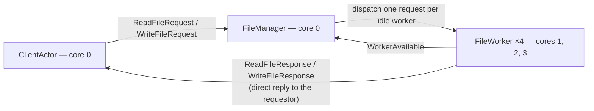

# File-processor walkthrough

> **Audience:** Adopter · **Status:** stable · **Verified-against:** qb 3.0.0 (C++20 default, C++23 supported)

An annotated reading of `examples/05-services/03-file-pipeline/`: a manager-worker topology that confines blocking file I/O to dedicated worker cores so the rest of the actor system stays responsive.

**Prerequisites:** [Actor model](../../2_core_concepts/actor_model.md), [Event system](../../2_core_concepts/event_system.md), [Messaging](../../4_qb_core/messaging.md), [Engine](../../4_qb_core/engine.md) — **See also:** [Async in actors](../async_in_actors.md), [`qb-io` async system](../../3_qb_io/async_system.md), [Actor reference](../../4_qb_core/actor.md), [Core & IO integration overview](../README.md)

<!-- src: examples/05-services/03-file-pipeline/ -->

## Summary

Synchronous file I/O blocks the calling thread, and an actor's thread is its entire [`VirtualCore`](../../4_qb_core/engine.md). A single blocking `read` or `write` in a message handler therefore stalls every actor sharing that core. This example addresses the problem with a two-part design:

- A pool of **`FileWorker`** actors placed on cores reserved for I/O, so blocking is contained to those cores.
- A **`FileManager`** dispatcher that tracks which workers are idle and routes one request to one worker at a time, queueing the rest.

A `ClientActor` drives the system: it writes five test files, reads each one back, and triggers a coordinated shutdown when every request has been answered.

> **Read this as a pattern study, not a copy-paste template.** The example trades correctness for brevity in places this page calls out under [Pitfalls](#pitfalls-and-corrections). Most importantly, the worker's `qb::io::async::callback` is the *no-delay* overload, which runs **inline** rather than deferring to a later loop turn — the responsiveness benefit comes from the dedicated worker cores, not from the callback itself. Where the source and the current API disagree, the API is ground truth.

## Architecture at a glance



All three actor types derive from `qb::Actor`, register their handlers in the constructor with `registerEvent<T>(*this)`, and communicate exclusively through `push<Event>(destination, ...)` and `broadcast<Event>(...)`. Note the response path: each worker replies **directly to the client**, not back through the manager. The manager only learns that a worker is free again, through a separate `WorkerAvailable` event.

## Domain model

Five event types in `messages.h` carry the protocol. Each derives from `qb::Event` and uses [`qb::string<256>`](../../0_foundations/containers.md) for paths and error text so the events stay copyable, plus a `std::shared_ptr<std::vector<char>>` for file bodies so payloads are shared by reference rather than copied per hop.

```cpp
// src: examples/05-services/03-file-pipeline/messages.h
namespace qb-example-services-file-pipeline {

struct ReadFileRequest : public qb::Event {
    qb::string<256> filepath;    // path of the file to read
    qb::ActorId     requestor;   // actor to receive the response
    uint32_t        request_id;  // correlation id

    ReadFileRequest(const char *path, qb::ActorId req_id, uint32_t id)
        : filepath(path), requestor(req_id), request_id(id) {}
};

struct ReadFileResponse : public qb::Event {
    qb::string<256>                    filepath;
    std::shared_ptr<std::vector<char>> data;        // file content (shared, not copied)
    bool                               success;
    qb::string<256>                    error_msg;
    uint32_t                           request_id;
    // ... constructor ...
};

struct WriteFileRequest : public qb::Event {
    qb::string<256>                    filepath;
    std::shared_ptr<std::vector<char>> data;        // content to write
    qb::ActorId                        requestor;
    uint32_t                           request_id;
    // ... constructor ...
};

struct WriteFileResponse : public qb::Event {
    qb::string<256> filepath;
    size_t          bytes_written;
    bool            success;
    qb::string<256> error_msg;
    uint32_t        request_id;
    // ... constructor ...
};

struct WorkerAvailable : public qb::Event {
    qb::ActorId worker_id;   // identifies the now-idle worker
    explicit WorkerAvailable(qb::ActorId id) : worker_id(id) {}
};

} // namespace qb-example-services-file-pipeline
```

The `requestor` field is what enables the direct-reply path: a request carries the `ActorId` that should receive the eventual response, and that id flows unchanged from client to manager to worker. The `request_id` lets the client correlate responses with its outstanding requests.

## The `FileManager` dispatcher

`FileManager` keeps three pieces of state: a set of idle worker ids and two FIFO queues of pending requests (`file_manager.h`).

```cpp
// src: examples/05-services/03-file-pipeline/file_manager.h
class FileManager : public qb::Actor {
    std::unordered_set<qb::ActorId> _available_workers;
    std::queue<ReadFileRequest>     _read_requests;
    std::queue<WriteFileRequest>    _write_requests;
    std::atomic<uint32_t>           _request_counter{0};

public:
    FileManager() {
        registerEvent<ReadFileRequest>(*this);
        registerEvent<WriteFileRequest>(*this);
        registerEvent<WorkerAvailable>(*this);
        registerEvent<ReadFileResponse>(*this);
        registerEvent<WriteFileResponse>(*this);
        registerEvent<qb::KillEvent>(*this);
    }

    qb::io::async::task<bool> onInit() override {
        qb::io::cout() << "FileManager initialized with ID " << id()
                       << " on core " << id().index() << std::endl;
        co_return true;
    }
    // handlers below
};
```

`id().index()` returns the [`CoreId`](../../4_qb_core/engine.md) hosting the actor (`ActorId::index()` is the core component of the compound id), which is why the log line reports the core.

### Dispatch on request

When a read request arrives, the manager either hands it straight to an idle worker or queues it:

```cpp
// src: examples/05-services/03-file-pipeline/file_manager.h
void on(ReadFileRequest &request) {
    if (request.requestor == qb::ActorId{})       // fill in the sender if unset
        request.requestor = request.getSource();
    if (request.request_id == 0)                  // assign a correlation id if unset
        request.request_id = ++_request_counter;

    if (!_available_workers.empty()) {
        qb::ActorId worker_id = *_available_workers.begin();
        _available_workers.erase(worker_id);      // mark the worker busy
        push<ReadFileRequest>(worker_id, request.filepath.c_str(),
                              request.requestor, request.request_id);
    } else {
        _read_requests.push(request);             // no worker free — queue it
    }
}
```

Two details:

- The request is **rebuilt**, not forwarded. `push<ReadFileRequest>(worker_id, ...)` constructs a fresh event addressed to the worker, copying the three fields the worker needs. The example does not use [`forward`](../../4_qb_core/messaging.md), so the `requestor` field — not `getSource()` — is the worker's source of truth for where to reply.
- The `requestor`/`request_id` defaulting branches are dormant in this example: `ClientActor` always sets both. They show the manager *could* assign ids for clients that omit them, using `getSource()` to recover the sender's [`ActorId`](../../4_qb_core/messaging.md).

`on(WriteFileRequest&)` is identical except that it also carries the `data` shared pointer through to the worker.

### Re-dispatch when a worker frees up

`WorkerAvailable` is the only signal the manager gets that a worker has finished. It drains the queues, reads first:

```cpp
// src: examples/05-services/03-file-pipeline/file_manager.h
void on(WorkerAvailable &msg) {
    if (!_read_requests.empty()) {                // reads take priority
        ReadFileRequest request = _read_requests.front();
        _read_requests.pop();
        push<ReadFileRequest>(msg.worker_id, request.filepath.c_str(),
                              request.requestor, request.request_id);
    } else if (!_write_requests.empty()) {
        WriteFileRequest request = _write_requests.front();
        _write_requests.pop();
        push<WriteFileRequest>(msg.worker_id, request.filepath.c_str(),
                               request.data, request.requestor, request.request_id);
    } else {
        _available_workers.insert(msg.worker_id); // nothing pending — park the worker
    }
}
```

This is the load-balancing core: a worker that reports availability is immediately reassigned if work is waiting, and only added back to the idle set when both queues are empty. Read-before-write ordering is a fixed policy, not weighted fairness — a steady stream of reads can starve writes.

### The response handlers are dead code here

`FileManager` registers and defines `on(ReadFileResponse&)` and `on(WriteFileResponse&)`, which forward a response to `response.getSource()`. **Neither runs in this example.** Workers reply directly to the client (see below), so no response is ever addressed to the manager. The handlers are scaffolding for an alternative topology where responses route back through the manager; in the shipped flow they are unreachable. Treat them as illustrative, not as part of the live path.

## The `FileWorker` executor

A worker holds only its manager's id and a busy flag. It announces itself on startup:

```cpp
// src: examples/05-services/03-file-pipeline/file_worker.h
class FileWorker : public qb::Actor {
    qb::ActorId _manager_id;
    bool        _is_busy = false;

public:
    explicit FileWorker(qb::ActorId manager_id) : _manager_id(manager_id) {
        registerEvent<ReadFileRequest>(*this);
        registerEvent<WriteFileRequest>(*this);
        registerEvent<qb::KillEvent>(*this);
    }

    qb::io::async::task<bool> onInit() override {
        qb::io::cout() << "FileWorker " << id() << " initialized on core "
                       << id().index() << std::endl;
        notifyAvailable();                        // tell the manager we're idle
        co_return true;
    }
    // handlers below

private:
    void notifyAvailable() {
        if (!_is_busy)
            push<WorkerAvailable>(_manager_id, id());
    }
};
```

### Running the blocking call

The read handler wraps the synchronous file operations in `qb::io::async::callback` and replies to the original requestor:

```cpp
// src: examples/05-services/03-file-pipeline/file_worker.h
void on(ReadFileRequest &request) {
    _is_busy = true;
    auto file_content = std::make_shared<std::vector<char>>();

    qb::io::async::callback([this, request, file_content]() {
        qb::io::sys::file file;
        bool        success = false;
        std::string error_msg;

        if (file.open(request.filepath.c_str(), O_RDONLY) >= 0) {
            struct stat st;
            if (stat(request.filepath.c_str(), &st) == 0) {
                size_t file_size = static_cast<size_t>(st.st_size);
                file_content->resize(file_size);
                ssize_t bytes_read = file.read(file_content->data(), file_size);  // API returns int
                if (bytes_read >= 0) {
                    if (static_cast<size_t>(bytes_read) < file_size)
                        file_content->resize(bytes_read);                     // trim to actual
                    success = true;
                } else {
                    error_msg = "Read error: ";  error_msg += strerror(errno);
                }
            } else {
                error_msg = "Unable to get file size: ";  error_msg += strerror(errno);
            }
            file.close();
        } else {
            error_msg = "Unable to open file: ";  error_msg += strerror(errno);
        }

        push<ReadFileResponse>(request.requestor, request.filepath.c_str(),
                               file_content, success,
                               success ? "" : error_msg.c_str(), request.request_id);
        _is_busy = false;
        notifyAvailable();                        // ready for the next task
    });
}
```

Key facts, grounded in the headers:

- The type is **`qb::io::sys::file`** (namespace `qb::io::sys`), included from `<qb/io/system/file.h>`. There is no `qb::io::system::file` alias. The example's own doc comments used to write it that way — the header path says `system`, the namespace and type say `sys` — and they were corrected with the 3.0 move. <!-- src: qb/src/qb/io/system/file.h:44,56 -->
- `file::open(std::filesystem::path const&, int flags = O_RDWR, int mode = 0644)` returns the native descriptor or `-1`; `read`/`write` return an **`int`** (bytes transferred, `0` for EOF, negative on error), not `ssize_t`. The path parameter is a `std::filesystem::path`, so the example's `request.filepath.c_str()` (a `qb::string<256>`) still binds via the implicit `path` construction. <!-- src: qb/src/qb/io/system/file.h:139,157,166 -->
- `sys::file` is a move-only RAII owner of its descriptor: copy is deleted and the destructor closes the handle. The explicit `file.close()` is therefore redundant (the destructor would close on scope exit) but harmless. <!-- src: qb/src/qb/io/system/file.h:78-79,99 -->
- The reply is addressed to **`request.requestor`** — the client's id — so the response skips the manager entirely. After replying, the worker calls `notifyAvailable()`, which `push`es `WorkerAvailable` to the manager.

The write handler mirrors this with `O_WRONLY | O_CREAT | O_TRUNC` and mode `0644`, reports `bytes_written`, and treats a short write as a failure.

### Why this keeps the core responsive — and the caveat

The intent of the pattern is sound: blocking I/O is delegated to workers on cores reserved for that purpose ([`async_in_actors.md` → Blocking file I/O](../async_in_actors.md#blocking-file-io-from-an-actor) catalogs this as pattern 2), so a slow disk stalls only the I/O cores.

But the *callback* in this example does **not** defer the work. `qb::io::async::callback(func)` — the overload with no delay — invokes `func()` **inline at the call site**; so does the timed overload when the duration is non-positive. <!-- src: qb/src/qb/io/async/io.h:348,368-369,376-378 --> The blocking `read`/`write` therefore runs synchronously inside the worker's `on(...)` handler, on the worker's core. What the design actually buys is **core isolation** (the manager and client on core 0 never block on disk) plus a clean place to factor the I/O code — not asynchrony within the worker. To truly defer the blocking call to a later loop turn you would pass a strictly positive `qb::duration`; to make the worker itself non-blocking you would need a thread pool or `file_watcher`-style readiness, neither of which this example uses.

## The `ClientActor` driver

`ClientActor` (in `main.cpp`) registers for the two response types, then schedules its test run shortly after init:

```cpp
// src: examples/05-services/03-file-pipeline/main.cpp
qb::io::async::task<bool> onInit() override {
    if (!fs::exists(_test_directory))
        fs::create_directories(_test_directory);
    scheduleTick<StartTestsTick>(500ms);   // spawn + ctx.sleep — see the note below
    co_return true;
}

// The local helper both delays go through. Everything that touches actor state happens in
// on(StartTestsTick&) / on(ShutdownTick&), because a handler only runs on a live actor.
template <typename TickEvent>
void scheduleTick(qb::duration d) {
    spawn([d](qb::ScopedCoroContext ctx) -> qb::io::async::task<void> {
        co_await ctx.sleep(d);
        ctx.template push<TickEvent>();
    });
}
```

`startTests()` writes five files; each write response triggers a read of the same file; each read response is printed. The client counts outstanding requests in `_pending_requests` and, once that reaches zero, schedules a coordinated shutdown:

```cpp
// src: examples/05-services/03-file-pipeline/main.cpp
void checkCompletion() {
    if (_pending_requests == 0)
        scheduleTick<ShutdownTick>(1s);           // chrono literal — see Pitfalls
}

void on(ShutdownTick&) {
    broadcast<qb::KillEvent>();                   // fan out shutdown to every actor
}
```

`broadcast<qb::KillEvent>()` delivers a [`qb::KillEvent`](../../4_qb_core/messaging.md) to every actor on every core; each actor's `on(qb::KillEvent&)` handler calls `kill()`, and the engine's `join()` in `main` returns once all cores have drained.

## Engine wiring

`main` builds the topology: one manager and one client on core 0, four workers spread across cores 1–3.

```cpp
// src: examples/05-services/03-file-pipeline/main.cpp
qb::Main engine;

auto manager_id = engine.addActor<FileManager>(0);

const int num_workers = 4;
for (int i = 0; i < num_workers; ++i) {
    int core_id = 1 + (i % 3);                    // cores 1, 2, 3, 1
    engine.addActor<FileWorker>(core_id, manager_id);
}

auto client_id = engine.addActor<ClientActor>(0, manager_id, test_dir);

engine.start();
engine.join();
```

`engine.addActor<T>(core_id, args...)` constructs the actor on the named core and returns its [`ActorId`](../../4_qb_core/messaging.md); the trailing arguments are forwarded to the constructor (here the `FileWorker` receives `manager_id`). Because four workers map onto three cores, core 1 hosts two workers — they share that core's single thread and serialize their blocking reads against each other, which is worth remembering when reasoning about throughput.

## Pitfalls and corrections

- **`callback(func)` with no delay runs inline.** This is the central correction to the example's framing: the worker's blocking I/O executes synchronously inside the message handler, not on a later loop turn. The responsiveness guarantee comes from placing workers on dedicated cores, not from the callback. Pass a strictly positive `qb::duration` to genuinely defer. <!-- src: qb/src/qb/io/async/io.h:348,368-369,376-378 -->
- **The worker's lambdas capture `this` — harmlessly, because they fire inline.** Both worker callbacks are the *no-delay* overload, so `this` is necessarily valid: the call happens inside the handler that made it. <!-- src: examples/05-services/03-file-pipeline/file_worker.h:112 -->
- **A `this`-capturing lambda with a real delay is a dangling timer — this client used to have two.** `ClientActor::onInit()` armed `qb::io::async::callback([this]() { startTests(); }, 500ms)` and the completion path armed `qb::io::async::callback([this]() { broadcast<qb::KillEvent>(); }, 1s)`. Both called a member function on a raw `this` after a delay, and the timed overload heap-allocates a `Timeout` owned by the **listener**, not by the actor — nothing cancels it if the actor dies first. <!-- src: qb/src/qb/io/async/io.h:389 --> In the shipped happy path nothing killed `ClientActor` before either fired, so it was a latent shape rather than an observed crash — which is exactly why it survived so long; adapt such code and it becomes a live one. **Adding `is_alive()` is not the fix** — it is a member read (`qb/src/qb/core/Actor.cpp:205-208`), so on a destroyed actor the guard is itself the use-after-free. Both sites now bind the wait to the actor through `scheduleTick<T>(d)`, which is `spawn([d](qb::ScopedCoroContext ctx) -> qb::io::async::task<void> { co_await ctx.sleep(d); ctx.template push<T>(); })`, whose scope `Actor::kill()` cancels. <!-- src: qb/src/qb/core/Actor.h:1238-1239 --> Note that it is not a mechanical substitution: the body may not touch actor state after the `co_await`, so each delay also needs a tick event and a handler. See [Async in actors → capture safety](../async_in_actors.md#capture-safety-the-actor-may-be-gone).
- **The manager's response handlers never run.** `FileManager::on(ReadFileResponse&)` / `on(WriteFileResponse&)` are registered but unreachable, because workers reply to the client directly. Do not cite them as the response path. If you want responses to flow through the manager (for example, to centralize logging or retries), have the worker reply to `_manager_id` and let the manager `forward` to `response.requestor`.
- **Delays are `std::chrono` durations, not `double`.** Earlier revisions passed a bare `double` (`0.5`, `1.0`); neither `callback(_Func&&, std::chrono::duration<Rep, Period>)` nor `ScopedCoroContext::sleep(qb::duration)` matches a `double`. The example now uses the [`qb` chrono literals](../../0_foundations/time.md) — `scheduleTick<StartTestsTick>(500ms)` and `scheduleTick<ShutdownTick>(1s)`. **Those suffixes need a using-directive in scope**: `qb::time_literals` is an inline namespace that re-exports `std::chrono_literals`, so each translation unit needs `using namespace qb::time_literals;` (or `std::chrono_literals`). The snippets above omit it for brevity; without it the block fails to compile with `no matching literal operator for call to 'operator""ms'`. <!-- src: qb/src/qb/io/async/io.h:372-374 ; qb/src/qb/system/time.h:112-114 -->
- **Read priority can starve writes.** `on(WorkerAvailable&)` always drains `_read_requests` before `_write_requests`. Under sustained read load, queued writes wait indefinitely. A fair dispatcher would interleave the two queues.
- **More workers than cores share a thread.** Mapping four workers onto three cores means two workers contend for one core's thread; their blocking I/O serializes. Size the worker pool to the I/O cores you actually reserved.
- **`stat` outside the descriptor races.** The read path calls `stat(path)` separately from `open(path)`, so the size can change between the two calls. For exactly-correct reads, `fstat` the open descriptor or read in a loop until EOF.

## Build and run

```bash
# from the repository root (qb-dev), using the CMake presets
cmake --preset release && cmake --build --preset release --target qb-example-services-file-pipeline
./build/presets/release/examples/05-services/03-file-pipeline/qb-example-services-file-pipeline
```

The binary creates `./test_files/`, writes and reads five files, prints each operation, and shuts down cleanly. The CMake target links only `qb-core` (which transitively pulls in `qb-io`); no module dependencies are required, and its name is derived from the project directory rather than written down. <!-- src: examples/05-services/03-file-pipeline/CMakeLists.txt:35 -->

## See also

- [Async in actors](../async_in_actors.md) — the three patterns for keeping a core responsive under blocking I/O, including this manager-worker topology.
- [Message-broker walkthrough](./message_broker_analysis.md) — a publish/subscribe variant of the dispatcher pattern with zero-copy payload sharing.
- [File-monitor walkthrough](./file_monitor_analysis.md) — reacting to filesystem changes with `directory_watcher` instead of polling.
- [Messaging](../../4_qb_core/messaging.md) — `push`, `broadcast`, `forward`, and `ActorId` routing in full.
- [Reference: `qb-io` async system](../../3_qb_io/async_system.md) — `callback`, `scoped_callback`, and timer semantics.
