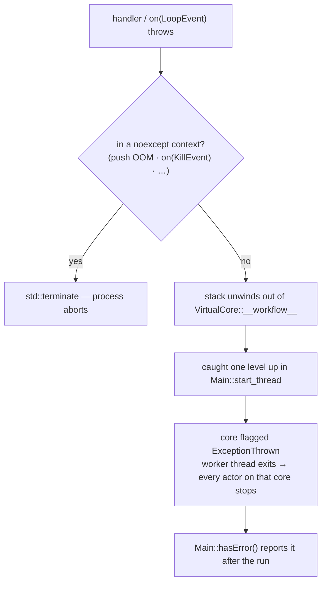

# Error handling and resilience

> **Audience:** Adopter · **Status:** stable · **Verified-against:** qb 3.0.1 (C++20 default, C++23 supported)

How qb propagates, contains, and reports failure: the exception policy, the `VirtualCore` fail-stop boundary, supervision patterns you build yourself, asynchronous I/O error events, and the `async::callback` lifetime rules.

**Prerequisites:** [Getting started](./getting_started.md), [Core concepts](../2_core_concepts/README.md) — **See also:** [Core invariants](../7_reference/core_invariants.md), [I/O invariants](../7_reference/io_invariants.md), [The async system](../3_qb_io/async_system.md), [Resource management](./resource_management.md)

## Summary

qb does not implement an Erlang-style supervision tree. It gives you three things and expects you to compose the rest:

1. **Isolation.** Actors share no state, so a logic error in one actor cannot corrupt another actor's data.
2. **A fail-stop boundary.** An exception that escapes an actor handler is *not* caught per-actor. It unwinds the worker thread, stopping every actor on that `VirtualCore`. The engine records the failure; `qb::Main::hasError()` reports it after the run ends.
3. **Typed I/O error events.** Network and protocol failures arrive as `qb::io::async::event::disconnected`, not as exceptions.

Everything above the boundary — health checks, restart, escalation — is application code built from ordinary actors, events, and timers. This page documents the boundary precisely, then the patterns you build on top of it.

The single most consequential rule: **an uncaught exception does not crash one actor — it stops the whole core.** Design handlers so that a throw is either impossible or caught locally.

## Concepts

### The exception policy

qb has no per-event or per-actor `try`/`catch`. The worker loop (`VirtualCore::__workflow__`, `src/qb/core/VirtualCore.cpp`) dispatches events and `on(qb::LoopEvent const&)` ticks directly, with no exception barrier around each call. The only `catch` is one level up, in `Main::start_thread` (`src/qb/core/Main.cpp`), which wraps the *entire* lifetime of the loop:

```cpp
// src: qb/src/qb/core/Main.cpp (Main::start_thread, abridged)
try {
    // ... initialise the core and its actors ...
    core.__workflow__();                       // runs until all actors die
} catch (const std::exception &e) {
    LOG_CRIT("Exception thrown on " << core << " what:" << e.what());
    params.sync_start.store(VirtualCore::Error::ExceptionThrown,
                            std::memory_order_release);
}
```

The consequence: when an `on(Event&)` handler or an `on(qb::LoopEvent const&)` throws and the actor does not catch it, the stack unwinds out of `__workflow__`, the worker thread of that `VirtualCore` exits, and **every actor pinned to that core stops** — no further events, no further `on(qb::LoopEvent const&)` ticks. The engine flags the core with `VirtualCore::Error::ExceptionThrown`.

This is a deliberate fail-stop design: a thrown exception signals that an invariant the actor relied on has been violated, and the runtime declines to keep running corrupt or half-initialized state. It is not a recovery mechanism. The handler-level corollary is below.

> **Note.** Both arms of the `start_thread` boundary are caught: `catch (const std::exception &)` logs `what()`, and a `catch (...)` beside it logs "Non-standard exception thrown". **Both store the same `VirtualCore::Error::ExceptionThrown`** (`src/qb/core/Main.cpp:356-366`), so a non-`std::exception` throw does not terminate the process — that handler exists precisely to stop it escaping a `noexcept` function. Throw `std::exception` subtypes anyway: only that arm can log *what* was thrown.



### `noexcept` boundaries

Several framework operations are marked `noexcept` and therefore cannot signal failure by throwing. Their failure modes are different:

| Operation | Signature (excerpt) | Failure mode |
|---|---|---|
| `Actor::push<E>(dest, …)` | `_Event &push(ActorId const&, …) const noexcept` | On allocation failure under OOM, calls `std::terminate`. Does not throw. |
| `Actor::send<E>(dest, …)` | `void send(ActorId const&, …) const noexcept` | As above; unordered, best-effort variant. |
| `Actor::kill()` | `void kill() const noexcept` | Cannot fail; schedules removal. |
| `Actor::is_alive()` | `bool is_alive() const noexcept` | Cannot fail; queries liveness. |
| `Actor::on(KillEvent const&)` | `void on(KillEvent const&) noexcept` | The default kill path is `noexcept`. |
| `IProtocol::not_ok()` / `ok()` / `reset()` | all `noexcept` | `not_ok()`/`reset()` mutate state, `ok()` queries it; none can fail. |

Two practical rules follow. First, sending an event never throws, so you cannot use `try`/`catch` around `push()` to detect a bad destination — sending to a dead or nonexistent `ActorId` is silently dropped, not an error (see [Failure modes at a glance](#failure-modes-at-a-glance)). Second, if you override a handler the framework calls in a `noexcept` context, do not let it throw: an exception crossing a `noexcept` boundary is an immediate `std::terminate`, bypassing even the `start_thread` catch.

### Failure modes at a glance

| Failure | How it surfaces | Default behavior | Who observes it |
|---|---|---|---|
| Exception escapes a handler / `on(qb::LoopEvent const&)` | Stack unwind to `start_thread` | Worker thread exits; all actors on that core stop; core flagged `ExceptionThrown` | `Main::hasError()` after the run |
| Exception in `noexcept` context (e.g. `push` OOM, throwing `on(KillEvent)`) | `std::terminate` | Process aborts | OS / crash handler |
| `onInit()` returns `false` at runtime (`addRefActor`) | Actor not added | Actor destroyed immediately; never processes events | The code calling `addRefActor` (returns an invalid handle/id) |
| `onInit()` returns `false` at startup (pre-start `addActor`) | Core flagged `BadActorInit` | Core fails to start | `Main::hasError()` after the run; `LOG_CRIT` logs |
| `onInit()` throws at startup | Caught inside `__drive_init__`; converted to an init failure | Core flagged `BadActorInit` (not `ExceptionThrown`); core fails to start | `Main::hasError()` after the run; `LOG_CRIT` logs |
| `push`/`send` to a dead or unknown `ActorId` | Silent | Event dropped; sender keeps running | Nobody — design an explicit ack/timeout if you need to know |
| Peer closes, socket error, protocol violation | `on(event::disconnected&&)` | Connection disposed; event delivered to the I/O component | The actor's `disconnected` handler |
| Callback exception (`async::callback`, `scoped_callback`) | Swallowed | Caught by an internal `catch (...)`. `async::callback`'s `Timeout` (`src/qb/io/async/io.h:211`) then deletes itself; `scoped_callback`'s `ScopedTimeout` (`src/qb/io/async/io.h:410`) does **not** — it is owned by its handle and only marks itself fired | Nobody — see [the callback footgun](#the-asynccallback-lifetime-footgun) |

## Actor-level error management

Because an escaping exception stops the whole core, keep failure inside the actor that owns it. Two techniques cover most cases.

### Catch where you can recover

Wrap any operation that may throw — third-party calls, parsing, allocation you cannot otherwise bound — in a local `try`/`catch`, and turn the failure into a value: log it, reply with a status event, transition to a degraded state, or self-terminate with `kill()`.

```cpp
// src: derived from qb/tests/core/system/init/init-lifecycle.cpp
#include <qb/actor.h>
#include <qb/io.h>
#include <qb/string.h>
#include <stdexcept>
#include <utility>

struct ProcessCommand : qb::Event {
    qb::string<128> command;
    explicit ProcessCommand(qb::string<128> cmd) : command(std::move(cmd)) {}
};
struct CommandStatus : qb::Event {
    bool            success;
    qb::string<256> info;
    CommandStatus(bool ok, qb::string<256> text) : success(ok), info(std::move(text)) {}
};

class CommandHandler : public qb::Actor {
public:
    qb::io::async::task<bool> onInit() override {
        registerEvent<ProcessCommand>(*this);
        co_return true;
    }

    void on(const ProcessCommand &event) {
        try {
            if (event.command.empty())
                throw std::invalid_argument("command cannot be empty");
            // ... perform the work that may throw ...
            push<CommandStatus>(event.getSource(), true, "processed");
        } catch (const std::invalid_argument &ex) {
            push<CommandStatus>(event.getSource(), false, ex.what());
        } catch (const std::exception &ex) {
            // Unexpected: report, then decide whether this actor can continue.
            push<CommandStatus>(event.getSource(), false, "internal error");
            // For an unrecoverable inconsistency, take this actor out of service:
            // kill();
        }
    }
};
```

If you do *not* catch here, the throw stops every actor on the core, not just `CommandHandler`. That is almost never what you want for a recoverable, expected failure.

### Model expected failure as data, not exceptions

When failure is routine — validation rejects input, a resource is momentarily unavailable, a lookup misses — represent the outcome in the reply event rather than throwing. Exceptions are for violated invariants, not control flow.

```cpp
struct ValidateData : qb::Event { int value; };
struct ValidationResult : qb::Event {
    bool is_valid;
    qb::string<128> message;
};
// The responder validates and replies; the caller branches on is_valid.
// No exception is thrown for an invalid-but-expected input.
```

### Self-termination with `kill()`

If an actor reaches a state from which it cannot safely continue, it calls `this->kill()`. `kill()` is `noexcept` and schedules the actor for removal at the end of the current loop iteration (the actor finishes the current handler first, and may still process events already in its queue — `kill()` stops *new* events reaching it, not the ones already queued; `src/qb/core/Actor.h:363-373`). This is the right last step in a `catch` block for an unrecoverable, *local* fault — it removes one actor without taking down the core.

`kill()` does not notify anyone. If a supervisor needs to know, `push` a notification event to it *before* calling `kill()` (see [Supervision](#supervision-you-build-yourself)).

## The `VirtualCore` fail-stop boundary

When the engine stops, you can ask whether any core failed.

```cpp
// src: derived from qb/tests/core/system/init/init-lifecycle.cpp
#include <qb/main.h>

qb::Main main;
main.addActor<CommandHandler>(/* core */ 0);

main.start(/* async = */ false);   // blocks until all actors on all cores die
if (main.hasError()) {
    // At least one VirtualCore stopped abnormally (bad init or unhandled exception).
    // Inspect logs for the cause; the engine does not expose a per-core reason here.
}
```

`Main::hasError()` is `[[nodiscard]] bool hasError() const noexcept`. It reports `true` when the engine's start-barrier word reached any value at or above the first error sentinel, `VirtualCore::Error::BadInit`. The error sentinels, from `qb::VirtualCore::Error` (`src/qb/core/VirtualCore.h`), are bit flags:

| Sentinel | Value | Meaning |
|---|---|---|
| `BadInit` | `1u << 9` | The `VirtualCore` itself failed to initialize. |
| `NoActor` | `1u << 10` | The core started with zero actors. |
| `BadActorInit` | `1u << 11` | An actor's `onInit()` failed during startup — either it returned `false`, or it threw (the throw is caught inside `__drive_init__` and converted to this outcome, not `ExceptionThrown`). |
| `ExceptionThrown` | `1u << 12` | During execution, an unhandled exception escaped an actor handler or `on(qb::LoopEvent const&)` out of `__workflow__` and was caught at `start_thread` (a startup `onInit()` throw does *not* reach here — it becomes `BadActorInit`). |

`hasError()` collapses all of these to a single boolean; it does not tell you *which* core failed or which sentinel fired. Use it as a post-run health gate (CI, supervised relaunch) and rely on the critical log lines (`LOG_CRIT`) for the specific cause. For finer-grained detection at runtime, build it yourself with the supervision patterns below.

> **Note.** `hasError()` is only meaningful after the run has stopped — after `main.start(false)` returns, or after the thread you joined from `main.start(true)` has been joined. It reflects the start barrier, not a live per-iteration health signal.

## Supervision you build yourself

qb-core ships no built-in supervisor hierarchy. You assemble supervision from the primitives you already have: actors, events, and timers. The two building blocks are *liveness detection* and *recovery*.

### Liveness: health-check with a timeout

A supervisor periodically pings its workers and expects a prompt pong. It arms a timeout per ping; if the pong does not arrive in time, the worker is presumed lost. The timeout is scheduled with `qb::io::async::callback`, and the supervisor self-sends a check event when it fires.

```cpp
// Supervision skeleton — liveness via ping/pong with a per-ping timeout.
#include <qb/actor.h>
#include <qb/io/async.h>
#include <qb/string.h>
#include <chrono>
#include <map>
#include <string_view>
#include <utility>
#include <vector>

struct PingWorker  : qb::Event {};
struct PongWorker  : qb::Event {};
struct TimeoutCheck : qb::Event {                        // supervisor self-send
    qb::ActorId worker;
    explicit TimeoutCheck(qb::ActorId w) : worker(w) {}
};
struct WorkerError : qb::Event {
    qb::string<128> detail;
    explicit WorkerError(qb::string<128> d) : detail(std::move(d)) {}
};

class WorkerSupervisor : public qb::Actor {
    std::map<qb::ActorId, qb::mono_time> _pending;   // worker -> ping time
    std::vector<qb::ActorId>             _workers;
    static constexpr auto                kPingTimeout = std::chrono::seconds(5);

public:
    qb::io::async::task<bool> onInit() override {
        registerEvent<PongWorker>(*this);
        registerEvent<TimeoutCheck>(*this);
        registerEvent<WorkerError>(*this);
        co_return true;
    }

    void pingAndArm(qb::ActorId worker) {
        push<PingWorker>(worker);
        _pending[worker] = qb::mono_now();
        qb::io::async::callback(
            [this, worker]() {
                if (this->is_alive())                 // guard: the supervisor may have died
                    this->push<TimeoutCheck>(this->id(), worker);
            },
            kPingTimeout);
    }

    void on(const PongWorker &event) {
        _pending.erase(event.getSource());            // alive — clear the pending ping
    }

    void on(const TimeoutCheck &event) {
        if (_pending.count(event.worker)) {           // pong never arrived
            _pending.erase(event.worker);
            handleFailure(event.worker, "ping timeout");
        }
    }

    void on(const WorkerError &event) {
        handleFailure(event.getSource(), event.detail.c_str());
    }

    void handleFailure(qb::ActorId worker, std::string_view reason) {
        // Recovery strategy goes here — see below.
        (void) worker;
        (void) reason;
    }
};
```

The `is_alive()` guard inside the callback is not optional; it is the contract that makes the callback safe to run after the supervisor itself has been killed. The reasons are in [the callback footgun](#the-asynccallback-lifetime-footgun).

### Explicit failure reporting by workers

A worker that detects an unrecoverable internal fault — even one it catches — should tell its supervisor before leaving. `push` a `WorkerError` to the supervisor, then `kill()` itself. This converts a silent stop into an observed one, which the supervisor can act on immediately instead of waiting for the next ping to time out.

```cpp
void Worker::on(const DoWork &event) {
    try {
        // ... work that may fail ...
    } catch (const std::exception &ex) {
        push<WorkerError>(_supervisor, ex.what());   // tell the supervisor first
        kill();                                       // then leave
    }
}
```

### Recovery strategies

On a detected failure the supervisor picks a policy:

- **Restart.** Create a fresh instance with `addActor` / `addRefActor`. The new actor's `onInit()` is responsible for re-establishing state (reload from a store, query siblings, or start clean). A restarted actor gets a new `ActorId`; update any routing tables.
- **Delegate.** Reassign the failed worker's pending work to a healthy peer in the pool.
- **Escalate.** If a worker fails repeatedly, or the failure is structural, notify a higher-level manager or alerting actor instead of restarting in a loop.
- **Degrade or stop.** If a critical dependency is gone, stop dependent actors or switch the subsystem into a reduced-capability mode rather than serving incorrect results.

qb does not pick for you. The composition — which workers, which timeout, restart-versus-escalate, how many retries — is application policy.

## Asynchronous I/O errors

Actors that do network or file I/O through the `qb::io::use<>` helpers receive failures as typed events, not exceptions. The central one is `event::disconnected`.

### `on(event::disconnected&&)`

This is the I/O error notification. It fires for graceful peer shutdown, transport errors (connection reset, host unreachable), protocol violations, DoS-guard trips, and your own explicit `disconnect()` call. The event carries a reason code and optional system error detail:

```cpp
// src: derived from qb/src/qb/io/async/event/disconnected.h
void on(qb::io::async::event::disconnected &&event) {
    if (event.reason == 0 && !event.error_code) {
        // Clean shutdown by peer or self.
    } else if (event.error_code) {
        // Transport error: event.error_code.message() has the detail.
    }
    // Clean up per-connection state. Reset protocol parsing state if you keep a protocol:
    //   if (this->protocol()) this->protocol()->reset();
    // For a client, you may schedule a reconnect here (see the callback rules below).
}
```

The `reason` field is an `int`, kept ABI-compatible with raw error codes. The framework-emitted values are defined in `qb::io::async::event::disconnect_reason` (`src/qb/io/async/event/disconnected.h`):

| Reason | `disconnect_reason` | Value | Cause |
|---|---|---|---|
| Peer closed / clean shutdown | `peer_closed` | `0` | Normal shutdown — peer closed, or you closed cleanly. |
| User-initiated | `user_initiated` | `1` | Explicit `disconnect()` from your code (the default `disconnect()` argument). |
| Protocol error | `protocol_error` | `-1` | The protocol marked itself `not_ok()`. |
| Message too large | `message_too_large` | `-2` | DoS guard: an incoming message exceeded `max_message_size()`. |
| Buffer overflow | `buffer_overflow` | `-3` | DoS guard: a read/write buffer exceeded its configured maximum. |

Negative values are reserved for the framework. Positive values above `1` are available for application-specific codes (for example, `qbm-http` defines its own positive `DisconnectedReason` set).

### Protocol-level errors

When your `AProtocol` implementation detects malformed input (a bad header, an impossible size field, a framing violation), call `not_ok()` on the protocol. This is a one-way latch — `IProtocol::not_ok()` (`src/qb/io/async/protocol.h`) sets the protocol's status to invalid and it **cannot be cleared**; `reset()` clears parsing buffers but does not restore `ok()`. The I/O component checks `protocol()->ok()` during message processing, and once it reads `false` it disposes the connection and dispatches `on(event::disconnected&&)` with `reason == -1` (`protocol_error`). To resume on the same transport you must install a fresh protocol instance via `switch_protocol`.

```cpp
// Inside an AProtocol<MyIO> implementation:
std::size_t getMessageSize() noexcept {
    if (/* header is malformed */) {
        not_ok();        // latch the protocol invalid -> triggers disconnect(reason = -1)
        return 0;
    }
    // ...
}
```

### Low-level socket errors

Errors from the underlying `read`/`write` syscalls are handled inside the transport and `qb::io::async::io` (and `input`/`output`) base classes. They route through the same disposal path and surface as `on(event::disconnected&&)` — you do not catch `errno` yourself; you read `event.error_code` in the handler.

## The `async::callback` lifetime footgun

`qb::io::async::callback` (`src/qb/io/async/io.h`) schedules work on the loop thread. Despite the name it does **not** always defer: `callback(fn)` and `callback(fn, delay <= 0)` run `fn` **inline, right now**; only `callback(fn, delay > 0)` defers, via a heap timer. For "run after the current handler unwinds, on the next loop turn" (no delay), use **`qb::io::async::defer(fn)`** instead (see below). `callback` has two sharp edges that cause use-after-free in practice.

### Exceptions in callbacks are swallowed

Both the immediate path and the timer path wrap the call in `try { _func(); } catch (...) {}`:

```cpp
// src: qb/src/qb/io/async/io.h (Timeout::on, abridged)
void on(event::timer const & /*event*/) {
    if (!_delete_only) {
        try { _func(); } catch (...) {}   // any exception is discarded here
    }
    delete this;                          // the timer self-deletes regardless
}
```

A throw from inside a callback does **not** reach the `VirtualCore` fail-stop boundary and does **not** set `hasError()`. It is silently dropped, and the timer still cleans itself up. Do not rely on a callback throwing to signal anything. If a callback must report failure, have it `push` an event or write a status it owns — and wrap its own risky work in `try`/`catch` if you need to observe the error.

### Fire-and-forget callbacks outlive their captures

`callback()` with a positive timeout allocates a self-deleting `Timeout<F>` on the heap and hands ownership to the event loop. The closure runs at some *later* loop iteration. If that closure captures `this` (an actor) by raw pointer or reference, and the actor is destroyed before the timer fires, the callback dereferences freed memory. ASan does not always catch this — the timing is loop-dependent.

There are two correct guards, and they compose:

**1. Guard the body with `is_alive()`** when the callback only touches the actor through the framework (sending events, calling `kill()`):

```cpp
qb::io::async::callback([this]() {
    if (this->is_alive())                 // cheap liveness check before any use
        this->push<Tick>(this->id());
}, std::chrono::seconds(1));
```

`is_alive()` queries the actor's registration in the engine; it is valid to call from the callback because the callback runs on the same `VirtualCore` thread. This guards against the actor having been killed — but note it does not by itself protect a callback that dereferences actor *member data* before the check, and it does not help if the timer outlives the actor's *destructor*. For that, use the second guard.

**2. Own the timer with `scoped_callback`** so it is cancelled deterministically when the actor dies. `scoped_callback` returns `std::unique_ptr<ScopedTimeout<…>>`; store it as an actor member. When the actor is destroyed, the member's destructor stops the watcher and releases its registration, so the callback can never run after the actor is gone:

```cpp
// src: qb/src/qb/io/async/io.h:410 (class ScopedTimeout), :470, :481 (scoped_callback overloads)
#include <qb/actor.h>
#include <qb/io/async.h>
#include <chrono>
#include <functional>
#include <memory>

class MonitorActor : public qb::Actor {
    // Owned timer: destroyed with the actor, which cancels the pending callback.
    std::unique_ptr<qb::io::async::ScopedTimeout<std::function<void()>>> _timeout;

public:
    qb::io::async::task<bool> onInit() override {
        _timeout = qb::io::async::scoped_callback(
            std::function<void()>{[this]() {
                broadcast<qb::KillEvent>();
                kill();
            }},
            std::chrono::milliseconds(500));
        co_return true;
    }
};
```

This uses the `scoped_callback` helper the framework provides for exactly this case — `ScopedTimeout` owns the timer and cancels it when the actor is destroyed, unlike the self-deleting `Timeout` behind a bare `callback()`. The hazard it removes: *a fire-and-forget callback capturing `this` can outlive the actor and dereference freed memory.* Prefer `scoped_callback` for any timer whose lifetime should be tied to the actor — watchdogs, retry loops, per-connection deadlines. Reserve bare `callback()` for one-shot, self-contained work that captures only owned values.

> **Note.** `callback(func)` with no timeout, and `callback(func, d)` with `d <= 0`, run `func()` *inline, immediately* — not on a later iteration. The lifetime hazard above applies only to the positive-timeout path that defers execution.

### Deferring to the next loop turn: `defer()`

The correct primitive for "continue **after the current event handler returns**, on the next loop turn, with no delay" is `qb::io::async::defer(fn)` — **not** a bare `callback(fn)` (which runs inline) and **not** a `callback(fn, tiny_delay)` timer hack. `defer` posts `fn` to the tail of the current loop turn: it runs once every libev watcher for this turn has unwound, so it never executes re-entrantly from inside a handler.

Use it when a handler must do something that is unsafe inline — above all, destroy or replace the very object it is running on:

```cpp
// src: qb/src/qb/io/async/listener.h:1032 (qb::io::async::defer), :813 (listener::defer)
void on(event::disconnected const &) {
    // Reconnect = destroy the current connection and build a new one. Doing it
    // inline here (still inside this handler's dispatch) frees `this` mid-call —
    // a use-after-free. Defer it: it runs after the dispatch has fully unwound.
    auto weak = weak_from_this();
    qb::io::async::defer([weak]() {
        if (auto self = weak.lock()) self->reconnect();
    });
}
```

Captured state is released when the callback fires **or** when the loop is torn down (whichever comes first), so a strong (`shared_ptr`) capture keeps its target alive exactly until then, leak-free. A throwing `fn` is contained (same as `callback`). Same-thread only. In coroutine code the equivalent cooperative yield is `co_await sleep(std::chrono::milliseconds(0))`.

Decision table:

| You want to… | Use |
|---|---|
| Continue after this handler unwinds (next turn, no delay) | `defer(fn)` |
| Run after a real timed delay (timeout / deadline) | `callback(fn, delay)` with `delay > 0` (or `scoped_callback` for actor-owned timers) |
| Run inline, right now | just call `fn()` (or `callback(fn)`) |

## Pitfalls

- **Letting an exception escape a handler.** It stops every actor on the core, not just the one that threw. Catch recoverable failures locally; reserve uncaught throws for genuinely unrecoverable invariant violations where stopping the core is acceptable.
- **Throwing across a `noexcept` boundary.** A throw from `push`'s OOM path, a `noexcept` handler, or a `noexcept` override calls `std::terminate` and bypasses even `start_thread`'s catch. Keep `noexcept` code non-throwing.
- **Throwing a non-`std::exception` type.** It is caught — the worker boundary has a `catch (...)` beside the `catch (const std::exception &)` and both flag `ExceptionThrown` — but only the typed arm can log *what* was thrown, so the crash report names nothing. Throw standard exception types.
- **Treating `push` failure as catchable.** Sending is `noexcept` and never reports a bad destination. A message to a dead or unknown `ActorId` is dropped silently. If delivery matters, design an explicit acknowledgement plus a timeout.
- **Relying on a callback exception to signal anything.** `async::callback` swallows exceptions and its timer self-deletes anyway (`scoped_callback`'s does not, but it swallows them just the same). Report via an event or owned state instead.
- **Fire-and-forget callbacks that capture `this`.** A deferred `callback()` can run after the actor is destroyed, dereferencing freed memory. Guard with `is_alive()` and, for actor-lifetime timers, own the timer with `scoped_callback`.
- **Reusing a `not_ok()` protocol.** `not_ok()` is irreversible and `reset()` does not clear it. To continue on the same transport, install a new protocol with `switch_protocol`.
- **Reading `hasError()` mid-run.** It reflects the start barrier and is only meaningful after the engine has stopped. For live health, build supervision with ping/pong and timeouts.

## See also

- [Core invariants](../7_reference/core_invariants.md) — the scheduling and lifecycle guarantees this page builds on.
- [I/O invariants](../7_reference/io_invariants.md) — the asynchronous-runtime guarantees behind `disconnected` and the callback rules.
- [The async system](../3_qb_io/async_system.md) — `callback`, `scoped_callback`, timeouts, and the event loop in depth.
- [Resource management](./resource_management.md) — RAII, actor lifecycle hooks, and deterministic cleanup.
- [Patterns cookbook](./patterns_cookbook.md) — request/response, ack/timeout, and worker-pool recipes used by the supervision examples.
