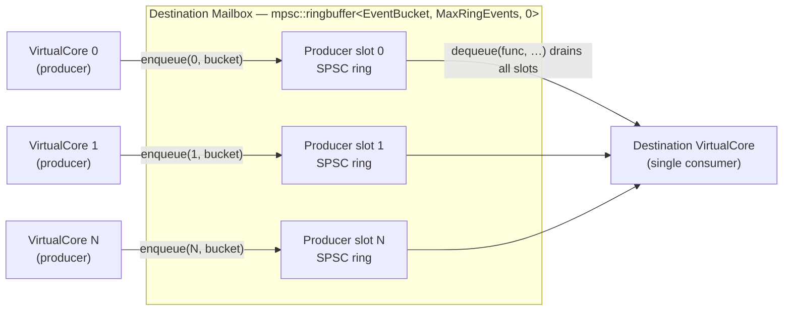

# Lock-free primitives

> **Audience:** Contributor · **Status:** stable · **Verified-against:** qb 3.0.0 (C++20 default, C++23 supported)

The lock-free building blocks under `qb/system/lockfree` — SPSC and MPSC ring buffers, an unbounded MPSC queue, and a spinlock — that back the engine's inter-core message path, plus the threading contract you must honor to use them directly.

**Prerequisites:** [Threading model](../2_core_concepts/threading_model.md), [Concurrency in qb](../2_core_concepts/concurrency.md) — **See also:** [Core invariants](./core_invariants.md), [The engine](../4_qb_core/engine.md), [API overview](./api_overview.md), [Glossary](./glossary.md)

## Summary

`qb` reaches for a lock only where it cannot avoid one. The hot path between cores — every cross-core event — travels through a lock-free multi-producer/single-consumer ring buffer, with no `std::mutex` on the message path (`src/qb/core/Main.h:299`). This page documents the four primitives that make that possible: the SPSC ring buffer (`qb::lockfree::spsc::ringbuffer`), the sharded MPSC ring buffer built on top of it (`qb::lockfree::mpsc::ringbuffer`), the unbounded Michael-Scott MPSC queue (`qb::lockfree::mpsc_unbounded_queue`), and the TTAS spinlock (`qb::lockfree::SpinLock`) used for the round-robin enqueue path.

Application code rarely touches these. The actor model — `push`, `send`, `reply`, `broadcast` — is the supported interface for inter-actor and inter-core communication, and it abstracts every primitive below behind a safer, type-checked surface. Read this page when you are contributing to the engine, embedding a primitive in your own framework-adjacent code, or reasoning about why the message path has the performance and safety properties it does.

These primitives are correct only under tightly scoped threading contracts. Each one names exactly which thread may call which method. Violating that contract does not raise a compile error — it corrupts state silently. Treat the per-primitive contract sections below as load-bearing.

## The real-multithread contract

`qb-core` is a share-nothing runtime: each `VirtualCore` runs on one thread and never shares actor state, so almost nothing in the actor layer needs an atomic or a lock ([Core invariants](./core_invariants.md)). The lock-free primitives are the narrow exception — they are the seam where genuinely concurrent threads meet. That seam is governed by one rule per primitive:

| Primitive | Concurrent producers | Concurrent consumers | Synchronization |
| --- | --- | --- | --- |
| `spsc::ringbuffer` | exactly one | exactly one | none (separate cache-line-isolated indices) |
| `mpsc::ringbuffer`, indexed enqueue | one per index | exactly one | none — caller-bound producer slots |
| `mpsc::ringbuffer`, round-robin enqueue | many | exactly one | per-producer `SpinLock` |
| `mpsc_unbounded_queue` | many | exactly one | lock-free (Michael-Scott) |

"Exactly one consumer" is not advisory. In the SPSC buffer, `write_index_` is written only from the enqueue side and `read_index_` only from the dequeue side; a second producer or a second consumer races those stores and the result is undefined (`src/qb/system/lockfree/spsc.h:153`). The MPSC `dequeue` and `consume_all` overloads are likewise single-consumer only (`src/qb/system/lockfree/mpsc.h:171`).

These types live in `qb` (the foundation shared by `qb-io` and `qb-core`), not in either library exclusively. They depend on the canonical time model (`qb::duration`, `qb::mono_time`; see [API overview](./api_overview.md)) and on cache-line constants from `qb/utility/prefix.h`.

## `SpinLock`

- **Header:** `qb/system/lockfree/spinlock.h`
- **Type:** `qb::lockfree::SpinLock`

A test-and-test-and-set (TTAS) busy-wait mutex over a single `std::atomic<bool>` (`src/qb/system/lockfree/spinlock.h:180`). A contending thread loops ("spins") on a relaxed load — issuing `qb::spin_loop_pause()` between reads — and only retries the atomic exchange once the lock appears free, which reduces cache-line ping-pong under contention (`src/qb/system/lockfree/spinlock.h:159`).

`SpinLock` satisfies the C++ *BasicLockable* requirement (`lock()` / `unlock()`), so it composes directly with `std::lock_guard<SpinLock>` — which is exactly how `mpsc::ringbuffer` uses it (`src/qb/system/lockfree/mpsc.h:137`).

### Interface

```cpp
// src: src/qb/system/lockfree/spinlock.h
namespace qb::lockfree {
class SpinLock {
public:
    SpinLock() noexcept;                                       // starts unlocked
    SpinLock(const SpinLock &) = delete;                       // non-copyable
    SpinLock(SpinLock &&)      = delete;                       // non-movable

    [[nodiscard]] bool locked() const noexcept;                // is the lock held?
    [[nodiscard]] bool trylock() noexcept;                     // one attempt, no spin
    [[nodiscard]] bool trylock(int64_t spin) noexcept;         // up to `spin` retries
    [[nodiscard]] bool trylock_for(qb::duration timespan) noexcept;
    [[nodiscard]] bool trylock_until(qb::mono_time deadline) noexcept;
    void lock() noexcept;                                      // spin until acquired
    void unlock() noexcept;
};
}
```

### Contract and behavior

- **Non-copyable, non-movable.** All four copy/move special members are deleted (`src/qb/system/lockfree/spinlock.h:53`). A `SpinLock` must stay put in memory — embed it as a member, never pass it by value.
- **Timed methods use the monotonic clock.** `trylock_for(qb::duration)` computes its deadline with `qb::mono_now()` (steady clock), never wall time, so adjusting the system clock cannot extend or shorten the wait (`src/qb/system/lockfree/spinlock.h:123`). `trylock_until(qb::mono_time)` delegates to `trylock_for(deadline - qb::mono_now())`.
- **A past deadline degrades to a single try.** Because `trylock_until` subtracts the current time from the deadline, a deadline already in the past yields a negative `qb::duration`; the `do … while` body still runs once, so the call performs exactly one non-blocking `trylock()` and returns its result rather than failing outright (`src/qb/system/lockfree/spinlock.h:147`).
- **Try-acquire results are `[[nodiscard]]`.** `trylock`, its timed variants, and `locked()` are marked `[[nodiscard]]`; ignoring the return value is a logic error the compiler will warn about.

### When to reach for it

Use `SpinLock` only for critical sections that are a handful of instructions long and contended rarely, where the syscall overhead of a `std::mutex` would dominate. The cost model is the inverse of a sleeping mutex: a thread that cannot acquire the lock burns 100% of its core spinning. If the section can be held for more than a few instructions, or contention is high, a `std::mutex` is the correct choice. Inside the framework, the only use is the per-producer lock in the MPSC round-robin enqueue path (below).

## SPSC ring buffer

- **Header:** `qb/system/lockfree/spsc.h`
- **Types:** `qb::lockfree::spsc::ringbuffer<T, _MaxSize>` (fixed) and `qb::lockfree::spsc::ringbuffer<T, 0>` (runtime-sized)

A bounded, wait-free single-producer/single-consumer FIFO. The producer advances `write_index_`; the consumer advances `read_index_`. The two indices live on separate cache lines — `padding1` is sized `QB_LOCKFREE_CACHELINE_BYTES - sizeof(size_t)` — so the producer's and consumer's writes never trigger false sharing (`src/qb/system/lockfree/spsc.h:56`). Coordination uses acquire/release ordering on the indices; no lock is taken on either side.

### Type requirements and capacity

- **`T` must be trivially copyable.** A `static_assert` enforces this, because the bulk enqueue/dequeue paths move elements with `std::memcpy` (`src/qb/system/lockfree/spsc.h:52`). The single-element `enqueue(T const&)` placement-news a copy, but for the trivially-copyable `T` the type allows, that is byte-equivalent to the bulk `memcpy`; no per-element constructor or destructor runs on the bulk path.
- **One slot is reserved.** A buffer of requested capacity *N* allocates *N + 1* slots: the extra slot disambiguates full from empty (the buffer is full when advancing the write index would collide with the read index). Usable capacity equals the requested `_MaxSize` (fixed variant) or the constructor argument (runtime variant) (`src/qb/system/lockfree/spsc.h:360`).
- **Fixed vs. runtime size.** `ringbuffer<T, _MaxSize>` embeds a `std::array<T, _MaxSize + 1>` sized at compile time. `ringbuffer<T, 0>` takes the size as a constructor argument and allocates `new T[size + 1]` (`src/qb/system/lockfree/spsc.h:469`).

### Interface

The two specializations expose the same public surface (signatures shown for the fixed variant):

```cpp
// src: src/qb/system/lockfree/spsc.h
namespace qb::lockfree::spsc {
template <typename T, std::size_t _MaxSize>
class ringbuffer {
public:
    // --- producer side (one thread only) ---
    bool   enqueue(T const &t) noexcept;                       // one item; false if full
    template <bool _All = true>
    size_t enqueue(T const *t, size_t size) noexcept;          // bulk; returns count enqueued

    // --- consumer side (one thread only) ---
    bool   dequeue(T *ret) noexcept;                           // one item; false if empty
    size_t dequeue(T *ret, size_t size) noexcept;              // bulk; returns count dequeued
    template <typename Func>
    size_t dequeue(Func const &func, T *ret, size_t size) noexcept;   // dequeue then func(ret, n)
    template <typename Func>
    size_t consume_all(Func const &func) noexcept;             // func(segment, len) per segment

    // --- either side, but observe the contract below ---
    [[nodiscard]] bool empty() const noexcept;
};
}
```

- **Bulk enqueue is all-or-nothing by default.** The `_All` template parameter defaults to `true`: `enqueue<true>(t, size)` enqueues every element or none, returning `0` when there is insufficient room (`src/qb/system/lockfree/spsc.h:186`). Set `_All = false` for a partial enqueue that takes as many elements as fit.
- **`consume_all` avoids the intermediate copy.** It invokes `func(T *segment_start, size_t segment_length)` directly over the buffer's internal storage. Because the ring wraps, a full traversal can call `func` twice — once per contiguous segment (`src/qb/system/lockfree/spsc.h:300`).

### Where the engine uses it

The SPSC buffer is the building block of the MPSC mailbox, not a directly used type in the actor layer. Each producer slot of the inter-core mailbox is one SPSC ring buffer (next section).

## MPSC ring buffer

- **Header:** `qb/system/lockfree/mpsc.h`
- **Types:** `qb::lockfree::mpsc::ringbuffer<T, max_size, nb_producer>` (fixed producer count) and `qb::lockfree::mpsc::ringbuffer<T, max_size, 0>` (runtime producer count)

A bounded multi-producer/single-consumer ring buffer, built as an array (fixed) or vector (runtime) of per-producer SPSC rings. Each producer owns a dedicated SPSC ring, so producers that write to distinct rings never contend; the single consumer drains across all rings. Each `Producer` struct pads its `SpinLock` out to a full cache line to keep producers off each other's cache lines (`src/qb/system/lockfree/mpsc.h:58`).

This is the core data structure for inter-`VirtualCore` communication. See [Where the engine uses it](#where-the-engine-uses-it-1) below.

Each destination core owns one mailbox; every other core writes into its own dedicated SPSC slot of that mailbox, and the destination core is the sole consumer that drains across all slots:



The producer index is the **sender's** resolved core id, so each producer is permanently bound to one slot and rides the lock-free indexed path — no `SpinLock`, no cross-producer contention (`source/core/src/Main.cpp:138`). The single consumer appends each slot's items into one output buffer rather than overwriting (`src/qb/system/lockfree/mpsc.h:176`).

### Two enqueue families — read this before using

The enqueue API splits into two families with very different safety properties. Choosing the wrong one is the most common way to misuse this type.

**Indexed enqueue — no lock, caller-bound producers.** The compile-time `enqueue<_Index>(...)` and runtime `enqueue(index, ...)` overloads take **no lock**. They write straight into the SPSC ring at that index, which is correct only if at most one thread ever uses a given index (`src/qb/system/lockfree/mpsc.h:76`, `:104`). This is the fast path: when each producer thread is permanently bound to its own ring — as in the engine, where the producer index is the sender core's id — no synchronization is needed at all.

**Round-robin enqueue — `SpinLock`-guarded, any thread.** The `enqueue(T const&)` and `enqueue(T const*, size)` overloads pick a producer ring via a `static thread_local` counter modulo the producer count, then take that producer's `SpinLock` under a `std::lock_guard` before writing (`src/qb/system/lockfree/mpsc.h:133`). These overloads are safe to call concurrently from arbitrarily many threads, at the cost of the spinlock; the modulo also balances load across rings.

```cpp
// src: src/qb/system/lockfree/mpsc.h
namespace qb::lockfree::mpsc {
template <typename T, std::size_t max_size, size_t nb_producer = 0>
class ringbuffer {
public:
    // --- indexed enqueue: NO lock; one thread per index ---
    template <size_t _Index>             bool   enqueue(T const &t);
    template <size_t _Index, bool _All = true>
                                         size_t enqueue(T const *t, size_t size);
    bool   enqueue(size_t index, T const &t);
    template <bool _All = true>
    size_t enqueue(size_t index, T const *t, size_t size);

    // --- round-robin enqueue: per-producer SpinLock; any thread ---
    size_t enqueue(T const &t);
    template <bool _All = true>
    size_t enqueue(T const *t, size_t size);

    // --- consumer side (one thread only) ---
    size_t dequeue(T *ret, size_t size);                       // drains across all rings
    template <typename Func>
    size_t dequeue(Func const &func, T *ret, size_t size);
    template <typename Func>
    size_t consume_all(Func const &func);

    auto  &ringOf(size_t index);                               // direct SPSC-ring access
};
}
```

### Contract and behavior

- **At least one producer is required (runtime variant).** `ringbuffer<T, max_size, 0>` deletes its default constructor and asserts `nb_producer > 0` in its constructor, because the round-robin paths compute `tl_index % _nb_producer` — zero producers would be a division by zero (`src/qb/system/lockfree/mpsc.h:267`, `:280`).
- **`dequeue(T*, size)` appends across producers.** The single-consumer drain advances the output pointer by the count taken from each ring, so items from later producers are appended after earlier ones rather than overwriting them. The in-source comment is explicit that the alternative is silent data loss (`src/qb/system/lockfree/mpsc.h:176`).
- **`ringOf(index)` is an escape hatch.** It returns the underlying SPSC ring by reference for direct access. The SPSC single-producer/single-consumer contract then applies to whatever you do with it; there is no MPSC-level guard.

### Where the engine uses it

Each `VirtualCore` consumes from exactly one inbound mailbox. A `Mailbox` is a `lockfree::mpsc::ringbuffer<EventBucket, MaxRingEvents, 0>` — the runtime-producer-count specialization (`src/qb/core/Main.h:299`) — with the producer count fixed at construction to the number of cores (`std::make_unique<Mailbox>(nb_producers, …)` where `nb_producers = _core_set.getNbCore()`, `source/core/src/Main.cpp:126`). The mailboxes are owned by an internal `SharedCoreCommunication` instance held by `qb::Main` (`src/qb/core/Main.h:293`).

- **`EventBucket`** is a cache-line-aligned padding unit (`QB_LOCKFREE_EVENT_BUCKET_BYTES`, equal to `QB_LOCKFREE_CACHELINE_BYTES`, default 64) so event payloads stay cache-aligned in the ring (`src/qb/utility/prefix.h:131`).
- **`MaxRingEvents`** is `uint16_t::max() / QB_LOCKFREE_EVENT_BUCKET_BYTES` — the per-producer ring capacity, derived so a bucket count fits a 16-bit field (`src/qb/core/Main.h:296`).
- **Producers are core-bound.** `SharedCoreCommunication::send` enqueues into the destination mailbox with the *sender's* resolved core id as the producer index — `_mail_boxes[dest_index]->enqueue(source_index, …)` — so the engine rides the lock-free runtime-indexed path, not the spinlock-guarded round-robin path (`source/core/src/Main.cpp:138`).
- **The single consumer drains via the functor `dequeue` overload.** `VirtualCore::__receive__` calls `_mail_box.dequeue(func, _event_buffer->data(), MaxRingEvents)`, which copies each producer ring's pending `EventBucket`s into the core's event buffer and then invokes the functor over that buffer to dispatch them to the event router (`source/core/src/VirtualCore.cpp:201`). This is the copying `dequeue` path, not the zero-copy `consume_all` path described above.
- **Idle parking is a `condition_variable`, not the ring.** A `Mailbox` wraps the ring with a `std::mutex`/`std::condition_variable` pair used only when a core parks at non-zero latency: a busy producer calls `notify()` to wake an idle consumer (`src/qb/core/Main.h:319`, `source/core/src/VirtualCore.cpp:314`). At zero latency the consumer spins and `notify()` is a no-op. This parking lock is off the message path — the ring itself stays lock-free.

The full back-pressure protocol when a peer mailbox is full (bounded spin-then-yield, partial flush, guaranteed termination) is documented in [Core invariants](./core_invariants.md#bounded-inter-core-flush-no-cross-core-deadlock).

## Unbounded MPSC queue

- **Header:** `qb/system/lockfree/mpsc_unbounded_queue.h`
- **Type:** `qb::lockfree::mpsc_unbounded_queue<T>`

A lock-free, unbounded multi-producer/single-consumer queue implementing the Michael-Scott linked-list algorithm. Unlike the bounded `mpsc::ringbuffer`, it never reports "full" — it allocates a heap node per pushed item. The header names its intended use cases as coroutine ready-queues, task queues, and work-stealing tails, where back-pressure is handled elsewhere (`src/qb/system/lockfree/mpsc_unbounded_queue.h:7`). It is a standalone primitive: the engine's inter-core message path uses the bounded `mpsc::ringbuffer`, not this queue.

```cpp
// src: src/qb/system/lockfree/mpsc_unbounded_queue.h
namespace qb::lockfree {
template <typename T>
class mpsc_unbounded_queue : public nocopy {
public:
    void push(T item);                       // lock-free; safe from many producers
    bool pop(T &out);                        // single consumer only; false if empty
    [[nodiscard]] std::size_t size() const;  // approximate
    [[nodiscard]] bool empty() const;        // approximate; consumer only
};
}
```

### Contract and behavior

- **`push()` is lock-free and multi-producer-safe.** Any number of threads may push concurrently. A push allocates one heap node and links it via an atomic `exchange` on the tail (`src/qb/system/lockfree/mpsc_unbounded_queue.h:78`).
- **`pop()` is single-consumer only.** Only the one designated consumer thread may call `pop()`; it moves the value into `out` and returns `false` when the queue is empty (`src/qb/system/lockfree/mpsc_unbounded_queue.h:91`).
- **`T` must be movable.** `push` takes `T` by value and moves it into the node; `pop` moves the node's value into `out` (`src/qb/system/lockfree/mpsc_unbounded_queue.h:43`).
- **`size()` and `empty()` are approximate.** They reflect a momentary snapshot a producer can invalidate immediately; only the consumer should consult them, and only as a hint (`src/qb/system/lockfree/mpsc_unbounded_queue.h:117`).
- **A sentinel node always remains.** The constructor allocates one sentinel and points both `head_` and `tail_` at it; the destructor walks from `head_` deleting every remaining node (`src/qb/system/lockfree/mpsc_unbounded_queue.h:62`). Each `push` adds a heap node; each `pop` frees the consumed one. This trades the ring buffer's zero-allocation steady state for unbounded capacity.

## Pitfalls

- **Adding a second producer or consumer to an SPSC ring is undefined behavior, not a slowdown.** The indices are not CAS-protected; they assume one writer each. If you need many producers, use `mpsc::ringbuffer` (bounded) or `mpsc_unbounded_queue` (unbounded).
- **The MPSC indexed enqueue overloads take no lock.** `enqueue<_Index>` and `enqueue(index, …)` are safe only when one thread owns that index. If multiple unbound threads must push, use the round-robin `enqueue(T const&)` overloads, which take the per-producer `SpinLock`. The two families share a name; confirm which one you are calling.
- **A non-trivially-copyable `T` will not compile in an SPSC/MPSC ring.** The `static_assert` is deliberate: the bulk paths `memcpy`. Store handles, pointers, or trivially-copyable structs; for arbitrary movable types use `mpsc_unbounded_queue`.
- **A spinlock under real contention wastes a core.** `SpinLock::lock()` never sleeps. Use it only for sections of a few instructions with rare contention; otherwise prefer `std::mutex`.
- **`mpsc_unbounded_queue` allocates on every push.** It is unbounded by design; if you need a fixed memory ceiling or zero steady-state allocation, the bounded `mpsc::ringbuffer` is the right tool.
- **Do not reach for these in application code.** For inter-actor and inter-core messaging, use `push`, `send`, `reply`, and `broadcast` ([The event system](../2_core_concepts/event_system.md)). They enforce the threading contract for you and are the supported, type-checked path.

## See also

- [Threading model](../2_core_concepts/threading_model.md) — how a `VirtualCore` maps to a thread and how cross-core events ride the MPSC mailbox.
- [Core invariants](./core_invariants.md) — the share-nothing contract and the mailbox back-pressure protocol.
- [The engine](../4_qb_core/engine.md) — `qb::Main`, `SharedCoreCommunication`, and core lifecycle.
- [API overview](./api_overview.md) — the canonical time model (`qb::duration`, `qb::mono_time`) used by `SpinLock`.
- [Glossary](./glossary.md) — SPSC, MPSC, mailbox, and false-sharing definitions.
